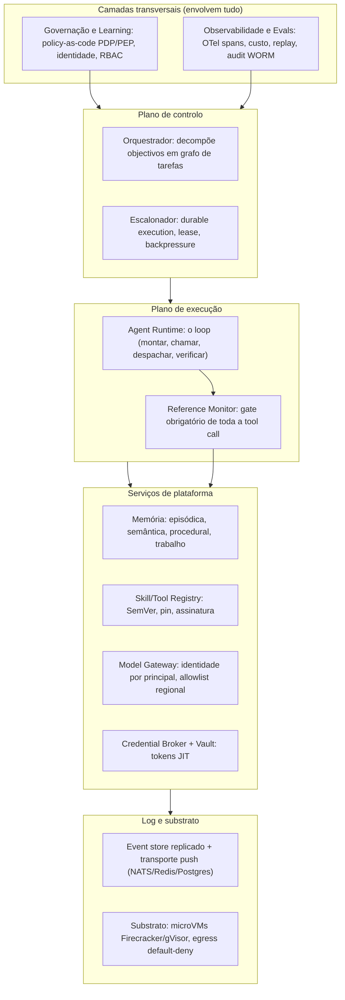
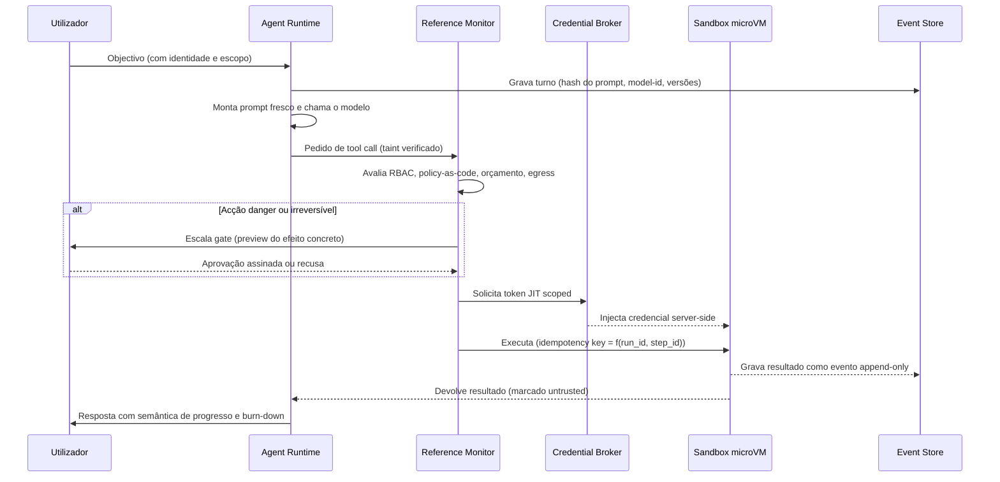
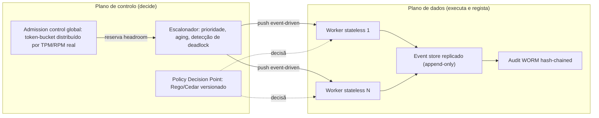
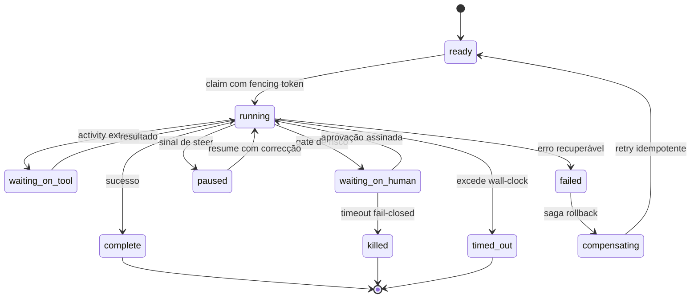
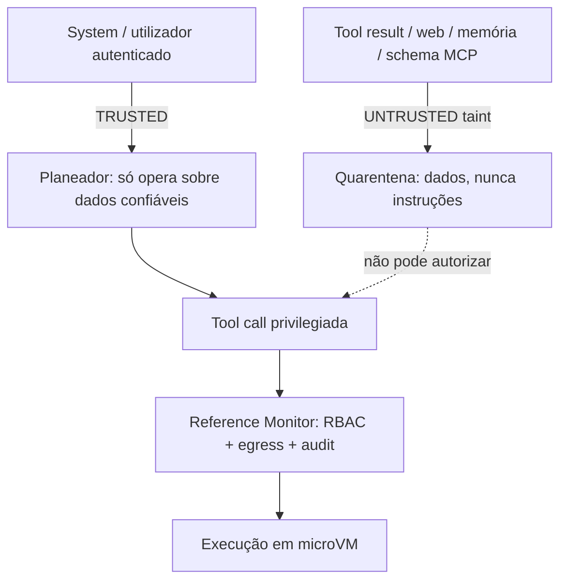
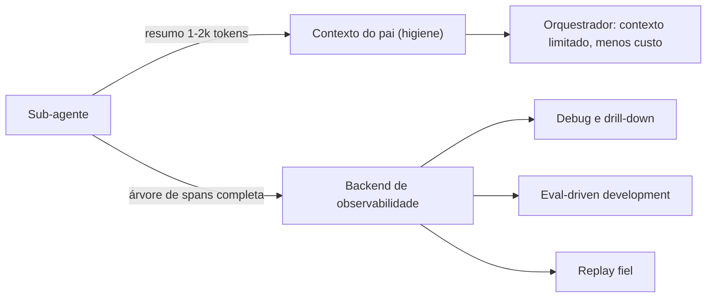
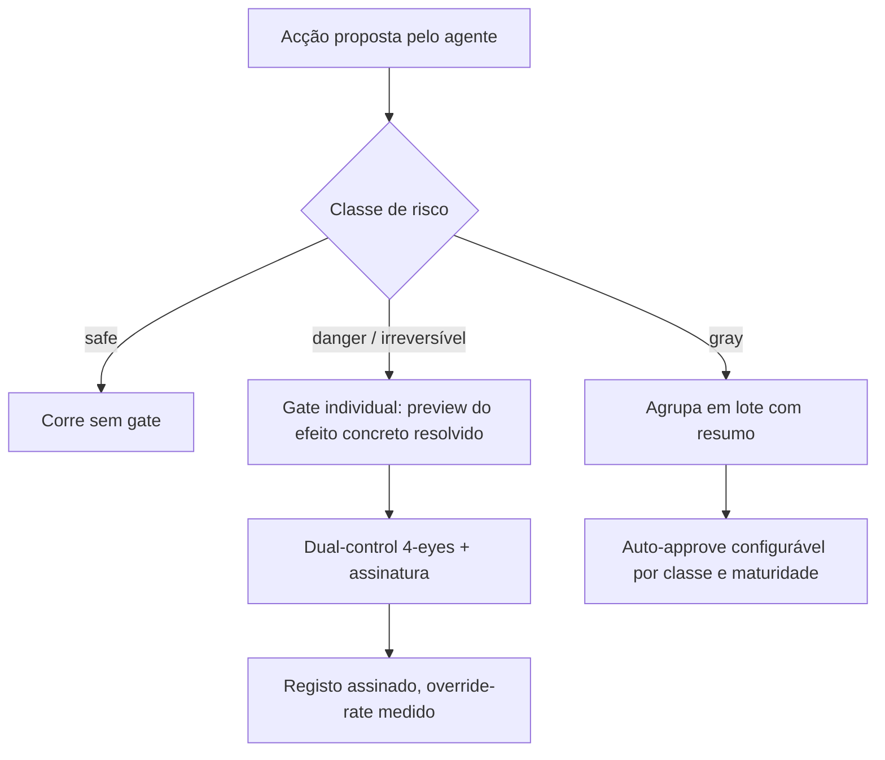
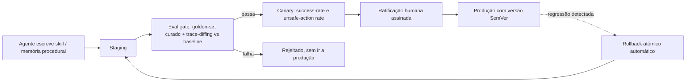
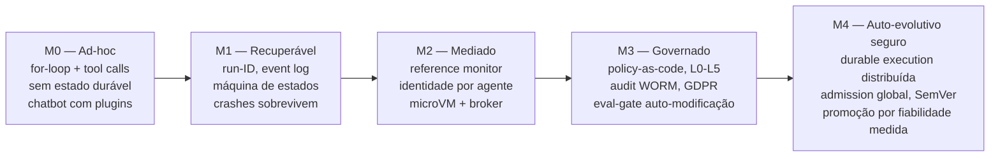

# O Agentic OS ideal: um blueprint de referência

> **TL;DR:** Um Agentic OS excelente trata o agente como cidadão de primeira classe — processo→agente, RAM→contexto, syscall→tool call — mas só o merece se impuser **três fundações não-negociáveis**: um *reference monitor* obrigatório por onde passa toda a tool call, **identidade única por agente** com cadeia de delegação até um humano responsável, e **execução durável** (idempotência ao nível do passo, replay determinístico, liveness por lease) sobre um event store replicado. Sobre estas fundações constrói-se isolamento ao nível do kernel, gates de risco com *tiering*, observabilidade em OpenTelemetry, versionamento SemVer com eval-gate para a auto-modificação, e conformidade GDPR/EU AI Act por desenho. Este documento sintetiza o plano-base, sete pareceres adversariais e a análise de tensões num desenho definitivo, decidindo cada trade-off em vez de os empilhar.

---

## O problema

A maioria dos "frameworks de agentes" de 2025-2026 é, na prática, um *chatbot com plugins*: um `for` loop que chama um modelo, despacha tool calls e reza para que nada corra mal. Funciona na demo e desintegra-se em produção. O agente entra em loop e ninguém percebe porque o PID está saudável; um sub-agente alucina um resumo plausível e o pai age sobre uma mentira; um crash a meio de um `POST` não-idempotente re-executa o efeito no retry; uma tool MCP adicionada "sem reiniciar" muta o schema no Dia 7 e reencaminha credenciais; e quando o regulador pede para provar *quem autorizou* uma acção, o audit trail responde "o pool" — o cenário *The Audit Log Lied*.

Um **Agentic OS** existe para tornar estas falhas *arquitecturalmente impossíveis*, não *politicamente desencorajadas*. O teste é simples e duro: se o sistema não impõe transições de estado, não contabiliza orçamento global de custo, não grava um audit trail *tamper-evident* e não medeia toda a tool call num ponto único, então não é um SO — é plumbing com boa relações-públicas.

O que torna um Agentic OS **excelente** não é ter mais features. É ter as fronteiras nos sítios certos: uma fronteira de segurança ao nível do kernel, uma fronteira de identidade por agente, uma fronteira de durabilidade ao nível do passo, e uma fronteira de contexto que higieniza o que o modelo vê **sem** deitar fora o que o auditor precisa. O modelo é a *menor* camada do sistema; o fosso é o runtime, a coordenação e a governação.

---

## Princípios de design

1. **Mediação total (reference monitor).** Toda a tool call, sem excepção, atravessa um gate do kernel que aplica identidade, política, orçamento, egress e audit *antes* de executar. Nenhum caminho de código chama uma tool directamente. É isto que torna segurança, governação e observabilidade *transversais* em vez de aspiracionais.
2. **Identidade antes de autoridade.** Cada agente e sub-agente é uma *non-human identity* única, com token *scoped* e *time-bound*, numa cadeia de delegação *on-behalf-of* que termina sempre num humano responsável. Autoridade = utilizador ∩ classe de agente, imposta pelo kernel.
3. **Durabilidade ao nível do passo.** Idempotency key = f(run_id, step_id), replay determinístico *resume-from-step*, liveness por lease/heartbeat com *fencing tokens*. Crashes são normais, não excepção.
4. **Contexto ≠ registo.** O que se injecta no modelo (higiene, cache, economia de tokens) é uma projecção distinta do que se persiste no backend (trajectória completa, replay, RCA). Descartar da injecção é legítimo; descartar do audit trail nunca é.
5. **Untrusted não comanda.** Conteúdo não-confiável (tool results, web, memória, descrições MCP) é marcado por *taint* e é fisicamente incapaz de autorizar acções privilegiadas. Tags in-band não são separação de privilégio.
6. **Fricção proporcional ao risco.** Gates com *tiering* (safe corre, gray agrupa, danger confirma) sobre um eixo de sensibilidade + egress + reversibilidade. Gates uniformes produzem *approval fatigue* e anulam a governação que dizem proteger.
7. **Evolução com rede.** A auto-modificação (memória procedural, skills auto-escritas) é a mudança de maior risco do sistema e passa por eval-gate + promoção estagiada + ratificação humana assinada — nunca chega a produção unilateralmente.
8. **Coerência por contrato, não por lock-in.** Portas versionadas (SemVer) e contratos de capability substituem tanto o vendor único como a explosão de integrações. O modelo, a memória e as tools são substituíveis sem rearquitectura.

---

## Arquitectura de referência

### Camadas

Governação e observabilidade **envolvem** tudo — não se penduram no fim. Entre elas e o substrato vive o kernel de mediação, que é o único caminho legítimo para efeitos externos.

**Como melhorámos o plano-base:** o event bus deixa de ser SQLite single-writer (SPOF e tecto de throughput) para ser um event store replicado com transporte *push*; e o *reference monitor* passa a existir como componente físico obrigatório entre runtime e serviços, concretizando a analogia de microkernel que o plano-base afirmava mas não impunha.

### Fluxo de execução

O loop é o batimento cardíaco, mas cada efeito externo é uma *activity* durável, isolada, idempotente e mediada. Note-se que o system prompt é remontado a cada turno **e** hasheado no evento — preserva-se a estabilidade de cache e ganha-se replay fiel.

**Nota de sintaxe:** as mensagens usam vírgulas e parênteses apenas dentro de texto, sem `;`, conforme exigido.

### Plano de controlo vs. plano de dados

A separação é o que permite escalar horizontalmente: workers *stateless*, estado particionado, e um log durável que é a fonte de verdade.

---

## Dimensão 1 — Arquitectura de sistemas

**Requisitos inegociáveis.** Identidade de execução durável ao nível do passo; replay determinístico *resume-from-step*; event store append-only replicado (sem single-writer/host como limite); liveness por lease + fencing tokens; *reference monitor* mandatório; máquina de estados com estados de suspensão de primeira classe; grafo de tarefas acíclico com detecção de deadlock; orçamento hierárquico com reserva atómica.

**Decisões de design.** Adoptamos **durable execution como primitivo** (integrar Temporal/Restate/DBOS ou implementar explicitamente o contrato: idempotência por passo, checkpoint intra-iteração, replay a partir do log, efeitos externos isolados em *activities*). A máquina de estados grosseira do plano-base (`ready→running→complete + blocked`) é substituída por estados duráveis distintos:

**Como melhorámos o plano-base.** O `waiting_on_human` deixa de colidir com a detecção de zumbis (o gate HITL já não parece um worker `running` pendurado). A liveness por PID — que falhava silenciosamente em containers remotos — é substituída por lease/heartbeat com TTL, coerente com o próprio substrato distribuído. O cap de delegação fixo de 2 torna-se **orçamento hierárquico configurável** com reserva atómica (compare-and-swap antes do spawn), eliminando a corrida no contador partilhado e permitindo map-reduce recursivo legítimo. A saga adiciona compensação onde os gates só preveniam.

---

## Dimensão 2 — Segurança

**Requisitos inegociáveis.** Isolamento ao nível do kernel por execução (microVM Firecracker/Kata ou gVisor); rede default-deny com egress allowlist e filtragem DNS; separação control-plane/data-plane contra prompt injection (dual-LLM/CaMeL + taint); credential broker (o agente nunca vê o segredo downstream); autoridade escopada ao principal (sem *confused deputy*); supply-chain com pin+hash+assinatura (anti rug-pull); audit *tamper-evident*; identidade criptográfica com mensagens inter-agente assinadas.

**Decisões de design.** Os *directory jails* e filtros de comando do plano-base — triviais de contornar com base64, metacaracteres ou symlinks — são **rebaixados a defesa-em-profundidade secundária**. A fronteira primária é a microVM com filesystem read-only + overlay efémero, seccomp mínimo e sem socket do host. Segredos vivem num vault; o broker troca o token *scoped* do agente por credenciais downstream server-side, com TTL curto e revogação. A resolução de tools "sem reiniciar" passa a exigir **revalidação criptográfica**: a definição aprovada é congelada por hash e verificada a cada chamada; qualquer mudança de schema exige re-aprovação.

Contra o vector nº1 (OWASP LLM01 / ASI01), a defesa não são tags `memory_context` in-band mas taint tracking real:

**Como melhorámos o plano-base.** O *hallucination gate* deixa de apenas verificar existência de ID e passa a **autenticar origem + autoridade + referência** via assinatura. O gate de risco muda de eixo: já não é só "destrutivo", mas **sensibilidade de dados + egress + reversibilidade** — porque o risco real é a exfiltração via tools "benignas" (padrão CamoLeak, CVSS 9.6), não o `rm -rf`. Memória derivada de conteúdo untrusted é marcada com proveniência e posta em quarentena, mitigando *memory poisoning* persistente (ASI06).

---

## Dimensão 3 — Escalabilidade e desempenho

**Requisitos inegociáveis.** Admission control **global** denominado em tokens (token-bucket distribuído sobre o TPM/RPM real); orçamento por árvore em tokens **e** custo (não iterações) com circuit breaker e cap de output de tools; layout de prompt cache-estável com cache-hit-rate como SLI; plano de dados horizontalmente escalável; scheduling *latency/priority-aware*; roteamento *cost/load-aware*; quotas multidimensionais por tenant.

**Decisões de design.** O modo de falha central do plano-base era "individualmente ok, agregadamente colapsa": 15 boards, cada um dentro do seu `max_spawn`, saturam colectivamente o rate limit partilhado. Resolvemo-lo com **reserva de headroom no admit**: o escalonador não faz spawn sem débito reservado no token-bucket global; `max_spawn` passa a ser derivado dinamicamente do headroom, não uma constante. O orçamento passa de iterações (proxy péssimo — uma iteração pode arrastar 200K tokens) para **tokens/$ com circuit breaker**.

O caso mais subtil é o cache. O plano-base reivindicava 85-95% de poupança de prefix caching **e** adoptava práticas que a destroem (prompt remontado, compressão na hot path, tools MCP dinâmicas). A resolução é um contrato de layout:

| Zona do prompt | Conteúdo | Regra |
|---|---|---|
| Prefixo imutável | system + tool set congelado no run | Byte-idêntico, nunca reordenar |
| Tail append-only | memory_context, timestamps, resultados | Só cresce, nunca muta o prefixo |
| Compressão | sumarização auxiliar | Só em checkpoints assíncronos, fora da hot path |

**Como melhorámos o plano-base.** Novas tools MCP só entram em *runs novos* (o que também serve o pinning de supply-chain). Adiciona-se backpressure real: filas limitadas com política declarativa de degradação graciosa (shed → defer → degradar para modelo mais barato → rejeitar), em vez de acumulação ilimitada e cascata de timeouts. O roteamento round-robin cego dá lugar a *least-loaded/token-aware* com *cost-aware model tiering*.

---

## Dimensão 4 — Observabilidade

**Requisitos inegociáveis.** Trajectória **completa** de cada agente e sub-agente persistida como árvore de spans (OTel GenAI semconv); cada tool call estruturada com tokens/custo; replay determinístico com captura de todos os inputs não-determinísticos; audit *tamper-evident* separado dos diagnósticos efémeros; contabilidade de custo em USD por span; detecção de loops semânticos em agente vivo; pilar de métricas com SLIs/SLOs.

**Decisões de design.** A contradição mais aguda do plano-base era "avaliamos trajectórias, não saídas" **contra** "o filho só devolve o resumo". Resolvemo-la desacoplando os dois eixos do Princípio 4:

Adoptamos **OpenTelemetry GenAI semconv** como wire format (spans `invoke_agent`/`execute_tool`/`chat`, atributos `gen_ai.usage.*`), evitando lock-in ao dashboard interno. A detecção de zumbis por PID (worker morto) é complementada por um **circuit breaker multi-sinal** para o agente *vivo* em loop: trip por cost/token velocity, wall-clock, action-dedup por hash(tool+args) e ausência de progresso — o gap que o PID nunca via.

**Como melhorámos o plano-base.** O "diagnósticos auto-limpam / só emito sinais operator-fixable" (filtragem no emit-time, que esconde padrões sistémicos) é substituído pelo padrão *wide events*: capturar tudo, filtrar no query-time. O audit trail deixa de ser "append-only por convenção" em SQLite e passa a hash-chain + WORM assinado, com o eval registado como `gen_ai.evaluation.result` ligado ao trace.

---

## Dimensão 5 — Governação e conformidade

**Requisitos inegociáveis.** Identidade não-humana única por agente com cadeia de delegação (proibido round-robin anónimo); enforcement programático via PDP/PEP no boundary de cada tool call (capacidades por allowlist default-deny); audit tamper-evident com retenção e legal hold; GDPR por desenho (minimização, redação de PII, TTL, crypto-shredding para o Art. 17); soberania por board (failover proibido de cruzar fronteira); taxonomia de autonomia L0–L5; supervisão humana efectiva (EU AI Act Art. 14); modelo de responsabilização explícito; gate de ratificação para auto-modificação.

**Decisões de design.** O `credential pool` round-robin do Model Gateway destruía a atribuição de identidade — base de toda a conformidade. Separamos dois eixos que ele confundia: **(1) identidade** — cada agente tem token OAuth *scoped/time-bound* codificando o par (utilizador, agente) e a política sob a qual actua; **(2) chaves de infra do provider** — podem ser pooled para throughput, mas cada chamada regista o principal, o modelo e a região. O policy-as-code (Rego/OPA ou Cedar) é versionado em git, assinado, com o changelog no próprio audit trail. A blocklist de tools de sub-agente (que *falha aberta* a cada tool nova) é substituída por **allowlist capability-scoped default-deny**.

A imutabilidade reconcilia-se com o direito ao apagamento por camadas: redação/tokenização de PII na ingestão, TTL por classe de dado, e **crypto-shredding** (apagar a chave por titular) — o registo encadeado permanece íntegro e verificável, mas os dados pessoais tornam-se irrecuperáveis. "Imutável" passa a significar *tamper-evidence do registo*, não retenção eterna do payload.

**Como melhorámos o plano-base.** Introduzimos a taxonomia L0–L5 com oversight proporcional ao impacto e **promoção baseada em fiabilidade medida** (ex.: erro <2% por 30 dias), com demoção automática em anomalia — em vez do quase-binário "HITL por default, autonomia opt-in". Os approval gates ganham aprovador autorizado, timeout **fail-closed** para irreversíveis, aprovação assinada (não-repúdio) e medição de override-rate anti-rubber-stamping.

---

## Dimensão 6 — Experiência de utilização (UX/DX)

**Requisitos inegociáveis.** Controlo bidireccional (pausar → injectar correcção → retomar) em qualquer superfície, não só observação; ver e aprovar o **plano** antes do spawn; gates com tiering de risco; paridade de superfície (aprovação-como-card em Slack/Telegram); trajectória sempre gravável; semântica de progresso e burn-down de custo; calibração activa de confiança; autonomia progressiva por maturidade do utilizador; loop de autoria de skills com dry-run e atribuição visível.

**Decisões de design.** O plano-base era 90% kernel e ~0% interacção — oferecia streaming read-only e recuperação pós-falha (observação passiva), não controlo. Adicionamos um estado durável `paused` e um canal de controlo fora-de-banda: qualquer superfície emite sinal, o loop faz *graceful pause* no fim do turno, aceita correcção e retoma (estilo AgentScope 1.0). Introduzimos um **gate de aprovação-de-plano** separado dos gates de acção — o humano vê e edita o grafo *antes* de queimar tokens.

Contra a *approval fatigue* (Anthropic: utilizadores experientes auto-aprovam >40%, anulando a governação), aplicamos o modelo SA-ROC:

**Como melhorámos o plano-base.** A trajectória do sub-agente, antes deitada fora no handoff, é sempre persistida (via Dimensão 4) — tornando o eval-driven development viável. O hard-stop cego por budget dá lugar a um prompt de exaustão graciosa a ~80% ("estender / resumir e parar / abortar"). Adiciona-se calibração de confiança (linguagem de incerteza seletiva, histórico de correções) porque over-trust é tão perigoso quanto under-trust.

---

## Dimensão 7 — Manutenção evolutiva

**Requisitos inegociáveis.** SemVer obrigatório em todo o artefacto comportamental mutável (skills, módulos de prompt, schemas de tool, schema de memória) ancorado a contrato público; manifesto de dependências imutável por trajectória; **eval-gate como admission control para auto-modificação**; rollback atómico; schema de memória versionado com migrações expand/contract; provider abstraction com capability contracts (swap de modelo é evento de variância, nunca silencioso); ciclo de deprecação formal; allowlist fail-closed.

**Decisões de design.** A auto-melhoria (o motor de evolução) é também a mudança de maior risco — *misevolution*/drift ocorre mesmo sem atacante. O plano-base tinha gates para *acções* mas nenhum para a *auto-modificação*; "datada e revisável" é defesa post-hoc, não admission control. Tratamos a auto-modificação como classe de mudança distinta:

**Como melhorámos o plano-base.** O system prompt "efémero, nunca persistido" destruía a reprodutibilidade. Mantemos a montagem efémera em runtime **mas** gravamos por turno o hash do prompt materializado + versão do código de montagem + model-id/params/seed — um manifesto imutável que torna replay e RCA reais (payloads completos em storage externo com IAM próprio, OTel content-capture mode 3). O golden-set curado e estável complementa os datasets derivados de falhas, apanhando regressões *novas* que o passado nunca apanharia. E a memória ganha a mesma disciplina de contrato de porta do Model Gateway — coerência por contrato, não por vendor único.

---

## Tensões e trade-offs resolvidos

| Tensão | Decisão |
|---|---|
| HITL não-negociável (Art. 14) **vs** approval fatigue / click-through | Gates com tiering SA-ROC: safe corre, gray agrupa, danger confirma com preview e dual-control; auto-approve por classe/maturidade; timeout fail-closed; override-rate medido. |
| Audit imutável **vs** GDPR direito ao apagamento | Tamper-evidence do *registo* (hash-chain + WORM) + crypto-shredding do *payload*; redação na ingestão, TTL por classe. "Imutável" = íntegro, não eterno. |
| Prefix caching (85-95%) **vs** prompt remontado / compressão / tools dinâmicas | Layout contratual: prefixo imutável + tail append-only; tool set congelado por run; compressão só em checkpoints; cache-hit-rate como SLI. |
| Auto-melhoria (motor de evolução) **vs** misevolution/drift | Auto-modificação como classe distinta: staging → eval-gate → canary → ratificação assinada → prod, com SemVer e rollback atómico. |
| Higiene de contexto (só resumo ao pai) **vs** trajectória para debug/eval | Desacoplar contexto de registo: resumo para o pai, árvore de spans completa sempre no backend. |
| Round-robin de credenciais (throughput) **vs** atribuição de identidade | Separar identidade (token scoped por principal) de chaves de infra (pooled); failover restrito à mesma fronteira de soberania. |
| Isolamento kernel (microVM) **vs** latência e hot-reload | microVMs com snapshot/restore (<125ms, restore 5-30ms) + pool pré-aquecido; jails só como defesa secundária. |
| SQLite single-writer (simplicidade) **vs** SPOF e tecto de throughput | Event store replicado + transporte push; SQLite-por-board só como unidade de sharding datada no MVP. |
| State machine rígida **vs** interromper/corrigir run vivo | `paused` e `waiting_on_human` como estados duráveis de primeira classe + gate de aprovação-de-plano. |

---

## Modelo de maturidade

Um Agentic OS não nasce ideal; evolui por níveis onde cada um **desbloqueia** o seguinte. Não se salta M1→M3: sem identidade e durabilidade, a governação de M3 é teatro.

- **M0 — Ad-hoc.** O loop existe, nada persiste. Um crash perde tudo; nenhuma tool call é mediada. É onde vive a maioria dos frameworks.
- **M1 — Recuperável.** Run-ID por tentativa, event log, máquina de estados. Crashes são recuperáveis mas a segurança e a identidade ainda são ad-hoc.
- **M2 — Mediado.** O *reference monitor* torna-se físico; cada agente tem identidade; isolamento ao nível do kernel e credential broker. A governação passa a ser possível.
- **M3 — Governado.** Policy-as-code, autonomia graduada, audit tamper-evident, conformidade GDPR/EU AI Act, eval-gate para auto-modificação. Deploy regulado desbloqueado.
- **M4 — Auto-evolutivo seguro.** Durable execution distribuída, admission control global, SemVer end-to-end, promoção baseada em fiabilidade medida. O sistema melhora-se a si próprio *com rede*.

---

## Roadmap de implementação

**Fase 0 — Fundações (P0).** Reference monitor mandatório; identidade por agente com delegação; durable execution (idempotency por passo, replay, lease/fencing); event store replicado com transporte push. Sem esta fase, tudo o resto é aspiracional.

**Fase 1 — Fronteira de segurança (P0).** microVM/gVisor com snapshot pool; rede default-deny + egress allowlist; credential broker/vault com tokens JIT; taint tracking control/data-plane; supply-chain com pin+hash+assinatura.

**Fase 2 — Governação e observabilidade (P1).** Policy-as-code PDP/PEP; OTel GenAI spans com trajectória completa de sub-agentes; audit hash-chain + WORM; circuit breaker multi-sinal; camada de conformidade GDPR (redação, TTL, crypto-shredding); allowlist regional de modelos.

**Fase 3 — Escala e controlo (P1).** Admission control global (token-bucket distribuído); orçamento em tokens/$; layout cache-estável com SLI; backpressure com degradação graciosa; scheduling priority-aware; estados de suspensão duráveis.

**Fase 4 — UX e evolução (P2).** Steer/interrupt em todas as superfícies; gate de aprovação-de-plano; gates SA-ROC; SemVer + eval-gate para auto-modificação; migrações de memória expand/contract; autonomia progressiva e L0–L5.

---

## Riscos e mitigações

| Risco | Impacto | Mitigação |
|---|---|---|
| Double-execution de efeito externo no retry | Corrupção do mundo externo | Idempotency key = f(run_id, step_id); saga de compensação |
| Falso-positivo de zumbi cross-host | Tarefa executada duas vezes | Lease/heartbeat + fencing token, nunca PID |
| Colapso agregado de rate limit | Board autodestrói-se | Admission control global com reserva de headroom |
| Prompt injection → tool privilegiada | Exfiltração, goal hijack | Taint tracking + reference monitor + egress default-deny |
| Rug-pull de tool MCP | Roubo de credenciais | Pin+hash+assinatura, re-aprovação em mudança de schema |
| Misevolution / drift de skill | Regressão comportamental silenciosa | Eval-gate + canary + ratificação assinada + rollback atómico |
| DSAR impossível (log imutável) | Violação GDPR Art. 17 | Crypto-shredding + TTL + redação na ingestão |
| Fuga de soberania por failover | Transferência ilegal de PII | Allowlist regional; failover proibido de cruzar fronteira |
| Approval theater / rubber-stamping | Governação inefectiva | Tiering SA-ROC, preview do efeito concreto, override-rate medido |
| Replay infiel após evolução de código | RCA e eval inválidos | Manifesto de versões por trajectória + hash do prompt |
| Cache thrash invisível | Explosão de custo silenciosa | Layout cache-estável + cache-hit-rate como SLI com alerta |

---

## Principais conclusões

- **As fronteiras fazem o SO, não as features.** Reference monitor, identidade por agente e durabilidade ao nível do passo são as três fundações sem as quais tudo o resto é plumbing.
- **Contexto ≠ registo.** A maior contradição do plano-base (higiene vs observabilidade) resolve-se desacoplando o que o modelo vê do que o backend persiste — não escolhendo um.
- **Fricção proporcional ao risco.** Gates uniformes anulam a governação que dizem impor; o tiering SA-ROC é o que torna a supervisão humana *efectiva*.
- **Imutável significa íntegro, não eterno.** Tamper-evidence + crypto-shredding reconciliam audit e GDPR sem impasse legal.
- **A auto-modificação é a mudança de maior risco** e merece o gate mais forte: eval + canary + ratificação assinada, versionado com SemVer e reversível.
- **O modelo é a menor camada.** Investe-se na infra — coordenação, identidade, durabilidade, governação — porque é aí que está o fosso e onde ~40% dos pilotos multiagente falham.

## Glossário rápido

- **Reference monitor:** ponto único e obrigatório por onde passa toda a tool call, aplicando política antes de executar.
- **Durable execution:** modelo em que cada passo é idempotente, checkpointado e reproduzível a partir de um log — resume-from-step, não resume-from-task.
- **Fencing token:** contador monotónico que invalida escritas de um worker obsoleto, garantindo liveness distribuída.
- **Taint tracking:** marcação de dados untrusted (tool results, web, memória) para que não possam autorizar acções privilegiadas.
- **Credential broker:** serviço que troca o token scoped do agente por credenciais downstream server-side; o agente nunca vê o segredo.
- **Crypto-shredding:** apagar a chave de cifra por titular para tornar dados pessoais irrecuperáveis sem reescrever o log encadeado.
- **SA-ROC:** modelo de escalonamento por risco (safe corre, gray agrupa, danger confirma) que combate a approval fatigue.
- **Misevolution:** deriva comportamental nociva de um agente auto-evolutivo, que ocorre mesmo sem atacante.
- **Manifesto de dependências:** registo imutável por trajectória com model-id/versão, hash do prompt e versões de skills/tools/memória, base do replay fiel.
- **Admission control global:** token-bucket distribuído que só permite spawn com headroom reservado no TPM/RPM real do provider.
- **Autonomia graduada (L0–L5):** níveis de autonomia com oversight proporcional ao impacto e promoção baseada em fiabilidade medida.