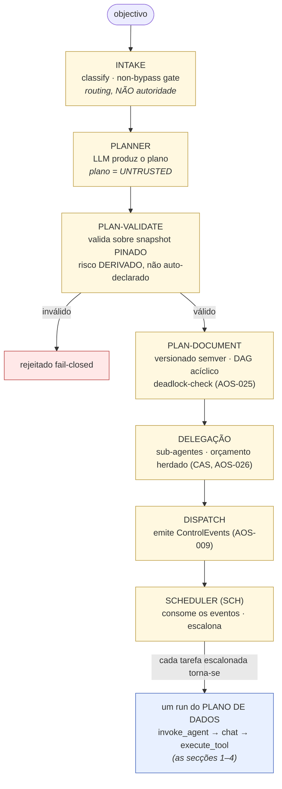
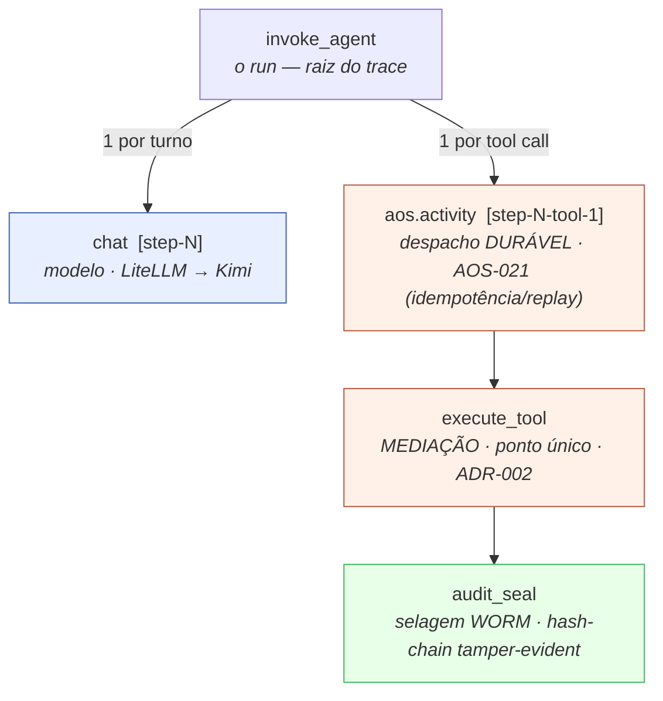
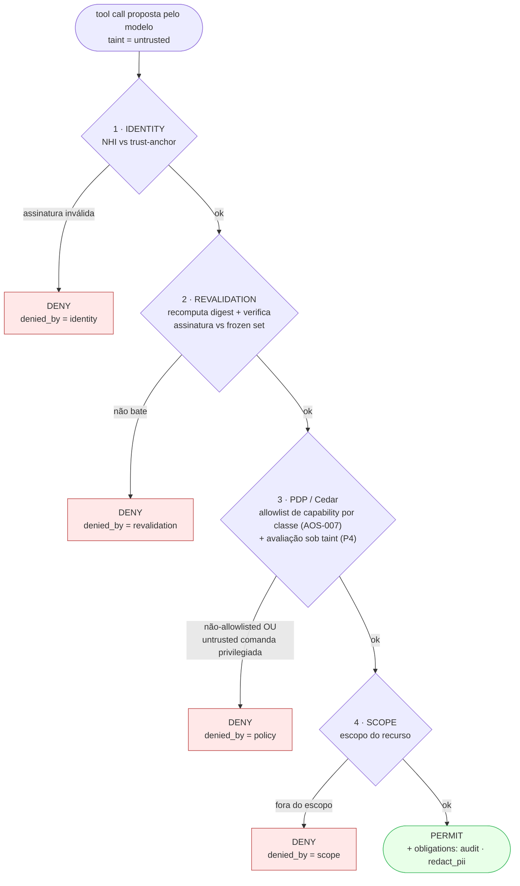
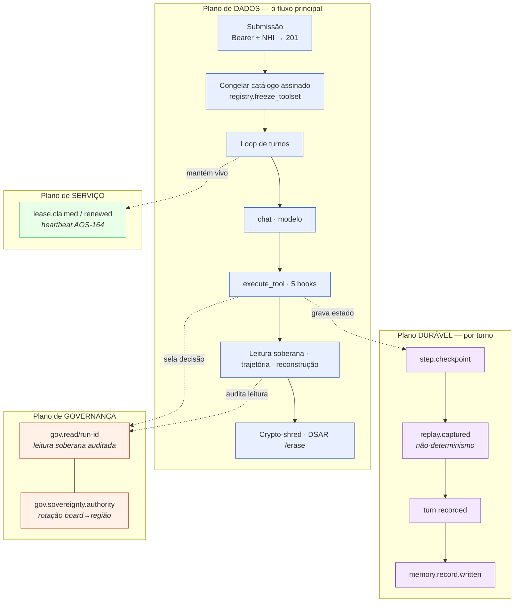

# Decomposição de subprocessos do nó `aos` (diagramas)

Este documento decompõe o **fluxo completo da app** nos seus **subprocessos internos**, derivado da
telemetria REAL (spans OTLP, eventos do Event Store, partições WORM) de um run de referência. É o
companheiro do [roteiro do ciclo de vida](ciclo-de-vida-manual.md): aquele mostra as fases
principais; este mostra o que corre *dentro* de cada uma.

> Fonte: run `run-app-195330` (Kimi via LiteLLM), stack `deploy/node/dev-hardened`. Contagens de
> spans/eventos observadas ao vivo.

---

## 0. Dois planos — porque o planeador NÃO aparece no trace de runtime

O AOS separa **plano de DADOS** de **plano de CONTROLO**. A telemetria de runtime (secções 1–4)
mostra só o **plano de dados** — o loop que o nó implantado (`cmd/aos`) corre: objectivo → modelo
propõe tool calls → mediação. O **Planeador/Meta-Orquestração (ORQ) + Escalonador (SCH)** são o
**plano de controlo**: decompõem um objectivo num plano validado (DAG) e delegam a sub-agentes.

> **ESTADO (honesto):** este plano de controlo está **construído e RATIFICADO** (spec `tecnica/18`,
> código em `packages/control-plane/orchestrator/`, **módulo próprio**), mas **NÃO está ligado a
> nenhum binário** — nem `cmd/aos` (o nó) nem `cmd/aos-demo` o importam. Por isso **não emite spans
> no runtime**: o nó implantado corre o loop de dados; o planeador/orquestrador é maquinaria de
> plano de controlo ainda não integrada no caminho de execução. Quando ligado, **cada tarefa que o
> SCH escalona torna-se um run do plano de dados** — ou seja, a árvore da secção 1 passa a ser uma
> *folha* deste grafo.

---

## 1. Árvore de subprocessos em runtime (spans OTLP) — plano de DADOS

Todo o run vive sob **um** span `invoke_agent`; cada turno e cada tool call desdobram-se em
subprocessos aninhados. Nada corre sem deixar um span.

---

## 2. Dentro de `execute_tool` — a cadeia de hooks fail-closed

O `execute_tool` não é atómico: corre uma cadeia de gates onde **cada um pode NEGAR** (o atributo
`aos.decision.denied_by` diz qual). Uma tool call proposta pelo modelo entra com `taint=untrusted`.

No run de referência, `web_post` (cap:http.post) morre em **3 · PDP** com `denied_by=policy`: a
authority contém a capability e a região é `eu`, mas o `taint=untrusted` faz o gate P4 negar
("untrusted não comanda").

---

## 3. Os quatro planos que correm em paralelo

O plano de DADOS é o fluxo "feliz"; três planos de subprocessos correm ao lado e são o que separa
um agente comum de um **OS agêntico governado**.

---

## 4. Mapa fase → subprocessos (com evidência)

| Fase principal | Subprocessos internos | Evidência (span / evento / partição) |
|---|---|---|
| **Submissão** | verificar Bearer (JWKS · RS256 · aud/exp · **anti-replay jti**) · admissão (token-bucket) · **selar residência** · `run.created` · lease | `lease.claimed` |
| **Arranque do run** | **congelar** catálogo assinado · manifesto | span `registry.freeze_toolset` · evento `run.toolset.frozen` |
| **Cada turno** | montar prompt · **`chat`** (modelo) · parsear resposta · enriquecer tool calls (capability do registry) | span `chat` |
| **Cada tool call** | `aos.activity` (despacho durável) → `execute_tool` (5 hooks) → `audit_seal` | spans `aos.activity` · `execute_tool` · `audit_seal` |
| **Fim de turno (durável)** | checkpoint · capturar não-determinismo · gravar turno · escrever memória | `step.checkpoint` · `replay.captured` · `turn.recorded` · `memory.record.written` · span `memory.put` |
| **Ingestão** | **redacção** de conteúdo untrusted | span `aos.ingest.redacted` |
| **Leitura soberana** | verificar OIDC do leitor · **região leitor == run** · selar leitura no WORM (D6) | partição `gov.read/run-<id>` |
| **Trajetória / reconstrução** | replay do Event Store (SSE) · desembrulhar KEK · decifrar | `replay.captured` · `GET /reconstruct` |
| **Crypto-shred** | índice partição-por-titular · **re-check de legal-hold** (TOCTOU) · `deletion_allowed`+DELETE da KEK (Transit/TLS) · **verificar WORM pós-shred** | KEK destruída no Vault |
| **Soberania (background)** | rotação/auditoria da fonte board→região | partição `gov.sovereignty.authority` |
| **Serviço (background)** | lease TTL + heartbeat (AOS-164) | `lease.claimed` / `lease.renewed` |

---

*Derivado da telemetria de `run-app-195330`. Os diagramas renderizam no GitHub e em qualquer viewer
com suporte Mermaid.*
