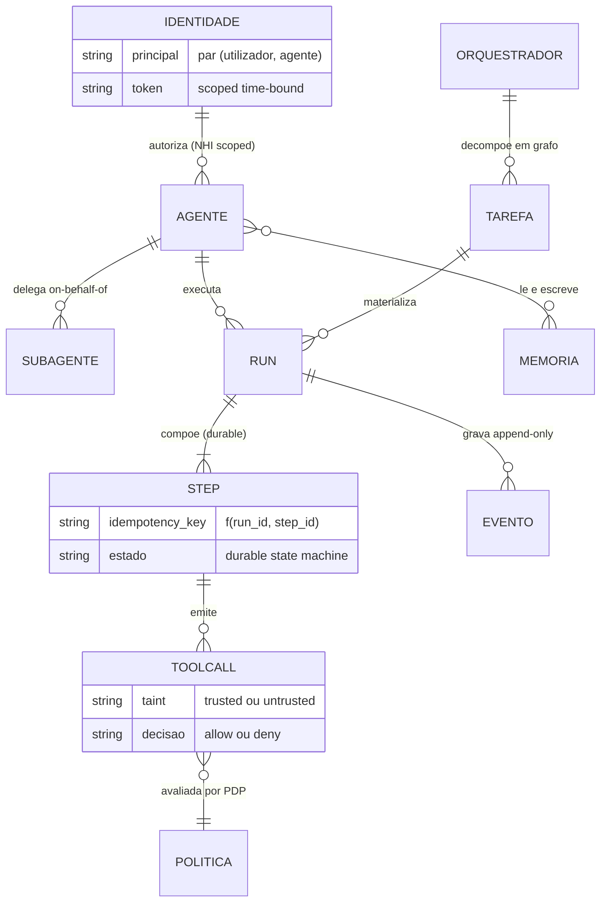
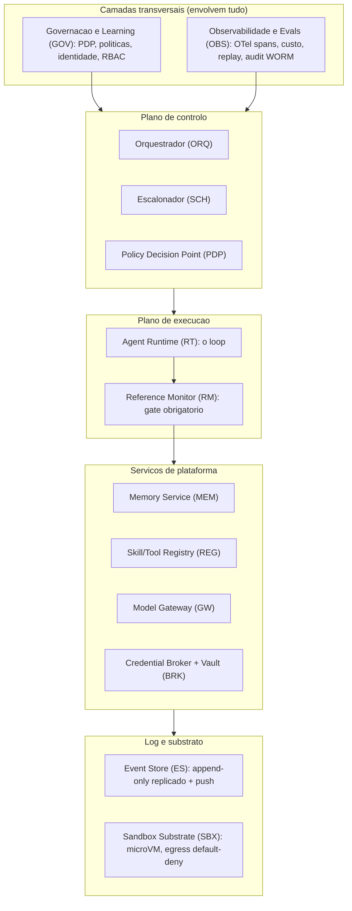

# System Specification — AOS (Agentic OS de Referência)

| Campo | Valor |
|---|---|
| Produto | AOS — Agentic OS de Referência |
| Documento | System Specification — Visão Executiva Consolidada |
| Versão | 1.0 |
| Data | Julho de 2026 |
| Classificação | Documento de Referência — Aberto |
| Documento-fonte | `_FONTE_agentic-os-ideal.md` |
| Documentos relacionados | `specs/01_Engineering_Standards_e_Handoff.md`, `specs/EPIC-01_Fundacoes_Plano_Controlo.md` … `specs/EPIC-11_Testes_Qualidade.md`, `tecnica/00_Arquitectura_Solucao.md` |

---

## 1. Propósito deste documento

Este documento é a **especificação de sistema** do AOS — Agentic OS de Referência: a visão executiva consolidada que amarra, num único artefacto, o *porquê* (problema e objectivos), o *quê* (capacidades e modelo de domínio), o *como* estrutural (arquitectura em camadas, stack de referência, ADRs) e o *quanto* (drivers não-funcionais, KPIs e SLOs). Serve três audiências: quem decide (patrocínio e aprovação), quem arquitecta (fronteiras e trade-offs) e quem implementa (mapeamento capacidade → componente → epic → tickets AOS-NNN).

O AOS é um **runtime deployável de referência** — um sistema que se instala e corre para correr, coordenar e governar agentes de IA. A **forma do produto é fixada pela `specs/00_AOS_Carta.md §2`** (v1 = o nó `aos`); esta secção deixa de a hesitar ("blueprint vs plataforma"). Não descreve um cliente institucional concreto. Onde este documento resume, os documentos técnicos (`tecnica/`) aprofundam e os ficheiros de epic (`specs/`) tornam executável.

**Precedência (reconciliada — Carta §1, emenda 1.2):** sobre a *forma do produto e o estado das decisões* prevalece a `specs/00_AOS_Carta.md` (a autoridade congelada); sobre o *detalhe técnico* prevalece a visão congelada `_FONTE_agentic-os-ideal.md` (+ `_BRIEF`), que só muda por emenda datada na Carta. O critério **forma vs detalhe**: "forma" = o que se entrega/opera e o estado de uma decisão (Carta); "detalhe" = como um subsistema funciona por dentro (`_FONTE`/`tecnica/`).

---

## 2. Visão executiva

### 2.1 O problema

A maioria dos frameworks de agentes de 2025–2026 é, na prática, um *chatbot com plugins*: um `for` loop que chama um modelo, despacha *tool calls* e reza para que nada corra mal. Funciona na demo e desintegra-se em produção. O agente entra em loop e ninguém percebe porque o PID está saudável; um sub-agente alucina um resumo plausível e o pai age sobre uma mentira; um *crash* a meio de um `POST` não-idempotente re-executa o efeito no *retry*; uma *tool* MCP adicionada "sem reiniciar" muta o *schema* no Dia 7 e reencaminha credenciais; e quando o regulador pede para provar *quem autorizou* uma acção, o *audit trail* responde "o pool". O teste é duro: se o sistema não impõe transições de estado, não contabiliza orçamento global de custo, não grava um *audit trail tamper-evident* e não medeia toda a *tool call* num ponto único, então não é um sistema operativo — é *plumbing* com boas relações-públicas.

### 2.2 A solução

O AOS existe para tornar estas falhas **arquitecturalmente impossíveis**, não politicamente desencorajadas. A tese central assenta em três fundações não-negociáveis: um **Reference Monitor** mandatório por onde passa toda a *tool call*; **identidade não-humana por agente** com cadeia de delegação *on-behalf-of* que termina sempre num humano responsável; e **execução durável ao nível do passo** (idempotência por passo, *replay* determinístico *resume-from-step*, *liveness* por *lease*) sobre um **Event Store** replicado. Sobre estas fundações constrói-se isolamento ao nível do *kernel*, gates de risco com *tiering*, observabilidade em OpenTelemetry, versionamento SemVer com *eval-gate* para a auto-modificação, e conformidade GDPR/EU AI Act por desenho. O que torna um Agentic OS excelente não são mais *features*, mas ter as fronteiras nos sítios certos — o modelo é a *menor* camada; o fosso é o *runtime*, a coordenação e a governação.

> **Nota de calibração (rigor técnico).** Neste conjunto, *«arquitecturalmente impossível»* designa um **objectivo de desenho** — a eliminação estrutural do *caminho* de falha (não existe via de código que a produza) — e **não** uma garantia absoluta. Permanece **risco residual** (defeitos de implementação, comprometimento do TCB, canais laterais) que é **gerido e medido**, não negado.

### 2.3 Objectivos

- **Mediação total:** nenhum caminho de código chama *tools* directamente; toda a *tool call* atravessa o Reference Monitor (identidade, política, orçamento, egress, audit) antes de executar.
- **Atribuição de identidade fim-a-fim:** cada acção rastreável até um humano responsável através da cadeia de delegação.
- **Durabilidade e reprodutibilidade:** zero efeitos duplicados no *retry*; 100% dos passos reproduzíveis por *replay*.
- **Fronteira de segurança forte:** isolamento por execução em microVM, egress *default-deny*, segredos que o agente nunca vê.
- **Governação efectiva:** *policy-as-code*, autonomia graduada L0–L5, audit WORM, HITL proporcional ao risco, *eval-gate* para auto-modificação.
- **Escala sem colapso agregado:** *admission control* global em tokens/$ que impede a autodestruição colectiva do *rate limit*.

### 2.4 Restrições e pressupostos

- **Idioma e âmbito:** documentação em PT-PT; produto standalone sem dependência de cliente institucional.
- **Substituibilidade por contrato:** modelo, memória e *tools* são substituíveis via portas versionadas (SemVer) — nem *vendor lock-in*, nem explosão de integrações.
- **Untrusted não comanda:** conteúdo não-confiável (*tool results*, web, memória, descrições MCP) é tratado como dados, nunca como instruções.
- **Pressupostos operacionais:** existe um substrato distribuído (não *single-host*); *crashes* são normais e não excepção; a auto-modificação nunca chega a produção unilateralmente.
- **Conformidade regulatória:** GDPR e EU AI Act são requisitos por desenho, não acréscimos posteriores.

---

## 3. Modelo de domínio

As entidades-chave do AOS e as suas relações: um **Agente** possui uma **Identidade** e delega em **Sub-agentes**; executa **Runs** compostos por **Passos (Steps)**; cada passo pode originar uma **Tool call** mediada pelo Reference Monitor e sujeita a **Política**; um **Orquestrador** decompõe objectivos numa **Tarefa** (grafo acíclico); a **Memória** persiste conhecimento distinto do contexto injectado.

- **Agente / Sub-agente:** unidade de execução com identidade própria; o sub-agente devolve ao pai um resumo (higiene de contexto) mas persiste a trajectória completa (registo).
- **Run:** uma tentativa identificada (`run_id`) de cumprir uma tarefa, com estado durável.
- **Passo (Step):** unidade de idempotência; `idempotency_key = f(run_id, step_id)`.
- **Tool call:** pedido de efeito externo, sempre mediado; marcado por *taint* conforme a origem dos dados.
- **Tarefa:** objectivo decomposto pelo Orquestrador num grafo acíclico.
- **Memória:** episódica, semântica, procedural e de trabalho; contexto ≠ registo.
- **Política / Identidade:** *policy-as-code* avaliada pelo PDP; identidade não-humana na cadeia de delegação.

---

## 4. Capacidades funcionais top-level

1. **Executar agentes com durabilidade** — loop montar → chamar → despachar → verificar sobre execução durável, com *replay* e *resume-from-step*.
2. **Mediar toda a acção** — gate único (Reference Monitor) que aplica identidade, política, orçamento, egress e audit.
3. **Orquestrar trabalho** — decompor objectivos em grafo de tarefas, delegar a sub-agentes, escalonar com *leases* e *backpressure*.
4. **Gerir identidade e autoridade** — emissão de tokens *scoped/time-bound* e cadeia de delegação até um humano.
5. **Isolar execução** — microVM por execução, rede *default-deny*, *credential broker* server-side.
6. **Gerir memória** — quatro tipos de memória com proveniência e migrações expand/contract.
7. **Governar por política** — *policy-as-code* PDP/PEP, autonomia L0–L5, conformidade GDPR/EU AI Act.
8. **Observar e auditar** — trajectória completa em OTel GenAI, *replay* determinístico, audit *hash-chain* + WORM.
9. **Controlar orçamento** — *admission control* global em tokens/$, *circuit breaker*, roteamento *cost/load-aware*.
10. **Controlo bidireccional** — pausar → corrigir → retomar; aprovação de plano; gates SA-ROC.
11. **Evoluir com rede** — SemVer + *eval-gate* + *canary* + ratificação assinada para auto-modificação.

---

## 5. Arquitectura de alto nível

Governação e Observabilidade **envolvem** tudo — não se penduram no fim. Entre elas e o substrato vive o *kernel* de mediação, único caminho legítimo para efeitos externos.

**Sumário de comunicações.** O Orquestrador (ORQ) decompõe o objectivo e o Escalonador (SCH) faz *push* event-driven de trabalho a *workers stateless* do Agent Runtime (RT). Cada *tool call* do RT atravessa obrigatoriamente o Reference Monitor (RM=PEP), que consulta o Policy Decision Point (PDP) para a decisão *allow/deny*, solicita ao Credential Broker (BRK) um token JIT injectado server-side, e executa dentro do Sandbox Substrate (SBX). Os resultados são gravados como eventos *append-only* no Event Store (ES), fonte de verdade que alimenta o *audit* WORM. O Model Gateway (GW) unifica o acesso aos LLMs com identidade por *principal*; o Memory Service (MEM) e o Skill/Tool Registry (REG) servem contexto e capacidades versionadas. Governação (GOV) e Observabilidade (OBS) instrumentam todas as camadas transversalmente.

---

## 6. Stack tecnológica de referência

As opções abaixo são as citadas na fonte; onde há alternativas, a escolha é por contrato e substituível.

| Preocupação | Opção de referência | Componente |
|---|---|---|
| Durable execution | **Contrato próprio** (idempotência por passo + checkpoint + replay sobre o Event Store), exposto por uma porta `Engine` agnóstica ao backend — Temporal / Restate / DBOS ficam como backend plugável opcional (**ADR-015 ratificado**, AOS-022) | RT, SCH |
| Event store / transporte | Log append-only replicado com *push*: NATS / Redis / Postgres | ES |
| Isolamento (microVM) | Firecracker / Kata; alternativa gVisor; FS read-only + overlay efémero, seccomp | SBX |
| Policy Decision Point | Rego/OPA ou Cedar (versionado e assinado em git) | PDP |
| Model Gateway | Interface unificada estilo LiteLLM; OAuth multi-provedor; allowlist regional | GW |
| Segredos / credenciais | Vault + Credential Broker com tokens JIT *scoped/time-bound* | BRK |
| Observabilidade | OpenTelemetry GenAI semconv (spans `invoke_agent`/`execute_tool`/`chat`) | OBS |
| Audit | *Hash-chain* + WORM assinado, separado de diagnósticos efémeros | OBS, GOV |
| Supply-chain de tools | MCP com pin + hash + assinatura; revalidação criptográfica por chamada | REG |
| Admission control | Token-bucket distribuído sobre TPM/RPM real; *circuit breaker* | SCH |

---

## 7. Drivers não-funcionais

| Driver | Alvo | Mecanismo (ADR) |
|---|---|---|
| Durabilidade de execução | Entrega *at-least-once* com idempotência downstream (0 efeitos **observáveis** duplicados) | Idempotency key por passo propagada e honrada pelo serviço externo; saga de compensação (ADR-001) |
| Disponibilidade do plano de controlo | 99,9% | ES replicado; workers stateless; sem SPOF (ADR-007) |
| Cold-start de sandbox | < 125 ms (restore 5–30 ms) | microVM snapshot + pool pré-aquecido (ADR-004) |
| Latência de avaliação do PDP p95 | < 15 ms | Política compilada avaliada em memória (ADR-002/011) |
| Overhead total de mediação por *tool call* | orçamento decomposto por sub-passo (PDP + CAS de admissão + broker->vault + append ao ES + egress/DNS) | Alvo agregado a ratificar por benchmark |
| Cache-hit-rate de prompt | > 80% (SLI) | Layout cache-estável (ADR-009) |
| Fidelidade de replay | 100% dos passos reproduzíveis | Captura de inputs não-determinísticos + hash de prompt (ADR-010) |
| Isolamento de segredos | Agente nunca vê segredo downstream | Credential broker JIT (ADR-006) |
| Conformidade | GDPR/EU AI Act por desenho | Crypto-shredding, PDP, HITL efectivo (ADR-011/013) |
| Segurança de auto-evolução | 0 auto-modificações não avaliadas em prod | Eval-gate como admission control (ADR-012) |

---

## 8. Mapeamento Capacidade → Componente → Epic

| Capacidade (§4) | Componente(s) | Epic |
|---|---|---|
| Executar agentes com durabilidade | RT, SCH, ES | EPIC-02 |
| Mediar toda a acção | RM, PDP | EPIC-01 |
| Orquestrar trabalho | ORQ, SCH | EPIC-03 |
| Gerir identidade e autoridade | GOV, RM | EPIC-01 / EPIC-09 |
| Isolar execução | SBX, BRK | EPIC-07 |
| Gerir memória | MEM, ES | EPIC-04 |
| Governar por política | GOV, PDP | EPIC-09 |
| Observar e auditar | OBS, ES | EPIC-08 |
| Controlar orçamento | SCH, GW | EPIC-03 / EPIC-06 |
| Controlo bidireccional | RT, GOV | EPIC-09 |
| Evoluir com rede | REG, OBS | EPIC-05 / EPIC-11 |

---

## 9. Modelo de maturidade e fases

Um Agentic OS não nasce ideal; evolui por níveis onde cada um **desbloqueia** o seguinte — não se salta M1→M3, porque sem identidade e durabilidade a governação de M3 é teatro.

| Nível | Nome | Marca |
|---|---|---|
| M0 | Ad-hoc | for-loop + tool calls, sem estado durável ("chatbot com plugins") |
| M1 | Recuperável | run-ID, event log, máquina de estados; crashes sobrevivem |
| M2 | Mediado | reference monitor físico, identidade por agente, microVM + broker |
| M3 | Governado | policy-as-code, L0–L5, audit WORM, GDPR, eval-gate de auto-modificação |
| M4 | Auto-evolutivo seguro | durable execution distribuída, admission global, SemVer, promoção por fiabilidade |

**Roadmap por fases.** **Fase 0** Fundações (reference monitor, identidade, durable execution, event store) · **Fase 1** Fronteira de segurança (microVM, egress default-deny, broker, taint, supply-chain) · **Fase 2** Governação & observabilidade (PDP/PEP, OTel, audit WORM, GDPR, allowlist regional) · **Fase 3** Escala & controlo (admission global, orçamento tokens/$, cache-estável, backpressure) · **Fase 4** UX & evolução (steer/interrupt, aprovação-de-plano, SA-ROC, SemVer + eval-gate, L0–L5).

---

## 10. Os doze epics do backlog

| Epic | Título | Foco | Range de tickets |
|---|---|---|---|
| EPIC-01 | Fundações do Plano de Controlo | Reference Monitor, Event Store replicado, identidade por agente | AOS-001 – AOS-012 |
| EPIC-02 | Agent Runtime & Execução Durável | Loop, durable execution, idempotência, replay, máquina de estados | AOS-013 – AOS-024 |
| EPIC-03 | Orquestração & Escalonamento | Grafo de tarefas, leases, admission control, backpressure | AOS-025 – AOS-034 |
| EPIC-04 | Memória & Persistência | Tipos de memória, contexto≠registo, migrações expand/contract | AOS-035 – AOS-044 |
| EPIC-05 | Registry & Supply-Chain | Registry versionado, MCP, pin+hash+assinatura | AOS-045 – AOS-054 |
| EPIC-06 | Model Gateway & Custos | Gateway, OAuth multi-provedor, roteamento, custos | AOS-055 – AOS-063 |
| EPIC-07 | Segurança & Isolamento | microVM, taint, credential broker, egress default-deny | AOS-064 – AOS-075 |
| EPIC-08 | Observabilidade & Evals | OTel spans, replay, circuit breaker, audit WORM, evals | AOS-076 – AOS-086 |
| EPIC-09 | Governação & Conformidade | Policy-as-code, L0–L5, GDPR, HITL, ratificação | AOS-087 – AOS-097 |
| EPIC-10 | Topologia, Operação & DR | Deployment, dashboards, alertas, runbooks, backup/DR | AOS-098 – AOS-108 |
| EPIC-11 | Testes & Qualidade | Testes, eval harness, carga, golden-sets, gates de qualidade | AOS-109 – AOS-118 |
| EPIC-12 | Experiência HITL/UX | Superfície de controlo, approval-card, aprovação-de-plano, paridade Slack/Telegram, anti-fadiga | AOS-119 – AOS-128 |

---

## 11. ADRs em vigor

| ADR | Decisão | Racional resumido |
|---|---|---|
| ADR-001 | Execução durável como primitivo | Idempotência por passo, checkpoint intra-iteração, replay resume-from-step, efeitos em *activities* |
| ADR-002 | Reference Monitor mandatório | Nenhum código chama tools directamente; mediação total torna segurança/governação transversais |
| ADR-003 | Identidade não-humana por agente | Token scoped/time-bound (utilizador, agente); autoridade = utilizador ∩ classe |
| ADR-004 | Isolamento ao nível do kernel | microVM (Firecracker/Kata) ou gVisor; FS read-only + overlay; seccomp; jails secundários |
| ADR-005 | Separação control/data-plane + taint | Conteúdo untrusted é dados, nunca instruções (dual-LLM/CaMeL); mitiga OWASP LLM01 |
| ADR-006 | Credential Broker com tokens JIT | Segredos no vault; broker injecta credenciais server-side, TTL curto, revogáveis |
| ADR-007 | Event Store replicado | Substitui SQLite single-writer por log replicado append-only com transporte push |
| ADR-008 | Admission control global em tokens/$ | Orçamento por árvore, token-bucket distribuído, circuit breaker, reserva de headroom |
| ADR-009 | Layout de prompt cache-estável | Prefixo imutável + tail append-only; compressão só em checkpoints; cache-hit-rate como SLI |
| ADR-010 | Observabilidade OTel GenAI + audit WORM | Trajectória como árvore de spans; replay determinístico; audit hash-chain + WORM |
| ADR-011 | Policy-as-code + GDPR por desenho | PDP/PEP Rego/OPA ou Cedar; minimização, TTL, redação PII, crypto-shredding (Art. 17) |
| ADR-012 | SemVer + eval-gate para auto-modificação | Staging → eval-gate → canary → ratificação assinada → prod, com rollback atómico |
| ADR-013 | Gates de risco SA-ROC + controlo bidireccional | Tiering safe/gray/danger; steer/interrupt; aprovação-de-plano; timeout fail-closed |
| ADR-014 | Taxonomia de autonomia L0–L5 | Oversight proporcional ao impacto; promoção por fiabilidade medida; demoção automática |
| ADR-015 | Durable execution: contrato próprio (ratificado) | Consolidar o contrato próprio (AOS-014/015/016/021); porta `Engine` agnóstica ao backend (Princípio 8); engine externo como backend plugável subordinado ao ES (ADR-007). Concretizado em AOS-022 |
| ADR-016 | Fronteira de confiança da camada de UI | BFF *non-signing*; custódia de chave de decisão humana fora do cliente/servidor; WYSIWYS; 4-eyes atestado; read-path soberano. Ratificado na EPIC-13 |
| ADR-017 | Supply-chain do nó `aos` | Binário zero-dep (só stdlib + cedar-go), imagem distroless/non-root/read-only, SBOM + proveniência. Ver [`docs/adr/ADR-017-supply-chain-node.md`](../docs/adr/ADR-017-supply-chain-node.md) |
| ADR-018 | Fronteira nó↔ORQ/SCH | O loop do serviço do nó `aos` é a fonte única de verdade do ciclo de vida na v1 single-host. Ver [`docs/adr/ADR-018-fronteira-no-orq-sch.md`](../docs/adr/ADR-018-fronteira-no-orq-sch.md) |
| ADR-019 | Excepções intencionais às fronteiras canónicas de camada | Inversões conhecidas (kernel↔platform, control-plane→platform/substrate) formalizadas com baseline do gate `layer-lint`. Ver [`docs/adr/ADR-019-fronteiras-camada-excecoes.md`](../docs/adr/ADR-019-fronteiras-camada-excecoes.md) |

---

## 12. Riscos top-level

| Risco | Impacto | Mitigação |
|---|---|---|
| Double-execution de efeito externo no retry | Corrupção do mundo externo | Idempotency key = f(run_id, step_id); saga de compensação (ADR-001) |
| Falso-positivo de zumbi cross-host | Tarefa executada duas vezes | Lease/heartbeat + fencing token, nunca PID |
| Colapso agregado de rate limit | Board autodestrói-se | Admission control global com reserva de headroom (ADR-008) |
| Prompt injection → tool privilegiada | Exfiltração, goal hijack | Taint tracking + Reference Monitor + egress default-deny (ADR-005) |
| Rug-pull de tool MCP | Roubo de credenciais | Pin+hash+assinatura, re-aprovação em mudança de schema (ADR-012) |
| Misevolution / drift de skill | Regressão comportamental silenciosa | Eval-gate + canary + ratificação assinada + rollback atómico |
| DSAR impossível (log imutável) | Violação GDPR Art. 17 | Crypto-shredding + TTL + redação na ingestão (ADR-011) |
| Fuga de soberania por failover | Transferência ilegal de PII | Allowlist regional; failover proibido de cruzar fronteira |
| Approval theater / rubber-stamping | Governação inefectiva | Tiering SA-ROC, preview do efeito, override-rate medido (ADR-013) |
| Cache thrash invisível | Explosão de custo silenciosa | Layout cache-estável + cache-hit-rate como SLI com alerta (ADR-009) |

---

## 13. Critérios de aceitação sistémicos

- **Mediação:** não existe caminho de código que execute uma *tool call* sem atravessar o Reference Monitor; verificável por instrumentação e testes negativos.
- **Identidade:** toda a acção no *audit trail* resolve para uma cadeia de delegação que termina num humano responsável; zero acções atribuídas a "pool".
- **Durabilidade:** injecção de *crash* em qualquer passo não produz efeitos duplicados no *retry*; 100% dos passos são reproduzíveis por *replay*.
- **Isolamento:** o agente nunca observa um segredo *downstream*; egress fora da *allowlist* é bloqueado por omissão.
- **Governação:** *policy-as-code* versionado e assinado governa cada decisão; auto-modificação só atinge produção após *eval-gate* + *canary* + ratificação assinada.
- **Observabilidade:** cada *run* produz uma árvore de *spans* OTel GenAI completa e um registo *audit* WORM *tamper-evident*.
- **Conformidade:** DSAR (Art. 17) satisfeito por *crypto-shredding* sem quebrar a integridade do log encadeado.

---

## 14. KPIs operacionais e SLOs

| KPI / SLO | Alvo | Sinal |
|---|---|---|
| Disponibilidade do plano de controlo | 99,9% | *uptime* de ORQ/SCH/PDP sobre ES replicado |
| Latência de avaliação do PDP p95 | < 15 ms | só avaliação de política; o overhead total de mediação decompõe-se por sub-passo |
| Cold-start de sandbox | < 125 ms (restore 5–30 ms) | tempo de *snapshot restore* da microVM |
| Cache-hit-rate de prompt | > 80% | SLI de *prefix caching*, com alerta de *thrash* |
| Fidelidade de replay | 100% dos passos | passos reproduzíveis vs. total |
| Efeitos duplicados no retry | 0 | violações de idempotência detectadas |
| Custo por run (USD) | orçamento por árvore respeitado | *burn-down* em tokens/$ com *circuit breaker* |
| Override-rate de gates | monitorizado (anti rubber-stamping) | rácio de auto-aprovações em classe *danger* |
| Auto-modificações não avaliadas em prod | 0 | contagem de *bypasses* ao *eval-gate* |
| Segurança de egress | 0 fugas fora da allowlist | tentativas de egress bloqueadas vs. permitidas |

---

## 15. Glossário transversal

- **Reference Monitor:** ponto único e obrigatório por onde passa toda a *tool call*, aplicando política antes de executar.
- **Durable execution:** modelo em que cada passo é idempotente, *checkpointado* e reproduzível a partir de um log — *resume-from-step*, não *resume-from-task*.
- **Fencing token:** contador monotónico que invalida escritas de um *worker* obsoleto, garantindo *liveness* distribuída.
- **Taint tracking:** marcação de dados *untrusted* (*tool results*, web, memória) para que não possam autorizar acções privilegiadas.
- **Credential broker:** serviço que troca o token *scoped* do agente por credenciais *downstream* server-side; o agente nunca vê o segredo.
- **Crypto-shredding:** apagar a chave de cifra por titular para tornar dados pessoais irrecuperáveis sem reescrever o log encadeado.
- **SA-ROC:** modelo de escalonamento por risco (*safe* corre, *gray* agrupa, *danger* confirma) que combate a *approval fatigue*.
- **Misevolution:** deriva comportamental nociva de um agente auto-evolutivo, que ocorre mesmo sem atacante.
- **Manifesto de dependências:** registo imutável por trajectória com *model-id*/versão, *hash* do *prompt* e versões de *skills*/*tools*/memória, base do *replay* fiel.
- **Admission control global:** *token-bucket* distribuído que só permite *spawn* com *headroom* reservado no TPM/RPM real do provedor.
- **Autonomia graduada (L0–L5):** níveis de autonomia com *oversight* proporcional ao impacto e promoção baseada em fiabilidade medida.
- **Contexto ≠ registo:** o que se injecta no modelo (higiene, cache) é projecção distinta do que se persiste no *backend* (trajectória completa, *replay*, RCA).

---

## 16. Tabela de aprovação

| Papel | Nome | Assinatura | Data |
|---|---|---|---|
| Arquitecto de Plataforma |  |  |  |
| Responsável de Segurança |  |  |  |
| Responsável de Produto |  |  |  |

### Controlo de versões

| Versão | Data | Descrição | Autor |
|---|---|---|---|
| 1.0 | Julho 2026 | Emissão inicial | Equipa AOS |
| 1.1 | Julho 2026 | ADR-015 ratificado (contrato próprio de durable execution + porta `Engine` agnóstica ao backend); stack e ADRs em vigor actualizados (AOS-022 fase feature) | Equipa AOS |
