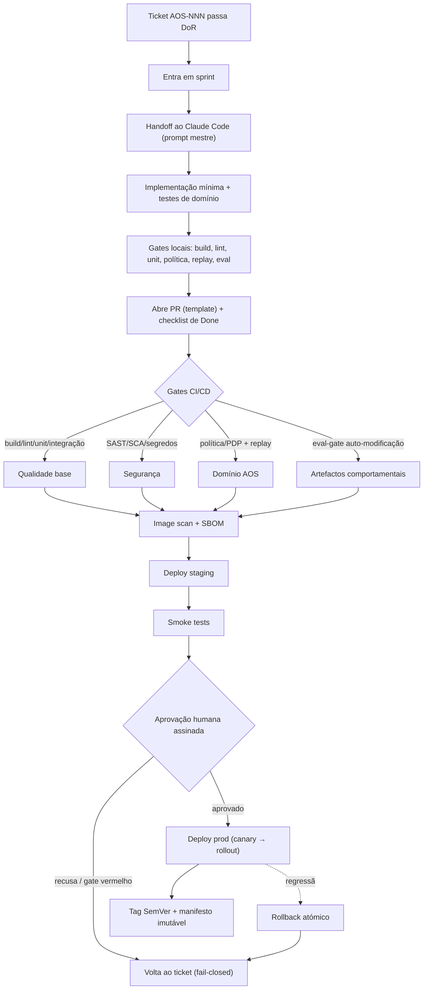

# Engineering Standards e Handoff — AOS

| Campo | Valor |
|---|---|
| Produto | AOS — Agentic OS de Referência |
| Documento | Foundation — Engineering Standards e Handoff |
| Versão | 1.0 |
| Data | Julho de 2026 |
| Classificação | Documento de Referência — Aberto |
| Documento-fonte | `_FONTE_agentic-os-ideal.md` |
| Documentos relacionados | `specs/00_System_Spec.md`, `specs/EPIC-01_Fundacoes_Plano_Controlo.md` … `specs/EPIC-11_Testes_Qualidade.md`, `tecnica/11_Convencoes_Engenharia_Evolucao.md` |

---

## 1. Propósito e âmbito

Este documento fixa os **padrões de engenharia** e o **protocolo de handoff** com que o backlog do AOS (os tickets `AOS-NNN` distribuídos pelos onze epics) é transformado em código de produção. É um produto *standalone*: aplica-se a qualquer equipa que implemente o blueprint de referência, sem depender de nenhum cliente institucional.

O AOS não é mais um *framework* de agentes; é um Agentic OS cuja tese central é tornar as falhas **arquitecturalmente impossíveis** e não apenas politicamente desencorajadas. Essa tese assenta em três fundações não-negociáveis — **Reference Monitor mandatório** (ADR-002), **identidade não-humana por agente** com cadeia de delegação (ADR-003) e **execução durável ao nível do passo** (ADR-001). Os padrões deste documento existem para que essas fundações não sejam corroídas ticket a ticket: cada critério de *Done*, cada gate de CI/CD e cada convenção aqui definida é um mecanismo que impede que um contributo individualmente razoável enfraqueça o conjunto.

**Âmbito.** Cobre a Definition of Ready (DoR), a Definition of Done (DoD), os gates de qualidade de CI/CD, as convenções de código e versionamento, os princípios de execução, o template de Pull Request (PR) e o prompt mestre de handoff para o Claude Code (CLI). **Fora de âmbito:** o conteúdo funcional de cada epic (ver ficheiros `EPIC-*`) e o desenho de solução detalhado (ver conjunto `tecnica/`).

**Audiência.** Todos os perfis executores do backlog: Arquitecto de Plataforma, Engenheiro de Runtime, Engenheiro de Segurança, Engenheiro de Dados/Memória, Engenheiro de Observabilidade, Engenheiro de Governação, DevOps/SRE e QA — bem como o agente Claude Code que recebe o handoff.

**Termos.** *Artefacto comportamental* = qualquer artefacto mutável que altera o comportamento do sistema (skill, módulo de prompt, schema de tool, schema de memória, política). *Eval-gate* = conjunto de avaliações automáticas sobre *golden-sets* que funciona como *admission control*. *Idempotência por passo* = garantia de que reexecutar um passo com a mesma *idempotency key* `f(run_id, step_id)` não duplica efeitos externos.

---

## 2. Definition of Ready (DoR)

Um ticket só entra em *sprint* quando **todos** os itens abaixo estão satisfeitos. A DoR protege o executor de ambiguidade e o sistema de escopo indefinido.

- [ ] O ticket tem **ID `AOS-NNN`** dentro do *range* correcto do seu epic e vive no ficheiro `specs/EPIC-XX`.
- [ ] **Contexto** e **Objectivo** escritos numa linguagem que um executor externo entende sem contexto oral.
- [ ] **Critérios de Aceitação SMART** em *checkboxes* — específicos, mensuráveis e verificáveis por teste ou observação.
- [ ] **ADRs aplicáveis** citados por código (ex.: ADR-002, ADR-010); o ticket não contradiz nenhum ADR canónico.
- [ ] **Dependências** identificadas e **não bloqueantes** no arranque do *sprint* (os tickets em `Dependências` estão `Done` ou o trabalho é paralelizável).
- [ ] **Componentes-alvo** nomeados pelo catálogo canónico (RM, RT, ORQ, SCH, PDP, MEM, REG, GW, BRK, ES, SBX, OBS, GOV).
- [ ] **Estimativa** atribuída em XS/S/M/L (XL é proibido — se parecer XL, decompor).
- [ ] **Prioridade** P0/P1/P2 e **Fase** (0–4) coerentes com o roadmap.
- [ ] **Testes requeridos** esboçados, incluindo o tipo de teste de domínio relevante (idempotência, replay, política, eval).
- [ ] **Impacto em segurança/governação** avaliado: o ticket toca em tool calls, identidade, egress, segredos ou auto-modificação? Se sim, o Engenheiro de Segurança/Governação está no circuito.
- [ ] **Documentos de referência** ligados (ficheiro `tecnica/` e/ou epic correspondente).

---

## 3. Definition of Done (DoD)

Um ticket só é encerrado quando **todos** os itens genéricos **e** os itens específicos do domínio se verificam. A DoD é a linha de defesa que impede que uma fundação não-negociável seja diluída.

**Genérico**

- [ ] Todos os Critérios de Aceitação satisfeitos e demonstráveis.
- [ ] Código revisto (mínimo um revisor humano; dois para artefactos P0 ou de segurança).
- [ ] Testes unitários e de integração verdes; cobertura não regride abaixo do limiar (ver §4).
- [ ] Documentação e ADRs afectados actualizados; `CHANGELOG` alimentado por Conventional Commits.
- [ ] Sem TODOs órfãos nem código morto introduzido.

**Específico do domínio AOS (não-negociável)**

- [ ] **Idempotência por passo verificada** — cada efeito externo isolado em *activity* com *idempotency key* `f(run_id, step_id)`; teste que reexecuta o passo e prova zero efeitos duplicados (ADR-001).
- [ ] **Replay determinístico testado** — a trajectória reproduz-se *resume-from-step* a partir do Event Store; inputs não-determinísticos capturados; hash do prompt materializado gravado por turno (ADR-010).
- [ ] **Toda a tool call mediada pelo Reference Monitor** — nenhum caminho de código chama tools directamente; a mediação (identidade, política, orçamento, egress, audit) é exercida e testada (ADR-002).
- [ ] **Spans OTel GenAI adicionados** — `invoke_agent`/`execute_tool`/`chat` emitidos com atributos `gen_ai.usage.*` e custo em USD por span; trajectória completa persistida (ADR-010).
- [ ] **Políticas (policy-as-code) com teste** — qualquer decisão de autorização expressa em Rego/OPA ou Cedar, versionada e assinada, com teste de PDP a cobrir *allow* e *deny* default-deny (ADR-011).
- [ ] **Sem segredos** — nenhum segredo em código, logs ou spans; credenciais downstream via Credential Broker/Vault com tokens JIT; *scan* de segredos limpo (ADR-006).
- [ ] **Eval-gate verde para artefactos comportamentais** — se o ticket cria ou altera skill/prompt/schema/memória, passou staging → eval-gate (golden-set) → canary, com versão SemVer atribuída e rollback atómico disponível (ADR-012).

---

## 4. Gates de qualidade CI/CD

O *pipeline* é **fail-closed**: qualquer gate vermelho bloqueia a progressão. Os gates de domínio (política, replay, eval) são tão bloqueantes quanto o *build*.

| # | Gate | O que valida | Falha bloqueia |
|---|---|---|---|
| 1 | **Build** | Compilação e resolução de dependências | Merge e todo o resto |
| 2 | **Lint / format** | Estilo, *imports*, formatação | Merge |
| 2b | **Lint de referências cruzadas** | Cada rótulo entre parênteses em `Dependências`/`Bloqueia` coincide com o título canónico do `AOS-NNN` referido; todas as cross-refs de ficheiros resolvem | Merge — o grafo executável não pode divergir |
| 2c | **Lint de fronteiras de camadas (AOS-178)** | Imports entre camadas de `packages/` respeitam `control-plane → kernel → platform/substrate`; substrato não importa camadas superiores; módulos de composição/teste não são importados por produção. Inversões conhecidas e documentadas no ADR-019 toleradas pela baseline; novas violações bloqueiam | Merge — inversões canónicas fora da baseline bloqueiam |
| 3 | **Unit** | Testes unitários; cobertura ≥ limiar | Merge |
| 4 | **Integração** | Contratos entre componentes (RM↔PDP, RT↔ES) conforme `tecnica/12_Contratos_de_Interface.md` | Merge |
| 5 | **SAST** | Análise estática de segurança do código | Merge |
| 6 | **SCA** | Vulnerabilidades e licenças de dependências | Merge |
| 7 | **Teste de política / PDP** | Rego/Cedar avaliado contra a política de referência de `tecnica/12_Contratos_de_Interface.md`; default-deny; *allow*/*deny* cobertos | Merge — governação não pode regredir |
| 8 | **Teste de replay determinístico** | Trajectória reproduz-se *resume-from-step*; hashes coincidem | Merge — quebra de fidelidade de replay |
| 9 | **Eval-gate de auto-modificação** | Golden-set + trace-diffing vs baseline para artefactos comportamentais | Promoção do artefacto a canary/prod |
| 10 | **Image scan** | Vulnerabilidades da imagem de container; SBOM | Publicação da imagem |
| 11 | **Deploy staging** | Aplicação em ambiente isolado | Promoção a smoke |
| 12 | **Smoke** | Sanidade end-to-end em staging | Aprovação e prod |
| 13 | **Aprovação** | Gate humano assinado (P0/segurança: dual-control 4-eyes) | Deploy prod |
| 14 | **Deploy prod** | Aplicação progressiva (canary → *rollout*) | Release |
| 15 | **Tag SemVer** | Etiqueta de versão + manifesto de dependências imutável | Encerramento do release |

Regra transversal: um *scan* de segredos limpo é pré-condição de qualquer *merge* (cruza com a DoD §3). Nenhum gate pode ser marcado *skip* sem ADR ou aprovação explícita registada no audit trail. Além disso, o **lint de referências cruzadas** (gate 2b) garante que nenhum rótulo de dependência diverge do título canónico do ticket referido — a invariante que mantém componentes nucleares como o Reference Monitor (AOS-003) visíveis no grafo executável e no caminho crítico.

> **Nota normativa (NFR de latência de mediação).** Onde qualquer ticket ou critério de aceitação cita «overhead de mediação p95 < 15 ms», o alvo refere-se à **latência de avaliação do PDP** (NFR-01, política compilada em memória). O **overhead total de mediação por *tool call*** é um orçamento *composto* — PDP + CAS de admissão + broker→vault + append ao Event Store + egress/DNS — decomposto por sub-passo em `tecnica/00 §9` e nos contratos de `tecnica/12_Contratos_de_Interface.md`; **não** é 15 ms. O mapeamento NFR×ticket está na RTM (`tecnica/16_Rastreabilidade_RTM.md`).

---

## 5. Convenções de código e versionamento

- **SemVer para artefactos comportamentais.** Skills, módulos de prompt, schemas de tool e schema de memória seguem `MAJOR.MINOR.PATCH` ancorado a contrato público (ADR-012). *MAJOR* = quebra de contrato; *MINOR* = capacidade retro-compatível; *PATCH* = correcção sem alteração de contrato. Um *swap* de modelo é evento de variância explícito, nunca silencioso.
- **Conventional Commits com ID de ticket.** Formato `tipo(AOS-NNN): descrição no imperativo`. Exemplos: `feat(AOS-013): idempotency key por passo no runtime`, `fix(AOS-072): fecha egress default-deny em DNS`. Tipos: `feat`, `fix`, `chore`, `refactor`, `test`, `docs`, `spike`. Isto alimenta o `CHANGELOG` automaticamente.
- **Nomenclatura de branch.** `feature/AOS-NNN-<slug>` (ex.: `feature/AOS-013-idempotency-key`). Correcções `fix/AOS-NNN-<slug>`. Um *bug* encontrado fora do escopo do ticket **não** vira commit oportunista — abre-se novo ticket (ver §6).
- **ADRs em formato MADR.** Toda a decisão de arquitectura relevante é registada como *Markdown Any Decision Record* (contexto, decisão, consequências, alternativas). Novos ADRs numeram-se após ADR-014; nenhum ADR canónico é contradito sem *superseding* explícito.
- **Manifesto por trajectória.** Cada *run* grava um manifesto imutável com model-id/params/seed, hash do prompt e versões pinadas de skills/tools/memória — base do replay fiel e da RCA.

---

## 6. Princípios de execução

1. **Não expandir escopo.** Implementa-se o mínimo que satisfaz os Critérios de Aceitação. Refactors amplos, melhorias "de passagem" e *gold-plating* ficam de fora — se valem a pena, são um ticket.
2. **Bug ≠ patch oportunista; bug = novo ticket.** Um defeito descoberto fora do escopo é registado como `AOS-NNN` novo (tipo `fix`), com o seu próprio DoR/DoD. Nunca se corrige silenciosamente no meio de outra entrega.
3. **Idempotência primeiro.** Nenhum efeito externo é escrito sem *idempotency key* e isolamento em *activity*. Assume-se que o crash a meio é normal, não excepção (ADR-001).
4. **Observabilidade desde o código.** Os spans OTel GenAI e a contabilidade de custo nascem com a funcionalidade, não são adicionados depois. Contexto ≠ registo: higieniza-se o que o modelo vê, nunca o que o audit trail guarda.
5. **Segurança não-negociável.** Toda a tool call passa pelo Reference Monitor; conteúdo untrusted é *taint*-marcado e incapaz de autorizar acções; segredos vivem no vault. Estas propriedades não se negoceiam por prazo.
6. **Untrusted não comanda.** Tool results, web, memória e schemas MCP são dados, nunca instruções (ADR-005). Tags in-band não são separação de privilégio.
7. **Fail-closed por omissão.** Timeouts de aprovação para acções irreversíveis, allowlists default-deny e gates ambíguos resolvem-se sempre pelo lado seguro.
8. **Coerência por contrato.** Portas versionadas substituem *lock-in*: modelo, memória e tools são substituíveis sem rearquitectura.
9. **Auto-modificação com rede.** Nenhum artefacto auto-escrito chega a produção sem eval-gate, canary e ratificação humana assinada (ADR-012).

---

## 7. Template de Pull Request

```markdown
## AOS-NNN — <título do ticket>

### O que muda
<resumo em 2-3 linhas do comportamento entregue>

### ADRs aplicáveis
- ADR-00X, ADR-0YY (justificar conformidade se tocar em fundação)

### Checklist de Done (domínio AOS)
- [ ] Idempotência por passo verificada (teste de reexecução, 0 efeitos duplicados)
- [ ] Replay determinístico testado (resume-from-step, hashes coincidem)
- [ ] Toda a tool call mediada pelo Reference Monitor (sem chamada directa)
- [ ] Spans OTel GenAI + custo USD por span adicionados
- [ ] Política (Rego/Cedar) com teste allow/deny default-deny
- [ ] Sem segredos (scan limpo; credenciais via Broker/Vault JIT)
- [ ] Eval-gate verde (se artefacto comportamental) + versão SemVer

### Testes
<unit / integração / idempotência / replay / política / eval — o que corre e como>

### Segurança e governação
<impacto em egress, identidade, taint, auto-modificação; nada ou detalhe>

### Rollback
<como reverter atomicamente; versão anterior pinada>

### Evidências
<links para spans/trace, relatório de eval, output de gates>
```

---

## 8. Prompt mestre para o Claude Code (CLI)

O handoff de um ticket para o agente executor usa o prompt padrão abaixo. Ele impõe leitura do ticket, verificação de dependências, implementação mínima, testes, gates locais e abertura de PR — sem expansão de escopo.

```text
És o executor do ticket AOS-NNN do Agentic OS de Referência (AOS).

CONTEXTO OBRIGATÓRIO
1. Lê o ticket AOS-NNN em specs/EPIC-XX_*.md na íntegra (Contexto, Objectivo,
   Critérios de Aceitação, Detalhes Técnicos, Testes Requeridos, DoD).
2. Lê os ADRs citados e o documento tecnica/ de referência do ticket.
3. Confirma que _BRIEF.md e este 01_Engineering_Standards_e_Handoff.md
   são a fonte de convenções.

VERIFICAÇÃO DE DEPENDÊNCIAS
- Confirma que os tickets em "Dependências" estão Done ou disponíveis.
- Se uma dependência bloquear, PÁRA e reporta — não improvises o contrato.

IMPLEMENTAÇÃO (mínimo suficiente)
- Implementa apenas o necessário para satisfazer os Critérios de Aceitação.
- Não expandas escopo. Bug fora de escopo => propõe novo ticket AOS, não corrijas aqui.
- Respeita as fundações: toda a tool call via Reference Monitor; efeitos
  externos idempotentes (idempotency key = f(run_id, step_id)) e isolados
  em activities; conteúdo untrusted marcado por taint; segredos só via
  Credential Broker/Vault.
- Emite spans OTel GenAI e custo por span desde o início.
- Expressa autorização como policy-as-code (Rego/Cedar) versionada.

TESTES
- Escreve/actualiza testes: unit, integração e os de domínio aplicáveis
  (idempotência, replay determinístico, política/PDP, eval-gate).
- Garante que a cobertura não regride.

GATES LOCAIS (antes do PR)
- Corre build, lint, unit, integração, SAST/SCA, teste de política,
  teste de replay e (se artefacto comportamental) o eval-gate.
- Scan de segredos tem de ficar limpo.

ENTREGA
- Commits em Conventional Commits: tipo(AOS-NNN): descrição.
- Branch feature/AOS-NNN-<slug>.
- Abre PR usando o template da secção 7, com o checklist de domínio preenchido
  e evidências (traces, relatório de eval, output dos gates).
- Se algo do ticket estiver ambíguo ou contradizer um ADR, PÁRA e pergunta.
```

---

## 9. Métricas operacionais do backlog

Monitorizam a saúde do fluxo de entrega e a integridade das fundações. Revistas por *sprint*.

| Métrica | Definição | Alvo indicativo | Sinaliza |
|---|---|---|---|
| **Velocity** | Pontos (XS/S/M/L) concluídos por sprint | Estável ±15% | Capacidade e previsibilidade |
| **Lead time** | DoR → Done por ticket | ↓ tendência | Fricção do fluxo |
| **Cycle time** | Início efectivo → Done | ↓ tendência | Eficiência de execução |
| **Taxa de retrabalho** | % de tickets reabertos ou com fix subsequente | < 10% | Qualidade da DoD |
| **Cobertura de testes** | Linhas/branches cobertos | ≥ limiar, não regride | Robustez |
| **Eval-pass-rate** | % de artefactos comportamentais que passam o eval-gate à 1.ª | ≥ 90% | Qualidade de auto-modificação |
| **Replay-fidelity** | % de trajectórias 100% reproduzíveis | 100% | Fidelidade de replay (ADR-010) |
| **Gate escape rate** | Defeitos detectados após passar todos os gates | → 0 | Eficácia dos gates |
| **Override-rate de aprovação** | % de gates de risco auto/rapidamente aprovados | Medido, sob alerta | Anti rubber-stamping (ADR-013) |
| **PDP deny-rate** | % de tool calls negadas pela política | Monitorizado | Saúde da governação |
| **DORA — deploy freq.** | Frequência de deploys a prod | ↑ com estabilidade | Fluxo de entrega |
| **DORA — change failure rate** | % de deploys que causam falha/rollback | < 15% | Estabilidade |
| **MTTR** | Tempo médio de recuperação | ↓ tendência | Resiliência operacional |

---

## Fluxo do ticket → PR → gates → prod



---

## Tabela de aprovação

| Papel | Nome | Assinatura | Data |
|---|---|---|---|
| Arquitecto de Plataforma |  |  |  |
| Responsável de Segurança |  |  |  |
| Responsável de Produto |  |  |  |

## Controlo de versões

| Versão | Data | Descrição | Autor |
|---|---|---|---|
| 1.0 | Julho 2026 | Emissão inicial | Equipa AOS |
