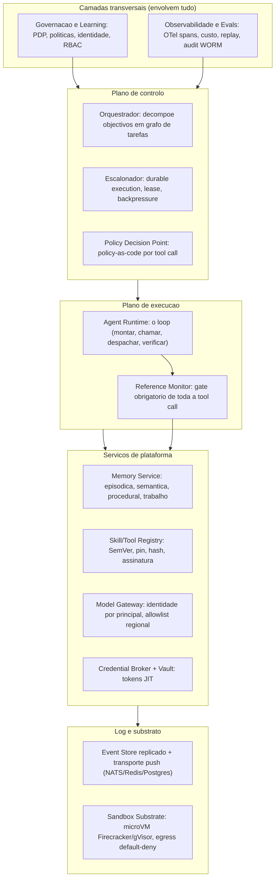
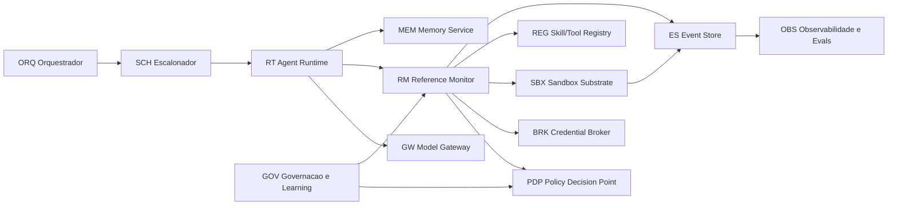
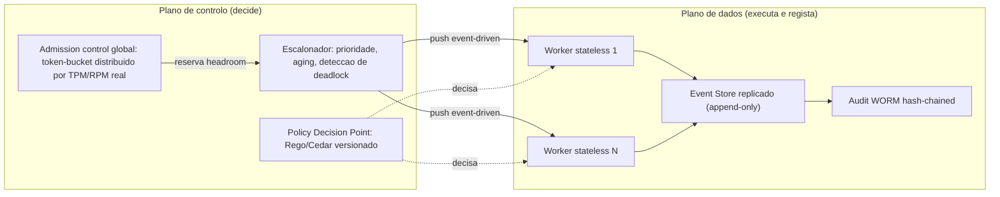
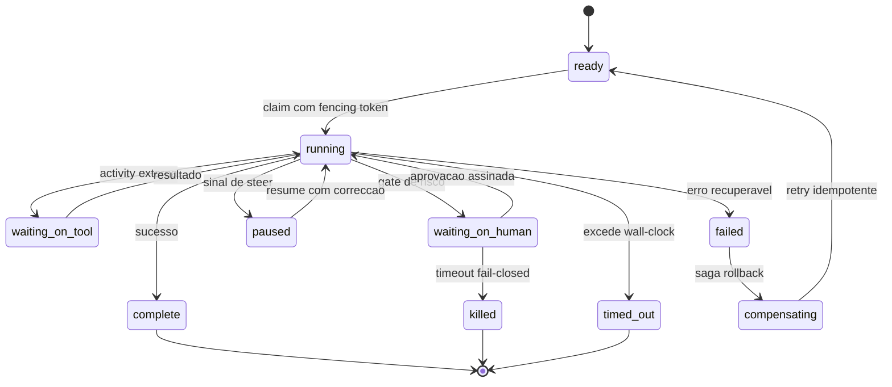
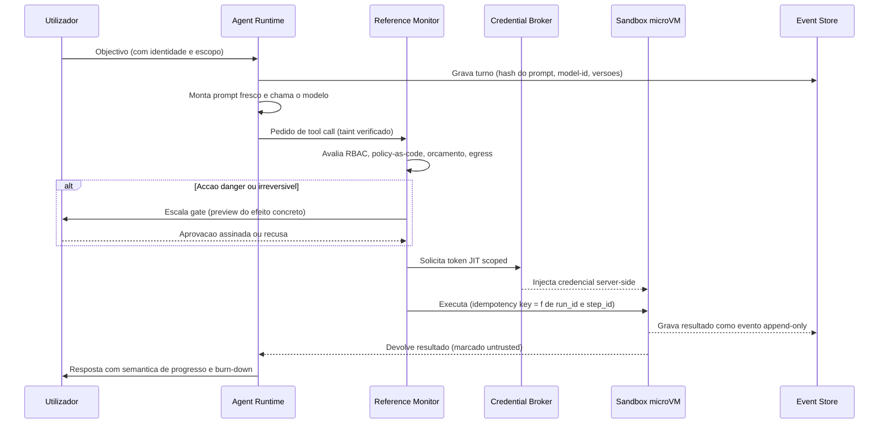
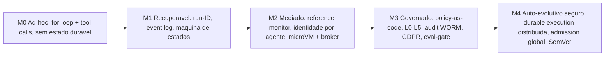

# Documento de Arquitectura de Solução — AOS

| Campo | Valor |
|---|---|
| Produto | AOS — Agentic OS de Referência |
| Documento | Arquitectura de Solução — Documento de Arquitectura de Solução |
| Versão | 1.0 |
| Data | Julho de 2026 |
| Classificação | Documento de Referência — Aberto |
| Documento-fonte | `_FONTE_agentic-os-ideal.md` |
| Documentos relacionados | `tecnica/01_Reference_Monitor_Plano_Controlo.md`, `tecnica/02_Agent_Runtime_Execucao_Duravel.md`, `tecnica/03_Orquestracao_Escalonamento.md`, `tecnica/07_Seguranca_Isolamento.md`, `tecnica/08_Observabilidade_Evals.md`, `tecnica/09_Governacao_Conformidade.md` |

---

## 1. Introdução

### 1.1 Propósito

Este documento é a **âncora arquitectural** do conjunto técnico do AOS — Agentic OS de Referência. Estabelece a visão de alto nível, o modelo em camadas canónico, o catálogo de componentes, a separação entre plano de controlo e plano de dados, as decisões de arquitectura (ADRs), os drivers não-funcionais, a vista de qualidade e o modelo de maturidade. Os restantes documentos técnicos (`tecnica/01`–`tecnica/11`) aprofundam cada subsistema; este documento fixa o enquadramento que todos partilham.

A tese central é directa: um Agentic OS só é excelente se tornar as falhas *arquitecturalmente impossíveis*, não meramente desencorajadas. Isto exige três fundações não-negociáveis — **reference monitor** mandatório, **identidade não-humana por agente** com cadeia de delegação até um humano responsável, e **execução durável** ao nível do passo sobre um event store replicado. Tudo o resto assenta sobre estas três fronteiras.

> **Nota de calibração (rigor técnico).** Neste conjunto, *«arquitecturalmente impossível»* designa um **objectivo de desenho** — a eliminação estrutural do *caminho* de falha (não existe via de código que a produza) — e **não** uma garantia absoluta. Permanece **risco residual** (defeitos de implementação, comprometimento do TCB, canais laterais) que é **gerido e medido**, não negado.

### 1.2 Âmbito

O âmbito abrange o desenho de referência de uma plataforma standalone, genérica e reutilizável, para correr, coordenar e governar agentes de IA. Inclui: as camadas transversais (Governação & Learning, Observabilidade & Evals), o plano de controlo (Orquestrador, Escalonador, PDP), o plano de execução (Agent Runtime, Reference Monitor), os serviços de plataforma (Memory Service, Skill/Tool Registry, Model Gateway, Credential Broker + Vault) e a camada de log e substrato (Event Store, Sandbox Substrate). Estão fora do âmbito deste documento os detalhes de implementação de cada componente, remetidos para os documentos especializados.

### 1.3 Audiência

Arquitectos de plataforma, engenheiros de runtime, engenheiros de segurança e de governação, responsáveis de produto, e equipas de operação/SRE que precisem de compreender a estrutura global antes de mergulhar num subsistema específico. Serve também de referência para revisão arquitectural e para o alinhamento das *specs* executáveis (`specs/`).

### 1.4 Definições e termos

- **Reference monitor:** ponto único e obrigatório por onde passa toda a tool call, aplicando política antes de executar.
- **Durable execution (execução durável):** modelo em que cada passo é idempotente, checkpointado e reproduzível a partir de um log — *resume-from-step*, não *resume-from-task*.
- **Taint tracking:** marcação de dados untrusted (tool results, web, memória, schemas MCP) para que não possam autorizar acções privilegiadas.
- **Non-human identity (NHI):** identidade única por agente, com token *scoped* e *time-bound*, numa cadeia de delegação *on-behalf-of* que termina num humano.
- **Prefix caching:** reutilização de cache do prefixo imutável do prompt, medida por cache-hit-rate como SLI.
- **Eval-gate:** *admission control* que impede que uma auto-modificação chegue a produção sem passar por avaliação contra golden-set.

---

## 2. Princípios orientadores

O desenho do AOS obedece a oito princípios de design não-negociáveis:

1. **Mediação total (reference monitor).** Toda a tool call, sem excepção, atravessa um gate do kernel que aplica identidade, política, orçamento, egress e audit *antes* de executar. Nenhum caminho de código chama uma tool directamente (ADR-002).
2. **Identidade antes de autoridade.** Cada agente e sub-agente é uma NHI única, com token *scoped/time-bound*, numa cadeia de delegação *on-behalf-of* que termina sempre num humano responsável. Autoridade = utilizador ∩ classe de agente, imposta pelo kernel (ADR-003).
3. **Durabilidade ao nível do passo.** Idempotency key = f(run_id, step_id), replay determinístico *resume-from-step*, liveness por lease/heartbeat com *fencing tokens*. Crashes são normais, não excepção (ADR-001).
4. **Contexto ≠ registo.** O que se injecta no modelo (higiene, cache, economia de tokens) é uma projecção distinta do que se persiste no backend (trajectória completa, replay, RCA). Descartar da injecção é legítimo; descartar do audit trail nunca é.
5. **Untrusted não comanda.** Conteúdo não-confiável é marcado por *taint* e é estruturalmente impedido de autorizar acções privilegiadas. Tags in-band não são separação de privilégio (ADR-005).
6. **Fricção proporcional ao risco.** Gates com *tiering* — safe corre, gray agrupa, danger confirma — sobre um eixo de sensibilidade + egress + reversibilidade. Gates uniformes produzem *approval fatigue* (ADR-013).
7. **Evolução com rede.** A auto-modificação é a mudança de maior risco do sistema e passa por eval-gate + promoção estagiada + ratificação humana assinada — nunca chega a produção unilateralmente (ADR-012).
8. **Coerência por contrato, não por lock-in.** Portas versionadas (SemVer) e contratos de capability substituem tanto o vendor único como a explosão de integrações. Modelo, memória e tools são substituíveis sem rearquitectura (ADR-012).

---

## 3. Visão de alto nível

O AOS estrutura-se em cinco camadas. As camadas **transversais** — Governação & Learning e Observabilidade & Evals — *envolvem* todas as outras, em vez de se pendurarem no fim. Entre elas e o substrato vive o **kernel de mediação**, que é o único caminho legítimo para efeitos externos. O modelo é a *menor* camada do sistema; o fosso está no runtime, na coordenação e na governação.

**Sumário de comunicações.** O Orquestrador (ORQ) decompõe objectivos em grafo de tarefas acíclico e delega ao Escalonador (SCH), que faz *push* event-driven de trabalho para o Agent Runtime (RT). O RT monta o prompt e chama o modelo via Model Gateway (GW), mas **toda** a tool call resultante atravessa o Reference Monitor (RM), que consulta o PDP para a decisão de política, solicita credenciais JIT ao Credential Broker (BRK) e despacha a execução para o Sandbox Substrate (SBX). Cada efeito é gravado como evento append-only no Event Store (ES), que é a fonte de verdade. O Memory Service (MEM) alimenta o contexto; o Skill/Tool Registry (REG) fornece definições verificadas por hash. As camadas GOV e OBS observam e regulam tudo em contínuo.

---

## 4. Componentes (catálogo)

Cada componente do catálogo canónico é descrito abaixo com a sua responsabilidade detalhada. Os nomes e códigos são canónicos e usados de forma consistente em todo o conjunto.

- **RM — Reference Monitor.** Gate mandatório de mediação total. Toda a tool call atravessa-o antes de executar: verifica identidade (NHI e cadeia de delegação), consulta o PDP para a política, valida orçamento (tokens/$), aplica egress allowlist e escreve o audit. É a concretização física da analogia de microkernel (ADR-002). Actua como PEP (Policy Enforcement Point), par do PDP.
- **RT — Agent Runtime.** Executa o loop do agente — montar prompt, chamar o modelo, despachar tools, verificar — sobre uma base de execução durável. Remonta o system prompt a cada turno *e* hasheia-o no evento, preservando estabilidade de cache e ganhando replay fiel (ADR-001, ADR-009).
- **ORQ — Orquestrador.** Decompõe objectivos em grafo de tarefas acíclico e delega a sub-agentes. Suporta map-reduce recursivo legítimo com orçamento hierárquico configurável e reserva atómica (compare-and-swap antes do spawn).
- **SCH — Escalonador.** Responsável pela durable execution, leases/fencing tokens, prioridade e aging, backpressure e detecção de deadlock. Não faz spawn sem débito reservado no token-bucket global (ADR-008).
- **PDP — Policy Decision Point.** Avalia policy-as-code (Rego/OPA ou Cedar) por tool call. É o par do PEP (=RM). A política é versionada em git, assinada, com changelog no próprio audit trail (ADR-011).
- **MEM — Memory Service.** Gere memória episódica, semântica, procedural e de trabalho. Aplica o princípio contexto ≠ registo: o que se injecta no modelo é uma projecção distinta do que se persiste. Memória derivada de conteúdo untrusted é marcada com proveniência e posta em quarentena (mitiga *memory poisoning*).
- **REG — Skill/Tool Registry.** Catálogo versionado de skills, tools e servidores MCP com pin + hash + assinatura. A definição aprovada é congelada por hash e revalidada a cada chamada; mudança de schema exige re-aprovação (anti rug-pull, ADR-012).
- **GW — Model Gateway.** Interface unificada a LLMs (estilo LiteLLM). Codifica identidade por principal, aplica allowlist regional de modelos e faz roteamento *cost/load-aware* (least-loaded/token-aware). Separa identidade (token scoped) das chaves de infra do provider (que podem ser pooled).
- **BRK — Credential Broker + Vault.** Troca o token scoped do agente por credenciais downstream JIT server-side, com TTL curto e revogáveis. O agente nunca vê o segredo (ADR-006).
- **ES — Event Store.** Log append-only replicado, fonte de verdade, com transporte push (NATS/Redis/Postgres). Substitui o SQLite single-writer (SPOF e tecto de throughput) do plano-base (ADR-007).
- **SBX — Sandbox Substrate.** Isolamento ao nível do kernel por execução (microVM Firecracker/Kata ou gVisor), filesystem read-only + overlay efémero, seccomp mínimo, rede default-deny com egress allowlist e filtragem DNS (ADR-004).
- **OBS — Observabilidade & Evals.** Persiste a trajectória completa como árvore de spans em OTel GenAI semconv, suporta replay determinístico e mantém audit hash-chain + WORM separado dos diagnósticos efémeros (ADR-010).
- **GOV — Governação & Learning.** Gere identidade não-humana, cadeia de delegação, taxonomia de autonomia L0–L5, conformidade (GDPR/EU AI Act) e o eval-gate de auto-modificação (ADR-011, ADR-014).

---

## 5. Plano de controlo vs. plano de dados

A separação entre plano de controlo (que **decide**) e plano de dados (que **executa e regista**) é o que permite escalar horizontalmente: workers *stateless*, estado particionado, e um log durável que é a fonte de verdade. O plano de controlo aloja o admission control global, o escalonamento priority-aware e o PDP; o plano de dados aloja os workers e o Event Store replicado com o audit WORM.

Esta topologia elimina o SPOF do single-writer (ADR-007), permite reserva de headroom atómica no admit (ADR-008) e mantém a decisão de política (PDP) fora do caminho de dados, ligada a cada worker apenas como avaliação por tool call.

---

## 6. Máquina de estados de execução durável

A máquina de estados grosseira do plano-base (`ready→running→complete + blocked`) é substituída por estados duráveis distintos, com estados de suspensão de primeira classe. Isto resolve duas patologias: o `waiting_on_human` deixa de colidir com a detecção de zumbis (o gate HITL já não parece um worker `running` pendurado), e a liveness passa de PID (que falha silenciosamente em containers remotos) para lease/heartbeat com TTL e fencing tokens.

O estado `paused` habilita o controlo bidireccional (steer/interrupt) sem quebrar a durabilidade; o `compensating` adiciona saga de compensação onde os gates só preveniam; e o `timeout fail-closed` do `waiting_on_human` garante que acções irreversíveis não ficam penduradas indefinidamente (ADR-001, ADR-013).

---

## 7. Fluxo de execução end-to-end

O loop é o batimento cardíaco, mas cada efeito externo é uma *activity* durável, isolada, idempotente e mediada. O system prompt é remontado a cada turno **e** hasheado no evento — preserva-se a estabilidade de cache e ganha-se replay fiel.

Este fluxo materializa os princípios: mediação total (RM no centro), identidade e delegação no objectivo inicial, taint no resultado devolvido, credenciais JIT que o agente nunca vê, e gravação append-only de cada efeito como fonte de verdade.

---

## 8. Decisões de arquitectura (ADRs)

| ADR | Decisão | Racional |
|---|---|---|
| ADR-001 | Execução durável como primitivo | Idempotência por passo (key=f(run_id,step_id)), checkpoint intra-iteração, replay resume-from-step, efeitos externos isolados em *activities* (Temporal/Restate/DBOS ou contrato explícito). Crashes tornam-se recuperáveis por desenho. |
| ADR-002 | Reference Monitor mandatório | Nenhum caminho de código chama tools directamente; a mediação total torna segurança, governação e observabilidade transversais em vez de aspiracionais. |
| ADR-003 | Identidade não-humana por agente | Token scoped/time-bound codifica (utilizador, agente) numa cadeia de delegação on-behalf-of que termina num humano; autoridade = utilizador ∩ classe. Base de toda a atribuição e conformidade. |
| ADR-004 | Isolamento ao nível do kernel | microVM (Firecracker/Kata) ou gVisor como fronteira primária; FS read-only + overlay efémero; seccomp; jails só como defesa secundária, por serem triviais de contornar. |
| ADR-005 | Separação control/data-plane + taint | Conteúdo untrusted (tool results, web, memória, schemas MCP) é dados, nunca instruções (dual-LLM/CaMeL); mitiga prompt injection (OWASP LLM01). |
| ADR-006 | Credential Broker com tokens JIT | Segredos no vault; broker injecta credenciais downstream server-side, TTL curto, revogáveis. O agente nunca vê o segredo. |
| ADR-007 | Event Store replicado | Substitui SQLite single-writer (SPOF e tecto de throughput) por log replicado append-only com transporte push. |
| ADR-008 | Admission control global em tokens/$ | Orçamento por árvore em tokens e custo (não iterações), token-bucket distribuído sobre TPM/RPM real, circuit breaker, reserva de headroom no admit. Evita colapso agregado do rate limit. |
| ADR-009 | Layout de prompt cache-estável | Prefixo imutável (system + tool set congelado no run) + tail append-only; compressão só em checkpoints assíncronos; cache-hit-rate como SLI. |
| ADR-010 | Observabilidade OTel GenAI + audit WORM | Trajectória completa como árvore de spans (semconv GenAI); replay determinístico; audit hash-chain + WORM separado de diagnósticos efémeros. |
| ADR-011 | Policy-as-code + GDPR por desenho | PDP/PEP com Rego/OPA ou Cedar versionado e assinado; minimização, TTL, redação de PII e crypto-shredding (Art. 17); soberania por board. |
| ADR-012 | SemVer + eval-gate para auto-modificação | Skills/prompts/schemas versionados; auto-modificação passa por staging → eval-gate (golden-set) → canary → ratificação assinada → prod, com rollback atómico. |
| ADR-013 | Gates de risco SA-ROC + controlo bidireccional | Tiering safe/gray/danger; steer/interrupt (pausar→corrigir→retomar); gate de aprovação-de-plano; timeout fail-closed; override-rate medido. |
| ADR-014 | Taxonomia de autonomia L0–L5 | Oversight proporcional ao impacto; promoção baseada em fiabilidade medida (erro <2% por 30 dias); demoção automática em anomalia. |

---

## 9. Drivers não-funcionais

| Driver | Alvo | Mecanismo |
|---|---|---|
| Durabilidade de execução | Entrega *at-least-once* com idempotência downstream (0 efeitos **observáveis** duplicados) | Idempotency key por passo propagada e honrada pelo serviço externo; saga de compensação (ADR-001) |
| Disponibilidade do plano de controlo | 99,9% | ES replicado; workers stateless; sem SPOF (ADR-007) |
| Cold-start de sandbox | < 125 ms (restore 5–30 ms) | microVM snapshot + pool pré-aquecido (ADR-004) |
| Latência de avaliação do PDP p95 | < 15 ms | Política compilada avaliada em memória (ADR-002/011) |
| Overhead total de mediação por *tool call* | orçamento decomposto por sub-passo (PDP + CAS de admissão + broker->vault + append ao ES + egress/DNS) | Alvo agregado a ratificar por benchmark |
| Cache-hit-rate de prompt | > 80% (SLI) | Layout cache-estável (ADR-009) |
| Fidelidade de replay | 100% dos passos reproduzíveis | Captura de inputs não-determinísticos + hash de prompt (ADR-010) |
| Isolamento de segredos | Agente nunca vê segredo downstream | Credential broker JIT (ADR-006) |
| Conformidade | GDPR/EU AI Act por desenho | Crypto-shredding, PDP, HITL efectivo (ADR-011/013) |
| Segurança de auto-evolução | 0 auto-modificações não avaliadas em prod | Eval-gate como admission control (ADR-012) |

---

## 10. Vista de qualidade

A qualidade organiza-se pelas sete dimensões de excelência do painel canónico.

### 10.1 Arquitectura
Identidade de execução durável ao nível do passo; replay determinístico resume-from-step; event store append-only replicado sem single-writer; liveness por lease + fencing tokens; reference monitor mandatório; máquina de estados com estados de suspensão de primeira classe; grafo de tarefas acíclico com detecção de deadlock; orçamento hierárquico com reserva atómica. Ver ADR-001, ADR-002, ADR-007.

### 10.2 Segurança
Isolamento ao nível do kernel por execução; rede default-deny com egress allowlist e filtragem DNS; separação control/data-plane contra prompt injection (dual-LLM/CaMeL + taint); credential broker; autoridade escopada ao principal (sem *confused deputy*); supply-chain com pin+hash+assinatura; audit tamper-evident; identidade criptográfica com mensagens inter-agente assinadas. Ver ADR-003, ADR-004, ADR-005, ADR-006.

### 10.3 Escalabilidade
Admission control global denominado em tokens; orçamento por árvore em tokens e custo com circuit breaker e cap de output de tools; layout de prompt cache-estável com cache-hit-rate como SLI; plano de dados horizontalmente escalável; scheduling latency/priority-aware; roteamento cost/load-aware; backpressure com degradação graciosa (shed → defer → degradar → rejeitar). Ver ADR-008, ADR-009.

### 10.4 Observabilidade
Trajectória completa de cada agente e sub-agente como árvore de spans (OTel GenAI semconv); cada tool call estruturada com tokens/custo; replay determinístico com captura de inputs não-determinísticos; audit tamper-evident separado dos diagnósticos efémeros; custo em USD por span; circuit breaker multi-sinal para o agente vivo em loop; padrão *wide events* (capturar tudo, filtrar no query-time). Ver ADR-010.

### 10.5 Governação
Identidade não-humana única por agente com cadeia de delegação; enforcement programático via PDP/PEP no boundary de cada tool call (allowlist default-deny); audit com retenção e legal hold; GDPR por desenho; soberania por board; taxonomia L0–L5; supervisão humana efectiva (EU AI Act Art. 14); gate de ratificação para auto-modificação. Ver ADR-011, ADR-013, ADR-014.

### 10.6 Experiência de utilização (UX/DX)
Controlo bidireccional (pausar → injectar correcção → retomar) em qualquer superfície; ver e aprovar o *plano* antes do spawn; gates com tiering de risco; paridade de superfície (aprovação-como-card em Slack/Telegram); semântica de progresso e burn-down de custo; calibração activa de confiança; loop de autoria de skills com dry-run e atribuição visível. Ver ADR-013.

### 10.7 Manutenção evolutiva
SemVer obrigatório em todo o artefacto comportamental mutável; manifesto de dependências imutável por trajectória; eval-gate como admission control para auto-modificação; rollback atómico; schema de memória versionado com migrações expand/contract; provider abstraction com capability contracts; ciclo de deprecação formal; allowlist fail-closed. Ver ADR-012.

---

## 11. Constrangimentos e premissas técnicas

- **Constrangimento de mediação:** nenhum componente pode invocar efeitos externos fora do Reference Monitor. Qualquer atalho anula transversalmente segurança, governação e observabilidade (ADR-002).
- **Constrangimento de identidade:** não existem execuções anónimas nem pools round-robin de identidade; a atribuição é a base da conformidade (ADR-003).
- **Premissa de substrato durável:** assume-se um event store replicado disponível como fonte de verdade e transporte push; o SQLite-por-board só é aceitável como unidade de sharding datada no MVP (ADR-007).
- **Premissa de determinismo controlado:** o replay fiel exige captura de todos os inputs não-determinísticos (model-id, params, seed, hash do prompt); modelos não-determinísticos não capturados invalidam a fidelidade (ADR-010).
- **Constrangimento de congelamento por run:** novas tools MCP só entram em *runs novos*, servindo simultaneamente a estabilidade de cache e o pinning de supply-chain (ADR-009, ADR-012).
- **Premissa de soberania:** o failover está proibido de cruzar fronteira regional; a allowlist de modelos é regional (ADR-011).

---

## 12. Riscos arquitecturais e mitigações

| Risco | Impacto | Mitigação |
|---|---|---|
| Double-execution de efeito externo no retry | Corrupção do mundo externo | Idempotency key = f(run_id, step_id); saga de compensação (ADR-001) |
| Falso-positivo de zumbi cross-host | Tarefa executada duas vezes | Lease/heartbeat + fencing token, nunca PID |
| Colapso agregado de rate limit | Board autodestrói-se | Admission control global com reserva de headroom (ADR-008) |
| Prompt injection → tool privilegiada | Exfiltração, goal hijack | Taint tracking + reference monitor + egress default-deny (ADR-002/005) |
| Rug-pull de tool MCP | Roubo de credenciais | Pin+hash+assinatura, re-aprovação em mudança de schema (ADR-012) |
| Misevolution / drift de skill | Regressão comportamental silenciosa | Eval-gate + canary + ratificação assinada + rollback atómico (ADR-012) |
| DSAR impossível (log imutável) | Violação GDPR Art. 17 | Crypto-shredding + TTL + redação na ingestão (ADR-011) |
| Fuga de soberania por failover | Transferência ilegal de PII | Allowlist regional; failover proibido de cruzar fronteira (ADR-011) |
| Approval theater / rubber-stamping | Governação inefectiva | Tiering SA-ROC, preview do efeito concreto, override-rate medido (ADR-013) |
| Replay infiel após evolução de código | RCA e eval inválidos | Manifesto de versões por trajectória + hash do prompt (ADR-010) |
| Cache thrash invisível | Explosão de custo silenciosa | Layout cache-estável + cache-hit-rate como SLI com alerta (ADR-009) |

---

## 13. Modelo de maturidade e roadmap

Um Agentic OS não nasce ideal; evolui por níveis onde cada um **desbloqueia** o seguinte. Não se salta M1→M3: sem identidade e durabilidade, a governação de M3 é teatro.

- **M0 — Ad-hoc.** O loop existe, nada persiste; nenhuma tool call é mediada. É onde vive a maioria dos frameworks.
- **M1 — Recuperável.** Run-ID por tentativa, event log, máquina de estados. Crashes recuperáveis, segurança ainda ad-hoc.
- **M2 — Mediado.** Reference monitor físico; identidade por agente; isolamento ao nível do kernel e credential broker.
- **M3 — Governado.** Policy-as-code, autonomia graduada, audit tamper-evident, conformidade GDPR/EU AI Act, eval-gate.
- **M4 — Auto-evolutivo seguro.** Durable execution distribuída, admission control global, SemVer end-to-end, promoção por fiabilidade medida.

**Roadmap por fases.** **Fase 0 — Fundações (P0):** reference monitor, identidade com delegação, durable execution, event store replicado. **Fase 1 — Fronteira de segurança (P0):** microVM/gVisor com snapshot pool, rede default-deny, credential broker JIT, taint tracking, supply-chain com pin+hash+assinatura. **Fase 2 — Governação & observabilidade (P1):** policy-as-code PDP/PEP, OTel GenAI spans, audit hash-chain + WORM, circuit breaker multi-sinal, conformidade GDPR, allowlist regional. **Fase 3 — Escala & controlo (P1):** admission control global, orçamento em tokens/$, layout cache-estável com SLI, backpressure, scheduling priority-aware, estados de suspensão duráveis. **Fase 4 — UX & evolução (P2):** steer/interrupt em todas as superfícies, gate de aprovação-de-plano, gates SA-ROC, SemVer + eval-gate, migrações de memória expand/contract, autonomia progressiva L0–L5.

---

## 14. Glossário técnico

- **Reference monitor:** ponto único e obrigatório por onde passa toda a tool call, aplicando política antes de executar.
- **Durable execution:** modelo em que cada passo é idempotente, checkpointado e reproduzível a partir de um log — resume-from-step, não resume-from-task.
- **Fencing token:** contador monotónico que invalida escritas de um worker obsoleto, garantindo liveness distribuída.
- **Taint tracking:** marcação de dados untrusted para que não possam autorizar acções privilegiadas.
- **Credential broker:** serviço que troca o token scoped do agente por credenciais downstream server-side; o agente nunca vê o segredo.
- **Crypto-shredding:** apagar a chave de cifra por titular para tornar dados pessoais irrecuperáveis sem reescrever o log encadeado.
- **SA-ROC:** modelo de escalonamento por risco (safe corre, gray agrupa, danger confirma) que combate a approval fatigue.
- **Misevolution:** deriva comportamental nociva de um agente auto-evolutivo, que ocorre mesmo sem atacante.
- **Manifesto de dependências:** registo imutável por trajectória com model-id/versão, hash do prompt e versões de skills/tools/memória, base do replay fiel.
- **Admission control global:** token-bucket distribuído que só permite spawn com headroom reservado no TPM/RPM real do provider.
- **Autonomia graduada (L0–L5):** níveis de autonomia com oversight proporcional ao impacto e promoção baseada em fiabilidade medida.

---

## 15. Tabela de aprovação

| Papel | Nome | Assinatura | Data |
|---|---|---|---|
| Arquitecto de Plataforma |  |  |  |
| Responsável de Segurança |  |  |  |
| Responsável de Produto |  |  |  |

---

## 16. Controlo de versões

| Versão | Data | Descrição | Autor |
|---|---|---|---|
| 1.0 | Julho 2026 | Emissão inicial | Equipa AOS |
