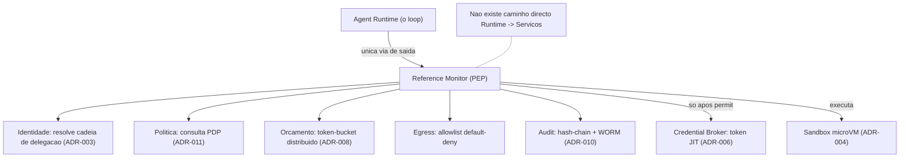
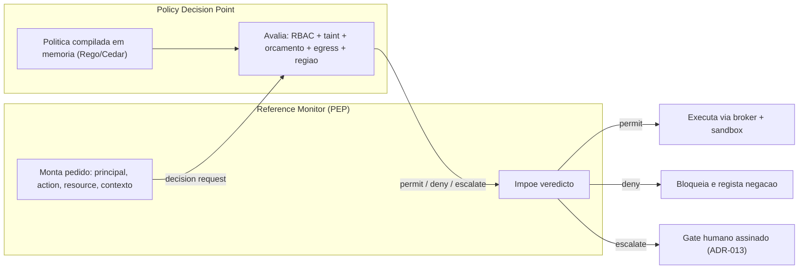
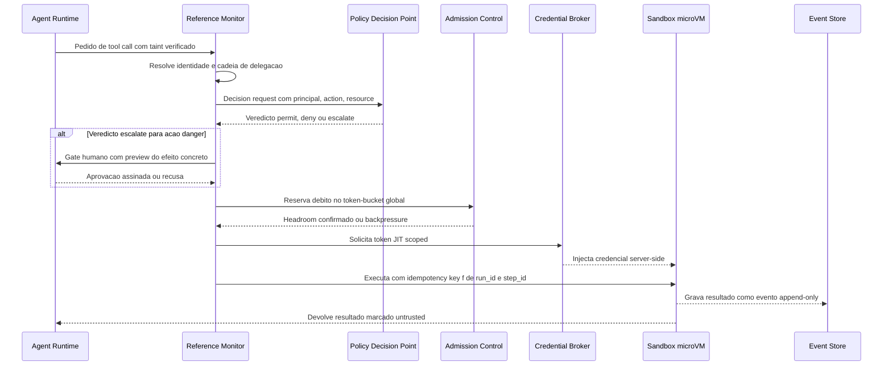
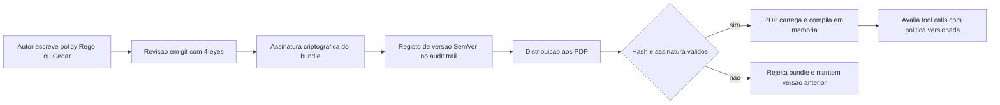
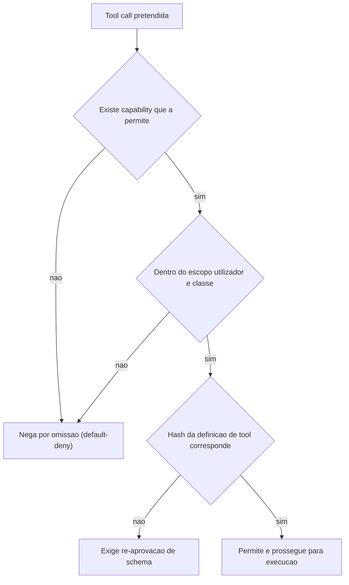
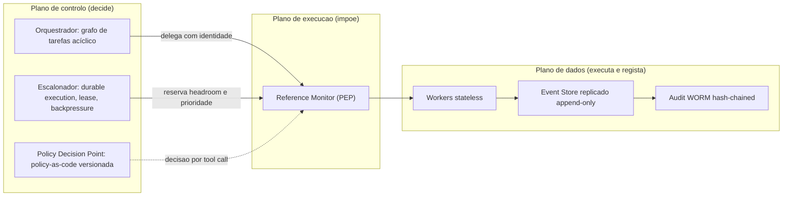

# Reference Monitor e Plano de Controlo — AOS

| Campo | Valor |
|---|---|
| Produto | AOS — Agentic OS de Referência |
| Documento | Documento Técnico — Reference Monitor e Plano de Controlo |
| Versão | 1.0 |
| Data | Julho de 2026 |
| Classificação | Documento de Referência — Aberto |
| Documento-fonte | `_FONTE_agentic-os-ideal.md` |
| Documentos relacionados | `tecnica/00_Arquitectura_Solucao.md`, `tecnica/07_Seguranca_Isolamento.md`, `tecnica/09_Governacao_Conformidade.md`, `specs/EPIC-01_Fundacoes_Plano_Controlo.md` |

---

## 1. Introdução

### 1.1 Propósito

Este documento especifica o **Reference Monitor (RM)** do AOS — o gate mandatório por onde atravessa *toda* a tool call — e o **plano de controlo** que o alimenta com decisões: Orquestrador, Escalonador e Policy Decision Point (PDP). O objectivo é fixar como a mediação total deixa de ser uma aspiração para se tornar uma propriedade arquitectural: nenhum caminho de código no sistema chama uma tool directamente, e nenhuma chamada executa sem que identidade, política, orçamento, egress e audit tenham sido aplicados *antes* do efeito externo.

O Reference Monitor é a concretização física da analogia de microkernel: é o único caminho legítimo para efeitos externos e é isto que torna segurança, governação e observabilidade *transversais* em vez de aspiracionais. Sem este componente físico obrigatório entre runtime e serviços, o sistema não é um SO — é *plumbing* com boas relações-públicas.

### 1.2 Âmbito

Abrange: o padrão de interposição do Reference Monitor (PEP — *Policy Enforcement Point*); o par PDP/PEP e o ciclo de decisão de uma tool call; a expressão de política como código (Rego/OPA ou Cedar) versionado e assinado; a *allowlist* de *capabilities* em regime *default-deny*; e a interacção do RM com o plano de controlo (Orquestrador, Escalonador, PDP). Ficam fora do âmbito os detalhes de isolamento ao nível do kernel (ver `tecnica/07_Seguranca_Isolamento.md`) e o modelo de identidade não-humana e conformidade GDPR/EU AI Act (ver `tecnica/09_Governacao_Conformidade.md`), aqui apenas referenciados nos pontos de contacto.

### 1.3 Audiência

Arquitectos de plataforma, engenheiros de segurança e de governação, engenheiros de runtime e equipas de operação que implementem ou revejam o kernel de mediação e as políticas que o governam.

### 1.4 Definições e termos

- **Reference monitor:** ponto único e obrigatório por onde passa toda a tool call, aplicando política antes de executar. Três propriedades clássicas: **inviolável** (não contornável), **sempre invocado** (mediação total) e **verificável** (pequeno e auditável).
- **PEP — Policy Enforcement Point:** o ponto que *impõe* a decisão; no AOS é o próprio Reference Monitor.
- **PDP — Policy Decision Point:** o ponto que *avalia* a policy-as-code e devolve uma decisão (permitir/negar/escalar) por cada tool call.
- **Policy-as-code:** política expressa em código declarativo (Rego/OPA ou Cedar), versionada em git, assinada e auditável.
- **Capability:** direito escopado a invocar uma classe de tool sob condições; concedido por *allowlist*, negado por omissão (*default-deny*).
- **Taint:** marca de conteúdo untrusted (tool results, web, memória, schemas MCP) que o impede de autorizar acções privilegiadas (ADR-005).

---

## 2. ADRs aplicáveis

| ADR | Decisão | Relevância neste documento |
|---|---|---|
| **ADR-002** | Reference Monitor mandatório | Fundação central: nenhum caminho de código chama tools directamente; mediação total torna segurança/governação/observabilidade transversais. |
| **ADR-011** | Policy-as-code + GDPR por desenho | PDP/PEP com Rego/OPA ou Cedar versionado e assinado; minimização e redação aplicadas na fronteira da tool call. |
| **ADR-008** | Admission control global em tokens/$ | O RM consulta o orçamento por árvore (token-bucket distribuído) e o circuit breaker antes de admitir a execução. |
| ADR-003 | Identidade não-humana por agente | O RM resolve a cadeia de delegação e a autoridade = utilizador ∩ classe (ver `tecnica/09`). |
| ADR-005 | Separação control/data-plane + taint | O RM verifica o *taint* do pedido: conteúdo untrusted não pode autorizar acções privilegiadas. |
| ADR-006 | Credential Broker com tokens JIT | Após a decisão *permit*, o RM aciona o broker; o agente nunca vê o segredo downstream. |
| ADR-013 | Gates de risco SA-ROC | O RM escala gates *danger*/irreversíveis a um humano com timeout *fail-closed*. |

---

## 3. O padrão Reference Monitor

O Reference Monitor materializa três propriedades que, no plano-base típico, eram apenas declaradas. É **sempre invocado**: o Agent Runtime não possui qualquer via directa para o substrato — a única saída para o mundo externo é o RM. É **inviolável**: corre fora do domínio de confiança do agente, e o conteúdo untrusted que o modelo produz é *dados*, nunca instruções capazes de o reconfigurar. E é **verificável**: é uma superfície pequena, com política externalizada e decisões registadas, pelo que pode ser auditado sem ler todo o sistema.

A interposição é o coração do desenho: entre o loop do agente e qualquer serviço de plataforma existe exactamente um gate. Isto transforma cinco preocupações transversais — identidade, política, orçamento, egress e audit — em passos obrigatórios de um único caminho, em vez de responsabilidades dispersas e opcionais.

**Como melhorámos o plano-base.** No *chatbot com plugins* típico, o `for` loop despacha tool calls directamente e a segurança é uma verificação opcional que se pode esquecer. No AOS, a mediação é estrutural: remover o RM não enfraquece o sistema — parte-o, porque não existe outra via de execução. O antigo *directory jail* e os filtros de comando descem a defesa-em-profundidade secundária; a fronteira primária é este gate combinado com a microVM.

---

## 4. PDP/PEP e o ciclo de decisão

A separação **PEP/PDP** é o padrão XACML aplicado ao AOS: o **PEP** (o Reference Monitor) *impõe*, o **PDP** *decide*. O RM não codifica regras de negócio — recolhe o contexto do pedido, delega a decisão ao PDP e executa o veredicto. Esta divisão mantém o gate pequeno e verificável e permite evoluir política sem tocar no caminho de execução.

O PDP recebe um pedido estruturado (o *principal* e a sua cadeia de delegação, a *action*/tool pretendida, o *resource* e o contexto — taint, orçamento disponível, região, sensibilidade) e avalia a política compilada em memória. O alvo de desempenho é agressivo: overhead de mediação p95 **< 15 ms**, alcançado com política compilada e avaliada em memória (ADR-011). Três veredictos são possíveis: `permit`, `deny` e `escalate` (gate a um humano, para acções *danger*/irreversíveis segundo ADR-013).

O ciclo completo de uma tool call, do pedido do Runtime ao registo append-only, encadeia estas verificações numa sequência determinística. Cada passo é uma pré-condição do seguinte: falhar qualquer um bloqueia a execução (regime *fail-closed*).

**Como melhorámos o plano-base.** O ciclo integra o *admission control* global (ADR-008) como passo de primeira classe: o RM não executa sem débito reservado no token-bucket distribuído sobre o TPM/RPM real, o que impede o colapso agregado onde vários boards, cada um dentro do seu limite, saturam colectivamente o rate limit partilhado. O resultado devolvido ao Runtime é marcado *untrusted*, fechando o ciclo com a separação control/data-plane (ADR-005).

---

## 5. Policy-as-code e versionamento

A política do AOS é **código**, não configuração dispersa nem lógica embutida no gate. Exprime-se em **Rego/OPA ou Cedar**, é versionada em git, **assinada** e o seu changelog é registado no próprio audit trail (ADR-011). Isto dá três garantias: (1) a decisão é *reprodutível* — sabe-se exactamente que versão de política avaliou cada tool call; (2) a alteração é *auditável* — cada mudança tem autor, revisão e assinatura; (3) o *deploy* é *seguro* — a política é um artefacto comportamental sob SemVer, sujeito às mesmas disciplinas de promoção que o resto do sistema.

O ciclo de vida de uma política segue *staging → revisão → assinatura → publicação*, com o PDP a carregar apenas *bundles* cujo hash e assinatura verificam. Uma política não assinada, ou cuja assinatura não corresponde ao *bundle* activo, é rejeitada: o PDP **falha fechado**, negando por omissão em vez de correr regras não confiáveis.

A política incorpora ainda a conformidade por desenho (ADR-011): minimização de dados, TTL por classe, redação de PII e as regras de soberania (uma acção não pode encaminhar dados através de uma fronteira proibida). Estas regras vivem no mesmo código versionado, o que significa que a conformidade é *imposta na fronteira da tool call*, não verificada a posteriori. O detalhe do modelo GDPR/EU AI Act está em `tecnica/09_Governacao_Conformidade.md`.

---

## 6. Capability allowlist default-deny

A autoridade de um agente exprime-se por **allowlist de capabilities em regime default-deny**: uma capability é o direito escopado de invocar uma classe de tool sob condições, e o que não está explicitamente permitido é negado. Esta é a substituição directa da *blocklist* de tools do plano-base, que *falhava aberta* — cada tool nova ficava implicitamente permitida até alguém se lembrar de a bloquear, o oposto do que a segurança exige.

Com *default-deny*, uma tool nova (por exemplo, um servidor MCP acrescentado) é inacessível até que uma capability a inclua explicitamente, com a definição congelada por hash e verificada a cada chamada (ADR-005, supply-chain em `tecnica/07`). A autoridade efectiva é sempre a **intersecção** entre o que o utilizador pode delegar e o que a classe do agente permite (`autoridade = utilizador ∩ classe`), avaliada pelo PDP. Isto elimina o *confused deputy*: um sub-agente nunca pode exceder o escopo do pai, mesmo que a tool subjacente seja mais poderosa.

**Como melhorámos o plano-base.** A blocklist que falhava aberta a cada tool nova torna-se uma allowlist *capability-scoped* que falha fechada; a resolução de tools "sem reiniciar" passa a exigir revalidação criptográfica, e novas tools MCP só entram em *runs novos* — o que serve simultaneamente a estabilidade de cache de prompt e o pinning de supply-chain.

---

## 7. Interacção com o plano de controlo

O Reference Monitor vive no plano de execução, mas as suas decisões são alimentadas pelo **plano de controlo**, cujos três componentes o rodeiam. O **Orquestrador (ORQ)** decompõe objectivos num grafo de tarefas acíclico e delega a sub-agentes — cada delegação estabelece a cadeia de identidade que o RM depois resolve. O **Escalonador (SCH)** garante *durable execution*, leases/fencing, prioridade e backpressure, e é ele que aplica a reserva de headroom no *admission control* que o RM consulta em cada execução. O **PDP** é o par de decisão do RM, já detalhado.

A separação plano de controlo / plano de dados é o que permite escalar horizontalmente: os *workers* são *stateless*, o estado é particionado e o Event Store replicado é a fonte de verdade. O RM é o ponto de encontro destes planos — decide-se no controlo, executa-se e regista-se no dado.

Este acoplamento explica porque o RM é indispensável e não meramente conveniente: é onde a decisão do plano de controlo se torna acção governada e auditável. Os tickets de fundação estão em `specs/EPIC-01_Fundacoes_Plano_Controlo.md`.

---

## 8. Vista de qualidade

### 8.1 Segurança

A mediação total (ADR-002) torna a segurança uma propriedade estrutural: como não existe via directa para o substrato, não há superfície de ataque que contorne o gate. O *taint tracking* (ADR-005) impede que conteúdo untrusted autorize acções privilegiadas, mitigando prompt injection (OWASP LLM01). A allowlist *default-deny* elimina a falha-aberta e o *confused deputy*. O egress *default-deny* na fronteira do RM corta a exfiltração via tools "benignas".

### 8.2 Governação

O par PDP/PEP com policy-as-code assinada e versionada dá enforcement programático no *boundary* de cada tool call, com capacidades por allowlist. A cadeia de delegação resolvida pelo RM garante que cada acção tem um responsável humano identificável — nunca "o pool". Os gates SA-ROC (ADR-013) com timeout *fail-closed* asseguram supervisão humana efectiva para o irreversível.

### 8.3 Observabilidade

Como toda a tool call atravessa um ponto único, o RM é o local natural para emitir spans OTel GenAI e para gravar o audit *tamper-evident* (hash-chain + WORM, ADR-010). Cada decisão do PDP — incluindo negações e escalonamentos — é registada, tornando o comportamento de política inteiramente rastreável e reproduzível. O overhead de mediação p95 < 15 ms é um SLI monitorizado.

---

## 9. Riscos e mitigações

| Risco | Impacto | Mitigação |
|---|---|---|
| Caminho de código contorna o RM | Acção não mediada, audit incompleto | Sem via directa para o substrato; RM é a única saída; testes de arquitectura que falham o build se detectarem chamada directa |
| Prompt injection → tool privilegiada | Exfiltração, goal hijack | Taint tracking (ADR-005) + RM + egress default-deny |
| Blocklist que falha aberta a tool nova | Escalada de privilégio silenciosa | Allowlist capability-scoped default-deny; tool nova só em run novo |
| Política não assinada ou adulterada | Decisões de segurança não confiáveis | Bundles assinados; PDP falha fechado se hash/assinatura não verificam (ADR-011) |
| Overhead de mediação degrada latência | Regressão de desempenho | Política compilada e avaliada em memória; p95 < 15 ms como SLI |
| Colapso agregado de rate limit | Board autodestrói-se | Admission control global com reserva de headroom (ADR-008) consultado pelo RM |
| Rug-pull de tool MCP | Roubo de credenciais | Definição congelada por hash, revalidada a cada chamada; re-aprovação em mudança de schema |
| Gate uniforme → approval fatigue | Governação inefectiva | Tiering SA-ROC (ADR-013); escalonamento só para danger/irreversível |

---

## 10. Glossário

- **Reference monitor (RM/PEP):** gate único e mandatório por onde passa toda a tool call; inviolável, sempre invocado e verificável.
- **PDP — Policy Decision Point:** avalia a policy-as-code e devolve permit/deny/escalate por cada tool call.
- **PEP — Policy Enforcement Point:** impõe a decisão do PDP; no AOS é o próprio RM.
- **Policy-as-code:** política em Rego/OPA ou Cedar, versionada, assinada e auditável.
- **Capability:** direito escopado de invocar uma classe de tool sob condições; concedido por allowlist.
- **Default-deny:** o que não está explicitamente permitido é negado (falha fechada).
- **Admission control global:** token-bucket distribuído que só permite execução/spawn com headroom reservado no TPM/RPM real do provider (ADR-008).
- **Confused deputy:** componente com mais autoridade do que o chamador usada para executar acção que o chamador não poderia; prevenido por `autoridade = utilizador ∩ classe`.
- **Fail-closed:** em caso de dúvida, timeout ou falha, negar em vez de permitir.

---

## 11. Tabela de aprovação

| Papel | Nome | Assinatura | Data |
|---|---|---|---|
| Arquitecto de Plataforma |  |  |  |
| Responsável de Segurança |  |  |  |
| Responsável de Produto |  |  |  |

---

## 12. Controlo de versões

| Versão | Data | Descrição | Autor |
|---|---|---|---|
| 1.0 | Julho 2026 | Emissão inicial | Equipa AOS |
