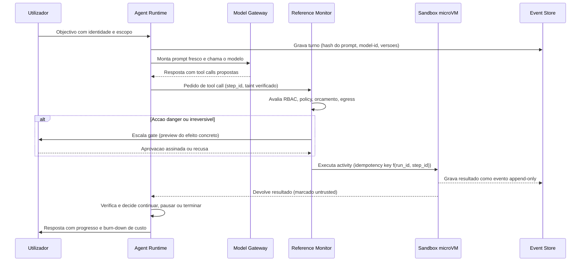
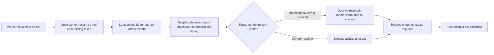
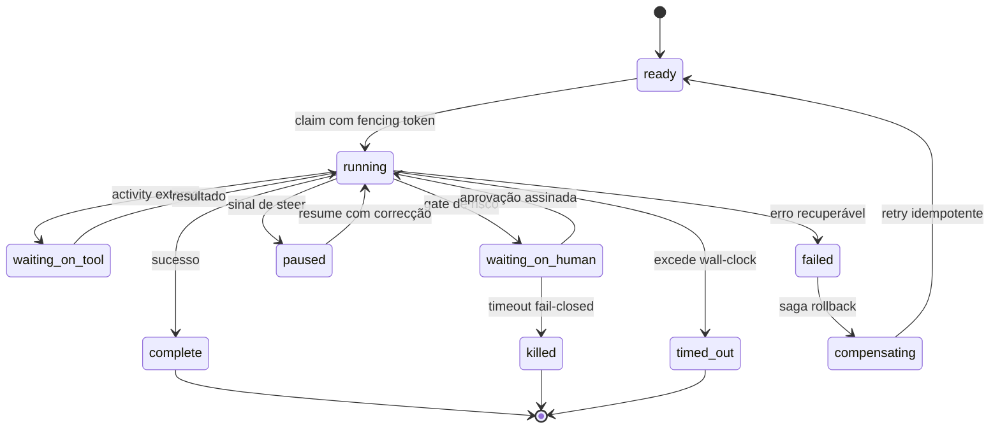

# Agent Runtime e Execução Durável — AOS

| Campo | Valor |
|---|---|
| Produto | AOS — Agentic OS de Referência |
| Documento | Técnica — Agent Runtime e Execução Durável |
| Versão | 1.0 |
| Data | Julho de 2026 |
| Classificação | Documento de Referência — Aberto |
| Documento-fonte | `_FONTE_agentic-os-ideal.md` |
| Documentos relacionados | `tecnica/00_Arquitectura_Solucao.md`, `tecnica/01_Reference_Monitor_Plano_Controlo.md`, `tecnica/03_Orquestracao_Escalonamento.md`, `tecnica/08_Observabilidade_Evals.md`, `specs/EPIC-02_Agent_Runtime_Execucao_Duravel.md` |

---

## 1. Introdução

### 1.1 Propósito

Este documento especifica o **Agent Runtime (RT)** — o componente do plano de execução que corre o *loop* do agente — e o primitivo de **execução durável** (*durable execution*) sobre o qual esse loop assenta. O RT é o batimento cardíaco do AOS: monta o prompt, chama o modelo, despacha as *tool calls* através do Reference Monitor e verifica o resultado, uma iteração de cada vez. A tese é que este loop, para ser digno de produção, tem de ser *durável ao nível do passo* — não *durável ao nível da tarefa*. Um crash a meio de um `POST` não-idempotente não pode re-executar o efeito no retry; um worker declarado zombie por engano não pode duplicar trabalho; um replay após evolução de código não pode divergir da trajectória original. Tornar estas falhas *arquitecturalmente impossíveis* é o objectivo.

### 1.2 Âmbito

Abrange: a anatomia do loop do agente e o seu contrato de turno; o contrato de execução durável (idempotência por passo, checkpoint intra-iteração, replay *resume-from-step*, isolamento de efeitos externos em *activities*); a máquina de estados durável do run; a *liveness* por lease/heartbeat com *fencing tokens*; e a saga de compensação. Fora de âmbito, remetidos para os documentos indicados: a mediação da tool call em si (`tecnica/01`), o grafo de tarefas e o *admission control* de orçamento global (`tecnica/03`), e a captura de spans e replay-como-observabilidade (`tecnica/08`).

### 1.3 Audiência

Engenheiros de runtime, arquitectos de plataforma, engenheiros de observabilidade e equipas de SRE responsáveis por operar e recuperar runs de agentes.

### 1.4 Definições e termos

- **Loop do agente:** ciclo iterativo montar prompt → chamar modelo → despachar tools → verificar, até *complete* ou paragem.
- **Durable execution (execução durável):** modelo em que cada passo é idempotente, checkpointado e reproduzível a partir de um log — *resume-from-step*, não *resume-from-task*.
- **Activity:** unidade de efeito externo (uma tool call, uma escrita) isolada, idempotente e mediada, cuja entrada e saída são gravadas como eventos.
- **Idempotency key:** chave determinística `key = f(run_id, step_id)` que garante que um efeito externo se aplica no máximo uma vez, mesmo com retries.
- **Fencing token:** contador monotónico que invalida escritas de um worker obsoleto.
- **Saga de compensação:** sequência de acções inversas que desfaz efeitos parciais de um passo falhado.

---

## 2. ADRs aplicáveis

Este documento concretiza dois ADRs canónicos e apoia-se em vários outros do catálogo (ver `tecnica/00_Arquitectura_Solucao.md`).

- **ADR-001 — Execução durável como primitivo (central).** Idempotência por passo (`key = f(run_id, step_id)`), checkpoint intra-iteração, replay *resume-from-step*, efeitos externos isolados em *activities* (integrar Temporal/Restate/DBOS ou implementar explicitamente o contrato). É o eixo estruturante de todo o RT.
- **ADR-008 — Admission control global em tokens/$ (central para orçamento).** Orçamento por árvore em tokens e custo (não iterações), token-bucket distribuído sobre TPM/RPM real, circuit breaker, e **reserva de headroom atómica** (compare-and-swap) antes de cada spawn. O RT consome e reporta débito; a reserva é imposta pelo Escalonador (`tecnica/03`).
- **ADR-002 — Reference Monitor mandatório.** Toda a tool call despachada pelo loop atravessa o RM antes de executar; o RT nunca chama tools directamente (`tecnica/01`).
- **ADR-009 — Layout de prompt cache-estável.** O RT remonta o prompt a cada turno preservando um prefixo imutável + tail append-only, e hasheia o prompt materializado no evento de turno.
- **ADR-010 — Observabilidade OTel GenAI + audit WORM.** Cada turno e cada activity emitem spans e ficam no event store, base do replay fiel (`tecnica/08`).
- **ADR-013 — Gates de risco e controlo bidireccional.** Os estados `waiting_on_human` e `paused` do RT concretizam o steer/interrupt e o timeout fail-closed.

---

## 3. Anatomia do loop do agente

O loop é conceptualmente simples e operacionalmente exigente. Cada iteração (*turno*) executa quatro fases: **(1) montar** o prompt a partir do estado durável; **(2) chamar** o modelo via Model Gateway; **(3) despachar** as tool calls propostas, cada uma como uma *activity* mediada; **(4) verificar** o resultado e decidir se continua, pausa ou termina. O ponto não-negociável é que o loop não guarda estado próprio na memória do processo: o estado autoritativo vive no event store. O processo do worker é *stateless* e descartável; qualquer worker pode retomar qualquer run a partir do log.

Duas propriedades tornam isto duro. Primeiro, o system prompt é **remontado a cada turno** — para preservar a estabilidade de cache (ADR-009) — **e** o prompt materializado é hasheado e gravado no evento de turno, junto com model-id, params/seed e versões de skills/tools. Assim ganha-se replay fiel sem sacrificar cache-hit-rate. Segundo, a fase de despacho não executa efeitos directamente: emite pedidos ao Reference Monitor, que aplica RBAC, policy-as-code, orçamento e egress antes de qualquer execução em sandbox.

---

## 4. Contrato de execução durável

A execução durável é o primitivo (ADR-001). O AOS admite duas realizações equivalentes: **integrar** um motor de durabilidade (Temporal, Restate, DBOS) ou **implementar explicitamente** o mesmo contrato sobre o event store replicado. O contrato tem quatro cláusulas.

**Idempotência por passo.** Cada efeito externo tem uma `idempotency key = f(run_id, step_id)` determinística. A activity verifica, antes de aplicar, se essa chave já produziu resultado gravado; se sim, devolve o resultado memorizado em vez de re-executar. Isto garante *zero efeitos duplicados no retry* — o driver não-funcional canónico. O `step_id` é atribuído deterministicamente pela posição no log, não por relógio nem por UUID aleatório.

**Checkpoint intra-iteração.** O estado do loop é persistido *dentro* da iteração, não apenas nas suas fronteiras. Cada evento — turno gravado, tool call emitida, resultado recebido — é um ponto de checkpoint. Um crash entre o despacho de uma tool call e a recepção do seu resultado é recuperável: ao retomar, o RT reconstrói o estado até ao último evento e sabe que a activity está pendente.

**Replay resume-from-step.** A recuperação não recomeça a tarefa do zero (*resume-from-task*), mas retoma a partir do último passo confirmado (*resume-from-step*). O RT reprocessa o log de eventos aplicando as decisões já registadas — os inputs não-determinísticos (respostas do modelo, resultados de tools, relógio) são *lidos do log*, não regenerados. O que resulta é replay determinístico: os mesmos eventos produzem o mesmo estado.

**Efeitos externos isolados em activities.** Nenhum efeito externo acontece no corpo do loop; todos vivem em activities. A distinção é a linha entre o que é *determinístico e reproduzível* (a lógica do loop) e o que é *não-determinístico e efémero* (chamar o mundo). Só assim o replay pode reexecutar a lógica sem reexecutar os efeitos.

---

## 5. Máquina de estados durável

A máquina de estados grosseira dos frameworks comuns (`ready → running → complete + blocked`) é insuficiente: confunde um gate humano legítimo com um worker pendurado, e não tem estados de suspensão de primeira classe. O AOS adopta estados duráveis distintos — cada transição é um evento no log, e os estados de suspensão (`waiting_on_tool`, `waiting_on_human`, `paused`) não colidem com a detecção de zombies.

Os estados repartem-se em três famílias. **Activos:** `ready` (elegível para claim), `running` (a executar sob um fencing token). **Suspensos:** `waiting_on_tool` (bloqueado numa activity externa), `waiting_on_human` (num gate HITL, com timeout fail-closed que transita para `killed`), `paused` (steer/interrupt aceite, retomável com correcção). **Terminais e de recuperação:** `complete`, `failed` (erro recuperável, que entra em `compensating` para a saga e regressa a `ready` com retry idempotente), `timed_out` (excedeu wall-clock) e `killed` (terminado por política ou timeout). A separação de `waiting_on_human` de `running` é o que impede que um gate humano pareça um worker morto — e vice-versa.

---

## 6. Liveness e fencing

Detectar um worker morto por **PID** falha silenciosamente em substratos distribuídos: o PID pode estar saudável num host enquanto o run está pendurado, ou o processo pode ter migrado. O AOS substitui isto por **lease/heartbeat com TTL**. Um worker só executa um run enquanto detém um *lease* válido, renovado por heartbeat periódico. Se o heartbeat cessa e o TTL expira, o run volta a `ready` e pode ser reclamado por outro worker.

O perigo desta abordagem é o **falso-positivo de zombie**: o worker original não morreu, apenas ficou lento, e agora dois workers julgam-se donos do mesmo run. A defesa é o **fencing token** — um contador monotónico incrementado a cada claim. Toda a escrita ao event store carrega o token do worker; o store rejeita escritas com token inferior ao último aceite. O worker obsoleto, ao tentar gravar, é fenced-out: a sua escrita é recusada e ele aborta. Assim garante-se *no máximo um escritor efectivo* por run, sem depender de relógios sincronizados. Este mecanismo é partilhado com o Escalonador (`tecnica/03`), que atribui os leases e resolve prioridade e backpressure.

O orçamento hierárquico integra-se aqui: antes de o RT fazer spawn de um sub-agente, o Escalonador executa uma **reserva atómica** (compare-and-swap) de débito no token-bucket global (ADR-008). Sem headroom reservado, não há spawn — o que elimina o colapso agregado de rate limit em que muitos runs, cada um dentro do seu limite local, saturam colectivamente o provider.

---

## 7. Sagas e compensação

Nem todo o efeito externo é reversível por retry idempotente. Quando um passo falha *após* já ter produzido efeitos parciais no mundo — um recurso criado, uma reserva feita, uma mensagem enviada — a idempotência sozinha não basta: é preciso **desfazer**. O AOS modela isto como uma **saga de compensação**. Cada activity com efeito reversível regista, junto com o seu resultado, a acção inversa correspondente (a *compensação*). No estado `compensating`, o RT reproduz o log em sentido inverso, executando as compensações registadas dos passos já aplicados, cada uma também idempotente. Concluída a compensação, o run regressa a `ready` para retry limpo, ou termina em `failed` se o retry estiver esgotado.

Isto fecha o gap que os gates deixavam aberto: os gates *previnem* efeitos indesejados, mas nada faziam quando um efeito legítimo ficava a meio. A saga adiciona *recuperação* onde antes só havia prevenção. Efeitos irreversíveis (que não admitem compensação) são precisamente os que exigem gate `danger` com dual-control a montante (ADR-013) — a irreversibilidade empurra o controlo para antes da execução.

---

## 8. Vista de qualidade

**Arquitectura.** O RT concretiza a fronteira de durabilidade ao nível do passo — uma das três fundações não-negociáveis do AOS. A separação entre lógica determinística (loop) e efeitos não-determinísticos (activities) é o que torna o replay possível. O estado autoritativo no event store, com workers stateless, mantém o RT alinhado com a separação control/data-plane e evita qualquer SPOF de estado em memória.

**Escalabilidade.** Porque o worker é descartável e o estado vive no log, o plano de dados escala horizontalmente: adicionar workers aumenta o throughput sem coordenação de estado partilhado. A reserva de headroom atómica (ADR-008) impede que esse escalar se traduza em colapso agregado de rate limit. O checkpoint intra-iteração mantém o custo de recuperação proporcional ao trabalho perdido (um passo), não à tarefa inteira.

**Observabilidade.** Cada turno e cada activity emitem spans OTel GenAI (`invoke_agent`, `execute_tool`, `chat`) com `gen_ai.usage.*` e custo em USD, e ficam no event store append-only (ADR-010). O hash do prompt materializado por turno é a âncora do replay fiel: reproduz-se qualquer decisão a partir do manifesto de versões. O detalhe da captura de trajectória e do replay-como-observabilidade está em `tecnica/08`.

---

## 9. Riscos e mitigações

| Risco | Impacto | Mitigação |
|---|---|---|
| Double-execution de efeito externo no retry | Corrupção do mundo externo | Idempotency key = f(run_id, step_id); resultado memorizado por chave |
| Falso-positivo de zombie cross-host | Tarefa executada duas vezes | Lease/heartbeat + fencing token, nunca PID |
| Efeito parcial após falha a meio do passo | Estado externo inconsistente | Saga de compensação registada por activity; estado `compensating` |
| Colapso agregado de rate limit no spawn | Árvore de agentes autodestrói-se | Reserva atómica de headroom no token-bucket global (ADR-008) |
| Replay infiel após evolução de código | RCA e eval inválidos | Hash do prompt + model-id/params/seed + versões por turno (ADR-010) |
| Gate humano confundido com worker morto | Kill indevido de run legítimo | `waiting_on_human` como estado durável distinto de `running` |
| Cache thrash por remontagem de prompt | Explosão de custo silenciosa | Prefixo imutável + tail append-only; cache-hit-rate como SLI (ADR-009) |
| Timeout de aprovação deixa run pendurado | Recurso preso, custo acumulado | Timeout fail-closed: `waiting_on_human → killed` (ADR-013) |

---

## 10. Glossário

- **Loop do agente:** ciclo montar prompt → chamar modelo → despachar tools → verificar, iterado até paragem.
- **Durable execution:** modelo em que cada passo é idempotente, checkpointado e reproduzível — resume-from-step, não resume-from-task.
- **Activity:** unidade de efeito externo isolada, idempotente e mediada, cuja entrada e saída são eventos no log.
- **Idempotency key:** chave determinística f(run_id, step_id) que limita um efeito a aplicar-se no máximo uma vez.
- **Checkpoint intra-iteração:** persistência do estado do loop dentro do turno, não só nas suas fronteiras.
- **Resume-from-step:** retoma a partir do último passo confirmado, lendo inputs não-determinísticos do log.
- **Lease/heartbeat:** posse temporária de um run renovada periodicamente; substitui a detecção de liveness por PID.
- **Fencing token:** contador monotónico que invalida escritas de um worker obsoleto, garantindo um só escritor efectivo.
- **Saga de compensação:** sequência de acções inversas idempotentes que desfaz efeitos parciais de um passo falhado.
- **Reserva atómica de headroom:** compare-and-swap de débito no token-bucket global antes de um spawn (ADR-008).

---

## 11. Tabela de aprovação

| Papel | Nome | Assinatura | Data |
|---|---|---|---|
| Arquitecto de Plataforma |  |  |  |
| Responsável de Segurança |  |  |  |
| Responsável de Produto |  |  |  |

---

## 12. Controlo de versões

| Versão | Data | Descrição | Autor |
|---|---|---|---|
| 1.0 | Julho 2026 | Emissão inicial | Equipa AOS |
