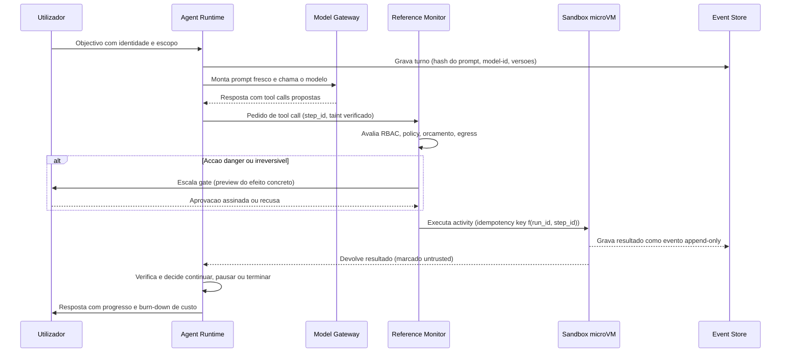
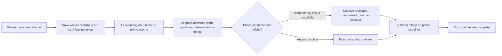
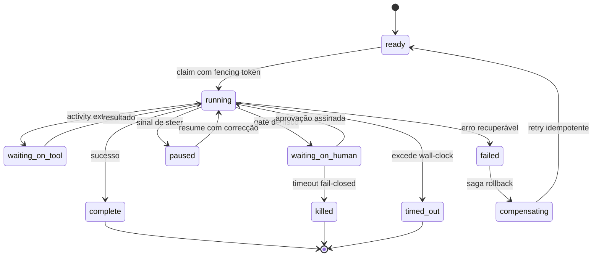

# Agent Runtime e Execução Durável — AOS

| Campo | Valor |
|---|---|
| Produto | AOS — Agentic OS de Referência |
| Documento | Técnica — Agent Runtime e Execução Durável |
| Versão | 1.0 |
| Data | Julho de 2026 |
| Classificação | Documento de Referência — Aberto |
| Documento-fonte | `_FONTE_agentic-os-ideal.md` |
| Documentos relacionados | `tecnica/00_Arquitectura_Solucao.md`, `tecnica/01_Reference_Monitor_Plano_Controlo.md`, `tecnica/03_Orquestracao_Escalonamento.md`, `tecnica/08_Observabilidade_Evals.md`, `specs/EPIC-02_Agent_Runtime_Execucao_Duravel.md` |

---

## 1. Introdução

### 1.1 Propósito

Este documento especifica o **Agent Runtime (RT)** — o componente do plano de execução que corre o *loop* do agente — e o primitivo de **execução durável** (*durable execution*) sobre o qual esse loop assenta. O RT é o batimento cardíaco do AOS: monta o prompt, chama o modelo, despacha as *tool calls* através do Reference Monitor e verifica o resultado, uma iteração de cada vez. A tese é que este loop, para ser digno de produção, tem de ser *durável ao nível do passo* — não *durável ao nível da tarefa*. Um crash a meio de um `POST` não-idempotente não pode re-executar o efeito no retry; um worker declarado zombie por engano não pode duplicar trabalho; um replay após evolução de código não pode divergir da trajectória original. Tornar estas falhas *arquitecturalmente impossíveis* é o objectivo.

### 1.2 Âmbito

Abrange: a anatomia do loop do agente e o seu contrato de turno; o contrato de execução durável (idempotência por passo, checkpoint intra-iteração, replay *resume-from-step*, isolamento de efeitos externos em *activities*); a máquina de estados durável do run; a *liveness* por lease/heartbeat com *fencing tokens*; e a saga de compensação. Fora de âmbito, remetidos para os documentos indicados: a mediação da tool call em si (`tecnica/01`), o grafo de tarefas e o *admission control* de orçamento global (`tecnica/03`), e a captura de spans e replay-como-observabilidade (`tecnica/08`).

### 1.3 Audiência

Engenheiros de runtime, arquitectos de plataforma, engenheiros de observabilidade e equipas de SRE responsáveis por operar e recuperar runs de agentes.

### 1.4 Definições e termos

- **Loop do agente:** ciclo iterativo montar prompt → chamar modelo → despachar tools → verificar, até *complete* ou paragem.
- **Durable execution (execução durável):** modelo em que cada passo é idempotente, checkpointado e reproduzível a partir de um log — *resume-from-step*, não *resume-from-task*.
- **Activity:** unidade de efeito externo (uma tool call, uma escrita) isolada, idempotente e mediada, cuja entrada e saída são gravadas como eventos.
- **Idempotency key:** chave determinística `key = f(run_id, step_id)` que garante que um efeito externo se aplica no máximo uma vez, mesmo com retries.
- **Fencing token:** contador monotónico que invalida escritas de um worker obsoleto.
- **Saga de compensação:** sequência de acções inversas que desfaz efeitos parciais de um passo falhado.

---

## 2. ADRs aplicáveis

Este documento concretiza dois ADRs canónicos e apoia-se em vários outros do catálogo (ver `tecnica/00_Arquitectura_Solucao.md`).

- **ADR-001 — Execução durável como primitivo (central).** Idempotência por passo (`key = f(run_id, step_id)`), checkpoint intra-iteração, replay *resume-from-step*, efeitos externos isolados em *activities* (integrar Temporal/Restate/DBOS ou implementar explicitamente o contrato). É o eixo estruturante de todo o RT.
- **ADR-008 — Admission control global em tokens/$ (central para orçamento).** Orçamento por árvore em tokens e custo (não iterações), token-bucket distribuído sobre TPM/RPM real, circuit breaker, e **reserva de headroom atómica** (compare-and-swap) antes de cada spawn. O RT consome e reporta débito; a reserva é imposta pelo Escalonador (`tecnica/03`).
- **ADR-002 — Reference Monitor mandatório.** Toda a tool call despachada pelo loop atravessa o RM antes de executar; o RT nunca chama tools directamente (`tecnica/01`).
- **ADR-009 — Layout de prompt cache-estável.** O RT remonta o prompt a cada turno preservando um prefixo imutável + tail append-only, e hasheia o prompt materializado no evento de turno.
- **ADR-010 — Observabilidade OTel GenAI + audit WORM.** Cada turno e cada activity emitem spans e ficam no event store, base do replay fiel (`tecnica/08`).
- **ADR-013 — Gates de risco e controlo bidireccional.** Os estados `waiting_on_human` e `paused` do RT concretizam o steer/interrupt e o timeout fail-closed.
- **ADR-015 — Durable execution: contrato próprio vs. engine externo (ratificado).** Decisão: **consolidar o contrato próprio** e expor uma porta `engine_adapter` estável que mantém o RT agnóstico ao backend (Princípio 8). Um engine externo (Temporal/Restate/DBOS) fica como backend plugável, subordinado ao Event Store como fonte de verdade (ADR-007). Concretizado em AOS-022 (§4.4).

---

## 3. Anatomia do loop do agente

O loop é conceptualmente simples e operacionalmente exigente. Cada iteração (*turno*) executa quatro fases: **(1) montar** o prompt a partir do estado durável; **(2) chamar** o modelo via Model Gateway; **(3) despachar** as tool calls propostas, cada uma como uma *activity* mediada; **(4) verificar** o resultado e decidir se continua, pausa ou termina. O ponto não-negociável é que o loop não guarda estado próprio na memória do processo: o estado autoritativo vive no event store. O processo do worker é *stateless* e descartável; qualquer worker pode retomar qualquer run a partir do log.

Duas propriedades tornam isto duro. Primeiro, o system prompt é **remontado a cada turno** — para preservar a estabilidade de cache (ADR-009) — **e** o prompt materializado é hasheado e gravado no evento de turno, junto com model-id, params/seed e versões de skills/tools. Assim ganha-se replay fiel sem sacrificar cache-hit-rate. Segundo, a fase de despacho não executa efeitos directamente: emite pedidos ao Reference Monitor, que aplica RBAC, policy-as-code, orçamento e egress antes de qualquer execução em sandbox.

### 3.1 Contrato do loop entregue (AOS-013)

O loop base é implementado no pacote `packages/kernel/agent-runtime` (`agentruntime`). Esta subsecção fixa o **contrato concreto** entregue por AOS-013 (o esqueleto do loop; a durabilidade ao nível do passo é AOS-014/015/017).

**Superfície pública.** `Runtime.Run(ctx, Goal) (Result, error)` percorre o ciclo montar→chamar→despachar→verificar. `Goal` traz `RunID` (stream_id), `Principal` (NHI + cadeia de delegação), escopo, `ModelConfig` (model_id/params/seed), o `System` prompt e o tool set **congelado** do run. `Result` devolve a resposta final (ou paragem por `MaxTurns`), o uso/custo agregado, os `ToolResults` (todos untrusted) e os `TurnSeqs` gravados.

**Evento canónico `turn.recorded`.** Cada turno grava um evento `turn.recorded` no Event Store (AOS-002) com o **manifesto por trajectória** (ADR-010): `prompt_hash` (sha256 do prompt materializado do turno), `system_hash`, `assembly_version`, `model{model_id,params,seed}` e as `tools`/`skills` **pinadas** (nome+versão+digest+servidor MCP). O `step_id` é distinto por turno (evita a deduplicação por `idempotency_key` do Event Store). O manifesto é gravado **inline** em cada evento — a indirecção canónica `dependency_manifest_ref`/`frozen_at_seq:1` (tecnica/13 §6) fica como dívida técnica ligada a AOS-016, porque o envelope do Event Store ainda não expõe o campo.

**Interfaces (portas) públicas.** `PromptAssembler` (prompt cache-estável: prefixo imutável byte-idêntico entre turnos + tail append-only; expõe `PrefixHash` como SLI de estabilidade, emitido no span `chat` via `aos.prefix_hash`); `ModelClient` (porta do Model Gateway — real em EPIC-06); `TurnRecorder` (materialização durável do `turn.recorded`); `Tracer` (spans OTel GenAI `invoke_agent`/`chat`/`execute_tool` com a semconv — real em EPIC-08).

**Garantia estrutural de no-bypass (ADR-002).** O `Runtime` detém um `*referencemonitor.Monitor`, **nunca** uma `ToolFunc`: o único caminho de execução de tools é `Monitor.Mediate`. A prova é estrutural (reflexão) + sintáctica (`archlint`). Cada resultado de tool volta ao loop **marcado untrusted** (ADR-005); um erro de tool permitida (`dec.ToolErr`) é propagado ao span (`error.type`) e ao tail, sem ser silenciosamente descartado.

**Pontos de ligação (hooks, default no-op).** `StepIdentity` — derivação do `step_id` (AOS-014, idempotência por passo). `Checkpointer` — checkpoint intra-iteração por fase `assembled`/`model_called`/`turn_recorded`/`dispatched`/`verified` (AOS-015). A máquina de estados durável rica (`waiting_on_human`/`paused`) é AOS-017.

**Fidelidade de replay.** O `prompt_hash` por turno permite **detectar** divergência no replay; a **reconstrução** do tail exige o journaling durável dos inputs não-determinísticos, **implementado** em AOS-016 (§4.3): o `EventStoreCapturer` persiste a resposta do modelo e os outputs das tools por turno, e o `ReplayEngine` reconstrói a trajectória a partir do log. Ver `packages/kernel/agent-runtime/replay`.

---

## 4. Contrato de execução durável

A execução durável é o primitivo (ADR-001). O AOS admite duas realizações equivalentes: **integrar** um motor de durabilidade (Temporal, Restate, DBOS) ou **implementar explicitamente** o mesmo contrato sobre o event store replicado. O contrato tem quatro cláusulas.

**Idempotência por passo.** Cada efeito externo tem uma `idempotency key = f(run_id, step_id)` determinística. A activity verifica, antes de aplicar, se essa chave já produziu resultado gravado; se sim, devolve o resultado memorizado em vez de re-executar. Isto garante *zero efeitos duplicados no retry* — o driver não-funcional canónico. O `step_id` é atribuído deterministicamente pela posição no log, não por relógio nem por UUID aleatório.

**Checkpoint intra-iteração.** O estado do loop é persistido *dentro* da iteração, não apenas nas suas fronteiras. Cada evento — turno gravado, tool call emitida, resultado recebido — é um ponto de checkpoint. Um crash entre o despacho de uma tool call e a recepção do seu resultado é recuperável: ao retomar, o RT reconstrói o estado até ao último evento e sabe que a activity está pendente.

**Replay resume-from-step.** A recuperação não recomeça a tarefa do zero (*resume-from-task*), mas retoma a partir do último passo confirmado (*resume-from-step*). O RT reprocessa o log de eventos aplicando as decisões já registadas — os inputs não-determinísticos (respostas do modelo, resultados de tools, relógio) são *lidos do log*, não regenerados. O que resulta é replay determinístico: os mesmos eventos produzem o mesmo estado.

**Efeitos externos isolados em activities.** Nenhum efeito externo acontece no corpo do loop; todos vivem em activities. A distinção é a linha entre o que é *determinístico e reproduzível* (a lógica do loop) e o que é *não-determinístico e efémero* (chamar o mundo). Só assim o replay pode reexecutar a lógica sem reexecutar os efeitos.

### 4.1. Contrato de idempotência por passo — especificação (AOS-014)

A cláusula de idempotência por passo está **implementada** no subpacote
`packages/kernel/agent-runtime/durable`. O contrato publicado, consumível por
AOS-015/016/020/021/022, tem três peças e um modelo de garantia honesto.

**Função de chave — pura, determinística, injectiva.**
`IdempotencyKey(run_id, step_id) = run_id + ":" + step_id`. É byte-a-byte a forma
que o Event Store (AOS-002) já usa para deduplicar — um único espaço de nomes de
idempotência de ponta a ponta: a chave que a activity propaga ao downstream é a
mesma por que o ES deduplica. A função **rejeita** `run_id`/`step_id` vazios ou que
contenham `:`, fechando a colisão de deslocamento do delimitador (`("a","bc")` vs
`("ab","c")`); com o `:` proibido nos inputs, cada chave tem exactamente uma
decomposição (a função é injectiva; `SplitKey` é a inversa). Uma forma opaca
(SHA-256 hex) está disponível para logs/spans sem expor a chave em claro.

**`step_id` monotónico e estável.** O `StepSequencer` atribui `step_id`s puros na
posição do passo no log (número do turno), não em relógio nem UUID. O mesmo passo
lógico recebe sempre o mesmo `step_id` em execução, retry e replay — nunca
reatribuído. Implementa o hook `StepIdentity` de AOS-013 de forma aditiva
(`WithStepIdentity`), coordenando o significado de `step_id` com o checkpoint
(AOS-015) e o replay (AOS-016).

**Step-ledger de resultado.** `StepLedger.Apply(ctx, key, effect)` verifica
*already-applied* **antes** de qualquer efeito: se a chave já tem resultado
registado (in-memory, reconstruído do ES), devolve o memorizado sem correr o
`effect`; caso contrário corre o `effect`, regista `{key → status, resultado,
hash}` como evento durável `step.ledger.applied` no Event Store, e devolve o
resultado. O ledger é reconstruível do log (`Rebuild`) — sobrevive ao reinício do
worker. O envelope do evento de ledger usa uma `idempotency_key` namespaced
(`run_id:ledger-<step_id>`) para não colidir com o `turn.recorded` homónimo; esse
namespace é **reservado** — `Apply` recusa (`ErrReservedStepID`) um step_id de
negócio começado por `ledger-`, fechando estruturalmente a colisão na dedup global
do ES. A precedência *already-applied* opera em **dois âmbitos**: a verificação
in-memory reforçada por um **single-flight por-key** cobre o mesmo processo (colapsa
Applies concorrentes/repetidos no máximo a uma execução do `effect`); a garantia após
**restart-sem-`Rebuild`** ou entre workers distintos vem da **dedup durável no commit
do ES** (`StatusDuplicate`) **+ idempotência downstream**, não da verificação
in-memory — que é um atalho, não um single-flight durável.

**Observabilidade e segredos do ledger (delegações explícitas).** A vertente
**"eventos observáveis"** do DoD de AOS-014 está satisfeita pelo evento durável
`step.ledger.applied` no Event Store (fonte de verdade WORM, base do replay/ADR-010);
o `Observer` expõe contadores `apply`/`dedup` apenas na forma **opaca** (hash) da
chave. O **wiring OTel de spans/métricas** do `Observer` (default `NopObserver`, sem
emissão de span pelo próprio ledger) é **delegado a AOS-021** (activities), quando os
efeitos passarem pelo ledger — não é requisito de AOS-014. Quanto a **segredos**: o
`Result.Payload` é persistido **em claro** no ES (o cifrado por-titular é dívida de
EPIC-13); AOS-014 oferece uma guarda **opt-in** `WithSensitiveResults()` que recusa
memorizar Payload em claro não marcado como referência, mas a imposição por defeito
de resultados sensíveis por **referência/hash** (idealmente via helper ou validação no
contrato de activity) é **requisito explícito de AOS-021**.

**Modelo de garantia (honesto).** Exactly-once verdadeiro do efeito externo é
impossível sem cooperação downstream. O contrato é **at-least-once + idempotência
downstream honrando a key = 0 efeitos OBSERVÁVEIS duplicados**. O `effect` pode
correr mais de uma vez (crash entre o efeito e o commit do ledger); a deduplicação
dos efeitos externos é do downstream, pela chave determinística que o `effect` lhe
propaga. O teste de fault-injection modela um downstream que honra a key e prova
que, com crash antes ou depois do commit, o efeito é registado uma vez observável.

### 4.1.1. Contrato de activity — isolamento de efeitos externos (AOS-021)

O contrato de activity está **implementado** no subpacote
`packages/kernel/agent-runtime/activity` (`contract.go`, `dispatch.go`). É o **ponto
de composição** que unifica, num único despacho, as fundações já *Done* — **não**
reimplementa nenhuma: idempotência (ledger AOS-014), mediação (Reference Monitor
AOS-003), replay (AOS-016), taint (ADR-005) e registo de compensação (AOS-020). É a
materialização de "cada efeito externo é uma *activity* durável, isolada, idempotente
e mediada".

**A activity é uma descrição, não uma função de efeito.** `Activity{RunID, StepID,
ToolID, Capability, Resource, Input, …}` **descreve** o efeito; não contém uma função
directamente invocável. O efeito é a **tool registada no RM**, e a única via de a
executar é `rm.Mediate` (AOS-003) — que exige um *permit não-forjável* (campo
não-exportado, uso único). É esta indirecção que dá o **no-bypass estrutural**: o
`Dispatcher` traduz a activity num `referencemonitor.Call` e chama `Mediate` **dentro**
do `effect` do ledger; sem permit, a tool nunca corre.

**Fluxo `ModeNormal` de `Dispatcher.Dispatch`.** (1) deriva `key = run_id:step_id`
(AOS-014); (2) `ledger.Apply` verifica *already-applied* **antes** do efeito — se já
aplicado, devolve o resultado memorizado (`Deduplicated`) sem re-executar; (3) o
`effect` **medeia pelo RM antes de executar** — `deny`/`escalate` → `ErrMediationDenied`
(zero efeito, nada memorizado); só sob permit a tool corre; (4) memoriza `{status,
output}` como `step.ledger.applied` (append-only); (5) **regista a compensação** (se
houver) no `CompensationRegistry` de AOS-020, ancorada ao `step_id`, **após `Apply` e em
AMBOS os caminhos — applied E dedup** (AOS021-Q1, ver a seguir); e (6) devolve o
resultado **sempre marcado `untrusted`** (ADR-005). Uma tool permitida que falhe a
jusante → `ErrToolExecution` (nada memorizado, retriável). O custo do efeito é emitido
por span (`gen_ai.usage.cost_usd`) **apenas no caminho applied** (efeito real de agora;
AOS021-Q5) — em dedup nenhum custo é incorrido, pelo que emiti-lo faria um agregador
somá-lo por retry.

**Pré-condição de segurança: estabilidade do `step_id` (AOS021-Q2).** A idempotency key
liga-se a `(run_id, step_id)` — **não** aos parâmetros do call (`ToolID`/`Capability`/
`Resource`/`Input`). No caminho dedup a mediação do RM é **saltada** e o resultado
registado é devolvido sem re-verificar que o call actual iguala o mediado da 1.ª vez. É,
por isso, **contrato explícito** que o mesmo `(run_id, step_id)` identifique sempre o
mesmo call lógico: o `step_id` determinístico (posição no log, via `SubStepID` — não
relógio nem UUID) é a **"entrada normalizada"** que âncora a identidade da activity. Não
há hash separado do payload de input no evento (o `step.ledger.applied` guarda `status` +
`output` + hash do **resultado**); a ligação forte call→resultado por fingerprint durável
(recusar em dedup um call divergente) fica para a evolução do evento de ledger / adaptador
de engine. O `taint` não é persistido mas é garantido **por construção** (o resultado sai
sempre `untrusted`).

**Compensação: alcance e limite (AOS021-Q1).** O registo da compensação é **desacoplado
da execução do efeito**: corre após `Apply` tanto no applied (efeito agora) como no dedup
(already-applied). É isto que torna a intenção de compensar **reconstruível na retoma** —
um worker novo que re-despacha os passos aplicados (obtendo dedup) restaura as
compensações no `registry` antes de a saga as correr em LIFO; sem isto, a saga percorreria
um `registry` vazio e transitaria `compensating → ready` **sem reverter nada**. *Limite
honesto:* o `registry` é in-memory e a `Action` é uma closure não-serializável, pelo que a
reconstrução **assenta no re-despacho** dos passos pelo loop na retoma. A durabilidade
**plena** da intenção (marcador por `step_id` no Event Store + factory de compensação por
`ToolID` no rebuild) fica para o adaptador de engine (AOS-022).

**`ModeReplay` — zero efeito estrutural (AOS-016).** `NewReplayDispatcher(src)` constrói
um dispatcher que **não detém RM** (`rm == nil`): `Dispatch` devolve o resultado
**registado** da `ReplaySource` (satisfeita por `*durable.StepLedger` após `Rebuild`, ou
por um adaptador do journal de AOS-016), com zero efeito e sem mediação. Um log
incompleto → `ErrReplayMiss` (nunca execução ao vivo como fallback). O teste prova que
o contador de execuções da tool fica em **0** em replay.

**Separação (lint) — `activity/separation`.** Um analisador AST (stdlib, zero-dep, como
o archlint de AOS-003) **detecta um efeito externo directo** (`http.Get`, `os.Open`,
`exec.Command`, `net.Dial`, …) escrito na lógica do loop **fora de uma activity**, com
`testdata` bom/mau. `AnalyzeTree` corre **recursivamente** (AOS021-Q4) sobre TODO o
núcleo determinístico — raiz (AOS-013) **e** subpacotes (`durable`, `saga`, `state`,
`liveness`, `replay`) — saltando `testdata` e o próprio analisador (que faz I/O de
ficheiro por construção); exige **0** violações. *Limite tratado (AOS021-Q3):* casa só a
forma sintáctica trivial `pkg.Fn(...)` — **não** apanha import aliasado (`h.Get`), método
sobre valor de cliente (`client.Do` — a forma idiomática real de I/O HTTP) nem valor de
função; um `testdata/evasion` com teste que assevera **0 flags** fixa esse limite
explicitamente. `http.NewRequest` (sem I/O) e o inexistente `http.Do` foram **removidos**
do conjunto para não dar falso positivo / entrada morta. É defesa-em-profundidade — a
garantia forte é **estrutural**.

**Adopção pelo loop (AOS-013): diferida (integração).** O escopo estrito de AOS-021 é o
**contrato** (o subpacote `activity` + testes). O loop base medeia hoje cada tool call
**directamente** via `rm.Mediate` (no-bypass + taint garantidos; ver §4), mas ainda **não
despacha** via `Dispatcher.Dispatch` — logo a idempotência/replay pelo step-ledger não
cobre ainda o efeito externo **em execução** do loop (o checkpoint de §4.2 é AOS-015, não
a dedup do ledger). Ligar o loop ao `Dispatcher` (substituir o `rm.Mediate` directo por um
despacho ledger-backed) é **wiring deferido** (adopção AOS-022 / ticket de integração).

**Agnóstico ao engine (AOS-022).** As peças que o `Dispatcher` consome são interfaces
(`Mediator`, `Ledger`, `ReplaySource`, `CompensationRegistrar`). O adaptador de AOS-022
(Temporal/Restate/DBOS **ou** o contrato próprio) satisfaz `Ledger`/`ReplaySource` sobre
o seu backend **sem alterar esta API**: `Activity`↔activity/step, `Ledger.Apply`↔
memoização exactly-once-observável, `ReplaySource`↔event history relido no replay.

### 4.2. Checkpoint intra-iteração e resume-from-step — especificação (AOS-015)

O checkpoint intra-iteração está **implementado** no mesmo subpacote
`packages/kernel/agent-runtime/durable` (`checkpoint.go`, `resume.go`), sobre o
Event Store replicado (ADR-007) como fonte de verdade. Materializa a cláusula de
*checkpoint* do contrato: o RT retoma no **último passo confirmado dentro da
iteração**, sem repetir passos aplicados nem perder passos pendentes.

**Checkpointer — evento append-only por fase confirmada.** O `EventStoreCheckpointer`
é o `Checkpointer` REAL do hook de AOS-013 (ligação aditiva via `WithCheckpointer`,
sem alterar a forma do loop). Por cada fase confirmada de um turno
(`assembled`/`model_called`/`turn_recorded`/`dispatched`*/`verified`) escreve um
evento `step.checkpoint` cujo payload é o **cursor de progresso**
`{ run_id, confirmed_step_id, turn, phase, step_index, pending_activities }`. O
cursor **referencia, não copia**: a resposta do modelo permanece no `turn.recorded`
(AOS-013) e o resultado da activity no `step.ledger.applied` (AOS-014) — o checkpoint
é só um marcador barato de progresso. A `idempotency_key` do envelope é **namespaced**
(`run_id:ckpt-<phase>-<step_id>`), um **terceiro** domínio de dedup, distinto do
turno (`run_id:step_id`) e do ledger (`run_id:ledger-<step_id>`); re-escrever o mesmo
checkpoint num retry dá `StatusDuplicate` (a escrita é ela própria idempotente).

**Consistência checkpoint↔ledger.** O `confirmed_step_id` gravado é **exactamente** o
`step_id` que o ledger de AOS-014 usa para o mesmo passo lógico — para uma activity,
`SubStepID(run, turn, n) = step-NNNNNN-tool-n`. O mesmo passo lógico tem, pois, o
mesmo identificador no ledger E no checkpoint (provado por teste).

**Resumer — cursor de retoma.** `Resumer.Resume(ctx, run_id)` relê os checkpoints do
stream e devolve o `ResumePoint`: a **fronteira** é o último checkpoint por `seq`
(escritos pela ordem de execução). A tradução para o próximo passo é **pura**: fase
`verified` do turno *T* ⇒ retoma no turno *T+1*; fase `dispatched` com pendentes ⇒
retoma na 1.ª activity pendente do turno *T* (salta as confirmadas); sem checkpoints
⇒ retoma do início (turno 1). O checkpoint dá **eficiência** (salta o trabalho
confirmado); o step-ledger é a **rede de segurança** — se um passo for na mesma
re-executado, o downstream deduplica pela chave determinística. O `ResumePoint` é
**serializável e estável**, preparado para o replay determinístico (AOS-016) consumir
o cursor e arrancar de qualquer `step_id`.

**Durabilidade sob failover e cache de prompt.** Como os checkpoints vivem no Event
Store replicado por quórum, o cursor **sobrevive à morte do worker** que os escreveu:
um worker novo constrói um `Resumer` sobre o mesmo cluster e recupera a fronteira
(análogo de leitura do `Rebuild` do ledger). O teste de integração exercita o **loop
real** + **failover** (ES de 3 réplicas, `Kill` do líder + eleição da follower, e
`Revive`/resync) e confirma que o cursor de retoma se mantém idêntico. A escrita de
checkpoint **não muta o prefixo cache-estável** do prompt (ADR-009) — o checkpointer
nunca toca no assembler, só **cresce** o registo append-only; um teste compara o
prefixo de um run com checkpointer real contra um run no-op e exige igualdade
byte-a-byte. A recuperação é provada com crash em **seis pontos distintos** de uma
iteração multi-passo.

### 4.3. Replay determinístico resume-from-step (AOS-016)

O replay determinístico está **implementado** no subpacote
`packages/kernel/agent-runtime/replay` (`nondeterminism_capture.go`, `engine.go`),
em duas metades complementares que fecham a cláusula de *replay* do contrato.

**Captura de não-determinismo — o gap-filler.** O `turn.recorded` de AOS-013 grava
o manifesto (hashes, model-id/params/seed, versões pinadas) mas **não** os inputs
crus — sem eles o replay detecta divergência mas não reconstrói. O
`EventStoreCapturer` implementa o hook aditivo `Capturer` do loop (ligação via
`WithCapturer`, sem alterar a forma de AOS-013: default no-op ⇒ byte-idêntico) e
persiste, por turno, um evento **`replay.captured`** com (a) a **resposta do modelo
completa** (texto + tool calls + uso + custo + `final`), (b) o **output de cada tool
call** (untrusted + eventual erro) e (c) o **relógio** (`observed_at`). O **seed**
não é duplicado — vem do manifesto (`model.seed`). O envelope usa a `idempotency_key`
namespaced `run_id:cap-<step_id>` — o **quarto** domínio de dedup por passo,
distinto do turno, do ledger e do checkpoint. Resultados **sensíveis** são gravados
só como referência (`payload_ref = sha256`), nunca PII em claro (`WithSensitiveResults`,
análogo a AOS-014). Serialização canónica/estável (structs, sem mapas).

**Motor de replay.** `ReplayEngine.Replay(ctx, run_id, opts)` relê o stream do run e,
por turno a partir do `FromStepID` (ou do início): re-materializa o prompt com o
**mesmo `PromptAssembler`** e a **mesma construção de tail** do loop (funções
exportadas `TailFromModelText`/`TailFromToolResult` — reuso, não réplica), **compara**
o `prompt_hash` re-materializado com o gravado, e obtém a resposta do modelo de um
**cliente de replay** (devolve o registado, nunca ao vivo) e o resultado de cada tool
de um **dispatcher de replay** (devolve o registado, nunca executa). Os inputs
determinísticos (system, tool set congelado, objectivo, memory_context) são
re-fornecidos via `TrajectorySpec` — são código/config; **alterá-los simula a
evolução de código** e o motor **localiza o passo** onde o hash diverge
(`ReplayDivergence{ StepID, Turn, ExpectedHash, ActualHash }`), parando aí.

**Resume-from-step.** `FromStepID` arranca de qualquer `step_id`: os turnos
anteriores são **dobrados** a partir do log (zero efeitos) para reconstruir o estado
(o tail) e a verificação começa no ponto de retoma. O `FinalStateHash` é **idêntico**
entre um replay completo e um resume do mesmo run — a prova de que o resume produz o
mesmo estado. Consome o cursor de AOS-015: o `ResumePoint.NextStepID` de um `Resumer`
é passável directamente como `FromStepID`.

**Zero efeitos externos — garantia estrutural.** O `ReplayEngine` detém **apenas**
um `EventReader` (só `Read`) e um `Tracer`: **não tem** `ModelClient`, Reference
Monitor, registo de tools nem `Append`. Não existe, por construção, caminho para um
efeito ao vivo. Provado por teste comportamental (o contador de execuções de tool
não mexe; o stream não cresce) e estrutural (reflexão sobre os campos do struct). A
cobertura do subpacote é ≥ 90 % com `-race` limpo; a fidelidade de replay é 100 %
nos testes (mesma sequência de `step_id`, `prompt_hash` por turno coincide).

### 4.3.1. Harness de replay/idempotência + gate 8 (AOS-024)

As propriedades de replay determinístico (§4.3) e idempotência por passo (§4.1.1)
têm de ser **verificáveis de forma repetível e automática**, não por inspecção
manual. O harness de AOS-024 (`packages/kernel/agent-runtime/harness`,
`replay_idempotency.go` + `fixtures.go`) **orquestra e afere** as peças já Done —
**não reimplementa** replay nem ledger. Dado um **run gravado**, verifica: **(a)**
replay determinístico (corre o `ReplayEngine` de AOS-016; falha se algum passo
divergir; suporta `resume-from-step`); **(b)** idempotência por passo (reexecuta
cada efeito sob um calendário *at-least-once* com **crash intercalado** — ledger
reconstruído do log — e confirma **zero efeitos observáveis duplicados** via o
`StepLedger` de AOS-014); **(c)** **fault-injection** parametrizável (pontos de
crash → retoma no estado correcto). Emite um **relatório de fidelidade**
(`FidelityReport`/`AggregateReport`) com serialização JSON **estável** (structs, sem
mapas), consumível pelo driver `replay-fidelity` (§9 de `01`).

**Golden trajectories.** Trajectórias de referência **determinísticas e
versionadas** (`BuildEchoGolden`, `BuildImmediateFinalGolden`, `GoldenSet`),
construídas correndo o loop real de AOS-013 com relógios injectados e modelo
guionado — reprodutíveis entre execuções e reutilizáveis por EPIC-11 (que as
**consome sem duplicar** o eval harness de comportamento de AOS-114).

**Meta-testes (a prova de que o harness funciona).** O harness **apanha** uma
trajectória adulterada (divergência localizada) e um efeito duplicado injectado
(idempotency key não-determinística), e as fixtures são estáveis sob `-count` alto.

**Gate 8 fail-closed.** `scripts/ci/replay.sh` corre o harness via `go test`
(`require_tests` impede *green* vazio), emite o relatório e fica **vermelho** numa
trajectória divergente ou efeito duplicado. Ligado a `run.sh` (`ALL_GATES`),
`Makefile` (`ci-replay`) e `ci.yml` (job `replay` + agregador `gates`); o
`selftest.sh` (secção D) prova que uma trajectória adulterada bloqueia o gate.
Cobertura do harness ≥ 80 % com `-race` limpo; fidelidade 100 % / zero duplicados
nas golden.

### 4.4. Porta de execução durável agnóstica ao backend (AOS-022)

A decisão de substrato de durable execution está **ratificada em ADR-015**:
**consolidar o contrato próprio** (AOS-014/015/016/021) e expor uma **porta estável
que mantém o RT agnóstico ao backend** (Princípio 8 / anti lock-in). Um engine
externo (Temporal/Restate/DBOS) fica como **backend plugável** opcional, nunca um
rewrite. A fase *feature* está implementada no subpacote
`packages/kernel/agent-runtime/engine` (`engine_adapter.go`).

**A porta `Engine`.** É a interface que o RT usa **sem saber qual backend está por
baixo**. Expõe as operações do contrato de durable execution de forma independente
do substrato: `Dispatch(ctx, activity)` (efeito idempotente + mediado + registado —
delega no `activity.Dispatcher`, AOS-021), `Checkpoint(ctx, cp)` / `Resume(ctx,
run_id)` (cursor intra-iteração — delega em AOS-015), `Replay(ctx, run_id, opts)`
(replay determinístico — delega em AOS-016) e `Mode()`. As assinaturas seguem
**exactamente** as APIs de AOS-014/015/016/021 — a porta é uma composição, não uma
API nova.

**Adaptador de referência `OwnContractEngine`.** Implementa `Engine` **compondo** as
peças já Done sobre o **mesmo Event Store replicado** (ADR-007, fonte de verdade
única): `Dispatch → *activity.Dispatcher`, `Checkpoint → *durable.EventStoreCheckpointer`,
`Resume → *durable.Resumer`, `Replay → *replay.ReplayEngine`. **Não reimplementa
nenhuma garantia.** É precisamente o assentar de todas as peças num só log que
distingue o contrato próprio dos engines externos, que trariam um **segundo** log de
durabilidade (event history / journal / Postgres) e a consequente reconciliação de
duas fontes de verdade (ADR-015 §2). A opção `WithLedger` liga o **crash/failover**:
um worker novo reconstrói o ledger (`Rebuild`) do log e injecta-o no engine.

**Mapeamento de um backend externo (documentado, não implementado).** A
reversibilidade do ADR-015 é concreta — um engine externo satisfaria a **mesma**
porta sem tocar no RT: `Dispatch`→activity idempotente (Temporal) / handler com
idempotency key (Restate) / `@step` transaccional (DBOS); `Checkpoint`→event history
/ journal / estado do workflow; `Resume`→replay/recovery do workflow;
`Replay`→replayer do SDK. Em todos, o adaptador subordinaria o seu log ao ES.

**Prova de isolamento por contrato (Princípio 8).** O teste de contrato corre o
**cenário de referência** (run multi-passo com **crash e retoma**) sobre a porta e
prova: (a) o adaptador de referência passa a suíte de **idempotência** (AOS-014, 0
efeitos observáveis duplicados — verificado com **worker novo** que reconstrói o
ledger do log) e de **replay** (AOS-016, fidelidade 100 %, zero efeitos externos, e
divergência localizada ao mutar o `Spec`); (b) **trocar o backend** (adaptador de
referência ↔ um **stub/fake** `Engine`) **não altera o uso do RT** — o *mesmo* driver
de RT, escrito só contra a interface `Engine`, compila e corre com asserções
idênticas sobre ambos. Cobertura do adaptador ≥ 80 % com `-race` limpo.

**Fronteiras (abertas, herdadas do ADR-015).** *Enforcement* de fencing por-escrita
(AOS-018, item aberto); adopção do `Dispatcher`/`Engine` **pelo loop** (wiring
diferido, como em AOS-021); HA de produção sobre o ES replicado real
(NATS/JetStream), a validar em staging.

### 4.5. Wiring no composition-root do nó (AOS-180)

A execução durável é exposta no nó `aos` (`packages/cmd/aos`) através do
`integration.SecuredRuntime`, que substitui o despacho directo de tool calls por um
`activity.Dispatcher` backed pelo `durable.StepLedger`. O wiring é realizado no
`Bootstrap` quando `Config.DurableExecution == true`.

**Como se activa no artefacto entregue (AOS-191).** `Config.DurableExecution` é escrita a
partir da variável de ambiente **`AOS_DURABLE_EXECUTION`** em `nodeConfigFromEnv`
(`packages/cmd/aos/main.go`) — a única superfície de configuração do binário. É **opt-in**
(ausente/vazia ⇒ desligada) e **exige um Event Store durável**: `AOS_DURABLE_EXECUTION=1`
sem `AOS_EVENTSTORE_PATH` **recusa o arranque** (`ErrDurableExecutionNeedsDurableSubstrate`),
em qualquer modo — checkpoints, capturas e ledger sobre um store in-memory evaporariam no
reinício, que seria durabilidade anunciada e não cumprida. O banner de arranque declara
`execucao duravel (AOS-180): LIGADA|DESLIGADA` e sobre que substrato. Documentação de
operador em `deploy/node/README.md`.

> Até AOS-191 esta secção afirmava que a execução durável estava «exposta no nó `aos`»
> **sem nomear via de activação alguma** — e não havia nenhuma: nenhum caminho do binário
> escrevia o campo (achado REG-01 da auditoria v4; DUR-01 da v3). A afirmação só se tornou
> verdadeira com a variável acima.

Passos do wiring:

1. **Mesmo Event Store.** O `EventStoreCheckpointer` (`durable.NewCheckpointer`), o
   `EventStoreCapturer` de replay (`replay.NewCapturer`) e o `StepLedger`
   (`durable.NewStepLedger`) são construídos sobre a **mesma** instância
   `*eventstore.Store` que o nó usa para turnos e sinais de controlo. Assim, os
   quatro domínios de dedup (turno, checkpoint, ledger, replay) partilham a mesma
   fonte de verdade append-only.
2. **Dispatcher durável dentro da mediação.** `NewSecuredRuntime` compõe o
   `activity.Dispatcher` sobre o ledger e o `referencemonitor.Monitor`, e adapta-o a
   `agentruntime.ActivityDispatcher`. O efeito continua a ser mediado pelo RM (a
   mediação é a única via de execução), mas agora atravessa `ledger.Apply`, que
   deduplica pela chave `f(run_id, step_id)`.
3. **Retoma no arranque do run.** O `NodeService.hostRun` invoca
   `SecuredRuntime.RebuildLedger(ctx, runID)` **antes** de `Runtime.Run`. Num run
   novo o stream de ledger está vazio e `Rebuild` é no-op; numa retoma após crash ou
   failover reconstrói as entradas `already-applied`, garantindo que efeitos
   anteriormente executados não voltam a correr.
4. **Opcional e fail-closed.** Quando `DurableExecution == false`, todos os
   colaboradores duráveis permanecem `nil` e o `SecuredRuntime` usa os defaults
   no-op do loop (AOS-013). Quando `DurableExecution == true` mas a abertura do
   Event Store falha, o bootstrap aborta antes de compor o runtime.

O teste de aceitação `TestNode_DurableExecution_NoDoubleExecAfterRestart`
(`packages/cmd/aos/bootstrap_durable_execution_test.go`) prova o cenário de
referência: corre um run com uma tool call, fecha o nó, re-arranca sobre o mesmo
WAL, re-corre o mesmo `RunID` e assegura que a tool executou exactamente uma vez —
a segunda execução obtém deduplicação do ledger reconstruído.

---

## 5. Máquina de estados durável

A máquina de estados grosseira dos frameworks comuns (`ready → running → complete + blocked`) é insuficiente: confunde um gate humano legítimo com um worker pendurado, e não tem estados de suspensão de primeira classe. O AOS adopta estados duráveis distintos — cada transição é um evento no log, e os estados de suspensão (`waiting_on_tool`, `waiting_on_human`, `paused`) não colidem com a detecção de zombies.

Os estados repartem-se em três famílias. **Activos:** `ready` (elegível para claim), `running` (a executar sob um fencing token). **Suspensos:** `waiting_on_tool` (bloqueado numa activity externa), `waiting_on_human` (num gate HITL, com timeout fail-closed que transita para `killed`), `paused` (steer/interrupt aceite, retomável com correcção). **Terminais e de recuperação:** `complete`, `failed` (erro recuperável, que entra em `compensating` para a saga e regressa a `ready` com retry idempotente), `timed_out` (excedeu wall-clock) e `killed` (terminado por política ou timeout). A separação de `waiting_on_human` de `running` é o que impede que um gate humano pareça um worker morto — e vice-versa.

### 5.1 Tabela declarativa de transições (AOS-017)

A máquina é implementada como **dados**, não como lógica espalhada por `if/switch`: um conjunto declarativo dos pares `(from → to)` válidos (`packages/kernel/agent-runtime/state`, `transitions.go`). Qualquer par ausente da tabela é rejeitado com `ErrInvalidTransition` **sem** tocar no estado persistido. A tabela completa tem **13** pares sobre os **10** estados canónicos:

| # | De → Para | Gatilho | Pré-condição |
|---|---|---|---|
| 1 | `ready → running` | claim pelo worker | **fencing token válido** (o único par que o exige) |
| 2 | `running → waiting_on_tool` | activity externa | — |
| 3 | `waiting_on_tool → running` | resultado da activity | retoma sob o lease detido |
| 4 | `running → waiting_on_human` | gate de risco (HITL) | — |
| 5 | `waiting_on_human → running` | aprovação assinada | retoma sob o lease detido |
| 6 | `waiting_on_human → killed` | **timeout fail-closed** | TTL do gate excedido (ADR-013) |
| 7 | `running → paused` | sinal de steer/interrupt | — |
| 8 | `paused → running` | resume com correcção | retoma sob o lease detido |
| 9 | `running → complete` | sucesso | — |
| 10 | `running → failed` | erro recuperável | — |
| 11 | `running → timed_out` | excede o wall-clock | deadline de `running` excedido |
| 12 | `failed → compensating` | saga rollback | — |
| 13 | `compensating → ready` | retry idempotente | após compensação |

Terminais **absorventes** (zero saídas): `complete`, `killed`, `timed_out`. `failed` **não** é absorvente — a sua única saída é `→ compensating`. Os restantes 87 dos 100 pares da matriz 10×10 são inválidos por omissão (verificado por varredura exaustiva nos testes).

**Persistência e reconstrução (ADR-001).** Cada transição válida é um evento append-only `run.state.transition` no Event Store replicado (AOS-002), com `step_id` namespaced `state-N` — distinto dos domínios de dedup do turno (AOS-013), do ledger (AOS-014) e do checkpoint (AOS-015). O estado corrente é sempre reconstruível por `Machine.Rebuild(run_id)`, que adopta o `to` do evento de transição de seq mais alto — a máquina **sobrevive a crash**: um worker novo reconstrói do log e continua. O estado in-memory só avança **após** o commit durável, pelo que uma transição inválida ou uma falha do Event Store (fail-closed) nunca corrompe o estado.

**Fencing token (contrato partilhado com AOS-018).** O claim `ready → running` exige um `FencingToken` válido; AOS-017 define só o **contrato** (`FencingToken`/`Uint64Token`) e verifica presença/validade. A origem monotónica durável do contador, o heartbeat de renovação e a rejeição de escritas de token inferior no Event Store são **AOS-018**. As retomas de suspensão para `running` reentram sob o lease já detido e **não** re-exigem token.

**Timeout fail-closed (ADR-013).** `Machine.CheckDeadlines`, com um **relógio injectável** (testes determinísticos, sem sleeps), aplica: `waiting_on_human` há ≥ TTL → `killed` (nunca `running` em ambiguidade); `running` há ≥ wall-clock → `timed_out`. Os eventos `pause`/`resume`/`kill` são **expostos** (métodos finos sobre `Transition`) para o steer (AOS-023) e o lease (AOS-018) os accionarem — a lógica desses tickets não é implementada aqui.

### 5.1 Canal de steer/interrupt e estado `paused` (AOS-023) — `runtime/control` (`steer_channel.go`, `pause_resume.go`)

O plano-base oferecia streaming **read-only** (observação passiva). AOS-023 adiciona o **controlo bidireccional** que o ADR-013 exige — pausar → corrigir → retomar — materializando o estado `paused` sobre a máquina de AOS-017. A entrega é um **canal de controlo out-of-band**, `SteerChannel`, **separado do canal de dados** (o prompt): os sinais `pause`/`steer`/`resume` entram por `run_id`, **nunca pelo prompt**. É a distinção arquitectural central — confundi-los seria a escalada de privilégio que o ticket impede.

**Graceful pause no fim do turno.** `Pause(ctx, run_id, emitter)` regista o sinal e marca uma pausa **pendente**, mas **não** interrompe o trabalho a meio. O loop chama `GracefulPause` na **fronteira de fim de turno** — só aí, com **todas** as activities do turno confirmadas (sem efeitos parciais), a transição `running → paused` se materializa via o `StateGate` (o adaptador `MachineGate` sobre `Machine.Pause`/`Machine.Resume` de AOS-017). Um pause emitido a meio de um turno respeita a fronteira de activity: só toma efeito no fim desse turno.

**Steer autenticado e NÃO-untrusted (a fronteira de segurança).** `Steer(ctx, run_id, correction, emitter)` injecta uma correcção **autenticada** (assinatura do emissor verificada pelo `Authenticator`) e gravada como evento append-only `control.steer` **com a identidade do emissor** — o registo de **não-repúdio** de ADR-013. A correcção é uma **instrução do canal de controlo**, **distinta de dados untrusted** (ADR-005): conteúdo untrusted (resultado de tool / web) não carrega uma credencial de emissor válida, logo `Authenticate` rejeita-o e ele **nunca** se torna um steer nem autoriza acções. Um steer sem autenticação válida é rejeitado (`ErrUnauthenticated`) — a escalada de privilégio é impedida **por construção**. Na retoma, `Resume` devolve a correcção com taint **`trusted`** (injectável no loop como instrução confiável, nunca como dado untrusted) e materializa `paused → running`.

**Durável e reproduzível por replay.** Cada sinal aceite é **um** evento append-only no Event Store; a projecção corrente (pausa/correcção pendentes) é uma **dobra** desses eventos, reconstruível por `Rebuild`. É isto que faz o ciclo `pause → steer → resume` **sobreviver a crash** (um crash em `paused` → um worker novo relê o log e recupera a correcção **intacta**) e reproduzir-se fielmente por **replay** (AOS-016): os eventos de controlo são determinísticos e ordenados por `seq`, com `step_id` namespaced `ctrl-N` (distinto de `state-N`/turno/ledger/checkpoint — a dedup do ES é global por `idempotency_key`).

**Retoma AUDIT-FIRST e reconciliação de dedup.** A `Resume` grava o evento `control.resume` (com a identidade do emissor — **não-repúdio**) **ANTES** de materializar a transição `paused → running`: se o audit falhar, **nada** transita — a máquina fica `paused` e a correcção pendente fica intacta, e a projecção do canal iguala o que `Rebuild` reconstrói do log (sem re-pausa espúria nem re-aplicação da correcção num worker que recupere por replay; a ordem inversa deixaria, no crash entre a transição e o audit, a máquina `running` mas o log sem `control.resume` — divergência de replay e lacuna de não-repúdio). Uma retoma de um run sem pausa pendente é recusada (`ErrInvalidTransition`) **antes** de qualquer escrita. Simetricamente, o append de controlo **reconcilia o dedup fail-closed** (como a máquina de AOS-017): se o ES devolver `StatusDuplicate` para uma `idempotency_key` `ctrl-N` cujo evento persistido **não** corresponde ao sinal pedido (kind/emissor/correcção), recusa com `ErrControlLogDivergence` em vez de mutar a projecção a partir de um payload descartado.

**Contrato de identidade mínimo (AOS-005 opcional).** O `Emitter` é um contrato de identidade **local e mínimo** (ID + assinatura), com `HMACAuthenticator` como realização de referência (HMAC-SHA256, só stdlib). **Não** importa o módulo `platform/identity` de AOS-005 **de propósito** — mantém o agent-runtime com **zero dependências externas** e evita um ciclo de módulos; a identidade ed25519 real com cadeia de delegação liga-se por um adaptador de `Authenticator` quando o wiring de superfície (EPIC-12) o exigir. A **paridade de superfícies** (Slack/Telegram como cards) é UX de EPIC-12; aqui expõe-se apenas a **API do canal** e a sua prova por testes determinísticos (relógio e canal injectáveis, sem sleeps, `-race` limpo).

---

## 6. Liveness e fencing

Detectar um worker morto por **PID** falha silenciosamente em substratos distribuídos: o PID pode estar saudável num host enquanto o run está pendurado, ou o processo pode ter migrado. O AOS substitui isto por **lease/heartbeat com TTL**. Um worker só executa um run enquanto detém um *lease* válido, renovado por heartbeat periódico. Se o heartbeat cessa e o TTL expira, o run volta a `ready` e pode ser reclamado por outro worker.

O perigo desta abordagem é o **falso-positivo de zombie**: o worker original não morreu, apenas ficou lento, e agora dois workers julgam-se donos do mesmo run. A defesa é o **fencing token** — um contador monotónico incrementado a cada claim. Toda a escrita ao event store carrega o token do worker; o store rejeita escritas com token inferior ao último aceite. O worker obsoleto, ao tentar gravar, é fenced-out: a sua escrita é recusada e ele aborta. Assim garante-se *no máximo um escritor efectivo* por run, sem depender de relógios sincronizados. Este mecanismo é partilhado com o Escalonador (`tecnica/03`), que atribui os leases e resolve prioridade e backpressure.

**Implementação (AOS-018) — `runtime/durable` (`lease.go`, `fencing.go`).** A autoridade é o `LeaseManager`: `Claim(run)` reclama um run livre (nunca reclamado, ou com o lease expirado por ausência de heartbeat) e minta um `Lease{Token, TTL, ExpiresAt}`; `Heartbeat(lease)` renova o TTL enquanto o lease for o corrente e não tiver expirado (recusa com `ErrLeaseExpired`/`ErrLeaseSuperseded` caso contrário). A **origem e durabilidade** do contador monotónico é o **stream de lease do run** (`lease:<run_id>`) no Event Store: cada claim faz `Append` de um `lease.claimed{token}` com `WithExpectedSeq` (a concorrência optimista de AOS-002); dois claims concorrentes competem no mesmo slot — um vence, o outro relê e obtém um token **estritamente maior**. Não há contador só em memória — é reconstruível por replay do log replicado. O **relógio é injectável** (`Clock`), pelo que a expiração é testada sem *sleeps*. O **enforcement** é o `FencedAppender`, um **guard opt-in**: o consumidor **envolve** com ele as suas escritas de efeito (`Claim → token → Append`), e ele rejeita (`ErrStaleFencingToken`) qualquer escrita cujo token seja inferior ao corrente — a escrita obsoleta não chega ao log — e também, via `LeaseExpiryAuthority`, a de um detentor com lease **expirado** (janela expirado-mas-não-superado). O token mintado (`FencingToken`, um `uint64` com `Valid()`/`Value()`) satisfaz **estruturalmente** o contrato `state.FencingToken` de AOS-017 e alimenta directamente `Machine.Transition(ready → running)` — o claim — sem acoplar os pacotes. **Nenhum caminho decide liveness por PID** (auditado por teste). O teste-chave modela o cross-host por relógio + fencing: worker A reclama (token 1) e fica lento; o TTL expira; B reclama (token 2) e executa o passo; A "acorda" e tenta re-executá-lo com um efeito de `step_id` **distinto** (não-idempotente, invisível à dedup do ES) e o token 1 → **rejeitado só pelo fencing**; B mantém-se — **zero execução dupla**.

> **Alcance honesto do enforcement (AOS-018).** O fencing é um **guard opt-in** e só protege as escritas **efectivamente encaminhadas** pelo `FencedAppender`. Ele **não** está ligado aos caminhos de escrita internos do módulo: o step-ledger (AOS-014), o checkpointer (AOS-015) e a máquina de estados (AOS-017) persistem **directo** no Event Store. Nesses caminhos, o que impede duplicados **hoje** é a **dedup por `idempotency_key`** do Event Store (`StatusDuplicate`) **mais** a idempotência **downstream** — não o fencing; as camadas são **complementares**. Do mesmo modo, o claim `ready → running` valida por omissão só a **presença** do token; recusar um token **obsoleto** na própria transição exige ligar uma autoridade de staleness (`state.WithFencingAuthority`). **Limite conhecido (TOCTOU):** o token é consultado **externamente** e **não** é dobrado no CAS/envelope do evento de negócio — AOS-018 fecha, provado, o caso token-**estritamente-inferior**; o boundary token-**igual** sob concorrência real (dobrar o token no `expected_seq` durável) fica delegado à implementação de produção do Event Store. E a **durabilidade** e a monotonicidade **cross-host** herdam do backend do ES (o reference impl é in-memory): os testes de restart/failover provam **reconstrução-a-partir-do-log**, não persistência através da morte do processo.

**Espera legítima não colide com zombi (AOS-019) — `runtime/liveness` (`waiting_states.go`).** O falso-positivo mais subtil não é o cross-host, é o **gate humano**: um `waiting_on_human` parado horas parece um `running` pendurado, e a detecção por lease matá-lo-ia. AOS-019 separa **dois relógios**: o **relógio de trabalho activo** (o heartbeat/lease de AOS-018, que governa a liveness de `running`) e o **relógio de espera** (um TTL PRÓPRIO do gate humano). Nos estados de espera (`waiting_on_human`/`waiting_on_tool`/`paused`) o relógio de trabalho **pausa** — não é renovado, mas **também não conta como expirado-para-zumbi**. O `ZombieClassifier.Classify(RunLiveness{State, WorkLeaseExpired, GateDeadlineExceeded})` materializa a invariante não-negociável: um estado de espera é **sempre** `WaitingLegitimate` — **nunca** `Zombie`, **mesmo com o lease de trabalho expirado**; só `running` com o lease expirado é `Zombie` (o worker realmente preso — não-regressão). O TTL fail-closed do gate é preservado por um caminho **distinto** de "zombi": `waiting_on_human` com o `WaitingGate` (relógio de espera injectável, fronteira inclusiva **alinhada** com `Machine.CheckDeadlines`) **excedido** → `GateExpired` → `killed` (ADR-013), que é **matar o run por política**, não reatribuí-lo. O teste-chave (critério combinado) prova ambos: um run parado **100% do wall-clock de aprovação** com o lease de trabalho expirado **não** é morto por zombi (é `WaitingLegitimate` a toda a janela), **mas é** morto ao **exceder** o TTL do gate (`GateExpired` + `CheckDeadlines → killed`). A integração é **aditiva** (`RunLivenessFrom` compõe a entrada a partir da Machine de AOS-017, do lease de AOS-018 e do gate deste ticket, sem os acoplar nem os quebrar). **Anti-drift e fronteiras (remediação AOS-019):** o alinhamento gate↔Machine deixa de ser por convenção — `NewWaitingGateFrom(machine)` **deriva** o gate do MESMO `HumanApprovalTTL` e do MESMO `Clock` da Machine (o `NewWaitingGate(ttl,…)` legado permanece, com aviso de drift). Três fronteiras são agora **contrato explícito**: (i) `GateExpired` é **advisory** — quem mata é sempre `Machine.CheckDeadlines`, não o classificador; um `waiting_on_human` avaliado sem gate é fail-**open** (wiring incompleto, não espera legítima); (ii) `waiting_on_tool`/`paused` **não** têm backstop neste ticket — a sua fronteira é delegada ao timeout de activity (AOS-018) e ao breaker de EPIC-08 (com sinal wall-clock **absoluto**, não o `WorkClock` que congela nesses estados); (iii) os deadlines são **wall-clock** (o `enteredAt` perde a componente monotónica), assumindo um relógio sem saltos — gate e Machine degradam identicamente, logo concordam sempre entre si.

O orçamento hierárquico integra-se aqui: antes de o RT fazer spawn de um sub-agente, o Escalonador executa uma **reserva atómica** (compare-and-swap) de débito no token-bucket global (ADR-008). Sem headroom reservado, não há spawn — o que elimina o colapso agregado de rate limit em que muitos runs, cada um dentro do seu limite local, saturam colectivamente o provider.

---

## 7. Sagas e compensação

Nem todo o efeito externo é reversível por retry idempotente. Quando um passo falha *após* já ter produzido efeitos parciais no mundo — um recurso criado, uma reserva feita, uma mensagem enviada — a idempotência sozinha não basta: é preciso **desfazer**. O AOS modela isto como uma **saga de compensação**. Cada activity com efeito reversível regista, junto com o seu resultado, a acção inversa correspondente (a *compensação*). No estado `compensating`, o RT reproduz o log em sentido inverso, executando as compensações registadas dos passos já aplicados, cada uma também idempotente. Concluída a compensação, o run regressa a `ready` para retry limpo, ou — se a compensação for irrecuperável — fica **preso** em `compensating` e escala por alerta (não existe aresta `compensating → terminal` na tabela de AOS-017; ver §7.1).

Isto fecha o gap que os gates deixavam aberto: os gates *previnem* efeitos indesejados, mas nada faziam quando um efeito legítimo ficava a meio. A saga adiciona *recuperação* onde antes só havia prevenção. Efeitos irreversíveis (que não admitem compensação) são precisamente os que exigem gate `danger` com dual-control a montante (ADR-013) — a irreversibilidade empurra o controlo para antes da execução.

### 7.1 Semântica de realização (AOS-020)

A saga **compõe** as duas fundações duráveis já existentes — não as reimplementa. O
`SagaCoordinator` (pacote `saga`) coordena, o step-ledger (AOS-014) dá a idempotência e
a máquina de estados (AOS-017) dá as transições duráveis.

- **Registo de compensações.** Cada activity com efeito reversível regista, no momento
  em que aplica o efeito, a acção inversa associada ao seu `step_id`. O registo
  **preserva a ordem de aplicação** (registo idempotente por `step_id`), que é o que
  permite compensar por **ordem inversa** (LIFO).
- **Chave de compensação distinta.** Cada reversão corre dentro de `StepLedger.Apply`
  com a chave `f(run_id, comp-<step_id>)`, num **domínio de dedup separado** do efeito
  directo (`run_id:step_id`), do ledger (`run_id:ledger-…`), do checkpoint e da
  transição de estado. A verificação `already-applied` **precede** o efeito ⇒ reexecutar
  a saga **não duplica** a reversão (0 efeitos de compensação duplicados). O evento
  `step.ledger.applied` de cada compensação é o seu registo **append-only**.
- **Integração com a máquina (AOS-017).** Na entrada, `Compensate` aciona
  `failed → compensating`; concluída a compensação com sucesso, transita
  `compensating → ready` (retry limpo — a **única** aresta de saída de `compensating` na
  tabela). Ambas passam pela `Machine` (válidas, duráveis, reconstruíveis por replay).
- **Crash-resume.** Um crash *durante* a compensação retoma sem repetir as já aplicadas
  nem saltar as pendentes: um worker novo reconstrói o estado com `Machine.Rebuild`
  (estado = `compensating`) e `StepLedger.Rebuild` (conjunto de compensações já
  commitadas) e reitera a mesma sequência LIFO — o ledger deduplica as feitas e corre as
  que faltam. Um *crash-before-commit* (efeito aplicado mas registo não commitado) volta
  a correr o efeito na retoma (*at-least-once*), mas o registo durável fica **uma** vez.
- **Compensação que falha (honesta).** Uma compensação falhada é re-tentada de forma
  idempotente (uma tentativa falhada nada commita, logo o retry não duplica). Esgotada a
  política de retry, a saga **não finge sucesso**: **não** transita para `ready`, deixa o
  run **preso** em `compensating` e **escala por alerta** (`ErrCompensationExhausted`).
  A tabela de AOS-017 não tem aresta `compensating → killed`, pelo que a escalada é por
  **alerta + paragem**, nunca por uma transição forjada — a saga respeita a máquina.
- **Observabilidade sem segredos.** Os eventos de compensação são observáveis; as chaves
  entram sempre na forma **opaca** (hash) e o payload da reversão é vazio por convenção.

---

## 8. Vista de qualidade

**Arquitectura.** O RT concretiza a fronteira de durabilidade ao nível do passo — uma das três fundações não-negociáveis do AOS. A separação entre lógica determinística (loop) e efeitos não-determinísticos (activities) é o que torna o replay possível. O estado autoritativo no event store, com workers stateless, mantém o RT alinhado com a separação control/data-plane e evita qualquer SPOF de estado em memória.

**Escalabilidade.** Porque o worker é descartável e o estado vive no log, o plano de dados escala horizontalmente: adicionar workers aumenta o throughput sem coordenação de estado partilhado. A reserva de headroom atómica (ADR-008) impede que esse escalar se traduza em colapso agregado de rate limit. O checkpoint intra-iteração mantém o custo de recuperação proporcional ao trabalho perdido (um passo), não à tarefa inteira.

**Observabilidade.** Cada turno e cada activity emitem spans OTel GenAI (`invoke_agent`, `execute_tool`, `chat`) com `gen_ai.usage.*` e custo em USD, e ficam no event store append-only (ADR-010). O hash do prompt materializado por turno é a âncora do replay fiel: reproduz-se qualquer decisão a partir do manifesto de versões. O detalhe da captura de trajectória e do replay-como-observabilidade está em `tecnica/08`.

---

## 9. Riscos e mitigações

| Risco | Impacto | Mitigação |
|---|---|---|
| Double-execution de efeito externo no retry | Corrupção do mundo externo | Idempotency key = f(run_id, step_id); resultado memorizado por chave |
| Falso-positivo de zombie cross-host | Tarefa executada duas vezes | Lease/heartbeat + fencing token, nunca PID |
| Efeito parcial após falha a meio do passo | Estado externo inconsistente | Saga de compensação registada por activity; estado `compensating` |
| Colapso agregado de rate limit no spawn | Árvore de agentes autodestrói-se | Reserva atómica de headroom no token-bucket global (ADR-008) |
| Replay infiel após evolução de código | RCA e eval inválidos | Hash do prompt + model-id/params/seed + versões por turno (ADR-010) |
| Gate humano confundido com worker morto | Kill indevido de run legítimo | `waiting_on_human` como estado durável distinto de `running` |
| Cache thrash por remontagem de prompt | Explosão de custo silenciosa | Prefixo imutável + tail append-only; cache-hit-rate como SLI (ADR-009) |
| Timeout de aprovação deixa run pendurado | Recurso preso, custo acumulado | Timeout fail-closed: `waiting_on_human → killed` (ADR-013) |

---

## 10. Glossário

- **Loop do agente:** ciclo montar prompt → chamar modelo → despachar tools → verificar, iterado até paragem.
- **Durable execution:** modelo em que cada passo é idempotente, checkpointado e reproduzível — resume-from-step, não resume-from-task.
- **Activity:** unidade de efeito externo isolada, idempotente e mediada, cuja entrada e saída são eventos no log.
- **Idempotency key:** chave determinística f(run_id, step_id) que limita um efeito a aplicar-se no máximo uma vez.
- **Checkpoint intra-iteração:** persistência do estado do loop dentro do turno, não só nas suas fronteiras.
- **Resume-from-step:** retoma a partir do último passo confirmado, lendo inputs não-determinísticos do log.
- **Lease/heartbeat:** posse temporária de um run renovada periodicamente; substitui a detecção de liveness por PID.
- **Fencing token:** contador monotónico que invalida escritas de um worker obsoleto, garantindo um só escritor efectivo.
- **Saga de compensação:** sequência de acções inversas idempotentes que desfaz efeitos parciais de um passo falhado.
- **Reserva atómica de headroom:** compare-and-swap de débito no token-bucket global antes de um spawn (ADR-008).

---

## 11. Tabela de aprovação

| Papel | Nome | Assinatura | Data |
|---|---|---|---|
| Arquitecto de Plataforma |  |  |  |
| Responsável de Segurança |  |  |  |
| Responsável de Produto |  |  |  |

---

## 12. Controlo de versões

| Versão | Data | Descrição | Autor |
|---|---|---|---|
| 1.0 | Julho 2026 | Emissão inicial | Equipa AOS |
| 1.1 | Julho 2026 | AOS-022 (fase feature): porta `Engine` agnóstica ao backend + adaptador de referência `OwnContractEngine` (§4.4), sob ADR-015 ratificado | Equipa AOS |
