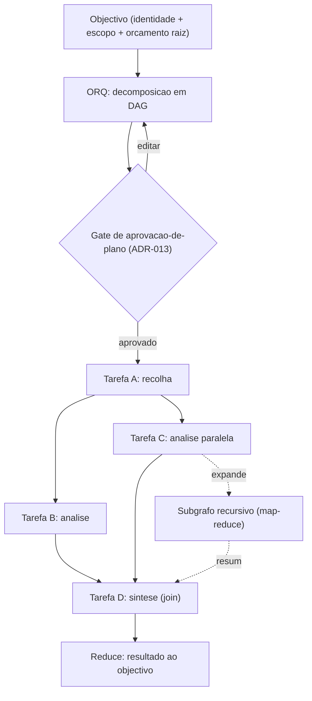
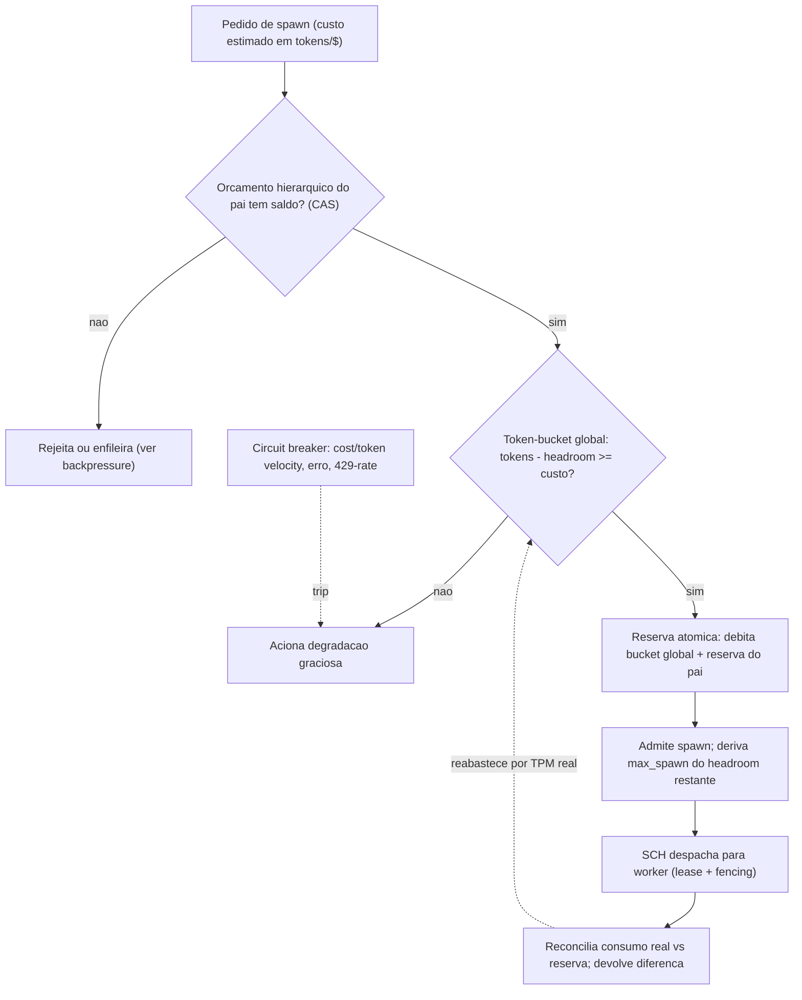
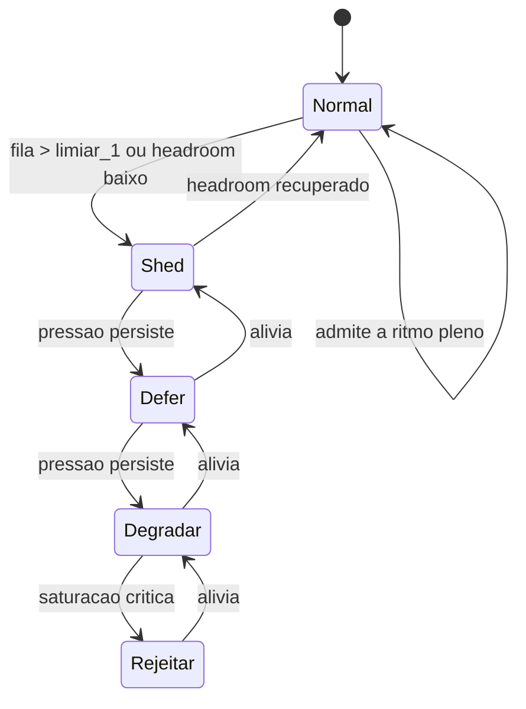
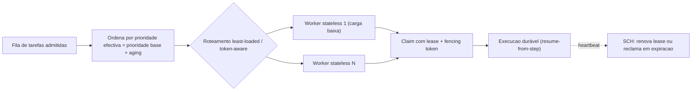

# Orquestração e Escalonamento — AOS

| Campo | Valor |
|---|---|
| Produto | AOS — Agentic OS de Referência |
| Documento | Documento técnico — Orquestração e Escalonamento |
| Versão | 1.0 |
| Data | Julho de 2026 |
| Classificação | Documento de Referência — Aberto |
| Documento-fonte | `_FONTE_agentic-os-ideal.md` |
| Documentos relacionados | `tecnica/02_Agent_Runtime_Execucao_Duravel.md`, `tecnica/06_Model_Gateway_Custos.md`, `specs/EPIC-03_Orquestracao_Escalonamento.md` |

---

## 1. Introdução

### 1.1 Propósito

Este documento especifica o **plano de controlo** do AOS na sua vertente de coordenação: como o **Orquestrador (ORQ)** decompõe um objectivo num grafo de tarefas acíclico e delega trabalho a sub-agentes, e como o **Escalonador (SCH)** admite, prioriza e regula a execução desse trabalho sobre um substrato distribuído. O eixo central é o *admission control* global denominado em **tokens/$** — não em iterações — que impede o modo de falha mais insidioso de sistemas multi-agente: cada unidade individualmente dentro do seu limite, o agregado a colapsar o rate limit partilhado.

### 1.2 Âmbito

Cobre: decomposição de objectivos e delegação; orçamento hierárquico por árvore com reserva atómica; *admission control* global via token-bucket distribuído sobre TPM/RPM real; *backpressure* e degradação graciosa; e *scheduling* priority-aware com *aging* e detecção de deadlock. Fora de âmbito: o loop interno do agente e a durabilidade ao nível do passo (ver `tecnica/02_Agent_Runtime_Execucao_Duravel.md`), e a mecânica de roteamento por modelo, chaves e custo unitário (ver `tecnica/06_Model_Gateway_Custos.md`). O backlog executável correspondente vive em `specs/EPIC-03_Orquestracao_Escalonamento.md`.

### 1.3 Audiência

Arquitectos de plataforma, engenheiros de runtime e de escalonamento, e SRE responsáveis pela capacidade e estabilidade do plano de controlo.

### 1.4 Definições e termos

- **Grafo de tarefas (DAG):** representação acíclica de subtarefas com arestas de dependência; a aciclicidade é invariante imposta, não convenção.
- **Lease / fencing token:** concessão temporária de execução com TTL e contador monotónico que invalida escritas de um worker obsoleto (ver `tecnica/02`).
- **Admission control global:** token-bucket distribuído que só permite *spawn* com *headroom* reservado no TPM/RPM real do provider (ADR-008).
- **Backpressure:** propagação de sinal de saturação a montante, com política declarativa de degradação em vez de acumulação ilimitada.
- **Aging:** incremento progressivo de prioridade efectiva para evitar *starvation* de tarefas de baixa prioridade.

---

## 2. Princípios e decisões aplicáveis (ADRs)

O ADR **central** deste documento é o **ADR-008 — Admission control global em tokens/$**: orçamento por árvore em tokens e custo (não iterações), token-bucket distribuído sobre TPM/RPM real, circuit breaker e reserva de *headroom* no admit. Aplicam-se ainda:

- **ADR-001 — Execução durável como primitivo.** O escalonamento assenta em leases/fencing e retry idempotente; o SCH nunca despacha sem que o passo seja *resume-from-step*.
- **ADR-007 — Event Store replicado.** O estado das tarefas e do token-bucket é derivado de um log append-only replicado, eliminando o single-writer como SPOF e tecto de throughput.
- **ADR-013 — Gates de risco + controlo bidireccional.** A degradação e a suspensão coexistem com os estados duráveis `waiting_on_human` e `paused`; o gate de aprovação-de-plano precede o *spawn*.

O ORQ e o SCH são os componentes canónicos do plano de controlo (catálogo do `_BRIEF`): o ORQ decompõe e delega; o SCH assegura durable execution, leases/fencing, prioridade, backpressure e detecção de deadlock.

---

## 3. Grafo de tarefas e delegação

O ORQ transforma um objectivo com identidade e escopo num **grafo de tarefas acíclico**. Cada nó é uma subtarefa delegável a um sub-agente — uma *non-human identity* própria na cadeia de delegação *on-behalf-of* (ADR-003) — e cada aresta exprime uma dependência de dados ou de ordem. O map-reduce recursivo legítimo é suportado: um nó pode expandir-se em subgrafo, desde que a aciclicidade e o orçamento sejam respeitados.

O **gate de aprovação-de-plano** (ADR-013) permite ao humano ver e editar o grafo *antes* de queimar tokens, separando a aprovação do plano da aprovação de acções individuais. A delegação segue o contrato de higiene do Princípio "contexto ≠ registo": o sub-agente devolve ao pai um resumo de 1–2 k tokens, enquanto a trajectória completa é persistida no backend de observabilidade (ver `tecnica/08`). Isto mantém o contexto do ORQ limitado e barato sem sacrificar o replay nem o eval-driven development.

### 3.1 Aciclicidade e detecção de deadlock

A aciclicidade é imposta na inserção de cada aresta por verificação incremental (o fecho transitivo não pode conter o nó de origem). A detecção de deadlock opera sobre o **grafo de espera** (*wait-for graph*): tarefas bloqueadas em leases, em resultados de sub-agentes ou em quota. Um ciclo no wait-for graph — por exemplo, dois sub-agentes à espera mútua de um lease escasso — dispara resolução: aborta-se a vítima de menor prioridade com saga de compensação (ADR-001) e liberta-se o recurso. Zombies são detectados por expiração de lease/heartbeat com fencing token, **nunca** por PID.

> **Implementação (AOS-025).** O DAG, a aciclicidade fail-closed na admissão de arestas, a ordenação topológica reprodutível em replay e o detector de deadlock vivem em `packages/control-plane/orchestrator` (`graph.go`, `deadlock.go`). Nós/arestas são persistidos como eventos append-only no Event Store (`task.node.created`, `task.edge.added`, `task.edge.rejected_cycle`) e o DAG reconstrói-se por replay com ordem **idêntica** (ADR-010). A espera circular emite `deadlock.detected` (conjunto de tarefas) e a resolução determinística — vítima de menor prioridade, desempate por recência — emite `deadlock.resolved`, libertando recursos e transitando o nó vítima `running→failed` pela tabela declarativa de AOS-017, **sem efeitos duplicados** (a libertação/transição é *gated* pelo commit do evento; um duplicado em replay não reaplica). O *admission control* global (AOS-027), a delegação a sub-agentes (AOS-026) e o scheduling priority-aware com aging (AOS-032) assentam **sobre** este grafo, fora do âmbito de AOS-025.

---

## 4. Orçamento hierárquico e reserva atómica

O cap de delegação fixo do plano-base é substituído por **orçamento hierárquico configurável** denominado em tokens/$ (ADR-008). Cada árvore de execução recebe um orçamento raiz; cada *spawn* debita uma reserva do orçamento do pai antes de existir. A operação é uma **reserva atómica** por compare-and-swap (CAS) sobre o contador partilhado, eliminando a corrida clássica do decremento não-atómico em que N sub-agentes passam simultaneamente um teste que só um deveria passar.

O invariante é simples e forte: **a soma das reservas dos filhos nunca excede o orçamento do pai**, e nenhum nó pode gastar além da sua reserva. O `max_spawn` deixa de ser uma constante e passa a ser **derivado dinamicamente** do orçamento disponível e do *headroom* global (secção 5). Assim, um subgrafo grande com pouco orçamento restante degrada para menos ramos em vez de saturar; um subgrafo com orçamento folgado paraleliza mais. A denominação em tokens/$ resolve o proxy péssimo que eram as iterações — uma única iteração pode arrastar 200 k tokens — e liga o circuit breaker a *velocity* de custo real.

> **Implementação (AOS-026).** A delegação a sub-agentes vive em `packages/control-plane/orchestrator/delegation.go` (`Delegator`), que **compõe** — não reimplementa — três fundações: o **orçamento CAS** (AOS-008, `control-plane/budget`), a **identidade NHI filha** (AOS-005/006, `platform/identity` via `Issuer.IssueChild`) e o **Reference Monitor** (AOS-003). Cada `Spawn` faz uma **reserva atómica** da fatia do filho ANTES de existir — `budget.Reserve` debita em cascata por toda a linhagem (filho→pai→raiz), pelo que é a reserva hierárquica (e não um contador partilhado com corrida) que impõe *soma-dos-filhos ≤ pai* com **0 overshoot** e *sub-orçamento herdado ≤ remanescente*, em **tokens e USD**. A árvore de orçamento espelha a de delegação: a fatia **própria** de cada agente é reservada no nó do filho e contada uma única vez na cascata (sem dupla contagem), com o limite do nó a deixar headroom para o **map-reduce recursivo**. A criação da identidade filha e o débito são **mediados pelo RM** (ADR-002): só sob um Permit não-forjável; uma negação **liberta** a reserva sem leak. A libertação/consolidação ao fim do sub-agente é **idempotente** (ADR-001) — `Finish(success)`→`Commit` (consumo real), `Finish(fail)`→`Release` (sem leak), ambos no-op no retry por `reservation.ID` + dedup do Event Store. Um spawn sem orçamento é recusado **fail-closed** com `subagent.spawn_denied_no_budget`, sem deadlock; profundidade e fan-out são **configuráveis** (`WithMaxDepth`/`WithMaxFanOut`). Os eventos append-only (`subagent.budget_reserved/spawned/budget_consumed/budget_released/spawn_denied_no_budget`) reconstroem a árvore de delegação, e o burn-down reconstrói-se por `budget.Rebuild`. O sub-agente integra-se no DAG de AOS-025 como nó-tarefa filho, com identidade coerente com a cadeia on-behalf-of, reconstruível por `RebuildDAG`. O token-bucket global TPM/RPM (secção 5) é AOS-027/028, **fora** deste âmbito.

---

## 5. Admission control global

O modo de falha central que este subsistema resolve é *agregado*: 15 árvores de execução, cada uma dentro do seu `max_spawn` local, saturam colectivamente o rate limit partilhado do provider e autodestroem-se em cascata de 429s e timeouts. A resolução é **reserva de headroom no admit** (ADR-008): o SCH não faz *spawn* sem débito reservado no **token-bucket distribuído** dimensionado pelo TPM/RPM **real** do provider, com uma fracção de *headroom* deixada de reserva para absorver picos e retries.

O token-bucket reabastece à taxa do TPM/RPM real observado no Model Gateway (ver `tecnica/06_Model_Gateway_Custos.md`), não a um valor teórico. O admit é uma **reserva de duas fases**: debita simultaneamente o bucket global e a reserva do pai; a **reconciliação** posterior devolve a diferença entre custo estimado e custo real, evitando tanto o *over-provisioning* pessimista como o *overshoot*. O **circuit breaker** multi-sinal (velocity de custo, taxa de erro, taxa de 429) faz *trip* para a degradação graciosa antes de o rate limit ser efectivamente atingido. As quotas são multidimensionais por tenant, de modo que a saturação de um board não penaliza outro.

> **Implementação (AOS-027).** O admission control global vive em `packages/control-plane/scheduler` (`admission.go` + `quota.go`), **estendendo** — não recriando — o esqueleto do SCH (AOS-012). O TPM/RPM real entra por uma **porta** `QuotaProvider` (dado `provider:model:region` devolve `ProviderLimits{TPM, RPM, Window}`); o Model Gateway (EPIC-06) implementá-la-á, e a impl de referência determinística (`StaticQuotaProvider`) fecha o contrato entretanto — **nunca** há limites hard-coded como fonte. A **reserva atómica sem SPOF** (ADR-007) é um **Append CAS** (`WithExpectedSeq`) ao stream do bucket no Event Store replicado (chave `admission/bucket/provider:model:region`): cada worker *stateless* relê o estado, dobra o headroom e tenta reservar; o perdedor de corrida relê e re-tenta, sem *single-writer* nem contador em memória. `Admit(cost_estimate) → {granted, retry_after}` reserva débito se há headroom; **sem headroom ADIA** (defer com `retry_after` derivado do refill), **nunca descarta**. O **refill é temporizado** com relógio **injectável** (sem `time.Now` na decisão): uma reserva expira ao fim de `Window` (janela deslizante por reserva), pelo que a soma das reservas activas **nunca excede** o TPM/RPM efectivo — invariante provado sob carga concorrente com `-race` (`TestAdmit_ConcurrentNoOversubscription`). As **quotas por tenant** (`TenantQuotaProvider`) particionam o bucket global preservando **sempre** o tecto global (um tenant nunca excede o global, mesmo com folga na sua partição — `TestAdmit_TenantNeverExceedsGlobal`). Cada decisão é um **evento append-only** (`admit_requested`/`admit_granted`/`admit_deferred`/`quota_released`), com grants/releases no stream de reserva (fonte de verdade, com CAS) e o rasto de auditoria num stream à parte; a **sequência de admissões reconstrói-se por replay** (`Replay`/`ReplayAudit`, determinístico — ADR-001). Os spans OTel (headroom e custo por span) reutilizam a porta `agentruntime.Tracer` zero-dep. **Fora** deste âmbito: `max_spawn` do headroom (AOS-028), circuit breaker (AOS-029), backpressure/filas (AOS-030), degradação (AOS-031) e o próprio Model Gateway (EPIC-06).

> **Implementação (AOS-028).** O `max_spawn` **constante** é substituído por um valor **derivado dinamicamente do headroom**, no `SpawnCoordinator` (`packages/control-plane/scheduler/spawn_admission.go`), que **compõe** — não reimplementa — a delegação hierárquica (AOS-026, `orchestrator.Delegator`: sub-orçamento por árvore) com o admission control global (AOS-027, `Admission`: token-bucket distribuído). A coordenação vive no módulo `scheduler` (que já importa `orchestrator`), sem ciclo de imports. A **derivação** é pura e determinística: `max_spawn = min(headroom_tokens / custo_por_subagente, headroom_requests)`, **reavaliada a cada pedido** (nunca constante), **monótona** (mais headroom ⇒ ≥ *spawns*) e **0** sob headroom nulo; `Admission.Headroom` reusa o `foldBucket` do AOS-027 — o **mesmo** estado que o `Admit` decide. **Antes de qualquer *spawn*** reserva-se headroom no admit (`Admit(custo)`): sem headroom **ADIA** (`spawn_deferred_no_headroom` com `retry_after`), **não** cria o sub-agente e **não** força *oversubscription*; custo > tecto é rejeição **permanente** (distinta do *defer*). Só depois se delega ao `Delegator.Spawn`, que reserva o **sub-orçamento da árvore** — **ambos** os limites têm de conceder: se o global concede mas o sub-orçamento **nega**, a reserva de headroom é **LIBERTADA** e o *spawn* recusado, **sem fuga de duas-fases** (o risco central). Ao terminar (sucesso, falha **ou** timeout), `Finish` consolida o sub-orçamento (`Commit`/`Release`) e liberta o headroom (`Release`) de forma **idempotente** (guard atómico + dedup por `step_id`): a contagem de reservas activas volta sempre a 0, provado sob `-race` (`TestRequestSpawn_ConcurrentNoOversubscriptionAndIdempotentFinish`, `TestRequestSpawn_TwoPhaseSubtreeDeniesReleasesHeadroom`). Os **eventos append-only** (`spawn.headroom_reserved`/`spawn.headroom_released`/`spawn.spawn_deferred_no_headroom`, com o headroom reservado por *spawn*) reconstroem-se por replay (`ReplaySpawnAdmission`), e o span OTel `spawn_admission` carrega o headroom reservado por *spawn* (porta `agentruntime.Tracer` zero-dep). **Fora** deste âmbito: circuit breaker (AOS-029), backpressure/filas (AOS-030), degradação (AOS-031), scheduling priority-aware (AOS-032), roteamento (AOS-033), métricas de saturação (AOS-034).

---

## 6. Backpressure e degradação graciosa

Em vez de acumulação ilimitada de fila e cascata de timeouts, o AOS aplica **filas limitadas com política declarativa de degradação graciosa**. Quando a admissão não pode ser satisfeita — bucket global sem headroom, circuit breaker em trip, ou fila cheia — o SCH percorre uma escada ordenada de respostas: **shed → defer → degradar para modelo mais barato → rejeitar**.

Cada degrau tem semântica precisa:

- **Shed** — descarta ou recusa liminarmente trabalho de baixa prioridade e não-crítico (por classe declarada), aliviando a fila sem afectar tarefas P0.
- **Defer** — adia trabalho diferível, reenfileirando com backoff; o estado durável garante que nada se perde e o retry é idempotente (ADR-001).
- **Degradar** — reencaminha para um **modelo mais barato** via cost-aware tiering do Model Gateway (roteamento least-loaded/token-aware; ver `tecnica/06`), preservando o progresso a menor custo e menor consumo de bucket.
- **Rejeitar** — como último recurso, recusa a admissão com erro explícito e retryável, em vez de aceitar e falhar por timeout mais tarde.

A escada é **reversível**: assim que o headroom recupera, o sistema retorna degrau a degrau ao regime normal. A transição para os degraus é conduzida por limiares sobre a profundidade de fila e o headroom do bucket, e o degrau activo é exportado como métrica para alertar operação antes da rejeição se tornar dominante. Para o orçamento raiz, aplica-se ainda a **exaustão graciosa** a ~80% — um prompt de "estender / resumir e parar / abortar" — em vez de um hard-stop cego.

> **Implementação (AOS-029).** O **circuit breaker de orçamento** por **árvore de run** vive em `packages/control-plane/scheduler` (`breaker.go` + `MachineParker` em `breaker_parker.go`) e é o **par de continuação** do admission control (AOS-027 governa a entrada; o breaker governa a continuação — ADR-008: "orçamento em tokens/$ com circuit breaker"). **Compõe** — não reimplementa — o orçamento hierárquico (AOS-026/008, `budget.Budget` pela porta de leitura `TreeBudgetReader`: só lê `Available`/limite, nunca reserva) e a máquina de estados durável das tarefas (AOS-017, `state.Machine` pela porta `TaskParker`). Dispara (**trip**) por **DOIS** sinais: **(a) VELOCIDADE** — tokens/$ por unidade de tempo acima de um limiar, medida numa **janela deslizante** com **relógio injectável** (à imagem do refill temporizado do AOS-027, sem `time.Now` na decisão); **(b) ESGOTAMENTO** — remanescente da árvore (`budget.Available`) `<=` margem (esgotamento tem precedência). A **máquina do breaker é PRÓPRIA e declarativa** (`closed → open → half_open → closed|open`, tabela de 4 pares) — **distinta** dos dez estados das TAREFAS (AOS-017); half-open permite a **retoma controlada** após o cooldown. O **trip é fail-closed para o consumo**: `Allow()` **nega** a continuação enquanto `open` (na dúvida, pára) e um erro de decisão degrada para negação. Ao disparar, as tarefas em curso transitam `running → paused` (estado durável seguro) via a `Machine` do AOS-017, **idempotentemente** — uma tarefa já parada/terminal é no-op, **sem duplicar efeitos** (ADR-001; a transição é *gated* pelo commit do evento). A **retoma em half-open NÃO re-executa passos concluídos**: o breaker só **liberta** a continuação (`Allow → true`); a não-reexecução é do **ledger/replay** determinístico (AOS-014/017), fora deste âmbito. O **aviso ~80%** (`budget.warning_80pct`) precede o hard-trip (uma vez por ciclo `closed`), integrando a exaustão graciosa. Os **limiares são configuráveis por classe/tenant** (`Thresholds` + `StaticThresholdProvider`, resolução por especificidade — opções, nunca constantes). Cada transição é um **evento append-only** (`budget.breaker_tripped`/`budget.breaker_half_open`/`budget.breaker_closed`/`budget.warning_80pct`) com o **motivo** (velocidade vs esgotamento) e o **estado de orçamento no momento**; `Rebuild` reconstrói o estado do breaker por replay (sobrevive a crash — o `open` durável mantém o fail-closed) e `Replay` devolve a sequência. Span OTel `budget_breaker` com os sinais do breaker + **custo por span** (porta `agentruntime.Tracer` zero-dep). **Fora** deste âmbito: backpressure/filas (AOS-030), degradação (AOS-031), scheduling (AOS-032), roteamento (AOS-033), métricas de saturação (AOS-034).

---

## 7. Scheduling priority-aware

O SCH despacha trabalho por *push* event-driven para workers *stateless* (plano de dados), com o estado a residir no Event Store replicado (ADR-007). O escalonamento é **priority-aware** com três mecanismos combinados:

- **Prioridade** — P0/P1/P2 por classe de tarefa; P0 tem precedência de admissão e de despacho.
- **Aging** — a prioridade efectiva de uma tarefa cresce com o tempo de espera, evitando *starvation* de P2 sob carga sustentada de P0.
- **Roteamento least-loaded/token-aware** — a selecção de worker considera a carga corrente e o consumo de tokens em curso, substituindo o round-robin cego por uma escolha que equaliza a pressão sobre o token-bucket e os workers.

O *claim* de cada worker usa lease com TTL e fencing token; se o heartbeat expirar, a tarefa é reclamada por outro worker sem risco de dupla execução, porque o fencing token invalida escritas do worker obsoleto (ver `tecnica/02_Agent_Runtime_Execucao_Duravel.md`). O escalonamento é assim, simultaneamente, priority-aware e resiliente a falha de nó.

> **Nota cruzada (AOS-018).** O primitivo de lease/heartbeat + fencing token **já está implementado** no Agent Runtime (`runtime/durable`: `LeaseManager`, `FencedAppender`), com o contador monotónico ancorado na concorrência optimista do Event Store (AOS-002). O SCH **não reimplementa** o mecanismo: reutiliza-o pelas interfaces partilháveis `LeaseAuthority` (`Claim`/`Heartbeat`/`CurrentToken`) e `TokenSource` — o mesmo token monotónico serve o claim `ready → running` de AOS-017 e o enforcement de escritas. Os trabalhos de escalonamento (AOS-025..034) atribuem leases, prioridade, *aging* e backpressure **sobre** este contrato; a detecção de zombies é por expiração de lease/heartbeat, **nunca** por PID.

---

## 8. Vista de qualidade

### 8.1 Escalabilidade

O plano de dados escala horizontalmente por adição de workers stateless; o único estado partilhado — token-bucket global e grafo de tarefas — é derivado do Event Store replicado, sem single-writer. O admission control com reserva de headroom transforma o rate limit partilhado, de recurso que colapsa sob contenção, em recurso governado com degradação previsível. O `max_spawn` derivado do headroom garante que a concorrência total se auto-limita ao TPM/RPM real, e as quotas multidimensionais por tenant isolam a saturação. Alvo canónico: **disponibilidade do plano de controlo 99,9%** com workers stateless e sem SPOF (ADR-007).

### 8.2 Arquitectura

A separação control/data-plane mantém a decisão (admissão, prioridade, política) fora do caminho de dados. O grafo de tarefas acíclico com detecção de deadlock e o orçamento hierárquico com reserva atómica são requisitos inegociáveis da Dimensão de Arquitectura da fonte. A degradação graciosa é uma política declarativa, não código ad-hoc espalhado, o que a torna auditável e testável. Todas as transições assentam em execução durável, pelo que crashes são normais e não excepção.

---

## 9. Riscos e mitigações

| Risco | Impacto | Mitigação |
|---|---|---|
| Colapso agregado de rate limit | Árvore autodestrói-se em cascata de 429s | Admission control global com reserva de headroom; token-bucket sobre TPM/RPM real (ADR-008) |
| Corrida no contador de orçamento partilhado | Over-spawn além do orçamento | Reserva atómica por CAS antes do spawn; invariante soma-dos-filhos ≤ pai |
| Deadlock por espera mútua de leases | Progresso pára silenciosamente | Detecção de ciclo no wait-for graph; aborto da vítima de menor prioridade com saga |
| Starvation de baixa prioridade sob carga P0 | Tarefas P2 nunca correm | Aging da prioridade efectiva |
| Orçamento em iterações como proxy | Uma iteração arrasta 200 k tokens sem cap | Orçamento denominado em tokens/$ com circuit breaker (ADR-008) |
| Acumulação ilimitada de fila | Cascata de timeouts | Filas limitadas + degradação graciosa shed→defer→degradar→rejeitar |
| Falso-positivo de zombie cross-host | Dupla execução | Lease/heartbeat + fencing token, nunca PID (ADR-001) |
| Degradação irreversível (fica presa no degrau baixo) | Subutilização após alívio | Escada reversível conduzida por limiares de headroom/fila com histerese |

---

## 10. Glossário

- **Orquestrador (ORQ):** componente do plano de controlo que decompõe objectivos em grafo de tarefas acíclico e delega a sub-agentes.
- **Escalonador (SCH):** componente do plano de controlo responsável por durable execution, leases/fencing, prioridade, aging, backpressure e detecção de deadlock.
- **Grafo de tarefas acíclico (DAG):** grafo de subtarefas cuja aciclicidade é invariante imposta na inserção de arestas.
- **Reserva atómica:** débito por compare-and-swap do orçamento do pai antes do spawn, garantindo que a soma das reservas dos filhos não excede o pai.
- **Headroom:** fracção do token-bucket global deixada de reserva no admit para absorver picos e retries.
- **Token-bucket distribuído:** limitador de admissão reabastecido à taxa do TPM/RPM real do provider, partilhado por todo o plano de controlo.
- **Degradação graciosa:** política declarativa em escada — shed → defer → degradar para modelo mais barato → rejeitar — accionada por backpressure.
- **Aging:** incremento de prioridade efectiva com o tempo de espera, contra starvation.
- **Least-loaded/token-aware:** roteamento que escolhe o worker por carga e consumo de tokens em curso, em vez de round-robin cego.

---

## 11. Tabela de aprovação

| Papel | Nome | Assinatura | Data |
|---|---|---|---|
| Arquitecto de Plataforma |  |  |  |
| Responsável de Segurança |  |  |  |
| Responsável de Produto |  |  |  |

---

## 12. Controlo de versões

| Versão | Data | Descrição | Autor |
|---|---|---|---|
| 1.0 | Julho 2026 | Emissão inicial | Equipa AOS |
