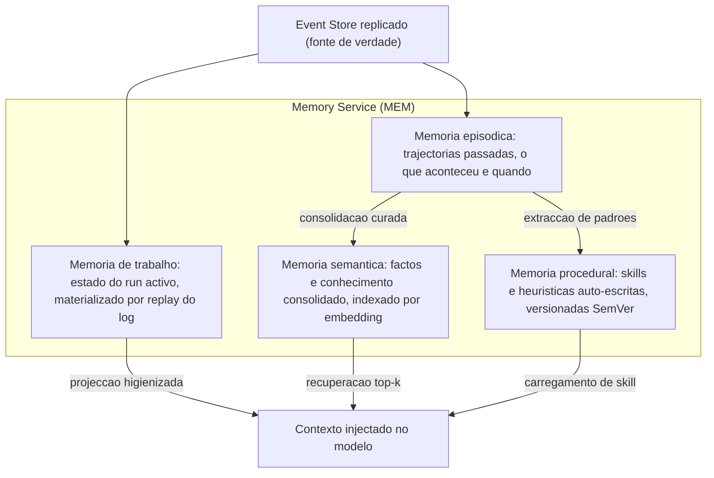
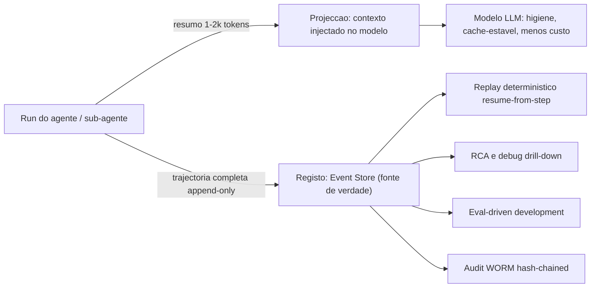
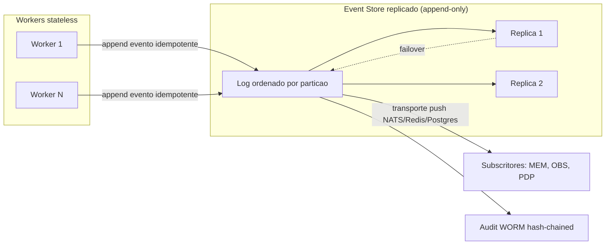
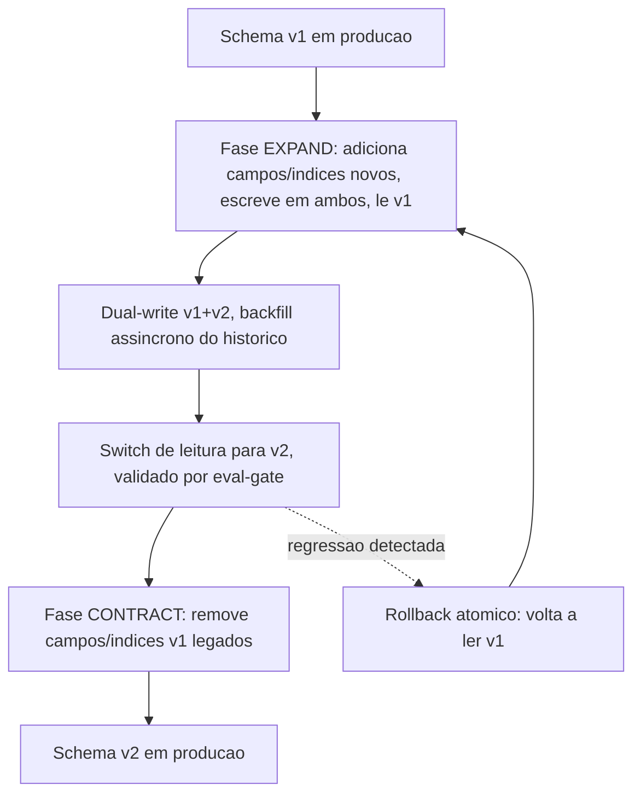
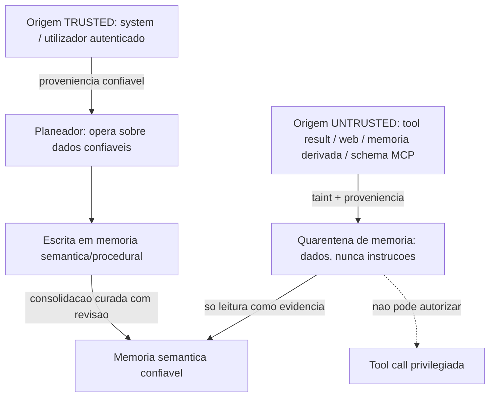

# Memória e Persistência — AOS

| Campo | Valor |
|---|---|
| Produto | AOS — Agentic OS de Referência |
| Documento | Memória e Persistência — Memory Service, Event Store e proveniência |
| Versão | 1.0 |
| Data | Julho de 2026 |
| Classificação | Documento de Referência — Aberto |
| Documento-fonte | `_FONTE_agentic-os-ideal.md` |
| Documentos relacionados | `tecnica/02_Agent_Runtime_Execucao_Duravel.md`, `tecnica/08_Observabilidade_Evals.md`, `specs/EPIC-04_Memoria_Persistencia.md` |

---

## 1. Introdução

### 1.1 Propósito

Este documento especifica a camada de **memória e persistência** do AOS — Agentic OS de Referência. Cobre o **Memory Service (MEM)** e os seus quatro tipos de memória (episódica, semântica, procedural e de trabalho); o princípio fundacional **contexto ≠ registo**, que separa a projecção injectada no modelo da trajectória persistida no backend; o **Event Store (ES)** replicado append-only como fonte de verdade; o versionamento de schema de memória com migrações **expand/contract**; e a **proveniência e quarentena** de memória derivada de conteúdo untrusted, mitigando *memory poisoning*.

A tese é directa: a memória de um agente não é um cache conveniente — é estado durável com consequências de segurança, conformidade e reprodutibilidade. O que o modelo vê e o que o sistema regista são projecções distintas do mesmo substrato, e confundi-las é a raiz de duas falhas graves: perder o audit trail em nome da higiene de contexto, ou envenenar o planeamento com dados que nunca deveriam comandar.

### 1.2 Âmbito

Abrange: a taxonomia de memória e as suas fronteiras de escrita/leitura; a materialização do princípio contexto ≠ registo; a arquitectura do Event Store replicado e as suas garantias de durabilidade (substituindo SQLite single-writer, ADR-007); a disciplina de versionamento de schema com migrações expand/contract (ADR-012); e o modelo de proveniência e quarentena de memória untrusted (ADR-005). Ficam fora do âmbito o loop de execução durável (ver `tecnica/02`), a captura de trajectória em spans OTel (ver `tecnica/08`) e o backlog executável (ver `specs/EPIC-04`).

### 1.3 Audiência

Engenheiros de Dados/Memória, engenheiros de runtime, engenheiros de segurança e de governação, e arquitectos de plataforma que precisem de compreender como o estado do agente é escrito, projectado, versionado e protegido.

### 1.4 Definições e termos

- **Memory Service (MEM):** serviço de plataforma que gere os quatro tipos de memória sobre o Event Store, aplicando proveniência e projecção.
- **Event Store (ES):** log append-only replicado, com transporte push (NATS/Redis/Postgres), que é a fonte de verdade de toda a trajectória.
- **Contexto ≠ registo:** princípio segundo o qual a projecção injectada no modelo é distinta da trajectória persistida no backend.
- **Expand/contract:** padrão de migração de schema em duas fases não-destrutivas (expandir e depois contrair) que evita janelas de indisponibilidade e permite rollback.
- **Memory poisoning:** contaminação persistente da memória por conteúdo untrusted que, se lido como instrução, desvia o comportamento futuro do agente (ASI06).

---

## 2. ADRs aplicáveis

O desenho desta camada é governado por três decisões de arquitectura canónicas:

- **ADR-007 — Event Store replicado.** Substitui o SQLite single-writer (SPOF e tecto de throughput) por um log replicado append-only com transporte push. Todo o estado de memória materializa-se a partir deste log, que é a fonte de verdade.
- **ADR-005 — Separação control/data-plane + taint (quarentena).** Conteúdo untrusted — tool results, web, memória derivada, schemas MCP — é dados, nunca instruções. Memória derivada de fontes não-confiáveis é marcada com proveniência e posta em quarentena, mitigando prompt injection (OWASP LLM01) e memory poisoning (ASI06).
- **ADR-012 — SemVer + eval-gate para auto-modificação.** O schema de memória é um artefacto comportamental mutável e versionado; as suas migrações seguem o padrão expand/contract com rollback atómico, e a memória procedural auto-escrita passa por eval-gate antes de produção.

Aplicam-se ainda, transversalmente, o ADR-001 (execução durável — a memória de trabalho materializa-se do log por replay) e o ADR-010 (observabilidade — a projecção ao pai e a árvore de spans completa são o corolário directo de contexto ≠ registo).

---

## 3. Taxonomia de memória

O Memory Service organiza-se em quatro tipos, cada um com um horizonte temporal, uma fronteira de escrita e uma política de leitura distintos. Tratá-los como um único "armazém de contexto" é o erro de base dos frameworks ingénuos.

- **Memória de trabalho.** É o estado volátil do run activo: o histórico do turno, os resultados de tools pendentes, os *scratchpads*. Não é uma estrutura em RAM que um crash apaga — materializa-se por *replay* do Event Store (ADR-001), pelo que sobrevive a falhas e é reproduzível *resume-from-step*.
- **Memória episódica.** Regista trajectórias passadas — o que o agente fez, quando, com que resultado. É a matéria-prima do replay determinístico, da análise de causa-raiz (RCA) e do *eval-driven development*. Nunca é descartada do registo.
- **Memória semântica.** Conhecimento consolidado e factos, indexados por *embedding* para recuperação por semelhança (top-k). Deriva de episódios curados, não de captura bruta.
- **Memória procedural.** Skills e heurísticas que o próprio agente escreve. É a mudança de maior risco do sistema (*misevolution*) e por isso é versionada com SemVer e sujeita a eval-gate + canário + ratificação assinada (ADR-012) antes de chegar a produção.

A regra de fluxo é unidireccional e curada: o episódico alimenta o semântico e o procedural por consolidação explícita, nunca por absorção automática de tudo o que passa pelo contexto.

---

## 4. Contexto ≠ registo

O princípio mais consequente desta camada resolve a maior contradição dos frameworks de agentes: a higiene de contexto (injectar pouco, barato, limpo) colide com a observabilidade (persistir tudo, para debug, eval e conformidade). O AOS recusa escolher — **desacopla os dois eixos**.

A **projecção** é o que se injecta no modelo: uma vista comprimida, higienizada, cache-estável, optimizada para tokens. O **registo** é a trajectória completa persistida no Event Store: cada turno, cada resultado de tool, cada decisão, com proveniência e hash. Descartar da injecção é legítimo — é economia. Descartar do audit trail nunca é — é destruição de evidência.

Esta separação tem três corolários operacionais. Primeiro, um **sub-agente devolve ao pai um resumo de 1–2k tokens**, mas a sua árvore de spans completa vive sempre no backend (ver `tecnica/08`) — o pai poupa custo sem que o auditor perca nada. Segundo, a **compressão/sumarização** da memória de trabalho corre apenas em *checkpoints assíncronos*, fora da hot path, para não destruir a estabilidade de cache do prefixo de prompt (ADR-009). Terceiro, o **manifesto por trajectória** (hash do prompt materializado, model-id, versões de skills/tools/memória) é gravado por turno, tornando o replay fiel mesmo após evolução de código.

---

## 5. Event Store e durabilidade

O plano-base ingénuo usava SQLite single-writer como event bus. Isso é simultaneamente um ponto único de falha (SPOF) e um tecto de throughput: um só escritor, um só host, sem replicação. O ADR-007 substitui-o por um **Event Store replicado, append-only, com transporte push**.

As garantias são quatro. **Fonte de verdade única:** todo o estado de memória — trabalho, episódico, e as vistas materializadas semânticas — é derivável por replay do log; não há estado autoritativo escondido em RAM. **Append-only com idempotência:** cada evento carrega a idempotency key = f(run_id, step_id) (ADR-001), pelo que um retry após crash não duplica efeitos nem entradas de memória. **Replicação sem SPOF:** o log é replicado, os workers são *stateless*, e o failover não perde o commit — servindo o alvo de disponibilidade de 99,9% do plano de controlo. **Transporte push:** subscritores (o próprio MEM, a observabilidade, o PDP) recebem eventos *event-driven*, sem *polling*, reduzindo latência de propagação.

O Event Store é também a fronteira onde o audit se separa dos diagnósticos efémeros: o log alimenta um audit **WORM hash-chained** (ADR-010), *tamper-evident*, distinto dos dados operacionais que se auto-limpam. "Imutável" significa aqui *tamper-evidence do registo*, não retenção eterna do payload — a reconciliação com o direito ao apagamento faz-se por crypto-shredding, tratado em `tecnica/09`.

---

## 6. Migrações expand/contract

O schema de memória é um artefacto comportamental mutável e, como tal, é versionado com SemVer (ADR-012) e ancorado a um contrato público. A evolução do schema — novos campos, reindexação, mudança de formato de *embedding* — não pode exigir *stop-the-world* nem impedir o rollback. O AOS adopta o padrão **expand/contract** (também dito *parallel-change*), em duas fases não-destrutivas.

Na fase **expand**, o novo schema é aditivo: adicionam-se campos e índices sem remover nada. O MEM escreve em ambos os formatos (*dual-write*) e um *backfill* assíncrono migra o histórico do Event Store, fora da hot path. Enquanto ambos coexistem, a leitura continua sobre v1, pelo que nenhuma incompatibilidade é exposta. O *switch* de leitura para v2 só ocorre depois de o backfill completar e de um **eval-gate** confirmar, contra golden-set, que a nova projecção não introduz regressão. Só na fase **contract**, já com v2 estável, se removem os campos e índices legados.

Como as duas fases são não-destrutivas até ao contract, o **rollback é atómico**: perante regressão detectada em canário, o MEM volta a ler v1 sem perda de dados, porque a escrita dupla nunca parou. Isto materializa, para a memória, a mesma disciplina de porta versionada que o Model Gateway impõe ao modelo — coerência por contrato, não por vendor único.

---

## 7. Proveniência e quarentena

A memória é um vector de ataque persistente: se conteúdo untrusted for absorvido como facto ou instrução, uma injecção de hoje contamina o planeamento de amanhã — o padrão *memory poisoning* (ASI06). A defesa não são tags in-band (`memory_context`), que são triviais de forjar, mas **taint tracking real com proveniência** (ADR-005).

Cada entrada de memória carrega metadados de proveniência: a origem (system/utilizador autenticado vs. tool result/web/schema MCP), o nível de confiança, e a cadeia de derivação. Memória derivada de fonte untrusted herda o *taint* e entra em **quarentena**: é dados, nunca instruções, e é estruturalmente impedido de autorizar uma tool call privilegiada.

A promoção de memória em quarentena para conhecimento confiável (semântico) exige **consolidação curada** — revisão explícita ou eval-gate — nunca absorção automática. A memória procedural auto-escrita, sendo executável, recebe o tratamento mais estrito: staging → eval-gate (golden-set + trace-diffing) → canário → ratificação humana assinada → produção com versão SemVer (ADR-012). Assim, o vector nº1 (OWASP LLM01) e o envenenamento persistente (ASI06) tornam-se *arquitecturalmente* contidos, não meramente desencorajados.

---

## 8. Vista de qualidade

**Arquitectura.** A camada de memória assenta inteiramente sobre o Event Store como fonte de verdade única (ADR-007): não há estado autoritativo fora do log, o que elimina divergências entre réplicas e torna todo o estado reconstruível por replay. A separação contexto ≠ registo é o que permite escalar horizontalmente — workers stateless, projecção barata ao modelo, registo completo particionado — sem escolher entre custo e observabilidade.

**Segurança.** A proveniência e a quarentena (ADR-005) tornam a memória incapaz de comandar acções privilegiadas, fechando o vector de *memory poisoning* na origem. O *taint* propaga-se por derivação, pelo que não há caminho pelo qual conteúdo untrusted "lave" o seu estatuto ao passar pela memória. A promoção a conhecimento confiável exige curadoria explícita, e a memória procedural passa por eval-gate.

**Manutenção evolutiva.** O schema de memória é versionado SemVer e evolui por migrações expand/contract com rollback atómico (ADR-012), garantindo que uma mudança de formato nunca provoca indisponibilidade nem perda de dados. O manifesto por trajectória preserva a reprodutibilidade mesmo quando o schema evolui, tornando o replay e a RCA fiáveis ao longo do tempo.

---

## 9. Riscos e mitigações

| Risco | Impacto | Mitigação |
|---|---|---|
| Memory poisoning por conteúdo untrusted | Desvio persistente do planeamento (ASI06) | Proveniência + taint + quarentena; promoção só por consolidação curada (ADR-005) |
| Perda de audit trail por higiene de contexto | RCA e conformidade impossíveis | Contexto ≠ registo: projecção descartável, registo append-only sempre no ES |
| SQLite single-writer como event bus | SPOF e tecto de throughput | Event Store replicado append-only com transporte push (ADR-007) |
| Migração de schema com indisponibilidade | Janela de downtime, rollback impossível | Expand/contract com dual-write e backfill assíncrono; rollback atómico (ADR-012) |
| Duplicação de memória no retry | Estado corrompido, factos duplicados | Idempotency key = f(run_id, step_id) por evento (ADR-001) |
| Skill procedural auto-escrita com regressão | Misevolution silenciosa | Staging → eval-gate → canário → ratificação assinada (ADR-012) |
| Compressão na hot path destrói cache | Explosão de custo de tokens | Sumarização só em checkpoints assíncronos (ADR-009) |

---

## 10. Glossário

- **Memory Service (MEM):** serviço que gere os quatro tipos de memória sobre o Event Store, aplicando proveniência e projecção.
- **Event Store (ES):** log append-only replicado, com transporte push, fonte de verdade de toda a trajectória.
- **Memória de trabalho:** estado do run activo, materializado por replay do log, reproduzível resume-from-step.
- **Memória episódica:** registo de trajectórias passadas, matéria-prima de replay, RCA e eval.
- **Memória semântica:** conhecimento consolidado, indexado por embedding para recuperação top-k.
- **Memória procedural:** skills e heurísticas auto-escritas, versionadas SemVer e sujeitas a eval-gate.
- **Contexto ≠ registo:** desacoplamento entre a projecção injectada no modelo e a trajectória persistida no backend.
- **Expand/contract:** migração de schema em duas fases não-destrutivas que evita downtime e permite rollback atómico.
- **Proveniência:** metadados de origem, confiança e cadeia de derivação de cada entrada de memória.
- **Quarentena de memória:** estatuto de dados-nunca-instruções aplicado a memória derivada de fonte untrusted.
- **Memory poisoning:** contaminação persistente da memória por conteúdo untrusted (ASI06).

---

## 11. Tabela de aprovação

| Papel | Nome | Assinatura | Data |
|---|---|---|---|
| Arquitecto de Plataforma |  |  |  |
| Responsável de Segurança |  |  |  |
| Responsável de Produto |  |  |  |

---

## 12. Controlo de versões

| Versão | Data | Descrição | Autor |
|---|---|---|---|
| 1.0 | Julho 2026 | Emissão inicial | Equipa AOS |
