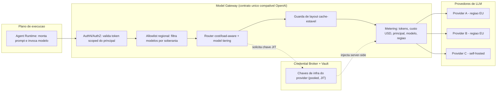
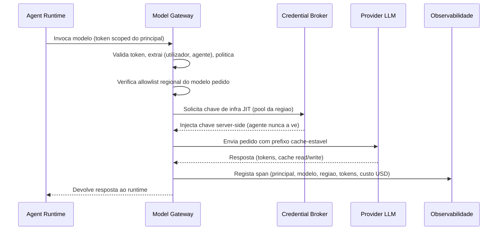
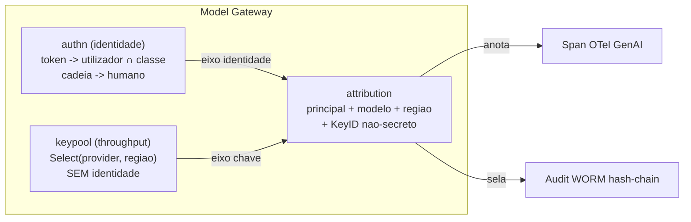
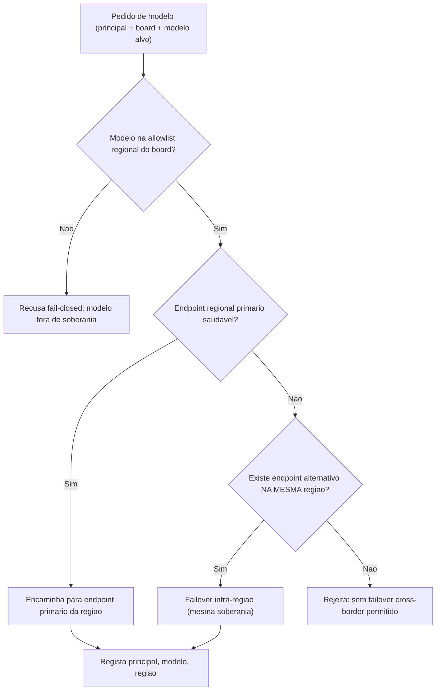
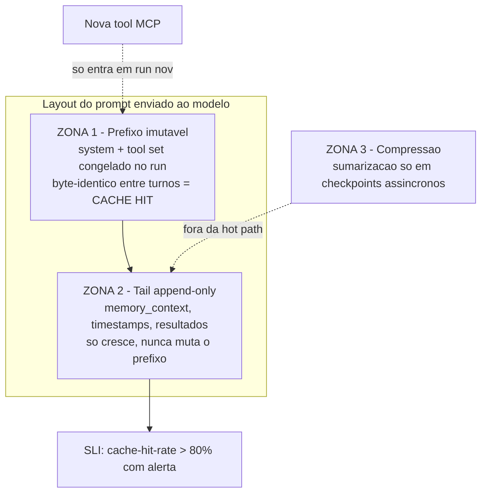

# Model Gateway e Custos — AOS

| Campo | Valor |
|---|---|
| Produto | AOS — Agentic OS de Referência |
| Documento | Técnica — Model Gateway e Custos |
| Versão | 1.0 |
| Data | Julho de 2026 |
| Classificação | Documento de Referência — Aberto |
| Documento-fonte | `_FONTE_agentic-os-ideal.md` |
| Documentos relacionados | `tecnica/03_Orquestracao_Escalonamento.md`, `tecnica/09_Governacao_Conformidade.md`, `specs/EPIC-06_Model_Gateway_Custos.md` |

---

## 1. Introdução

### 1.1 Propósito

Este documento especifica o **Model Gateway (GW)** do AOS — a interface unificada através da qual todo o agente acede a modelos de linguagem (LLMs). O GW é o único caminho legítimo entre o Agent Runtime e qualquer provedor de modelos: normaliza a superfície de invocação (estilo LiteLLM, compatível com a API OpenAI), autentica cada chamada a um principal identificado, aplica uma allowlist regional de modelos, encaminha o pedido de forma sensível a custo e carga (*cost/load-aware*), e impõe um layout de prompt cache-estável que sustenta a economia de tokens do sistema.

O GW resolve directamente uma das falhas mais citadas do documento-fonte: o *credential pool round-robin* que "responde o pool" quando o regulador pergunta *quem autorizou* uma acção. A decisão fundadora deste componente é **separar identidade de chaves de infra** — dois eixos que o desenho ingénuo confunde.

### 1.2 Âmbito

Cobre: o gateway unificado e o seu contrato de porta; a separação entre identidade do principal e chaves de infra do provider; a allowlist regional e a soberania; o roteamento *cost/load-aware* com *model tiering*; e o layout de prompt cache-estável com o cache-hit-rate como SLI. Fica fora de âmbito o *admission control* global de tokens e o *backpressure* (detalhados em `tecnica/03_Orquestracao_Escalonamento.md`), o Credential Broker de credenciais *downstream* de tools (em `tecnica/07`), e o modelo de conformidade de identidade e soberania na sua totalidade (em `tecnica/09_Governacao_Conformidade.md`).

### 1.3 Audiência

Arquitectos de plataforma, engenheiros de runtime, engenheiros de governação e responsáveis de FinOps/custos que precisem de compreender como o AOS medeia o acesso a modelos com identidade, soberania e economia por desenho.

### 1.4 Definições e termos

- **Model Gateway (GW):** serviço de plataforma que unifica o acesso a múltiplos provedores de LLM sob um contrato único, compatível com a API OpenAI.
- **Principal:** par (utilizador, agente) que origina uma chamada; codificado no token *scoped* que autentica o pedido.
- **Chave de infra:** credencial de conta do provider (API key/OAuth de serviço) usada para *throughput*; distinta da identidade do principal.
- **Allowlist regional:** conjunto de modelos permitidos por fronteira de soberania; failover não pode cruzar a fronteira.
- **Model tiering:** classificação de modelos por custo/capacidade que permite degradação graciosa para modelos mais baratos.
- **Cache-hit-rate:** fracção de tokens do prompt servidos a partir de cache de prefixo; medida como SLI (alvo > 80%).

---

## 2. Princípios e decisões aplicáveis (ADRs)

O GW concretiza três ADRs canónicos:

- **ADR-009 — Layout de prompt cache-estável.** Prefixo imutável (system + tool set congelado no run) + tail append-only; compressão só em checkpoints assíncronos; cache-hit-rate como SLI. O GW é o ponto onde este contrato é imposto e medido.
- **ADR-011 — Policy-as-code + GDPR por desenho (soberania e identidade).** Cada chamada é atribuível a um principal; a allowlist regional impõe soberania por *board*, proibindo failover de cruzar fronteira. A separação identidade × chaves de infra é a base da atribuição de responsabilidade exigida por este ADR.
- **ADR-006 — Credential Broker com tokens JIT.** O GW obtém as chaves de infra do provider a partir do vault via broker, *server-side*; o agente nunca vê a chave do provider, tal como nunca vê segredos *downstream* de tools.

Aplicam-se ainda, por adjacência, o **ADR-008** (admission control global em tokens/$, imposto a montante pelo Escalonador) e o **ADR-010** (cada chamada emite um span OTel GenAI com `gen_ai.usage.*` e custo em USD).

---

## 3. O gateway unificado

O GW expõe um contrato de porta único e versionado (SemVer): uma superfície compatível com a API OpenAI (`chat/completions`, *streaming*, *tool calling*, *embeddings*) que abstrai as diferenças entre provedores (Anthropic, OpenAI, Google, modelos self-hosted, endpoints regionais). Isto materializa o princípio "coerência por contrato, não por lock-in": trocar de modelo é um **evento de variância explícito**, nunca uma mudança silenciosa de comportamento.

Cada pedido atravessa uma pipeline determinística: autenticação do principal → allowlist regional → roteamento → validação do layout de cache → *metering*. À semelhança do Reference Monitor para tool calls, o GW é o gate obrigatório para *model calls*.

> **Nota de implementação (AOS-055 — fundação do GW, Done).** O esqueleto do gateway está implementado no módulo `packages/platform/model-gateway` (módulo `github.com/aos-ref/platform/model-gateway`, Go 1.24, **zero dependências externas**), com esta estrutura:
>
> - **Porta única compatível OpenAI** (`port/`): tipos normalizados próprios (sem SDK) que espelham a API OpenAI — `ChatRequest`/`ChatResponse` (chat/completions), streaming (`ChatStream` + deltas), tool calling (`Tool`/`ToolCall`), e embeddings. A versão do contrato é **SemVer** (`port.Version`), ancorada a contrato à imagem do gate de SemVer do registry (AOS-052). Os metadados de plataforma (principal, região, board) têm tag `json:"-"` e **nunca** vão no wire do provider.
> - **Interface de adaptador de provider** (`adapters/`): `Adapter` (Chat/ChatStream/Embeddings) com **um adaptador REAL** (`OpenAIHTTPAdapter`, HTTP OpenAI-compatible sobre `net/http` + wire JSON, testado contra `httptest`) e **um FAKE** in-memory determinista, ambos satisfazendo a mesma interface sem alterar o contrato de porta. As credenciais entram por uma porta `CredentialSource` (ADR-006) e o segredo é **não-exportado** — nunca aparece em código, logs ou spans.
> - **Pipeline determinística** (`pipeline/`): cadeia ordenada e fixa `auth-principal → allowlist-regional → roteamento → validação-de-layout-de-cache → metering`, cada estágio uma interface `Stage` com **impl de referência pass-through**. São os **pontos de extensão** de AOS-057 (auth), AOS-058 (allowlist), AOS-059 (roteamento), AOS-060 (cache-layout) e AOS-062 (metering/custo). Um estágio que recusa **falha-fecha** a chamada antes de o provider ser invocado.
> - **Arch-lint de no-bypass** (`archlint/`): analisador `go/ast` (à imagem do archlint do RM, AOS-003) que **falha** se algum pacote fora do GW importar um SDK de provider ou referenciar um endpoint de provedor directamente; testdata bom/mau e varrimento recursivo da árvore de packages (o próprio GW é isento — é o gate legítimo).
> - **Fachada + observabilidade** (`gateway.go`): a `Gateway` implementa `port.Gateway`, atravessa a pipeline, obtém a credencial server-side, invoca o adaptador (o **único** ponto que fala com um provedor) e emite um **span OTel GenAI `chat`** com `gen_ai.request.model` + `gen_ai.usage.*` via a porta `agentruntime.Tracer` (zero-dep). Um **swap de modelo/provider** face ao pedido é registado como **evento de variância explícito** (`VarianceSink`), nunca silencioso (ADR-010). O serviço é *stateless*; relógio e IDs são injectáveis (determinismo).
> - **Ligação ao Agent Runtime**: `ModelClientAdapter` satisfaz a porta `agentruntime.ModelClient` (AOS-013), reconciliando o contrato do runtime com o da porta do GW sem que nenhum dependa do outro.
>
> Os estágios reais (identidade-vs-pooled, allowlist regional concreta, roteamento cost/load-aware, cache-stable, custo USD) são os tickets AOS-056..062; aqui são pass-through de referência.

---

## 4. Identidade vs. chaves de infra

O erro de desenho que o documento-fonte denuncia é o *credential pool round-robin*: um conjunto de chaves partilhado do qual cada chamada retira uma ao acaso. É óptimo para *throughput* e catastrófico para conformidade — destrói a atribuição de identidade, base de todo o audit trail. O AOS separa dois eixos que este padrão funde:

1. **Identidade (quem actua).** Cada agente tem um token OAuth *scoped* e *time-bound* que codifica o par **(utilizador, agente)** e a política sob a qual actua. É este token que o GW valida e que determina autoridade = utilizador ∩ classe de agente. A cadeia de delegação *on-behalf-of* termina sempre num humano responsável.
2. **Chaves de infra (com que conta se factura o provider).** As API keys/OAuth de serviço do provider **podem ser *pooled*** para maximizar *throughput* dentro dos limites de TPM/RPM. Mas o *pooling* é invisível à identidade: **cada chamada regista o principal, o modelo e a região**, independentemente da chave de infra usada.

O resultado é que a pergunta "quem autorizou esta chamada ao modelo?" tem sempre resposta — o principal, não "o pool". As chaves de infra provêm do vault via Credential Broker (ADR-006), *server-side*; o agente nunca as vê. Este desacoplamento é o que reconcilia a tensão *round-robin de credenciais (throughput) vs. atribuição de identidade* registada na fonte.

O registo por chamada — principal, modelo, região, tokens de entrada/saída, cache read/write, custo em USD — é emitido como span OTel GenAI (`gen_ai.*`), ligando cada *model call* à trajectória do agente e ao audit WORM (ver `tecnica/09_Governacao_Conformidade.md`).

### 4.1 OAuth multi-provedor e Credential Broker (AOS-056)

A aquisição das chaves de infra dos três provedores (Claude/Anthropic, Gemini/Google, OpenAI) está implementada em `packages/platform/model-gateway/internal/` como a fonte REAL que satisfaz a porta `CredentialSource` de AOS-055. Corre **sempre server-side**: o agente nunca participa no fluxo OAuth nem vê o material.

**Porta `CredentialBroker` (BRK/Vault).** `internal/credentials/broker.go` define a fronteira: dado `(provider, região)`, o broker emite um `Lease` JIT — um segredo de infra com TTL curto e um `LeaseID` revogável (o segredo é não-exportado e redigido, nunca logado). Há duas implementações: um `FakeBroker` determinista (testes, com relógio injectável, rotação e revogação) e um `ReferenceBroker` que documenta o vault real (HashiCorp Vault / KMS + broker, `tecnica/07 §7.1`) e falha *fail-closed* (`ErrNotWired`) até ser ligado por infra (EPIC-07). O broker é uma **porta**; o vault concreto é infra.

**Camada OAuth por provedor.** `internal/adapters/oauth/` traduz o mecanismo de autenticação específico de cada provedor para a credencial de infra, atrás da `CredentialSource`:

| Provedor | Mecanismo | Tradução |
|---|---|---|
| OpenAI | `api_key` | A API key É o portador (*pass-through*); o TTL é o do lease do vault. |
| Claude/Anthropic | `service_oauth` | OAuth de serviço: troca de *client-credentials* por um *access token* de vida curta. |
| Gemini/Google | `federated` | Identidade federada: asserção de *workload* → *access token* com **audiência regional** (o token de uma região não vale noutra). |

A troca é determinista e sem rede (o *stand-in* do *token endpoint* deriva o token via HMAC-SHA256 do material; a integração com o endpoint real é infra). O token sai encapsulado numa `adapters.Credential` redigida — nunca existe como *string* solta fora do ponto de injecção.

**Cache JIT: TTL curto, rotação e revogação.** `internal/credentials/source.go` implementa a `Source`:

- **JIT + TTL curto:** a credencial é obtida quando é precisa e guardada com um TTL curto configurável.
- **Renovação antes de expirar:** uma `Fetch` dentro da janela de *refresh* (`now >= ExpiresAt − RefreshLead`, ainda antes da expiração) reemite um lease novo, em vez de servir uma credencial prestes a expirar.
- **Rotação sem interromper *in-flight*:** a `adapters.Credential` é um valor imutável; uma vez devolvida por `Fetch`, o chamador tem a sua cópia. A rotação substitui **atomicamente** a referência em cache — uma chamada já em curso completa com a chave antiga; só as chamadas novas vêem a chave nova (provado por teste de rotação concorrente sob `-race`).
- **Revogação:** `Source.Revoke(provider, região)` invalida a entrada de cache e revoga o lease no broker; a próxima `Fetch` obtém uma credencial nova (ou falha *fail-closed* se o material desapareceu). O lease revogado nunca é reutilizado.

**Configuração por provider/região e *fail-closed* atribuível.** A `Source` é configurada com o conjunto de pares `(provider, região)` elegíveis (`Config.Allowed`). A chave escolhida corresponde **sempre** ao par exacto pedido — respeita a fronteira de soberania (a *allowlist* regional concreta é AOS-058; aqui a config + a selecção correcta). Sem credencial válida (região não configurada, material ausente, expirado ou revogado) a aquisição falha *fail-closed* com um `*CredentialError` **atribuível** (identifica provider+região, preservando `errors.Is` da causa) — **nunca** cai para outra conta/região silenciosamente. O detalhe de configuração operacional está em `docs/model-gateway/credenciais-por-provider-regiao.md`.

### 4.2 Desacoplamento identidade ↔ chaves de infra pooled (AOS-057)

AOS-057 concretiza a separação dos dois eixos que o *credential pool round-robin* funde. A implementação vive em três pontos do módulo `packages/platform/model-gateway`, cada um num **eixo distinto**, e o Gateway compõe-nos por opção (`WithAuthnStage`, `WithKeyPool`, `WithAttribution`) sem alterar o contrato de porta nem reimplementar identidade/broker/gateway.

**Eixo da IDENTIDADE — `pipeline/authn` (estágio auth-principal REAL).** Substitui o pass-through de AOS-055. Em cada chamada, *fail-closed* em cada passo:

1. **Valida o token do principal** REUTILIZANDO o `Verifier` da identidade (`platform/identity`, AOS-005/006) — não inventa formato: assinatura EdDSA, janela temporal, revogação e cadeia *on-behalf-of*. Token ausente/inválido/expirado ⇒ *deny*.
2. **Exige raiz humana** na cadeia de delegação (ADR-003): `Principal.HumanPrincipal()` resolve "quem autorizou"; cadeia órfã ⇒ *deny*.
3. **Autoridade efectiva = utilizador ∩ classe de agente** (`EffectiveAuthority`, menor privilégio), reconciliada com o escopo **selado** no token (defesa em profundidade — nunca concede mais do que o token selou). Autoridade vazia ⇒ *deny*.
4. **Política de validação de token** como *policy-as-code* **versionada** e *default-deny* (`token_policy.json`, embebida via `go:embed`, com versão *tamper-evident* `versão#digest`): sem regra aplicável ⇒ *deny*. É a equivalente *data-plane* do *default-deny* do PDP/cedar (que impõe as *tool calls*), mantida no gateway para não trazer `cedar-go` ao caminho crítico.

Em sucesso, o estágio popula os campos de identidade do `Exchange` (principal/classe/humano/autoridade/cadeia) e substitui o token bruto por um identificador **não-secreto** (`user/agent`) — o token nunca segue para o rasto de variância/atribuição.

**Eixo da CHAVE DE INFRA — `routing/keypool` (selecção por *throughput*, DESACOPLADA).** É o coração do ticket. A selecção de chave — `Registry.Select(provider, região)` / `Pool.Select()` — recebe **APENAS** `(provider, região)`; a identidade do principal **NÃO existe na sua assinatura** e **NÃO é consultada**. É a **prova estrutural** do desacoplamento: é impossível, por construção, a escolha da chave depender de quem actua. A selecção é determinista (conta com mais folga de RPM, desempate estável por `KeyID`), *fail-closed* se o pool está saturado (`ErrNoCapacity`) ou ausente (`ErrNoPool`). Opera sobre `Account.KeyID` — um identificador **não-secreto** de conta; o segredo concreto vem sempre do Credential Broker (AOS-056, §4.1), *server-side*.

**Eixo da ATRIBUIÇÃO — `metering/attribution` (principal/modelo/região por chamada).** Junta os dois eixos anteriores num `Record` e, em **cada** chamada, seja qual for a chave: (a) **anota o span OTel GenAI** com principal (utilizador, agente), classe, humano responsável, modelo, região e o `KeyID` **não-secreto** — a chave **nunca** no span (ADR-006); (b) **sela no audit WORM** *hash-chain* *tamper-evident* (AOS-011/ADR-010), com o principal, a cadeia *on-behalf-of*, a capability `model:invoke`, o recurso (modelo/região) e a versão da política. A resposta a *"quem autorizou esta chamada ao modelo?"* é sempre o **principal** — **nunca "o pool"**.

**Teste de atribuição cruzada (a prova de governação).** Dois casos, ambos verdes sob `-race`:
- **Mesmo principal / chaves diferentes:** duas chamadas do mesmo `alice/agent-1` com o pool a alternar `acct-a`→`acct-b` mantêm o **mesmo** principal no registo; a chave rotou, a atribuição não.
- **Principais diferentes / mesma chave:** `alice/agent-1` e `bob/agent-2` servidos por `acct-shared` permanecem **distinguíveis** no registo.

Um token inválido é recusado pelo estágio de authn **antes** de o provider ser invocado — o adaptador não corre e não há registo de atribuição (*fail-closed*, verificado por teste).

---

## 5. Allowlist regional e soberania

A soberania de dados é imposta *por desenho* no GW, não confiada a configuração *ad-hoc* do provider. Cada *board* (unidade de tenancy/soberania) tem uma **allowlist regional de modelos**: o conjunto de modelos e endpoints permitidos dentro da sua fronteira legal. A regra é `default-deny` — um modelo não explicitamente permitido é recusado.

O ponto crítico é o **failover**: quando um endpoint regional está saturado ou indisponível, o router **não pode** encaminhar para um endpoint fora da fronteira de soberania, mesmo que isso resolvesse a latência. Um failover cross-border transferiria PII para fora da jurisdição — o risco *fuga de soberania por failover* da fonte (violação potencial do GDPR). O failover é, por isso, restrito à **mesma fronteira de soberania**: só entre endpoints/chaves da mesma região.

Assim, a disponibilidade nunca é comprada à custa da soberania: se não houver capacidade dentro da fronteira, o pedido é rejeitado (com *backpressure* graciosa a montante) em vez de vazar para outra jurisdição. A allowlist é *policy-as-code* versionada e assinada, com o changelog no próprio audit trail (ADR-011).

---

## 6. Roteamento cost/load-aware e model tiering

O documento-fonte substitui o *round-robin cego* por roteamento **least-loaded / token-aware** com **cost-aware model tiering**. O router do GW decide o destino de cada chamada com base em quatro sinais, dentro das restrições já impostas pela allowlist regional:

- **Carga** — endpoint menos carregado, medido por *headroom* real de TPM/RPM (coordenado com o admission control de `tecnica/03`), evitando o modo de falha "individualmente ok, agregadamente colapsa".
- **Custo** — preferência pelo tier mais barato que satisfaz o requisito de capacidade da tarefa (*model tiering*: um modelo *frontier* para raciocínio, um modelo económico para classificação/extracção).
- **Latência/prioridade** — chamadas de tarefas interactivas favorecem endpoints de menor latência; batch tolera tiers mais lentos e baratos.
- **Degradação graciosa** — sob pressão de orçamento ou de rate limit, o router segue a política declarativa *shed → defer → degradar para modelo mais barato → rejeitar*, em coordenação com o *backpressure* do Escalonador.

O *model tiering* é também o mecanismo do prompt de exaustão graciosa: aproximando-se do limite de orçamento (~80%), degradar para um tier mais barato é uma opção de continuação, em vez do hard-stop cego. Toda a decisão de roteamento é registada (modelo, tier, razão) para análise de custo *post-hoc* e calibração da política.

---

## 7. Layout cache-estável e economia

A maior fonte de desperdício silencioso num Agentic OS é o *cache thrash*: reivindicar 85–95% de poupança de *prefix caching* e, ao mesmo tempo, adoptar práticas que a destroem — prompt remontado com reordenação, compressão na *hot path*, tools MCP adicionadas a meio do run. O GW impõe o contrato de layout do ADR-009 e mede a sua eficácia.

O prompt é dividido em três zonas com regras estritas:

| Zona do prompt | Conteúdo | Regra |
|---|---|---|
| **Prefixo imutável** | system prompt + tool set congelado no run | Byte-idêntico, nunca reordenar; muda só em runs novos |
| **Tail append-only** | memory_context, timestamps, resultados de tools | Só cresce; nunca muta o prefixo |
| **Compressão** | sumarização auxiliar | Só em checkpoints assíncronos, fora da hot path |

Consequências operacionais impostas pelo GW:

- **Tool set congelado por run.** Novas tools MCP só entram em *runs novos* — o que também serve o pinning de supply-chain (`tecnica/05`). Isto evita a mutação de schema a meio do run que invalidaria o prefixo.
- **Prefixo byte-idêntico.** O GW rejeita ou sinaliza montagens que reordenem o prefixo entre turnos do mesmo run.
- **Compressão fora da hot path.** A sumarização de contexto corre em checkpoints assíncronos, nunca no caminho crítico de invocação.
- **Cache-hit-rate como SLI.** O GW mede o cache-hit-rate por run e por tenant e emite alerta quando cai abaixo de 80% — tornando visível a explosão de custo que de outro modo seria silenciosa. O manifesto por turno (hash do prompt materializado) preserva a estabilidade de cache *e* o replay fiel, sem contradição.

---

## 8. Vista de qualidade

### 8.1 Escalabilidade

O roteamento *least-loaded/token-aware* e o *pooling* de chaves de infra permitem saturar o *throughput* disponível sem colapso agregado, desde que sob o *admission control* global (`tecnica/03`). O layout cache-estável reduz o custo marginal por turno, o que aumenta a densidade de agentes que a plataforma sustenta a orçamento fixo. O plano de dados do GW é *stateless* e escala horizontalmente; o estado (métricas de carga, buckets) é externo.

### 8.2 Governação

A separação identidade × chaves de infra é a fundação da atribuição de responsabilidade: cada *model call* é imputável a um principal numa cadeia de delegação até um humano (ADR-011). A allowlist regional impõe soberania *default-deny* com failover *fail-closed* dentro da fronteira. As políticas de allowlist e de tiering são *policy-as-code* versionadas, assinadas e auditadas.

### 8.3 Manutenção evolutiva

O contrato de porta compatível com OpenAI, versionado em SemVer, torna a troca de modelo/provider um evento de variância explícito — nunca silencioso. Novos provedores entram por implementação do adaptador de porta, sem rearquitectura. Novas tools e modelos só afectam *runs novos*, preservando a reprodutibilidade dos runs em curso.

---

## 9. Riscos e mitigações

| Risco | Impacto | Mitigação |
|---|---|---|
| Round-robin anónimo de credenciais | Audit trail responde "o pool"; conformidade impossível | Separar identidade (token scoped por principal) de chaves de infra (pooled); registar principal/modelo/região por chamada (ADR-011) |
| Failover cross-border | Transferência ilegal de PII; violação de soberania | Allowlist regional default-deny; failover restrito à mesma fronteira; rejeição fail-closed |
| Cache thrash invisível | Explosão de custo silenciosa | Layout cache-estável (prefixo imutável + tail append-only); cache-hit-rate como SLI com alerta (ADR-009) |
| Mutação de tool set a meio do run | Invalidação do prefixo de cache; schema drift | Tool set congelado por run; novas tools só em runs novos |
| Agente vê chave do provider | Fuga de credencial de infra | Chaves obtidas via Credential Broker JIT server-side (ADR-006) |
| Swap silencioso de modelo | Regressão comportamental não detectada | Porta versionada SemVer; troca como evento de variância registado |
| Roteamento cego sob saturação | Colapso agregado de rate limit | Router load/token-aware coordenado com admission control global (`tecnica/03`) |

---

## 10. Glossário

- **Model Gateway (GW):** gate obrigatório e unificado para toda a invocação de LLM, compatível com a API OpenAI.
- **Principal:** par (utilizador, agente) que origina uma chamada, codificado no token scoped.
- **Chave de infra:** credencial de conta do provider usada para throughput, distinta da identidade do principal; pode ser pooled.
- **Allowlist regional:** conjunto default-deny de modelos permitidos por fronteira de soberania.
- **Model tiering:** classificação de modelos por custo/capacidade que suporta degradação graciosa.
- **Cache-hit-rate:** fracção de tokens de prompt servidos por cache de prefixo; SLI com alvo > 80%.
- **Cache thrash:** perda de cache de prefixo por remontagem/reordenação ou mutação do tool set; causa de custo silencioso.
- **Prefixo imutável:** zona byte-idêntica do prompt (system + tool set congelado) que sustenta o cache-hit.

---

## 11. Tabela de aprovação

| Papel | Nome | Assinatura | Data |
|---|---|---|---|
| Arquitecto de Plataforma |  |  |  |
| Responsável de Segurança |  |  |  |
| Responsável de Produto |  |  |  |

---

## 12. Controlo de versões

| Versão | Data | Descrição | Autor |
|---|---|---|---|
| 1.0 | Julho 2026 | Emissão inicial | Equipa AOS |
