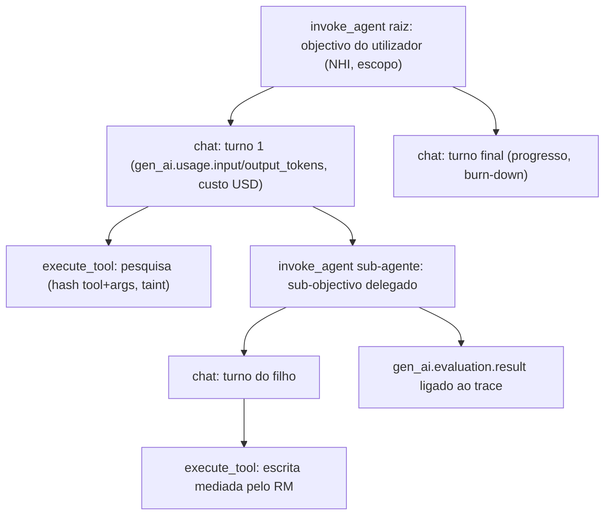
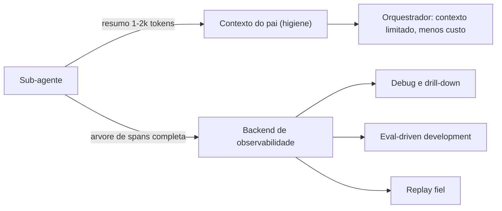
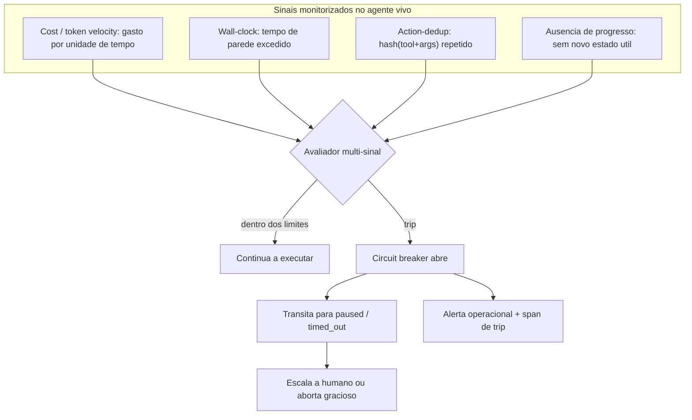
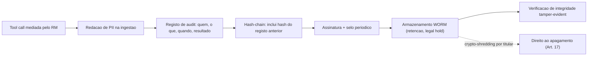

# Observabilidade e Evals — AOS

| Campo | Valor |
|---|---|
| Produto | AOS — Agentic OS de Referência |
| Documento | Técnica — Observabilidade e Evals |
| Versão | 1.0 |
| Data | Julho de 2026 |
| Classificação | Documento de Referência — Aberto |
| Documento-fonte | `_FONTE_agentic-os-ideal.md` |
| Documentos relacionados | `tecnica/00_Arquitectura_Solucao.md`, `tecnica/02_Agent_Runtime_Execucao_Duravel.md`, `tecnica/09_Governacao_Conformidade.md`, `specs/EPIC-08_Observabilidade_Evals.md` |

---

## 1. Introdução

### 1.1 Propósito

Este documento especifica a camada transversal de **Observabilidade & Evals (OBS)** do AOS. Define como a trajectória completa de cada agente e sub-agente é persistida como árvore de spans em **OpenTelemetry GenAI semantic conventions (semconv)**, como se separa o que o modelo vê (contexto) do que o backend guarda (registo), como se garante replay determinístico, como se detecta um agente *vivo* em loop através de um **circuit breaker multi-sinal**, e como se estrutura o *audit trail* tamper-evident (hash-chain + WORM) separado dos diagnósticos efémeros. Fecha com o modelo de *eval-driven development*, em que cada avaliação é registada como `gen_ai.evaluation.result` ligada ao *trace*.

A tese subjacente é a do Princípio 4 do blueprint — **contexto ≠ registo**: descartar da injecção no modelo é legítimo (higiene, cache, economia de tokens); descartar do audit trail nunca é. A observabilidade no AOS não é telemetria pendurada no fim; é uma fronteira de primeira classe que envolve todos os subsistemas.

### 1.2 Âmbito

Inclui: o *wire format* OTel GenAI e o modelo de spans (`invoke_agent`/`execute_tool`/`chat`); a distinção entre projecção de contexto e backend de observabilidade; a captura de inputs não-determinísticos para replay; o circuit breaker multi-sinal que complementa a detecção de zumbis por lease; o padrão *wide events*; a arquitectura do audit WORM; e a ligação de evals ao trace. Fora de âmbito: o detalhe do loop e da execução durável (ver `tecnica/02`), e o enforcement de política e conformidade GDPR/EU AI Act (ver `tecnica/09`).

### 1.3 Audiência

Engenheiros de observabilidade, engenheiros de runtime, SRE/DevOps, engenheiros de governação e QA, e responsáveis de produto que precisem de compreender como o sistema torna cada acção *auditável, reproduzível e avaliável*.

### 1.4 Definições e termos

- **OTel GenAI semconv:** convenções semânticas do OpenTelemetry para cargas de trabalho generativas — nomes de span e atributos `gen_ai.*` normalizados.
- **Wide events:** padrão de telemetria que captura eventos largos e de alta cardinalidade e filtra no *query-time*, em vez de decidir no *emit-time* o que interessa.
- **WORM (Write-Once-Read-Many):** armazenamento que impede alteração ou remoção após a escrita, base da tamper-evidence.
- **Hash-chain:** encadeamento criptográfico em que cada registo inclui o hash do anterior, tornando qualquer adulteração detectável.
- **Circuit breaker multi-sinal:** disjuntor que interrompe um agente vivo em loop com base em vários sinais combinados, não num único limiar.
- **Replay determinístico:** reprodução fiel de uma trajectória a partir do log, com captura de todos os inputs não-determinísticos.

---

## 2. Princípios e decisões aplicáveis (ADRs)

O documento concretiza sobretudo o **ADR-010** e apoia-se em decisões adjacentes.

| ADR | Decisão | Aplicação neste documento |
|---|---|---|
| **ADR-010** | Observabilidade OTel GenAI + audit WORM | ADR central: trajectória completa como árvore de spans (semconv GenAI); replay determinístico; audit hash-chain + WORM separado de diagnósticos efémeros. |
| ADR-001 | Execução durável como primitivo | O replay determinístico assenta no *resume-from-step* e na captura por passo; o hash do prompt e os inputs não-determinísticos são gravados no evento. |
| ADR-008 | Admission control global em tokens/$ | O circuit breaker multi-sinal partilha os sinais de cost/token velocity com o orçamento por árvore; o disjuntor de custo é comum. |
| ADR-009 | Layout de prompt cache-estável | O cache-hit-rate é um SLI observado; o hash do prefixo imutável liga cache e replay. |
| ADR-011 | Policy-as-code + GDPR por desenho | O audit trail respeita minimização, redação de PII, TTL e crypto-shredding; a imutabilidade é do registo, não do payload. |
| ADR-012 | SemVer + eval-gate para auto-modificação | Os evals ligados ao trace alimentam o eval-gate de admissão de auto-modificações. |

Princípios directamente materializados: **contexto ≠ registo** (Princípio 4) e **evolução com rede** (Princípio 7), este último pela via do eval-driven development.

---

## 3. OTel GenAI semconv e trajectórias

A trajectória **completa** de cada agente e sub-agente é persistida como uma **árvore de spans**, adoptando OpenTelemetry GenAI semconv como *wire format*. A escolha evita lock-in ao dashboard interno: qualquer backend compatível com OTel consome os mesmos dados. Cada nível de delegação abre um span `invoke_agent`; cada turno de modelo produz um span `chat`; cada tool call mediada pelo Reference Monitor produz um span `execute_tool`. Os atributos normalizados incluem `gen_ai.usage.input_tokens`, `gen_ai.usage.output_tokens`, o custo derivado em USD por span, o `gen_ai.request.model`, e o identificador da NHI do principal que executa.

Cada span carrega o `trace_id` comum e o `span_id` do pai, de modo que a árvore reconstrói a cadeia de delegação *on-behalf-of* inteira — indispensável quando o regulador pergunta *quem autorizou uma acção*. O `execute_tool` regista o hash `hash(tool+args)`, o resultado marcado *untrusted* (taint) e a decisão do PDP referenciada pelo Reference Monitor, ligando a observabilidade à mediação total (ADR-002).

### 3.1 Implementação de referência (`substrate/otel-genai`)

A camada partilhada que materializa esta secção vive no módulo-folha `packages/substrate/otel-genai` (pacote `otelgenai`, `github.com/aos-ref/substrate/otel-genai`). É a **fonte única da verdade** do vocabulário semconv GenAI do AOS — as chaves `gen_ai.*`, `error.type` e os atributos próprios `aos.*` (ex.: `aos.principal.nhi_id`, `aos.tool_call.hash`, `aos.tool.result_taint`) e os nomes de operação (`invoke_agent`/`chat`/`execute_tool`) declaram-se aqui e mais nenhures. O módulo fornece ainda o *port* de tracing (`SpanContext` W3C/OTLP com `trace_id`/`span_id`, propagação por `context.Context`, `Tracer`/`Span`, e um `IDGenerator` injectável — CSPRNG em produção, determinístico em teste), um exportador *OTLP-shaped* zero-dependência com serialização OTLP/JSON (`trace_id`/`span_id`/`parent_span_id` em hex), e um validador de conformidade (`ValidateSpanData` sobre a tabela `requiredAttrs` por operação) que é o teste de contrato da semconv. Por ser folha e sem dependências externas (regra de build *offline*), tanto o **Reference Monitor** como o **Agent Runtime** o importam sem criar ciclo. O adaptador OTLP-gRPC/HTTP **real** (o SDK `go.opentelemetry.io`) é um *adapter* de *deployment* **diferido**, documentado como TODO de *wiring* em `doc.go` para preservar o build *offline*/zero-dep.

O `span_id` do pai concretiza-se assim: o Agent Runtime abre `invoke_agent` (envolve o run) e `chat` (por turno de modelo); o **Reference Monitor** é a **autoridade única** do `execute_tool` — abre-o dentro de `Monitor.Mediate` (o ponto único de mediação, ADR-002), garantindo 100 % de cobertura das tool calls independentemente do *caller*. No caminho **durável** (o *dispatcher* de activities, `tecnica/02`) existe um span de escopo próprio `aos.activity` — que regista o desfecho durável (permit/dedup/replay/denied) e o custo do efeito real — do qual o `execute_tool` do RM nasce filho; `aos.activity` é deliberadamente distinto de `execute_tool` para não o duplicar nem contornar os seus atributos obrigatórios. Nota sobre o diagrama ilustrativo acima: o `execute_tool` é, na prática, filho de `invoke_agent` (o span `chat` fecha em `callModel` antes do despacho da tool), não de `chat` — a aresta `CHAT1 --> TOOL1` é esquemática; os critérios de conformidade não exigem aninhamento sob `chat`, apenas `trace_id` comum e `parent_span_id` coerente.

---

## 4. Contexto vs. backend

A contradição mais aguda do plano-base era *"avaliamos trajectórias, não saídas"* **contra** *"o filho só devolve o resumo ao pai"*. Resolve-se desacoplando os dois eixos do Princípio 4. O sub-agente devolve ao contexto do pai apenas um resumo de 1–2k tokens (higiene, menos custo); em paralelo, emite a **árvore de spans completa** para o backend de observabilidade, que serve debug/drill-down, eval-driven development e replay fiel.

Descartar do contexto injectado é legítimo; descartar do backend nunca é. É esta separação que torna simultaneamente possível a economia de tokens do orquestrador e a avaliação rigorosa de sub-trajectórias que, de outro modo, se perderiam no *handoff* — habilitando o eval-driven development descrito na secção 8.

---

## 5. Replay determinístico

O replay fiel exige capturar **todos os inputs não-determinísticos** de cada passo. Mantém-se a montagem efémera do prompt em runtime (para estabilidade de cache), **mas** grava-se por turno um manifesto imutável: o hash do prompt materializado, a versão do código de montagem, o `model-id`/params/seed, e as versões pinadas de skills/tools/memória (o *manifesto de dependências*). Os payloads completos residem em storage externo com IAM próprio (OTel content-capture mode 3), fora do caminho quente.

Com este manifesto, o replay é *resume-from-step* (ADR-001), não *resume-from-task*: reconstrói-se exactamente a entrada de cada passo e reproduz-se o resultado, ou reexecuta-se contra um modelo actual para trace-diffing. O alvo não-funcional é **100% dos passos reproduzíveis** — modelos não-determinísticos cujos inputs não sejam capturados invalidam a fidelidade, pelo que a captura é condição de admissão, não opção. O replay infiel após evolução de código — RCA e evals inválidos — é mitigado precisamente por este manifesto de versões por trajectória.

**Implementação (AOS-016).** O motor de replay vive em `packages/kernel/agent-runtime/replay`. A captura por passo é o evento append-only `replay.captured` (resposta do modelo completa + output de cada tool call + relógio; o seed vem do manifesto de `turn.recorded`), escrito pelo `EventStoreCapturer` — um hook aditivo do loop de AOS-013 que não altera a trajectória quando ausente. O `ReplayEngine` relê o stream, re-materializa o prompt com o mesmo `PromptAssembler` e compara o `prompt_hash` por turno; uma divergência é **localizada no passo exacto**. O motor **não detém caminho para efeitos ao vivo** (só um leitor `Read` do Event Store — sem `ModelClient`, sem Reference Monitor, sem `Append`), pelo que o replay é estruturalmente livre de efeitos externos. Cada replay emite um marcador de eval ligado ao trace original: um span `replay` com `gen_ai.evaluation.result` (`pass`/`fail`), `aos.replay.fidelity` e `aos.replay.from_step`, correlacionado por `aos.run_id` — é este o span `gen_ai.evaluation.result` da secção 8.2 no caso do eval de replay/RCA. Ver `tecnica/02` §4.3.

---

## 6. Circuit breaker multi-sinal

A detecção de zumbis por lease/heartbeat (ver `tecnica/02` e `tecnica/03`) apanha o worker **morto**: o lease expira, o fencing token invalida escritas obsoletas. Mas não vê o agente **vivo** preso em loop — o caso que o PID nunca detectava, porque o processo parece saudável. O AOS complementa a detecção de liveness com um **circuit breaker multi-sinal** que combina quatro sinais independentes e faz *trip* quando qualquer um (ou uma composição) cruza o limiar.

Os quatro sinais são: **cost/token velocity** (partilhado com o orçamento por árvore do ADR-008), **wall-clock** (tempo de parede que leva ao estado durável `timed_out`), **action-dedup por hash** (`hash(tool+args)` repetido acima de um limiar indica o agente a repetir a mesma acção sem efeito) e **ausência de progresso** (nenhum novo estado útil entre iterações). Ao abrir, o disjuntor não mata cegamente: transita o run para um estado durável (`paused` ou `timed_out`), emite um span de *trip* e um alerta operacional, e permite escalar a humano ou abortar de forma graciosa — preservando a trajectória para RCA. É esta a diferença face ao *hard-stop* cego: o loop semântico é detectado no agente vivo, o gap que o lease sozinho nunca cobria.

> **Exclusão do tempo de espera dos sinais (AOS-019).** Os sinais de `wall-clock` e `ausência de progresso` medem **trabalho activo**, não tempo-de-parede bruto — senão um gate `waiting_on_human` de horas leria-se como "sem progresso" e faria *trip* de um run perfeitamente saudável. O contrato de exclusão vive em `runtime/liveness` (AOS-019): o `WorkClock` acumula **só** o tempo em `running` (o tempo em `waiting_on_human`/`waiting_on_tool`/`paused` **não conta**), e `CountsAsActiveWork`/`IsWorkPaused` dão os predicados. O circuit breaker completo (avaliação multi-sinal e *trip*) é **EPIC-08**; AOS-019 fornece **apenas** esta exclusão, garantindo por construção que a espera legítima nunca alimenta o sinal de "sem progresso" (o par do não-falso-positivo de zombi por lease em `tecnica/02` §6). **Backstop das esperas não-humanas (contrato explícito, remediação AOS-019).** A exclusão tem um reverso que o breaker DEVE cobrir: `waiting_on_tool` e `paused` não têm timeout de backstop nem no `liveness` nem no `Machine.CheckDeadlines` (que só limita `waiting_on_human` e `running`), e o `WorkClock.ActiveWork` **congela** nesses estados. Logo o breaker de EPIC-08 tem de reapear essa fronteira com um sinal **wall-clock ABSOLUTO** (tempo-de-parede desde a entrada no estado), **não** com o `ActiveWork` — senão um `waiting_on_tool` forjado/pendurado escaparia a toda a deteção. O timeout da *activity* externa (AOS-018) é a primeira linha para `waiting_on_tool`; o breaker é a rede de segurança para ambos.

---

## 7. Wide events

O plano-base filtrava no *emit-time* (*"diagnósticos auto-limpam, só emito sinais operator-fixable"*), o que esconde padrões sistémicos: o que não parece accionável hoje é a pista da falha de amanhã. O AOS substitui-o pelo padrão **wide events** — capturar tudo, num evento largo e de alta cardinalidade por unidade de trabalho, e **filtrar no query-time**. Cada span é enriquecido com todas as dimensões relevantes (principal, modelo, tokens, custo, latência, decisão de política, taint, versões pinadas), de modo que perguntas novas se respondem sobre dados já recolhidos, sem reinstrumentar.

Isto suporta o pilar de métricas com SLIs/SLOs (cache-hit-rate, overhead de mediação p95, custo por trajectória, override-rate) por agregação *ad hoc* sobre os wide events, e alimenta a detecção de anomalias que, por sua vez, informa o circuit breaker e a demoção automática de autonomia (L0–L5, ver `tecnica/09`). A distinção crítica: os wide events são **diagnósticos efémeros** com TTL — não devem confundir-se com o audit trail, que é permanente e tamper-evident (secção 8).

---

## 8. Audit WORM e evals ligados ao trace

### 8.1 Audit hash-chain + WORM

O audit trail deixa de ser *"append-only por convenção"* em SQLite e passa a ser **hash-chained + WORM assinado**, fisicamente separado dos diagnósticos efémeros. Cada registo de auditoria — quem (NHI e cadeia de delegação), o quê (tool call, decisão do PDP), quando, e o resultado — inclui o hash do registo anterior, formando uma cadeia em que qualquer adulteração é detectável. A cadeia é periodicamente selada em armazenamento WORM, com retenção e legal hold.

A imutabilidade reconcilia-se com o direito ao apagamento (ADR-011): *"imutável"* significa **tamper-evidence do registo**, não retenção eterna do payload. Redação/tokenização de PII na ingestão, TTL por classe de dado e **crypto-shredding** (apagar a chave por titular) tornam os dados pessoais irrecuperáveis, mantendo a cadeia íntegra e verificável. O audit responde sempre à pergunta *quem autorizou* — encerrando o cenário *The Audit Log Lied*, em que o trail respondia "o pool".

### 8.2 Evals ligados ao trace

O eval-driven development torna-se viável precisamente porque a trajectória completa está sempre no backend (secção 4). Cada avaliação — de um golden-set curado e estável, ou de datasets derivados de falhas — é registada como um span `gen_ai.evaluation.result` **ligado ao trace** que avaliou. Isto fecha o ciclo: a avaliação não é um relatório à parte, mas um span de primeira classe, correlacionável com os tokens, o custo e as decisões de política da trajectória original.

Estes evals ligados ao trace alimentam o **eval-gate** de admissão de auto-modificações (ADR-012, ver `tecnica/09`): uma skill ou memória procedural auto-escrita só passa a produção após trace-diffing contra baseline e sucesso no golden-set. O golden-set curado apanha regressões *novas* que os datasets de falhas passadas nunca apanhariam.

---

## 9. Vista de qualidade

### 9.1 Observabilidade (primária)

Trajectória completa de cada agente e sub-agente como árvore de spans (OTel GenAI semconv); cada tool call estruturada com tokens/custo em USD por span; replay determinístico com captura de todos os inputs não-determinísticos; audit tamper-evident separado dos diagnósticos efémeros; detecção de loops semânticos em agente vivo (circuit breaker multi-sinal); padrão *wide events* (capturar tudo, filtrar no query-time); pilar de métricas com SLIs/SLOs. Ver ADR-010.

### 9.2 Confiabilidade

O circuit breaker multi-sinal complementa a detecção de zumbis por lease, cobrindo o agente vivo em loop que o PID nunca via; o replay determinístico garante RCA fiável; o alvo de 100% de passos reproduzíveis assenta na captura por passo. A ausência de progresso e a token velocity ligam-se ao orçamento por árvore (ADR-008), prevenindo colapso de custo silencioso. Ver ADR-001, ADR-008.

### 9.3 Governação

O audit hash-chain + WORM fornece a base de responsabilização e não-repúdio; a redação, o TTL e o crypto-shredding conciliam imutabilidade com GDPR Art. 17; os evals ligados ao trace suportam o eval-gate de auto-modificação e a promoção/demoção de autonomia por fiabilidade medida. Ver ADR-011, ADR-012.

---

## 10. Riscos e mitigações

| Risco | Impacto | Mitigação |
|---|---|---|
| Agente vivo em loop invisível ao PID/lease | Explosão de custo, trabalho inútil | Circuit breaker multi-sinal: cost/token velocity, wall-clock, action-dedup por hash, ausência de progresso (ADR-010) |
| Filtragem no emit-time esconde padrões sistémicos | Falha recorrente não diagnosticada | Padrão *wide events*: capturar tudo, filtrar no query-time (ADR-010) |
| Replay infiel após evolução de código | RCA e evals inválidos | Manifesto de versões por trajectória + hash do prompt + captura de inputs não-determinísticos (ADR-010, ADR-001) |
| Audit adulterado ou "o pool autorizou" | Impossível provar quem autorizou | Hash-chain + WORM assinado, separado dos diagnósticos efémeros (ADR-010) |
| DSAR impossível por log imutável | Violação GDPR Art. 17 | Crypto-shredding por titular + TTL + redação na ingestão (ADR-011) |
| Trajectória do sub-agente perdida no handoff | Eval-driven development inviável | Desacoplar contexto de registo: resumo ao pai, árvore de spans completa no backend (ADR-010) |
| Lock-in ao dashboard interno | Custo de migração, dados presos | OTel GenAI semconv como wire format neutro (ADR-010) |
| Cache thrash invisível | Custo silencioso a subir | Cache-hit-rate como SLI observado com alerta (ADR-009) |

---

## 11. Glossário

- **OTel GenAI semconv:** convenções semânticas OpenTelemetry para IA generativa; spans `invoke_agent`/`execute_tool`/`chat` e atributos `gen_ai.*`.
- **Árvore de spans:** representação hierárquica da trajectória completa, ligando cada delegação, turno e tool call por `trace_id`/`span_id`.
- **Wide events:** eventos largos de alta cardinalidade capturados por unidade de trabalho e filtrados no query-time.
- **Circuit breaker multi-sinal:** disjuntor que interrompe um agente vivo em loop combinando cost/token velocity, wall-clock, action-dedup por hash e ausência de progresso.
- **Replay determinístico:** reprodução fiel de uma trajectória a partir do log, com captura de todos os inputs não-determinísticos.
- **Manifesto de dependências:** registo imutável por trajectória com model-id/versão, hash do prompt e versões de skills/tools/memória.
- **Hash-chain:** encadeamento em que cada registo inclui o hash do anterior, tornando a adulteração detectável.
- **WORM:** armazenamento write-once-read-many, base da tamper-evidence do audit.
- **Crypto-shredding:** apagar a chave de cifra por titular para tornar dados pessoais irrecuperáveis sem reescrever o log encadeado.
- **`gen_ai.evaluation.result`:** span de avaliação ligado ao trace que avaliou, base do eval-driven development.

---

## 12. Tabela de aprovação

| Papel | Nome | Assinatura | Data |
|---|---|---|---|
| Arquitecto de Plataforma |  |  |  |
| Responsável de Segurança |  |  |  |
| Responsável de Produto |  |  |  |

---

## 13. Controlo de versões

| Versão | Data | Descrição | Autor |
|---|---|---|---|
| 1.0 | Julho 2026 | Emissão inicial | Equipa AOS |
