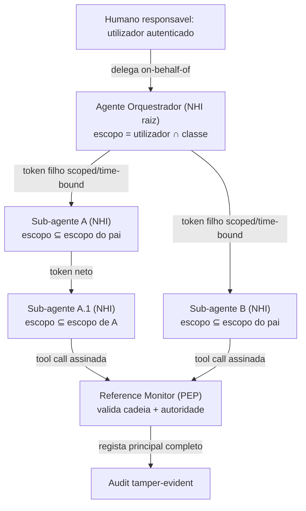
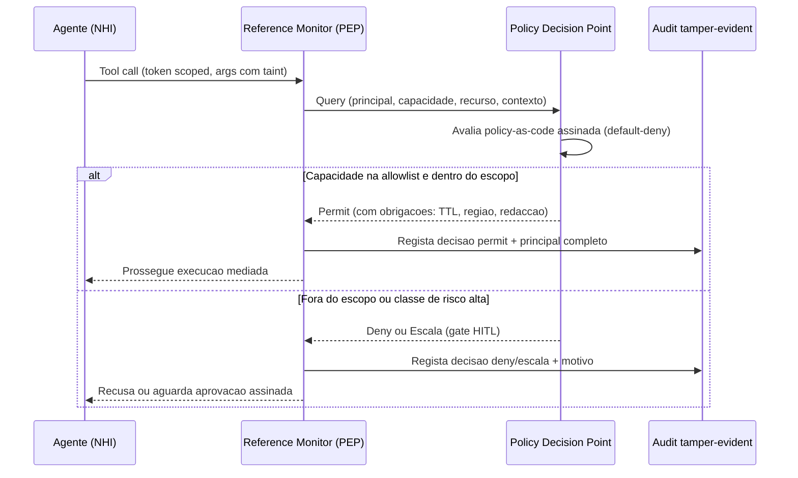
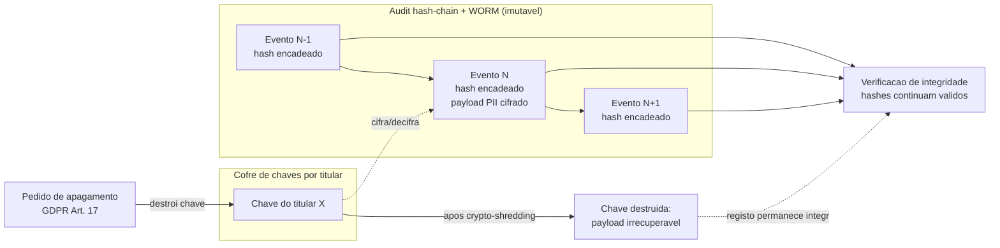

# Governação e Conformidade — AOS

| Campo | Valor |
|---|---|
| Produto | AOS — Agentic OS de Referência |
| Documento | Técnica — Governação e Conformidade |
| Versão | 1.0 |
| Data | Julho de 2026 |
| Classificação | Documento de Referência — Aberto |
| Documento-fonte | `_FONTE_agentic-os-ideal.md` |
| Documentos relacionados | `tecnica/00_Arquitectura_Solucao.md`, `tecnica/01_Reference_Monitor_Plano_Controlo.md`, `tecnica/07_Seguranca_Isolamento.md`, `tecnica/08_Observabilidade_Evals.md`, `specs/EPIC-09_Governacao_Conformidade.md` |

---

## 1. Introdução

### 1.1 Propósito

Este documento especifica a camada transversal **Governação & Learning (GOV)** do AOS — Agentic OS de Referência. A governação não é um módulo pendurado no fim: envolve todas as camadas, tal como a Observabilidade (`tecnica/08`), e transforma segurança e conformidade em propriedades *transversais* em vez de aspiracionais. O documento estabelece como se atribui identidade a cada agente, como se aplica política no boundary de cada tool call, como se reconcilia um audit imutável com o direito ao apagamento, como se gradua a autonomia e como se garante supervisão humana efectiva e responsabilização.

A tese é directa: a governação só é real quando o sistema torna a acção não-autorizada *arquitecturalmente impossível*. Quando um regulador pergunta *quem autorizou* uma acção, o audit trail nunca pode responder "o pool" — o cenário *The Audit Log Lied*. Isso exige identidade não-humana única, delegação verificável e enforcement programático, não convenções.

### 1.2 Âmbito

Inclui-se: identidade não-humana (NHI) e cadeia de delegação; o par PDP/PEP e a política-como-código; a conformidade GDPR por desenho (minimização, redação, TTL, crypto-shredding); a soberania de dados por *board*; a taxonomia de autonomia L0–L5; a supervisão humana efectiva ao abrigo do Art. 14 do EU AI Act; o modelo de responsabilização; e o gate de ratificação para auto-modificação. Ficam fora do âmbito: os mecanismos internos do Reference Monitor (`tecnica/01`), o isolamento de execução e o credential broker (`tecnica/07`), e o formato de spans e o audit WORM na sua vertente de captura (`tecnica/08`), aqui referidos apenas na fronteira.

### 1.3 Audiência

Engenheiros de governação e de segurança, DPO e equipas jurídicas/conformidade, arquitectos de plataforma e responsáveis de produto que precisem de compreender e auditar os controlos regulatórios do AOS.

### 1.4 Definições e termos

- **Non-human identity (NHI):** identidade única por agente, com token *scoped* e *time-bound*, numa cadeia de delegação *on-behalf-of* que termina num humano responsável.
- **PDP/PEP:** Policy Decision Point (avalia política) e Policy Enforcement Point (impõe a decisão); no AOS o PEP é o Reference Monitor.
- **Crypto-shredding:** apagar a chave de cifra por titular para tornar dados pessoais irrecuperáveis sem reescrever o log encadeado.
- **Autonomia graduada (L0–L5):** níveis de autonomia com oversight proporcional ao impacto e promoção baseada em fiabilidade medida.
- **Legal hold:** suspensão de TTL e apagamento sobre registos sujeitos a obrigação de preservação.

---

## 2. Princípios e decisões aplicáveis (ADRs)

A camada GOV concretiza directamente três decisões de arquitectura:

| ADR | Decisão | Como este documento a concretiza |
|---|---|---|
| **ADR-003** | Identidade não-humana por agente | Token *scoped/time-bound* codifica o par (utilizador, agente) numa cadeia de delegação *on-behalf-of*; autoridade = utilizador ∩ classe. É a base de toda a atribuição e conformidade (secção 3). |
| **ADR-011** | Policy-as-code + GDPR por desenho | PDP/PEP com Rego/OPA ou Cedar versionado e assinado; minimização, TTL, redação de PII e crypto-shredding (Art. 17); soberania por board (secções 4, 5, 6). |
| **ADR-014** | Taxonomia de autonomia L0–L5 | Oversight proporcional ao impacto; promoção baseada em fiabilidade medida (erro <2% por 30 dias); demoção automática em anomalia (secção 7). |

Aplicam-se ainda, na fronteira: **ADR-002** (Reference Monitor mandatório como PEP), **ADR-010** (audit hash-chain + WORM), **ADR-012** (eval-gate para auto-modificação) e **ADR-013** (gates SA-ROC e HITL efectivo).

---

## 3. Identidade não-humana e cadeia de delegação

O modo de falha original — um `credential pool` round-robin no Model Gateway — destruía a atribuição de identidade, base de toda a conformidade. O AOS separa dois eixos que esse desenho confundia: **(1) identidade**, em que cada agente possui um token OAuth *scoped/time-bound* que codifica o par (utilizador, agente) e a política sob a qual actua; e **(2) chaves de infra do provider**, que podem ser *pooled* para throughput, mas em que cada chamada regista o principal, o modelo e a região. Identidade nunca é *pooled*; chaves de infra podem sê-lo.

Cada agente e sub-agente é assim uma NHI única. Quando o Orquestrador delega, emite-se um novo token filho *on-behalf-of*, cujo escopo é sempre um subconjunto do escopo do pai — a autoridade só pode estreitar ao descer, nunca alargar. A cadeia termina invariavelmente num humano responsável, o que garante que qualquer acção é rastreável até quem a autorizou. A autoridade efectiva de qualquer agente é a intersecção **utilizador ∩ classe de agente**: nem o utilizador pode conceder o que a classe proíbe, nem a classe pode conceder o que o utilizador não possui.



As mensagens inter-agente são assinadas criptograficamente, o que permite ao Reference Monitor autenticar **origem + autoridade + referência** — não apenas verificar a existência de um ID, mitigando o *hallucination gate* fraco. Toda a decisão fica ligada ao principal completo (a cadeia inteira) no audit, satisfazendo o requisito de proibição de round-robin anónimo. Ver `tecnica/01` para a implementação do PEP e `tecnica/07` para o credential broker que troca este token por credenciais downstream.

---

## 4. PDP/PEP e política-como-código

O enforcement é programático e vive no boundary de **cada** tool call. O Reference Monitor actua como PEP e consulta o PDP, que avalia policy-as-code em Rego/OPA ou Cedar. A política é versionada em git, assinada, e o seu changelog é escrito no próprio audit trail — a evolução das regras é ela própria auditável.

O princípio operacional é **allowlist capability-scoped default-deny**. O desenho anterior usava uma *blocklist* de tools de sub-agente que *falhava aberta* a cada tool nova (uma tool desconhecida era implicitamente permitida). No AOS, o que não está explicitamente concedido é negado. Cada capacidade é um par (recurso, acção) escopado ao principal; a ausência de concessão é recusa.



A decisão do PDP pode devolver **obrigações** anexas — por exemplo, aplicar redação de PII ao output, restringir a região de execução, ou impor um TTL à classe de dado tocada. O PEP é responsável por cumprir essas obrigações antes de libertar o efeito. O overhead de mediação alvo é p95 < 15 ms, garantido por política compilada em memória (ver drivers não-funcionais no `tecnica/00`).

---

## 5. Conformidade GDPR e crypto-shredding

A maior tensão da governação é *audit imutável* **vs** *direito ao apagamento* (GDPR Art. 17). Um log hash-chained é, por construção, imutável; mas o titular tem o direito de ver os seus dados pessoais apagados. Resolver isto exige redefinir "imutável" como **tamper-evidence do registo**, não retenção eterna do payload.

A reconciliação faz-se por camadas:

1. **Minimização e redação na ingestão.** PII é tokenizada ou redigida antes de entrar; o que não é necessário nunca é persistido.
2. **TTL por classe de dado.** Cada classe (diagnóstico, trajectória, audit, PII operacional) tem um tempo de retenção próprio; diagnósticos efémeros expiram cedo, o audit tamper-evident retém-se mais tempo sob legal hold quando aplicável.
3. **Crypto-shredding para o Art. 17.** Os dados pessoais são cifrados com uma chave por titular. Satisfazer um pedido de apagamento (DSAR) consiste em destruir essa chave: o payload cifrado torna-se irrecuperável, mas o registo encadeado permanece íntegro e verificável — os hashes continuam a validar.



Assim, o direito ao apagamento é satisfeito sem reescrever o log e sem quebrar a cadeia de hashes: a integridade do registo (quem fez o quê, quando) é preservada como facto de conformidade, enquanto o conteúdo pessoal deixa de ser legível. O audit mantém retenção configurável e suporta **legal hold**, que suspende TTL e crypto-shredding sobre registos sob obrigação de preservação. Ver `tecnica/08` para o formato hash-chain + WORM subjacente.

---

## 6. Soberania de dados

A soberania é imposta por **board** (fronteira regional de dados). A allowlist de modelos do Model Gateway é regional, e o failover está **proibido de cruzar fronteira**: um board europeu que perca capacidade não pode fazer failover para uma região fora da UE, porque isso constituiria transferência ilegal de PII. O escopo de identidade codifica a região autorizada, e o PDP devolve-a como obrigação — o PEP recusa qualquer roteamento que a viole. A soberania é, deste modo, uma propriedade do enforcement, não uma política em papel.

---

## 7. Taxonomia de autonomia L0–L5

O desenho anterior era quase-binário: "HITL por default, autonomia opt-in". O AOS substitui-o por uma escada de seis níveis com oversight proporcional ao impacto e **promoção baseada em fiabilidade medida**, com demoção automática em anomalia (ADR-014).

```mermaid
flowchart TD
    L0["L0 — Sugestao<br/>agente propoe, humano executa tudo"]
    L1["L1 — Aprovacao por accao<br/>cada tool call espera aprovacao"]
    L2["L2 — Aprovacao por lote<br/>accoes gray agrupadas com resumo"]
    L3["L3 — Autonomia supervisionada<br/>safe corre, danger confirma"]
    L4["L4 — Autonomia por excepcao<br/>so escala em incerteza ou risco alto"]
    L5["L5 — Autonomia plena por dominio<br/>oversight amostral e post-hoc"]
    L0 -->|erro <2% por 30 dias| L1
    L1 -->|fiabilidade medida| L2
    L2 -->|fiabilidade medida| L3
    L3 -->|fiabilidade medida| L4
    L4 -->|fiabilidade medida| L5
    L5 -.anomalia detectada.->|democao automatica| L3
    L4 -.anomalia detectada.->|democao automatica| L2
    L3 -.anomalia detectada.->|democao automatica| L1
```

A promoção nunca é concedida por opinião: exige uma métrica de fiabilidade sustentada (por exemplo, taxa de erro < 2% ao longo de 30 dias, com override-rate baixo). A demoção, em contraste, é **automática e imediata** ao detectar anomalia — um pico de override-rate, uma acção insegura, ou deriva medida rebaixam o agente para um nível mais supervisionado sem esperar por revisão humana. O nível é sempre uma propriedade do par (agente, domínio): um agente pode operar a L4 num domínio de baixo risco e a L1 noutro sensível.

---

## 8. Supervisão humana efectiva e responsabilização

O Art. 14 do EU AI Act exige supervisão humana **efectiva**, não teatro de aprovações. O risco documentado é a *approval fatigue*: utilizadores experientes auto-aprovam mais de 40% dos pedidos, anulando a governação que dizem impor. A resposta do AOS é o tiering de risco SA-ROC (detalhado em `tecnica/00` e nas dimensões UX): *safe* corre, *gray* agrupa em lote, *danger/irreversível* exige gate individual com preview do efeito concreto e dual-control 4-eyes.

Os approval gates ganham quatro propriedades que os tornam efectivos: **aprovador autorizado** (a aprovação vem de um principal com autoridade para tal); **timeout fail-closed** para acções irreversíveis (o silêncio nega, nunca permite); **aprovação assinada** (não-repúdio criptográfico); e **medição de override-rate** como sinal anti-rubber-stamping — um override-rate cronicamente alto é ele próprio uma anomalia que dispara revisão e pode demover o agente na escada L0–L5.

O modelo de responsabilização é explícito e assenta na cadeia de delegação da secção 3: cada acção tem um principal completo rastreável até um humano; cada decisão de política fica no audit com o seu motivo; cada aprovação é assinada. Não existem execuções anónimas. Isto satisfaz simultaneamente a supervisão humana efectiva (Art. 14) e a exigência de atribuição inequívoca perante um regulador.

---

## 9. Ratificação de auto-modificação

A auto-modificação (skills auto-escritas, memória procedural) é a mudança de maior risco do sistema — a *misevolution* ocorre mesmo sem atacante. A governação trata-a como classe de mudança distinta, sujeita a um gate de ratificação assinada. O pipeline completo (staging → eval-gate → canary → ratificação → produção com SemVer e rollback atómico) pertence a ADR-012 e é detalhado em `tecnica/11`; do ponto de vista da governação, o ponto não-negociável é que **nenhuma auto-modificação chega a produção sem ratificação humana assinada**. A ratificação é o momento em que um humano responsável assume a mudança na cadeia de responsabilização; sem essa assinatura, a promoção a produção é bloqueada fail-closed.

---

## 10. Vista de qualidade

### 10.1 Governação (dimensão primária)

Identidade não-humana única por agente com cadeia de delegação verificável até um humano (proibido round-robin anónimo); enforcement programático via PDP/PEP no boundary de cada tool call com allowlist capability-scoped default-deny; audit tamper-evident com retenção, TTL por classe e legal hold; GDPR por desenho (minimização, redação, crypto-shredding para o Art. 17); soberania por board com failover proibido de cruzar fronteira; taxonomia L0–L5 com promoção por fiabilidade medida e demoção automática; supervisão humana efectiva (Art. 14) com gates assinados e override-rate medido; gate de ratificação para auto-modificação. Ver ADR-003, ADR-011, ADR-014.

### 10.2 Segurança

A governação apoia-se na fronteira de segurança: o PEP é o Reference Monitor mandatório (ADR-002), as credenciais downstream nunca são vistas pelo agente (credential broker, ADR-006), e a identidade criptográfica com mensagens assinadas impede *confused deputy*. A allowlist default-deny é a expressão de governação da postura default-deny de egress do substrato. Ver `tecnica/07`.

### 10.3 Experiência de utilização (UX/DX)

A supervisão efectiva depende de UX que combata a *approval fatigue*: gates com tiering, preview do efeito concreto, aprovação-como-card com paridade de superfície, e autonomia progressiva alinhada com a escada L0–L5. Over-trust é tão perigoso quanto under-trust; a calibração de confiança e a medição de override-rate mantêm a supervisão genuína.

---

## 11. Riscos e mitigações

| Risco | Impacto | Mitigação |
|---|---|---|
| Atribuição perdida (round-robin de identidade) | Audit não prova quem autorizou | NHI única por agente + cadeia de delegação assinada até humano (ADR-003) |
| DSAR impossível (log imutável) | Violação GDPR Art. 17 | Crypto-shredding + TTL por classe + redação na ingestão (ADR-011) |
| Fuga de soberania por failover | Transferência ilegal de PII | Allowlist regional; failover proibido de cruzar fronteira (ADR-011) |
| Allowlist a falhar aberta | Tool nova implicitamente permitida | Capability-scoped default-deny; ausência de concessão = recusa (ADR-011) |
| Approval theater / rubber-stamping | Governação inefectiva (Art. 14 violado) | Tiering SA-ROC, preview do efeito, override-rate medido, timeout fail-closed (ADR-013) |
| Promoção de autonomia por opinião | Agente pouco fiável em autonomia alta | Promoção só por fiabilidade medida; demoção automática em anomalia (ADR-014) |
| Auto-modificação sem ratificação | Misevolution em produção | Ratificação humana assinada como admission control fail-closed (ADR-012) |
| Política adulterada | Enforcement subvertido | Policy-as-code versionada, assinada, changelog no audit (ADR-011) |
| Legal hold contornado por TTL | Destruição de prova sob obrigação | Legal hold suspende TTL e crypto-shredding (ADR-010/011) |

---

## 12. Glossário

- **Non-human identity (NHI):** identidade única por agente, com token scoped/time-bound, numa cadeia de delegação on-behalf-of que termina num humano responsável.
- **PDP / PEP:** Policy Decision Point (decide) e Policy Enforcement Point (impõe); no AOS o PEP é o Reference Monitor.
- **Allowlist default-deny:** postura em que só o explicitamente concedido é permitido; o desconhecido é recusado.
- **Crypto-shredding:** apagar a chave de cifra por titular para tornar dados pessoais irrecuperáveis sem reescrever o log encadeado.
- **DSAR:** Data Subject Access Request; pedido do titular ao abrigo do GDPR, incluindo o direito ao apagamento (Art. 17).
- **Legal hold:** suspensão de TTL e apagamento sobre registos sob obrigação legal de preservação.
- **Soberania por board:** confinamento de dados e execução a uma fronteira regional; failover proibido de a cruzar.
- **Autonomia graduada (L0–L5):** níveis de autonomia com oversight proporcional ao impacto, promoção por fiabilidade medida e demoção automática em anomalia.
- **Override-rate:** proporção de aprovações concedidas sem escrutínio efectivo; sinal anti-rubber-stamping.
- **Misevolution:** deriva comportamental nociva de um agente auto-evolutivo, que ocorre mesmo sem atacante.

---

## 13. Tabela de aprovação

| Papel | Nome | Assinatura | Data |
|---|---|---|---|
| Arquitecto de Plataforma |  |  |  |
| Responsável de Segurança |  |  |  |
| Responsável de Produto |  |  |  |

---

## 14. Controlo de versões

| Versão | Data | Descrição | Autor |
|---|---|---|---|
| 1.0 | Julho 2026 | Emissão inicial | Equipa AOS |
