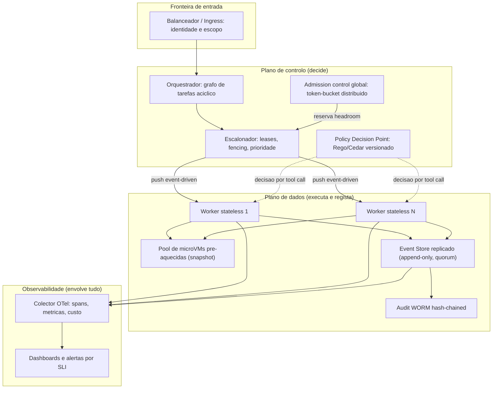
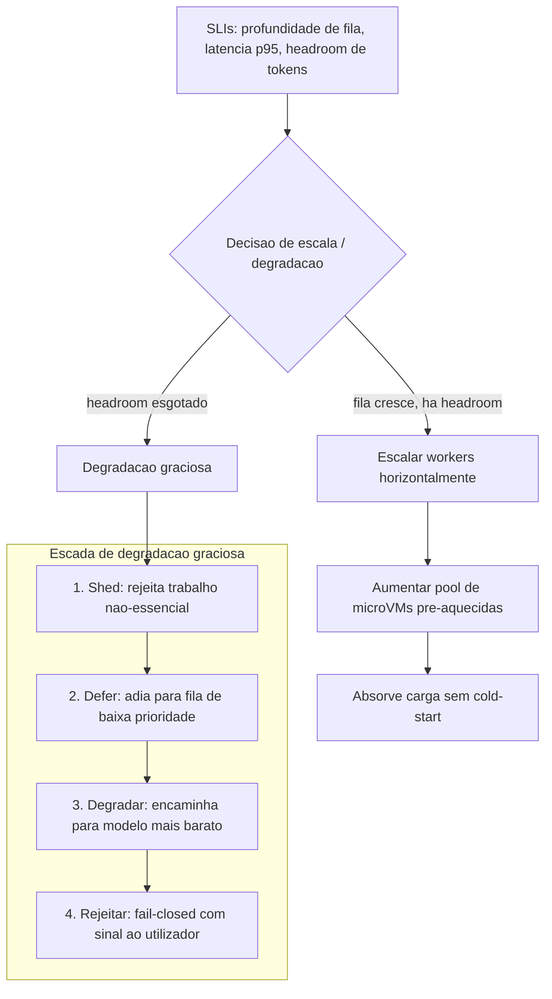
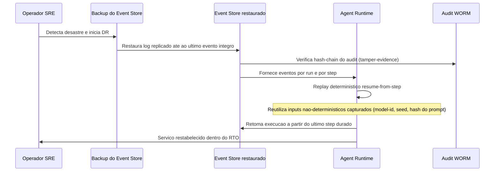

# Topologia, Implantação e Operação — AOS

| Campo | Valor |
|---|---|
| Produto | AOS — Agentic OS de Referência |
| Documento | Operação — Topologia, Implantação e Operação |
| Versão | 1.0 |
| Data | Julho de 2026 |
| Classificação | Documento de Referência — Aberto |
| Documento-fonte | `_FONTE_agentic-os-ideal.md` |
| Documentos relacionados | `tecnica/00_Arquitectura_Solucao.md`, `tecnica/03_Orquestracao_Escalonamento.md`, `tecnica/08_Observabilidade_Evals.md`, `specs/EPIC-10_Topologia_Operacao_DR.md` |

---

## 1. Introdução

### 1.1 Propósito

Este documento define a **topologia de implantação de referência** do AOS — Agentic OS de Referência — e o modelo operacional que a sustenta em produção. Estabelece a separação física entre plano de controlo e plano de dados, as opções de implantação (self-hosted, on-prem, nuvem), a estratégia de **escala horizontal** com degradação graciosa, o plano de **recuperação de desastre (DR)** ancorado no backup do Event Store e no replay determinístico, a observação operacional a partir dos SLIs, e um catálogo de **runbooks** para os modos de falha canónicos.

O princípio orientador é o mesmo que enforma toda a arquitectura: a topologia deve tornar as falhas operacionais *recuperáveis por desenho*. Workers *stateless* sobre um Event Store replicado (ADR-007), orçamento global com reserva de headroom (ADR-008) e trajectória completa em OTel com audit WORM (ADR-010) são as três alavancas que transformam incidentes de produção em operações rotineiras de recuperação, e não em perda de dados ou de atribuição.

### 1.2 Âmbito

Abrange a topologia de implantação, os modelos de implantação, a escala horizontal e a degradação graciosa, o DR e a recuperação por replay, a observação operacional (dashboards, SLIs, alertas) e os runbooks operacionais. Está fora do âmbito o detalhe interno de cada subsistema — remetido para os documentos especializados — e o desenho do harness de testes e de carga, tratado em `specs/EPIC-11`.

### 1.3 Audiência

Equipas de DevOps/SRE, arquitectos de plataforma, engenheiros de observabilidade e responsáveis de operação que implantam, escalam e operam o AOS. Serve também de base ao backlog executável `specs/EPIC-10_Topologia_Operacao_DR.md`.

### 1.4 Definições e termos

- **Plano de controlo:** o conjunto de componentes que *decidem* — admission control, escalonamento, PDP — sem processar directamente efeitos externos.
- **Plano de dados:** o conjunto que *executa e regista* — workers, Event Store, audit WORM.
- **RPO (Recovery Point Objective):** perda máxima de dados tolerável, medida em tempo.
- **RTO (Recovery Time Objective):** tempo máximo tolerável até restabelecer o serviço.
- **SLI/SLO:** indicador e objectivo de nível de serviço, base de alertas e de decisões de degradação.
- **Runbook:** procedimento operacional documentado para diagnóstico e mitigação de um modo de falha específico.

---

## 2. ADRs aplicáveis

| ADR | Decisão | Relevância operacional |
|---|---|---|
| ADR-007 | Event Store replicado | Fonte de verdade replicada, append-only, transporte push; elimina o SPOF do single-writer e é a base do backup e do replay como recuperação. |
| ADR-010 | Observabilidade OTel GenAI + audit WORM | Trajectória completa como árvore de spans e audit hash-chain + WORM; alimenta dashboards, SLIs, alertas e a fidelidade do replay em DR. |
| ADR-008 | Admission control global em tokens/$ | Token-bucket distribuído com reserva de headroom; é o mecanismo de degradação graciosa e a defesa contra o colapso agregado de rate limit. |

Aplicam-se ainda, de forma transversal, ADR-001 (durabilidade que torna o replay possível), ADR-002 (mediação total, cuja disponibilidade condiciona a operação) e ADR-011 (PDP, cuja falha exige runbook próprio).

---

## 3. Topologia de implantação de referência

A topologia separa fisicamente o **plano de controlo** (que decide) do **plano de dados** (que executa e regista), permitindo escalar cada um de forma independente. Os workers são *stateless*: todo o estado durável vive no Event Store replicado e no estado particionado por *run*, nunca no processo. Assim, qualquer worker pode morrer e ser substituído sem perda, e o número de réplicas ajusta-se à carga sem coordenação intra-processo.

**Elementos da topologia.** O plano de controlo aloja o Orquestrador (ORQ) e o Escalonador (SCH), o admission control global (ADM) e o Policy Decision Point (PDP) — componentes de baixo volume de dados e alta criticidade de decisão. O plano de dados aloja os workers *stateless*, o **pool de microVMs pré-aquecidas** (snapshot/restore em 5–30 ms, cold-start < 125 ms, ADR-004), o **Event Store replicado** por quorum e o audit WORM encadeado. A observabilidade envolve ambos os planos: cada worker e o próprio Event Store emitem spans e métricas para o colector OTel, que alimenta os dashboards e as regras de alerta. O detalhe do escalonamento e das leases está em `tecnica/03_Orquestracao_Escalonamento.md`; o dos spans e do audit em `tecnica/08_Observabilidade_Evals.md`.

**Porquê esta separação.** Manter o PDP e o admission control fora do caminho de dados significa que a decisão de política e de orçamento não escala com o volume de execução — escala com o número de tool calls, avaliada em memória com política compilada (overhead de mediação p95 < 15 ms). O Event Store replicado remove o único ponto de falha do single-writer do plano-base e passa a suportar leituras de replay e escritas de eventos de múltiplos workers em paralelo.

**Materialização por IaC (AOS-098).** A separação de planos não é apenas lógica: o IaC em `infra/` instancia o módulo `network` **uma vez por plano** (rede de controlo e rede de dados, ambas *default-deny* com egress allowlist explícita — ADR-004) e dois módulos de *scaffold*, `control-plane` (ORQ/SCH/ADM/PDP) e `data-plane` (workers + pool de microVMs), cada um com a **sua contagem de réplicas** (`control_plane_replicas`, `data_plane_worker_replicas`, `microvm_pool_size`) — donde a escala independente de cada plano. Os componentes ficam como *placeholders* mínimos; a lógica interna é entregue por AOS-099 (workers *stateless* + estado particionado), AOS-100 (replicação do Event Store) e AOS-103 (pool de microVMs). O Event Store (módulo `eventstore`) e o audit WORM vivem no plano de dados; o Credential Broker/Vault no plano de controlo.

**Replicação do Event Store — sem single-writer (AOS-100, ADR-007).** O modelo de referência in-process do `eventstore` elimina o SPOF de escrita: como a ordem total é **por stream** (`(stream_id, seq)`, gapless), a serialização é **por-stream** (locks listrados por *stream*/partição), não global. Escritas ao **mesmo** stream serializam-se (preservando o seq gapless, o CAS optimista `WithExpectedSeq`, a deduplicação idempotente por stream e a ordem do transporte push); escritas a streams **distintos** progridem **em paralelo** — múltiplos workers escrevem e leem para replay sem contenção de escritor único. A replicação síncrona por **quorum** e a eleição de líder mantêm-se (a perda de uma réplica dentro do quorum não perde dados nem interrompe escritas); o que muda é a remoção do mutex global que serializava *todas* as escritas através de um líder único. As invariantes de **ordem-por-stream** e **imutabilidade** (log append-only, `Read` devolve cópias) são preservadas — são a base do audit *hash-chain* (ADR-010). Em produção o backend é NATS JetStream (R3/R5, Raft); este modelo é a referência determinística e testável (falha de nó, escrita concorrente multi-worker, integridade append-only, tudo sob `-race`).

**Soberania regional das réplicas (ADR-011).** As réplicas e os backups do Event Store **nunca** cruzam a fronteira regional de soberania do board. Quando a fronteira é declarada (região do board), o cluster é validado **fail-closed** na construção: uma réplica fora da região — ou com região ausente/desconhecida — é **rejeitada** (`E_SOVEREIGNTY_VIOLATION`); o quorum é computado **dentro** da região e a eleição de líder nunca promove liderança *cross-border*. Isto materializa, ao nível do armazenamento, a mesma postura *"região desconhecida ⇒ deny"* que o PDP emite como obrigação `region` e o PEP impõe (AOS-094).

---

## 4. Opções de implantação

O AOS é um blueprint neutro quanto ao provedor. A mesma topologia lógica materializa-se em três modelos, que diferem sobretudo no substrato do Event Store, no isolamento das microVMs e nas fronteiras de soberania.

| Modelo | Substrato típico | Isolamento | Soberania e notas |
|---|---|---|---|
| **Self-hosted (cluster próprio)** | Postgres/NATS replicado ou Kafka; orquestração Kubernetes | Firecracker/Kata em nós bare-metal ou nested-virt | Controlo total; failover restrito ao cluster; ideal para requisitos de soberania estritos |
| **On-prem (data center regulado)** | Event Store replicado on-prem; vault local | microVM em hardware dedicado | Dados nunca saem da fronteira; allowlist regional de modelos via Model Gateway |
| **Nuvem (managed)** | Serviços geridos (log replicado, filas push); KMS gerido | gVisor ou microVM em instâncias com virtualização aninhada | Elasticidade rápida; **failover proibido de cruzar fronteira regional** (ADR-011) |

Em qualquer modelo mantêm-se invariantes: rede **default-deny** com egress allowlist no substrato (ADR-004), Credential Broker + Vault server-side (ADR-006), e a allowlist regional de modelos no Model Gateway. A soberania por *board* impõe que o failover nunca atravesse uma fronteira regional — restrição que se aplica igualmente à réplica do Event Store e aos backups de DR.

**Parametrização e guardrails por IaC (AOS-098).** O IaC parametriza os três modelos via `deployment_model ∈ {self_hosted, on_prem, cloud}` (validação fail-closed que rejeita qualquer outro valor). A fronteira de soberania é declarada por `region` + `sovereignty_board` + `sovereignty_regions`, e um **guardrail fail-closed** (validação de variável, disparada em *input-time* antes de qualquer ligação ao provider) **falha o `plan`/`validate`** se `backup_region` ou `replica_region` cruzarem a fronteira regional — igual a `region` ou dentro do *board*, nunca fora (ADR-011). No modelo cloud, o estado remoto é cifrado (`encrypt = true` em `backend-<env>.hcl`). Estes guardrails são verificáveis **offline** pelos testes nativos `infra/tests/*.tftest.hcl` (`tofu test` com `mock_provider`), sem daemon Docker.

---

## 5. Escala horizontal e degradação graciosa

A escala horizontal assenta em três propriedades: workers *stateless* (adicionar réplicas não exige coordenação), estado **particionado** por *run* (sharding natural do trabalho) e admission control **global** (o crescimento do plano de dados nunca ultrapassa o headroom real do provider). O Escalonador faz *push* event-driven de trabalho apenas quando há débito reservado no token-bucket distribuído; `max_spawn` é derivado dinamicamente do headroom, não uma constante (ADR-008).

**Escalar para cima.** Quando a profundidade de fila e a latência p95 sobem mas há headroom no token-bucket, adicionam-se réplicas de worker e amplia-se o pool de microVMs pré-aquecidas, absorvendo a carga sem pagar cold-start. Como o estado é particionado, novas réplicas assumem partições sem *rebalancing* disruptivo.

**Degradar com graça.** Quando o headroom se esgota, entra a **escada de degradação graciosa** com política declarativa: *shed* (rejeitar trabalho não-essencial) → *defer* (adiar para fila de baixa prioridade) → *degradar* (encaminhar para modelo mais barato via roteamento cost-aware) → *rejeitar* (fail-closed com sinal explícito). Isto substitui a acumulação ilimitada de fila e a cascata de timeouts por uma resposta previsível e observável. A mecânica de backpressure e de prioridade/aging detalha-se em `tecnica/03_Orquestracao_Escalonamento.md`.

**Orquestração da escala + escada no Escalonador (AOS-107).** O núcleo de decisão vive em `packages/control-plane/scheduler` (`scale.go`) e **compõe** as peças já entregues (não as reimplementa): (1) `deriveDesiredReplicas(queue_depth, p95_wait, headroom, cfg)` — a fórmula **pura, determinista e monótona** do alvo de réplicas, análoga a `deriveMaxSpawn`/`DefaultPoolSizer`: cresce quando a profundidade de fila **e** o p95 de wait sobem e há headroom, é **limitada pelo headroom** (nunca ultrapassa o `max_spawn` real, ADR-008) e vale **0 sob headroom nulo** (fail-closed, não escala — degrada); (2) o `WaitP95Recorder` — o SLI de **p95 de wait/despacho** (percentil nearest-rank, janela deslizante, sobre os `WaitMs` do `Dispatcher`); (3) o `HorizontalScaler.Tick(ctx)` — o laço determinista (relógio/ticker injectáveis) que lê os três SLIs e, **com headroom**, emite o alvo de réplicas como um **sinal** (`ReplicaTarget` numa porta `ReplicaSink`) e, **sem headroom**, conduz a escada de degradação **global** — `PolicyEngine.Select` escolhe o degrau conforme a pressão agregada e `Degrader.ExecuteChain` executa-o por-item a partir desse degrau (fail-closed), com o degrau activo a subir pela ordem canónica e a reverter (`Degrader.Normalize`) ao recuperar headroom. A **aplicação real** do alvo às réplicas de worker e o link ao pool vivem no *composition root* (ápice, `packages/integration`) — o Escalonador fornece o **sinal** de escala + a escada, não o mecanismo de posse (o `Assigner` de AOS-099 garante que réplicas novas assumem partições sem *rebalancing* disruptivo). A degradação é **observável** (AC5): um gauge do **degrau corrente** (`aos.scheduler.degradation.level`, 0–4) e dos alvos `desired`/`actual` de réplicas, ligados ao alerta de headroom (RB-01 headroom=0/rate-limit, RB-03 headroom<0/orçamento). O runbook operacional é `docs/runbooks/PROC-ESCALA.md`.

**Dimensionamento do pool derivado do headroom (AOS-103).** O pool de microVMs pré-aquecidas (`substrate/sandbox`, AOS-065) deixou de ter tamanho constante: o `Autoscaler` observa o headroom por uma **porta** (`HeadroomSource`, em unidades abstractas de capacidade) e aplica um `PoolSizer` puro/determinista (`DefaultPoolSizer`, análogo a `deriveMaxSpawn` do escalonador: `slots = disponível/custo_por_VM`, monótono no headroom, **zero sob headroom nulo**), reajustando os alvos *warm*/*max* via `Pool.Resize` — cresce por reposição, encolhe drenando as VMs pré-aquecidas em excesso (overlays descartados, nunca reciclados). O crescimento é **sempre limitado por um tecto absoluto** que dimensiona a fila: um headroom errado nunca faz o pool crescer para lá do limite físico. Sob headroom nulo o pool vai a zero e **degrada fail-closed** (não serve para lá do headroom) — a escada de degradação acima. A **fonte de verdade** do headroom é o admission control do escalonador (ADR-008); como a sandbox é substrato e não pode importar o plano de controlo, o **adaptador** `scheduler.HeadroomSnapshot` → porta vive no *composition root* (ápice) — o mesmo padrão "porta no pilar + adaptador no ápice" do egress (AOS-067). Os SLIs de **ocupação** e **reciclagem** do pool (secção 7) tornam a pressão e a rotação observáveis.

---

## 6. DR e recuperação por replay

A estratégia de DR do AOS distingue-se de um sistema convencional: como o Event Store é a **fonte de verdade append-only** e a execução é durável ao nível do passo (ADR-001), a recuperação primária é o **replay determinístico** a partir do log, e não a restauração de snapshots de estado mutável. Restaura-se o log; o estado reconstrói-se *resume-from-step*.

**Backup do Event Store.** O log é replicado por quorum em contínuo (RPO tende a zero dentro da região) e adicionalmente exportado para backup imutável, com verificação periódica da hash-chain do audit WORM (ADR-010). O backup respeita a soberania: réplicas e cópias nunca cruzam a fronteira regional (ADR-011) — a mesma guarda *fail-closed* que rejeita, na construção do cluster, qualquer réplica fora da região do board (AOS-100). A base do backup e do replay é a replicação por quorum sem single-writer de AOS-100: a **ordem-por-stream** e a **imutabilidade** append-only são preserváveis e verificáveis independentemente do paralelismo de escrita entre streams, pelo que o log restaurado é integralmente reproduzível passo-a-passo.

**Backup imutável + PITR (AOS-101).** A exportação materializa-se em duas camadas de referência, zero-dep, com os *backends* de produção (object storage WORM, KMS) modelados por portas injectáveis:

- *Primitivas no Event Store (`substrate/eventstore`, aditivas e zero-dep).* Um **snapshot/export consistente** que preserva o **envelope intacto** (EventID/Ts/Seq originais) — porta `BackupSource` (`Streams`, `StreamHead`, `SnapshotStream`) — e um caminho de **restauro que preserva o envelope** — porta `RestoreSink` (`IngestStream`, valida a ordem gapless e o envelope). Estas são **métodos do tipo concreto**, fora da interface `EventStore` append-only travada (que se mantém exactamente `Append/Read/Subscribe/Close`); o `Append` público continua a reatribuir o envelope, pelo que o restauro usa um caminho distinto que o **não** reatribui.
- *Módulo `platform/backup`.* Um **exportador contínuo/incremental** lê o snapshot, **cifra em repouso** (envelope AES-256-GCM, KEK do `audit.KeyVault`/porta de KMS — nenhum plaintext de payload chega ao armazenamento), escreve **segmentos imutáveis** (porta `ImmutableStore` *write-once*, com object-lock por `audit.RetentionPolicy` e `audit.LegalHold`), e sela cada segmento num **manifesto hash-chain** SHA-256 (`EntryHash = SHA-256(PrevHash ‖ conteúdo canónico)`, molde de `audit.ComputeEntryHash`) com um **checkpoint assinado** (ed25519) no head. O **PITR** reconstrói um Event Store até um seq-alvo por stream, **verificando a hash-chain** no processo — uma adulteração de um segmento (blob) ou de qualquer campo do manifesto é **detectada** (tamper-evidence, ADR-010) e o restauro **aborta fail-closed** antes de escrever; o rollback de checkpoint é rejeitado (`ErrCheckpointStale`, molde de `VerifyFromCheckpointAtHead`). O restauro devolve **evidência** (timestamp, head por stream, verdict) — a prova de "restauro testado" (não apenas configurado). A **soberania** é *fail-closed*: um destino que cruze a fronteira do board (região diferente, ausente ou desconhecida) é recusado (`ErrSovereigntyViolation`), reutilizando `Region()`/`SovereigntyBoard()` do Store. O **RPO** é limitado pela periodicidade do ciclo: sob exportação a cada `Periodicity() <= 1 min`, a janela efectiva de perda mantém-se `<= 1 min` dentro de região (medível com relógio injectado). O runbook de restauro está esboçado no README do módulo (liga a AOS-106).

**RPO/RTO de referência.** *(proposta)* Alvos operacionais: **RPO ≤ 1 minuto** dentro de região (replicação síncrona por quorum) e **RTO ≤ 30 minutos** para restauro do log e retoma por replay. Estes valores derivam da disponibilidade-alvo do plano de controlo de 99,9% e devem ser validados por exercícios de DR periódicos (*game days*).

**Replay como recuperação.** A fidelidade do replay exige que todos os inputs não-determinísticos tenham sido capturados por trajectória — model-id, params, seed e hash do prompt materializado (o manifesto de dependências). Com essa captura, 100% dos passos são reproduzíveis: a recuperação não "adivinha" o estado, reexecuta-o de forma idêntica a partir do último passo durado. Efeitos externos, sendo idempotentes por chave = f(run_id, step_id), não são duplicados na retoma. O fundamento de replay e captura está em `tecnica/08_Observabilidade_Evals.md`.

**Orquestração de DR + game day (AOS-102).** O módulo `platform/dr` **compõe** as peças já Done — um nível acima de `engine.NewOwnContractEngine` — sem reimplementar restauro/replay/resume/verificação/idempotência/soberania. O orquestrador (`Recoverer.Recover`) encadeia, como **transacção fail-closed** (aborta em qualquer falha, sem tocar em produção — opera sempre sobre um Event Store de DR limpo e descartável): (a) resolve a fronteira-alvo do board (`BoundaryResolver` **injectado** — `platform/dr` **não** importa control-plane/governação; seria um up-import ilegal); (b) constrói um Event Store de DR limpo na fronteira (`WithSovereigntyBoard` — recusa *cross-border* por construção) e **asserta** `região(Store)==região-alvo`; (c) `backup.Restorer.RestoreTo` até ao seq-alvo (o `VerifyManifest` embutido aborta em adulteração *antes* de escrever); (d) `audit.VerifyFromCheckpointAtHead` **antes** de retomar (integridade do WORM; rejeita *stale*/rollback); (e) `replay.Replay` para **provar a fidelidade** (`Fidelity==1.0 && sem divergência`, senão aborta); (f) retoma *resume-from-step* (worker AOS-099 sobre o log restaurado) com o `StepLedger` a garantir **0 efeitos duplicados**; (g) reafirma a fronteira de soberania. Qualquer `ErrSegmentTampered`/`ErrChainBroken`/`ErrCheckpointStale`/divergência/`ErrSovereigntyViolation`/`ErrIncompleteCapture` aborta — o serviço **não** é dado por restabelecido. O **game day** (`GameDay.Run`) corre o encadeamento contra um Store descartável, mede **RPO** (reutiliza `Exporter.RPOWindow`/`WithinRPO`) e **RTO** (wall-clock do orquestrador, relógio injectável) contra os alvos, e **persiste a evidência combinada** (restauro + WORM verificado + `Fidelity`/`FinalStateHash` + timings + veredicto), com o próximo exercício agendado (cadência periódica — AC7). O teste end-to-end monta o pipeline completo (captura → export → desastre → restauro → verificação → replay 100% → retoma → 0 duplicados → RPO/RTO → soberania) e os testes adversariais provam que uma adulteração do backup, uma divergência de replay, um rollback do WORM ou um failover *cross-border* **abortam** fail-closed. O runbook operacional está no README do módulo (liga a AOS-106).

---

## 7. Observação operacional, SLIs e alertas

A observação operacional deriva directamente da camada de observabilidade (ADR-010): os mesmos spans OTel GenAI e métricas que suportam debug e eval alimentam os dashboards e as regras de alerta. O padrão é *wide events* — capturar tudo, filtrar no query-time — de modo a que os alertas se construam sobre SLIs e não sobre filtragem no emit-time que esconde padrões sistémicos.

| SLI | Alvo (SLO) | Alerta quando | Runbook associado |
|---|---|---|---|
| Disponibilidade do plano de controlo | 99,9% | Erro > 0,1% em janela de 5 min | RB-04 (falha de PDP), geral |
| Overhead de mediação (RM) p95 | < 15 ms | p95 > 15 ms sustentado | RB-04 |
| Cold-start de sandbox | < 125 ms | pool esgotado ou p95 > 125 ms | escala (secção 5) |
| Ocupação do pool de microVMs | headroom-relativa | ocupação ≈ 100% sustentada (pressão) | escala (secção 5) |
| Taxa de reciclagem do pool | estável | pico de reciclagem (rotação de carga) | escala (secção 5) |
| Cache-hit-rate de prompt | > 80% | queda abrupta (cache thrash) | observação de custo |
| Headroom de tokens/$ | > 0 reservável | headroom < limiar de reserva | RB-01 (rate limit), RB-03 (orçamento) |
| Fidelidade de replay | 100% dos passos | falha de reprodução em amostra | RB-05, DR |
| Integridade do audit WORM | hash-chain íntegra | quebra de encadeamento | DR, escalar segurança |

Os dashboards organizam-se por plano (controlo vs dados) e por *run*, com *drill-down* da árvore de spans até à tool call individual, incluindo custo em USD por span. Alertas ligam-se sempre a um runbook accionável; alertas sem runbook são considerados ruído e removidos.

**Dashboard-as-code (AOS-104).** Os dashboards são **versionados como código**, não configurados à mão: o catálogo operacional vive em `packages/substrate/otel-genai/catalog.go` (módulo FOLHA zero-dep) como um `DashboardCatalog` VERSIONADO (SemVer, validação fail-closed no molde de `SLOConfig`), serializável para JSON e **reproduzível por round-trip** — o artefacto `operational_dashboard.json` é gerado a partir de `DefaultDashboardCatalog()` e embebido (`go:embed`), com um teste a garantir que ficheiro e código nunca divergem. Cada painel (`SLIPanel`) declara o seu **plano** (`control`/`data`, coerente com os rótulos `aos.plane` da IaC de AOS-098 — o plano é um mapeamento estático produtor→plano, não uma dimensão lida do span), o seu **SLO** e a sua **janela de avaliação**. Os sete SLIs canónicos são cobertos: os dois já existentes (cache-hit-rate, overhead de mediação p95) reutilizam os derivadores puros de `slo.go`; cold-start de sandbox, fidelidade de replay e headroom de tokens/$ derivam-se por agregação *query-time* dos *wide events* (lendo as strings canónicas dos produtores — `aos.sandbox.cold_start_ms`, `aos.replay.fidelity`, `aos.scheduler.headroom.free_tokens` — replicadas localmente, nunca importando os módulos produtores). A renderização (`DashboardCatalog.Render`) é *query-time* pura (AC4) e herda a anti-vacuidade de `SLIValue` (sem amostras ⇒ não avaliado, nem *breach* nem cumprimento por vacuidade).

**Duas lacunas assumidas honestamente.** A **disponibilidade do plano de controlo** não tem produtor dedicado: o catálogo define o *slot* do SLI e o valor é **injectado** por um *heartbeat*/*health* fornecido pelo chamador (`OperationalInputs.ControlPlaneAvailability`); sem injecção, o painel fica não avaliado até ser cablado. A **integridade do audit WORM** não tem métrica pré-emitida — é o resultado de `platform/audit` `Verify()`, uma função sob-demanda: o catálogo aceita o booleano injectado (`OperationalInputs.AuditWORMIntact`, íntegro=1/adulterado=0) e o *binding* a `audit.Verify` é *wiring* de *composition-root*. Nenhum destes dois valores é fabricado.

**Custo por *run* e por tenant (ADR-010).** O custo em USD por span é agregável por *run* (`CostByRun`), por tenant (`CostByTenant`) e pela chave composta *run*+tenant (`CostByRunAndTenant`), tudo sobre `AggregateUsage` (*query-time*). A agregação por tenant **reconcilia** as duas chaves divergentes do vocabulário (`aos.tenant_id` de otel-genai vs `aos.tenant` do Model Gateway) via `TenantOf`. A vista por *run* (`BuildRunView`) reutiliza `RollupByTrace` para o *drill-down* por sub-árvore de delegação até à tool call individual, com o custo por span visível.

**Alerting-as-code (AOS-105).** As regras de alerta são **versionadas como código**, não configuradas à mão, e vivem em `packages/substrate/otel-genai/operational_alerts.go` (mesmo módulo FOLHA zero-dep). Um `OperationalAlertConfig` VERSIONADO (SemVer, validação fail-closed) **compõe** — não reimplementa — o substrato de AOS-086 (reutiliza `Route`/`AlertRule`/`Severity`/`Alert` e a janela sustentada) e o catálogo de dashboards de AOS-104: cada regra dispara a partir de `OperationalSnapshot.Breaches()`, ou seja, sobre o SLI **já avaliado *query-time*** contra o SLO do painel — nunca sobre filtragem no *emit-time*. Os limiares e janelas **derivam do SLO+janela do painel** (não são números mágicos): a regra só carrega severidade, encaminhamento e a janela sustentada. Há **uma regra por cada um dos sete SLIs canónicos** (AC1), cada uma ligada a um runbook accionável da secção 8 (AC2); a validação fail-closed é o **gate de CI de não-órfãos** — falha se algum SLI ficar sem alerta *ou* algum alerta sem runbook. O **headroom** liga-se ao admission control (ADR-008) e **distingue duas causas** por duas regras/rotas (AC4): headroom fixado no zero ⇒ **colapso por rate limit → RB-01**; headroom negativo (deficit) ⇒ **esgotamento de orçamento → RB-03** — nunca se colapsam num alerta genérico. Um SLI não avaliado (sem amostras/injecção) **não dispara** (anti-vacuidade). A avaliação existe em observação única (`EvaluateOperationalAlerts`, função pura) e sustentada (`OperationalAlertEvaluator.Observe`, *streak* por regra — um pico transitório não alerta, um breach persistente sim, e recupera quando volta). O **controlo de ruído** (AC6) agrupa por plano e suprime WARNING correlacionados a um CRITICAL do mesmo plano (`GroupAndSuppress`), mas **nunca suprime um CRITICAL** e o resumo do grupo mantém a contagem total — a supressão reduz páginas sem esconder padrões sistémicos. O artefacto `operational_alerts.json` é gerado a partir de `DefaultOperationalAlertConfig()` e embebido (`go:embed`), com round-trip reproduzível e teste ficheiro==código (AC5). O encaminhamento segue a tabela acima: disponibilidade do plano de controlo e overhead de mediação → RB-04; cold-start → escala (secção 5); cache thrash → RB-03 (observação de custo); fidelidade de replay → RB-05 (misevolution) + DR; integridade do audit WORM → DR + escalar segurança.

---

## 8. Catálogo de runbooks operacionais

Cada runbook segue a estrutura: **sinal** (o que dispara), **diagnóstico** (como confirmar) e **mitigação** (passos de recuperação). Todos assumem acesso aos dashboards de SLI e à trajectória OTel.

**RB-01 — Colapso de rate limit (agregado).**
Sinal: headroom de tokens perto de zero, múltiplos boards a saturar colectivamente o rate limit partilhado. Diagnóstico: verificar o token-bucket distribuído e a taxa de *admit* recusado; confirmar que nenhum board excede individualmente o `max_spawn`. Mitigação: o admission control global deve estar já a recusar spawns sem headroom (ADR-008); accionar a escada de degradação (shed → defer → degradar → rejeitar); reduzir a reserva de headroom por tenant se um tenant monopoliza; validar que `max_spawn` está derivado do headroom e não fixo.

**RB-02 — Zumbi cross-host (falso-positivo/positivo).**
Sinal: worker aparenta estar `running` mas sem progresso, ou detecção de execução duplicada entre hosts. Diagnóstico: **nunca usar PID**; inspeccionar lease/heartbeat com TTL e o fencing token — um worker com fencing token obsoleto está morto. Distinguir de `waiting_on_human`, que é estado durável legítimo e não zumbi. Mitigação: deixar o lease expirar e reatribuir a partição com novo fencing token; escritas do worker obsoleto são invalidadas pela monotonicidade do token, garantindo que a tarefa não executa duas vezes. Ver máquina de estados em `tecnica/03`.

**RB-03 — Esgotamento de orçamento (tokens/$).**
Sinal: árvore de execução a aproximar-se do orçamento em tokens/custo; circuit breaker prestes a disparar. Diagnóstico: consultar o burn-down por *run* e o custo por span. Mitigação: a ~80% do orçamento, apresentar prompt de exaustão graciosa (estender / resumir e parar / abortar); se o circuit breaker disparar, a execução pára fail-closed sem efeitos parciais não compensados; o orçamento é medido em tokens/$ e não em iterações (ADR-008).

**RB-04 — Falha de PDP (Policy Decision Point).**
Sinal: latência de decisão de política a subir ou PDP indisponível. Diagnóstico: verificar a saúde do PDP e a versão de política carregada. Mitigação: o Reference Monitor deve **fail-closed** — sem decisão de política, a tool call não executa (a segurança nunca degrada para *fail-open*); encaminhar tráfego para réplica de PDP com a mesma política assinada; se a política corrompeu, reverter para a versão anterior assinada a partir do git versionado (ADR-011). A indisponibilidade do PDP degrada disponibilidade, nunca segurança.

**RB-05 — Rollback de auto-modificação.**
Sinal: regressão comportamental detectada após promoção de skill/prompt/schema auto-escrito (misevolution/drift). Diagnóstico: comparar success-rate e unsafe-action rate contra a baseline (trace-diffing); identificar a versão SemVer promovida. Mitigação: accionar o **rollback atómico** para a versão anterior; reencaminhar o artefacto para staging → eval-gate (golden-set) → canary antes de nova tentativa (ADR-012); registar o incidente no audit WORM. Nenhuma auto-modificação regressa a produção sem repassar o eval-gate.

**Runbooks versionados, ligação a alerta e game days (AOS-106).** Cada runbook acima é escrito como doc estruturado versionado em `docs/runbooks/RB-0N.md` (sinal → diagnóstico → mitigação, ADR citado, alerta ligado, referência ao game day). A **ligação bidireccional alerta↔runbook** é um gate FAIL-CLOSED verificado no CI: o registo em `packages/platform/runbooks` (que importa `otel-genai` só para ler os IDs de runbook das regras de AOS-105) falha se algum alerta referenciar um runbook sem entrada, e exige que cada canónico RB-01..RB-05 esteja presente. Duas honestidades ficam marcadas, não silenciadas: **RB-02 não tem alerta de SLI** (é diagnóstico por lease/heartbeat, não uma métrica com SLO) — registado como runbook sem alerta, justificado; **PROC-DR** (AOS-102, já no README de `platform/dr`) e **PROC-ESCALA** (AOS-107, pendente) são forward-refs marcados. Cada runbook é **exercitado num game day** que injecta o modo de falha REAL sobre a infra real e prova a recuperação: RB-01 `packages/control-plane/scheduler/gameday_rb01_test.go` (admission recusa spawns sem headroom, `max_spawn`→0; pool `Max`→0 em `substrate/sandbox`), RB-02 `packages/kernel/agent-runtime/durable/gameday_rb02_test.go` (lease expira → reatribui com fencing novo, escrita do obsoleto rejeitada com `ErrStaleFencingToken`), RB-03 `packages/control-plane/scheduler/gameday_rb03_test.go` (breaker dispara por esgotamento → `Allow` nega fail-closed), RB-04 `packages/kernel/reference-monitor/gameday_rb04_test.go` (PDP indisponível → RM fail-closed Deny, recupera com política assinada), RB-05 `packages/control-plane/governance/hitl/gameday_rb05_test.go` (artefacto regredido bloqueado pelo eval-gate, baseline promovível, decisão selada no WORM); PROC-DR reutiliza o game day de AOS-102.

---

## 9. Vista de qualidade

### 9.1 Escalabilidade
Plano de dados horizontalmente escalável com workers *stateless* e estado particionado; pool de microVMs pré-aquecidas para absorver picos sem cold-start; admission control global com reserva de headroom e degradação graciosa em escada (shed → defer → degradar → rejeitar). A escala do plano de controlo é desacoplada da do plano de dados. Ver ADR-008; detalhe em `tecnica/03_Orquestracao_Escalonamento.md`.

### 9.2 Fiabilidade
Event Store replicado por quorum sem SPOF; recuperação por replay determinístico *resume-from-step* com idempotência por passo; RPO ≤ 1 min e RTO ≤ 30 min *(proposta)* validados por *game days*; failover restrito à fronteira de soberania; PDP e Reference Monitor com comportamento fail-closed. Ver ADR-007, ADR-001, ADR-011.

### 9.3 Observabilidade
Trajectória completa em OTel GenAI semconv e audit hash-chain + WORM como base de dashboards, SLIs e alertas; padrão *wide events* (filtrar no query-time); cada alerta ligado a um runbook accionável; custo em USD por span. Ver ADR-010; detalhe em `tecnica/08_Observabilidade_Evals.md`.

---

## 10. Riscos e mitigações

| Risco | Impacto | Mitigação |
|---|---|---|
| Colapso agregado de rate limit | Board autodestrói-se | Admission control global com reserva de headroom; escada de degradação (ADR-008) — RB-01 |
| Falso-positivo de zumbi cross-host | Tarefa executada duas vezes | Lease/heartbeat + fencing token, nunca PID (ADR-001) — RB-02 |
| Esgotamento de orçamento silencioso | Explosão de custo | Orçamento em tokens/$ com circuit breaker e exaustão graciosa a 80% (ADR-008) — RB-03 |
| Falha de PDP degradar para fail-open | Tool call sem política | Reference Monitor fail-closed; réplica de PDP; reversão de política assinada (ADR-011) — RB-04 |
| Auto-modificação regressiva em prod | Regressão comportamental | Rollback atómico + repasse por eval-gate/canary (ADR-012) — RB-05 |
| Perda do Event Store | Perda da fonte de verdade | Replicação por quorum + backup imutável; replay como recuperação (ADR-007) |
| Replay infiel após restauro | RCA e retoma inválidos | Manifesto de dependências por trajectória + hash do prompt (ADR-010) |
| Failover cruza fronteira de soberania | Transferência ilegal de PII | Failover e backup restritos à região; allowlist regional (ADR-011) |
| Alerta sem runbook | Fadiga de alerta, ruído | Todo o alerta liga a runbook accionável; SLIs sobre wide events (ADR-010) |
| Cold-start em pico de carga | Latência excessiva | Pool de microVMs pré-aquecidas dimensionado ao headroom (ADR-004) |

---

## 11. Glossário técnico

- **Plano de controlo / plano de dados:** separação entre os componentes que decidem (admission, escalonamento, PDP) e os que executam e registam (workers, Event Store, audit).
- **Event Store replicado:** log append-only, replicado por quorum, fonte de verdade e base do replay; substitui o single-writer (ADR-007).
- **Pool de microVMs:** conjunto de sandboxes pré-aquecidas com snapshot/restore, que absorve picos sem pagar cold-start.
- **Degradação graciosa:** política declarativa em escada — shed, defer, degradar, rejeitar — accionada quando o headroom se esgota.
- **RPO/RTO:** perda máxima de dados tolerável / tempo máximo até restabelecer o serviço.
- **Replay como recuperação:** reconstrução do estado por reexecução determinística *resume-from-step* a partir do log, em vez de restauro de estado mutável.
- **SLI/SLO:** indicador e objectivo de nível de serviço; base de alertas e de decisões de degradação.
- **Runbook:** procedimento documentado (sinal, diagnóstico, mitigação) para um modo de falha.
- **Game day:** exercício periódico de DR que valida RPO/RTO e a fidelidade do replay.

---

## 12. Tabela de aprovação

| Papel | Nome | Assinatura | Data |
|---|---|---|---|
| Arquitecto de Plataforma |  |  |  |
| Responsável de Segurança |  |  |  |
| Responsável de Produto |  |  |  |

---

## 13. Controlo de versões

| Versão | Data | Descrição | Autor |
|---|---|---|---|
| 1.0 | Julho 2026 | Emissão inicial | Equipa AOS |
