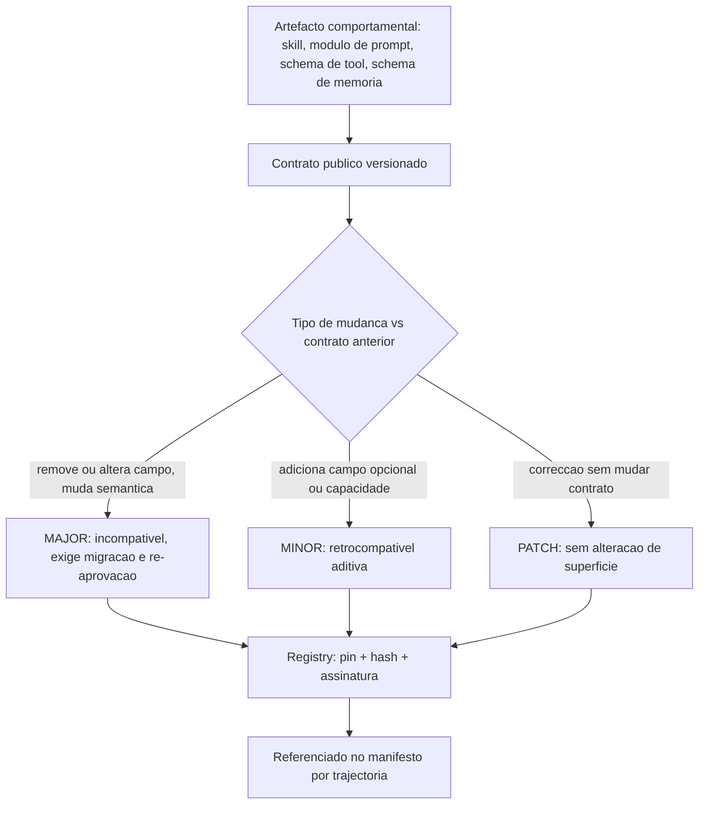
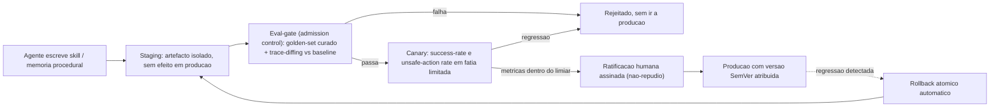
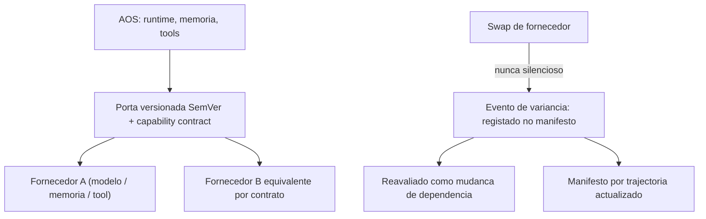

# Convenções de Engenharia e Evolução — AOS

| Campo | Valor |
|---|---|
| Produto | AOS — Agentic OS de Referência |
| Documento | Convenções de Engenharia e Evolução — Manutenção Evolutiva do AOS |
| Versão | 1.0 |
| Data | Julho de 2026 |
| Classificação | Documento de Referência — Aberto |
| Documento-fonte | `_FONTE_agentic-os-ideal.md` |
| Documentos relacionados | `tecnica/05_Skill_Tool_Registry_Supply_Chain.md`, `tecnica/08_Observabilidade_Evals.md`, `specs/EPIC-11_Testes_Qualidade.md` |

---

## 1. Introdução

### 1.1 Propósito

Este documento fixa as **convenções de engenharia e o modelo de evolução** do AOS — Agentic OS de Referência. Estabelece como todo o artefacto comportamental mutável é versionado, como a auto-modificação de um agente é governada antes de tocar em produção, como se garante a reprodutibilidade de cada trajectória, e como os fornecedores de modelo, memória e tools são abstraídos por contratos de capacidade em vez de acoplamento directo. É o documento que operacionaliza o sétimo eixo de excelência do painel — **manutenção evolutiva** — e o princípio de design nº 7 ("evolução com rede") e nº 8 ("coerência por contrato, não por lock-in").

A tese é directa: a auto-melhoria é simultaneamente o motor de valor e a **mudança de maior risco** de um sistema agêntico. *Misevolution* e drift comportamental ocorrem mesmo sem atacante — uma skill auto-escrita ligeiramente pior, uma memória procedural enviesada, um schema de tool subtilmente alterado degradam o sistema de forma silenciosa. A defesa não pode ser post-hoc ("datada e revisável"); tem de ser **admission control**: nada muta o comportamento em produção sem atravessar um gate que o avalie e um humano que o ratifique.

### 1.2 Âmbito

Inclui: (1) versionamento SemVer de skills, módulos de prompt, schemas de tool e schema de memória; (2) o manifesto de dependências imutável por trajectória; (3) o pipeline de governação da auto-modificação (staging → eval-gate → canary → ratificação → produção → rollback); (4) a persistência do system prompt materializado para replay e RCA; (5) a *provider abstraction* com capability contracts; (6) o ciclo de deprecação formal e os padrões de código e ADR. Fora do âmbito: a mecânica interna do eval harness e dos golden-sets (ver `tecnica/08` e `specs/EPIC-11`), e a supply-chain de terceiros do registry (ver `tecnica/05`).

### 1.3 Audiência

Arquitectos de plataforma, engenheiros de governação, engenheiros de runtime e QA/eval responsáveis por promover mudanças comportamentais, e responsáveis de produto que ratificam auto-modificações.

### 1.4 Definições e termos

- **Artefacto comportamental mutável:** qualquer artefacto que, alterado, muda o comportamento observável do agente — skill, módulo de prompt, schema de tool, schema de memória.
- **Auto-modificação:** produção de um artefacto comportamental pelo próprio sistema (skill auto-escrita, memória procedural aprendida), por oposição a alteração feita por um humano.
- **Capability contract:** interface versionada que descreve *o que* um fornecedor oferece (não *quem* é), permitindo substituí-lo sem rearquitectura.
- **Manifesto de dependências:** registo imutável, associado a cada trajectória, das versões exactas de todos os artefactos e do modelo usados nessa execução.
- **Eval-gate:** *admission control* que impede que uma auto-modificação chegue a produção sem passar por avaliação contra golden-set e trace-diffing.

---

## 2. Princípios e decisões aplicáveis (ADRs)

O documento concretiza sobretudo o **ADR-012**, complementado por decisões de observabilidade e governação.

| ADR | Decisão | Aplicação neste documento |
|---|---|---|
| **ADR-012** | **SemVer + eval-gate para auto-modificação** | ADR central. Skills, prompts, schemas de tool e de memória versionados; auto-modificação passa por staging → eval-gate (golden-set) → canary → ratificação assinada → prod, com rollback atómico. Provider abstraction com capability contracts. |
| ADR-010 | Observabilidade OTel GenAI + audit WORM | Base da reprodutibilidade: hash do prompt, model-id/params/seed e versões por trajectória; eval registado como `gen_ai.evaluation.result` ligado ao trace. |
| ADR-009 | Layout de prompt cache-estável | O congelamento do tool set por run e a entrada de novos artefactos só em *runs novos* servem simultaneamente a cache e o pinning evolutivo. |
| ADR-011 | Policy-as-code + GDPR por desenho | A ratificação assinada e o changelog no audit trail seguem a mesma disciplina versionada e assinada da política. |
| ADR-014 | Taxonomia de autonomia L0–L5 | A promoção de uma auto-modificação para maior autonomia é baseada em fiabilidade medida, com demoção automática em anomalia. |

---

## 3. Versionamento de artefactos comportamentais (SemVer)

**Regra fundamental.** Todo o artefacto comportamental mutável tem **SemVer obrigatório** (`MAJOR.MINOR.PATCH`) ancorado a um **contrato público**. A semântica é interpretada em termos comportamentais, não apenas de assinatura:

- **MAJOR** — mudança incompatível do contrato: um schema de tool remove ou altera um campo, uma skill muda a semântica de uma saída de que dependem consumidores, o schema de memória altera a forma de um registo. Exige migração e re-aprovação.
- **MINOR** — extensão retrocompatível: novo campo opcional, nova capacidade aditiva, melhoria de comportamento que não quebra consumidores.
- **PATCH** — correcção sem alteração de contrato: um prompt clarificado, um bug de formatação, um ajuste que não muda a superfície observável.

Cada versão é imutável depois de publicada e é acompanhada de um **contrato** legível por máquina (o schema da tool, a interface da skill, o schema do registo de memória). O Skill/Tool Registry (`tecnica/05`) é o custódio destas versões, com pin + hash + assinatura; este documento define *quando* o número muda e *que gate* atravessa.

O schema de memória segue a mesma disciplina com **migrações expand/contract**: primeiro expande-se o schema para suportar ambas as formas (velha e nova), migram-se os dados, e só depois se contrai removendo a forma antiga — garantindo que nenhuma trajectória em curso lê um registo que já não compreende.

> **Execução (AOS-041).** A disciplina acima é executável no Memory Service (ver `tecnica/04` §8.8). O schema de memória é versionado **SemVer por classe** (`memory/schema`, evolução monótona fail-closed) e o motor `memory/migrations` aplica expand → migrate → contract com cada fase reversível, dual-write/dual-read na fase expand (sem downtime) e rollback de migração falhada sem perda de dados (o estado nunca muta até uma fase concluir). O registo de migrações é durável e **idempotente** (idempotency_key no Event Store, ADR-001; reaplicar = no-op). O gate desta secção materializa-se na porta `migrations.Gate`, **fail-closed**: uma mudança **MAJOR sem aprovação é recusada**; MINOR/PATCH passam sem gate. A porta de eval-gate completa (golden-set, ratificação assinada) é do EPIC-05 — o Memory Service consome só o contrato.

---

## 4. Manifesto de dependências imutável por trajectória

Cada trajectória (run) grava um **manifesto de dependências imutável**: o conjunto exacto de versões que a produziram. Não é um `latest` resolvido em runtime — é um *lockfile* congelado no início do run e persistido no Event Store como parte da trajectória.

O manifesto contém, no mínimo:

- **model-id, params e seed** do modelo usado (via Model Gateway);
- **hash do prompt materializado** e **versão do código de montagem** do prompt;
- **versões SemVer + hash** de cada skill, schema de tool e schema de memória mobilizados;
- **versão da política** (policy-as-code) sob a qual o run correu.

Este manifesto é a base do **replay fiel**: reconstruir uma execução exige reconstituir exactamente o que a alimentou. Sem manifesto, o replay após qualquer evolução de código torna-se infiel e a RCA e o eval-driven development ficam inválidos. Um princípio de congelamento reforça-o: **novos artefactos (tools MCP, skills) só entram em runs novos**, nunca a meio de um run — o que serve simultaneamente a estabilidade de cache (ADR-009) e o pinning evolutivo (ADR-012).

---

## 5. Pipeline de governação da auto-modificação

A auto-modificação é tratada como **classe de mudança distinta**, com o gate mais forte do sistema. O plano-base tinha gates para *acções* mas nenhum para a *auto-modificação*; aqui, uma skill ou memória procedural escrita pelo próprio agente não chega a produção unilateralmente. O pipeline é o seguinte, reutilizando o fluxo canónico da fonte:

**Staging.** O artefacto é materializado num ambiente isolado, sem qualquer efeito sobre produção. Recebe já uma versão candidata.

**Eval-gate como admission control.** É o coração do modelo. O artefacto é avaliado contra um **golden-set curado e estável** — não apenas datasets derivados de falhas passadas, porque estes nunca apanham regressões *novas*. A avaliação combina medição de resultado com **trace-diffing** contra a baseline: comparam-se as trajectórias completas (não só as saídas finais) para detectar deriva de comportamento intermédio. Falha no gate significa rejeição sem entrada em produção. A mecânica do harness está em `tecnica/08` e o backlog em `specs/EPIC-11`.

**Canary.** Passado o gate, o artefacto serve uma fatia limitada de tráfego real, sob observação de **success-rate** e **unsafe-action rate**. Regressão nestas métricas devolve o artefacto ao staging.

**Ratificação humana assinada.** Nenhuma auto-modificação atinge produção plena sem **aprovação assinada** de um aprovador autorizado, com não-repúdio. A assinatura e o changelog são gravados no próprio audit trail (hash-chain + WORM), à semelhança da política versionada (ADR-011).

**Produção com SemVer.** O artefacto ratificado é publicado com a sua versão SemVer definitiva e passa a constar dos manifestos das novas trajectórias.

**Rollback atómico.** Qualquer regressão detectada em produção dispara um **rollback atómico automático** para a versão anterior conhecida-boa. Por ser atómico, não deixa o sistema num estado híbrido; por ser automático, não depende de intervenção manual sob pressão.

A promoção de uma auto-modificação para níveis de maior autonomia segue a taxonomia L0–L5 (ADR-014): baseia-se em **fiabilidade medida** (ex.: erro <2% durante 30 dias) e admite demoção automática em anomalia.

---

## 6. Reprodutibilidade do system prompt

O plano-base tratava o system prompt como "efémero, nunca persistido" — o que destruía a reprodutibilidade. A resolução do AOS é **manter a montagem efémera em runtime mas persistir o que basta para reconstituir**: por turno, grava-se o **hash do prompt materializado**, a **versão do código de montagem**, e o **model-id / params / seed**. Isto preserva a estabilidade de cache (o prefixo imutável é remontado de forma byte-idêntica) e ganha replay fiel em simultâneo.

Os *payloads* completos do prompt vivem em storage externo com IAM próprio (OTel content-capture *mode 3*), separados dos diagnósticos efémeros — coerente com o princípio **contexto ≠ registo**: descartar da *injecção* é legítimo, descartar do *audit trail* nunca é. O eval de cada trajectória é registado como `gen_ai.evaluation.result` ligado ao trace (ver `tecnica/08`).

---

## 7. Provider abstraction e capability contracts

O princípio nº 8 — coerência por contrato, não por lock-in — materializa-se em **portas versionadas (SemVer) e capability contracts** que substituem tanto o vendor único como a explosão de integrações. **Modelo, memória e tools são substituíveis sem rearquitectura.**

A regra crítica: um swap de fornecedor é um **evento de variância, nunca silencioso**. Trocar de modelo, de backend de memória ou de implementação de tool altera o comportamento observável e, por isso, é tratado como uma mudança de dependência — registada no manifesto da trajectória, e sujeita a avaliação como qualquer outra evolução comportamental. Um capability contract descreve *o que* o fornecedor oferece (capacidades, limites, garantias), não a sua identidade; o AOS programa contra o contrato, o Model Gateway (`tecnica/05` para o registry; o gateway em `tecnica/06`) encaminha para a implementação concreta.

Esta abstracção estende à memória a mesma disciplina de contrato de porta do Model Gateway: o schema de memória é versionado e substituível, não amarrado a um backend específico.

---

## 8. Deprecação e padrões de código

**Ciclo de deprecação formal.** Nenhuma versão de artefacto desaparece abruptamente. O ciclo é: **anúncio** (marca-se a versão como *deprecated* no registry, com data-alvo de remoção) → **coexistência** (a versão antiga e a nova servem em paralelo, com aviso registado a cada uso) → **remoção** (após a data-alvo e verificação de que nenhuma trajectória activa depende dela). A **allowlist é fail-closed**: um artefacto não explicitamente permitido não corre — o oposto de blocklists que *falham aberto* a cada artefacto novo.

**Padrões de código.** As convenções transversais aplicam-se a todo o código da plataforma:

- **ADRs em formato MADR** (Markdown Any Decision Records), referenciados por código (ADR-NNN). Toda a decisão arquitectural relevante é registada e citada nos documentos que afecta.
- **Nomes canónicos** dos componentes (RM, RT, ORQ, SCH, PDP, MEM, REG, GW, BRK, ES, SBX, OBS, GOV) usados de forma consistente.
- **Efeitos externos apenas via activities** idempotentes e mediadas pelo Reference Monitor — nenhum caminho de código chama tools directamente (ADR-002).
- **Versionamento e assinatura** de todo o artefacto publicado; changelog no audit trail.

---

## 9. Vista de qualidade

### 9.1 Manutenção evolutiva (dimensão primária)

SemVer obrigatório em todo o artefacto comportamental mutável ancorado a contrato público; manifesto de dependências imutável por trajectória; eval-gate como admission control para auto-modificação; rollback atómico; schema de memória versionado com migrações expand/contract; provider abstraction com capability contracts (swap como evento de variância); ciclo de deprecação formal; allowlist fail-closed. Ver ADR-012.

### 9.2 Observabilidade

A evolução só é governável se for observável. Hash do prompt, model-id/params/seed e versões de artefactos por trajectória tornam o replay fiel e a RCA reais; o eval registado como `gen_ai.evaluation.result` liga cada decisão de promoção a evidência no trace; trace-diffing contra baseline expõe deriva de comportamento intermédio. Ver ADR-010 e `tecnica/08`.

### 9.3 Governação

A ratificação humana assinada (não-repúdio), o changelog no audit trail hash-chain + WORM, e a promoção/demoção por fiabilidade medida (L0–L5) tornam a auto-modificação uma classe de mudança governada, não um efeito colateral. Ver ADR-011, ADR-014.

---

## 10. Riscos e mitigações

| Risco | Impacto | Mitigação |
|---|---|---|
| Misevolution / drift de skill | Regressão comportamental silenciosa (sem atacante) | Eval-gate (golden-set + trace-diffing) + canary + ratificação assinada + rollback atómico (ADR-012) |
| Auto-modificação atinge produção sem avaliação | Comportamento não-verificado em produção | Eval-gate como admission control obrigatório; nenhum caminho unilateral para prod (ADR-012) |
| Replay infiel após evolução de código | RCA e eval inválidos | Manifesto de dependências por trajectória + hash do prompt materializado (ADR-010) |
| Swap de fornecedor silencioso | Variância comportamental invisível | Swap como evento de variância registado no manifesto e reavaliado (ADR-012) |
| Golden-set estagnado | Regressões novas não apanhadas | Golden-set curado e estável a complementar datasets derivados de falhas (`specs/EPIC-11`) |
| Migração de schema de memória quebra runs vivos | Corrupção de leitura de registos | Migrações expand/contract; artefactos novos só em runs novos (ADR-012, ADR-009) |
| Blocklist de artefactos que falha aberto | Artefacto novo corre sem aprovação | Allowlist capability-scoped fail-closed |
| Rollback parcial deixa estado híbrido | Inconsistência comportamental | Rollback atómico automático para versão conhecida-boa (ADR-012) |

---

## 11. Glossário

- **Artefacto comportamental mutável:** skill, módulo de prompt, schema de tool ou schema de memória cuja alteração muda o comportamento observável do agente.
- **SemVer:** versionamento `MAJOR.MINOR.PATCH` interpretado em termos de compatibilidade de contrato comportamental.
- **Manifesto de dependências:** registo imutável por trajectória com model-id/versão, hash do prompt e versões de skills/tools/memória, base do replay fiel.
- **Eval-gate:** admission control que impede que uma auto-modificação chegue a produção sem passar por golden-set e trace-diffing.
- **Trace-diffing:** comparação de trajectórias completas (não só saídas) contra uma baseline, para detectar deriva de comportamento intermédio.
- **Golden-set:** conjunto curado e estável de casos de avaliação, que apanha regressões novas que os datasets de falhas passadas não veem.
- **Canary:** exposição de um artefacto candidato a uma fatia limitada de tráfego real, sob observação de success-rate e unsafe-action rate.
- **Capability contract:** interface versionada que descreve o que um fornecedor oferece, permitindo substituí-lo sem rearquitectura.
- **Migração expand/contract:** evolução de schema em duas fases (expandir para suportar ambas as formas, migrar, depois contrair) que não quebra runs em curso.
- **Misevolution:** deriva comportamental nociva de um agente auto-evolutivo, que ocorre mesmo sem atacante.

---

## 12. Tabela de aprovação

| Papel | Nome | Assinatura | Data |
|---|---|---|---|
| Arquitecto de Plataforma |  |  |  |
| Responsável de Segurança |  |  |  |
| Responsável de Produto |  |  |  |

---

## 13. Controlo de versões

| Versão | Data | Descrição | Autor |
|---|---|---|---|
| 1.0 | Julho 2026 | Emissão inicial | Equipa AOS |
