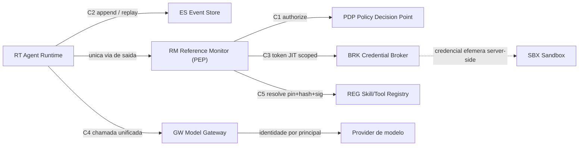

# Contratos de Interface entre Componentes — AOS

| Campo | Valor |
|---|---|
| Produto | AOS — Agentic OS de Referência |
| Documento | Documento Técnico — Contratos de Interface entre Componentes |
| Versão | 1.0 |
| Data | Julho de 2026 |
| Classificação | Documento de Referência — Aberto |
| Documento-fonte | `_FONTE_agentic-os-ideal.md` |
| Documentos relacionados | `tecnica/00_Arquitectura_Solucao.md`, `tecnica/01_Reference_Monitor_Plano_Controlo.md`, `tecnica/07_Seguranca_Isolamento.md`, `specs/01_Engineering_Standards_e_Handoff.md` |

---

## 1. Introdução

### 1.1 Propósito

Este documento fixa os **contratos de porta ao nível de desenho** para as interfaces críticas entre os componentes canónicos do AOS. Cada componente do catálogo expõe *portas* estáveis; um contrato de porta é a especificação do que atravessa essa fronteira — o *schema* do pedido e da resposta, a semântica de erro, a garantia de idempotência e as regras de compatibilidade sob SemVer. O princípio orientador é o oitavo do desenho: **coerência por contrato, não por lock-in** (ADR-012). Modelo, memória e tools são substituíveis sem rearquitectura precisamente porque cada porta é um contrato versionado, não uma dependência implícita.

Este artefacto resolve directamente a constatação de auditoria **COMP-01** (ausência de contratos formais entre componentes) e fornece os artefactos de referência que o **gate 4 — Integração** (contratos entre componentes, ex.: RM↔PDP, RT↔ES) e o **gate 7 — Teste de política / PDP** do *pipeline* CI/CD passam a validar (`specs/01_Engineering_Standards_e_Handoff.md` §4).

### 1.2 Âmbito

Abrange cinco contratos de porta: **RM↔PDP** (autorização), **RT↔ES** (append e read/replay de eventos), **RM↔BRK** (token JIT scoped), **GW↔provider** (chamada unificada com identidade por principal) e **REG** (resolução verificada de skill/tool). Fica fora do âmbito a *implementação* de cada porta — protocolo de transporte concreto, serialização binária, biblioteca de RPC — remetida para os documentos especializados. Os *schemas* aqui apresentados são de desenho: fixam campos, tipos e semântica, não a codificação em *wire*.

### 1.3 Audiência

Arquitectos de plataforma, engenheiros de runtime, segurança e governação, e equipas de QA responsáveis pelos testes de contrato (gate 4) e de política (gate 7).

### 1.4 Definições e termos

- **Contrato de porta:** especificação estável de uma interface entre dois componentes — *request*/*response*, erros, idempotência e versão.
- **Idempotency key:** chave `f(run_id, step_id)` que garante que reexecutar um passo não duplica efeitos externos (ADR-001).
- **Obrigação (*obligation*):** condição que o PEP deve cumprir *após* um `permit` (ex.: redigir PII, aplicar TTL, registar audit).
- **Pin + hash + assinatura:** tripla de verificação de supply-chain que congela a definição de uma tool por versão, digest e assinatura criptográfica (ADR-012).
- **SemVer de porta:** `MAJOR.MINOR.PATCH` ancorado ao contrato público da porta; *MAJOR* quebra compatibilidade, *MINOR* acrescenta de forma retro-compatível, *PATCH* corrige sem alterar contrato.

---

## 2. ADRs aplicáveis

| ADR | Decisão | Relevância neste documento |
|---|---|---|
| **ADR-002** | Reference Monitor mandatório | O RM é o *hub* de três dos cinco contratos (PDP, BRK, execução); nenhum caminho contorna a porta. |
| **ADR-011** | Policy-as-code + GDPR por desenho | Contrato RM↔PDP e a política de referência default-deny; obrigações de minimização e redação. |
| **ADR-006** | Credential Broker com tokens JIT | Contrato RM↔BRK: token scoped → credencial efémera; o agente nunca vê o segredo. |
| **ADR-009** | Layout de prompt cache-estável | Contrato REG: definições congeladas por run; novas tools só em runs novos, o que estabiliza o cache. |
| ADR-001 | Execução durável como primitivo | Contrato RT↔ES: `idempotency_key` por passo e replay resume-from-step. |
| ADR-007 | Event Store replicado | Contrato RT↔ES: append-only, fonte de verdade, transporte push. |
| ADR-005 | Separação control/data-plane + taint | Campo `taint` propagado no contrato RM↔PDP e resultado marcado untrusted. |
| ADR-012 | SemVer + eval-gate | Regras de compatibilidade de porta e verificação de supply-chain no REG. |

---

## 3. Mapa de contratos

O diagrama seguinte situa os cinco contratos sobre o catálogo canónico. O Reference Monitor (RM) é o ponto de encontro: media a decisão (PDP), a credencial (BRK) e a resolução de definição (REG); o Runtime (RT) fala com o Event Store (ES); o Gateway (GW) fala com os providers de modelo.



Convenção transversal a todos os contratos: campos `port_version` (SemVer da porta), `request_id` (correlação/tracing OTel) e, quando aplicável, `idempotency_key`. Todos os contratos são **fail-closed** — na dúvida, timeout ou erro de verificação, a porta nega em vez de permitir.

### 3.1 Implementação por contrato (fonte de verdade do gate 4)

A tabela seguinte é **lida por `scripts/ci/integration.py`** (gate 4 — Integração, AOS-198): fixa qual o pacote Go que implementa cada porta e é o que torna o contrato verificável por máquina em vez de por leitura. Uma linha em falta, ou um caminho que não exista na árvore, **falha o gate** — «não verificável» não conta como verde.

| Contrato | Porta | Pacote Go que a implementa (raiz) |
|---|---|---|
| C1 | RM ↔ PDP (autorização) | `packages/control-plane/pdp` |
| C2 | RT ↔ ES (append e read/replay) | `packages/substrate/eventstore` |
| C3 | RM ↔ BRK (token JIT scoped) | `packages/platform/broker` |
| C4 | GW ↔ Provider (chamada unificada) | `packages/platform/model-gateway` |
| C5 | REG (resolução verificada) | `packages/platform/registry` |

**Estado medido (auditoria multiagente v4, achado DAT-09).** Os dois contratos que o código rastreia explicitamente a este documento — C1 e C2 — estão fiéis: os seis códigos de porta de §4 e §5 existem como constantes em `packages/control-plane/pdp/errors.go` e `packages/substrate/eventstore/errors.go`. Os três **sem** rastreio — C3, C4, C5 — divergiram integralmente: nenhum dos **dez** códigos de §6 (3), §7 (3) e §8 (4) existe no código (o registry, por exemplo, usa um espaço de nomes próprio `E_REG_*`, e o broker usa erros sentinela sem código). Essa divergência está registada, entrada a entrada e com dono, nas dez linhas de `scripts/ci/baseline/contract-codes.txt`; o gate 4 imprime-a em cada execução como **dívida reconhecida** e bloqueia qualquer divergência **nova**. O gate imprime também, por contrato, quantos códigos extraiu deste documento — 3/3/3/3/4 para C1…C5 — para que uma quebra de parse fique visível no log em vez de reduzir o gate em silêncio.

---

## 4. Contrato C1 — RM ↔ PDP (Autorização)

**Descrição.** O Reference Monitor, actuando como PEP, submete ao PDP um pedido de decisão por cada tool call. O PDP avalia a policy-as-code compilada em memória e devolve `permit`, `deny` ou `escalate`, acompanhado de obrigações que o PEP deve impor. O RM não codifica regras de negócio; delega e executa o veredicto (ADR-002, ADR-011).

**Request:**

```json
{
  "port_version": "1.0.0",
  "request_id": "req-7f3a…",
  "principal": {
    "agent_id": "agt-42",
    "delegation_chain": ["human:alice", "agt-root", "agt-42"],
    "authority": ["cap:fs.read", "cap:http.get"]
  },
  "capability": "cap:http.post",
  "resource": { "type": "url", "value": "https://api.example.com/orders", "region": "eu" },
  "context": {
    "taint": "untrusted",
    "budget_tokens_remaining": 18450,
    "reversibility": "irreversible",
    "sensitivity": "confidential"
  }
}
```

**Response:**

```json
{
  "port_version": "1.0.0",
  "request_id": "req-7f3a…",
  "decision": "permit",
  "policy_version": "2.4.1",
  "obligations": [
    { "type": "redact_pii", "fields": ["email", "phone"] },
    { "type": "audit", "level": "full" },
    { "type": "ttl", "seconds": 3600 }
  ],
  "reason": "capability http.post permitida por regra allow_http_post"
}
```

**Semântica de erro.** `deny` com `reason` para negação de política (esperado, não é erro de transporte); `escalate` sinaliza gate humano (ADR-013). Erros de porta: `E_POLICY_UNAVAILABLE` (bundle não carregado — falha fechado, tratado como deny), `E_SIGNATURE_INVALID` (bundle não assinado/adulterado — deny), `E_MALFORMED_REQUEST` (schema inválido). Todos resolvem-se pelo lado seguro: ausência de `permit` explícito é negação.

**Idempotência.** A avaliação é **pura e sem efeitos** — a mesma `(request, policy_version)` produz sempre a mesma decisão, pelo que é seguro repetir. O RM inclui `request_id` para correlação, não para deduplicação de efeitos (não há efeitos a deduplicar).

**Versionamento SemVer.** Acrescentar um campo opcional a `context` ou um novo tipo de obligation reconhecível-e-ignorável é *MINOR*. Tornar um campo obrigatório, remover um campo ou alterar a semântica de `decision` é *MAJOR*. O PDP anuncia `port_version` e deve suportar as *MINOR* anteriores da mesma *MAJOR*.

---

## 5. Contrato C2 — RT ↔ ES (Append e Read/Replay)

**Descrição.** O Agent Runtime grava cada efeito e transição como evento append-only no Event Store, a fonte de verdade, e lê/reproduz trajectórias para *resume-from-step* (ADR-001, ADR-007). O contrato tem duas operações: `append` e `read`.

**Request (append):**

```json
{
  "port_version": "1.0.0",
  "op": "append",
  "stream_id": "run-91c2",
  "idempotency_key": "run-91c2:step-014",
  "event": {
    "type": "tool_result",
    "step_id": "step-014",
    "payload_hash": "sha256:2b9d…",
    "prompt_hash": "sha256:0af1…",
    "taint": "untrusted"
  },
  "expected_seq": 42
}
```

**Response (append) / Request (read/replay):**

```json
{
  "port_version": "1.0.0",
  "op": "read",
  "stream_id": "run-91c2",
  "committed_seq": 43,
  "status": "committed",
  "from_step": "step-000",
  "to_step": "step-014",
  "replay": true
}
```

**Semântica de erro.** `E_SEQ_CONFLICT` quando `expected_seq` não corresponde (escrita concorrente — o chamador relê e reavalia, optimistic concurrency); `E_STREAM_NOT_FOUND` em read de stream inexistente; `E_APPEND_ONLY_VIOLATION` para qualquer tentativa de update/delete (o log é imutável). O ES nunca sobrescreve: correcções são novos eventos.

**Idempotência.** Garantida pela `idempotency_key = f(run_id, step_id)`. Um `append` repetido com a mesma chave devolve `status: "duplicate"` e o `committed_seq` original, sem duplicar o efeito — a pedra angular da execução durável. O read/replay é naturalmente idempotente (leitura pura).

**Versionamento SemVer.** Novos `event.type` são *MINOR* (consumidores desconhecidos ignoram tipos não reconhecidos por *forward-compat*). Remover um campo do envelope de evento ou mudar a semântica de `expected_seq` é *MAJOR*. O `payload` interno de cada evento tem o seu próprio schema versionado, desacoplado da versão da porta.

---

## 6. Contrato C3 — RM ↔ BRK (Token JIT Scoped)

**Descrição.** Após um `permit`, o RM solicita ao Credential Broker uma credencial downstream efémera. O broker troca o token scoped do agente por um segredo do vault, injectado server-side na sandbox; o agente **nunca vê** o segredo (ADR-006).

**Request:**

```json
{
  "port_version": "1.0.0",
  "request_id": "req-7f3a…",
  "principal": { "agent_id": "agt-42", "delegation_chain": ["human:alice", "agt-42"] },
  "target": { "system": "stripe", "scope": ["charges:create"], "region": "eu" },
  "decision_ref": "req-7f3a…",
  "max_ttl_seconds": 300
}
```

**Response:**

```json
{
  "port_version": "1.0.0",
  "request_id": "req-7f3a…",
  "credential_handle": "vault:lease/abcd",
  "injection": "server_side",
  "expires_at": "2026-07-09T12:34:56Z",
  "revocable": true
}
```

**Semântica de erro.** `E_NO_DECISION` se `decision_ref` não corresponder a um `permit` válido (o broker recusa emitir sem autorização prévia — nunca é o primeiro gate); `E_SCOPE_DENIED` se o scope pedido exceder a autoridade delegada; `E_VAULT_UNAVAILABLE` (falha fechado — sem credencial, sem execução). A resposta devolve um *handle*, nunca o segredo em claro.

**Idempotência.** Repetir o pedido com o mesmo `request_id` reutiliza o mesmo *lease* enquanto válido, em vez de emitir credenciais novas — evita proliferação de segredos activos. TTL curto e revogabilidade limitam a janela de exposição.

**Versionamento SemVer.** Acrescentar um sistema-alvo ou um scope é *MINOR*. Encurtar o `max_ttl_seconds` máximo aceite, tornar `region` obrigatório ou mudar o formato de `credential_handle` é *MAJOR*.

---

## 7. Contrato C4 — GW ↔ Provider (Chamada Unificada)

**Descrição.** O Model Gateway oferece uma interface unificada aos LLMs, codificando **identidade por principal**, aplicando allowlist regional e roteamento cost/load-aware. Separa a identidade (token scoped) das chaves de infra do provider (que podem ser *pooled*). O layout do prompt respeita o prefixo cache-estável (ADR-009).

**Request:**

```json
{
  "port_version": "1.0.0",
  "request_id": "req-88e1…",
  "principal": { "agent_id": "agt-42", "region": "eu" },
  "model": "class:reasoning-large",
  "messages_ref": "run-91c2:turn-07",
  "prompt_prefix_hash": "sha256:0af1…",
  "params": { "temperature": 0.2, "max_tokens": 1024, "seed": 7 }
}
```

**Response:**

```json
{
  "port_version": "1.0.0",
  "request_id": "req-88e1…",
  "model_id": "vendor-x/model-2026-05",
  "output_ref": "run-91c2:turn-07:out",
  "usage": { "input_tokens": 3120, "output_tokens": 412, "cache_hit_ratio": 0.86 },
  "cost_usd": 0.0231,
  "finish_reason": "stop"
}
```

**Semântica de erro.** `E_REGION_DENIED` se o modelo pedido não estiver na allowlist regional (soberania — failover proibido de cruzar fronteira, ADR-011); `E_RATE_LIMITED` com `retry_after` quando o admission control global recusa headroom (ADR-008); `E_MODEL_UNAVAILABLE` com sugestão de fallback de classe. O `model_id` concreto é sempre devolvido para replay fiel.

**Idempotência.** As chamadas ao modelo **não são deduplicadas** por natureza (geração é não-determinística), mas a resposta captura `model_id`, `params.seed` e `prompt_prefix_hash` — os inputs não-determinísticos que tornam o replay reproduzível (ADR-010). O chamador pode passar `request_id` para deduplicação a nível de gateway em retries de rede.

**Versionamento SemVer.** Adicionar métricas a `usage` ou novos `finish_reason` é *MINOR*. Renomear `model` para nomes de classe incompatíveis, ou mudar a unidade de `cost_usd`, é *MAJOR*. O mapeamento classe→`model_id` evolui sob a política do gateway, não sob a versão da porta.

---

## 8. Contrato C5 — REG (Resolução Verificada de Skill/Tool)

**Descrição.** O Registry resolve uma referência de skill/tool para uma definição **verificada** por pin + hash + assinatura. A definição aprovada é congelada por hash e revalidada a cada chamada; mudança de schema exige re-aprovação (anti rug-pull, ADR-012). Novas tools só entram em runs novos, servindo a estabilidade de cache (ADR-009).

**Request:**

```json
{
  "port_version": "1.0.0",
  "request_id": "req-5c0d…",
  "ref": { "name": "mcp:invoices.create", "pin": "2.3.0" },
  "run_id": "run-91c2"
}
```

**Response:**

```json
{
  "port_version": "1.0.0",
  "request_id": "req-5c0d…",
  "definition": {
    "name": "mcp:invoices.create",
    "version": "2.3.0",
    "schema_hash": "sha256:d41a…",
    "signature": "sig:ed25519:9b2c…",
    "verified": true
  },
  "input_schema_ref": "schemas/invoices.create@2.3.0"
}
```

**Semântica de erro.** `E_UNPINNED` se a referência não trouxer versão fixa (resolução flutuante proibida); `E_HASH_MISMATCH` se o digest não corresponder ao registado (rug-pull detectado — falha fechado); `E_SIGNATURE_INVALID` se a assinatura não verificar; `E_SCHEMA_CHANGED` exige re-aprovação de schema antes de uso. Uma definição não verificada nunca é devolvida como utilizável.

**Idempotência.** A resolução é pura: o mesmo `(ref, pin)` devolve sempre a mesma definição enquanto a versão existir. Imutabilidade por versão — publicar `2.3.0` de novo com conteúdo diferente é proibido; qualquer alteração é uma nova versão SemVer.

**Versionamento SemVer.** Aqui coexistem dois níveis: a **versão da porta** (`port_version`) e a **versão da definição** resolvida (`definition.version`). Um novo campo opcional na resposta é *MINOR* da porta; exigir `pin` obrigatório (já é) ou mudar o algoritmo de hash anunciado é *MAJOR* da porta. A definição segue o seu próprio SemVer: *MAJOR* = quebra de schema de tool.

---

## 9. Política de referência (PDP)

Esta secção fornece a política de referência **default-deny** que o **gate 7** do CI passa a validar: `allow` explícito por *capability*, `deny` por omissão. Cada regra tem um teste que cobre um caso `allow` e um caso `deny` (`specs/01` §4, DoD §3.5).

```rego
package aos.authz

# Default-deny: sem permit explícito, nega.
default allow := false

# allow_http_post: permite POST HTTP apenas se a capability estiver
# na autoridade do principal, o recurso for da região permitida e
# o conteúdo não estiver tainted como untrusted para acção privilegiada.
allow if {
    input.capability == "cap:http.post"
    "cap:http.post" in input.principal.authority
    input.resource.region == "eu"
    input.context.taint != "untrusted"
}

# allow_fs_read: leitura de ficheiro é sempre permitida se a
# capability constar da autoridade delegada (acção reversível).
allow if {
    input.capability == "cap:fs.read"
    "cap:fs.read" in input.principal.authority
}

# Obrigações impostas em permit de acções sobre dados sensíveis.
obligations contains {"type": "redact_pii", "fields": ["email", "phone"]} if {
    allow
    input.context.sensitivity == "confidential"
}

obligations contains {"type": "audit", "level": "full"} if {
    allow
}
```

**Semântica.** A regra `default allow := false` garante o *fail-closed*: qualquer tool call que não case com um `allow` explícito é negada. As `capabilities` são concedidas por *allowlist* e verificadas contra `input.principal.authority` — a intersecção `utilizador ∩ classe` já resolvida pelo RM. As `obligations` são acumuladas e devolvidas ao PEP para imposição (redação de PII, audit, TTL).

**Equivalente Cedar (nota).** A mesma política exprime-se em Cedar com `forbid` implícito por omissão e `permit` explícito por *action*: `permit(principal, action == Action::"http.post", resource) when { resource.region == "eu" && !context.taint_untrusted } unless { ... };`. Cedar traz tipagem de entidades e análise estática de políticas (validação por *schema*), enquanto Rego oferece expressividade de consulta; ambos satisfazem o contrato C1 e o gate 7, sendo a escolha um detalhe de implantação (ADR-011). O contrato de porta RM↔PDP é agnóstico à linguagem: só fixa `request`/`response`.

---

## 10. Vista de qualidade

### 10.1 Arquitectura

Os contratos de porta são o mecanismo que concretiza a *coerência por contrato* (ADR-012): cada componente é substituível desde que honre a sua porta. A convergência dos contratos C1, C3 e C5 no Reference Monitor reforça a mediação total (ADR-002) — o RM é o único ponto onde decisão, credencial e definição verificada se encontram antes da execução. O contrato C2 (RT↔ES) ancora a execução durável: a `idempotency_key` e o `expected_seq` optimista dão idempotência por passo e concorrência segura sem single-writer (ADR-001, ADR-007). O gate 4 do CI (`scripts/ci/integration.sh`, AOS-198) verifica estes contratos como pré-condição de merge, tornando a regressão de interface tão bloqueante quanto uma falha de build — **com o âmbito exacto declarado em §11**: presença dos códigos de erro de porta documentados, não a forma dos tipos.

### 10.2 Segurança

Cada contrato é *fail-closed* na fronteira: C1 nega sem `permit` explícito, C3 recusa emitir credencial sem `decision_ref` válido, C5 recusa definições não verificadas. O campo `taint` propaga-se de C2 (evento marcado untrusted) para C1 (contexto de decisão), impedindo que conteúdo não-confiável autorize acções privilegiadas (ADR-005, OWASP LLM01). A separação identidade/segredo em C3 e C4 garante que o agente nunca vê o segredo downstream (ADR-006). A política de referência default-deny (§9) e o seu teste no gate 7 asseguram que a governação não regride entre releases — o núcleo da resposta a COMP-01.

---

## 11. Riscos e mitigações

| Risco | Impacto | Mitigação |
|---|---|---|
| Deriva silenciosa de schema entre componentes | Falha em produção não detectada | **Mitigação parcial e declarada.** Gate 4 (`scripts/ci/integration.sh`, AOS-198) verifica, para C1–C5, que cada código de erro `E_*` documentado na «Semântica de erro» existe como literal **fora de comentário** no pacote Go mapeado em §3.1, e bloqueia divergências novas. É fail-closed contra a edição do próprio documento que guarda: um contrato de onde não se extraia nenhum código (parágrafo renomeado ou reformatado) faz o gate **falhar**, e uma entrada de baseline sem par contrato/código correspondente é reportada como **órfã** — sem estas duas regras, renomear um parágrafo desligava a verificação desse contrato em silêncio. **NÃO** verifica a forma dos tipos campo-a-campo, o `port_version`, o caminho de retorno do erro, nem exercita a porta em runtime — ou seja, **não** cobre a maior parte de um schema. Testes de compatibilidade SemVer de porta continuam **por fazer** e sem gate. A divergência histórica de C3/C4/C5 está em `scripts/ci/baseline/contract-codes.txt`, com dono por entrada |
| Política sem cobertura allow/deny | Governação regride entre merges | Gate 7 exige teste PDP cobrindo allow e deny default-deny (§9) |
| Mudança MAJOR de porta não sinalizada | Quebra de consumidores | `port_version` obrigatório; consumidores rejeitam MAJOR não suportada |
| Rug-pull de definição via REG | Roubo de credenciais | C5: hash mismatch e assinatura inválida falham fechado |
| Efeito duplicado no retry | Corrupção do mundo externo | C2: `idempotency_key = f(run_id, step_id)`; resposta `duplicate` |
| Credencial emitida sem autorização | Escalada de privilégio | C3: `E_NO_DECISION` sem `decision_ref` de um permit |

---

## 12. Glossário

- **Contrato de porta:** especificação estável de uma interface (request/response, erros, idempotência, versão) entre dois componentes.
- **Obrigação (*obligation*):** condição imposta pelo PEP após um `permit` (redação, audit, TTL).
- **Idempotency key:** `f(run_id, step_id)`; reexecutar um passo com a mesma chave não duplica efeitos (ADR-001).
- **Optimistic concurrency:** controlo por `expected_seq`; conflito força releitura em vez de bloqueio.
- **Pin + hash + assinatura:** verificação de supply-chain que congela a definição por versão, digest e assinatura (ADR-012).
- **SemVer de porta:** `MAJOR.MINOR.PATCH` do contrato público; MAJOR quebra, MINOR acrescenta compatível, PATCH corrige.
- **Fail-closed:** na dúvida, timeout ou erro de verificação, a porta nega em vez de permitir.
- **Default-deny:** o que não é explicitamente permitido é negado (política de referência §9).

---

## 13. Tabela de aprovação

| Papel | Nome | Assinatura | Data |
|---|---|---|---|
| Arquitecto de Plataforma |  |  |  |
| Responsável de Segurança |  |  |  |
| Responsável de Produto |  |  |  |

---

## 14. Controlo de versões

| Versão | Data | Descrição | Autor |
|---|---|---|---|
| 1.0 | Julho 2026 | Emissão inicial | Equipa AOS |
