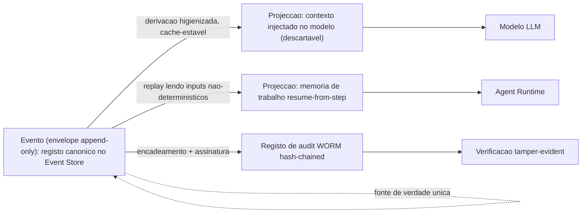
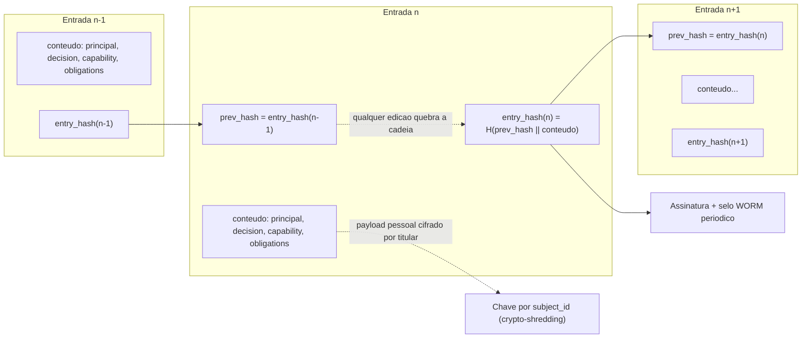

# Modelo de Dados e Eventos — AOS

| Campo | Valor |
|---|---|
| Produto | AOS — Agentic OS de Referência |
| Documento | Técnica — Modelo de Dados e Eventos (schemas canónicos) |
| Versão | 1.1.1 |
| Data | Julho de 2026 |
| Classificação | Documento de Referência — Aberto |
| Documento-fonte | `_FONTE_agentic-os-ideal.md` |
| Documentos relacionados | `tecnica/02_Agent_Runtime_Execucao_Duravel.md`, `tecnica/04_Memoria_Persistencia.md`, `tecnica/08_Observabilidade_Evals.md`, `tecnica/09_Governacao_Conformidade.md`, `specs/EPIC-04_Memoria_Persistencia.md`, `specs/EPIC-08_Observabilidade_Evals.md` |

---

## 1. Introdução

### 1.1 Propósito

Este documento fixa o **modelo de dados e eventos canónico** do AOS — os *schemas* concretos que sustentam três propriedades que, sem uma forma de dados explícita, ficam por especificar e portanto por garantir: o **replay determinístico *resume-from-step*** (ADR-001), o princípio **contexto ≠ registo** (ADR-010) e o **crypto-shredding** do direito ao apagamento (GDPR Art. 17, ADR-011). Onde os documentos `tecnica/02`, `tecnica/04` e `tecnica/08` descrevem o *comportamento* do runtime, da memória e da observabilidade, este documento descreve a *estrutura de dados* que esse comportamento pressupõe — o envelope de evento append-only, o registo de audit tamper-evident, o schema de memória versionado e o manifesto de dependências por trajectória.

A tese é que estas quatro estruturas são *load-bearing*: nenhum dos ADRs acima é implementável sem elas. Um replay só é fiel se cada passo gravar os seus inputs não-determinísticos numa forma canónica; um audit só é tamper-evident se cada registo encadear criptograficamente o anterior; um apagamento só preserva o encadeamento se o payload pessoal estiver cifrado por titular e separado da cadeia. O modelo de dados é, por isso, a materialização dos ADRs.

### 1.2 Âmbito

Abrange quatro schemas e um catálogo: **(1)** o envelope de evento do Event Store (append-only) e **(1b)** o catálogo dos tipos de evento que nele circulam; **(2)** o registo de audit WORM com hash-chain; **(3)** o schema de memória dos quatro tipos, versionado, com proveniência/taint e um exemplo de migração expand/contract; **(4)** o manifesto de dependências por trajectória. Fora de âmbito, remetidos: a semântica do loop e da execução durável (`tecnica/02`), a taxonomia de memória e a materialização de contexto ≠ registo (`tecnica/04`), a captura de spans OTel e o circuit breaker (`tecnica/08`), e o enforcement de política/GDPR/EU AI Act (`tecnica/09`).

### 1.3 Audiência

Engenheiros de Dados/Memória, engenheiros de runtime, engenheiros de observabilidade e de governação, arquitectos de plataforma, e revisores de conformidade que precisem do contrato de dados exacto sobre o qual replay, audit e apagamento assentam.

### 1.4 Definições e termos

- **Envelope de evento:** estrutura canónica **fina** que embrulha cada facto append-only do Event Store — transporta metadados de correlação e de ordem; o `payload` é **inline** e tem schema próprio por tipo de evento (§3.1/§3.2).
- **Projecção:** vista derivada e descartável construída a partir do registo (o contexto injectado no modelo, a memória de trabalho materializada) — nunca a fonte de verdade.
- **Registo:** o log append-only no Event Store; a única fonte de verdade da trajectória.
- **Hash-chain:** encadeamento em que cada registo inclui o hash do anterior, tornando qualquer adulteração detectável.
- **Crypto-shredding:** apagamento do dado pessoal pela destruição da sua chave de cifra, preservando o encadeamento e a cardinalidade do log.
- **Manifesto de dependências:** conjunto de versões pinadas (skills/tools/prompt/modelo) congelado por run, âncora do replay fiel.

### 1.5 Convenção de leitura — `[WIRE]` vs `[DESENHO]`

Este documento contém dois tipos de bloco, e a distinção é **normativa para quem o audita**:

- **`[WIRE]`** — o bloco descreve a forma **realmente serializada** pelo código. A fonte de verdade é o ficheiro Go/JSON citado no próprio bloco; qualquer divergência entre este documento e esse ficheiro é um **defeito deste documento**, não do código.
- **`[DESENHO]`** — o bloco descreve uma forma-alvo **ainda não materializada** (ou materializada noutro nível/tecnologia). Não é contrato, não é implementado como está escrito, e **não deve ser lido como especificação a que o código deva conformidade hoje**. Cada bloco `[DESENHO]` indica onde a propriedade em causa vive de facto no código, quando vive.

A necessidade desta convenção veio de uma auditoria que leu blocos de desenho como contrato e classificou como «campos em falta» aquilo que existia noutro nível de aninhamento (o payload do evento, não o envelope). Marcar cada bloco é mais barato do que repetir essa arbitragem.

---

## 2. ADRs aplicáveis

| ADR | Decisão | Aplicação neste documento |
|---|---|---|
| **ADR-001** | Execução durável como primitivo | O envelope grava `idempotency_key = f(run_id, step_id)` e o `seq` que dá ordem total; os inputs não-determinísticos que tornam o replay *resume-from-step* fiel são gravados no payload de `turn.recorded` e `replay.captured` (§3.5). |
| **ADR-007** | Event Store replicado | O envelope é a unidade de append do log replicado que substitui o SQLite single-writer; `seq` é *gapless* **por stream** e a ordem total é o par `(stream_id, seq)` — «partição» não é termo do código (§3.1). |
| **ADR-010** | Observabilidade OTel GenAI + audit WORM | O registo é a fonte de verdade da qual as projecções derivam; o audit é hash-chained + WORM, distinto dos diagnósticos efémeros. |
| **ADR-011** | Policy-as-code + GDPR por desenho | O payload pessoal é cifrado por titular e referenciado por `PayloadRef` (`ContentHash`/`KeyRef`/`SubjectID`) **no registo de audit**; o crypto-shredding apaga a chave sem quebrar o encadeamento. No Event Store o `payload` é ainda inline e em claro (§3.2). |
| **ADR-012** | SemVer + eval-gate para auto-modificação | O schema de memória é versionado SemVer e evolui por migração expand/contract com rollback atómico. |

Princípios directamente materializados: **contexto ≠ registo** (Princípio 4) e execução durável ao nível do passo (fundação não-negociável).

---

## 3. Envelope de evento do Event Store

Todo o facto que ocorre num run — um turno de modelo, uma mediação de tool call, uma transição de estado, uma escrita de memória — é gravado como um **evento append-only** com o mesmo envelope canónico. O envelope é **fino e uniforme**: transporta apenas os **metadados de correlação e de ordem** (quem, que stream, que passo, que versão de schema) e delega tudo o que é específico do facto ao `payload`, que tem o **seu próprio schema por tipo de evento**.

Esta é a decisão estrutural mais importante da secção, e a que mais frequentemente é mal lida: **o envelope não transporta `prompt_hash`, `model`, `taint` nem manifesto**. Esses metadados existem — mas um nível abaixo, no `payload` do tipo de evento a que pertencem. Um evento de mediação não tem `model.seed`; um evento de turno não tem `taint`. Espalhá-los pelo envelope obrigaria todos os 91 tipos de evento do Event Store (§3.3) a carregar campos vazios e tornaria qualquer novo metadado uma alteração MAJOR da porta C2.

### 3.1 Envelope real `[WIRE]`

**Fonte de verdade:** `packages/substrate/eventstore/event.go` (tipo `Event`) e o schema publicado `packages/substrate/eventstore/schemas/event-envelope-1.0.json` (`$id: https://aos.ref/schemas/event-envelope/1.0.json`, `additionalProperties: false`).

```json
{
  "event_id": "01J9Z8K3QF7B2N4V6XW1RT5MPD",
  "stream_id": "run_7f3a9c2e",
  "seq": 4821,
  "type": "tool.call.mediated",
  "ts": "2026-07-09T10:14:22.481Z",
  "producer": {
    "nhi_id": "nhi:agent:planner@v2.3.1",
    "delegation_chain": [
      { "sub": "human:armando.jimy", "act_as": "nhi:agent:orchestrator@v1.4.0" },
      { "sub": "nhi:agent:orchestrator@v1.4.0", "act_as": "nhi:agent:planner@v2.3.1" }
    ],
    "scope": ["search:web", "fs:read"]
  },
  "payload": { "…": "corpo específico do tipo de evento — schema próprio, ver §3.3" },
  "schema_version": "1.0",
  "run_id": "run_7f3a9c2e",
  "step_id": "step_00017",
  "parent_step_id": "step_00016",
  "idempotency_key": "run_7f3a9c2e:step_00017"
}
```

Campos e o seu papel:

| Campo | Tipo | Papel |
|---|---|---|
| `event_id` | string (ULID, 26 chars) | Identificador globalmente único. **Não é fonte de ordem.** |
| `stream_id` | string | Fronteira de ordenação e de particionamento (na prática, o `run_id`). A **ordem total é por `(stream_id, seq)`** — não por `seq` global. |
| `seq` | integer ≥ 1 | Contador monotónico **gapless por stream**, atribuído pelo store (nunca pelo chamador). Base da ordem total (ADR-001). |
| `type` | string | Nome canónico do facto. Catálogo em §3.3. |
| `ts` | string RFC3339 | Relógio de parede, **observacional**, nunca fonte de ordenação. |
| `producer` | objecto | Identidade NHI emissora, a sua `delegation_chain` *on-behalf-of* (termina num humano responsável) e o `scope` activo (ADR-003). |
| `payload` | qualquer JSON | Corpo do facto, com schema próprio por `type`. **Inline** neste reference impl (ver a nota de cifra abaixo). |
| `schema_version` | string `MAJOR.MINOR` | Versão do schema do envelope/payload no registo (`"1.0"`; expand/contract, ADR-012). |
| `run_id` | string | Correlação da trajectória. Componente da `idempotency_key`. |
| `step_id` | string | Passo determinístico. Componente da `idempotency_key`. |
| `parent_step_id` | string (opcional) | Passo pai — cadeia de causalidade. Único campo omitível. |
| `idempotency_key` | string | `run_id + ":" + step_id`, atribuída pelo store. Garante *zero efeitos duplicados no retry* (ADR-001). |

Um segundo append com a mesma `idempotency_key` devolve `status: "duplicate"` e o `seq` committed original, sem duplicar o efeito (contrato C2, `tecnica/12` §5). Os domínios de deduplicação por passo são namespaceados no `step_id` — turno (`run_id:step_id`), ledger (`run_id:ledger-…`), checkpoint (`run_id:ckpt-…`) e captura de replay (`run_id:cap-…`) — precisamente para não colidirem entre si na dedup global por chave.

### 3.2 Onde vivem os metadados que **não** estão no envelope `[WIRE]`

A versão 1.0 deste documento desenhou um envelope «gordo», com `prompt_hash`, `model`, `taint`, `dependency_manifest_ref` e `payload_ref` ao nível de topo. O código nunca implementou essa forma — mas, com uma única excepção (a cifra por titular do payload, ver a nota no fim desta secção), **também não perdeu a informação**: colocou-a no payload do tipo de evento a que ela pertence. A tabela abaixo é a reconciliação campo a campo, e substitui a lista da v1.0.

| Campo do desenho v1.0 | Estado | Onde vive de facto |
|---|---|---|
| `$schema` | Não é campo do envelope | O envelope carrega `schema_version` (`"1.0"`); o `$id` do schema é `https://aos.ref/schemas/event-envelope/1.0.json`, publicado em `packages/substrate/eventstore/schemas/`. |
| `principal` | **Renomeado** | Chama-se `producer` e tem exactamente a mesma forma (`nhi_id` / `delegation_chain` / `scope`). Divergência de nome, não de conteúdo. |
| `timestamp` | **Renomeado** | Chama-se `ts`. Mesma semântica (observacional). |
| `prompt_hash` | Não no envelope | `manifest.prompt_hash` no payload de `turn.recorded` (`packages/kernel/agent-runtime/turn.go`, tipo `Manifest`). |
| `model` (`model_id`/`params`/`seed`) | Não no envelope | `manifest.model` no payload de `turn.recorded` (mesmo ficheiro, tipo `ModelManifest`). |
| `dependency_manifest_ref` | **Não existe — não há referência externa** | O manifesto é **embebido** no payload de `turn.recorded` (`manifest.tools[]`, `manifest.skills[]`). Ver §6.1, reconciliada em conformidade. |
| `taint` | Não no envelope | Payload de mediação e de captura, e registo de audit selado. Ver §3.4 — a propagação C2→C1 **não fica sem registo**. |
| `payload_ref` (`uri`/`content_hash`/`encryption`) | Não no envelope | O envelope carrega `payload` **inline**. A **referência cifrada por titular** existe num único sítio: `audit.PayloadRef` (`ContentHash`/`KeyRef`/`SubjectID`, `packages/platform/audit/record.go`, selado na serialização canónica) — é a única materialização do crypto-shredding. |
| `payload_ref` — variante da captura de replay | Não no envelope, **e não é cifra** | O modo sensível e o *content-capture* mode-3 (`packages/kernel/agent-runtime/replay/nondeterminism_capture.go`) gravam um `payload_ref` que é um **digest não reversível** (`sha256`), com o conteúdo num `PayloadStore` **externo protegido por IAM próprio** (`ErrPayloadAccessDenied`, `replay/engine.go`). **Não há chave por titular e portanto não há crypto-shredding**: irreversibilidade + controlo de acesso ≠ destruir a chave. O próprio código desmente a equivalência: os comentários de `toolResultCapture` e de `WithSensitiveResults` (`nondeterminism_capture.go`) declaram o output «persistido EM CLARO no evento durável» e o cifrado por titular do Event Store como **dívida por implementar** (o epic a que o código a imputa não é hoje o dono dessa dívida — a pendência autoritativa é a de §8.1). |

Campos **reais** que a v1.0 deste documento omitia e que agora estão em §3.1: `stream_id`, `ts`, `producer`, `payload`, `schema_version`.

> **Nota de fidelidade — cifra por titular no Event Store `[DESENHO]`.** O `payload` do envelope é gravado **em claro** neste reference impl (`json.RawMessage` inline). A cifra por titular ao nível do Event Store é dívida assumida, não implementação: a propriedade de crypto-shredding está materializada **apenas no audit** (§4.1) e o caminho sensível da captura de replay substitui o output por uma referência **não reversível e não cifrada** (digest + store externo sob IAM, sem chave por titular) — mas **um `payload` de evento pode conter dado pessoal em claro**. Quem raciocinar sobre DSAR deve raciocinar sobre o audit e sobre o modo sensível da captura, não sobre um `payload_ref` cifrado do Event Store, que não existe.

Consequência prática do `additionalProperties: false` no schema publicado: um evento que traga qualquer um dos campos do desenho v1.0 ao nível de topo é **rejeitado na validação**. É por isso que a divergência entre este documento e o código era material, e não cosmética.

### 3.3 Catálogo de tipos de evento `[WIRE]`

À data desta revisão o código declara **98 constantes de tipo de facto**, das quais **91 são tipos do envelope do Event Store** (as que chegam a um `eventstore.EventInput.Type`) e **7 são rótulos de `audit.AuditRecord`** — nomes com a mesma forma, mas que nunca passam pelo Event Store. As duas famílias estão separadas nas duas tabelas abaixo; **o catálogo do campo `type` do envelope de §3.1 é a primeira tabela (78)**.

A versão 1.0 deste documento citava quatro nomes «canónicos» a título de exemplo (`turn.recorded`, `tool.call.dispatched`, `tool.result.received`, `state.transition`) — dos quais **três nunca foram emitidos por código nenhum**. A citação era ilustrativa («ex.:»), não um contrato decretado; mas um exemplo errado num documento de referência é lido como catálogo, e foi. Correcção:

| Nome citado na v1.0 | Estado | Nome(s) real(is) |
|---|---|---|
| `turn.recorded` | Emitido | `turn.recorded` (`packages/kernel/agent-runtime/turn.go`) |
| `tool.call.dispatched` | **Nunca emitido** | `tool.call.mediated`, `tool.call.denied`, `tool.call.escalated` (`packages/kernel/reference-monitor/eventsink.go`) — a mediação **é** o facto registado, e o veredicto está no `type`, não só no payload. |
| `tool.result.received` | **Nunca emitido** | Não há evento próprio: o resultado observado de cada tool call vive em `tool_results[]` no payload de `replay.captured` (`packages/kernel/agent-runtime/replay/nondeterminism_capture.go`). |
| `state.transition` | **Nunca emitido** | `run.state.transition` (`packages/kernel/agent-runtime/state/machine.go`). |

#### Porquê catalogar por família, e não por lista de nomes

Uma tabela com os 85 nomes ficaria desactualizada na semana seguinte — foi exactamente assim que se acumulou a deriva que esta revisão corrige. Duas propriedades do código tornam o catálogo por família a forma estável:

1. **Não existe um ficheiro central de constantes, por decisão.** Cada tipo é declarado como constante Go **ao lado do seu emissor** (`packages/…/events.go` ou o ficheiro do componente). Um índice manual seria uma segunda fonte de verdade a divergir da primeira.
2. **O `type` nunca é uma literal no ponto de emissão.** Todos os `eventstore.EventInput{Type: …}` do repositório referenciam uma constante ou uma função de mapeamento (`eventTypeFor(...)`) — o que torna a declaração da constante um índice fiável. **Excepção conhecida:** o ramo `default` de `eventTypeFor` em `packages/kernel/agent-runtime/control/steer_channel.go` **compõe** o nome por concatenação (`"control." + string(kind)`). Hoje é inalcançável (o emissor é privado e só é chamado com os três `SignalKind` constantes), mas é o padrão que um gate futuro tem de rejeitar (§8.1) — um `type` composto não aparece em nenhum índice de constantes.

A **fonte de verdade do catálogo é, portanto, o conjunto das constantes declaradas**; este documento fixa a **taxonomia de prefixos** e o dono de cada família.

**(a) Tipos do envelope do Event Store — 91.** Estes são os valores legítimos do campo `type` de §3.1:

| Prefixo | Nº | Componente dono (onde as constantes vivem) |
|---|---|---|
| `admission.*` | 4 | `packages/control-plane/scheduler/admission.go` |
| `approval.*` | 4 | `packages/integration/approval_store_durable.go` (ciclo de aprovação HITL durável, AOS-021: `granted`/`consumed`/`pending`/`expired`) |
| `backpressure.*` | 5 | `packages/control-plane/scheduler/{queue,policy}.go` |
| `budget.*` | 7 | `packages/control-plane/budget/events.go` (ciclo reserva/commit) e `packages/control-plane/scheduler/breaker.go` (circuit breaker) |
| `control.*` | 3 | `packages/kernel/agent-runtime/control/steer_channel.go` |
| `credential.*` | 2 | `packages/platform/broker/exchange.go` (`issued` da troca emitida; `denied` da negação server-side, AOS-339) |
| `deadlock.*` | 2 | `packages/control-plane/orchestrator/contract/dag_events.go` |
| `degradation.*` | 5 | `packages/control-plane/scheduler/degradation.go` |
| `foureyes.*` | 1 | `packages/control-plane/governance/hitl/challenge_issuer.go` |
| `identity.nhi.*` | 2 | `packages/platform/identity/events.go` |
| `lease.*` | 2 | `packages/kernel/agent-runtime/durable/lease.go` |
| `memory.*` | 8 | `packages/platform/memory/{adapters,semantic,episodic,compression,migrations}` |
| `plan.*` | 14 | `packages/control-plane/orchestrator/plannerevents/events.go` (domínio `aos.planner.v1`, EPIC-19/AOS-235; `plan.branch_decided` em AOS-270/ADR-022 §2.1) |
| `ratification.*` | 1 | `packages/control-plane/governance/hitl/nonce_store.go` |
| `registry.artifact.*` | 2 | `packages/platform/registry/events.go` |
| `replay.captured` | 1 | `packages/kernel/agent-runtime/replay/nondeterminism_capture.go` |
| `routing.*` | 2 | `packages/control-plane/scheduler/routing.go` |
| `run.*` | 3 | `run.created` (`orchestrator/contract/events.go`), `run.state.transition` (`agent-runtime/state/machine.go`), `run.toolset.frozen` (`packages/integration/freeze.go`) |
| `sandbox.*` | 3 | `packages/substrate/sandbox/events.go` |
| `scheduling.*` | 2 | `packages/control-plane/scheduler/priority.go` |
| `spawn.*` | 3 | `packages/control-plane/scheduler/spawn_admission.go` |
| `step.*` | 2 | `packages/kernel/agent-runtime/durable/{checkpoint,step_ledger}.go` |
| `subagent.*` | 6 | `packages/control-plane/orchestrator/delegation.go` |
| `task.*` | 8 | `packages/control-plane/orchestrator/contract/{events,dag_events}.go` |
| `tool.call.*` | 3 | `packages/kernel/reference-monitor/eventsink.go` |
| `turn.recorded` | 1 | `packages/kernel/agent-runtime/turn.go` |
| `worker.step.dispatched` | 1 | `packages/kernel/agent-runtime/worker/worker.go` |

**(b) Rótulos de `audit.AuditRecord` — 7, não são tipos do Event Store.** Têm a mesma forma de nome e aparecem no mesmo comando de verificação, mas são gravados em `Resource.Type` / `Obligation.Type` de um `AuditRecord` (§4) e **nunca** chegam a um `eventstore.EventInput` — os pacotes que os declaram não importam sequer `substrate/eventstore`. Catalogá-los como tipos de evento seria repetir, em sentido inverso, o defeito que esta revisão corrige:

| Rótulo | Nº | Componente dono |
|---|---|---|
| `autonomy.level_changed` | 1 | `packages/control-plane/governance/autonomy/events.go` (`BuildLevelChangedRecord` → `audit.AuditRecord`) |
| `dsar.*` (`received`, `key_destroyed`, `blocked`) | 3 | `packages/control-plane/governance/dsar/flow.go` (selados por `Flow.seal`) |
| `policy.changed` | 1 | `packages/control-plane/pdp/audit_sink.go` (`BuildPolicyChangedRecord`) |
| `retention.*` (`expired`, `config.changed`) | 2 | `packages/platform/audit/retentionevents.go` |

#### Regras do catálogo

- **Nomeação do valor:** minúsculas, segmentos separados por `.`, `snake_case` dentro do segmento; o **primeiro segmento é a família** e identifica o componente dono.
- **Nomeação do identificador Go (requisito do comando de verificação):** o identificador da constante **tem de conter `Event`** (ex.: `EventTypeCaptured`, `eventTypeFrozenToolSet`, `exchangeEventType`). Um nome fora desta convenção — p.ex. `TurnRecordedType` — cumpriria as regras de valor e ficaria **invisível** ao comando abaixo, reabrindo a deriva em silêncio.
- **Forma da declaração (requisito do comando):** a declaração cabe **numa linha** que **termina na string literal**. Um comentário à direita (`= "x.y" // nota`) fá-la desaparecer do resultado; ponha o comentário na linha acima.
- **Declaração:** um tipo novo declara-se como **constante nomeada** junto do emissor. A exportação é a convenção maioritária mas **não é regra**: seis constantes actuais são não exportadas — `eventTypeFrozenToolSet` (`integration/freeze.go`), `exchangeEventType` (`platform/broker/exchange.go`), `eventTypeChallengeIssued` e `eventTypeNonceConsumed` (`governance/hitl/`), `migrationAppliedEventType` e `migrationRevertedEventType` (`memory/migrations/registry.go`). **Emitir uma literal — ou compor o nome por concatenação — em vez de referenciar uma constante quebra a verificabilidade do catálogo** e deve ser rejeitado em revisão.
- **Compatibilidade:** acrescentar um `type` é *MINOR* (os consumidores ignoram tipos desconhecidos, contrato C2/`tecnica/12` §5); **renomear ou remover** um `type` é *MAJOR* — o log é append-only e os eventos antigos não são reescritos.

#### Verificação — gate automático `event-catalog` (AOS-198)

O conjunto de constantes declaradas é reproduzível a partir da árvore, sem lista manual. **O resultado esperado é 98 linhas** — 91 tipos de Event Store + 7 rótulos de audit (a distinção não é feita pelo comando; é feita pela pertença às tabelas (a)/(b) acima).

Variante GNU (Linux/macOS, ou Git Bash no Windows):

```sh
grep -rnE --include='*.go' \
  '^[[:space:]]*(const )?[A-Za-z0-9_]*[Ee]vent[A-Za-z0-9_]*[[:space:]]*(=|[A-Za-z]+ =)[[:space:]]*"[a-z][a-z0-9_]*(\.[a-z0-9_]+)+"[[:space:]]*$' \
  packages/ | grep -v _test.go
```

Variante PowerShell (ambiente de desenvolvimento declarado do repositório):

```powershell
Get-ChildItem -Recurse -Path packages -Filter *.go |
  Where-Object { $_.Name -notlike '*_test.go' } |
  Select-String -Pattern '^\s*(const\s+)?[A-Za-z0-9_]*[Ee]vent[A-Za-z0-9_]*\s*(=|[A-Za-z]+\s*=)\s*"[a-z][a-z0-9_]*(\.[a-z0-9_]+)+"\s*$'
```

Três verificações complementares, **hoje automatizadas** no gate `event-catalog` (`scripts/ci/event-catalog.py`, entregue por **AOS-198**, `7d16c4e`): que nenhum `eventstore.EventInput{Type: "…"}` usa uma literal **nem uma concatenação**; que o primeiro segmento de cada nome consta de uma das duas tabelas acima; e que um nome catalogado em (a) é mesmo apendado ao Event Store (o pacote importa `substrate/eventstore`).

O gate está ligado aos **três** sítios que o tornam bloqueante (`ALL_GATES` de `scripts/ci/run.sh`, job em `.github/workflows/ci.yml`, e `needs:` do agregador `gates`) e é *fail-closed*. As violações reais conhecidas ficam numa baseline **com dono por entrada**, que só encolhe e cuja entrada obsoleta faz o gate **falhar**. Os comandos manuais de §3.3 continuam válidos como verificação local rápida; deixaram de ser a única verificação. **O CA3 de AOS-201 fica assim satisfeito** — ver §8.1.

### 3.4 Onde vive o `taint` — propagação C2 → C1 `[WIRE]`

O contrato C2 (`tecnica/12` §5) ilustra um `append` com `"taint": "untrusted"` dentro do objecto `event`, e §11 daquele documento afirma que o `taint` se propaga de C2 para C1. **O envelope do Event Store não tem campo `taint`**: nem o tipo `Event` (`packages/substrate/eventstore/event.go`) nem o schema publicado `1.0` declaram tal campo — e a única ocorrência do termo em `packages/substrate/eventstore/` é uma nota do `README.md` que o lista como extensão prevista (divergência doc-a-doc registada em §8.1). Isso **não** significa que a propagação fique sem registo: o rótulo é persistido no **payload**, e em três lugares distintos, cada um com uma finalidade diferente.

| Onde | Forma | Fonte de verdade | Para que serve |
|---|---|---|---|
| Payload do evento de mediação (`tool.call.mediated` / `.denied` / `.escalated`) | `context.taint` | `packages/kernel/reference-monitor/eventsink.go` (campo `Taint` de `contextDTO`, preenchido a partir de `rec.Context.Taint`) | Regista **a base factual sobre a qual a política decidiu** — é o lado C1 da propagação, durável e explicável sem estado externo. |
| Payload do evento de captura (`replay.captured`) | `tool_results[].taint` | `packages/kernel/agent-runtime/replay/nondeterminism_capture.go` (campo `Taint` de `toolResultCapture`) | Marca o **resultado observado de cada tool call** como untrusted, para que o replay reconstrua a trajectória com o mesmo estatuto de confiança. |
| Registo de audit hash-chained | `CallContext.Taint` | `packages/platform/audit/record.go` (`CallContext`, selado na serialização canónica de `AuditRecord`) | Torna o rótulo **tamper-evident**: alterá-lo retroactivamente quebra a cadeia (§4). É a única das três formas que é criptograficamente selada. |

O rótulo é adicionalmente exposto como atributo de span OTel no `execute_tool` (`packages/kernel/reference-monitor/monitor.go`), incluindo a marca fixa de que o **resultado** de qualquer tool call é `untrusted` por construção (ADR-005). Observabilidade, não registo: o span é efémero, os três registos acima é que são duráveis.

Consequência de desenho, e é deliberada: **o `taint` qualifica uma decisão ou um resultado, não um evento**. Um `turn.recorded` ou um `lease.claimed` não têm taint que faça sentido registar. Pôr o campo no envelope obrigaria os 78 tipos de §3.3(a) a carregar um campo vazio para servir três.

> **Divergência conhecida `[DESENHO]`.** O exemplo de `append` em `tecnica/12` §5 continua a mostrar `taint` dentro do objecto `event` do pedido da porta. Enquanto não for reconciliado, leia-se esse exemplo como **desenho da porta**, não como forma serializada: no wire, o rótulo entra no `payload`. A mesma reconciliação está pendente na descrição do campo `type` do schema publicado, que ainda exemplifica com os **três** nomes nunca emitidos de §3.3.

### 3.5 Como sustenta o replay e o contexto ≠ registo

O envelope é o **registo**. O que o modelo vê num turno — a **projecção** — é reconstruída *a partir* do registo, nunca gravada como fonte. Esta assimetria é o que torna operacional o princípio contexto ≠ registo: descartar da projecção é higiene legítima; o registo permanece íntegro no Event Store.

O replay é *resume-from-step* porque **cada turno grava dois eventos complementares**, ambos duráveis e ambos com o envelope de §3.1 — não porque o envelope carregue metadados de determinismo:

- **`turn.recorded`** grava o `manifest` do turno no payload: `prompt_hash`, `system_hash`, `assembly_version`, `model` (`model_id`/`params`/`seed`) e as dependências pinadas (`tools[]`, `skills[]`). É a âncora de *como* o passo foi produzido.
- **`replay.captured`** grava os **inputs não-determinísticos observados**: a resposta completa do modelo, as tool calls pretendidas e o resultado de cada uma (com o seu `taint`). É a âncora de *o que* o mundo respondeu.

O runtime lê estes inputs do log em vez de os regenerar, e os mesmos eventos produzem o mesmo estado. A serialização de ambos os payloads é canónica e estável (structs de ordem fixa, sem mapas), para que os mesmos inputs produzam sempre os mesmos bytes.



O envelope é a unidade de append do Event Store replicado (ADR-007): os workers são *stateless*, a ordem é dada por `(stream_id, seq)` — com o `stream_id` a ser, na prática, o `run_id` — e não há estado autoritativo escondido em RAM; tudo é reconstruível por replay.

---

## 4. Registo de audit tamper-evident

O audit trail é **fisicamente separado** dos diagnósticos efémeros (ADR-010) e das próprias entradas do Event Store: onde o Event Store responde *o que aconteceu no run*, o audit responde *quem autorizou e sob que política*. Cada decisão do PDP mediada pelo Reference Monitor produz uma entrada WORM, encadeada por hash à anterior.

> **Nota de fidelidade `[DESENHO]`.** O DDL abaixo é a **forma lógica** do registo, não a implementação: o repositório **não contém nenhum `CREATE TABLE`**. A implementação real é um store de ficheiros append-only em Go — `AuditRecord` em `packages/platform/audit/record.go`, encadeado em `chain.go` e persistido por `filestore.go`. Ler o DDL como schema relacional a implementar seria um erro; as **propriedades** que ele descreve (ordem total, encadeamento, selo, referência de payload por titular) são essas sim honradas pelo código. Divergências de nome/estrutura conhecidas: a ordem é `AuditSeq` **dentro de uma `Partition`** (que pode ser o `run_id`, um tenant ou `"global"`), não um `audit_seq` global; e o registo real sela também `tool_id`, `resource`, o contexto de decisão (`taint`/reversibilidade/sensibilidade) e `request_id`/`parent_step_id`, que o DDL omite.

```sql
-- Registo de audit: WORM (INSERT-only; UPDATE/DELETE negados por política de storage)
CREATE TABLE audit_log (
    audit_seq        BIGINT       NOT NULL,          -- ordem total, monotónica
    audit_id         TEXT         NOT NULL,          -- ULID único
    run_id           TEXT         NOT NULL,
    step_id          TEXT         NOT NULL,
    ts               TIMESTAMPTZ  NOT NULL,          -- observacional
    principal        JSONB        NOT NULL,          -- NHI + cadeia de delegação on-behalf-of
    decision         TEXT         NOT NULL,          -- veredicto do PDP: permit | deny
    capability       TEXT         NOT NULL,          -- ex.: "fs:write:/reports/*"
    policy_version   TEXT         NOT NULL,          -- versão assinada da policy-as-code
    obligations      JSONB        NOT NULL,          -- ex.: {"redact_pii": true, "ttl_days": 30}
    subject_id       TEXT,                           -- titular dos dados pessoais (p/ crypto-shredding)
    payload_ref      TEXT,                           -- blob cifrado por titular (não in-line)
    prev_hash        BYTEA        NOT NULL,          -- hash da entrada anterior
    entry_hash       BYTEA        NOT NULL,          -- hash(prev_hash || conteúdo canónico desta entrada)
    signature        BYTEA        NOT NULL,          -- assinatura do selo periódico
    PRIMARY KEY (audit_seq)
);
```

O `entry_hash` é calculado sobre a serialização canónica da entrada **concatenada com o `prev_hash`**; a `signature` sela periodicamente segmentos da cadeia. Assim, qualquer alteração retroactiva de uma entrada intermédia quebra todos os `entry_hash` subsequentes e invalida o selo — *tamper-evidence* verificável sem confiança no operador do storage (ADR-010).



### 4.1 Reconciliação com o crypto-shredding (GDPR Art. 17)

O conflito aparente — *um log imutável não pode apagar dados pessoais* — resolve-se pela separação entre **a cadeia** e **o payload**. O que é imutável é o **encadeamento** (`prev_hash`/`entry_hash`/`signature`) e os metadados de responsabilização; os dados pessoais residem em `payload_ref`, cifrados com uma **chave por titular** (`subject_id`). Um pedido de apagamento (DSAR) executa-se **destruindo a chave** desse titular no KMS: o ciphertext torna-se irrecuperável, mas o `entry_hash` — calculado sobre o ciphertext e os metadados, não sobre o plaintext — permanece válido, a cadeia continua íntegra e verificável, e a cardinalidade do log não muda (ADR-011). "Imutável" significa, portanto, *tamper-evidence do registo*, não retenção eterna do payload. Redação/tokenização de PII na ingestão e TTL por classe de dado complementam o mecanismo (ver `tecnica/09`).

---

## 5. Schema de memória versionado `[DESENHO]`

Os quatro tipos de memória (`tecnica/04`) partilham um envelope de memória comum, **versionado com SemVer** (ADR-012) e portador de metadados de proveniência/taint. O schema abaixo é o contrato aditivo v1.

> **Nota de fidelidade `[DESENHO]`.** Esta secção **não foi reconciliada campo a campo com o código** — a revisão que produziu §3 cobriu o envelope de evento, o catálogo de tipos e o `taint`, não o envelope de memória. O que é verificável hoje: a estrutura real é `domain.Record` (`ID`/`Class`/`Metadata`/`Body`) com `domain.Metadata` (`AgentID`, `RunID`, `Provenance`, `Source`, `CreatedAt`, `TTLClass`, `SchemaVersion`) em `packages/platform/memory/domain/`; o estatuto de confiança é o campo `Provenance` (`trusted`/`untrusted`), com a quarentena tipada em `packages/platform/memory/provenance/`; as classes de TTL reais são `ephemeral`/`short`/`standard`/`long_lived`/`permanent`. O JSON e o DDL abaixo descrevem, portanto, a **forma-alvo**, não o wire — e, tal como em §4, não existe `CREATE TABLE` no repositório. Trate-os como desenho até que uma revisão futura os reconcilie ou os substitua.

```json
{
  "$schema": "https://aos.ref/schemas/memory-entry/1.0.json",
  "schema_version": "1.0.0",
  "memory_id": "mem_2a4c9f",
  "kind": "semantic",
  "content_ref": "blob://mem/semantic/2a4c9f.enc",
  "embedding": { "model": "embed-3", "dim": 1024, "vector_ref": "vec://2a4c9f" },
  "provenance": {
    "origin": "tool_result",
    "trust": "untrusted",
    "derived_from": ["run_7f3a9c2e:step_00017"],
    "curated_by": null
  },
  "taint": { "level": "quarantined", "propagates": true },
  "consolidation": { "status": "quarantine", "eval_gate": null },
  "ttl": { "class": "derived", "expires_at": "2026-10-09T00:00:00Z" },
  "created_seq": 4821
}
```

```sql
-- Índice de memória (materializado a partir do Event Store; não é fonte de verdade)
CREATE TABLE memory_index (
    memory_id       TEXT        NOT NULL,
    schema_version  TEXT        NOT NULL,   -- SemVer; suporta leitura dual durante migração
    kind            TEXT        NOT NULL,   -- episodic | semantic | procedural | working
    origin          TEXT        NOT NULL,   -- system | user | tool_result | web | mcp_schema
    trust           TEXT        NOT NULL,   -- trusted | untrusted
    taint_level     TEXT        NOT NULL,   -- clean | quarantined
    consolidation   TEXT        NOT NULL,   -- quarantine | curated | promoted
    ttl_expires_at  TIMESTAMPTZ,
    content_ref     TEXT        NOT NULL,
    created_seq     BIGINT      NOT NULL,
    PRIMARY KEY (memory_id, schema_version)
);
```

Os quatro `kind` — `working`, `episodic`, `semantic`, `procedural` — herdam este envelope. A proveniência (`origin`/`trust`/`derived_from`) e o `taint` propagam-se por derivação: memória derivada de fonte untrusted entra em `quarantine` e é dados-nunca-instruções, incapaz de autorizar uma tool call privilegiada. A promoção a `curated`/`promoted` exige consolidação explícita ou eval-gate; a memória procedural, sendo executável, exige o percurso mais estrito (staging → eval-gate → canário → ratificação assinada, ADR-012).

### 5.1 Exemplo de migração expand/contract

A evolução do schema (ex.: passar de `embedding.dim` 1024 para 1536, reindexando) segue **expand/contract** em duas fases não-destrutivas, sem *stop-the-world* e com rollback atómico (ADR-012).

```sql
-- FASE EXPAND (aditiva): adiciona coluna nova, escreve em ambos, lê v1
ALTER TABLE memory_index ADD COLUMN embedding_dim_v2 INT NULL;      -- novo campo, nullable
-- MEM passa a dual-write (v1 e v2); backfill assíncrono do histórico fora da hot path:
UPDATE memory_index SET embedding_dim_v2 = 1536
 WHERE embedding_dim_v2 IS NULL AND kind IN ('semantic','episodic');
-- SWITCH de leitura para v2 só após backfill completo E eval-gate contra golden-set:
--   (regressão detectada em canário => rollback atómico: volta a ler v1, dual-write nunca parou)

-- FASE CONTRACT (após v2 estável): remove o legado v1
ALTER TABLE memory_index DROP COLUMN embedding;                     -- coluna v1 legada
```

Como as duas fases são não-destrutivas até ao *contract*, o rollback é atómico: perante regressão, o MEM volta a ler v1 sem perda de dados porque a escrita dupla nunca parou (ver `tecnica/04`, secção 6).

---

## 6. Manifesto de dependências por trajectória

Para que o replay seja fiel *mesmo após evolução de código*, cada run **congela** as versões de tudo o que influencia o seu comportamento num **manifesto de dependências imutável**. Sem este congelamento, um replay executado semanas depois usaria skills, prompts ou modelos diferentes dos originais e divergiria — invalidando RCA e evals.

### 6.1 Como o congelamento existe de facto `[WIRE]`

A v1.0 desta secção descrevia um manifesto **autónomo, referenciado** por cada evento via `dependency_manifest_ref`. O código materializou a mesma propriedade por **duas** vias, nenhuma delas uma referência externa:

1. **Manifesto embebido no turno.** O tipo `Manifest` (`packages/kernel/agent-runtime/turn.go`) é serializado **dentro do payload de cada `turn.recorded`**, no campo `manifest`. Campos reais: `schema_version`, `prompt_hash`, `system_hash`, `assembly_version`, `model` (`model_id`/`params`/`seed`) e as dependências pinadas `tools[]` / `skills[]`, cada uma com `name`/`version`/`digest`/`mcp_server`. A correlação com a trajectória é feita pelo `run_id`/`step_id` do envelope, não por um `manifest_id`.
2. **Snapshot do tool set congelado.** O congelamento do conjunto de tools do run é ele próprio um evento append-only, `run.toolset.frozen` (`packages/integration/freeze.go`), com payload `{run_id, frozen_at, entries}` — e é relido do log para reconstruir o tool set no replay.

Divergências face ao JSON de desenho abaixo, para que ninguém as volte a classificar como campos em falta: não existe `manifest_id`, não existe `frozen_at_seq` (o congelamento é datado por `frozen_at` no evento próprio), não existe `memory_schema_version` no manifesto, o campo chama-se `assembly_version` e não `assembler_version`, e as dependências pinadas **não transportam `signature`** (só `digest`) — a verificação de assinatura vive no registry/supply-chain (`tecnica/05`), não neste payload.

### 6.2 Forma-alvo do manifesto autónomo `[DESENHO]`

```json
{
  "$schema": "https://aos.ref/schemas/dependency-manifest/1.0.json",
  "manifest_id": "manifest:run_7f3a9c2e",
  "run_id": "run_7f3a9c2e",
  "frozen_at_seq": 1,
  "model": { "model_id": "claude-opus-4-8", "params": { "temperature": 0 }, "seed": 42 },
  "prompt": { "system_hash": "sha256:9b1f...c4a2", "assembler_version": "3.2.0" },
  "skills": [
    { "name": "web_search", "version": "1.7.0", "digest": "sha256:aa01...", "signature": "sig:..." },
    { "name": "report_writer", "version": "2.3.1", "digest": "sha256:bb02...", "signature": "sig:..." }
  ],
  "tools": [
    { "name": "fs.read", "version": "1.0.4", "digest": "sha256:cc03...", "mcp_server": "fs@1.0.4" }
  ],
  "memory_schema_version": "1.0.0"
}
```

A forma-alvo pina, por run: `model_id`/`params`/`seed`; o hash do system prompt e a versão do *assembler*; e as versões + `digest` + assinatura de cada skill, tool e servidor MCP (pin+hash+assinatura, ver `specs/EPIC-05`), além da `memory_schema_version`. Seria congelada no início do run (`frozen_at_seq: 1`) e não mudaria durante ele — coerente com o layout de prompt cache-estável (ADR-009), cujo *tool set* congelado por run é precisamente esta lista.

A invariante que **é** verificável hoje, na forma de §6.1: o `prompt_hash` do `manifest` de cada `turn.recorded` deve resolver contra o `system_hash` do mesmo manifesto; divergência é sinal de replay infiel. O ganho que a forma-alvo ainda traria é a **desduplicação** — hoje o manifesto é repetido no payload de cada turno em vez de referenciado uma vez por run.

---

## 7. Vista de qualidade

**Arquitectura.** Os quatro schemas assentam sobre o Event Store como fonte de verdade única (ADR-007): o envelope é a unidade de append, e memória e audit são projecções/derivações encadeadas dele. A separação registo/projecção, tornada explícita no envelope, é o que permite escalar horizontalmente workers stateless sem escolher entre custo e observabilidade. O manifesto congelado fecha o determinismo: a lógica é reproduzível porque as suas dependências estão pinadas.

**Observabilidade.** O `prompt_hash` e o `model.seed` do `manifest` de `turn.recorded`, mais os inputs observados em `replay.captured`, são a âncora do replay determinístico com alvo de 100% de passos reproduzíveis (ADR-010) — estão no payload desses dois tipos de evento, não no envelope (§3.2). O envelope alimenta a árvore de spans OTel GenAI (`tecnica/08`): `run_id`/`step_id`/`parent_step_id` mapeiam para `trace_id`/`span_id`, e `producer.delegation_chain` reconstrói a cadeia *on-behalf-of* que o regulador exige quando pergunta *quem autorizou* — reconstruível também a partir do payload da mediação, que duplica a cadeia deliberadamente para não depender do envelope.

**Manutenção evolutiva.** O schema de memória é versionado SemVer e evolui por expand/contract com rollback atómico (ADR-012), garantindo que uma mudança de formato nunca provoca indisponibilidade nem perda de dados. O envelope de evento é versionado pelo campo `schema_version` (`"1.0"`, §3.1) — **não** por um `$schema`, que não é campo do envelope (§3.2); o registo de audit não carrega campo de versão próprio, sendo a sua compatibilidade dada pela estabilidade da serialização canónica que o `entry_hash` sela (§4). A leitura dual durante a migração preserva a compatibilidade retroactiva do replay de runs antigos.

---

## 8. Riscos e mitigações

| Risco | Impacto | Mitigação |
|---|---|---|
| Payload pessoal in-line no envelope/audit | DSAR impossível sem quebrar a cadeia | **Mitigado só no audit** (`audit.PayloadRef` = `ContentHash`/`KeyRef`/`SubjectID`; crypto-shredding apaga a chave, ADR-011). **No Event Store o `payload` é inline e em claro — risco ABERTO**, dívida declarada em §3.2 e §8.1. A referência da captura de replay é um digest não reversível sob IAM, **não** cifra por titular. |
| Ordenação por relógio de parede | Divergência de replay, eventos fora de ordem | `(stream_id, seq)` como ordem total, com `seq` gapless por stream; `ts` só observacional (ADR-001/007) |
| Manifesto não congelado por run | Replay infiel após evolução de skills/modelo | `manifest` pinado com `digest` no payload de `turn.recorded`, mais o snapshot `run.toolset.frozen` (§6.1, ADR-010) |
| Adulteração retroactiva do audit | Impossível provar quem autorizou | Hash-chain `prev_hash`/`entry_hash` + assinatura/selo WORM (ADR-010) |
| Migração de schema com downtime | Janela de indisponibilidade, rollback impossível | Expand/contract com dual-write e backfill assíncrono; rollback atómico (ADR-012) |
| Memória untrusted promovida sem curadoria | Memory poisoning persistente (ASI06) | `provenance`/`taint` no envelope; promoção só por consolidação/eval-gate (ADR-005/012) |
| Duplicação de evento no retry | Estado e memória corrompidos | `idempotency_key = f(run_id, step_id)` por evento (ADR-001) |
| Confundir projecção com fonte de verdade | Perda de audit trail por higiene de contexto | Envelope é o registo; projecção é derivada e descartável (ADR-010) |
| **Deriva entre este documento e o código** | Auditoria lê desenho como contrato e reporta falsos defeitos — ou perde defeitos reais | Convenção `[WIRE]`/`[DESENHO]` (§1.5); catálogo por família com fonte de verdade nomeada e comando de verificação (§3.3) |

### 8.1 Pendências conhecidas

Registadas aqui por serem alterações **fora** do âmbito desta revisão documental — nenhuma foi executada:

| Pendência | Onde | Porquê fica |
|---|---|---|
| ~~**Gate de CI do catálogo de tipos — CA3 de AOS-201.**~~ **FECHADO por AOS-198** (`7d16c4e`): o gate `event-catalog` existe, está ligado aos três sítios e é bloqueante. *(descrição original, mantida por rasto:)* Deve verificar: constante nomeada declarada junto do emissor; identificador contém `Event` e declaração numa linha (§3.3, «Regras»); prefixo conhecido; **zero literais e zero concatenações** em `EventInput.Type` (o padrão a rejeitar está em `control/steer_channel.go`, ramo `default` de `eventTypeFor`); e separação das famílias (a)/(b) pela importação de `substrate/eventstore` | `scripts/ci/event-catalog.py` + `.sh`, `run.sh`, `ci.yml` | **Já não é pendência.** À data desta revisão requeria alterar `scripts/**` e a CI, fora do âmbito documental; foi entregue por AOS-198. Os comandos de §3.3 mantêm-se como verificação local rápida. |
| Reconciliar o exemplo de `append` do contrato C2 (mostra `taint` dentro de `event`) | `tecnica/12` §5 e §11 | Documento de outro dono; declarado como divergência conhecida em §3.4. |
| Corrigir os **sete** sítios que ainda citam os três nomes nunca emitidos (`tool.call.dispatched`, `tool.result.received`, `state.transition`) | `packages/substrate/eventstore/schemas/event-envelope-1.0.json` (descrição do campo `type`), `packages/substrate/eventstore/event.go` (comentário de `Type`), `packages/substrate/eventstore/README.md` (exemplo de `Append` **executável e copiável**, e tabela do envelope), `packages/substrate/bus/filter.go` (comentário), `packages/substrate/bus/README.md` (exemplos de `Publish` e de `Filter`) | Alteração de código. O caso mais grave é o exemplo do `README.md` do `eventstore`, que é copiável tal como está. |
| Reconciliar `packages/substrate/eventstore/README.md` (nota «Fidelidade ao envelope canónico»), que ainda anuncia `prompt_hash`, `model{model_id,params,seed}`, `dependency_manifest_ref`, `taint` e `payload_ref` como «extensões previstas, a introduzir por *expand* compatível» | `packages/substrate/eventstore/README.md` | Alteração de código, e **contradiz directamente** a tese de §3.2/§3.4 (envelope fino por decisão; os metadados vivem no payload e no audit, não em campos por materializar). É hoje a fonte sobrevivente mais provável de uma reincidência da leitura que gerou este ticket, por estar no pacote que o implementador lê primeiro. |
| ~~Marcar as *checkboxes* de critérios de aceitação de AOS-201~~ **FEITO** | `specs/EPIC-18_Remediacao_Auditoria_Multiagente_v4.md` | Marcadas centralmente pelo orquestrador: CA1 e CA2 por §3.1–§3.4 (`7b69c27`); **CA3 fechado por AOS-198** (`7d16c4e`), depois de ter estado PARCIAL. |
| Reconciliar §5 (envelope de memória) campo a campo com `packages/platform/memory/domain/` | Esta secção | Fora do âmbito desta revisão; marcada `[DESENHO]` para não ser lida como contrato entretanto. |
| Cifra por titular do `payload` do Event Store | `packages/substrate/eventstore/` | Dívida assumida e declarada em §3.2; hoje o payload é gravado em claro. |

---

## 9. Glossário

- **Envelope de evento:** estrutura canónica append-only **fina** — transporta metadados de correlação e de ordem (`stream_id`/`seq`/`run_id`/`step_id`/`producer`/`schema_version`); o `payload` é **inline** e tem schema próprio por tipo. **Não** transporta metadados de determinismo nem referência de payload (§3.1/§3.2).
- **Projecção:** vista derivada e descartável do registo (contexto injectado, memória de trabalho); nunca fonte de verdade.
- **Registo:** o log append-only no Event Store; única fonte de verdade da trajectória.
- **`seq`:** contador monotónico e *gapless* **por stream**, atribuído pelo store, que começa em 1; a ordem total é o par `(stream_id, seq)`.
- **`stream_id`:** fronteira de ordenação e particionamento do log — na prática, o `run_id`.
- **`[WIRE]` / `[DESENHO]`:** marcas de fidelidade ao código (§1.5); `[WIRE]` descreve a forma serializada, `[DESENHO]` uma forma-alvo não implementada como escrita.
- **Idempotency key:** `f(run_id, step_id)`, limita um efeito a aplicar-se no máximo uma vez.
- **Cadeia de delegação:** sequência *on-behalf-of* de principais que termina num humano responsável.
- **Hash-chain:** encadeamento em que cada entrada inclui o hash da anterior (`prev_hash`/`entry_hash`).
- **WORM:** armazenamento write-once-read-many, base da tamper-evidence do audit.
- **Crypto-shredding:** apagar a chave de cifra por titular para tornar o payload pessoal irrecuperável sem quebrar o encadeamento.
- **Proveniência/taint:** metadados de origem, confiança e cadeia de derivação que propagam o estatuto untrusted.
- **Expand/contract:** migração de schema em duas fases não-destrutivas, com rollback atómico.
- **Manifesto de dependências:** versões de modelo/prompt/skills/tools pinadas e congeladas por run, âncora do replay fiel.

---

## 10. Tabela de aprovação

| Papel | Nome | Assinatura | Data |
|---|---|---|---|
| Arquitecto de Plataforma |  |  |  |
| Responsável de Segurança |  |  |  |
| Responsável de Produto |  |  |  |

---

## 11. Controlo de versões

| Versão | Data | Descrição | Autor |
|---|---|---|---|
| 1.0 | Julho 2026 | Emissão inicial | Equipa AOS |
| 1.1 | Julho 2026 | AOS-201 — reconciliação com o código: envelope real campo a campo e tabela de «onde vive» dos metadados de desenho (§3.1/§3.2); catálogo de tipos de evento por família com fonte de verdade e comando de verificação, corrigindo três nomes nunca emitidos (§3.3); localização do `taint` no payload e no audit selado (§3.4); reconciliação do manifesto embebido em `turn.recorded` (§6.1); convenção `[WIRE]`/`[DESENHO]` (§1.5) e pendências (§8.1) | Equipa AOS |
| 1.1.1 | Julho 2026 | AOS-201 (contra-exame) — separação do catálogo em 78 tipos do Event Store e 7 rótulos de audit (§3.3); regras do catálogo alinhadas com o que o comando de verificação exige, mais a variante PowerShell e a excepção de concatenação (§3.3); `payload_ref` desdobrado (cifra por titular só no audit; a captura de replay usa digest não reversível sob IAM) (§3.2); prova do `taint` corrigida (§3.4); risco de payload pessoal reposto como ABERTO (§8); pendências completadas — sete sítios com nomes obsoletos, `eventstore/README.md` e estado dos CA (§8.1); prosa residual do envelope «gordo» reconciliada (§1.4, §2, §7, §9) | Equipa AOS |
