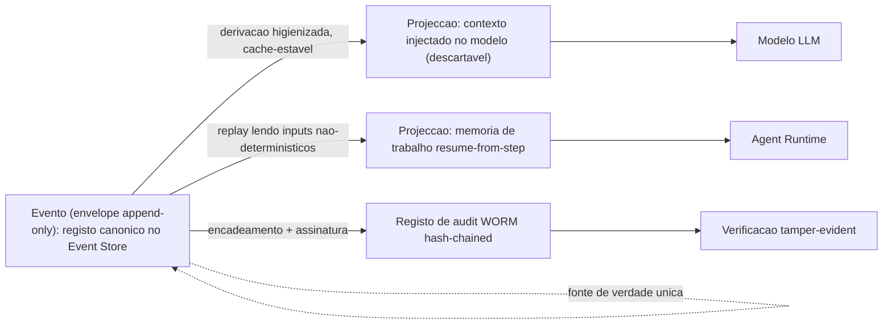
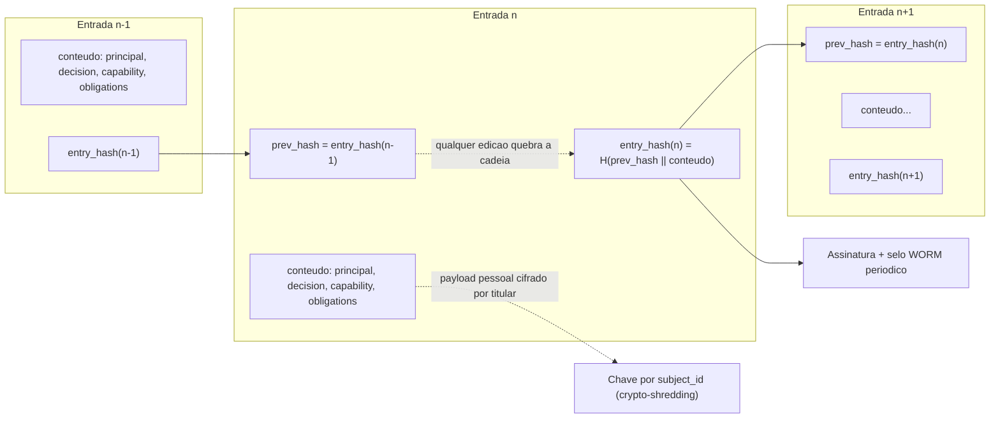

# Modelo de Dados e Eventos — AOS

| Campo | Valor |
|---|---|
| Produto | AOS — Agentic OS de Referência |
| Documento | Técnica — Modelo de Dados e Eventos (schemas canónicos) |
| Versão | 1.0 |
| Data | Julho de 2026 |
| Classificação | Documento de Referência — Aberto |
| Documento-fonte | `_FONTE_agentic-os-ideal.md` |
| Documentos relacionados | `tecnica/02_Agent_Runtime_Execucao_Duravel.md`, `tecnica/04_Memoria_Persistencia.md`, `tecnica/08_Observabilidade_Evals.md`, `tecnica/09_Governacao_Conformidade.md`, `specs/EPIC-04_Memoria_Persistencia.md`, `specs/EPIC-08_Observabilidade_Evals.md` |

---

## 1. Introdução

### 1.1 Propósito

Este documento fixa o **modelo de dados e eventos canónico** do AOS — os *schemas* concretos que sustentam três propriedades que, sem uma forma de dados explícita, ficam por especificar e portanto por garantir: o **replay determinístico *resume-from-step*** (ADR-001), o princípio **contexto ≠ registo** (ADR-010) e o **crypto-shredding** do direito ao apagamento (GDPR Art. 17, ADR-011). Onde os documentos `tecnica/02`, `tecnica/04` e `tecnica/08` descrevem o *comportamento* do runtime, da memória e da observabilidade, este documento descreve a *estrutura de dados* que esse comportamento pressupõe — o envelope de evento append-only, o registo de audit tamper-evident, o schema de memória versionado e o manifesto de dependências por trajectória.

A tese é que estas quatro estruturas são *load-bearing*: nenhum dos ADRs acima é implementável sem elas. Um replay só é fiel se cada passo gravar os seus inputs não-determinísticos numa forma canónica; um audit só é tamper-evident se cada registo encadear criptograficamente o anterior; um apagamento só preserva o encadeamento se o payload pessoal estiver cifrado por titular e separado da cadeia. O modelo de dados é, por isso, a materialização dos ADRs.

### 1.2 Âmbito

Abrange quatro schemas: **(1)** o envelope de evento do Event Store (append-only); **(2)** o registo de audit WORM com hash-chain; **(3)** o schema de memória dos quatro tipos, versionado, com proveniência/taint e um exemplo de migração expand/contract; **(4)** o manifesto de dependências por trajectória. Fora de âmbito, remetidos: a semântica do loop e da execução durável (`tecnica/02`), a taxonomia de memória e a materialização de contexto ≠ registo (`tecnica/04`), a captura de spans OTel e o circuit breaker (`tecnica/08`), e o enforcement de política/GDPR/EU AI Act (`tecnica/09`).

### 1.3 Audiência

Engenheiros de Dados/Memória, engenheiros de runtime, engenheiros de observabilidade e de governação, arquitectos de plataforma, e revisores de conformidade que precisem do contrato de dados exacto sobre o qual replay, audit e apagamento assentam.

### 1.4 Definições e termos

- **Envelope de evento:** estrutura canónica que embrulha cada facto append-only do Event Store, separando metadados imutáveis de referências a payload.
- **Projecção:** vista derivada e descartável construída a partir do registo (o contexto injectado no modelo, a memória de trabalho materializada) — nunca a fonte de verdade.
- **Registo:** o log append-only no Event Store; a única fonte de verdade da trajectória.
- **Hash-chain:** encadeamento em que cada registo inclui o hash do anterior, tornando qualquer adulteração detectável.
- **Crypto-shredding:** apagamento do dado pessoal pela destruição da sua chave de cifra, preservando o encadeamento e a cardinalidade do log.
- **Manifesto de dependências:** conjunto de versões pinadas (skills/tools/prompt/modelo) congelado por run, âncora do replay fiel.

---

## 2. ADRs aplicáveis

| ADR | Decisão | Aplicação neste documento |
|---|---|---|
| **ADR-001** | Execução durável como primitivo | O envelope de evento grava `idempotency_key = f(run_id, step_id)`, `seq` e os inputs não-determinísticos que tornam o replay *resume-from-step* fiel. |
| **ADR-007** | Event Store replicado | O envelope é a unidade de append do log replicado que substitui o SQLite single-writer; `seq` dá ordem total por partição. |
| **ADR-010** | Observabilidade OTel GenAI + audit WORM | O registo é a fonte de verdade da qual as projecções derivam; o audit é hash-chained + WORM, distinto dos diagnósticos efémeros. |
| **ADR-011** | Policy-as-code + GDPR por desenho | O payload pessoal é cifrado por titular e referenciado por `payload_ref`; o crypto-shredding apaga a chave sem quebrar o encadeamento. |
| **ADR-012** | SemVer + eval-gate para auto-modificação | O schema de memória é versionado SemVer e evolui por migração expand/contract com rollback atómico. |

Princípios directamente materializados: **contexto ≠ registo** (Princípio 4) e execução durável ao nível do passo (fundação não-negociável).

---

## 3. Envelope de evento do Event Store

Todo o facto que ocorre num run — um turno de modelo, uma tool call emitida, um resultado recebido, uma transição de estado — é gravado como um **evento append-only** com o mesmo envelope canónico. O envelope separa três zonas: os **metadados de correlação** (quem, onde, em que passo), os **metadados de determinismo** (o que é preciso para reproduzir o passo) e a **referência de payload** (o conteúdo volumoso ou pessoal, nunca in-line no envelope).

```json
{
  "$schema": "https://aos.ref/schemas/event-envelope/1.0.json",
  "event_id": "01J9Z8K3QF7B2N4V6XW1RT5MPD",
  "seq": 4821,
  "run_id": "run_7f3a9c2e",
  "step_id": "step_00017",
  "parent_step_id": "step_00016",
  "type": "tool.call.dispatched",
  "idempotency_key": "run_7f3a9c2e:step_00017",
  "principal": {
    "nhi_id": "nhi:agent:planner@v2.3.1",
    "delegation_chain": [
      { "sub": "human:armando.jimy", "act_as": "nhi:agent:orchestrator@v1.4.0" },
      { "sub": "nhi:agent:orchestrator@v1.4.0", "act_as": "nhi:agent:planner@v2.3.1" }
    ],
    "scope": ["search:web", "fs:read"]
  },
  "prompt_hash": "sha256:9b1f...c4a2",
  "model": { "model_id": "claude-opus-4-8", "params": { "temperature": 0, "top_p": 1 }, "seed": 42 },
  "dependency_manifest_ref": "manifest:run_7f3a9c2e",
  "taint": { "level": "untrusted", "sources": ["web"], "derived_from": ["step_00016"] },
  "payload_ref": {
    "uri": "blob://events/run_7f3a9c2e/step_00017.enc",
    "content_hash": "sha256:1d77...af90",
    "encryption": { "scheme": "AES-256-GCM", "key_ref": "kms:subject/armando.jimy", "subject_id": "subject_armando" }
  },
  "timestamp": "2026-07-09T10:14:22.481Z"
}
```

Campos e o seu papel: `event_id` (ULID globalmente único), `seq` (contador monotónico por partição que dá **ordem total** e é a base do `step_id` determinístico — não um relógio nem um UUID aleatório, ADR-001); `run_id`/`step_id`/`parent_step_id` (correlação da trajectória e da cadeia de causalidade); `type` (nome canónico do facto, ex.: `turn.recorded`, `tool.call.dispatched`, `tool.result.received`, `state.transition`); `idempotency_key = f(run_id, step_id)` (garante *zero efeitos duplicados no retry*); `principal` (a **cadeia de delegação** *on-behalf-of* que termina num humano responsável); `prompt_hash` e `model` (`model_id`/`params`/`seed` — os inputs não-determinísticos do turno); `dependency_manifest_ref` (aponta o manifesto pinado do run, secção 6); `taint` (proveniência e nível de confiança, ADR-005); `payload_ref` (URI + `content_hash` + envelope de cifra por titular); `timestamp` (relógio de parede, **observacional**, nunca fonte de ordenação).

### 3.1 Como sustenta o replay e o contexto ≠ registo

O envelope é o **registo**. O que o modelo vê num turno — a **projecção** — é reconstruída *a partir* do registo, nunca gravada como fonte. Esta assimetria é o que torna operacional o princípio contexto ≠ registo: descartar da projecção é higiene legítima; o registo permanece íntegro no Event Store. E porque cada passo grava `prompt_hash`, `model.seed` e o `dependency_manifest_ref`, o replay é *resume-from-step*: o runtime lê os inputs não-determinísticos do log em vez de os regenerar, e os mesmos eventos produzem o mesmo estado.



O envelope é a unidade de append do Event Store replicado (ADR-007): os workers são *stateless*, a ordem é dada por `seq` dentro da partição do `run_id`, e não há estado autoritativo escondido em RAM — tudo é reconstruível por replay.

---

## 4. Registo de audit tamper-evident

O audit trail é **fisicamente separado** dos diagnósticos efémeros (ADR-010) e das próprias entradas do Event Store: onde o Event Store responde *o que aconteceu no run*, o audit responde *quem autorizou e sob que política*. Cada decisão do PDP mediada pelo Reference Monitor produz uma entrada WORM, encadeada por hash à anterior.

```sql
-- Registo de audit: WORM (INSERT-only; UPDATE/DELETE negados por política de storage)
CREATE TABLE audit_log (
    audit_seq        BIGINT       NOT NULL,          -- ordem total, monotónica
    audit_id         TEXT         NOT NULL,          -- ULID único
    run_id           TEXT         NOT NULL,
    step_id          TEXT         NOT NULL,
    ts               TIMESTAMPTZ  NOT NULL,          -- observacional
    principal        JSONB        NOT NULL,          -- NHI + cadeia de delegação on-behalf-of
    decision         TEXT         NOT NULL,          -- veredicto do PDP: permit | deny
    capability       TEXT         NOT NULL,          -- ex.: "fs:write:/reports/*"
    policy_version   TEXT         NOT NULL,          -- versão assinada da policy-as-code
    obligations      JSONB        NOT NULL,          -- ex.: {"redact_pii": true, "ttl_days": 30}
    subject_id       TEXT,                           -- titular dos dados pessoais (p/ crypto-shredding)
    payload_ref      TEXT,                           -- blob cifrado por titular (não in-line)
    prev_hash        BYTEA        NOT NULL,          -- hash da entrada anterior
    entry_hash       BYTEA        NOT NULL,          -- hash(prev_hash || conteúdo canónico desta entrada)
    signature        BYTEA        NOT NULL,          -- assinatura do selo periódico
    PRIMARY KEY (audit_seq)
);
```

O `entry_hash` é calculado sobre a serialização canónica da entrada **concatenada com o `prev_hash`**; a `signature` sela periodicamente segmentos da cadeia. Assim, qualquer alteração retroactiva de uma entrada intermédia quebra todos os `entry_hash` subsequentes e invalida o selo — *tamper-evidence* verificável sem confiança no operador do storage (ADR-010).



### 4.1 Reconciliação com o crypto-shredding (GDPR Art. 17)

O conflito aparente — *um log imutável não pode apagar dados pessoais* — resolve-se pela separação entre **a cadeia** e **o payload**. O que é imutável é o **encadeamento** (`prev_hash`/`entry_hash`/`signature`) e os metadados de responsabilização; os dados pessoais residem em `payload_ref`, cifrados com uma **chave por titular** (`subject_id`). Um pedido de apagamento (DSAR) executa-se **destruindo a chave** desse titular no KMS: o ciphertext torna-se irrecuperável, mas o `entry_hash` — calculado sobre o ciphertext e os metadados, não sobre o plaintext — permanece válido, a cadeia continua íntegra e verificável, e a cardinalidade do log não muda (ADR-011). "Imutável" significa, portanto, *tamper-evidence do registo*, não retenção eterna do payload. Redação/tokenização de PII na ingestão e TTL por classe de dado complementam o mecanismo (ver `tecnica/09`).

---

## 5. Schema de memória versionado

Os quatro tipos de memória (`tecnica/04`) partilham um envelope de memória comum, **versionado com SemVer** (ADR-012) e portador de metadados de proveniência/taint. O schema abaixo é o contrato aditivo v1.

```json
{
  "$schema": "https://aos.ref/schemas/memory-entry/1.0.json",
  "schema_version": "1.0.0",
  "memory_id": "mem_2a4c9f",
  "kind": "semantic",
  "content_ref": "blob://mem/semantic/2a4c9f.enc",
  "embedding": { "model": "embed-3", "dim": 1024, "vector_ref": "vec://2a4c9f" },
  "provenance": {
    "origin": "tool_result",
    "trust": "untrusted",
    "derived_from": ["run_7f3a9c2e:step_00017"],
    "curated_by": null
  },
  "taint": { "level": "quarantined", "propagates": true },
  "consolidation": { "status": "quarantine", "eval_gate": null },
  "ttl": { "class": "derived", "expires_at": "2026-10-09T00:00:00Z" },
  "created_seq": 4821
}
```

```sql
-- Índice de memória (materializado a partir do Event Store; não é fonte de verdade)
CREATE TABLE memory_index (
    memory_id       TEXT        NOT NULL,
    schema_version  TEXT        NOT NULL,   -- SemVer; suporta leitura dual durante migração
    kind            TEXT        NOT NULL,   -- episodic | semantic | procedural | working
    origin          TEXT        NOT NULL,   -- system | user | tool_result | web | mcp_schema
    trust           TEXT        NOT NULL,   -- trusted | untrusted
    taint_level     TEXT        NOT NULL,   -- clean | quarantined
    consolidation   TEXT        NOT NULL,   -- quarantine | curated | promoted
    ttl_expires_at  TIMESTAMPTZ,
    content_ref     TEXT        NOT NULL,
    created_seq     BIGINT      NOT NULL,
    PRIMARY KEY (memory_id, schema_version)
);
```

Os quatro `kind` — `working`, `episodic`, `semantic`, `procedural` — herdam este envelope. A proveniência (`origin`/`trust`/`derived_from`) e o `taint` propagam-se por derivação: memória derivada de fonte untrusted entra em `quarantine` e é dados-nunca-instruções, incapaz de autorizar uma tool call privilegiada. A promoção a `curated`/`promoted` exige consolidação explícita ou eval-gate; a memória procedural, sendo executável, exige o percurso mais estrito (staging → eval-gate → canário → ratificação assinada, ADR-012).

### 5.1 Exemplo de migração expand/contract

A evolução do schema (ex.: passar de `embedding.dim` 1024 para 1536, reindexando) segue **expand/contract** em duas fases não-destrutivas, sem *stop-the-world* e com rollback atómico (ADR-012).

```sql
-- FASE EXPAND (aditiva): adiciona coluna nova, escreve em ambos, lê v1
ALTER TABLE memory_index ADD COLUMN embedding_dim_v2 INT NULL;      -- novo campo, nullable
-- MEM passa a dual-write (v1 e v2); backfill assíncrono do histórico fora da hot path:
UPDATE memory_index SET embedding_dim_v2 = 1536
 WHERE embedding_dim_v2 IS NULL AND kind IN ('semantic','episodic');
-- SWITCH de leitura para v2 só após backfill completo E eval-gate contra golden-set:
--   (regressão detectada em canário => rollback atómico: volta a ler v1, dual-write nunca parou)

-- FASE CONTRACT (após v2 estável): remove o legado v1
ALTER TABLE memory_index DROP COLUMN embedding;                     -- coluna v1 legada
```

Como as duas fases são não-destrutivas até ao *contract*, o rollback é atómico: perante regressão, o MEM volta a ler v1 sem perda de dados porque a escrita dupla nunca parou (ver `tecnica/04`, secção 6).

---

## 6. Manifesto de dependências por trajectória

Para que o replay seja fiel *mesmo após evolução de código*, cada run **congela** as versões de tudo o que influencia o seu comportamento num **manifesto de dependências imutável**, referenciado por cada evento via `dependency_manifest_ref`. Sem este congelamento, um replay executado semanas depois usaria skills, prompts ou modelos diferentes dos originais e divergiria — invalidando RCA e evals.

```json
{
  "$schema": "https://aos.ref/schemas/dependency-manifest/1.0.json",
  "manifest_id": "manifest:run_7f3a9c2e",
  "run_id": "run_7f3a9c2e",
  "frozen_at_seq": 1,
  "model": { "model_id": "claude-opus-4-8", "params": { "temperature": 0 }, "seed": 42 },
  "prompt": { "system_hash": "sha256:9b1f...c4a2", "assembler_version": "3.2.0" },
  "skills": [
    { "name": "web_search", "version": "1.7.0", "digest": "sha256:aa01...", "signature": "sig:..." },
    { "name": "report_writer", "version": "2.3.1", "digest": "sha256:bb02...", "signature": "sig:..." }
  ],
  "tools": [
    { "name": "fs.read", "version": "1.0.4", "digest": "sha256:cc03...", "mcp_server": "fs@1.0.4" }
  ],
  "memory_schema_version": "1.0.0"
}
```

O manifesto pina, por run: `model_id`/`params`/`seed`; o hash do system prompt e a versão do *assembler*; e as versões + `digest` + assinatura de cada skill, tool e servidor MCP (pin+hash+assinatura, ver `specs/EPIC-05`), além da `memory_schema_version`. É congelado no início do run (`frozen_at_seq: 1`) e nunca muda durante ele — coerente com o layout de prompt cache-estável (ADR-009), cujo *tool set* congelado por run é precisamente esta lista. O `prompt_hash` de cada evento (secção 3) deve resolver contra o `system_hash` do manifesto; divergência é sinal de replay infiel.

---

## 7. Vista de qualidade

**Arquitectura.** Os quatro schemas assentam sobre o Event Store como fonte de verdade única (ADR-007): o envelope é a unidade de append, e memória e audit são projecções/derivações encadeadas dele. A separação registo/projecção, tornada explícita no envelope, é o que permite escalar horizontalmente workers stateless sem escolher entre custo e observabilidade. O manifesto congelado fecha o determinismo: a lógica é reproduzível porque as suas dependências estão pinadas.

**Observabilidade.** O `prompt_hash`, o `model.seed` e o `dependency_manifest_ref` por evento são a âncora do replay determinístico com alvo de 100% de passos reproduzíveis (ADR-010). O envelope alimenta directamente a árvore de spans OTel GenAI (`tecnica/08`): `run_id`/`step_id`/`parent_step_id` mapeiam para `trace_id`/`span_id`, e `principal.delegation_chain` reconstrói a cadeia *on-behalf-of* que o regulador exige quando pergunta *quem autorizou*.

**Manutenção evolutiva.** O schema de memória é versionado SemVer e evolui por expand/contract com rollback atómico (ADR-012), garantindo que uma mudança de formato nunca provoca indisponibilidade nem perda de dados. Os schemas de evento e de audit são igualmente versionados (`$schema`), e a leitura dual durante a migração preserva a compatibilidade retroactiva do replay de runs antigos.

---

## 8. Riscos e mitigações

| Risco | Impacto | Mitigação |
|---|---|---|
| Payload pessoal in-line no envelope/audit | DSAR impossível sem quebrar a cadeia | Payload cifrado por titular em `payload_ref`; crypto-shredding apaga a chave (ADR-011) |
| Ordenação por relógio de parede | Divergência de replay, eventos fora de ordem | `seq` monotónico por partição como ordem total; `timestamp` só observacional (ADR-001/007) |
| Manifesto não congelado por run | Replay infiel após evolução de skills/modelo | `dependency_manifest` pinado com digest+assinatura, `frozen_at_seq` (ADR-010) |
| Adulteração retroactiva do audit | Impossível provar quem autorizou | Hash-chain `prev_hash`/`entry_hash` + assinatura/selo WORM (ADR-010) |
| Migração de schema com downtime | Janela de indisponibilidade, rollback impossível | Expand/contract com dual-write e backfill assíncrono; rollback atómico (ADR-012) |
| Memória untrusted promovida sem curadoria | Memory poisoning persistente (ASI06) | `provenance`/`taint` no envelope; promoção só por consolidação/eval-gate (ADR-005/012) |
| Duplicação de evento no retry | Estado e memória corrompidos | `idempotency_key = f(run_id, step_id)` por evento (ADR-001) |
| Confundir projecção com fonte de verdade | Perda de audit trail por higiene de contexto | Envelope é o registo; projecção é derivada e descartável (ADR-010) |

---

## 9. Glossário

- **Envelope de evento:** estrutura canónica append-only que separa metadados de correlação, metadados de determinismo e referência de payload.
- **Projecção:** vista derivada e descartável do registo (contexto injectado, memória de trabalho); nunca fonte de verdade.
- **Registo:** o log append-only no Event Store; única fonte de verdade da trajectória.
- **`seq`:** contador monotónico por partição que dá ordem total e ancora o `step_id` determinístico.
- **Idempotency key:** `f(run_id, step_id)`, limita um efeito a aplicar-se no máximo uma vez.
- **Cadeia de delegação:** sequência *on-behalf-of* de principais que termina num humano responsável.
- **Hash-chain:** encadeamento em que cada entrada inclui o hash da anterior (`prev_hash`/`entry_hash`).
- **WORM:** armazenamento write-once-read-many, base da tamper-evidence do audit.
- **Crypto-shredding:** apagar a chave de cifra por titular para tornar o payload pessoal irrecuperável sem quebrar o encadeamento.
- **Proveniência/taint:** metadados de origem, confiança e cadeia de derivação que propagam o estatuto untrusted.
- **Expand/contract:** migração de schema em duas fases não-destrutivas, com rollback atómico.
- **Manifesto de dependências:** versões de modelo/prompt/skills/tools pinadas e congeladas por run, âncora do replay fiel.

---

## 10. Tabela de aprovação

| Papel | Nome | Assinatura | Data |
|---|---|---|---|
| Arquitecto de Plataforma |  |  |  |
| Responsável de Segurança |  |  |  |
| Responsável de Produto |  |  |  |

---

## 11. Controlo de versões

| Versão | Data | Descrição | Autor |
|---|---|---|---|
| 1.0 | Julho 2026 | Emissão inicial | Equipa AOS |
