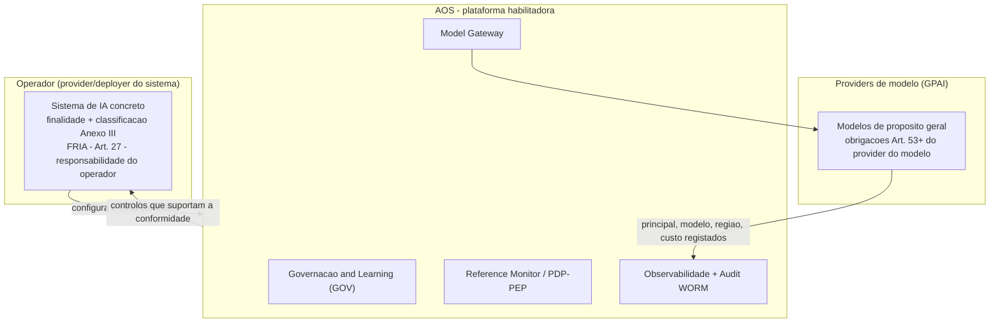

# Matriz de Conformidade — EU AI Act e GDPR — AOS

| Campo | Valor |
|---|---|
| Produto | AOS — Agentic OS de Referência |
| Documento | Técnica — Matriz de Conformidade (EU AI Act e GDPR) |
| Versão | 1.1 |
| Data | Julho de 2026 |
| Classificação | Documento de Referência — Aberto |
| Documento-fonte | `_FONTE_agentic-os-ideal.md` |
| Documentos relacionados | `tecnica/09_Governacao_Conformidade.md`, `tecnica/08_Observabilidade_Evals.md`, `tecnica/07_Seguranca_Isolamento.md`, `tecnica/01_Reference_Monitor_Plano_Controlo.md`, `specs/EPIC-09_Governacao_Conformidade.md`, `specs/EPIC-08_Observabilidade_Evals.md` |

---

## 1. Introdução

### 1.1 Propósito

Este documento resolve a constatação de auditoria **COMP-03/RIG-03**: o conjunto documental do AOS afirmava conformidade "EU AI Act por desenho", mas apenas o Art. 14 (supervisão humana) estava explicitamente coberto, sem uma matriz de rastreio real entre requisitos regulatórios, controlos da plataforma e tickets de implementação. Aqui estabelece-se essa matriz de forma calibrada e verificável, mapeando cada requisito relevante do **EU AI Act (Regulamento (UE) 2024/1689)** e do **GDPR (Regulamento (UE) 2016/679)** ao controlo AOS que o suporta, ao(s) ticket(s) `AOS-NNN` que o implementam, e ao seu estado real de cobertura.

### 1.2 Âmbito

Inclui-se: o enquadramento de classificação de risco do AOS; a matriz EU AI Act para os Art. 9 a 15, o Anexo III, o Anexo IV, as obrigações GPAI e a FRIA; a matriz GDPR para os Art. 5, 17, 25, 30, 32 e 35; e a delimitação explícita das lacunas e responsabilidades que recaem sobre o operador. Fica fora do âmbito a especificação interna de cada controlo, detalhada em `tecnica/09` (governação), `tecnica/08` (observabilidade e audit) e `tecnica/07` (segurança).

**Âmbito da própria matriz (declarado).** A matriz cobre apenas os artigos listados acima. Vários artigos do GDPR e do EU AI Act que a forma do produto convoca — designadamente os Art. 15, 16, 20, 22, 33 e 34 do GDPR e o Art. 50 do EU AI Act — **não são tratados por esta matriz**; a sua ausência não é uma afirmação de cobertura. A §5.3 nomeia-os um a um para que a omissão seja legível a quem lê a matriz como inventário de conformidade.

### 1.3 Audiência

DPO, equipas jurídicas e de conformidade, auditores externos, arquitectos de plataforma e responsáveis de produto — quer da equipa AOS quer do **operador** que implanta o AOS num sistema concreto.

### 1.4 Definições

- **Operador:** a entidade que usa o AOS para construir e operar um sistema de IA concreto; assume, conforme o caso, o papel de *provider* ou *deployer* na aceção do EU AI Act.
- **GPAI:** *General-Purpose AI model* — modelo de propósito geral consumido através do Model Gateway.
- **FRIA:** *Fundamental Rights Impact Assessment* (Art. 27 do EU AI Act).
- **DPIA:** *Data Protection Impact Assessment* (Art. 35 do GDPR).

---

## 2. Enquadramento e classificação de risco

O AOS é uma **plataforma/infraestrutura de referência** para correr, coordenar e governar agentes — **não é, por si só, um sistema de IA de alto risco**. Não determina finalidade, não processa dados de um domínio regulado por decisão própria, nem toma decisões com efeito jurídico sobre pessoas: essas propriedades emergem do *sistema* que um **operador** constrói sobre a plataforma. O AOS é, portanto, um **habilitador de conformidade**: fornece os controlos arquitecturais que tornam a conformidade do operador *alcançável e demonstrável*, mas não a substitui.

Esta distinção governa toda a matriz. Onde se escreve "coberto", entende-se que o AOS fornece o **mecanismo** que suporta o requisito; a **responsabilidade de configurar, ativar e provar** o requisito no sistema concreto permanece do operador. Evita-se deliberadamente qualquer afirmação de conformidade absoluta: o AOS oferece *controlos que suportam a conformidade do operador*, não um certificado de conformidade.

**Responsabilidade partilhada.** A classificação de alto risco (Anexo III) depende da finalidade que o operador define; se o sistema resultante for de alto risco, é o operador que assume as obrigações dos Art. 9 a 15 enquanto *provider*/*deployer*, apoiando-se nos controlos AOS. **GPAI:** os modelos de propósito geral são consumidos via **Model Gateway (GW)** e permanecem sob obrigações do respetivo *provider de modelo* (Art. 53 e seguintes); o AOS regista principal, modelo, região e custo por chamada, fornecendo a rastreabilidade que o operador precisa a montante, mas não assume as obrigações do provider do modelo.

---

## 3. Matriz EU AI Act

Legenda de estado: **Coberto** = mecanismo AOS existe, é **alcançável a partir do nó** `packages/cmd/aos`, é **composto no arranque** e é **accionável pela superfície de configuração do binário entregue** (critérios (a)–(c) abaixo) · **Parcial** = mecanismo existe mas falha um dos critérios, ou exige configuração ou complemento do operador · **Operador** = fora do controlo do AOS, responsabilidade do operador.

**Critério de verificação aplicado (v1.1).** A legenda da v1.0 dizia apenas «o mecanismo AOS existe e suporta o requisito». Distinguia *existir* de *estar activado*, mas não distinguia duas coisas que a auditoria v4 (achados CON-01/DEF-01) tornou visíveis: (i) um mecanismo pode existir como **componente** (biblioteca no repositório, com testes) e não estar no caminho do binário do nó; (ii) pode estar no caminho do binário e ainda assim ser **inerte**, por não existir superfície de configuração que o accione. Em qualquer dos casos o operador não pode fechar a lacuna por configuração. A partir da v1.1, «Coberto» exige as três condições:

- **(a) Existe como componente** — o pacote está no repositório e é testado.
- **(b) Está no binário do nó** — o pacote é **alcançável** a partir de `packages/cmd/aos` (verificado por `go list -deps ./...` sobre o módulo do nó) **e** existe em `bootstrap.go` um caminho de código que o **compõe**, ainda que sob bandeira de configuração. *Regra discriminante, para que a classificação seja reproduzível por um auditor externo:* a **ausência de qualquer chamador de produção do construtor** — verificável por `grep` ao nome do construtor excluindo `_test.go` — reprova (b), independentemente de o pacote estar no grafo. Um objecto que fica `nil` quando a bandeira não está definida (ex.: o gate *four-eyes* sem aprovadores registados) **passa** (b): o caminho de composição existe e o operador liga-o por configuração.
- **(c) É accionável pelo binário entregue** — existe na superfície de configuração do binário (`nodeConfigFromEnv`, em `packages/cmd/aos/main.go`) uma via pela qual o operador o põe a produzir efeito. Um mecanismo composto mas sem via de accionamento é *composto e inerte*: cumpre (b) e falha (c).

Uma linha que falhe (b) **ou** (c) em todas as suas pernas passa a **Parcial**, com a lacuna nomeada na §5.2. Uma linha em que **só uma perna** falhe mantém o estado, mas a célula de mecanismo tem de nomear a perna que não está em vigor — é o caso do Art. 25 do GDPR, a única desta matriz. A distinção **componente ≠ nó** é a chave de leitura: existir uma biblioteca não é o mesmo que o produto implantado a executar; e estar composto não é o mesmo que ser accionável.

O método, a data, o commit e o resultado por linha estão registados na §5.2. As reclassificações da v1.1 são **calibração pela escada que este documento já define** (§2: o AOS fornece o *mecanismo*, o operador configura e prova), não correcção de facto: nenhum mecanismo aqui descrito deixou de existir.

| Artigo / Requisito | Requisito (síntese) | Controlo AOS (componente/mecanismo) | Ticket(s) | Estado |
|---|---|---|---|---|
| **Art. 9** — Gestão de risco | Sistema de gestão de risco contínuo ao longo do ciclo de vida | Gates de risco SA-ROC (safe/gray/danger), circuit breaker multi-sinal, taxonomia L0–L5 com demoção automática em anomalia (ADR-013/014) | AOS-089, AOS-090, AOS-080, AOS-095 | Parcial |
| **Art. 10** — Governação de dados | Qualidade, minimização e governação dos dados de treino/operação | Minimização por desenho e *obligation* `redact_pii` do PDP, imposta fail-closed pelo Reference Monitor **no nó** quando a política a emite; a redação/tokenização de PII na ingestão (`substrate/redaction`) e o TTL por classe existem como **componente** mas **não estão no caminho do nó** (ADR-011; ver §5.2) | AOS-091, AOS-092 | Parcial |
| **Art. 11 + Anexo IV** — Documentação técnica | Documentação técnica completa e mantida | Conjunto `tecnica/` versionado, policy-as-code versionada/assinada com changelog no audit, manifesto de versão | AOS-088, AOS-097 | Parcial |
| **Art. 12** — Registo (logging) | Registo automático de eventos ao longo da vida do sistema | Observabilidade OTel GenAI (trajectória completa), audit hash-chain + WORM, wide events, replay determinístico (ADR-010) | AOS-076, AOS-077, AOS-082, AOS-083, AOS-072, AOS-079 | Coberto |
| **Art. 13** — Transparência | Informação e interpretabilidade para o *deployer* | Trajectória completa em spans e nível de autonomia por (agente, domínio) **no nó**; o gerador de **relatórios de conformidade** derivados do audit (`governance/compliance`) existe como **componente** mas **não está no caminho do nó** nem tem endpoint (ver §5.2) | AOS-097, AOS-085, AOS-089 | Parcial |
| **Art. 14** — Supervisão humana | Supervisão humana efectiva (não teatro de aprovações) | Gate HITL sobre `waiting_on_human`: aprovação assinada, timeout fail-closed, override-rate medido, tiering SA-ROC (ADR-013) | AOS-095 | Coberto |
| **Art. 15** — Robustez, exactidão, cibersegurança | Exactidão, robustez e cibersegurança adequadas | Reference Monitor mandatório, egress default-deny e separação control/data-plane (taint) **no nó**; o isolamento por microVM, o credential broker JIT e o eval harness ligado ao trace (`platform/eval`) existem como **componente** mas **não estão no caminho do nó** (ver §5.2) | AOS-087, AOS-084, AOS-086, AOS-072 | Parcial |
| **Anexo III** — Classificação alto risco | Determinar se o caso de uso é de alto risco | Não determinável pelo AOS: depende da finalidade definida pelo operador | — | Operador |
| **Obrigações GPAI** (Art. 53+) | Obrigações do provider do modelo de propósito geral | Model Gateway regista principal/modelo/região/custo por chamada; allowlist regional; não assume obrigações do provider do modelo | AOS-078, AOS-094 | Operador |
| **FRIA** (Art. 27) | Avaliação de impacto sobre direitos fundamentais | AOS fornece audit, atribuição e relatórios como *evidência*; a avaliação em si é do operador | AOS-097 | Operador |

**Verificação de alcançabilidade (v1.1).** A verificação foi aplicada a **todas as linhas desta tabela**, não só às «Coberto»: as células de mecanismo das linhas «Parcial» (Art. 10, 13 e 15) foram reescritas para separar o que o nó executa do que existe apenas como componente, porque a §5.2 identifica-os expressamente como afectados — sem essa reescrita, um leitor que consultasse só a §3 obteria a imagem pré-calibração e o documento contradir-se-ia entre secções. O estado dessas três linhas não muda (já era «Parcial»); muda o que a célula afirma.

As duas linhas «Coberto» foram verificadas e **mantêm-se**: Art. 12 (observabilidade OTel GenAI, audit hash-chain/WORM, event store e replay determinístico) e Art. 14 (gate HITL, canal de *steering* autenticado e four-eyes) assentam em pacotes alcançáveis a partir do nó, compostos no arranque e accionáveis pela superfície de configuração do binário — o Art. 12 por `AOS_OTLP_ENDPOINT`, `AOS_WORM_PATH` e `AOS_EVENTSTORE_PATH`; o Art. 14 pela rota `POST /approve` e por `AOS_HUMANS`. Passam (a), (b) e (c). Rebaixá-las seria tão impreciso como manter as que foram rebaixadas.

Duas ressalvas de leitura, não de existência. (i) A exportação de traces só fica activa com o exportador OTel ligado — o que é precisamente o que a §2 atribui ao operador. (ii) O **gate *four-eyes*** exige aprovadores registados: o caminho de composição existe em `bootstrap.go` (com `Config.Approvers` vazio o gate fica `nil`, o que **passa** (b) pela regra discriminante acima), mas na linha de base verificada o registo de aprovadores faz-se por injecção programática de `Config`, não por variável de ambiente. É uma perna com o mesmo perfil do PDP sem bundle; distingue-se por a supervisão humana do Art. 14 se satisfazer materialmente pelo gate HITL sobre `waiting_on_human` e pela rota de aprovação, que estão accionáveis. Se e quando a superfície de configuração de aprovadores existir no binário, esta ressalva cai — e a reverificação da §5.2 deve confirmá-lo em vez de o presumir.

---

## 4. Matriz GDPR

Aplica-se a **legenda de estado da §3** e os mesmos critérios (a), (b) e (c) de verificação ali definidos.

| Artigo | Requisito (síntese) | Controlo AOS (componente/mecanismo) | Ticket(s) | Estado |
|---|---|---|---|---|
| **Art. 5** — Minimização e limitação | Minimização, limitação da finalidade e da conservação | O Reference Monitor **no nó** impõe *fail-closed* a *obligation* `redact_pii` sobre os campos nomeados **quando o PDP a emite**; o nó arranca com PDP **sem bundle** (`pdp.NewUnloaded`, deny fail-closed) e não expõe variável de ambiente que carregue uma política, pelo que esta redação **só entra em vigor por injecção programática, não pelo binário entregue**. A redação/tokenização na ingestão e o TTL por classe existem como **componente** mas **não estão no caminho do nó** (ver §5.2) | AOS-091, AOS-092 | **Parcial** |
| **Art. 17** — Direito ao apagamento | Apagamento efectivo sem quebrar o registo imutável | Crypto-shredding: fluxo DSAR composto no nó (`POST /dsar/erase`), legal hold reconsultado, eventos selados no WORM. **Ressalva:** o conteúdo dos runs no Event Store é persistido em texto-claro, não cifrado por titular — a destruição da chave não o torna ilegível (ver §5.2) | AOS-093, AOS-172 | **Parcial** |
| **Art. 25** — Proteção de dados desde a conceção | *Data protection by design and by default* | PDP/PEP com allowlist *capability-scoped* **default-deny, activo no binário entregue** (sem bundle o PDP nega tudo — é a perna *by default*). **Ressalva de perna inerte:** as *obrigações* de redação/região impostas antes do efeito são impostas *fail-closed* pelo Reference Monitor **quando emitidas**, mas quem as emite é o motor de política e o binário não expõe via de carregamento de bundle — a perna *by design* está composta e sem accionamento (falha (c); ver §5.2). O registo de soberania board→região só é composto sob `Config.BoardRegions` / `AOS_BOARD_REGIONS`; vazio ⇒ read-path legado, sem authz por-chamador nem selo (ADR-011) | AOS-087, AOS-094 | Coberto (com perna inerte) |
| **Art. 30** — Registos de tratamento | Registos das atividades de tratamento | Audit hash-chain + WORM **composto no nó** e wide events OTel (alcançáveis); o gerador de **relatórios de conformidade** derivados existe como componente mas **não está no caminho do nó** nem tem endpoint (ver §5.2) | AOS-083, AOS-097, AOS-082 | **Parcial** |
| **Art. 32** — Segurança do tratamento | Segurança técnica e organizativa adequada | Egress default-deny e audit assinado **no nó**; isolamento microVM, credential broker JIT e cifra de PII em repouso existem como componente mas **não estão no caminho do nó** (ver §5.2) (ADR-004/006) | AOS-072, AOS-093 | Parcial |
| **Art. 35** — DPIA | Avaliação de impacto sobre a proteção de dados | AOS fornece evidência (audit, atribuição, retenção); a avaliação é do operador/DPO | AOS-097 | Operador |

**Verificação de alcançabilidade (v1.1).** Só o **Art. 25** se mantém «Coberto» nesta tabela: o PDP (allowlist *capability-scoped* default-deny), o Reference Monitor que impõe as *obligations* antes do efeito e o registo de soberania board→região são alcançáveis a partir do nó, com **caminho de composição presente no binário** — e compostos no arranque **sob configuração do operador**, não incondicionalmente. Três ressalvas de configuração, para que a afirmação seja exacta:

1. O **registo de soberania** só é construído se `Config.BoardRegions` (`AOS_BOARD_REGIONS`) estiver preenchido; vazio ⇒ read-path legado, sem authz por-chamador nem selo, como o próprio nó declara no arranque. A topologia entregue é, além disso, *demo-grade self-hosted por configuração*, com o provisioning real deferido para **AOS-205** (`specs/EPIC-18`) — não para uma epic sem ticket.
2. O **PDP arranca sem bundle** (`pdp.NewUnloaded`, deny fail-closed) até o operador carregar uma política. A perna *by default* — negar por omissão — está por isso activa e é real no binário entregue.
3. A perna das **obrigações** (redação/região impostas antes do efeito) está composta mas **inerte no binário entregue**: o Reference Monitor impõe-as *fail-closed* quando as recebe, mas nenhuma superfície de configuração do binário carrega um bundle que as emita. Falha o critério (c). Mantém-se «Coberto» por a perna *by default* passar os três critérios e o Art. 25 se satisfazer materialmente por ela; a perna inerte fica nomeada na célula e na §5.2 em vez de ser dissolvida no estado.

Art. 5, Art. 17 e Art. 30 desceram para «Parcial» pelo critério (b) da §3 — não por o mecanismo ter deixado de existir, mas por a perna que o torna efectivo no produto implantado não estar no caminho do binário. Detalhe por linha na §5.2.

---

## 5. Lacunas

A calibração de COMP-03 exige nomear com clareza o que o AOS **não** cobre. Os controlos acima são condição necessária, não suficiente, para a conformidade do sistema concreto.

Esta secção distingue **três famílias de lacuna**, que a v1.0 não separava — e das quais só a primeira estava nomeada:

1. **§5.1 — Lacunas de responsabilidade do operador:** o AOS entrega o mecanismo, o operador tem de o configurar, activar e provar.
2. **§5.2 — Lacunas de cobertura do nó:** o mecanismo existe como **componente** no repositório, mas o binário `packages/cmd/aos` não o executa — por não estar no seu grafo, por não ser composto, ou por estar composto e **inerte** (sem via de accionamento na configuração que o binário aceita). Aqui o operador **não pode fechar a lacuna por configuração** — falta código composto ou superfície de configuração, não parametrização. Foi esta a família que a v1.0 omitiu (achados CON-01/DEF-01).
3. **§5.3 — Lacunas de âmbito da própria matriz:** artigos que a matriz **não trata de todo**, e cuja ausência de linha não deve ser lida como cobertura.

### 5.1 Lacunas de responsabilidade do operador

- **Classificação de risco e finalidade (Anexo III).** Só o operador pode determinar se o caso de uso é de alto risco. A ativação das obrigações Art. 9–15 decorre dessa decisão e não é automática.
- **FRIA (Art. 27) e DPIA (Art. 35).** O AOS produz a *evidência* (audit tamper-evident, atribuição por principal completo, relatórios), mas a avaliação de impacto — âmbito, consulta de partes interessadas, medidas de mitigação — é da responsabilidade do operador/DPO.
- **Obrigações GPAI.** As obrigações do *provider* do modelo de propósito geral (documentação, política de copyright, sumário de dados de treino) permanecem do provider do modelo; o AOS regista a utilização mas não as assume.
- **Configuração das políticas.** A allowlist default-deny, os TTL por classe, as fronteiras de soberania e os limiares de autonomia são *policy-as-code* que o operador tem de definir para o seu domínio; o AOS entrega o motor, não as regras concretas.
- **Papel de aprovador humano.** O Art. 14 exige supervisão *efectiva*; o AOS impõe gates assinados e mede o override-rate, mas a existência de aprovadores competentes e o combate à *approval fatigue* organizacional são do operador.
- **Registo formal e conformidade organizativa.** Registo na base de dados da UE (quando aplicável), sistema de gestão da qualidade, declaração de conformidade e monitorização pós-mercado são obrigações do operador enquanto *provider*/*deployer*.
- **Contratos e transferências internacionais.** As bases legais de tratamento, os contratos com subcontratantes e as garantias de transferência internacional são jurídicas e contratuais, fora do escopo técnico do AOS.

### 5.2 Lacunas de cobertura do nó (o componente existe; o binário não o executa)

**Método de verificação (linha de base reproduzível).** Executado sobre o commit `54da885` da branch `feature/AOS-128-ux-dx-tests`, em Julho de 2026: `go list -deps ./...` a partir do módulo `packages/cmd/aos` — que devolve **53 pacotes `github.com/aos-ref/*`** no grafo do nó —, cruzado com `grep` aos construtores excluindo `_test.go` (critério (b) da §3), com a inspecção da composição em `packages/cmd/aos/bootstrap.go`, da superfície de configuração em `packages/cmd/aos/main.go` (`nodeConfigFromEnv`, critério (c)) e das rotas expostas em `packages/cmd/aos/api.go`. Registam-se o commit e a contagem de pacotes para que a reverificação prometida na §7 tenha uma linha de base comparável. Um pacote ausente do grafo **não é executável pelo produto implantado**, por muito testado que esteja como biblioteca.

A coluna «Estado no nó» distingue três situações, todas com o mesmo efeito prático para o operador — o mecanismo não produz efeito no produto implantado — mas com remediações diferentes: **Ausente do grafo** (falta importar e compor), **Composto? Não** (o pacote está no grafo mas nenhum código de produção constrói o objecto), e **Inerte** (está composto, mas o binário não expõe via de accionamento — falha o critério (c)).

| Mecanismo (componente) | Artigo(s) afectado(s) | Estado no nó | Consequência declarada |
|---|---|---|---|
| Redação/tokenização de PII na ingestão (`substrate/redaction`) | GDPR Art. 5; AI Act Art. 10 | **Ausente do grafo** | Nenhuma tokenização de PII ocorre na ingestão do nó. A única redação que o nó sabe impor é a *obligation* `redact_pii` sobre campos nomeados nos argumentos de chamada de ferramenta — e a sua vigência depende da linha seguinte. |
| Carregamento de bundle de política no PDP (`pdp.Open`, motor Cedar que **emite** `redact_pii`) | GDPR Art. 5, 25; AI Act Art. 10 | **Inerte** (o pacote está no grafo e é composto; `Config.PDP` é injectável em processo, mas `nodeConfigFromEnv` nunca o preenche e nenhuma variável de ambiente carrega um bundle) | O nó corre sempre `pdp.NewUnloaded()`. A perna *default-deny* é real e activa; a emissão de *obligations* não é: sem bundle, nenhuma `redact_pii` é emitida, logo o Reference Monitor não tem nada para impor. Dizer que a redação está «em vigor no nó» seria incorrecto — o que está em vigor é a **imposição** *fail-closed*, não a **emissão**. Um integrador que use o AOS como biblioteca pode injectar o bundle; o operador do binário entregue não. |
| Pipeline de ingestão com cifra por titular (`audit.IngestPipeline` / `KeyVault.EnsureKey`) | GDPR Art. 5, 17, 32 | **Composto? Não** (o pacote é alcançável; `NewIngestPipeline` não tem chamador fora de testes) | Nenhuma KEK por titular é provisionada em produção. O vault do nó é um `InMemoryKeyVault` vazio. |
| Cifra por titular do conteúdo dos runs no Event Store | GDPR Art. 17, 32 | **Ausente** (não existe caminho de cifra por titular no substrato de eventos do nó) | O `objective`/`system`/`prompt` dos turnos é persistido em **texto-claro**. O crypto-shredding **não o torna ilegível**. O próprio nó emite este aviso no arranque. |
| Job de expiração / retenção (`audit.ExpirationJob`) e legal hold como superfície administrável | GDPR Art. 5 (limitação da conservação), Art. 17 | **Composto? Não** (`NewExpirationJob` sem chamador de produção; sem endpoint de retenção) | Os TTL por classe não são aplicados por nenhum processo do nó. O legal hold é instanciado vazio no arranque e não há forma de o operador colocar ou levantar retenções em runtime. |
| Gerador de relatórios de conformidade (`governance/compliance`) | GDPR Art. 30; AI Act Art. 13; FRIA/DPIA como evidência | **Ausente do grafo** | A evidência derivada tem de ser produzida fora do nó, a partir do WORM exportado. Não há endpoint de relatório. |
| Isolamento microVM e credential broker JIT (`platform/broker`, `platform/attestation`) | GDPR Art. 32; AI Act Art. 15 | **Ausente do grafo** | O nó aplica egress default-deny e audit assinado, mas não o isolamento por microVM nem a intermediação JIT de segredos. |
| Eval harness ligado ao trace (`platform/eval`) | AI Act Art. 15 | **Ausente do grafo** | A evidência de exactidão/robustez contínua não é produzida pelo nó. |
| Memória de longo prazo com cifra por titular (`memory/episodic`, `memory/semantic`) | GDPR Art. 17 | **Ausente do grafo** | As chaves por titular destas superfícies não existem no processo do nó, logo não são destruídas por um DSAR. |
| Cifra por titular de **backups** (`platform/backup`, que invoca `KeyVault.EnsureKey`) | GDPR Art. 17, 32 | **Ausente do grafo** | Backups produzidos fora do nó ficam fora do alcance do crypto-shredding: a destruição da KEK não os torna ilegíveis. É uma perna clássica do Art. 17 e não estava nomeada em versão anterior desta matriz. |

**Superfícies de memória que *estão* no nó (para que o inventário não seja lido só pela negativa).** A tabela acima trata das memórias que **não** estão no grafo. Do lado oposto, `platform/memory/working` (janela de contexto), `memory/record`, `memory/projection`, `memory/provenance` e `memory/compression` **estão** no grafo do nó, por via de `packages/integration`. Estado técnico verificado: a fábrica de janela `integration.NewWindowManagerFactory` **não tem chamador de produção**, pelo que o nó não compõe hoje uma memória de trabalho gerida — a janela do run vive em memória de processo e não constitui um armazenamento persistente por titular. A persistência do conteúdo dos runs faz-se pelo Event Store, e é a linha «cifra por titular do conteúdo dos runs» acima que a descreve. Não foi analisada nesta emissão a retenção de dados pessoais em ficheiros de trace/log exportados pelo operador para fora do processo: fica declarada como **não analisada**, não como coberta.

**Efeito conjunto sobre o Art. 17 — leitura honesta.** O fluxo DSAR do nó é real no que faz: autentica o pedido, reconsulta o legal hold, destrói a KEK do titular no vault e sela `dsar.received` / `dsar.key_destroyed` / `dsar.blocked` na cadeia WORM, de forma idempotente e sem quebrar os hashes. Mas, no estado verificado, **nenhuma PII foi alguma vez cifrada com essa KEK dentro do nó** — porque o pipeline que a provisionaria não é composto — e o conteúdo dos runs está em texto-claro fora do alcance do *shredding*. O registo `dsar.key_destroyed` é, portanto, um registo verdadeiro de um acto cujo efeito de apagamento sobre os dados pessoais efectivamente persistidos é, hoje, **nulo ou parcial**. Um selo WORM sobre uma *erasure* sem alcance é uma armadilha de evidência: parece prova de cumprimento e não o é.

**O que isto significa e o que não significa.** Significa que **o estado técnico verificado não sustenta, por si só, uma demonstração de apagamento efectivo** dos dados pessoais persistidos pelo nó: enquanto a cifra por titular do substrato não existir no caminho do nó, a evidência de apagamento tem de vir de outra via. Que evidência adicional é exigível, e perante quem, é determinação do operador e do DPO — não desta matriz. **Não** significa que o mecanismo seja fictício: o crypto-shredding, o legal hold e a cadeia tamper-evident estão implementados e testados como componentes. A qualificação jurídica de suficiência — se e quando esta configuração satisfaz o Art. 17 num tratamento concreto — é do DPO; aqui descreve-se apenas o estado técnico verificável.

**Eixo declarado.** A cifra por titular do substrato (Event Store, memórias de longo prazo e backups) e a composição do `IngestPipeline` no nó ficam deferidas para **AOS-093** (`specs/EPIC-09`), cujo primeiro critério de aceitação é literalmente «toda a PII persistida é cifrada com uma chave por titular» — ver a arbitragem A-DEF-301 de `docs/governance/REGISTO-Deferimentos.md`, que substituiu o eixo antigo `EPIC-06`/`EPIC-09`/`EPIC-10` (três destinos mutuamente inconsistentes, nenhum com ticket para a propriedade).

**Legal hold e retenção (CON-02) — eixo declarado: AOS-093** (via `DEF-903` no registo de deferimentos; decisão do dono, Opção C, 2026-07-29). A superfície de administração sequencia-se DEPOIS de a cifra por-titular tornar o apagamento real; deixou de ser dívida sem eixo.
**Eixo POR ATRIBUIR — bundle de política.** Só a **superfície de carregamento de bundle de política no binário** continua deferida para `specs/EPIC-09` — um *epic*, não um ticket: enquanto o seu eixo não for atribuído, é uma dívida sem executor, não um plano.

*Quem decide, e onde está registada.* A atribuição de eixo e dono a este deferimento é decisão do dono do backlog — está nomeada como residual da entrega de `AOS-197` («eixo/dono do legal hold», `specs/EPIC-18`) e coberta, com dono, por uma entrada em `scripts/ci/baseline/deferrals.txt`; não é decisão desta matriz. Enquanto as superfícies não existirem, as linhas correspondentes desta matriz permanecem «Parcial», ou «Coberto com perna inerte» no caso do Art. 25 — não sobem por promessa de ticket.

*Nota de limite deste documento:* o eixo está aqui declarado, mas o **dono** e a **data** de cada deferimento pertencem ao backlog (`specs/**`) e não a esta matriz. Enquanto não forem lá registados, o deferimento é um eixo sem compromisso datado, e deve ser lido como tal.

### 5.3 Lacunas de âmbito da própria matriz (artigos não tratados)

As lacunas da §5.1 são de *responsabilidade*; as da §5.2 são de *cobertura*. Esta terceira família é distinta e a v1.0 não a nomeava de todo: são artigos para os quais **não existe linha na matriz**. A ausência de linha não é cobertura, nem delegação no operador, nem juízo de irrelevância — é âmbito por fechar. Nomeiam-se aqui para que um leitor que use a matriz como inventário de conformidade veja o que ela não olhou.

- **GDPR Art. 15, 16 e 20 — acesso, rectificação e portabilidade.** O que o AOS chama «DSAR» faz **apenas apagamento** (`POST /dsar/erase`). Não há mecanismo de acesso do titular aos seus dados, de rectificação, nem de portabilidade em formato estruturado. Um operador que anuncie «suporte a DSAR» com base nesta matriz estará a sobre-afirmar: o produto cobre um dos direitos, não a família.
- **GDPR Art. 22 — decisão individual automatizada, incluindo *profiling*.** É o artigo mais directamente convocado pela **forma do produto**: o AOS existe para correr agentes que decidem e agem com autonomia graduada. Os mecanismos que lhe são pertinentes existem e estão na matriz sob outros artigos — o tiering SA-ROC, o gate HITL sobre `waiting_on_human`, o nível de autonomia por (agente, domínio) —, mas **nunca foram mapeados ao Art. 22**, nem se analisou o direito do titular a obter intervenção humana, a exprimir o seu ponto de vista e a contestar a decisão. Fechar esta lacuna é trabalho de análise, não apenas de tabela.
- **GDPR Art. 33 e 34 — notificação de violação de dados.** Não há nesta matriz qualquer mapeamento dos prazos de notificação (72 horas à autoridade de controlo; comunicação ao titular em risco elevado) a mecanismos de detecção, classificação e alerta do AOS. Existe telemetria e existe audit tamper-evident, mas a cadeia detecção→qualificação→notificação não está desenhada nem atribuída.
- **EU AI Act Art. 50 — obrigações de transparência.** Nem a divulgação a uma pessoa de que está a interagir com um sistema de IA, nem a marcação de conteúdo gerado ou manipulado por IA, são tratadas. A matriz cobre o Art. 13 (transparência para o *deployer*) e omite o Art. 50, que endereça a transparência **para a pessoa afectada**. Se e quando o Art. 50 se aplica ao sistema concreto — designadamente a um agente que comunica com utilizadores finais — é determinação do operador/DPO, não desta matriz; o que aqui se regista é que a matriz não o analisou.

Cada um destes pontos exige uma decisão explícita — «trata-se numa versão futura da matriz», «é responsabilidade do operador» ou «é lacuna assumida do produto». Enquanto essa decisão não for tomada e registada, o estado correcto é **não determinado**, e é assim que devem ser lidos.

---

## 6. Vista de qualidade

**Governação (dimensão primária).** A matriz torna a conformidade *rastreável*: cada requisito liga a um controlo e a um ticket, e o audit tamper-evident permite gerar a evidência a pedido — com a ressalva de que o gerador de relatórios (AOS-097) é hoje um componente fora do nó (§5.2). **Observabilidade.** O Art. 12 (logging) é a área mais fortemente coberta, assente na trajectória OTel completa e no audit WORM, e é uma das duas linhas que sobreviveram intactas à verificação de alcançabilidade da v1.1. **Segurança.** O Art. 32 do GDPR e o Art. 15 do EU AI Act apoiam-se na fronteira de segurança (`tecnica/07`), da qual o nó realiza hoje o egress default-deny e o audit assinado, não o isolamento microVM nem o broker JIT. A honestidade do estado "Parcial"/"Operador" é ela própria um controlo de qualidade: evita a sobre-afirmação que COMP-03 identificou. A v1.1 acrescenta-lhe os dois critérios que faltavam — **alcançabilidade a partir do nó** e **accionabilidade pela configuração do binário** —, porque um estado calibrado contra a existência de bibliotecas, e não contra o binário implantado, calibra a coisa errada; e um estado calibrado contra a composição, mas não contra o accionamento, deixa passar o mesmo defeito um nível abaixo.

---

## 7. Riscos e mitigações

| Risco | Impacto | Mitigação |
|---|---|---|
| Sobre-afirmação de conformidade | Falsa segurança; exposição regulatória | Estados calibrados (Coberto/Parcial/Operador); linguagem de "controlos que suportam" |
| Operador não ativar controlos | Requisito não cumprido apesar do mecanismo existir | Secção 5 explícita; DoD de domínio nos tickets EPIC-09 |
| Classificação de risco omitida | Obrigações Art. 9–15 não acionadas | Enquadramento (secção 2) delega a decisão e a FRIA ao operador |
| Deriva entre matriz e implementação | Matriz desatualizada face aos tickets | Cross-ref a `specs/EPIC-09`; controlo de versões; changelog de política no audit (AOS-088) |
| GPAI tratado como coberto | Obrigações do provider do modelo ignoradas | Estado "Operador" em GPAI; registo de utilização via GW (AOS-078) |
| Componente confundido com nó | Requisito dado como coberto por uma biblioteca que o binário implantado não executa; o operador não consegue activá-la porque não há configuração que a componha | Critério (b) da §3 (`go list -deps` sobre `packages/cmd/aos` + `grep` ao construtor excluindo `_test.go` + inspeção de `bootstrap.go`); inventário por mecanismo na §5.2; reverificação a cada emissão, contra a linha de base (commit e contagem de pacotes) registada na §5.2 |
| Mecanismo composto mas inerte | Um mecanismo está no binário e é composto, mas nenhuma via de configuração o acciona (ex.: PDP sem bundle carregável) — passa uma verificação de alcançabilidade e continua sem produzir efeito | Critério (c) da §3 (inspeção de `nodeConfigFromEnv` em `packages/cmd/aos/main.go`); estado «Inerte» na tabela da §5.2; ressalva de perna inerte na célula do Art. 25 |
| Evidência vacuosa selada no WORM | Um registo tamper-evident de um acto sem efeito material (ex. `dsar.key_destroyed` sobre dados em texto-claro) parece prova de cumprimento e não o é | Ressalva explícita na linha do Art. 17 e leitura honesta na §5.2; aviso emitido pelo próprio nó no arranque |
| Ausência de linha lida como cobertura | Artigos fora do âmbito da matriz (Art. 15/16/20, 22, 33/34; AI Act Art. 50) presumidos tratados | §5.3 nomeia-os explicitamente como âmbito por fechar, com estado "não determinado" |

---

## 8. Glossário

- **Operador:** entidade que implanta o AOS num sistema concreto; *provider* ou *deployer* na aceção do EU AI Act.
- **GPAI:** modelo de propósito geral consumido via Model Gateway; obrigações do respetivo provider de modelo.
- **FRIA:** *Fundamental Rights Impact Assessment* (Art. 27, EU AI Act).
- **DPIA:** *Data Protection Impact Assessment* (Art. 35, GDPR).
- **Crypto-shredding:** apagar a chave de cifra por titular para tornar PII irrecuperável sem reescrever o log encadeado.
- **PDP/PEP:** Policy Decision Point / Policy Enforcement Point; no AOS o PEP é o Reference Monitor.
- **SA-ROC:** tiering de risco safe/gray/danger que gradua o oversight das acções.
- **Audit WORM:** *Write-Once-Read-Many* hash-chained; base tamper-evident do registo (ADR-010).

---

## 9. Tabela de aprovação

| Papel | Nome | Assinatura | Data |
|---|---|---|---|
| Arquitecto de Plataforma |  |  |  |
| Responsável de Segurança |  |  |  |
| Responsável de Produto |  |  |  |

---

## 10. Controlo de versões

| Versão | Data | Descrição | Autor |
|---|---|---|---|
| 1.0 | Julho 2026 | Emissão inicial — resolve COMP-03/RIG-03 (matriz EU AI Act + GDPR) | Equipa AOS |
| 1.1 | Julho 2026 | Resolve CON-01/DEF-01 (AOS-197). Emenda a **legenda de estado** (§3) e acrescenta os critérios (a) existência como componente, (b) **alcançabilidade a partir do nó** + composição em `bootstrap.go` (com regra discriminante por `grep` ao construtor) e (c) **accionabilidade pela superfície de configuração do binário**; reclassifica GDPR Art. 5, 17 e 30 de «Coberto» para «Parcial» e qualifica o Art. 32; calibra também as células de mecanismo das linhas «Parcial» do AI Act (Art. 10, 13, 15), separando nó de componente; confirma AI Act Art. 12 e 14 como «Coberto» e mantém GDPR Art. 25 como «Coberto com perna inerte», nomeando a perna de *obligations* sem bundle carregável; reestrutura a §5 em lacunas de operador (§5.1), de cobertura do nó (§5.2, nova — com linha de base por commit, inventário de `platform/backup` e do PDP inerte, e declaração das memórias que *estão* no nó) e de âmbito da matriz (§5.3, nova — Art. 15/16/20, 22, 33/34 e AI Act Art. 50); acrescenta o risco «mecanismo composto mas inerte» à §7 | Equipa AOS |
