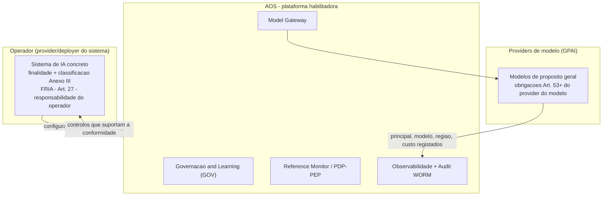

# Matriz de Conformidade — EU AI Act e GDPR — AOS

| Campo | Valor |
|---|---|
| Produto | AOS — Agentic OS de Referência |
| Documento | Técnica — Matriz de Conformidade (EU AI Act e GDPR) |
| Versão | 1.0 |
| Data | Julho de 2026 |
| Classificação | Documento de Referência — Aberto |
| Documento-fonte | `_FONTE_agentic-os-ideal.md` |
| Documentos relacionados | `tecnica/09_Governacao_Conformidade.md`, `tecnica/08_Observabilidade_Evals.md`, `tecnica/07_Seguranca_Isolamento.md`, `tecnica/01_Reference_Monitor_Plano_Controlo.md`, `specs/EPIC-09_Governacao_Conformidade.md`, `specs/EPIC-08_Observabilidade_Evals.md` |

---

## 1. Introdução

### 1.1 Propósito

Este documento resolve a constatação de auditoria **COMP-03/RIG-03**: o conjunto documental do AOS afirmava conformidade "EU AI Act por desenho", mas apenas o Art. 14 (supervisão humana) estava explicitamente coberto, sem uma matriz de rastreio real entre requisitos regulatórios, controlos da plataforma e tickets de implementação. Aqui estabelece-se essa matriz de forma calibrada e verificável, mapeando cada requisito relevante do **EU AI Act (Regulamento (UE) 2024/1689)** e do **GDPR (Regulamento (UE) 2016/679)** ao controlo AOS que o suporta, ao(s) ticket(s) `AOS-NNN` que o implementam, e ao seu estado real de cobertura.

### 1.2 Âmbito

Inclui-se: o enquadramento de classificação de risco do AOS; a matriz EU AI Act para os Art. 9 a 15, o Anexo III, o Anexo IV, as obrigações GPAI e a FRIA; a matriz GDPR para os Art. 5, 17, 25, 30, 32 e 35; e a delimitação explícita das lacunas e responsabilidades que recaem sobre o operador. Fica fora do âmbito a especificação interna de cada controlo, detalhada em `tecnica/09` (governação), `tecnica/08` (observabilidade e audit) e `tecnica/07` (segurança).

### 1.3 Audiência

DPO, equipas jurídicas e de conformidade, auditores externos, arquitectos de plataforma e responsáveis de produto — quer da equipa AOS quer do **operador** que implanta o AOS num sistema concreto.

### 1.4 Definições

- **Operador:** a entidade que usa o AOS para construir e operar um sistema de IA concreto; assume, conforme o caso, o papel de *provider* ou *deployer* na aceção do EU AI Act.
- **GPAI:** *General-Purpose AI model* — modelo de propósito geral consumido através do Model Gateway.
- **FRIA:** *Fundamental Rights Impact Assessment* (Art. 27 do EU AI Act).
- **DPIA:** *Data Protection Impact Assessment* (Art. 35 do GDPR).

---

## 2. Enquadramento e classificação de risco

O AOS é uma **plataforma/infraestrutura de referência** para correr, coordenar e governar agentes — **não é, por si só, um sistema de IA de alto risco**. Não determina finalidade, não processa dados de um domínio regulado por decisão própria, nem toma decisões com efeito jurídico sobre pessoas: essas propriedades emergem do *sistema* que um **operador** constrói sobre a plataforma. O AOS é, portanto, um **habilitador de conformidade**: fornece os controlos arquitecturais que tornam a conformidade do operador *alcançável e demonstrável*, mas não a substitui.

Esta distinção governa toda a matriz. Onde se escreve "coberto", entende-se que o AOS fornece o **mecanismo** que suporta o requisito; a **responsabilidade de configurar, ativar e provar** o requisito no sistema concreto permanece do operador. Evita-se deliberadamente qualquer afirmação de conformidade absoluta: o AOS oferece *controlos que suportam a conformidade do operador*, não um certificado de conformidade.

**Responsabilidade partilhada.** A classificação de alto risco (Anexo III) depende da finalidade que o operador define; se o sistema resultante for de alto risco, é o operador que assume as obrigações dos Art. 9 a 15 enquanto *provider*/*deployer*, apoiando-se nos controlos AOS. **GPAI:** os modelos de propósito geral são consumidos via **Model Gateway (GW)** e permanecem sob obrigações do respetivo *provider de modelo* (Art. 53 e seguintes); o AOS regista principal, modelo, região e custo por chamada, fornecendo a rastreabilidade que o operador precisa a montante, mas não assume as obrigações do provider do modelo.

---

## 3. Matriz EU AI Act

Legenda de estado: **Coberto** = mecanismo AOS existe e suporta o requisito · **Parcial** = mecanismo existe mas exige configuração ou complemento do operador · **Operador** = fora do controlo do AOS, responsabilidade do operador.

| Artigo / Requisito | Requisito (síntese) | Controlo AOS (componente/mecanismo) | Ticket(s) | Estado |
|---|---|---|---|---|
| **Art. 9** — Gestão de risco | Sistema de gestão de risco contínuo ao longo do ciclo de vida | Gates de risco SA-ROC (safe/gray/danger), circuit breaker multi-sinal, taxonomia L0–L5 com demoção automática em anomalia (ADR-013/014) | AOS-089, AOS-090, AOS-080, AOS-095 | Parcial |
| **Art. 10** — Governação de dados | Qualidade, minimização e governação dos dados de treino/operação | Redação/tokenização de PII na ingestão, TTL por classe, minimização por desenho (ADR-011) | AOS-091, AOS-092 | Parcial |
| **Art. 11 + Anexo IV** — Documentação técnica | Documentação técnica completa e mantida | Conjunto `tecnica/` versionado, policy-as-code versionada/assinada com changelog no audit, manifesto de versão | AOS-088, AOS-097 | Parcial |
| **Art. 12** — Registo (logging) | Registo automático de eventos ao longo da vida do sistema | Observabilidade OTel GenAI (trajectória completa), audit hash-chain + WORM, wide events, replay determinístico (ADR-010) | AOS-076, AOS-077, AOS-082, AOS-083, AOS-072, AOS-079 | Coberto |
| **Art. 13** — Transparência | Informação e interpretabilidade para o *deployer* | Trajectória completa em spans, relatórios de conformidade derivados do audit, exposição do nível de autonomia por (agente, domínio) | AOS-097, AOS-085, AOS-089 | Parcial |
| **Art. 14** — Supervisão humana | Supervisão humana efectiva (não teatro de aprovações) | Gate HITL sobre `waiting_on_human`: aprovação assinada, timeout fail-closed, override-rate medido, tiering SA-ROC (ADR-013) | AOS-095 | Coberto |
| **Art. 15** — Robustez, exactidão, cibersegurança | Exactidão, robustez e cibersegurança adequadas | Reference Monitor mandatório, isolamento microVM + egress default-deny, separação control/data-plane (taint), eval harness ligado ao trace, alertas por SLI | AOS-087, AOS-084, AOS-086, AOS-072 | Parcial |
| **Anexo III** — Classificação alto risco | Determinar se o caso de uso é de alto risco | Não determinável pelo AOS: depende da finalidade definida pelo operador | — | Operador |
| **Obrigações GPAI** (Art. 53+) | Obrigações do provider do modelo de propósito geral | Model Gateway regista principal/modelo/região/custo por chamada; allowlist regional; não assume obrigações do provider do modelo | AOS-078, AOS-094 | Operador |
| **FRIA** (Art. 27) | Avaliação de impacto sobre direitos fundamentais | AOS fornece audit, atribuição e relatórios como *evidência*; a avaliação em si é do operador | AOS-097 | Operador |

---

## 4. Matriz GDPR

| Artigo | Requisito (síntese) | Controlo AOS (componente/mecanismo) | Ticket(s) | Estado |
|---|---|---|---|---|
| **Art. 5** — Minimização e limitação | Minimização, limitação da finalidade e da conservação | Redação/tokenização de PII na ingestão; o desnecessário nunca é persistido (ADR-011) | AOS-091 | Coberto |
| **Art. 17** — Direito ao apagamento | Apagamento efectivo sem quebrar o registo imutável | Crypto-shredding: PII cifrada por chave-por-titular; DSAR destrói a chave; hashes do audit continuam a validar (ADR-011/010) | AOS-093 | Coberto |
| **Art. 25** — Proteção de dados desde a conceção | *Data protection by design and by default* | PDP/PEP com allowlist capability-scoped default-deny; obrigações de redação/região impostas antes do efeito; soberania por board (ADR-011) | AOS-087, AOS-094 | Coberto |
| **Art. 30** — Registos de tratamento | Registos das atividades de tratamento | Audit hash-chain + WORM; relatórios de conformidade derivados; wide events (ADR-010) | AOS-083, AOS-097, AOS-082 | Coberto |
| **Art. 32** — Segurança do tratamento | Segurança técnica e organizativa adequada | Isolamento microVM, credential broker JIT (agente nunca vê segredo), egress default-deny, audit assinado, cifra de PII (ADR-004/006) | AOS-072, AOS-093 | Parcial |
| **Art. 35** — DPIA | Avaliação de impacto sobre a proteção de dados | AOS fornece evidência (audit, atribuição, retenção); a avaliação é do operador/DPO | AOS-097 | Operador |

---

## 5. Lacunas e responsabilidades do operador

A calibração de COMP-03 exige nomear com clareza o que o AOS **não** cobre. Os controlos acima são condição necessária, não suficiente, para a conformidade do sistema concreto.

- **Classificação de risco e finalidade (Anexo III).** Só o operador pode determinar se o caso de uso é de alto risco. A ativação das obrigações Art. 9–15 decorre dessa decisão e não é automática.
- **FRIA (Art. 27) e DPIA (Art. 35).** O AOS produz a *evidência* (audit tamper-evident, atribuição por principal completo, relatórios), mas a avaliação de impacto — âmbito, consulta de partes interessadas, medidas de mitigação — é da responsabilidade do operador/DPO.
- **Obrigações GPAI.** As obrigações do *provider* do modelo de propósito geral (documentação, política de copyright, sumário de dados de treino) permanecem do provider do modelo; o AOS regista a utilização mas não as assume.
- **Configuração das políticas.** A allowlist default-deny, os TTL por classe, as fronteiras de soberania e os limiares de autonomia são *policy-as-code* que o operador tem de definir para o seu domínio; o AOS entrega o motor, não as regras concretas.
- **Papel de aprovador humano.** O Art. 14 exige supervisão *efectiva*; o AOS impõe gates assinados e mede o override-rate, mas a existência de aprovadores competentes e o combate à *approval fatigue* organizacional são do operador.
- **Registo formal e conformidade organizativa.** Registo na base de dados da UE (quando aplicável), sistema de gestão da qualidade, declaração de conformidade e monitorização pós-mercado são obrigações do operador enquanto *provider*/*deployer*.
- **Contratos e transferências internacionais.** As bases legais de tratamento, os contratos com subcontratantes e as garantias de transferência internacional são jurídicas e contratuais, fora do escopo técnico do AOS.

---

## 6. Vista de qualidade

**Governação (dimensão primária).** A matriz torna a conformidade *rastreável*: cada requisito liga a um controlo e a um ticket, e o audit tamper-evident permite gerar a evidência a pedido (AOS-097). **Observabilidade.** O Art. 12 (logging) é a área mais fortemente coberta, assente na trajectória OTel completa e no audit WORM. **Segurança.** O Art. 32 do GDPR e o Art. 15 do EU AI Act apoiam-se na fronteira de segurança (`tecnica/07`). A honestidade do estado "Parcial"/"Operador" é ela própria um controlo de qualidade: evita a sobre-afirmação que COMP-03 identificou.

---

## 7. Riscos e mitigações

| Risco | Impacto | Mitigação |
|---|---|---|
| Sobre-afirmação de conformidade | Falsa segurança; exposição regulatória | Estados calibrados (Coberto/Parcial/Operador); linguagem de "controlos que suportam" |
| Operador não ativar controlos | Requisito não cumprido apesar do mecanismo existir | Secção 5 explícita; DoD de domínio nos tickets EPIC-09 |
| Classificação de risco omitida | Obrigações Art. 9–15 não acionadas | Enquadramento (secção 2) delega a decisão e a FRIA ao operador |
| Deriva entre matriz e implementação | Matriz desatualizada face aos tickets | Cross-ref a `specs/EPIC-09`; controlo de versões; changelog de política no audit (AOS-088) |
| GPAI tratado como coberto | Obrigações do provider do modelo ignoradas | Estado "Operador" em GPAI; registo de utilização via GW (AOS-078) |

---

## 8. Glossário

- **Operador:** entidade que implanta o AOS num sistema concreto; *provider* ou *deployer* na aceção do EU AI Act.
- **GPAI:** modelo de propósito geral consumido via Model Gateway; obrigações do respetivo provider de modelo.
- **FRIA:** *Fundamental Rights Impact Assessment* (Art. 27, EU AI Act).
- **DPIA:** *Data Protection Impact Assessment* (Art. 35, GDPR).
- **Crypto-shredding:** apagar a chave de cifra por titular para tornar PII irrecuperável sem reescrever o log encadeado.
- **PDP/PEP:** Policy Decision Point / Policy Enforcement Point; no AOS o PEP é o Reference Monitor.
- **SA-ROC:** tiering de risco safe/gray/danger que gradua o oversight das acções.
- **Audit WORM:** *Write-Once-Read-Many* hash-chained; base tamper-evident do registo (ADR-010).

---

## 9. Tabela de aprovação

| Papel | Nome | Assinatura | Data |
|---|---|---|---|
| Arquitecto de Plataforma |  |  |  |
| Responsável de Segurança |  |  |  |
| Responsável de Produto |  |  |  |

---

## 10. Controlo de versões

| Versão | Data | Descrição | Autor |
|---|---|---|---|
| 1.0 | Julho 2026 | Emissão inicial — resolve COMP-03/RIG-03 (matriz EU AI Act + GDPR) | Equipa AOS |
