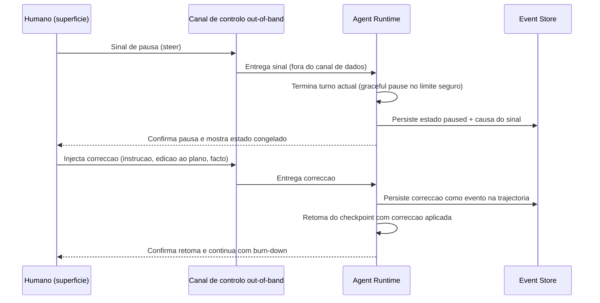
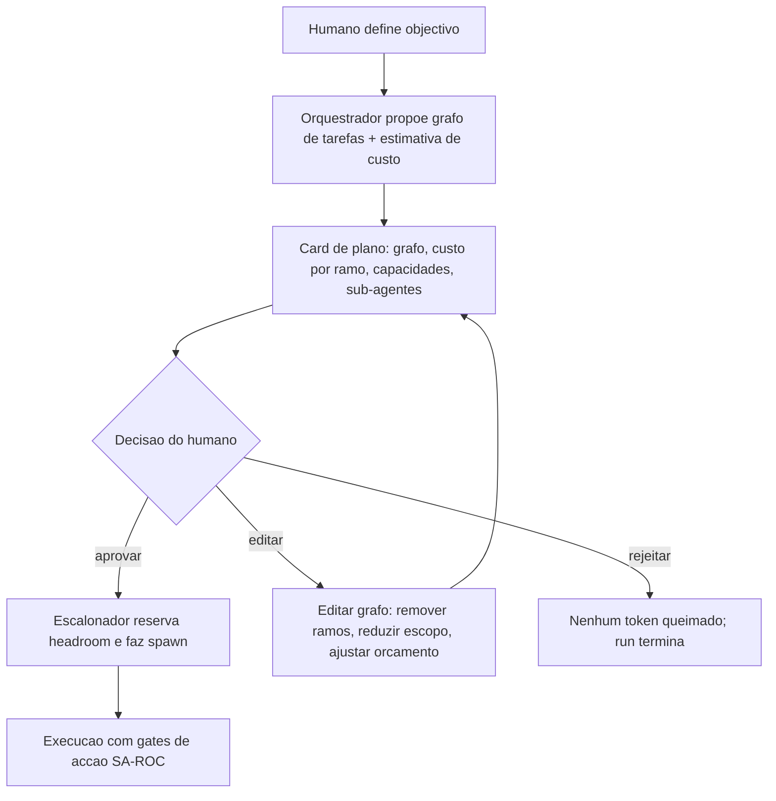
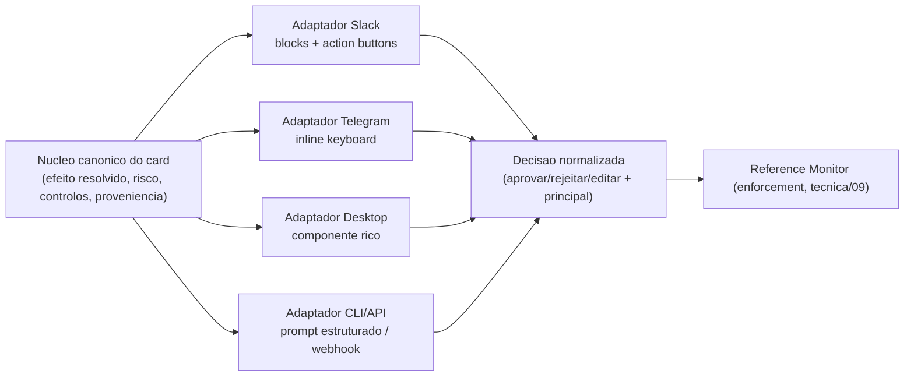
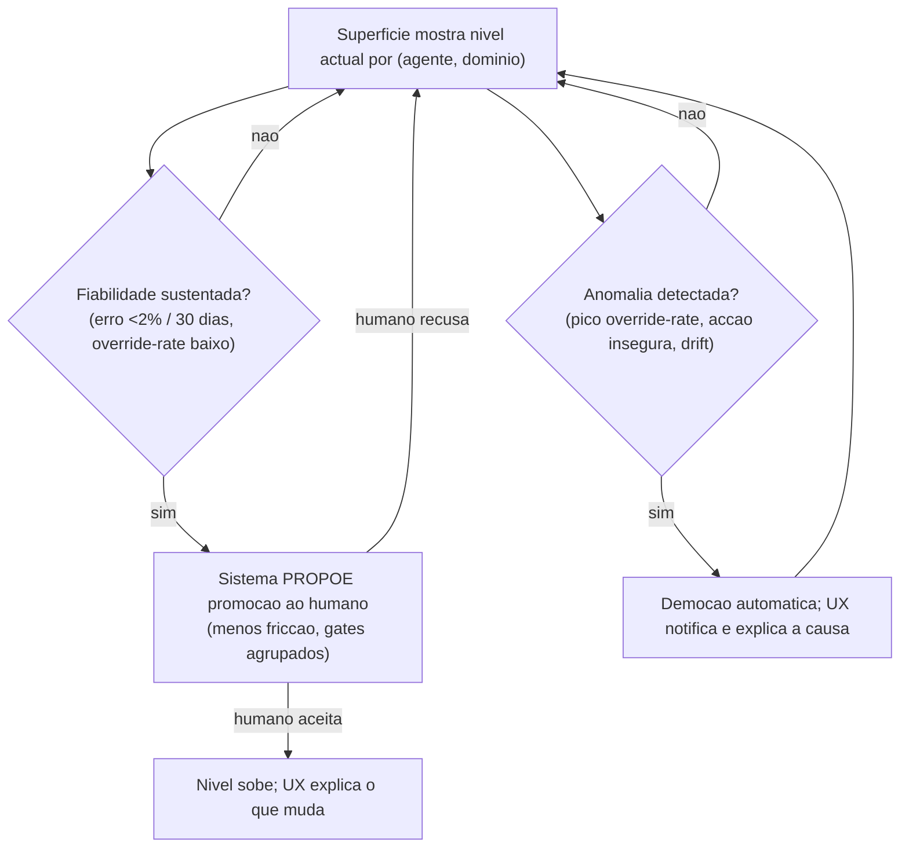
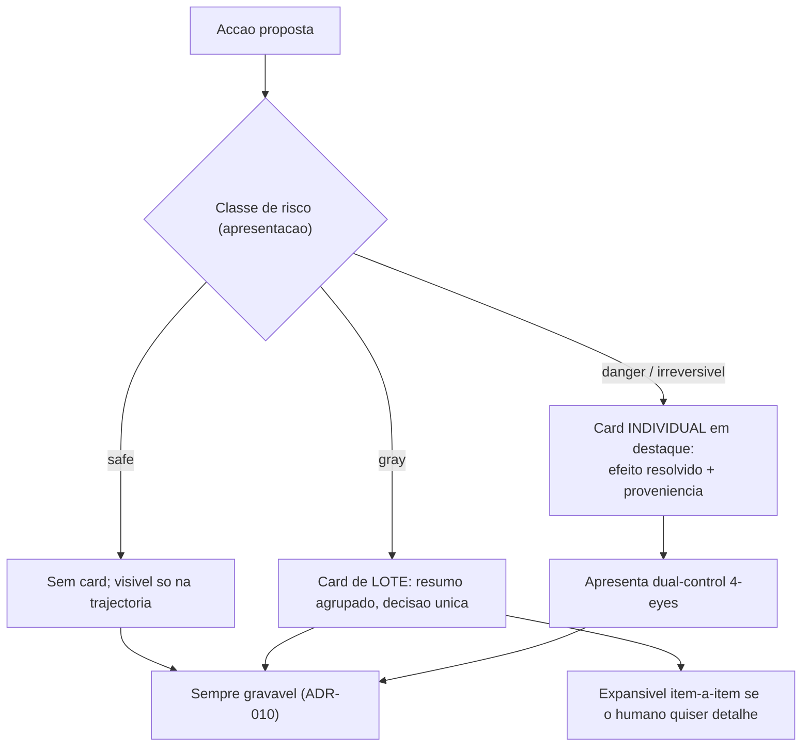

# Experiência de Utilização e Controlo Humano (UX/DX) — AOS

| Campo | Valor |
|---|---|
| Produto | AOS — Agentic OS de Referência |
| Documento | Técnica — Experiência de Utilização e Controlo Humano (UX/DX) |
| Versão | 1.0 |
| Data | Julho de 2026 |
| Classificação | Documento de Referência — Aberto |
| Documento-fonte | `_FONTE_agentic-os-ideal.md` |
| Documentos relacionados | `tecnica/00_Arquitectura_Solucao.md`, `tecnica/02_Agent_Runtime_Execucao_Duravel.md`, `tecnica/08_Observabilidade_Evals.md`, `tecnica/09_Governacao_Conformidade.md`, `specs/EPIC-12_Experiencia_HITL_UX.md` |

---

## 1. Introdução

### 1.1 Propósito

Este documento especifica a **sexta dimensão de excelência** do AOS — a Experiência de Utilização e de Programação (UX/DX) — enquanto camada de *interacção* entre o humano responsável e o sistema agêntico. A tese é directa: um Agentic OS não é excelente se apenas *deixar observar* o que os agentes fazem; tem de tornar o **controlo humano bidireccional** — pausar, corrigir e retomar — uma propriedade de primeira classe, disponível em qualquer superfície. O plano-base oferecia streaming *read-only* e recuperação pós-falha (observação passiva); o AOS transforma essa observação em **controlo activo, calibrado e proporcional ao risco**.

Este documento resolve a constatação de auditoria COMP-01: a Dimensão 6 não possuía documento técnico dedicado. Aqui trata-se a *superfície* e o *protocolo* de controlo, o modelo de apresentação dos gates, e a ergonomia da supervisão — não o enforcement de política, que pertence a `tecnica/09`.

### 1.2 Âmbito

Inclui-se: o contrato da superfície de controlo *out-of-band*; o gate de aprovação-de-plano antes do spawn; o modelo do *approval-card* com preview do efeito concreto resolvido; a paridade de superfície (Slack/Telegram/desktop) e o contrato de adaptador de plataforma; a semântica de progresso e o burn-down de custo com prompt de exaustão graciosa; a calibração de confiança; a UX da autonomia progressiva L0–L5 do lado do utilizador; o loop de autoria de skills com dry-run; e a apresentação anti-fadiga de aprovação (SA-ROC).

Fica **fora do âmbito** (referido apenas na fronteira): o estado durável `paused` e a máquina de estados do runtime (`tecnica/02`, AOS-023); o enforcement HITL, o timeout fail-closed, a aprovação assinada e a medição de override-rate (`tecnica/09`, ADR-013); o pipeline de eval-gate/canary/ratificação da auto-modificação (`tecnica/11`, ADR-012); e a captura de trajectórias em OTel (`tecnica/08`).

### 1.3 Audiência

Designers de produto e de interacção, engenheiros de front-end e de adaptadores de plataforma, responsáveis de produto, e engenheiros de governação que precisem de compreender a fronteira entre apresentação e enforcement.

### 1.4 Definições e termos

- **Superfície de controlo:** qualquer canal (desktop, Slack, Telegram, CLI, API) através do qual o humano observa e emite sinais de controlo sobre um run vivo.
- **Out-of-band (fora-de-banda):** canal de controlo separado do canal de dados do loop do agente; um sinal de pausa não depende de o modelo "querer" parar.
- **Approval-card:** unidade de apresentação de um gate — mostra o efeito concreto resolvido de uma acção e recolhe a decisão do humano.
- **Burn-down de custo:** representação do orçamento consumido/restante (tokens e USD) ao longo do run.
- **Calibração de confiança:** alinhamento entre a certeza expressa pelo agente e a sua fiabilidade real, para evitar over-trust e under-trust.

---

## 2. Princípios e decisões aplicáveis (ADRs)

| ADR | Decisão | Como este documento a concretiza |
|---|---|---|
| **ADR-013** | Gates de risco SA-ROC + controlo bidireccional | Documento central. Especifica a *superfície* e o *protocolo* de steer/interrupt (pausar→corrigir→retomar), o gate de aprovação-de-plano, e a apresentação do tiering SA-ROC. O enforcement (timeout fail-closed, assinatura, override-rate) vive em `tecnica/09`. |
| **ADR-014** | Taxonomia de autonomia L0–L5 | Especifica a UX da promoção/demoção do lado do utilizador: como o sistema comunica o nível actual, propõe promoção e sinaliza demoção (secção 8). |
| **ADR-010** | Observabilidade OTel + audit WORM | A trajectória é *sempre gravável*: cada sinal de controlo, cada decisão de card e cada correcção injectada é um evento na trajectória, alimentando o eval-driven development (secções 3 e 9). |

Aplicam-se na fronteira **ADR-003** (a aprovação vem de um principal identificado), **ADR-008** (o burn-down reflecte o orçamento em tokens/$) e **ADR-012** (o dry-run de skills antecede o eval-gate).

O backlog executável desta dimensão é o **EPIC-12 — Experiência HITL (UX/DX)**, com os tickets **AOS-119** a **AOS-128**: superfície de controlo out-of-band e protocolo pausar→corrigir→retomar (AOS-119, AOS-120); gate de aprovação-de-plano (AOS-121); modelo de approval-card com efeito resolvido e dual-control (AOS-122); contrato de adaptador e paridade Slack/Telegram/desktop (AOS-123); progresso e burn-down com exaustão graciosa (AOS-124); calibração de confiança (AOS-125); UX da autonomia progressiva L0–L5 (AOS-126); loop de autoria de skills com dry-run (AOS-127); apresentação anti-fadiga SA-ROC (AOS-128). Ver `specs/EPIC-12_Experiencia_HITL_UX.md`.

---

## 3. Controlo bidireccional e a superfície out-of-band

O controlo bidireccional é o requisito-mãe da dimensão. O humano tem de poder, em qualquer momento de um run vivo: **pausar** → **injectar uma correcção** → **retomar** — sem matar o run nem perder o trabalho já feito. A distinção essencial em relação a `tecnica/02` é que aqui não se descreve o *estado* durável `paused` (AOS-023), mas a **superfície** que o dispara e o **protocolo** que negoceia a pausa graciosa.

O canal de controlo é **out-of-band**: viaja fora do canal de dados do loop, para que um sinal de pausa não dependa do agente "decidir" parar (um agente em loop patológico nunca decidiria). A superfície emite o sinal; o runtime confirma a recepção e faz *graceful pause* no limite de turno seguro (fim do turno actual, nunca a meio de uma activity externa não-idempotente); o humano vê o estado congelado, injecta a correcção (uma instrução, uma edição ao plano, um facto); e o runtime retoma a partir do checkpoint com a correcção aplicada. Estilo AgentScope 1.0.

O **contrato da superfície de controlo** tem três garantias inegociáveis: (1) o sinal é **sempre aceite** — nunca é silenciosamente descartado, mesmo que a pausa efectiva só ocorra no próximo limite de turno; (2) a pausa é **graciosa** — nenhum efeito externo fica a meio; (3) tudo é **gravável** — o sinal, a latência até à pausa efectiva e a correcção injectada tornam-se eventos na trajectória (ADR-010), permitindo reconstruir *porque* o humano interveio. O protocolo é idêntico em todas as superfícies; muda apenas o adaptador (secção 6).

---

## 4. Gate de aprovação-de-plano antes do spawn

O AOS introduz um gate distinto dos gates de *acção*: o **gate de aprovação-de-plano**. Antes de o Orquestrador fazer spawn de sub-agentes e começar a **queimar tokens**, o humano pode ver — e editar — o grafo de tarefas proposto. É a diferença entre aprovar *o que vai ser feito* (plano, uma vez, à cabeça) e aprovar *cada efeito individual* (acção, repetidamente, durante a execução).

O valor é económico e de controlo: um plano mal decomposto detectado à cabeça poupa todo o custo de o executar e reverter. O card de plano apresenta o grafo acíclico de tarefas, a estimativa de custo por ramo (tokens/$), os sub-agentes a instanciar e as capacidades que cada um requererá. O humano pode **aprovar**, **editar** (remover ramos, reordenar, reduzir escopo, ajustar orçamento) ou **rejeitar**. Só após aprovação o Escalonador reserva headroom e faz spawn.

Este gate é configurável por nível de autonomia (secção 8): a L0/L1 é obrigatório; a partir de L3 pode ser reduzido a notificação (o plano corre, mas o humano recebe o grafo e pode intervir via superfície out-of-band). O gate de plano **não substitui** os gates de acção — compõe-se com eles.

---

## 5. Modelo do approval-card

O erro clássico do HITL é pedir aprovação sobre uma *intenção abstracta* ("o agente quer executar um comando"). O AOS exige que o card mostre o **efeito concreto resolvido**: o comando **expandido** (variáveis substituídas, wildcards resolvidos), o **destinatário real** (o endereço, a conta, o ficheiro concreto), e os **dados reais** que serão enviados ou alterados. O humano aprova o que *vai efectivamente acontecer*, não uma descrição optimista.

Anatomia mínima de um approval-card:

| Elemento | Conteúdo | Porquê |
|---|---|---|
| Efeito resolvido | Comando/pedido expandido, sem placeholders | Elimina a ambiguidade entre intenção e efeito |
| Destinatário | Recurso/conta/endereço concreto | Expõe erros de alvo antes de acontecerem |
| Payload | Dados reais a enviar/alterar (com PII redigida na apresentação) | Torna a exfiltração visível |
| Classe de risco | safe / gray / danger, e reversibilidade | Justifica o nível de fricção |
| Proveniência | Que dados *untrusted* influenciaram a acção | Detecta prompt injection na origem |
| Controlo | Aprovar · Rejeitar · Editar · (para irreversíveis) segundo aprovador | Recolhe a decisão |

Para acções **irreversíveis** o card exige **dual-control** (4-eyes): um segundo aprovador autorizado e distinto. A superfície apresenta o dual-control; o *enforcement* de que a segunda assinatura é válida, de um principal distinto e autorizado, e o não-repúdio criptográfico, pertencem a `tecnica/09`. A redação de PII na apresentação do payload segue as obrigações devolvidas pelo PDP — o card mostra o suficiente para a decisão ser informada, sem expor dados pessoais desnecessários na superfície.

---

## 6. Paridade de superfície e contrato de adaptador

A supervisão só é efectiva se acompanhar o humano onde ele está. O AOS exige **paridade de superfície**: a aprovação-como-card tem de funcionar de forma equivalente em **Slack, Telegram e desktop** (e, por extensão, CLI e API). A paridade não é pixel-perfect — é **paridade de capacidade**: qualquer superfície tem de conseguir apresentar o efeito resolvido, recolher a decisão, suportar edição de plano e sinalizar pausa/retoma.

Isto materializa-se num **contrato de adaptador de plataforma**: um núcleo canónico de card (agnóstico da plataforma) e adaptadores que o renderizam nas primitivas de cada canal (blocos e botões no Slack, inline keyboards no Telegram, componentes ricos no desktop). O contrato define o mínimo que qualquer adaptador tem de satisfazer.

Regras do contrato: (1) **degradação graciosa** — se um canal não suporta uma primitiva (ex.: edição rica de grafo no Telegram), o adaptador oferece o equivalente mínimo viável (ex.: um link para uma superfície mais rica) e nunca *falha aberto* aprovando por omissão; (2) **decisão normalizada** — todos os adaptadores devolvem a decisão no mesmo formato, com o principal identificado, para o enforcement ser idêntico independentemente do canal; (3) **fidelidade do efeito** — nenhum adaptador pode mostrar uma versão abreviada que esconda o destinatário ou o payload real.

---

## 7. Progresso, burn-down de custo e exaustão graciosa

A observação passiva não basta: o humano precisa de **semântica de progresso** legível (que tarefa corre, que percentagem do grafo está feita, que sub-agentes estão vivos) e de um **burn-down de custo** em tempo real — tokens e USD consumidos versus orçamento reservado (ADR-008). O custo silencioso é um modo de falha: sem burn-down, uma explosão de custo só é notada na factura.

O plano-base fazia hard-stop cego ao atingir o budget — mata o run sem cerimónia e perde-se trabalho. O AOS substitui-o por um **prompt de exaustão graciosa** por volta dos **~80%** do orçamento, que oferece ao humano três escolhas explícitas:

- **Estender** — conceder orçamento adicional (dentro do headroom global) e continuar;
- **Resumir e parar** — o agente consolida o trabalho feito num resultado utilizável e termina de forma limpa;
- **Abortar** — parar já, aceitando o estado actual.

O limiar (~80%) é configurável e o prompt aparece na superfície activa. A exaustão graciosa transforma um limite de custo de *falha abrupta* em *decisão informada*, preservando o valor já produzido.

---

## 8. Calibração de confiança e autonomia progressiva

### 8.1 Calibração de confiança

**Over-trust é tão perigoso quanto under-trust.** Um humano que confia demais aprova sem escrutínio (rubber-stamping); um que confia de menos revê tudo e recai na fadiga. A UX combate ambos com **calibração activa**:

- **Linguagem de incerteza selectiva** — o agente exprime incerteza *onde ela é real e material*, não de forma decorativa em toda a resposta. Incerteza uniforme é ruído; incerteza selectiva é sinal. Uma afirmação de baixa confiança sobre um facto crítico deve ser visualmente destacada.
- **Histórico de correcções** — a superfície mostra quantas vezes, e em que classes de tarefa, este agente foi corrigido pelo humano. Um agente frequentemente corrigido num domínio deve inspirar mais escrutínio nesse domínio, e a UX torna esse histórico visível na decisão.

Este histórico de correcções é o mesmo sinal que alimenta o override-rate medido em `tecnica/09`: aqui apresenta-se ao humano para calibrar a *sua* confiança; lá é enforcement anti-rubber-stamping.

### 8.2 Autonomia progressiva por maturidade do utilizador

A escada L0–L5 (ADR-014, definida em `tecnica/09`) tem um **lado de utilizador** que é responsabilidade desta dimensão: como o sistema *comunica* o nível, *propõe* promoção e *sinaliza* demoção. A maturidade é do par (agente, domínio) e também da relação utilizador–agente: um utilizador novato começa com mais fricção; à medida que a fiabilidade medida se sustenta, o sistema **propõe** — nunca impõe — reduzir a fricção.

Princípios da UX de autonomia: a promoção é sempre **opt-in explícito** do humano (o sistema propõe, o humano decide); a demoção é **automática e transparente** — quando o enforcement rebaixa o agente por anomalia, a superfície **notifica e explica a causa** (não deixa o humano surpreendido com mais gates sem saber porquê). O nível corrente é sempre visível, para que o humano saiba quanto do que vê é supervisionado.

---

## 9. Loop de autoria de skills e apresentação anti-fadiga

### 9.1 Loop de autoria de skills com dry-run

A DX inclui o ciclo em que um agente (ou um humano) escreve uma nova skill. Antes de qualquer promoção, o loop de autoria oferece **dry-run**: executar a skill contra entradas de teste num modo sem efeitos externos, mostrando ao autor o que *teria* acontecido (as tool calls que emitiria, os efeitos resolvidos) sem os concretizar. O dry-run é a antecâmara do eval-gate de `tecnica/11` (ADR-012) — apanha erros grosseiros antes de gastar o ciclo de staging/canary.

A **atribuição é visível**: cada skill mostra o seu autor (humano ou agente NHI), a versão SemVer, e o histórico de alterações. Quando um agente auto-escreve uma skill, a atribuição na superfície deixa claro que foi auto-gerada e ainda não ratificada — o humano nunca confunde uma skill auto-escrita não-ratificada com uma skill curada.

### 9.2 Apresentação anti-fadiga (SA-ROC)

A *approval fatigue* é a **click-through vulnerability**: sob volume de gates uniformes, utilizadores experientes auto-aprovam mais de 40% dos pedidos, esvaziando a governação. O **enforcement** do tiering — o que corre, o que agrupa, o que exige confirmação — pertence a ADR-013 e a `tecnica/09`. O que esta dimensão possui é a **apresentação**: como os gates são *mostrados* de modo a que o escrutínio continue genuíno.

Regras de apresentação anti-fadiga: (1) os cards **danger** são **escassos e distintos** — se tudo é um alarme, nada é; a raridade do card individual preserva a sua saliência; (2) os cards **gray** são **agrupados** num digest com uma decisão de lote, mas sempre **expansíveis** item-a-item para quem quer escrutinar; (3) o **atrito é assimétrico** — aprovar um irreversível exige mais gestos (confirmar o efeito, segundo aprovador) do que aprovar um lote gray, tornando o rubber-stamping fisicamente mais difícil precisamente onde importa. A apresentação nunca pré-selecciona "aprovar" por omissão em acções danger.

---

## 10. Vista de qualidade

### 10.1 Experiência de utilização (UX/DX — dimensão primária)

Controlo bidireccional (pausar→corrigir→retomar) em qualquer superfície via canal out-of-band, com sinal sempre aceite e pausa graciosa; gate de aprovação-de-plano antes do spawn, com edição do grafo; approval-card com efeito concreto resolvido e dual-control para irreversíveis; paridade de superfície Slack/Telegram/desktop sob contrato de adaptador com degradação graciosa e decisão normalizada; semântica de progresso e burn-down de custo com exaustão graciosa a ~80% (estender/resumir/abortar); calibração de confiança por incerteza selectiva e histórico de correcções; UX de autonomia progressiva L0–L5 (promoção opt-in, demoção transparente); loop de autoria de skills com dry-run e atribuição visível; apresentação anti-fadiga SA-ROC. Ver ADR-013, ADR-014, ADR-010.

### 10.2 Governação

A UX é o *rosto* da governação: a supervisão humana efectiva (Art. 14) só existe se a apresentação combater a fadiga de aprovação. Esta dimensão fornece a apresentação; `tecnica/09` fornece o enforcement (timeout fail-closed, aprovação assinada, override-rate, allowlist default-deny). A fronteira é nítida — a superfície *mostra e recolhe*; o Reference Monitor *decide e regista*.

### 10.3 Observabilidade

Cada sinal de controlo, decisão de card, correcção injectada e escolha de exaustão graciosa é um evento na trajectória (ADR-010). A trajectória sempre-gravável torna o eval-driven development viável e permite reconstruir *porque* e *quando* o humano interveio — dado essencial para calibrar gates e níveis de autonomia. Ver `tecnica/08`.

---

## 11. Riscos e mitigações

| Risco | Impacto | Mitigação |
|---|---|---|
| Sinal de pausa ignorado ou perdido | Humano perde controlo de run vivo | Canal out-of-band com garantia de aceitação + graceful pause no limite seguro (secção 3) |
| Aprovação sobre intenção abstracta | Humano aprova efeito diferente do esperado | Approval-card com efeito concreto resolvido (comando expandido, destinatário, payload real) (secção 5) |
| Disparidade entre superfícies | Governação forte no desktop, fraca no Slack/Telegram | Contrato de adaptador com paridade de capacidade e degradação graciosa (secção 6) |
| Hard-stop cego de orçamento | Perda de trabalho já produzido | Prompt de exaustão graciosa a ~80% (estender/resumir/abortar) (secção 7) |
| Over-trust (rubber-stamping) | Governação esvaziada, click-through | Incerteza selectiva + histórico de correcções + atrito assimétrico nos cards danger (secções 8, 9) |
| Under-trust (revisão de tudo) | Fadiga de aprovação, agente inútil | Autonomia progressiva opt-in + agrupamento gray + cards danger escassos (secções 8, 9) |
| Skill auto-escrita confundida com curada | Confiança indevida em código não-ratificado | Atribuição visível + marcação de não-ratificada + dry-run antes do eval-gate (secção 9) |
| Demoção silenciosa surpreende o humano | Fricção súbita sem contexto | Demoção transparente: notificação com causa na superfície (secção 8) |
| Card mostra payload com PII na íntegra | Exposição de dados pessoais na superfície | Redação de PII na apresentação segundo obrigações do PDP (secção 5) |

---

## 12. Glossário

- **Superfície de controlo:** canal (desktop, Slack, Telegram, CLI, API) por onde o humano observa e controla um run vivo.
- **Out-of-band:** canal de controlo separado do canal de dados do loop; garante que a pausa não depende da vontade do agente.
- **Graceful pause:** pausa no limite de turno seguro, sem deixar efeitos externos a meio.
- **Approval-card:** unidade de apresentação de um gate, mostrando o efeito concreto resolvido e recolhendo a decisão.
- **Efeito concreto resolvido:** a acção com variáveis substituídas, destinatário real e payload real — o que *vai efectivamente acontecer*.
- **Gate de aprovação-de-plano:** gate anterior ao spawn, em que o humano vê e edita o grafo de tarefas antes de queimar tokens.
- **Contrato de adaptador:** mínimo que qualquer adaptador de plataforma tem de satisfazer para haver paridade de superfície.
- **Burn-down de custo:** representação em tempo real do orçamento consumido/restante (tokens e USD).
- **Exaustão graciosa:** prompt a ~80% do orçamento com escolhas estender/resumir/abortar, em vez de hard-stop cego.
- **Calibração de confiança:** alinhamento entre a certeza expressa e a fiabilidade real, combatendo over-trust e under-trust.
- **Dry-run:** execução de skill sem efeitos externos, mostrando o que teria acontecido; antecâmara do eval-gate.
- **Click-through vulnerability:** modo de falha em que a fadiga de aprovação leva à auto-aprovação sem escrutínio.

---

## 13. Tabela de aprovação

| Papel | Nome | Assinatura | Data |
|---|---|---|---|
| Arquitecto de Plataforma |  |  |  |
| Responsável de Segurança |  |  |  |
| Responsável de Produto |  |  |  |

---

## 14. Controlo de versões

| Versão | Data | Descrição | Autor |
|---|---|---|---|
| 1.0 | Julho 2026 | Emissão inicial. Resolve COMP-01 (Dimensão 6 sem documento dedicado). Cobre AOS-119..AOS-128 do EPIC-12; cross-ref `tecnica/09`, `specs/EPIC-12_Experiencia_HITL_UX.md`. | Equipa AOS |
