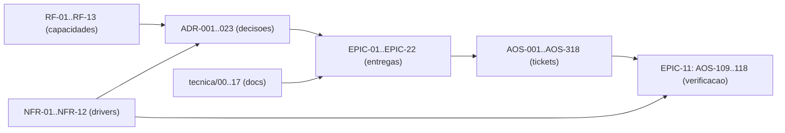

# Matriz de Rastreabilidade de Requisitos (RTM) — AOS

| Campo | Valor |
|---|---|
| Produto | AOS — Agentic OS de Referência |
| Documento | Matriz de Rastreabilidade de Requisitos (RTM) — AOS |
| Versão | 1.0 |
| Data | Julho de 2026 |
| Classificação | Documento de Referência — Aberto |
| Documento-fonte | `_FONTE_agentic-os-ideal.md` |
| Documentos relacionados | `tecnica/00_Arquitectura_Solucao.md`, `specs/00_System_Spec.md`, `specs/01_Engineering_Standards_e_Handoff.md`, `specs/EPIC-01_Fundacoes_Plano_Controlo.md` … `specs/EPIC-11_Testes_Qualidade.md` |

---

## 1. Introdução

### 1.1 Propósito

Este documento é a **Matriz de Rastreabilidade de Requisitos** (*Requirements Traceability Matrix*, RTM) do AOS. Fecha três lacunas identificadas na auditoria de coerência do conjunto documental — **COMP-02** (ausência de identificadores estáveis de requisito), **COMP-04** (ausência de matriz decisão→implementação verificável) e **RAST** (ausência de *back-link* do documento técnico para o ticket que o realiza). Estabelece, num único artefacto:

1. um **catálogo de Requisitos Funcionais** (RF-NN) com identificadores estáveis, derivados das capacidades funcionais de `specs/00_System_Spec.md` §4;
2. um **catálogo de Requisitos Não-Funcionais** (NFR-NN) derivados dos *drivers* de `specs/00_System_Spec.md` §7 e do `_BRIEF` §4;
3. a **matriz ADR × ticket** (que tickets `AOS-NNN` implementam cada decisão de arquitectura), obtida por análise directa do corpus;
4. a **matriz NFR × ticket de verificação** (que tickets provam cada alvo quantitativo);
5. o **rasto descendente** documento-técnico → epic → tickets;
6. as **lacunas de cobertura** conhecidas.

### 1.2 Âmbito

A rastreabilidade cobre os 23 ADRs canónicos (`docs/adr/README.md`), os 13 requisitos funcionais `RF-01`–`RF-13` (§2), os 12 requisitos não-funcionais `NFR-01`–`NFR-12` (§3) e os **318 tickets** `AOS-001`–`AOS-318` distribuídos por 22 epics. Os catálogos §2 e §3 partem das 11 capacidades funcionais de `specs/00` §4 e dos 10 *drivers* de `specs/00` §7 e estendem-nos com os requisitos entrados depois; os identificadores `RF-NN`/`NFR-NN` são estáveis e vivem aqui, não na System Spec. Os dados das matrizes ADR×ticket e NFR×ticket foram extraídos por análise textual dos ficheiros `specs/EPIC-*.md` (correspondência dos códigos `ADR-0NN` e `AOS-NNN` por bloco de ticket), não por atribuição editorial *a posteriori*.

### 1.3 Audiência

Gestão de produto e de programa (cobertura e priorização), arquitectura (verificação de que cada decisão tem implementação), QA (que teste prova cada NFR) e auditoria/conformidade (cadeia decisão→controlo→evidência).

### 1.4 Definições

- **Requisito Funcional (RF):** uma capacidade observável que o sistema deve oferecer.
- **Requisito Não-Funcional (NFR):** uma propriedade de qualidade com **alvo mensurável** (limiar, SLO).
- **Rasto ascendente:** de um ticket/teste para o requisito ou decisão que o motiva.
- **Rasto descendente:** de um requisito/decisão/documento para os artefactos que o realizam.
- **Sub-cobertura:** requisito ou ADR com número de tickets de implementação anormalmente baixo face à sua criticidade — sinal para revisão, não defeito automático.

### 1.5 Princípios/decisões aplicáveis (ADRs)

Este documento não introduz decisões de arquitectura; **rastreia** as 23 existentes (ADR-001 a ADR-023, `docs/adr/README.md`). Referencia-as sempre por código.

---

## 2. Catálogo de Requisitos Funcionais (RF)

Derivados de `specs/00_System_Spec.md` §4 (capacidades top-level) e alinhados com o mapa capacidade→componente→epic de §8. Cada RF tem identificador **estável** — não reordenar nem reciclar.

| RF | Requisito funcional | Componente(s) | Epic(s) | ADRs de suporte |
|---|---|---|---|---|
| **RF-01** | Executar agentes com durabilidade (loop montar→chamar→despachar→verificar sobre execução durável, com *replay* e *resume-from-step*) | RT, SCH, ES | EPIC-02 | ADR-001, ADR-007, ADR-010 |
| **RF-02** | Mediar toda a acção num gate único que aplica identidade, política, orçamento, egress e audit | RM, PDP | EPIC-01 | ADR-002, ADR-011 |
| **RF-03** | Orquestrar trabalho: decompor objectivos em grafo de tarefas acíclico, delegar a sub-agentes, escalonar com *leases* e *backpressure* | ORQ, SCH | EPIC-03 | ADR-001, ADR-008 |
| **RF-04** | Gerir identidade e autoridade: emitir tokens *scoped/time-bound* e manter cadeia de delegação até um humano | GOV, RM | EPIC-01, EPIC-09 | ADR-003 |
| **RF-05** | Isolar execução: microVM por execução, rede *default-deny*, *credential broker* server-side | SBX, BRK | EPIC-07 | ADR-004, ADR-006, ADR-005 |
| **RF-06** | Gerir memória: quatro tipos (episódica/semântica/procedural/trabalho) com proveniência e migrações expand/contract | MEM, ES | EPIC-04 | ADR-007, ADR-011 |
| **RF-07** | Governar por política: *policy-as-code* PDP/PEP, autonomia L0–L5, conformidade GDPR/EU AI Act | GOV, PDP | EPIC-09 | ADR-011, ADR-014 |
| **RF-08** | Observar e auditar: trajectória completa em OTel GenAI, *replay* determinístico, audit *hash-chain* + WORM | OBS, ES | EPIC-08 | ADR-010 |
| **RF-09** | Controlar orçamento: *admission control* global em tokens/$, *circuit breaker*, roteamento *cost/load-aware* | SCH, GW | EPIC-03, EPIC-06 | ADR-008, ADR-009 |
| **RF-10** | Controlo bidireccional: pausar→corrigir→retomar, aprovação de plano, gates SA-ROC | RT, GOV | EPIC-09 | ADR-013 |
| **RF-11** | Evoluir com rede: SemVer + *eval-gate* + *canary* + ratificação assinada para auto-modificação | REG, OBS | EPIC-05, EPIC-11 | ADR-012 |
| **RF-12** | Planear e meta-orquestrar: decompor um objectivo de alto nível num organigrama executável de sub-agentes, tratando o plano proposto pelo LLM como **dados untrusted** (validação por função pura, orçamento por ramo, aprovação no gate) antes de materializar | ORQ (PLN), RM, GOV | EPIC-19 | ADR-005, ADR-008, ADR-013, ADR-020 |
| **RF-13** | Meta-runs e organizações efémeras: materializar o organigrama como árvore de delegação (NHI *on-behalf-of*, orçamento hierárquico), re-planear subgrafos e estender-se com rede (`capability_gap`) — sem organizações persistentes | ORQ, SCH, REG | EPIC-19 | ADR-003, ADR-012, ADR-018 |

**Total: 13 requisitos funcionais (RF-01 … RF-13).**

---

## 3. Catálogo de Requisitos Não-Funcionais (NFR)

Derivados dos *drivers* canónicos (`_BRIEF` §4 / `specs/00` §7) e dos KPIs/SLOs (`specs/00` §14). Cada NFR tem **alvo mensurável**, **mecanismo** e **ADR de origem**.

| NFR | Requisito não-funcional | Alvo (SLO/limiar) | Mecanismo | ADR de origem |
|---|---|---|---|---|
| **NFR-01** | Latência de avaliação do PDP (p95) | **< 15 ms** (só avaliação de política) | Política compilada avaliada em memória | ADR-002, ADR-011 |
| **NFR-02** | Cold-start de sandbox | **< 125 ms** (restore 5–30 ms) | microVM snapshot + pool pré-aquecido | ADR-004 |
| **NFR-03** | Cache-hit-rate de prompt | **> 80%** (SLI, com alerta de *thrash*) | Layout cache-estável (prefixo imutável + tail append-only) | ADR-009 |
| **NFR-04** | Disponibilidade do plano de controlo | **99,9%** | Event Store replicado; workers stateless; sem SPOF | ADR-007 |
| **NFR-05** | Durabilidade de execução | Entrega **at-least-once** com idempotência downstream — **0 efeitos observáveis duplicados** | Idempotency key = f(run_id, step_id) propagada + saga de compensação | ADR-001 |
| **NFR-06** | Fidelidade de replay | **100%** dos passos reproduzíveis | Captura de inputs não-determinísticos + hash de prompt + manifesto | ADR-010 |
| **NFR-07** | Overhead total de mediação por *tool call* | Orçamento **decomposto por sub-passo** (PDP + CAS de admissão + broker→vault + append ES + egress/DNS); alvo agregado a ratificar por benchmark | Mediação transversal instrumentada | ADR-002 |
| **NFR-08** | Isolamento de segredos | Agente **nunca** vê segredo downstream | Credential broker JIT server-side, TTL curto, revogável | ADR-006 |
| **NFR-09** | Conformidade regulatória | GDPR / EU AI Act **por desenho**; DSAR (Art. 17) satisfeito sem quebrar o log encadeado | Crypto-shredding + TTL + redação PII + PDP + HITL efectivo | ADR-011, ADR-013 |
| **NFR-10** | Segurança de auto-evolução | **0** auto-modificações não avaliadas em produção | Eval-gate como *admission control* (staging→eval→canary→ratificação) | ADR-012 |
| **NFR-11** | Custo de planeamento | **≤ 5%** do orçamento da árvore gasto a planear (SLI; inclui replan) | Reserva de planeamento debitada antes de qualquer *spawn* + *burn-down* (AOS-123/062) | ADR-008 |
| **NFR-12** | Integridade do risco do plano | **0** nós com efeito irreversível auto-aprovados por rótulo *self-declared* — risco sempre **derivado** das ferramentas pinadas (o rótulo do LLM só eleva) | Validação pura deriva o risco; envelope L4/L5 avalia risco resolvido | ADR-013, ADR-005 |

**Total: 12 requisitos não-funcionais (NFR-01 … NFR-12).**

---

## 4. Matriz ADR × ticket

Para cada ADR-001…023, os tickets `AOS-NNN` cujo bloco de especificação o cita explicitamente (extracção por correspondência textual sobre `specs/EPIC-*.md`) e o(s) documento(s) técnico(s) que o desenvolvem. A coluna **Nº** é a contagem de tickets implementadores distintos.

A coluna **Estado** vem do registo. Rastrear um ADR *Proposto* não o promove: a matriz mostra que tickets já o citam, e o estado diz com que autoridade (AOS-317).

| ADR | Decisão | Estado | Nº | Tickets `AOS-NNN` que o implementam | Doc(s) técnico(s) |
|---|---|---|---|---|---|
| **ADR-001** | Execução durável como primitivo | Catálogo, por materializar | 25 | AOS-002, AOS-013, AOS-014, AOS-015, AOS-016, AOS-017, AOS-018, AOS-019, AOS-020, AOS-021, AOS-022, AOS-023, AOS-024, AOS-025, AOS-026, AOS-029, AOS-041, AOS-043, AOS-079, AOS-099, AOS-102, AOS-106, AOS-111, AOS-112, AOS-118 | `tecnica/01`, `tecnica/02`, `tecnica/03`, `tecnica/04`, `tecnica/08`, `tecnica/10`, `tecnica/11` |
| **ADR-002** | Reference Monitor mandatório | Catálogo, por materializar | 20 | AOS-003, AOS-013, AOS-021, AOS-025, AOS-026, AOS-034, AOS-045, AOS-051, AOS-054, AOS-055, AOS-064, AOS-069, AOS-071, AOS-074, AOS-076, AOS-087, AOS-099, AOS-113, AOS-117, AOS-234 | `tecnica/01`, `tecnica/02`, `tecnica/03`, `tecnica/05`, `tecnica/06`, `tecnica/07`, `tecnica/08`, `tecnica/09`, `tecnica/10`, `tecnica/11`, `tecnica/18` |
| **ADR-003** | Identidade não-humana por agente (NHI scoped/time-bound + binding humano↔NHI auditável) | Ratificado | 12 | AOS-005, AOS-006, AOS-025, AOS-026, AOS-034, AOS-057, AOS-071, AOS-073, AOS-097, AOS-185, AOS-278, AOS-288 | `tecnica/01`, `tecnica/03`, `tecnica/06`, `tecnica/07`, `tecnica/09`, `tecnica/11`, `tecnica/12` |
| **ADR-004** | Isolamento ao nível do kernel | Catálogo, por materializar | 11 | AOS-046, AOS-064, AOS-065, AOS-066, AOS-067, AOS-068, AOS-075, AOS-098, AOS-103, AOS-117, AOS-142 | `tecnica/05`, `tecnica/07`, `tecnica/10`, `tecnica/11`, `tecnica/12`, `tecnica/15` |
| **ADR-005** | Separação control/data-plane + taint | Catálogo, por materializar | 19 | AOS-013, AOS-023, AOS-039, AOS-042, AOS-044, AOS-046, AOS-049, AOS-054, AOS-069, AOS-071, AOS-075, AOS-117, AOS-133, AOS-158, AOS-219, AOS-224, AOS-242, AOS-244, AOS-272 | `tecnica/02`, `tecnica/04`, `tecnica/05`, `tecnica/07`, `tecnica/09`, `tecnica/11`, `tecnica/12`, `tecnica/15`, `tecnica/18` |
| **ADR-006** | Credential Broker com tokens JIT | Ratificado | 15 | AOS-048, AOS-051, AOS-055, AOS-056, AOS-057, AOS-064, AOS-070, AOS-073, AOS-075, AOS-093, AOS-098, AOS-101, AOS-129, AOS-132, AOS-156 | `tecnica/02`, `tecnica/05`, `tecnica/06`, `tecnica/07`, `tecnica/09`, `tecnica/10`, `tecnica/12`, `tecnica/15` |
| **ADR-007** | Event Store replicado | Catálogo, por materializar | 16 | AOS-001, AOS-002, AOS-015, AOS-022, AOS-027, AOS-030, AOS-035, AOS-038, AOS-045, AOS-098, AOS-099, AOS-100, AOS-101, AOS-102, AOS-118, AOS-281 | `tecnica/01`, `tecnica/02`, `tecnica/03`, `tecnica/04`, `tecnica/05`, `tecnica/09`, `tecnica/10`, `tecnica/11` |
| **ADR-008** | Admission control global em tokens/$ | Catálogo, por materializar | 26 | AOS-008, AOS-026, AOS-027, AOS-028, AOS-029, AOS-030, AOS-031, AOS-032, AOS-033, AOS-034, AOS-037, AOS-059, AOS-062, AOS-063, AOS-078, AOS-080, AOS-105, AOS-106, AOS-107, AOS-116, AOS-123, AOS-259, AOS-260, AOS-270, AOS-280, AOS-287 | `tecnica/01`, `tecnica/03`, `tecnica/04`, `tecnica/06`, `tecnica/08`, `tecnica/09`, `tecnica/10`, `tecnica/11`, `tecnica/15` |
| **ADR-009** | Layout de prompt cache-estável | Catálogo, por materializar | 15 | AOS-013, AOS-015, AOS-037, AOS-043, AOS-044, AOS-047, AOS-050, AOS-055, AOS-060, AOS-061, AOS-085, AOS-086, AOS-152, AOS-157, AOS-241 | `tecnica/02`, `tecnica/04`, `tecnica/05`, `tecnica/06`, `tecnica/08`, `tecnica/12`, `tecnica/18` |
| **ADR-010** | Observabilidade OTel GenAI + audit WORM | Catálogo, por materializar | 53 | AOS-011, AOS-013, AOS-016, AOS-024, AOS-025, AOS-034, AOS-036, AOS-038, AOS-048, AOS-051, AOS-055, AOS-057, AOS-058, AOS-059, AOS-060, AOS-061, AOS-062, AOS-064, AOS-065, AOS-072, AOS-076, AOS-077, AOS-078, AOS-079, AOS-080, AOS-081, AOS-082, AOS-083, AOS-084, AOS-085, AOS-086, AOS-088, AOS-093, AOS-096, AOS-097, AOS-099, AOS-100, AOS-101, AOS-102, AOS-103, AOS-104, AOS-105, AOS-107, AOS-111, AOS-114, AOS-115, AOS-118, AOS-127, AOS-235, AOS-269, AOS-272, AOS-280, AOS-284 | `tecnica/01`, `tecnica/02`, `tecnica/03`, `tecnica/04`, `tecnica/05`, `tecnica/06`, `tecnica/07`, `tecnica/08`, `tecnica/09`, `tecnica/10`, `tecnica/11`, `tecnica/15`, `tecnica/18` |
| **ADR-011** | Policy-as-code + GDPR por desenho (soberania por board) | Ratificado | 32 | AOS-004, AOS-035, AOS-038, AOS-039, AOS-044, AOS-055, AOS-057, AOS-058, AOS-063, AOS-067, AOS-071, AOS-079, AOS-083, AOS-087, AOS-088, AOS-091, AOS-092, AOS-093, AOS-094, AOS-095, AOS-097, AOS-098, AOS-100, AOS-101, AOS-102, AOS-106, AOS-113, AOS-129, AOS-141, AOS-154, AOS-161, AOS-181 | `tecnica/01`, `tecnica/02`, `tecnica/04`, `tecnica/06`, `tecnica/07`, `tecnica/08`, `tecnica/09`, `tecnica/10`, `tecnica/11`, `tecnica/12`, `tecnica/15` |
| **ADR-012** | SemVer + eval-gate para auto-modificação | Ratificado | 31 | AOS-035, AOS-040, AOS-041, AOS-044, AOS-045, AOS-047, AOS-048, AOS-049, AOS-050, AOS-051, AOS-052, AOS-053, AOS-054, AOS-084, AOS-096, AOS-106, AOS-114, AOS-115, AOS-126, AOS-129, AOS-159, AOS-160, AOS-189, AOS-196, AOS-206, AOS-240, AOS-241, AOS-243, AOS-244, AOS-269, AOS-273 | `tecnica/02`, `tecnica/04`, `tecnica/05`, `tecnica/08`, `tecnica/09`, `tecnica/10`, `tecnica/11`, `tecnica/12`, `tecnica/15`, `tecnica/18` |
| **ADR-013** | Gates de risco SA-ROC + controlo bidireccional | Ratificado | 18 | AOS-017, AOS-019, AOS-023, AOS-067, AOS-074, AOS-075, AOS-089, AOS-095, AOS-119, AOS-120, AOS-121, AOS-122, AOS-124, AOS-128, AOS-129, AOS-233, AOS-263, AOS-303 | `tecnica/02`, `tecnica/07`, `tecnica/09`, `tecnica/11`, `tecnica/12`, `tecnica/15`, `tecnica/18` |
| **ADR-014** | Taxonomia de autonomia L0–L5 | Catálogo, por materializar | 4 | AOS-022, AOS-089, AOS-090, AOS-125 | `tecnica/02`, `tecnica/09`, `tecnica/15` |
| **ADR-015** | Durable execution: contrato próprio vs. engine externo | Ratificado | 4 | AOS-129, AOS-281, AOS-290, AOS-296 | `tecnica/09`, `tecnica/11`, `tecnica/12`, `tecnica/15` |
| **ADR-016** | Fronteira de confiança da camada de UI | Ratificado | 13 | AOS-129, AOS-131, AOS-132, AOS-137, AOS-138, AOS-143, AOS-153, AOS-162, AOS-166, AOS-182, AOS-185, AOS-266, AOS-275 | `tecnica/02`, `tecnica/09`, `tecnica/10`, `tecnica/11`, `tecnica/12`, `tecnica/15` |
| **ADR-017** | Supply-chain do nó `aos` e da sua distribuição (binário zero-dep, imagem distroless/non-root, SBOM+proveniência) | Ratificado | 13 | AOS-100, AOS-129, AOS-169, AOS-185, AOS-193, AOS-196, AOS-199, AOS-200, AOS-207, AOS-209, AOS-258, AOS-261, AOS-275 | `tecnica/09`, `tecnica/10`, `tecnica/11`, `tecnica/12`, `tecnica/15` |
| **ADR-018** | Fronteira nó↔ORQ/SCH: o loop de serviço é a fonte única de verdade do ciclo de vida (v1 single-host) | Aceite | 11 | AOS-164, AOS-185, AOS-204, AOS-222, AOS-234, AOS-238, AOS-262, AOS-270, AOS-272, AOS-281, AOS-299 | `tecnica/09`, `tecnica/10`, `tecnica/11`, `tecnica/12`, `tecnica/18` |
| **ADR-019** | Excepções intencionais às fronteiras canónicas de camada (v1 single-host) | Aceite | 4 | AOS-179, AOS-190, AOS-200, AOS-202 | `tecnica/09`, `tecnica/11`, `tecnica/12` |
| **ADR-020** | Planeador como agente governado (o planeamento é um agente do runtime, não um caminho especial) | Aceite | 5 | AOS-234, AOS-235, AOS-236, AOS-237, AOS-244 | `tecnica/18` |
| **ADR-021** | Roteamento por scoring ponderado determinístico no Model Gateway (task-fit + perfis de pesos versionados, sem exploração online) | Proposto | 3 | AOS-269, AOS-278, AOS-280 | `tecnica/09`, `tecnica/11` |
| **ADR-022** | Extensões declarativas ao grafo de plano: arestas condicionais, papel verificador e payload tipado por aresta — sem ciclos, sem blackboard | Proposto | 6 | AOS-270, AOS-271, AOS-272, AOS-273, AOS-278, AOS-279 | `tecnica/09`, `tecnica/11` |
| **ADR-023** | Escritor único do ciclo de vida por-run: a autoridade é o LEASE, não o componente (o SCH deriva do log; o ORQ escreve só sob posse e sobre grafo re-hidratado) — extende o ADR-018 ao distribuído | Ratificado | 5 | AOS-100, AOS-281, AOS-282, AOS-283, AOS-284 | `tecnica/09`, `tecnica/10`, `tecnica/11` |

**Cobertura: 23/23 ADRs têm ≥ 1 ticket implementador.**

- **Sub-cobertura (≤3 tickets):** 
  - **ADR-021** (Roteamento por scoring ponderado determinístico no Model Gateway (task-fit + perfis de pesos versionados, sem exploração online)) — 3 ticket(s): AOS-269, AOS-278, AOS-280.

## 5. Matriz NFR × ticket de verificação

Para cada NFR, o(s) ticket(s) que o **testam/verificam** com o limiar respectivo. Os testes de domínio residem em EPIC-11 (`specs/EPIC-11_Testes_Qualidade.md`) e são os *gates* 3, 4, 7, 8 e 9 do *pipeline* fail-closed (`specs/01` §4); alguns limiares são também medidos em produção via SLIs de EPIC-08.

| NFR | Alvo | Ticket(s) de verificação | Como se prova |
|---|---|---|---|
| **NFR-01** | < 15 ms | AOS-113, AOS-116 | Benchmark de avaliação de política sob carga; p95 reportado como sinal |
| **NFR-02** | < 125 ms | AOS-065, AOS-116 | AOS-065 fixa o alvo <125 ms; AOS-116 valida sob concorrência |
| **NFR-03** | > 80% (SLI) | AOS-085, AOS-086, AOS-115 | SLI de *prefix caching* com alerta de *thrash*; regressão apanhada por trace-diff |
| **NFR-04** | 99,9% | AOS-116, AOS-118 | Falha de nó → promoção de réplica → *resume-from-step* sem perda |
| **NFR-05** | 0 efeitos observáveis duplicados | AOS-112, AOS-118 | Injecção de crash por passo; ausência de efeito duplicado no retry |
| **NFR-06** | 100% dos passos reproduzíveis | AOS-111, AOS-118 | Reprodução passo-a-passo vs. baseline; `Replay-fidelity` |
| **NFR-07** | orçamento decomposto por sub-passo | AOS-116 | Decomposição do overhead p95 por sub-passo sob saturação |
| **NFR-08** | Agente nunca vê segredo downstream | AOS-117 | Tentativa de exfiltração de credencial downstream falha |
| **NFR-09** | GDPR/EU AI Act por desenho | AOS-091, AOS-092, AOS-113 | DSAR satisfeito por crypto-shredding sem quebrar o log encadeado |
| **NFR-10** | 0 auto-modificações não avaliadas em prod | AOS-114, AOS-115 | Eval-gate barra promoção sem *golden-set* aprovado |
| **NFR-11** | ≤ 5% do orçamento da árvore | AOS-242 | *Burn-down* da reserva de planeamento; exceder a fracção demove a autonomia |
| **NFR-12** | 0 nós irreversíveis auto-aprovados por rótulo *self-declared* | AOS-232 | Risco derivado das tools pinadas; o rótulo do LLM só eleva, nunca reduz |

**Cobertura: 12/12 NFRs têm ≥ 1 ticket de verificação.**

## 6. Rasto descendente: documento técnico → epic → tickets

O *back-link* que faltava (RAST). Cada documento de `tecnica/` mapeia para o(s) epic(s) e a gama de tickets que o realizam. As gamas por epic seguem `_BRIEF` §8.

| Doc técnico | Epic(s) implementador(es) | Gama de tickets |
|---|---|---|
| `tecnica/00_Arquitectura_Solucao.md` | Todos (transversal) | AOS-001 – AOS-318 |
| `tecnica/01_Reference_Monitor_Plano_Controlo.md` | EPIC-01 | AOS-001 – AOS-012 |
| `tecnica/02_Agent_Runtime_Execucao_Duravel.md` | EPIC-02 | AOS-013 – AOS-024 |
| `tecnica/03_Orquestracao_Escalonamento.md` | EPIC-03 | AOS-025 – AOS-034 |
| `tecnica/04_Memoria_Persistencia.md` | EPIC-04 | AOS-035 – AOS-044 |
| `tecnica/05_Skill_Tool_Registry_Supply_Chain.md` | EPIC-05 | AOS-045 – AOS-054 |
| `tecnica/06_Model_Gateway_Custos.md` | EPIC-06 | AOS-055 – AOS-063 |
| `tecnica/07_Seguranca_Isolamento.md` | EPIC-07 | AOS-064 – AOS-075 |
| `tecnica/08_Observabilidade_Evals.md` | EPIC-08 | AOS-076 – AOS-086 |
| `tecnica/09_Governacao_Conformidade.md` | EPIC-01, EPIC-09, EPIC-10, EPIC-16, EPIC-18, EPIC-19, EPIC-20, EPIC-21, EPIC-22 | AOS-087 – AOS-097 (+ AOS-190 – AOS-318) |
| `tecnica/10_Topologia_Implantacao_Operacao.md` | EPIC-10, EPIC-11 | AOS-098 – AOS-108 (+ AOS-118) |
| `tecnica/11_Convencoes_Engenharia_Evolucao.md` | EPIC-01, EPIC-05 (auto-mod), EPIC-10, EPIC-11, EPIC-16, EPIC-18, EPIC-19, EPIC-20, EPIC-21, EPIC-22 | AOS-109 – AOS-118 (+ AOS-045–054, + AOS-190 – AOS-318) |
| `tecnica/12_Contratos_de_Interface.md` | EPIC-01, EPIC-05, EPIC-06, EPIC-14 | AOS-003, 004; AOS-045–054; AOS-055–063; AOS-144–162 |
| `tecnica/13_Modelo_Dados_Eventos.md` | EPIC-04, EPIC-05, EPIC-08 | AOS-035–044, AOS-045–054, AOS-076–086 |
| `tecnica/14_Matriz_Conformidade.md` | EPIC-07, EPIC-08, EPIC-09 | AOS-072, 076–097 |
| `tecnica/15_Experiencia_HITL_UX.md` | EPIC-12 (+ EPIC-13 frontend) | AOS-119 – AOS-143 |
| `tecnica/16_Rastreabilidade_RTM.md` | Todos (transversal — meta-rastreabilidade) | AOS-001 – AOS-318 |
| `tecnica/17_Analise_STRIDE.md` | EPIC-07, EPIC-15, EPIC-16 (análise em EPIC-18/AOS-194) | AOS-064–075, AOS-163–173, AOS-174–177 |

---

## 7. Lacunas de cobertura

Sinalizadas a partir dos dados reais das §§4–5, e **geradas com elas**: os números desta secção são interpolados das mesmas matrizes, não reafirmados à mão. A prosa de cada lacuna é editorial; tudo o que ela cite — ticket, ADR ou NFR — é confrontado com o corpus antes de a secção ser escrita (AOS-313).

| ID | Lacuna | Evidência | Acção recomendada |
|---|---|---|---|
| GAP-02 | **NFR-07 (*overhead* de mediação) sem alvo ratificado** — verificado por AOS-116, com alvo agregado «a ratificar por benchmark» e sem SLO numérico fixado | §3, §5 | Ratificar orçamento por sub-passo com benchmark e fixar SLO numérico |
| GAP-04 | **RF-10 (controlo bidireccional) sem verificação e2e dedicada** — o mecanismo tem tickets (AOS-023, AOS-119, AOS-158, AOS-218, AOS-292), mas nenhum deles é um teste e2e de pausar→corrigir→retomar em EPIC-11; a verificação mais próxima é AOS-117 (*red-team*) | §5 | Adicionar caso de teste e2e de pausar→corrigir→retomar em EPIC-11 |
| GAP-05 | **Ausência de coluna de estado** — a RTM regista cobertura de *especificação*, não de *implementação concluída*: nenhum dos 318 tickets do corpus traz estado Done/WIP para esta matriz | §4–5 | Ligar a RTM ao *tracker* (estado por ticket) na próxima revisão |
| GAP-06 | **NFR-09 (DSAR) verificado indirectamente** — provado por AOS-091, AOS-092, AOS-113; o *crypto-shredding* tem ticket próprio (AOS-093) e um defeito conhecido de alcance (AOS-290), mas nenhum teste e2e exercita um DSAR sobre o log encadeado | §5 | Criar teste e2e de *crypto-shredding* preservando integridade da hash-chain |
| GAP-08 | **Os catálogos de enunciado estão atrás do catálogo de documentos** — `docs/adr/README.md` enuncia 23 ADRs e é a fonte do canon que os gates lêem (AOS-314), mas `_BRIEF` §3 enuncia 14 (faltam ADR-015, ADR-016, ADR-017, ADR-018, ADR-019, ADR-020, ADR-021, ADR-022, ADR-023) e `specs/00` §11 enuncia 23 (faltam nenhum). O próprio README declara os dois «a referência de enunciado para todos os ADRs», pelo que a divergência é, pela sua própria regra, um defeito e não uma actualização | `_BRIEF` §3, `specs/00` §11, `docs/adr/README.md` | Completar os dois catálogos de enunciado com os ADRs em falta, ou emendar o README para deixar de os declarar referência de enunciado |

Nenhum ADR do canon gated e nenhum NFR está **sem** cobertura mínima: 23/23 ADRs (ADR-001…023) e 12/12 NFRs (NFR-01…NFR-12) têm pelo menos um ticket associado. As lacunas acima são de **profundidade e verificação** — excepto GAP-08, que é de **coerência entre catálogos**.

**Lacunas fechadas pelo corpus** (registadas com a evidência que as fechou):

- **GAP-01** — ADR-014 (L0–L5) foi registado como sub-coberto com 3 tickets; §4 conta agora 4 (AOS-022, AOS-089, AOS-090, AOS-125), acima do limiar de sub-cobertura (≤3), e a acção recomendada — medição de fiabilidade e demoção automática — é AOS-090, em EPIC-09.
- **GAP-07** — registava que ADR-020…023 estavam fora do canon lido pelos gates e deixava a decisão por tomar. **Decidido em AOS-314: o canon passa a ADR-001…023.** ADR-020 tinha zero tickets e teria posto o `ref-lint` vermelho; passou a ser citado pelos cinco tickets que o próprio ADR nomeia (§5 e §6), em `specs/EPIC-19` — a lacuna era da citação, não da cobertura.
- **GAP-03** — ADR-003 foi registado como concentrado em AOS-005/006; §4 conta agora 12 tickets, e a rotação/revogação tem eixo próprio em AOS-288 e AOS-300.

---

## 8. Vista de qualidade

A RTM serve sobretudo as dimensões **Governação** (prova auditável de que cada decisão tem realização), **Manutenção evolutiva** (impacto de alterar um ADR é visível na coluna de tickets) e **Observabilidade** (ligação requisito→SLI→teste). É um artefacto vivo: cada novo ticket ou ADR deve actualizar as §§4–7 na mesma *pull request* — e não pode deixar de o fazer, porque são geradas e o gate `make ci-rtm` compara-as com o corpus.

## 9. Riscos e mitigações

| Risco | Impacto | Mitigação |
|---|---|---|
| RTM diverge do corpus (drift) | Rastreabilidade falsa | Regenerar §§4–7 por *script* na CI (`make ci-rtm`); `ci-ref-lint` falha o *build* se um ADR ficar a 0 tickets ou um AOS-NNN citado não existir |
| Contagem confundida com conclusão | Falsa sensação de "feito" | GAP-05: coluna de estado ligada ao tracker |
| ID de requisito reciclado | Referências partidas | RF/NFR são **append-only**; nunca reordenar nem reutilizar |

---

## 10. Glossário

- **RTM (Requirements Traceability Matrix):** matriz que liga requisitos a decisões, implementação e verificação, em ambos os sentidos.
- **Rasto ascendente / descendente:** navegação da evidência para o requisito / do requisito para a evidência.
- **RF / NFR:** requisito funcional (capacidade) / não-funcional (propriedade de qualidade com alvo mensurável).
- **Sub-cobertura:** número de implementadores anormalmente baixo face à criticidade — sinal de revisão.
- **ADR (Architecture Decision Record):** registo de decisão de arquitectura. O canon que os gates lêem é **ADR-001…023**, alinhado com o catálogo em `docs/adr/README.md` por AOS-314. Os catálogos de *enunciado* (`_BRIEF` §3, `specs/00` §11) estão atrás dele — divergência registada em **GAP-08**, não uma gama a corrigir por edição desta linha.
- **SLO / SLI:** objectivo / indicador de nível de serviço (ex.: PDP p95 < 15 ms, cache-hit > 80%).
- **Gate fail-closed:** etapa de CI que, em falha ou dúvida, **bloqueia** a promoção (`specs/01` §4).
- **Eval-gate:** *admission control* da auto-modificação baseado em *golden-sets* (ADR-012).

---

## 11. Tabela de aprovação

| Papel | Nome | Assinatura | Data |
|---|---|---|---|
| Arquitecto de Plataforma |  |  |  |
| Responsável de Segurança |  |  |  |
| Responsável de Produto |  |  |  |

### Controlo de versões

| Versão | Data | Descrição | Autor |
|---|---|---|---|
| 1.0 | Julho 2026 | Emissão inicial | Equipa AOS |
| 1.1 | 2026-08-02 | Entradas RTM do planeador (`tecnica/18` v1.0 ratificado, EPIC-19): +RF-12/RF-13, +NFR-11/NFR-12, verificação §5, *back-link* §6, e tickets AOS-230..244 tecidos nas linhas ADR-005/008/010/012/013/014/018 do §4. | Equipa AOS |
| 1.2 | 2026-08-02 | +ADR-020 (planeador como agente governado) no §4 (AOS-234/235/237) e em RF-12; cobertura 20/20 ADRs, 12/12 NFRs. **Desfeito pela regeneração seguinte (`60ec30c`)**: as linhas foram acrescentadas à mão às §§4–5 sem entrar em `ADR_RANGE` nem `NFR_SPECS`, e o gerador apagou-as. A frase de cobertura da §7 sobreviveu órfã até AOS-313. | Equipa AOS |
| 1.3 | 2026-09-03 | §6 passa a derivar o epic de cada ticket citado em vez de assumir o último (AOS-312); §7 passa a ser **gerada** com §§4–5 e deixa de afirmar 20/20 e 12/12 contra as 19 e 10 linhas reais, com GAP-01/GAP-03 retiradas com evidência e GAP-07 aberta; a RTM sai do `skip` do `ref-lint` (AOS-313). | Equipa AOS |
