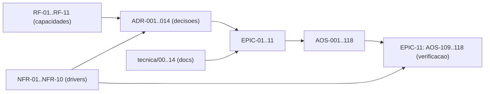

# Matriz de Rastreabilidade de Requisitos (RTM) — AOS

| Campo | Valor |
|---|---|
| Produto | AOS — Agentic OS de Referência |
| Documento | Matriz de Rastreabilidade de Requisitos (RTM) — AOS |
| Versão | 1.0 |
| Data | Julho de 2026 |
| Classificação | Documento de Referência — Aberto |
| Documento-fonte | `_FONTE_agentic-os-ideal.md` |
| Documentos relacionados | `tecnica/00_Arquitectura_Solucao.md`, `specs/00_System_Spec.md`, `specs/01_Engineering_Standards_e_Handoff.md`, `specs/EPIC-01_Fundacoes_Plano_Controlo.md` … `specs/EPIC-11_Testes_Qualidade.md` |

---

## 1. Introdução

### 1.1 Propósito

Este documento é a **Matriz de Rastreabilidade de Requisitos** (*Requirements Traceability Matrix*, RTM) do AOS. Fecha três lacunas identificadas na auditoria de coerência do conjunto documental — **COMP-02** (ausência de identificadores estáveis de requisito), **COMP-04** (ausência de matriz decisão→implementação verificável) e **RAST** (ausência de *back-link* do documento técnico para o ticket que o realiza). Estabelece, num único artefacto:

1. um **catálogo de Requisitos Funcionais** (RF-NN) com identificadores estáveis, derivados das capacidades funcionais de `specs/00_System_Spec.md` §4;
2. um **catálogo de Requisitos Não-Funcionais** (NFR-NN) derivados dos *drivers* de `specs/00_System_Spec.md` §7 e do `_BRIEF` §4;
3. a **matriz ADR × ticket** (que tickets `AOS-NNN` implementam cada decisão de arquitectura), obtida por análise directa do corpus;
4. a **matriz NFR × ticket de verificação** (que tickets provam cada alvo quantitativo);
5. o **rasto descendente** documento-técnico → epic → tickets;
6. as **lacunas de cobertura** conhecidas.

### 1.2 Âmbito

A rastreabilidade cobre os 14 ADRs canónicos (`_BRIEF` §3), as 11 capacidades funcionais (`specs/00` §4), os 10 *drivers* não-funcionais (`specs/00` §7) e os **118 tickets** `AOS-001`–`AOS-118` distribuídos por 11 epics. Os dados das matrizes ADR×ticket e NFR×ticket foram extraídos por análise textual dos ficheiros `specs/EPIC-*.md` (correspondência dos códigos `ADR-0NN` e `AOS-NNN` por bloco de ticket), não por atribuição editorial *a posteriori*.

### 1.3 Audiência

Gestão de produto e de programa (cobertura e priorização), arquitectura (verificação de que cada decisão tem implementação), QA (que teste prova cada NFR) e auditoria/conformidade (cadeia decisão→controlo→evidência).

### 1.4 Definições

- **Requisito Funcional (RF):** uma capacidade observável que o sistema deve oferecer.
- **Requisito Não-Funcional (NFR):** uma propriedade de qualidade com **alvo mensurável** (limiar, SLO).
- **Rasto ascendente:** de um ticket/teste para o requisito ou decisão que o motiva.
- **Rasto descendente:** de um requisito/decisão/documento para os artefactos que o realizam.
- **Sub-cobertura:** requisito ou ADR com número de tickets de implementação anormalmente baixo face à sua criticidade — sinal para revisão, não defeito automático.

### 1.5 Princípios/decisões aplicáveis (ADRs)

Este documento não introduz decisões de arquitectura; **rastreia** as 14 existentes (ADR-001 a ADR-014, `_BRIEF` §3). Referencia-as sempre por código.

---

## 2. Catálogo de Requisitos Funcionais (RF)

Derivados de `specs/00_System_Spec.md` §4 (capacidades top-level) e alinhados com o mapa capacidade→componente→epic de §8. Cada RF tem identificador **estável** — não reordenar nem reciclar.

| RF | Requisito funcional | Componente(s) | Epic(s) | ADRs de suporte |
|---|---|---|---|---|
| **RF-01** | Executar agentes com durabilidade (loop montar→chamar→despachar→verificar sobre execução durável, com *replay* e *resume-from-step*) | RT, SCH, ES | EPIC-02 | ADR-001, ADR-007, ADR-010 |
| **RF-02** | Mediar toda a acção num gate único que aplica identidade, política, orçamento, egress e audit | RM, PDP | EPIC-01 | ADR-002, ADR-011 |
| **RF-03** | Orquestrar trabalho: decompor objectivos em grafo de tarefas acíclico, delegar a sub-agentes, escalonar com *leases* e *backpressure* | ORQ, SCH | EPIC-03 | ADR-001, ADR-008 |
| **RF-04** | Gerir identidade e autoridade: emitir tokens *scoped/time-bound* e manter cadeia de delegação até um humano | GOV, RM | EPIC-01, EPIC-09 | ADR-003 |
| **RF-05** | Isolar execução: microVM por execução, rede *default-deny*, *credential broker* server-side | SBX, BRK | EPIC-07 | ADR-004, ADR-006, ADR-005 |
| **RF-06** | Gerir memória: quatro tipos (episódica/semântica/procedural/trabalho) com proveniência e migrações expand/contract | MEM, ES | EPIC-04 | ADR-007, ADR-011 |
| **RF-07** | Governar por política: *policy-as-code* PDP/PEP, autonomia L0–L5, conformidade GDPR/EU AI Act | GOV, PDP | EPIC-09 | ADR-011, ADR-014 |
| **RF-08** | Observar e auditar: trajectória completa em OTel GenAI, *replay* determinístico, audit *hash-chain* + WORM | OBS, ES | EPIC-08 | ADR-010 |
| **RF-09** | Controlar orçamento: *admission control* global em tokens/$, *circuit breaker*, roteamento *cost/load-aware* | SCH, GW | EPIC-03, EPIC-06 | ADR-008, ADR-009 |
| **RF-10** | Controlo bidireccional: pausar→corrigir→retomar, aprovação de plano, gates SA-ROC | RT, GOV | EPIC-09 | ADR-013 |
| **RF-11** | Evoluir com rede: SemVer + *eval-gate* + *canary* + ratificação assinada para auto-modificação | REG, OBS | EPIC-05, EPIC-11 | ADR-012 |

**Total: 11 requisitos funcionais (RF-01 … RF-11).**

---

## 3. Catálogo de Requisitos Não-Funcionais (NFR)

Derivados dos *drivers* canónicos (`_BRIEF` §4 / `specs/00` §7) e dos KPIs/SLOs (`specs/00` §14). Cada NFR tem **alvo mensurável**, **mecanismo** e **ADR de origem**.

| NFR | Requisito não-funcional | Alvo (SLO/limiar) | Mecanismo | ADR de origem |
|---|---|---|---|---|
| **NFR-01** | Latência de avaliação do PDP (p95) | **< 15 ms** (só avaliação de política) | Política compilada avaliada em memória | ADR-002, ADR-011 |
| **NFR-02** | Cold-start de sandbox | **< 125 ms** (restore 5–30 ms) | microVM snapshot + pool pré-aquecido | ADR-004 |
| **NFR-03** | Cache-hit-rate de prompt | **> 80%** (SLI, com alerta de *thrash*) | Layout cache-estável (prefixo imutável + tail append-only) | ADR-009 |
| **NFR-04** | Disponibilidade do plano de controlo | **99,9%** | Event Store replicado; workers stateless; sem SPOF | ADR-007 |
| **NFR-05** | Durabilidade de execução | Entrega **at-least-once** com idempotência downstream — **0 efeitos observáveis duplicados** | Idempotency key = f(run_id, step_id) propagada + saga de compensação | ADR-001 |
| **NFR-06** | Fidelidade de replay | **100%** dos passos reproduzíveis | Captura de inputs não-determinísticos + hash de prompt + manifesto | ADR-010 |
| **NFR-07** | Overhead total de mediação por *tool call* | Orçamento **decomposto por sub-passo** (PDP + CAS de admissão + broker→vault + append ES + egress/DNS); alvo agregado a ratificar por benchmark | Mediação transversal instrumentada | ADR-002 |
| **NFR-08** | Isolamento de segredos | Agente **nunca** vê segredo downstream | Credential broker JIT server-side, TTL curto, revogável | ADR-006 |
| **NFR-09** | Conformidade regulatória | GDPR / EU AI Act **por desenho**; DSAR (Art. 17) satisfeito sem quebrar o log encadeado | Crypto-shredding + TTL + redação PII + PDP + HITL efectivo | ADR-011, ADR-013 |
| **NFR-10** | Segurança de auto-evolução | **0** auto-modificações não avaliadas em produção | Eval-gate como *admission control* (staging→eval→canary→ratificação) | ADR-012 |

**Total: 10 requisitos não-funcionais (NFR-01 … NFR-10).**

---

## 4. Matriz ADR × ticket

Para cada ADR-001…014, os tickets `AOS-NNN` cujo bloco de especificação o cita explicitamente (extracção por correspondência textual sobre `specs/EPIC-*.md`) e o(s) documento(s) técnico(s) que o desenvolvem. A coluna **Nº** é a contagem de tickets implementadores distintos.

| ADR | Decisão | Nº | Tickets `AOS-NNN` que o implementam | Doc(s) técnico(s) |
|---|---|---|---|---|
| **ADR-001** | Execução durável como primitivo | 25 | AOS-002, 013–026, 029, 041, 043, 079, 099, 102, 106, 111, 112, 118 | `tecnica/02`, `tecnica/03` |
| **ADR-002** | Reference Monitor mandatório | 19 | AOS-003, 013, 021, 025, 026, 034, 045, 051, 054, 055, 064, 069, 071, 074, 076, 087, 099, 113, 117 | `tecnica/01`, `tecnica/12` |
| **ADR-003** | Identidade não-humana por agente ⚠ | 9 | AOS-005, 006, 025, 026, 034, 057, 071, 073, 097 | `tecnica/01`, `tecnica/09` |
| **ADR-004** | Isolamento ao nível do kernel | 10 | AOS-046, 064, 065, 066, 067, 068, 075, 098, 103, 117 | `tecnica/07`, `tecnica/10` |
| **ADR-005** | Separação control/data-plane + taint | 12 | AOS-013, 023, 039, 042, 044, 046, 049, 054, 069, 071, 075, 117 | `tecnica/07` |
| **ADR-006** | Credential Broker com tokens JIT | 12 | AOS-048, 051, 055, 056, 057, 064, 070, 073, 075, 093, 098, 101 | `tecnica/07`, `tecnica/12` |
| **ADR-007** | Event Store replicado | 15 | AOS-001, 002, 015, 022, 027, 030, 035, 038, 045, 098, 099, 100, 101, 102, 118 | `tecnica/04`, `tecnica/13`, `tecnica/10` |
| **ADR-008** | Admission control global em tokens/$ | 20 | AOS-008, 026, 027, 028, 029, 030, 031, 032, 033, 034, 037, 059, 062, 063, 078, 080, 105, 106, 107, 116 | `tecnica/03`, `tecnica/06` |
| **ADR-009** | Layout de prompt cache-estável | 12 | AOS-013, 015, 037, 043, 044, 047, 050, 055, 060, 061, 085, 086 | `tecnica/06`, `tecnica/02` |
| **ADR-010** | Observabilidade OTel GenAI + audit WORM | 47 | AOS-011, 013, 016, 024, 025, 034, 036, 038, 048, 051, 055, 057–062, 064, 065, 072, 076–086, 088, 093, 096, 097, 099–105, 107, 111, 114, 115, 118 | `tecnica/08`, `tecnica/13` |
| **ADR-011** | Policy-as-code + GDPR por desenho | 27 | AOS-004, 035, 038, 039, 044, 055, 057, 058, 063, 067, 071, 079, 083, 087, 088, 091–095, 097, 098, 100, 101, 102, 106, 113 | `tecnica/09`, `tecnica/14`, `tecnica/12` |
| **ADR-012** | SemVer + eval-gate para auto-modificação | 18 | AOS-035, 040, 041, 044, 045, 047–054, 084, 096, 106, 114, 115 | `tecnica/11`, `tecnica/05` |
| **ADR-013** | Gates de risco SA-ROC + controlo bidireccional | 8 | AOS-017, 019, 023, 067, 074, 075, 089, 095 | `tecnica/09` |
| **ADR-014** | Taxonomia de autonomia L0–L5 ⚠⚠ | 3 | AOS-022, 089, 090 | `tecnica/09` |

**Cobertura: 14/14 ADRs têm ≥ 1 ticket implementador.** Símbolos: ⚠ sub-coberto (rever), ⚠⚠ sub-coberto crítico.

- **ADR-014 (L0–L5) — sub-cobertura crítica:** apenas 3 tickets. A taxonomia de autonomia graduada e a promoção/demoção por fiabilidade medida estão concentradas em AOS-089 (gates SA-ROC) e AOS-090 (níveis de autonomia); AOS-022 toca-a por via da *engine* de durable execution. Recomenda-se ticket dedicado à **medição de fiabilidade** (erro <2%/30 dias) e à **demoção automática em anomalia** — ver §7.
- **ADR-003 (identidade NHI) — vigiar:** 9 tickets, aceitável mas com dependência forte de AOS-005/006; a rotação/revogação de tokens e a auditoria da cadeia de delegação beneficiariam de reforço explícito.
- **ADR-010** é transversal por natureza (instrumentação atravessa quase todos os epics), o que explica os 47 tickets; não é sobre-cobertura mas ubiquidade.

---

## 5. Matriz NFR × ticket de verificação

Para cada NFR, o(s) ticket(s) que o **testam/verificam** com o limiar respectivo. Os testes de domínio residem em EPIC-11 (`specs/EPIC-11_Testes_Qualidade.md`) e são os *gates* 3, 4, 7, 8 e 9 do *pipeline* fail-closed (`specs/01` §4); alguns limiares são também medidos em produção via SLIs de EPIC-08.

| NFR | Alvo | Ticket(s) de verificação | Como se prova |
|---|---|---|---|
| **NFR-01** | PDP p95 < 15 ms | AOS-113 (testes de política), AOS-116 (carga/escala) | Benchmark de avaliação de política sob carga; p95 reportado como sinal |
| **NFR-02** | Cold-start < 125 ms | AOS-065 (pool microVM snapshot/restore), AOS-116 | AOS-065 fixa o alvo <125 ms; AOS-116 valida sob concorrência |
| **NFR-03** | Cache-hit > 80% | AOS-085 (SLIs/SLOs), AOS-086 (alertas), AOS-115 (trace-diffing) | SLI de *prefix caching* com alerta de *thrash*; regressão apanhada por trace-diff |
| **NFR-04** | Disponibilidade 99,9% | AOS-118 (DR/replay e2e), AOS-116 | Falha de nó → promoção de réplica → *resume-from-step* sem perda |
| **NFR-05** | 0 efeitos duplicados | AOS-112 (idempotência por passo), AOS-118 | Injecção de crash por passo; ausência de efeito duplicado no retry |
| **NFR-06** | Replay 100% | AOS-111 (replay determinístico), AOS-118 | Reprodução passo-a-passo vs. baseline; `Replay-fidelity` |
| **NFR-07** | Overhead de mediação (orçamento por sub-passo) | AOS-116 | Decomposição do overhead p95 por sub-passo sob saturação |
| **NFR-08** | Agente nunca vê segredo | AOS-117 (red-team adversarial) | Tentativa de exfiltração de credencial downstream falha |
| **NFR-09** | GDPR/EU AI Act; DSAR Art. 17 | AOS-113 (política), AOS-091/092 (crypto-shredding/TTL, EPIC-09) | DSAR satisfeito por crypto-shredding sem quebrar o log encadeado |
| **NFR-10** | 0 auto-mods não avaliadas | AOS-114 (eval harness + golden-sets), AOS-115 (trace-diffing) | Eval-gate barra promoção sem *golden-set* aprovado |

**Cobertura: 10/10 NFRs têm ≥ 1 ticket de verificação.** Nota: NFR-07 depende de um único ticket (AOS-116) e de um alvo agregado ainda **a ratificar por benchmark** — ver §7.

---

## 6. Rasto descendente: documento técnico → epic → tickets

O *back-link* que faltava (RAST). Cada documento de `tecnica/` mapeia para o(s) epic(s) e a gama de tickets que o realizam. As gamas por epic seguem `_BRIEF` §8.

| Doc técnico | Epic(s) implementador(es) | Gama de tickets |
|---|---|---|
| `tecnica/00_Arquitectura_Solucao.md` | Todos (transversal) | AOS-001 – AOS-118 |
| `tecnica/01_Reference_Monitor_Plano_Controlo.md` | EPIC-01 | AOS-001 – AOS-012 |
| `tecnica/02_Agent_Runtime_Execucao_Duravel.md` | EPIC-02 | AOS-013 – AOS-024 |
| `tecnica/03_Orquestracao_Escalonamento.md` | EPIC-03 | AOS-025 – AOS-034 |
| `tecnica/04_Memoria_Persistencia.md` | EPIC-04 | AOS-035 – AOS-044 |
| `tecnica/05_Skill_Tool_Registry_Supply_Chain.md` | EPIC-05 | AOS-045 – AOS-054 |
| `tecnica/06_Model_Gateway_Custos.md` | EPIC-06 | AOS-055 – AOS-063 |
| `tecnica/07_Seguranca_Isolamento.md` | EPIC-07 | AOS-064 – AOS-075 |
| `tecnica/08_Observabilidade_Evals.md` | EPIC-08 | AOS-076 – AOS-086 |
| `tecnica/09_Governacao_Conformidade.md` | EPIC-09 | AOS-087 – AOS-097 |
| `tecnica/10_Topologia_Implantacao_Operacao.md` | EPIC-10, EPIC-11 | AOS-098 – AOS-108 (+ AOS-118) |
| `tecnica/11_Convencoes_Engenharia_Evolucao.md` | EPIC-11 (+ EPIC-05 auto-mod) | AOS-109 – AOS-118 (+ AOS-045–054) |
| `tecnica/12_Contratos_de_Interface.md` | EPIC-01, EPIC-05, EPIC-06 | AOS-003, 004 (portas RM↔PDP), AOS-045–054, AOS-055–063 |
| `tecnica/13_Modelo_Dados_Eventos.md` | EPIC-04, EPIC-05, EPIC-08 | AOS-035–044, AOS-045–054, AOS-076–086 |
| `tecnica/14_Matriz_Conformidade.md` | EPIC-08, EPIC-09 | AOS-072, 076–097 |

---

## 7. Lacunas de cobertura

Sinalizadas a partir dos dados reais das §§4–5. Cada lacuna deve gerar ticket ou nota de decisão explícita.

| ID | Lacuna | Evidência | Acção recomendada |
|---|---|---|---|
| GAP-01 | **ADR-014 (L0–L5) sub-coberto** — 3 tickets, sem ticket dedicado à métrica de fiabilidade nem à demoção automática | §4 | Criar ticket em EPIC-09 para medição de erro <2%/30 dias e demoção automática por anomalia |
| GAP-02 | **NFR-07 (overhead de mediação) sem alvo ratificado** — depende só de AOS-116; alvo agregado "a ratificar por benchmark" | §3, §5 | Ratificar orçamento por sub-passo com benchmark e fixar SLO numérico |
| GAP-03 | **ADR-003 concentrado** — rotação/revogação de token e auditoria da cadeia dependem de AOS-005/006 | §4 | Reforçar critérios de aceitação de rotação/revogação e auditoria NHI |
| GAP-04 | **RF-10 (controlo bidireccional) magro em verificação** — não há ticket de teste dedicado a steer/interrupt e aprovação-de-plano além de AOS-117 (segurança) | §5 | Adicionar caso de teste e2e de pausar→corrigir→retomar em EPIC-11 |
| GAP-05 | **Ausência de coluna de estado** — a RTM regista cobertura de *especificação*, não de *implementação concluída* (nenhum ticket tem estado Done/WIP no corpus) | §4–5 | Ligar a RTM ao *tracker* (estado por ticket) na próxima revisão |
| GAP-06 | **NFR-09 (DSAR) verificado indirectamente** — provado por AOS-091/092 + AOS-113, sem teste e2e de DSAR sobre log encadeado | §5 | Criar teste e2e de crypto-shredding preservando integridade hash-chain |

Nenhum ADR e nenhum NFR está **sem** cobertura mínima: 14/14 ADRs e 10/10 NFRs têm pelo menos um ticket associado. As lacunas acima são de **profundidade e verificação**, não de ausência total.

---

## 8. Vista de qualidade

A RTM serve sobretudo as dimensões **Governação** (prova auditável de que cada decisão tem realização), **Manutenção evolutiva** (impacto de alterar um ADR é visível na coluna de tickets) e **Observabilidade** (ligação requisito→SLI→teste). É um artefacto vivo: cada novo ticket ou ADR deve actualizar as §§4–6 na mesma *pull request*.

## 9. Riscos e mitigações

| Risco | Impacto | Mitigação |
|---|---|---|
| RTM diverge do corpus (drift) | Rastreabilidade falsa | Regenerar §§4–5 por *script* de grep em CI; falhar o *build* se um ADR ficar a 0 tickets |
| Contagem confundida com conclusão | Falsa sensação de "feito" | GAP-05: coluna de estado ligada ao tracker |
| ID de requisito reciclado | Referências partidas | RF/NFR são **append-only**; nunca reordenar nem reutilizar |

---

## 10. Glossário

- **RTM (Requirements Traceability Matrix):** matriz que liga requisitos a decisões, implementação e verificação, em ambos os sentidos.
- **Rasto ascendente / descendente:** navegação da evidência para o requisito / do requisito para a evidência.
- **RF / NFR:** requisito funcional (capacidade) / não-funcional (propriedade de qualidade com alvo mensurável).
- **Sub-cobertura:** número de implementadores anormalmente baixo face à criticidade — sinal de revisão.
- **ADR (Architecture Decision Record):** registo de decisão de arquitectura; no AOS, ADR-001…014 (`_BRIEF` §3).
- **SLO / SLI:** objectivo / indicador de nível de serviço (ex.: PDP p95 < 15 ms, cache-hit > 80%).
- **Gate fail-closed:** etapa de CI que, em falha ou dúvida, **bloqueia** a promoção (`specs/01` §4).
- **Eval-gate:** *admission control* da auto-modificação baseado em *golden-sets* (ADR-012).

---

## 11. Tabela de aprovação

| Papel | Nome | Assinatura | Data |
|---|---|---|---|
| Arquitecto de Plataforma |  |  |  |
| Responsável de Segurança |  |  |  |
| Responsável de Produto |  |  |  |

### Controlo de versões

| Versão | Data | Descrição | Autor |
|---|---|---|---|
| 1.0 | Julho 2026 | Emissão inicial | Equipa AOS |
