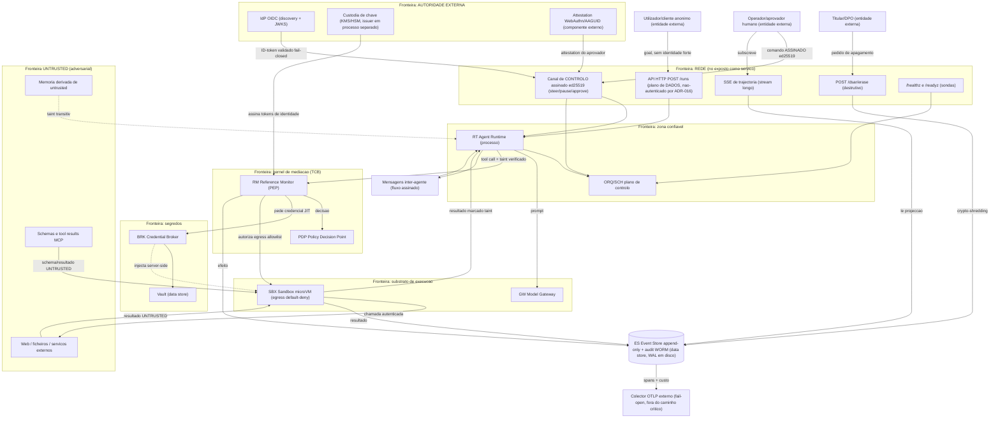

# Análise STRIDE por Fronteira de Confiança — AOS

| Campo | Valor |
|---|---|
| Produto | AOS — Agentic OS de Referência |
| Documento | Técnica — Análise STRIDE por Fronteira de Confiança |
| Versão | 2.2 |
| Data | Julho de 2026 |
| Classificação | Documento de Referência — Aberto |
| Documento-fonte | `_FONTE_agentic-os-ideal.md` |
| Documentos relacionados | `tecnica/07_Seguranca_Isolamento.md`, `tecnica/00_Arquitectura_Solucao.md`, `tecnica/01_Reference_Monitor_Plano_Controlo.md`, `tecnica/09_Governacao_Conformidade.md`, `tecnica/10_Topologia_Implantacao_Operacao.md`, `tecnica/16_Rastreabilidade_RTM.md`, `specs/EPIC-07_Seguranca_Isolamento.md`, `specs/EPIC-15_No_AOS_Runtime_Deployavel.md`, `specs/EPIC-16_Autoridade_Identidade_Real_D4.md` |

---

## 1. Introdução

### 1.1 Propósito

Este documento fornece a **decomposição STRIDE por fronteira de confiança** do AOS — Agentic OS de Referência. Complementa o modelo de ameaças de `tecnica/07_Seguranca_Isolamento.md` (alinhado com OWASP LLM Top 10 e OWASP Agentic Security Initiative — ASI) com uma análise **elemento-a-elemento**, categoria-a-categoria, no formato clássico de *threat modelling* de Microsoft: **S**poofing, **T**ampering, **R**epudiation, **I**nformation disclosure, **D**enial of service, **E**levation of privilege. Enquanto `tecnica/07` responde à pergunta «que vectores de ataque existem e que controlo os neutraliza?», este documento responde a «para cada elemento e fluxo do sistema, que ameaça surge em cada uma das seis categorias STRIDE, que controlo AOS a mitiga (componente/mecanismo + ADR), **que ticket a rastreia e em que estado esse ticket está**?».

A coluna **Estado** é parte do propósito, não um adorno: uma mitigação com ticket correcto mas não implementada não é uma mitigação — é um plano. Este documento distingue as duas coisas explicitamente (§1.5).

### 1.2 Âmbito

Cobre um **diagrama de fluxo de dados (DFD)** com as fronteiras de confiança do AOS e a análise STRIDE de **dezoito** elementos/fluxos críticos (109 linhas de ameaça), em dois blocos:

- **Bloco A — kernel de agentes (§4.1–§4.9):** Agent Runtime (RT), Reference Monitor (RM), Policy Decision Point (PDP), Credential Broker + Vault (BRK), Event Store (ES), Sandbox Substrate (SBX), Model Gateway (GW), mensagens inter-agente, e a fronteira de conteúdo *untrusted* (tool results, web, memória, schemas MCP).
- **Bloco B — o nó exposto como serviço de rede (§4.10–§4.18):** ingresso da API HTTP (`POST /runs`), canal de controlo autenticado (`steer`/`pause`/`approve`), SSE de trajectória, DSAR/apagamento (`POST /dsar/erase`), autoridade de identidade externa (OIDC + custódia de chave), attestation de dispositivo (WebAuthn/AAGUID) e 4-eyes, exporter OTLP, contentor e supply-chain do nó, e substrato durável (WAL/WORM em disco).

O Bloco B é a **enactação da emenda 1.2 da Carta** (`specs/00_AOS_Carta.md`), que mandou reavaliar o modelo de ameaça quando a forma do produto passou a ser um **nó deployável exposto como serviço de rede** e não apenas um conjunto de bibliotecas. Até à versão 1.0 deste documento essa superfície não estava analisada.

Cada ameaça liga ao vector OWASP LLM/ASI já mapeado em `tecnica/07` onde aplicável. Fica fora do âmbito o detalhe de implementação de cada controlo (remetido para os documentos especializados) e a matriz de conformidade regulatória (ver `tecnica/14`).

### 1.3 Audiência

Engenheiros de segurança, arquitectos de plataforma, red teams e auditores que precisem de verificar a cobertura de ameaças fronteira-a-fronteira antes de habilitar autonomia, e de rastrear cada mitigação até um ticket executável **e ao seu estado real**.

### 1.4 Definições e termos

- **Fronteira de confiança (*trust boundary*):** superfície onde os dados ou o controlo mudam de nível de confiança — por exemplo, a saída de conteúdo *untrusted* da microVM para o planeador, ou a passagem de um token *scoped* para credencial downstream.
- **STRIDE:** taxonomia de seis classes de ameaça, cada uma a negação de uma propriedade de segurança (autenticidade, integridade, não-repúdio, confidencialidade, disponibilidade, autorização).
- **DFD:** *data flow diagram* — grafo de processos, arquivos de dados, entidades externas e fluxos, particionado por fronteiras de confiança.
- **TCB:** *trusted computing base* — o conjunto de componentes cujo comprometimento anula as garantias (aqui: RM, PDP, BRK, ES).

### 1.5 Legenda da coluna «Estado» — e o que ela não afirma

Cada linha declara o estado **do controlo no caminho que a linha descreve**, não a existência de código algures na árvore. Um controlo implementado num módulo mas **não ligado ao nó** não conta como entregue para uma linha do Bloco B.

| Estado | Significado |
|---|---|
| **entregue** | O controlo existe no repositório, está composto no caminho descrito e tem testes. Quando o alcance é menor do que a linha sugere, o alcance real vem entre parênteses. |
| **por-fazer** | O ticket existe no backlog e o controlo **não** está activo no caminho descrito. Inclui o caso «existe no módulo, inerte no nó». |
| **deferido-com-eixo** | Adiamento **deliberado e registado**, com o eixo (ticket ou epic) que o resolve nomeado na própria célula. Não é o mesmo que «por-fazer»: há decisão, não esquecimento. |
| **entregue no módulo / por-fazer no nó** | Forma **composta**, não um quarto estado independente: o controlo existe e é testado no módulo, mas **não está ligado ao caminho do nó**. Para efeitos de contagem conta como **por-fazer** na linha em que aparece (é o caso explícito da regra acima); a menção ao módulo serve para não perder o crédito do que existe. Usada em §4.5-D, §4.6-I, §4.9-I e §4.15-E. |

Verificação de rastreabilidade: cada `AOS-NNN` citado abaixo foi confrontado com o **título do ticket** na sua epic (`specs/EPIC-*.md`). A versão 1.0 deste documento tinha a coluna «Ticket» sistematicamente desviada 1–2 posições contra `specs/EPIC-07`; a versão 2.0 corrige-a integralmente (achado STR-01, AOS-194).

**Limite desta verificação (declarado, não escondido):** a conferência ticket↔título foi feita **manualmente** e não é reproduzível por um terceiro sem a repetir. Enquanto a verificação não existir em `scripts/ci/ref-lint.py` (proposta de AOS-194, ainda não aplicada), esta coluna pode voltar a derivar sem detecção — que é exactamente o modo de falha que originou STR-01. Uma segunda ressalva de honestidade: **um ticket citado no domínio certo não garante que o ticket possua o mecanismo descrito na célula**; onde o mecanismo não tem dono no backlog, a célula di-lo com `—` e «sem ticket» em vez de o imputar ao ticket mais próximo.

---

## 2. Princípios e decisões aplicáveis (ADRs)

| ADR | Decisão | Contributo para esta análise |
|---|---|---|
| ADR-002 | **Reference Monitor mandatório** | Concentra a mitigação de *Elevation of privilege* e *Repudiation* de toda a tool call num único gate (PEP). Ver `tecnica/01`. |
| ADR-003 | **Identidade não-humana por agente** | Base contra *Spoofing* e *confused deputy*; autoridade = utilizador ∩ classe. Ver `tecnica/09`. |
| ADR-004 | **Isolamento ao nível do kernel** | Mitiga *Elevation of privilege* (evasão do sandbox) e *Information disclosure* (egress) na fronteira do substrato. |
| ADR-005 | **Separação control/data-plane + taint** | Mitiga *Tampering* do fluxo de controlo por conteúdo untrusted (prompt injection, OWASP LLM01/ASI01). |
| ADR-006 | **Credential Broker com tokens JIT** | Mitiga *Information disclosure* de segredos e *Elevation of privilege* por reutilização de credenciais. |
| ADR-010 | **Observabilidade OTel + audit WORM** | Mitiga *Repudiation* de forma transversal via audit hash-chain + WORM. |
| ADR-013 | **Gates de risco SA-ROC** | Governa a escalada a HITL por sensibilidade + egress + reversibilidade. Governa **acções de agente**, não APIs administrativas (ver §4.13). |
| ADR-016 | **Fronteira de confiança da camada de UI** | Separa o plano de **dados** (submissão de goal, não-autenticada por desenho) do plano de **controlo** (autenticado, assinado, *non-signing* no servidor). Base do Bloco B. |
| ADR-017 | **Supply-chain do nó** | Binário zero-dep reprodutível, imagem distroless/non-root/read-only, SBOM + proveniência. Base de §4.17. |
| ADR-018 | **Fronteira nó↔ORQ/SCH** | O loop de serviço é a fonte única de verdade do ciclo de vida (v1 single-host). |

---

## 3. Diagrama de fluxo de dados (DFD) com fronteiras de confiança

O DFD abaixo particiona o AOS por fronteiras de confiança (subgrafos tracejados): a **fronteira de rede** (o nó exposto como serviço — API HTTP, SSE, DSAR, sondas), a **zona confiável** (RT → plano de controlo), o **kernel de mediação** (RM + PDP), a **fronteira de segredos** (BRK/Vault), o **substrato de execução** (SBX), a **fronteira de autoridade externa** (IdP OIDC, custódia de chave, attestation), a **fronteira de saída de telemetria** (colector OTLP) e a **fronteira untrusted** — de onde chega todo o conteúdo adversarial. O Event Store atravessa as fronteiras como sink append-only de todos os efeitos.

A leitura essencial mantém-se e ganha três invariantes do nó:

1. **tudo o que cruza da fronteira UNTRUSTED para a zona confiável entra marcado com taint** e é estruturalmente impedido de autorizar acções (ADR-005);
2. **tudo o que cruza para a fronteira de segredos passa pelo BRK server-side** e nunca expõe o segredo ao agente (ADR-006);
3. **todo o efeito é gravado no ES** antes ou depois de executar, tornando o repúdio detectável (ADR-010);
4. **o plano de dados e o plano de controlo são fronteiras distintas** (ADR-016): submeter um goal não confere autoridade, e nenhum comando que altere o curso de um run entra sem assinatura verificada;
5. **a autoridade de identidade é um trust-domain separado** — a chave do issuer nunca entra na imagem do nó (ADR-017 ponto 5);
6. **a telemetria é uma saída sem retorno** — nada do que o colector OTLP devolve realimenta uma decisão (fail-open por desenho).

---

## 4. Análise STRIDE elemento-a-elemento

### Bloco A — kernel de agentes

#### 4.1 Agent Runtime (RT) — o loop

| Cat. | Ameaça concreta | Controlo AOS (componente/mecanismo + ADR) | Ticket | Estado |
|---|---|---|---|---|
| **S** | Um processo forja um objectivo em nome de um utilizador que não autenticou. | Identidade NHI *scoped/time-bound* no objectivo inicial; cadeia de delegação on-behalf-of até humano (ADR-003). | AOS-005, AOS-006 | entregue |
| **T** | Prompt injection indirecta (LLM01/ASI01) altera o objectivo do loop via tool result. | Separação control/data-plane + taint; o planeador só opera sobre dados confiáveis (ADR-005; `tecnica/07` §6). | AOS-069, AOS-183 | **por-fazer** (AOS-183: o TaintGate está inerte no nó — conjunto privilegiado vazio ⇒ curto-circuita para *allow*) |
| **R** | O RT nega ter emitido uma tool call. | Cada turno gravado no ES com hash do prompt, model-id e versões (ADR-010). | AOS-011, AOS-072 | entregue |
| **I** | Fuga de contexto sensível entre turnos ou principals. | Contexto ≠ registo (projecção); microVM efémera por execução sem estado residual (ADR-004). | AOS-036, AOS-064, AOS-066 | **deferido-com-eixo** (AOS-036 entregue; os drivers de microVM são skeletons fail-closed — infra real em AOS-103) |
| **D** | Loop infinito / *runaway* consome orçamento agregado. | Admission control global em tokens/$; circuit breaker multi-sinal (ADR-008). | AOS-027, AOS-029, AOS-080 | entregue |
| **E** | O loop tenta chamar tool fora da sua classe de autoridade. | Toda a tool call atravessa o RM (PEP); autoridade = utilizador ∩ classe (ADR-002/003). | AOS-003, AOS-071 | entregue |

#### 4.2 Reference Monitor (RM) — o gate (PEP)

| Cat. | Ameaça concreta | Controlo AOS (componente/mecanismo + ADR) | Ticket | Estado |
|---|---|---|---|---|
| **S** | Chamador não-autenticado tenta invocar o RM directamente. | Mediação total: o RM só aceita chamadas com token NHI válido; sem caminho lateral (ADR-002/003). | AOS-003, AOS-005 | entregue |
| **T** | Adulteração da decisão de política em trânsito RM↔PDP. | Contrato de porta autenticado; política assinada e versionada (ADR-011; `tecnica/12`). | AOS-004, AOS-088 | entregue |
| **R** | Falta prova de *quem autorizou* uma acção. | Audit hash-chained + WORM regista principal, política e decisão por tool call (ADR-010). | AOS-072 | entregue |
| **I** | Vazamento de dados de política ou de escopo nos logs. | Redação de PII na ingestão; audit separado de diagnósticos efémeros (ADR-011). | AOS-091, AOS-188 | entregue (AOS-195 corrige a regressão documental do CA de AOS-188) |
| **D** | Sobrecarga do RM torna-o gargalo (fail-open?). | PDP compilado em memória (p95 < 15 ms); política **fail-closed** por omissão (ADR-002/011). | AOS-004, AOS-087 | entregue |
| **E** | Bypass do gate por um caminho de código que chama tool directamente. | Constrangimento arquitectural: nenhum caminho contorna o RM; verificado em CI por guard-test e lint de fronteiras (ADR-002). | AOS-003, AOS-161, AOS-178 | entregue |

#### 4.3 Policy Decision Point (PDP)

| Cat. | Ameaça concreta | Controlo AOS (componente/mecanismo + ADR) | Ticket | Estado |
|---|---|---|---|---|
| **S** | Injecção de política forjada não-assinada. | Política em git versionada, assinada, com changelog no audit (ADR-011). | AOS-088 | entregue |
| **T** | Alteração da regra Rego/Cedar sem ratificação. | Pipeline com assinatura + revisão; eval-gate para mudança de política (ADR-011/012). | AOS-088, AOS-096 | entregue |
| **R** | Decisão de política sem trilho reproduzível. | Cada avaliação registada com versão de política e inputs (ADR-010). | AOS-072, AOS-083 | entregue |
| **I** | Exfiltração das regras de autorização. | Classificação da política; acesso mediado pelo RM (ADR-011). | AOS-087, AOS-088 | entregue |
| **D** | Política patológica causa avaliação lenta. | Compilação em memória com alvo p95 < 15 ms; prazo fail-closed **de ponta a ponta** (ADR-002/013): o `Monitor.evaluate` verifica `ctx` à entrada e o sink de auditoria recusa selar sob contexto morto (AOS-311 — `audit.FileStore.Append` e `MemStore.Append` verificam `ctx.Err()` antes do lock e antes de `persist`), pelo que um prazo esgotado a meio da cadeia resolve em deny antes do efeito. O **registo desse deny** é o controlo simétrico e não partilha o prazo: `Monitor.fail` grava sob `context.WithoutCancel` com prazo próprio, pelo que a negação por prazo fica no trilho em vez de desaparecer com o contexto que a causou. Excepção declarada: um `ctx` já morto **à entrada** de `Monitor.evaluate` resolve num deny deliberadamente não-auditado (evita uma entrada WORM por cada tool call de uma run abortada). | AOS-004, AOS-113, AOS-311 | entregue (AOS-311 + remediação do registo pós-decisão) |
| **E** | Regra permissiva por defeito concede autoridade excessiva. | Allowlist **default-deny**; autoridade = utilizador ∩ classe (ADR-011/003). | AOS-007, AOS-087, AOS-181 | **por-fazer** no nó (AOS-181: o nó corre com *deny-all* e catálogo vazio, não com o bundle real — ver o aviso de sequência em §5.3) |

#### 4.4 Credential Broker + Vault (BRK)

| Cat. | Ameaça concreta | Controlo AOS (componente/mecanismo + ADR) | Ticket | Estado |
|---|---|---|---|---|
| **S** | Agente falsifica identidade para obter credencial de outro principal. | Token NHI *scoped*; o BRK só troca por credencial dentro do escopo do principal (ADR-003/006). | AOS-070, AOS-005 | entregue |
| **T** | Adulteração do pedido de credencial (escopo alargado). | Pedido mediado pelo RM; escopo derivado da política, não do agente (ADR-002/006). | AOS-070, AOS-003 | entregue |
| **R** | Uso de credencial sem rasto de emissão. | Cada emissão JIT registada no audit (principal, escopo, TTL) (ADR-010). | AOS-072 | entregue |
| **I** | **Exfiltração de segredo pelo modelo** (o agente vê a credencial). | Broker injecta downstream **server-side**; o agente nunca vê o segredo (ADR-006; `tecnica/07` §7.1). | AOS-070 | entregue |
| **D** | Esgotamento do vault por rajada de pedidos. | Mitigante **estrutural**: o pedido é mediado pelo RM (nenhum agente fala directamente com o vault) e o pooling de chaves de infra é ortogonal à identidade, pelo que a rajada não se traduz em emissões distintas (ADR-006). Um **rate-limit explícito no broker** não existe e **não tem dono no backlog** — AOS-070/AOS-057 não o possuem. | AOS-070, AOS-057; rate-limit: — | entregue apenas quanto à mediação; o rate-limit do broker é **por-fazer, sem ticket** |
| **E** | Reutilização de credencial fora de contexto (confused deputy downstream). | TTL curto + escopo + revogação central; credencial destruída após uso (ADR-006; `tecnica/07` §3). | AOS-070, AOS-071 | entregue |

#### 4.5 Event Store (ES) + audit WORM

| Cat. | Ameaça concreta | Controlo AOS (componente/mecanismo + ADR) | Ticket | Estado |
|---|---|---|---|---|
| **S** | Escrita de evento por produtor não-autorizado. | Só o RM/SBX autenticados escrevem; transporte push autenticado (ADR-007). | AOS-002, AOS-009 | entregue |
| **T** | Adulteração do log — *The Audit Log Lied*. | Audit hash-chained + WORM: qualquer alteração quebra a cadeia (ADR-010; `tecnica/07` §7.2). | AOS-072, AOS-083 | entregue |
| **R** | Negação de um efeito já executado. | Log append-only é fonte de verdade; cada efeito encadeado por hash (ADR-007/010). | AOS-002, AOS-072 | entregue |
| **I** | Leitura não-autorizada do trilho (PII histórica). | Redação na ingestão; crypto-shredding por titular; acesso governado (ADR-011). | AOS-091, AOS-093 | entregue (alcance do shredding limitado — ver §5.2-d) |
| **D** | Perda de disponibilidade do log (SPOF single-writer). | Event Store **replicado** + workers stateless eliminam o SPOF **no módulo** (ADR-007). No nó v1 a propriedade **não vigora**: o nó é single-host e single-writer do WORM por ADR-018 — ver §4.18-S, que afirma exactamente isso. | AOS-099, AOS-100, AOS-101 | **entregue no módulo** (AOS-100); **por-fazer no nó** (v1 single-host por ADR-018 — forma composta da §1.5, conta como por-fazer) |
| **E** | Reescrita histórica para forjar autorização. | WORM separado de diagnósticos efémeros; imutável por desenho (ADR-010). | AOS-072, AOS-083 | entregue |

#### 4.6 Sandbox Substrate (SBX) — microVM

| Cat. | Ameaça concreta | Controlo AOS (componente/mecanismo + ADR) | Ticket | Estado |
|---|---|---|---|---|
| **S** | Execução assume identidade de outro principal. | Identidade efémera por execução; microVM destruída no fim (ADR-004). | AOS-064 | **deferido-com-eixo** (skeleton fail-closed `ErrDriverUnavailable`; infra real AOS-103) |
| **T** | Persistência de payload malicioso entre corridas. | FS read-only + overlay efémero descartado; sem estado residual (ADR-004). | AOS-066 | **deferido-com-eixo** (AOS-103) |
| **R** | Efeito de sandbox sem atribuição. | SBX grava resultado como evento append-only no ES (ADR-007/010). | AOS-002, AOS-072 | entregue |
| **I** | **Exfiltração via canal permitido** (padrão CamoLeak, CVSS 9.6). | Egress default-deny + allowlist por identidade + filtragem DNS + content-security (ADR-004; `tecnica/07` §5). | AOS-067, AOS-068 | entregue no módulo; **por-fazer** no nó (o nó não monta o substrato — §5.2-f) |
| **D** | Bomba de recursos esgota o host. | Limites de CPU/mem/IO por microVM; pool com quota; cold-start < 125 ms (ADR-004). | AOS-064, AOS-065 | **deferido-com-eixo** (AOS-103) |
| **E** | **Evasão do sandbox para o host** (sandbox escape). | microVM/gVisor (fronteira de virtualização), seccomp mínimo, sem socket do host; jails só defesa secundária (ADR-004; `tecnica/07` §4). | AOS-064, AOS-066 | **deferido-com-eixo** (AOS-103; §5.2-f) |

#### 4.7 Model Gateway (GW)

| Cat. | Ameaça concreta | Controlo AOS (componente/mecanismo + ADR) | Ticket | Estado |
|---|---|---|---|---|
| **S** | Pedido ao modelo sem principal atribuído (pool anónimo). | Identidade por principal codificada em cada chamada, distinta das chaves de infra *pooled* (ADR-003; `tecnica/06`). | AOS-055, AOS-057 | entregue |
| **T** | Adulteração do prompt em trânsito ou troca de modelo. | **Entregue** a detecção: hash do prompt e model-id gravados no evento, sob contrato de porta (AOS-055/AOS-076) — uma troca de modelo ou de prompt fica **evidente** no trilho. **Por-fazer** a prevenção no transporte: o adaptador HTTP não está endurecido — `http.DefaultClient` continua a ser o fallback quando não se injecta client, e o `BaseURL` não é validado contra esquema `https` nem contra allowlist de egress (ADR-009/010). | AOS-055, AOS-076, AOS-184 | **por-fazer** (AOS-184: os quatro CA estão por satisfazer; a detecção existe, o endurecimento do transporte não — mesma raiz de §5.2-b) |
| **R** | Uso de modelo sem rasto de custo/região. | Cada chamada regista principal, model-id, tokens/custo (AOS-062 custo por chamada, AOS-078 tokens/custo por span) e a **região** de encaminhamento (AOS-058 allowlist regional, AOS-094 soberania por board) (ADR-010). | AOS-062, AOS-078, AOS-058, AOS-094 | entregue |
| **I** | Encaminhamento de dados para região proibida (soberania). | Allowlist regional de modelos; failover proibido de cruzar fronteira (ADR-011). | AOS-058, AOS-094 | entregue |
| **D** | Colapso agregado do rate-limit do provider. | Roteamento cost/load-aware; token-bucket distribuído sobre TPM/RPM real (ADR-008). | AOS-027, AOS-059 | entregue |
| **E** | Acesso a modelo fora da allowlist do principal. | Allowlist regional/por classe aplicada no GW; mediação (ADR-011/002). | AOS-058, AOS-087 | entregue |

#### 4.8 Mensagens inter-agente (A2A)

| Cat. | Ameaça concreta | Controlo AOS (componente/mecanismo + ADR) | Ticket | Estado |
|---|---|---|---|---|
| **S** | Sub-agente forja a origem/autoridade de outro (confused deputy entre agentes). | Identidade criptográfica (NHI); **mensagens assinadas**; hallucination gate autentica origem + autoridade (ADR-003; `tecnica/07` §7.2). | AOS-073, AOS-005 | entregue |
| **T** | Adulteração do conteúdo da mensagem em trânsito. | Assinatura garante integridade; qualquer alteração invalida a mensagem (ADR-003). | AOS-073 | entregue |
| **R** | Emissor nega ter enviado uma instrução. | Assinatura fornece não-repúdio de origem; mensagem registada no ES (ADR-010). | AOS-073, AOS-072 | entregue |
| **I** | Interceptação de mensagem entre agentes. | Canal autenticado; escopo de delegação limita o conteúdo partilhável (ADR-003). | AOS-073, AOS-071 | entregue |
| **D** | Inundação de mensagens satura o receptor. | Backpressure e orçamento hierárquico por árvore de tarefas (ADR-008). | AOS-008, AOS-030 | entregue |
| **E** | Escalada de autoridade via mensagem "de confiança". | Autoridade não deriva da mensagem mas do principal; ressalva: assinatura ≠ veracidade — *grounding* por evals (ADR-003; `tecnica/07` §7.2, `tecnica/08`). | AOS-071, AOS-084, AOS-114 | entregue |

#### 4.9 Fronteira untrusted (tool results / web / MCP / memória)

| Cat. | Ameaça concreta | Controlo AOS (componente/mecanismo + ADR) | Ticket | Estado |
|---|---|---|---|---|
| **S** | Conteúdo forja ser uma "instrução do sistema". | Taint UNTRUSTED em tudo o que chega de tools/web/memória/MCP; tags in-band não são privilégio (ADR-005). | AOS-069 | **por-fazer** no nó (AOS-183) |
| **T** | **Prompt injection** sequestra o fluxo de controlo (LLM01/ASI01). | Separação control/data-plane (dual-LLM/CaMeL); untrusted é dado inerte (ADR-005; `tecnica/07` §6). | AOS-069, AOS-183 | **por-fazer** (§5.2-e — a separação de planos no loop está diferida e apoia-se numa barreira inerte) |
| **R** | Origem do conteúdo não-confiável não rastreada. | Proveniência marcada na memória derivada; taint transitivo registado (ADR-005). | AOS-042 | entregue |
| **I** | Conteúdo malicioso induz exfiltração de dados sensíveis. | Gate de risco por sensibilidade + egress + reversibilidade; egress default-deny (ADR-004/013). | AOS-074, AOS-067 | entregue no módulo; egress no nó ver §5.2-f |
| **D** | Tool result gigante estoura o contexto/custo. | Admission control em tokens (AOS-027) e gestão da janela de contexto (AOS-037) limitam o **custo agregado** e o que entra no prompt (ADR-008). Um **cap de output por tool call**, aplicado no ponto de retorno antes de o resultado ser contabilizado, **não existe e não tem dono no backlog**. | AOS-027, AOS-037; cap de output: — | entregue quanto ao orçamento e à janela; o cap por-chamada é **por-fazer, sem ticket** |
| **E** | **Tool poisoning / rug-pull** de MCP muta schema e escala privilégio. | Registry com pin+hash+assinatura; congelamento por run; revalidação criptográfica a cada chamada (ADR-012; `tecnica/05`, `tecnica/07` §3). | AOS-048, AOS-050, AOS-051 | entregue |
| **E** | **Memory poisoning** (ASI06) envenena decisões futuras. | Proveniência + quarentena de memória derivada de untrusted; taint transitivo; eval-gate de admissão à memória procedural (ADR-005/012). | AOS-042, AOS-189 | entregue |

---

### Bloco B — o nó exposto como serviço de rede

> Enactação da **emenda 1.2 da Carta**. Até à v1.0 deste documento nenhuma destas nove superfícies estava analisada: `grep -i "http\|api\|sse\|dsar\|otlp\|container"` sobre a v1.0 devolvia **zero** ocorrências (achado STR-06, AOS-194).

#### 4.10 Ingresso da API HTTP — `POST /runs` (plano de DADOS)

| Cat. | Ameaça concreta | Controlo AOS (componente/mecanismo + ADR) | Ticket | Estado |
|---|---|---|---|---|
| **S** | Chamador anónimo submete um goal fingindo-se outro principal. | **Decisão, não omissão** (ADR-016): o plano de dados é não-autenticado; submeter **não confere autoridade** — a execução corre sob a identidade emitida pelo issuer, e todo o efeito volta a passar pelo RM. | AOS-166 | entregue (limite de aplicabilidade em §5.2-a) |
| **T** | Adulteração do goal em trânsito. | **Nenhum controlo no processo do nó**: a API serve HTTP em claro; a integridade do transporte depende de um terminador TLS externo. | — | **por-fazer, sem ticket** (§5.2-b) |
| **R** | Submissão sem rasto atribuível. | `RequestID` idempotente; ciclo de vida do run em eventos append-only no ES com selo WORM. | AOS-166, AOS-170 | entregue |
| **I** | A API usada como **oráculo de existência** de runs. | Respostas uniformes e **não-enumeráveis**: mesmo 404 para run inexistente e para acesso negado; um `POST` repetido não distingue 409 de 201; sondas `/healthz`/`/readyz` não consultam dependências nem revelam topologia. | AOS-166, AOS-171 | entregue |
| **D** | Rajada de submissões esgota CPU/memória/orçamento. | Token-bucket de admission em `POST /runs`, tecto de in-flight, `MaxBytesReader` (⇒ 413) e timeouts de read-header/read/write/idle no servidor. | AOS-166, AOS-027 | entregue |
| **E** | Nó exposto na rede com plano de controlo inoperável. | **Bind-guardrail**: `Serve` **recusa com erro** (não avisa) o bind a endereço não-loopback enquanto o canal de controlo não tiver autenticação real **e** pelo menos um operador registado. | AOS-166, AOS-193 | entregue |

#### 4.11 Canal de controlo autenticado — `steer` / `pause` / `approve`

| Cat. | Ameaça concreta | Controlo AOS (componente/mecanismo + ADR) | Ticket | Estado |
|---|---|---|---|---|
| **S** | Terceiro emite um `steer`/`approve` fingindo-se operador. | `Ed25519Authenticator`: assinatura verificada contra a pubkey do `emitterID` registado; emitter desconhecido ⇒ recusa. Registo de operadores por configuração; entrada malformada **aborta o arranque** em vez de degradar para um canal inoperável. | AOS-160, AOS-193 | entregue |
| **T** | **Replay** de um comando de controlo legítimo capturado. | Nonce-store **durável** + janela de frescura; nonce repetido ou fora de janela ⇒ recusa. | AOS-159, AOS-160 | entregue |
| **R** | Aprovador nega ter aprovado um efeito irreversível. | Aprovação assinada sobre o **tuplo (efeito + política)** — o que se assina é o que se vê; selada no WORM; auto-aprovação recusada. | AOS-095, AOS-162 | entregue |
| **I** | Canal de controlo usado para enumerar runs alheios. | Mesmas respostas uniformes não-enumeráveis do plano de dados; sem detalhe de erro interno no corpo. | AOS-166 | entregue |
| **D** | Rajada de assinaturas inválidas esgota CPU em verificação. | Token-bucket **dedicado** do plano de controlo, separado do de dados: o custo criptográfico do controlo não esfomeia o plano de dados nem é esfomeado por ele. | AOS-166 | entregue |
| **E** | Operador aprova fora da sua classe de autoridade. | Autoridade por aprovador (`approve:<classe>`) validada no arranque; aprovador sem capability nunca autoriza; 4-eyes exige principais distintos. | AOS-162, AOS-193 | entregue |

#### 4.12 SSE de trajectória (stream longo)

| Cat. | Ameaça concreta | Controlo AOS (componente/mecanismo + ADR) | Ticket | Estado |
|---|---|---|---|---|
| **S** | Observador não-autorizado subscreve a trajectória de um run alheio. | Read-path soberano fail-closed por-chamador (regra board→região partilhada com o PDP) quando as regiões estão configuradas; sem configuração cai no read-path legado. | AOS-172, AOS-182 | **deferido-com-eixo** (AOS-203 endurece o caso «configuração vazia = kill-switch silencioso») |
| **T** | Injecção ou reordenação de eventos no stream. | `id: <seq>` monotónico; backfill por seq crescente sob watermark; dedup de eventos ao vivo com `seq` já emitido; `X-Accel-Buffering: no` + `nosniff` impedem reescrita por intermediários. | AOS-167 | entregue |
| **R** | Leitura de trajectória sensível sem rasto. | **Selo WORM de leitura** sobre o read-path soberano (quem leu o quê, quando). | AOS-172 | **deferido-com-eixo** (só activo com regiões configuradas; AOS-203) |
| **I** | Fuga de PII pelo corpo dos eventos transmitidos. | Redação de PII na ingestão, antes de o evento existir para o stream. | AOS-091, AOS-188 | entregue (AOS-195 corrige a regressão documental) |
| **D** | Cliente lento ou fan-out elevado esgotam a memória do nó. | Fila FIFO por-ligação; **drop-slow-consumer por progresso de escrita** (write-deadline por escrita, não por profundidade de buffer — elimina o falso-drop de um cliente saudável em backfill longo); tecto de ligações concorrentes de trajectória; o callback da subscrição nunca bloqueia os outros observadores. | AOS-167 | entregue |
| **E** | Stream usado como canal de controlo encoberto. | O SSE é estritamente unidireccional; nenhum efeito é despoletado por dados de retorno — todo o controlo passa pelo canal assinado (§4.11). | AOS-167, AOS-166 | entregue |

#### 4.13 DSAR / apagamento — `POST /dsar/erase` (destrutivo, irreversível)

| Cat. | Ameaça concreta | Controlo AOS (componente/mecanismo + ADR) | Ticket | Estado |
|---|---|---|---|---|
| **S** | Pedido de erasure forjado destrói dados de um titular. | **Lacuna reconhecida:** hoje o endpoint é autorizado por cabeçalhos auto-declarados, mais fraco do que `/pause`. ADR-013 governa acções de agente, não APIs administrativas, pelo que não existe regra que o cubra. A credencial forte do operador DSAR (OIDC/mTLS no IdP de soberania) está deferida para **AOS-205** e reanalisada no próprio ficheiro (`packages/cmd/aos/dsar.go`). | AOS-172, AOS-205 | **deferido-com-eixo** (§5.2-c; DEF-207/DEF-208 do registo) |
| **T** | Alteração do identificador para atingir outro titular. | Aceita apenas **pseudónimo** num charset opaco conservador validado; PII directa nunca entra no pedido. | AOS-172 | entregue |
| **R** | Titular nega ter pedido, ou o nó nega ter apagado. | `received` / `key_destroyed` / `blocked` selados no WORM **sem PII** — a prova do apagamento sobrevive ao apagamento, o que o próprio crypto-shredding não conseguiria remover. | AOS-172, AOS-093 | entregue |
| **I** | O endpoint revela que um titular existe no sistema. | Resposta uniforme; sem PII no corpo; o WORM regista o pseudónimo, não o titular. | AOS-172, AOS-091 | entregue |
| **D** | Rajada de erasures destrutivas. | Admission pelo mesmo token-bucket **dedicado** do plano de controlo. | AOS-166 | entregue |
| **E** | Apagamento contorna um *legal hold* (obrigação de preservação). | O legal hold é **re-consultado imediatamente antes de cada shred**; titular sob hold devolve `blocked` e não é apagado. | AOS-172, AOS-092 | entregue |

> **Fronteira de cobertura declarada:** o crypto-shredding destrói a KEK por-titular do vault; o conteúdo dos runs persistido pelo Event Store é hoje texto-claro não cifrado por titular, pelo que **não** é tornado ilegível pela erasure. Ver §5.2-d.

#### 4.14 Autoridade de identidade externa (OIDC + custódia de chave)

| Cat. | Ameaça concreta | Controlo AOS (componente/mecanismo + ADR) | Ticket | Estado |
|---|---|---|---|---|
| **S** | ID-token forjado ou IdP falsificado autentica um humano inexistente. | `HumanDirectory` OIDC real: discovery + JWKS + validação de assinatura/emissor/audiência/expiração, **fail-closed**, só stdlib. | AOS-174 | entregue |
| **T** | Envenenamento ou rotação hostil do JWKS. | JWKS obtido do discovery do emissor configurado; `kid` desconhecido ⇒ recusa (nunca *best-effort*). | AOS-174 | entregue |
| **R** | Binding humano↔NHI sem prova de quem autorizou. | Registo append-only do binding, **sem PII**, formalizado em ADR-003. | AOS-176 | entregue |
| **I** | Chave privada do issuer exposta no processo/imagem do nó. | Custódia externa: `crypto.Signer` com issuer em **processo separado** (contrato KMS/HSM); a chave nunca entra na imagem (ADR-017 ponto 5); modo trust-anchor-only. | AOS-175, AOS-168 | entregue (o modo de referência co-localizado é declarado no banner de arranque, não escondido) |
| **D** | Indisponibilidade do IdP paralisa o nó. | Fail-closed deliberado para **autoridade nova**; runs em curso não dependem do IdP. A persistência da chave do issuer entre reinícios — sem a qual uma chave nova por boot invalidaria todos os tokens emitidos — existe mas é **opt-in**. | AOS-174, AOS-170, AOS-203 | entregue (persistência **só com `AOS_ISSUER_KEY_PATH` definido**, e só no modo de referência co-localizado; por omissão a autoridade gera chave nova por boot — mesmo padrão «variável de ambiente como interruptor silencioso» de §5.2-g, coberto por AOS-203) |
| **E** | Token de humano reutilizado para obter autoridade de agente. | Autoridade = utilizador ∩ classe; a cadeia de delegação on-behalf-of restringe, nunca amplia, o escopo. | AOS-006, AOS-071 | entregue |

#### 4.15 Attestation de dispositivo (WebAuthn/AAGUID) e 4-eyes

| Cat. | Ameaça concreta | Controlo AOS (componente/mecanismo + ADR) | Ticket | Estado |
|---|---|---|---|---|
| **S** | Aprovação emitida por autenticador de software fingindo-se hardware. | Verificação de attestation WebAuthn com **AAGUID** contra a lista vetada, entregue no componente de autoridade **externo** (AOS-177) para o nó continuar zero-dep. **No binário do nó a porta `DeviceAttestationVerifier` não é composta**: o par attestation/clientData é transportado no wire da perna de aprovação e **não é verificado** — um autenticador de software não é vetado pelo nó. | AOS-177 | **deferido-com-eixo** (entregue no componente externo; a ligação da porta ao nó pertence a **AOS-177** — DEF-106 do registo —, coerente com a Carta emenda 1.3 — ver §5.2-h) |
| **T** | A assinatura cobre um efeito diferente do exibido ao aprovador. | WYSIWYS: o digest do efeito **exibido** é o challenge; o invariante estrutural exige a política dentro do tuplo assinado. | AOS-162, AOS-131 | **por-fazer** (AOS-162 entregue no nó; AOS-131 — a perna web do WYSIWYS — por fazer) |
| **R** | Aprovador nega a aprovação. | Tuplo assinado + selo WORM (ver §4.11-R). | AOS-162, AOS-095 | entregue |
| **I** | AAGUID tratado como identificador rastreável do aprovador. | Por desenho só o AAGUID (**modelo** de autenticador) entra no registo — nunca a credencial nem PII. A propriedade é garantida pelo verificador do componente externo (AOS-177); **no nó não há extracção de AAGUID a garantir**, porque não há verificação — os campos passam opacos no wire (ver §4.15-S). | AOS-177 | **deferido-com-eixo** (mesmo eixo de §4.15-S: propriedade entregue no componente externo, inerte no nó) |
| **D** | Indisponibilidade do 2.º aprovador trava efeitos irreversíveis. | Fail-closed por decisão (ADR-013): sem segunda perna não há efeito irreversível. **O prazo e o trilho são controlos SEPARADOS.** (i) *Fail-closed do efeito*: `hitl.Channel.Confirm` verifica `ctx.Err()` antes de apresentar e após aguardar a decisão assinada, e `Channel.finish` rebaixa para deny qualquer aprovação cujo prazo tenha expirado — a guarda é explícita no caminho da decisão e **não depende** do comportamento do sink. (ii) *Durabilidade da prova*: o selo WORM da decisão terminal (aprovada, recusada, negada por prazo/autoridade/4-eyes) corre sob `context.WithoutCancel` com prazo próprio, pelo que a negação fica **registada** com a obrigação `hitl_decision` e, quando a decisão foi assinada e verificada, com a `hitl_signature` do não-repúdio. O `audit.Store.Append` mantém o contrato AOS-311 (recusa selar sob contexto morto) no caminho audit-**before**-effect do Reference Monitor, onde o registo decide se o efeito ocorre; o registo pós-decisão de `Monitor.fail` é que deixou de ser cancelável. Override-rate medido para detectar fadiga. | AOS-074, AOS-095, AOS-311 | entregue (AOS-311 + remediação do selo pós-decisão) |
| **E** | A mesma credencial cobre as duas pernas do 4-eyes. | Principais distintos exigidos (auto-aprovação recusada) e autoridade `approve:<classe>` por aprovador; challenge por-perna com **duas credenciais atestadas distintas** é a perna web. | AOS-162, AOS-138 | entregue no nó; **por-fazer** na superfície web (AOS-138) |

#### 4.16 Exporter OTLP (telemetria para fora do nó)

| Cat. | Ameaça concreta | Controlo AOS (componente/mecanismo + ADR) | Ticket | Estado |
|---|---|---|---|---|
| **S** | Colector OTLP falsificado recebe a telemetria do nó. | Endpoint definido por configuração do operador; **sem autenticação nem TLS impostos pelo nó** — a confiança no colector é responsabilidade da topologia de implantação. | AOS-173 | **deferido-com-eixo** (mesma raiz de §5.2-b; o endurecimento de transporte da perna OTLP é **AOS-209**) |
| **T** | Telemetria adulterada altera decisões do sistema. | **Não pode**: o exporter está estritamente fora do caminho crítico e nada do que o colector devolve realimenta o run (ADR-010). | AOS-173 | entregue |
| **R** | Ausência de spans confundida com ausência de efeito. | O **audit WORM** — não o OTLP — é a fonte de não-repúdio; o OTLP é diagnóstico, e os drops são **contabilizados** em vez de silenciosos. | AOS-173, AOS-083 | entregue |
| **I** | Spans levam PII ou segredos para fora do nó. | Redação na ingestão antes da exportação; a DoD de EPIC-07 proíbe segredos em código/logs/spans. | AOS-091, AOS-188 | entregue |
| **D** | Colector lento ou indisponível bloqueia runs. | **Fail-open por desenho**: fila assíncrona com drop contabilizado, retries limitados e drain com timeout no shutdown — a telemetria degrada, o run nunca bloqueia. | AOS-173 | entregue |
| **E** | Cobertura de telemetria sobre-declarada mascara um ramo não observado. | O ramo `execute_tool` de um run com tool call, exportado a partir do **nó real**, é a prova por produzir. | AOS-204 | **por-fazer** (AOS-204; §13.6 do checklist de aceitação reaberto) |

#### 4.17 Contentor e supply-chain do nó

| Cat. | Ameaça concreta | Controlo AOS (componente/mecanismo + ADR) | Ticket | Estado |
|---|---|---|---|---|
| **S** | Imagem OCI (*container image*) substituída por artefacto não-legítimo. | Bases pinadas **por digest** (não por tag móvel); SBOM + proveniência em forma mínima. A **assinatura da atestação** e o registry assinado estão **declaradamente deferidos**, não fingidos (ADR-017 ponto 3). | AOS-168, AOS-187 | **deferido-com-eixo** (**AOS-207**, DEF-501 do registo) |
| **T** | Alteração do binário ou da configuração em runtime. | Root-fs **read-only**, distroless (sem shell nem gestor de pacotes), binário estático com `-trimpath`/`-buildid=`; build offline (`GOPROXY=off`) sobre cache verificado por `go mod verify`. | AOS-168 | entregue |
| **R** | Artefacto sem proveniência verificável. | SBOM gerado no CI e ligado aos gates de entrega; labels OCI declaram o estado da atestação. | AOS-187, AOS-168 | **deferido-com-eixo** (assinatura em **AOS-207**, DEF-501 do registo) |
| **I** | Segredos embutidos na imagem. | **Nenhum** segredo, chave ou identidade na imagem; configuração só por ambiente/ficheiro montado; a chave do issuer vem do vault em runtime. | AOS-168, AOS-175 | entregue |
| **D** | Estado durável escreve no root-fs read-only e o nó morre em silêncio. | `VOLUME` deliberadamente **não** declarado: sem mount explícito a durabilidade **falha visivelmente** em vez de escrever num volume anónimo que mascararia a verificação de read-only; `WORKDIR` criado com a ownership do UID não-root. | AOS-168, AOS-170 | entregue |
| **E** | Processo do contentor corre como root. | `USER 65532:65532` por **UID numérico**, validável por `runAsNonRoot` sem resolver `/etc/passwd`. | AOS-168 | entregue |

#### 4.18 Substrato durável do nó (WAL do Event Store + WORM em disco)

| Cat. | Ameaça concreta | Controlo AOS (componente/mecanismo + ADR) | Ticket | Estado |
|---|---|---|---|---|
| **S** | Escritor não-autorizado no WAL/WORM do host. | Fronteira do SO: mount gravável dedicado, processo não-root; o nó é **single-writer** do WORM sob N runs concorrentes (ADR-018). | AOS-170, AOS-164b | entregue |
| **T** | Adulteração do ficheiro do WORM fora do processo. | Hash-chain: qualquer alteração quebra a cadeia e é detectada na verificação (runbook de §5.3). | AOS-072, AOS-083 | entregue |
| **R** | Perda de eventos por crash antes da durabilidade. | Write-ahead crash-safe com fsync do directório; shutdown gracioso durável. | AOS-170, AOS-164b | entregue |
| **I** | Estado durável legível em claro no volume. | **Lacuna reconhecida:** o conteúdo dos runs é persistido em texto-claro; a cifra por-titular do substrato está deferida. | AOS-170, AOS-093 | **deferido-com-eixo** (AOS-093; §5.2-d) |
| **D** | Durabilidade desligada sem que o operador o perceba. | `AOS_DURABLE_EXECUTION` com semântica fail-closed sobre o caminho do Event Store, e o banner de arranque declara o estado em vigor. A **postura de produção** (exigir vs opt-in) está por decidir. | AOS-191, AOS-203 | **deferido-com-eixo** (AOS-203) |
| **E** | Variável de ambiente funciona como kill-switch de um controlo de conformidade. | `AOS_BOARD_REGIONS` definido-vazio desliga o read-path soberano; o endurecimento (recusar arranque em produção ou avisar de forma proeminente) e a documentação de todas as variáveis estão pendentes. | AOS-203 | **por-fazer** (§5.2-g) |

---

## 5. Síntese

### 5.1 Fronteiras mais expostas

A análise confirma que a **fronteira untrusted** (§4.9) é a superfície de maior exposição do kernel de agentes: concentra prompt injection (LLM01/ASI01), tool poisoning/rug-pull, memory poisoning (ASI06) e serve de gatilho à exfiltração (CamoLeak). É a única fronteira onde uma única categoria — *Tampering* do fluxo de controlo — pode comprometer todas as outras, e por isso recebe a defesa estrutural mais forte por desenho (separação control/data-plane + taint, ADR-005) — **defesa que, no nó, está hoje inerte** (§5.2-e). A segunda fronteira mais crítica é o **substrato de execução** (§4.6): é onde *Information disclosure* (egress) e *Elevation of privilege* (sandbox escape) têm o maior impacto absoluto, mitigados pelo isolamento ao nível do kernel e egress default-deny (ADR-004) — mas o nó v1 não monta o substrato (§5.2-f). A **fronteira de segredos** (§4.4) tem exposição alta mas superfície estreita — o BRK elimina a exfiltração de credenciais como *classe* (ADR-006).

Com a forma de produto fixada pela Carta (nó deployável), acresce uma terceira concentração de risco: a **fronteira de rede** (§4.10–§4.13). Aqui o desenho é sólido no que respeita a *Denial of service* (admission em dois buckets separados, tectos de in-flight e de ligações, drop-slow-consumer por progresso) e a *Spoofing* do plano de controlo (ed25519 + anti-replay durável + bind-guardrail). A fraqueza concentra-se em **três eixos**: *Tampering*/*Information disclosure* **no transporte** (§5.2-b, dos dois lados — ingresso sem TLS e saída do Model Gateway sem adaptador endurecido), *Spoofing* no **endpoint destrutivo** de DSAR (§5.2-c), e a **força do factor** na aprovação de efeitos irreversíveis — a attestation de dispositivo existe mas não está ligada ao nó (§5.2-h).

Os elementos do **TCB** (RM, PDP, ES) têm probabilidade de ataque menor (não recebem input adversarial directo) mas impacto máximo se comprometidos — daí a ênfase em mediação total fail-closed, política assinada e audit WORM tamper-evident.

### 5.2 Ameaças reais sem mitigação completa

Esta secção é um **achado do documento**, não um catálogo de intenções. Cada item é uma ameaça com desenho conhecido e mitigação ausente, parcial ou inerte. Vale a nota de calibração de `tecnica/00` §1.1: «arquitecturalmente impossível» é objectivo de desenho, não garantia absoluta.

- **(a) `POST /runs` não-autenticado por desenho.** É uma decisão registada (ADR-016) e defensável enquanto o nó corre em loopback ou atrás de um proxy autenticador: submeter não confere autoridade, e todo o efeito volta a passar pelo RM. O que **não** existe é um critério explícito de quando essa aceitabilidade termina (exposição multi-tenant, ingresso público). Rastreado por: AOS-166 (o guardrail de bind é o controlo compensatório actual).
- **(b) Transporte em claro — sem dono.** O nó serve a API HTTP, o SSE de trajectória e o DSAR **sem TLS**, e exporta OTLP sem TLS nem autenticação. Contra um atacante na rota, isto degrada *Tampering* (§4.10-T), *Information disclosure* (trajectória e telemetria) e o valor prático da assinatura do canal de controlo (que continua íntegra, mas o conteúdo transportado é observável). `specs/EPIC-15` regista «TLS/mTLS por endurecer» sem lhe atribuir ticket. Quando este achado foi escrito, **nenhum `AOS-NNN` do backlog possuía a terminação TLS do nó** — era a lacuna de cobertura mais clara desta análise, e a que este documento recomendou escalar primeiro. **A escalada foi aceite: `AOS-209` (`specs/EPIC-18` §8-bis) passou a possuir a terminação TLS do nó — ingresso HTTP/SSE/DSAR e perna OTLP.** O eixo deixou de estar em falta; o controlo continua por entregar, e as linhas §4.10-T e §4.16-S continuam a descrever o estado de hoje (sem TLS). A **mesma raiz — transporte sem dono — aparece na saída do Model Gateway** (§4.7-T): o adaptador HTTP usa `http.DefaultClient` por omissão (sem timeout, TLS ou limite de redirects próprios) e não valida o `BaseURL` contra esquema `https` nem contra allowlist de egress. Esse lado **tem** eixo — **AOS-184**, com os quatro CA por satisfazer —, tal como o ingresso passou a ter (**AOS-209**). Em ambos os casos o que falta é a entrega, não o dono.
- **(c) DSAR destrutivo com autorização fraca.** `POST /dsar/erase` é irreversível e hoje é autorizado por cabeçalhos auto-declarados — mais fraco do que `/pause`, que exige assinatura. O deferimento existe e está reanalisado no local, com o eixo nomeado (credencial forte do operador DSAR via IdP de soberania, **AOS-205**, conforme DEF-207/DEF-208 do registo de deferimentos — o comentário de `packages/cmd/aos/dsar.go` diz o mesmo); falta ligá-lo. Nota de eixo: `AOS-174` entregou o `HumanDirectory` OIDC (a autoridade de identidade, §4.14), **não** a autorização deste endpoint administrativo — versões anteriores desta análise apontavam-lhe esta dívida e isso está aqui corrigido. Mitigantes actuais: legal hold re-consultado antes de cada shred, selo WORM de todos os desfechos, e o facto de as KEKs serem in-memory (o alcance do dano é o processo em curso).
- **(d) Alcance do crypto-shredding.** A erasure destrói a KEK por-titular do vault, mas o conteúdo dos runs persistido pelo Event Store está em **texto-claro** e não cifrado por titular — o shredding não o torna ilegível. A cifra por-titular do substrato está deferida para **AOS-093** (arbitragem A-DEF-301 do registo de deferimentos; o eixo antigo `EPIC-09/10` não tinha ticket para a propriedade). Consequência honesta: o direito ao apagamento (Art. 17) é satisfeito para o material cifrado, não para o conteúdo dos runs.
- **(e) TaintGate inerte no nó.** O conjunto de capabilities privilegiadas com que o nó compõe o gate está **vazio**, o que faz o gate curto-circuitar para *allow*. Agrava-se por circularidade: o adiamento da separação control/data-plane no loop justifica-se invocando o TaintGate como defesa activa. Eixo: **AOS-183**. Enquanto não fechar, a linha §4.9-T é um plano, não um controlo.
- **(f) Substrato de sandbox não montado no nó.** No nó v1 as tools são funções Go despachadas **in-process**, no mesmo espaço de endereçamento da hash-chain WORM; os drivers Firecracker/gVisor existem como skeletons **fail-closed** (`ErrDriverUnavailable`), o que evita a falsa confiança mas não fornece a fronteira. Eixos: AOS-064/AOS-066 (contrato) e **AOS-103** (pool em produção). Mitigante actual: o catálogo de tools do nó está vazio.
- **(g) Controlos de segurança comandados por variável de ambiente não-documentada.** Duas ocorrências do mesmo padrão, ambas silenciosas: `AOS_BOARD_REGIONS` definido-vazio desliga o read-path soberano e o selo WORM de leitura; e `AOS_ISSUER_KEY_PATH` **por omissão ausente** faz a autoridade de identidade co-localizada gerar uma chave nova a cada arranque, invalidando todos os tokens já emitidos (§4.14-D). Em ambos os casos o comportamento inseguro é o *default* e a única pista é o banner de arranque. Eixo: **AOS-203** (documentar as variáveis do nó e endurecer o kill-switch).
- **(h) Attestation de dispositivo inerte no nó.** A verificação WebAuthn/AAGUID está entregue no componente de autoridade **externo** (AOS-177), mas o binário zero-dep do nó **não compõe** a porta `DeviceAttestationVerifier`: as pernas de aprovação transportam o par attestation/clientData e passam **sem verificação**, pelo que o nó **não veta autenticadores de software** nas aprovações de efeitos irreversíveis. É o mesmo modo de falha de (e) e (f) — mitigação real, existente, mas não ligada ao caminho que a linha descreve. Mitigantes actuais: as pernas continuam a exigir assinatura ed25519 contra pubkeys pinadas, principais distintos e autoridade `approve:<classe>` (§4.11-E, §4.15-E), pelo que a attestation é uma camada **adicional** em falta, não a única. Eixo: **AOS-177** (DEF-106 do registo) — a verificação vive no componente de autoridade externo, coerente com a Carta emenda 1.3; o que falta é a ligação da porta ao nó.
- **(i) Riscos residuais estruturais** (permanecem geridos e medidos, não negados): exfiltração por canais permitidos (o egress default-deny reduz mas não elimina o CamoLeak — domínios na allowlist e recursos renderizados permanecem vector, monitorizados por override-rate e alertas de egress); **assinatura ≠ veracidade** (uma mensagem inter-agente validamente assinada pode conter uma alucinação — o não-repúdio não garante correcção, exige *grounding*/evals, `tecnica/08`); comprometimento do TCB e canais laterais (defeitos de implementação no RM/PDP/BRK ou *side-channels* na microVM ficam fora do que o desenho elimina); latência de detecção de memory poisoning (a quarentena reduz mas não zera a janela até a proveniência ser avaliada).

### 5.3 Sequência de remediação e mapeamento para runbooks (`tecnica/10`)

**Aviso de sequência (não é recomendação):** carregar o bundle PDP real no nó (§4.3-E, AOS-181) **não deve** preceder a activação do TaintGate (§5.2-e, AOS-183). Hoje o *deny-all* do PDP e o catálogo de tools vazio mascaram §5.2-e e §5.2-f; ligar a política sem ligar a barreira de taint torna o nó permissivo com a defesa control/data-plane inerte.

Cada categoria STRIDE com impacto operacional tem resposta prevista nos runbooks de `tecnica/10`: *Denial of service* (§4.1/4.7/4.9/4.10/4.12) → runbook de circuit breaker e backpressure; *Information disclosure* por egress (§4.6) → runbook de contenção de exfiltração e revogação de allowlist; *Elevation of privilege* por sandbox escape (§4.6) → runbook de isolamento de host e rotação de pool; *Tampering* do audit (§4.5/4.18) → runbook de verificação de cadeia de hash e legal hold; *Spoofing*/rug-pull (§4.9) → runbook de congelamento de tool e re-aprovação de schema. A telemetria de suporte (spans OTel, audit WORM) provém de `tecnica/08`, com a ressalva de §4.16-E.

### 5.4 Cobertura por estado

Distribuição das mitigações analisadas (109 linhas de ameaça em 18 elementos), por estado declarado na §1.5:

| Estado | Onde se concentra |
|---|---|
| **entregue** | Maioria das linhas do Bloco A (identidade, RM/PDP, broker, event store/audit, A2A, registry, rasto do gateway) e do Bloco B (canal de controlo, admission, SSE, contentor, OIDC/custódia, OTLP fail-open). |
| **por-fazer** | §4.1-T e §4.9-S/T (TaintGate, AOS-183); §4.3-E (bundle PDP, AOS-181); §4.5-D no nó (single-host, ADR-018); §4.7-T (adaptador HTTP do gateway, **AOS-184**); §4.10-T (transporte de ingresso, **sem ticket**); §4.15-T/E na perna web (AOS-131/AOS-138); §4.16-E (prova OTLP, AOS-204); §4.18-E (AOS-203). |
| **deferido-com-eixo** | Substrato de sandbox (§4.1-I, §4.6-S/T/D/E → AOS-103); soberania de leitura e selo WORM (§4.12-S/R → AOS-203); autorização do DSAR (§4.13-S → AOS-205, DEF-207/DEF-208); attestation de dispositivo no nó (§4.15-S/I → **AOS-177**, DEF-106 — a verificação vive no componente de autoridade externo, a ligação da porta ao nó é o que falta); colector OTLP sem TLS nem autenticação (§4.16-S → **AOS-209**); assinatura da atestação de supply-chain (§4.17-S/R → **AOS-207**, DEF-501); cifra do substrato durável (§4.18-I → AOS-093); postura de produção da durabilidade (§4.18-D → AOS-203). |

**Três mecanismos não cabem em nenhuma das categorias porque não têm dono no backlog** — e são, por isso, o que este documento devolve: (1) a **terminação TLS do nó** (§5.2-b, §4.10-T), a lacuna mais material; (2) o **rate-limit do Credential Broker** (§4.4-D); (3) o **cap de output por tool call** (§4.9-D). Os dois últimos são menores e têm mitigantes estruturais, mas nenhum `AOS-NNN` os possui, e imputá-los ao ticket adjacente seria repetir em miniatura o defeito STR-01 que esta versão corrige.

**Ressalva sobre a reprodutibilidade desta contagem:** três linhas do Bloco B (§4.10-E, §4.11-S, §4.11-E) declaram **entregue** com base no registo de operadores/aprovadores de **AOS-193**, cujo código ainda não está integrado no trunk no momento desta redacção. Se AOS-193 não entrar na mesma vaga, essas três linhas descem a **por-fazer** e o **bind-guardrail** deixa de ser o controlo compensatório invocado em §5.2-a.

---

## 6. Glossário

- **STRIDE:** Spoofing, Tampering, Repudiation, Information disclosure, Denial of service, Elevation of privilege — cada classe é a negação de uma propriedade de segurança.
- **Fronteira de confiança:** superfície onde muda o nível de confiança de dados ou controlo; foco da decomposição.
- **DFD (data flow diagram):** representação de processos, data stores, entidades externas e fluxos, particionada por fronteiras de confiança.
- **TCB (trusted computing base):** componentes cujo comprometimento anula as garantias — no AOS: RM, PDP, BRK/Vault, ES.
- **Taint:** marca de conteúdo untrusted, propagada transitivamente, que impede a autorização de acções privilegiadas.
- **CamoLeak:** padrão de exfiltração via tools benignas e conteúdo renderizado, CVSS 9.6.
- **Rug-pull:** mutação maliciosa de uma tool/MCP após aprovação.
- **Confused deputy:** exploração da autoridade delegada do agente para acções que o atacante não poderia executar por si.
- **Fail-closed:** comportamento de negar por omissão quando uma decisão de política não pode ser tomada.
- **Fail-open:** comportamento de deixar passar quando o controlo não pode operar; no AOS é admissível **apenas** fora do caminho crítico (telemetria, §4.16).
- **Plano de dados vs plano de controlo (ADR-016):** o primeiro submete trabalho e não confere autoridade; o segundo altera o curso de um run e exige assinatura verificada.
- **WYSIWYS (*what you see is what you sign*):** o digest do efeito exibido ao aprovador é o challenge da assinatura.
- **AAGUID:** identificador do **modelo** de autenticador WebAuthn; permite vetar autenticadores sem identificar o utilizador.
- **Drop-slow-consumer por progresso:** desligar um subscritor SSE por falta de progresso de escrita no socket, e não por profundidade de buffer — evita o falso-drop de um cliente saudável em backfill longo.
- **Bind-guardrail:** recusa de escutar em endereço não-loopback enquanto o plano de controlo não estiver operável (autenticação real + ≥1 operador registado).

---

## 7. Tabela de aprovação

| Papel | Nome | Assinatura | Data |
|---|---|---|---|
| Arquitecto de Plataforma |  |  |  |
| Responsável de Segurança |  |  |  |
| Responsável de Produto |  |  |  |

---

## 8. Controlo de versões

| Versão | Data | Descrição | Autor |
|---|---|---|---|
| 1.0 | Julho 2026 | Emissão inicial | Equipa AOS |
| 2.0 | Julho 2026 | **AOS-194** (achados STR-01 e STR-06 da auditoria multiagente v4). (1) Coluna «Ticket» corrigida integralmente contra os títulos reais em `specs/EPIC-*.md` — a v1.0 tinha um desvio sistemático de 1–2 posições face a `specs/EPIC-07`. (2) Acrescentada coluna **Estado** (entregue / por-fazer / deferido-com-eixo) com legenda em §1.5. (3) Acrescentado o **Bloco B** (§4.10–§4.18): API HTTP, canal de controlo, SSE, DSAR, OIDC/custódia de chave, attestation, exporter OTLP, contentor/supply-chain e substrato durável — enactação da **emenda 1.2 da Carta**. (4) DFD estendido com as fronteiras de rede, de autoridade externa e de telemetria. (5) Nova §5.2 com as ameaças reais sem mitigação completa, incluindo a lacuna **sem ticket** do transporte TLS do nó. | Equipa AOS |
| 2.1 | Julho 2026 | **AOS-194 — passagem de auto-auditoria** sobre a v2.0 (a coluna «Estado» aplicada à própria coluna «Estado»). Correcções de **sobre-declaração**: (1) §4.7-T desce a **por-fazer** — AOS-184 não está entregue (`http.DefaultClient` continua a ser o fallback e o `BaseURL` não é validado), pelo que só a *detecção* por hash/model-id estava correctamente reclamada; (2) §4.15-S e §4.15-I descem a **deferido-com-eixo** — a attestation WebAuthn/AAGUID está entregue no componente externo mas a porta não é composta no nó, e o Bloco B rege-se pela regra da §1.5 («implementado no módulo mas não ligado ao nó não conta como entregue»); (3) §4.14-D qualifica o alcance — a persistência da chave do issuer é **opt-in** por `AOS_ISSUER_KEY_PATH`; (4) §4.5-D adopta a forma composta, deixando de contradizer §4.18-S sobre o mesmo substrato. Correcções de **rastreabilidade fina**: §4.7-R passa a citar AOS-058/AOS-094 para a região; §4.4-D e §4.9-D deixam de imputar a tickets adjacentes mecanismos que nenhum possui (rate-limit do broker, cap de output), declarando-os `—`/«sem ticket». Acrescentados: a forma composta à legenda da §1.5, o limite declarado da verificação manual, §5.2-h (attestation inerte no nó), a segunda ocorrência do padrão de variável de ambiente em §5.2-g, e a ressalva de reprodutibilidade da §5.4. | Equipa AOS |
| 2.2 | Julho 2026 | **AOS-196 (pendência P-2) — propagação do eixo do registo de deferimentos**, sem alteração de nenhuma avaliação de ameaça. (1) §4.18-I e §5.2-d passam a citar **AOS-093** (arbitragem A-DEF-301) onde diziam `EPIC-09/10`. (2) **Conflito de eixo resolvido no DSAR**: §4.13-S, §5.2-c e a célula «deferido-com-eixo» da §6 diziam `AOS-174` para a credencial forte do operador DSAR, enquanto `packages/cmd/aos/dsar.go` e o registo (DEF-207/DEF-208) dizem **AOS-205**; alinhado com o registo, que é a autoridade — `AOS-174` entregou o `HumanDirectory` OIDC (§4.14), não a autorização deste endpoint. (3) Epics nus substituídos pelo ticket que o registo já nomeava: §4.15-S/§5.2-h `EPIC-16` → **AOS-177** (DEF-106); §4.17-S/R `EPIC-10` → **AOS-207** (DEF-501); §4.16-S `EPIC-10` → **AOS-209**. (4) §5.2-b actualizada: a lacuna «sem ticket» do transporte TLS que a v2.0 escalou **foi acolhida** e é hoje **AOS-209** — o eixo deixou de faltar, a entrega não. | Equipa AOS |
