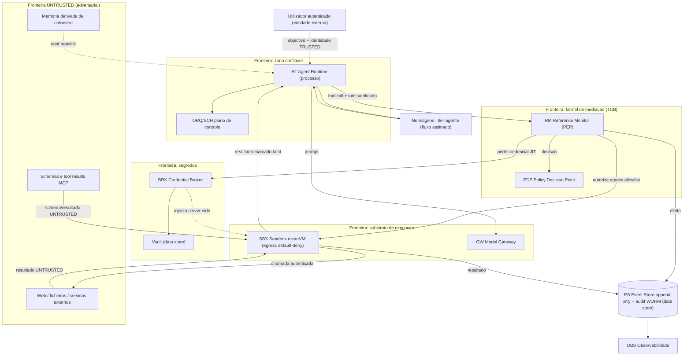

# Análise STRIDE por Fronteira de Confiança — AOS

| Campo | Valor |
|---|---|
| Produto | AOS — Agentic OS de Referência |
| Documento | Técnica — Análise STRIDE por Fronteira de Confiança |
| Versão | 1.0 |
| Data | Julho de 2026 |
| Classificação | Documento de Referência — Aberto |
| Documento-fonte | `_FONTE_agentic-os-ideal.md` |
| Documentos relacionados | `tecnica/07_Seguranca_Isolamento.md`, `tecnica/00_Arquitectura_Solucao.md`, `tecnica/01_Reference_Monitor_Plano_Controlo.md`, `tecnica/09_Governacao_Conformidade.md`, `tecnica/10_Topologia_Implantacao_Operacao.md`, `specs/EPIC-07_Seguranca_Isolamento.md` |

---

## 1. Introdução

### 1.1 Propósito

Este documento fornece a **decomposição STRIDE por fronteira de confiança** do AOS — Agentic OS de Referência. Complementa o modelo de ameaças de `tecnica/07_Seguranca_Isolamento.md` (alinhado com OWASP LLM Top 10 e OWASP Agentic Security Initiative — ASI) com uma análise **elemento-a-elemento**, categoria-a-categoria, no formato clássico de *threat modelling* de Microsoft: **S**poofing, **T**ampering, **R**epudiation, **I**nformation disclosure, **D**enial of service, **E**levation of privilege. Enquanto `tecnica/07` responde à pergunta «que vectores de ataque existem e que controlo os neutraliza?», este documento responde a «para cada elemento e fluxo do sistema, que ameaça surge em cada uma das seis categorias STRIDE, que controlo AOS a mitiga (componente/mecanismo + ADR), e que ticket a rastreia?».

### 1.2 Âmbito

Cobre um **diagrama de fluxo de dados (DFD)** com as fronteiras de confiança do AOS e a análise STRIDE de nove elementos/fluxos críticos: Agent Runtime (RT), Reference Monitor (RM), Policy Decision Point (PDP), Credential Broker + Vault (BRK), Event Store (ES), Sandbox Substrate (SBX), Model Gateway (GW), mensagens inter-agente, e a fronteira de conteúdo *untrusted* (tool results, web, memória, schemas MCP). Cada ameaça liga ao vector OWASP LLM/ASI já mapeado em `tecnica/07` onde aplicável. Fica fora do âmbito o detalhe de implementação de cada controlo (remetido para os documentos especializados) e a matriz de conformidade regulatória (ver `tecnica/14`).

### 1.3 Audiência

Engenheiros de segurança, arquitectos de plataforma, red teams e auditores que precisem de verificar a cobertura de ameaças fronteira-a-fronteira antes de habilitar autonomia, e de rastrear cada mitigação até um ticket executável.

### 1.4 Definições e termos

- **Fronteira de confiança (*trust boundary*):** superfície onde os dados ou o controlo mudam de nível de confiança — por exemplo, a saída de conteúdo *untrusted* da microVM para o planeador, ou a passagem de um token *scoped* para credencial downstream.
- **STRIDE:** taxonomia de seis classes de ameaça, cada uma a negação de uma propriedade de segurança (autenticidade, integridade, não-repúdio, confidencialidade, disponibilidade, autorização).
- **DFD:** *data flow diagram* — grafo de processos, arquivos de dados, entidades externas e fluxos, particionado por fronteiras de confiança.
- **TCB:** *trusted computing base* — o conjunto de componentes cujo comprometimento anula as garantias (aqui: RM, PDP, BRK, ES).

---

## 2. Princípios e decisões aplicáveis (ADRs)

| ADR | Decisão | Contributo para esta análise |
|---|---|---|
| ADR-002 | **Reference Monitor mandatório** | Concentra a mitigação de *Elevation of privilege* e *Repudiation* de toda a tool call num único gate (PEP). Ver `tecnica/01`. |
| ADR-003 | **Identidade não-humana por agente** | Base contra *Spoofing* e *confused deputy*; autoridade = utilizador ∩ classe. Ver `tecnica/09`. |
| ADR-004 | **Isolamento ao nível do kernel** | Mitiga *Elevation of privilege* (evasão do sandbox) e *Information disclosure* (egress) na fronteira do substrato. |
| ADR-005 | **Separação control/data-plane + taint** | Mitiga *Tampering* do fluxo de controlo por conteúdo untrusted (prompt injection, OWASP LLM01/ASI01). |
| ADR-006 | **Credential Broker com tokens JIT** | Mitiga *Information disclosure* de segredos e *Elevation of privilege* por reutilização de credenciais. |
| ADR-010 | **Observabilidade OTel + audit WORM** | Mitiga *Repudiation* de forma transversal via audit hash-chain + WORM. |

---

## 3. Diagrama de fluxo de dados (DFD) com fronteiras de confiança

O DFD abaixo particiona o AOS por fronteiras de confiança (subgrafos tracejados): a **zona confiável** (utilizador autenticado → RT → plano de controlo), o **kernel de mediação** (RM + PDP), a **fronteira de segredos** (BRK/Vault), o **substrato de execução** (SBX), e a **fronteira untrusted** — de onde chega todo o conteúdo adversarial (tool results, web, schemas MCP, memória derivada). O Event Store atravessa as fronteiras como sink append-only de todos os efeitos.

A leitura essencial: **tudo o que cruza da fronteira UNTRUSTED para a zona confiável entra marcado com taint** e é estruturalmente impedido de autorizar acções (ADR-005); **tudo o que cruza para a fronteira de segredos passa pelo BRK server-side** e nunca expõe o segredo ao agente (ADR-006); e **todo o efeito é gravado no ES** antes ou depois de executar, tornando o repúdio detectável (ADR-010).

---

## 4. Análise STRIDE elemento-a-elemento

### 4.1 Agent Runtime (RT) — o loop

| Cat. | Ameaça concreta | Controlo AOS (componente/mecanismo + ADR) | Ticket |
|---|---|---|---|
| **S** | Um processo forja um objectivo em nome de um utilizador que não autenticou. | Identidade NHI *scoped/time-bound* no objectivo inicial; cadeia de delegação on-behalf-of até humano (ADR-003). | AOS-064 |
| **T** | Prompt injection indirecta (LLM01/ASI01) altera o objectivo do loop via tool result. | Separação control/data-plane + taint; o planeador só opera sobre dados confiáveis (ADR-005; `tecnica/07` §6). | AOS-067 |
| **R** | O RT nega ter emitido uma tool call. | Cada turno gravado no ES com hash do prompt, model-id e versões (ADR-010). | AOS-072 |
| **I** | Fuga de contexto sensível entre turnos ou principals. | Contexto ≠ registo; microVM efémera por execução sem estado residual (ADR-004). | AOS-069 |
| **D** | Loop infinito / *runaway* consome orçamento agregado. | Admission control global em tokens/$; circuit breaker multi-sinal (ADR-008). | AOS-073 |
| **E** | O loop tenta chamar tool fora da sua classe de autoridade. | Toda a tool call atravessa o RM (PEP); autoridade = utilizador ∩ classe (ADR-002/003). | AOS-064 |

### 4.2 Reference Monitor (RM) — o gate (PEP)

| Cat. | Ameaça concreta | Controlo AOS (componente/mecanismo + ADR) | Ticket |
|---|---|---|---|
| **S** | Chamador não-autenticado tenta invocar o RM directamente. | Mediação total: o RM só aceita chamadas com token NHI válido; sem caminho lateral (ADR-002/003). | AOS-064 |
| **T** | Adulteração da decisão de política em trânsito RM↔PDP. | Contrato de porta autenticado; política assinada e versionada (ADR-011; `tecnica/12`). | AOS-065 |
| **R** | Falta prova de *quem autorizou* uma acção. | Audit hash-chained + WORM regista principal, política e decisão por tool call (ADR-010). | AOS-072 |
| **I** | Vazamento de dados de política ou de escopo nos logs. | Redação de PII na ingestão; audit separado de diagnósticos efémeros (ADR-011). | AOS-072 |
| **D** | Sobrecarga do RM torna-o gargalo (fail-open?). | PDP compilado em memória (p95 < 15 ms); política **fail-closed** por omissão (ADR-002/011). | AOS-065 |
| **E** | Bypass do gate por um caminho de código que chama tool directamente. | Constrangimento arquitectural: nenhum caminho contorna o RM; verificado em CI (ADR-002). | AOS-064 |

### 4.3 Policy Decision Point (PDP)

| Cat. | Ameaça concreta | Controlo AOS (componente/mecanismo + ADR) | Ticket |
|---|---|---|---|
| **S** | Injecção de política forjada não-assinada. | Política em git versionada, assinada, com changelog no audit (ADR-011). | AOS-066 |
| **T** | Alteração da regra Rego/Cedar sem ratificação. | Pipeline com assinatura + revisão; eval-gate para mudança de política (ADR-011/012). | AOS-066 |
| **R** | Decisão de política sem trilho reproduzível. | Cada avaliação registada com versão de política e inputs (ADR-010). | AOS-072 |
| **I** | Exfiltração das regras de autorização. | Classificação da política; acesso mediado pelo RM (ADR-011). | AOS-066 |
| **D** | Política patológica causa avaliação lenta. | Compilação em memória com alvo p95 < 15 ms; timeout fail-closed (ADR-002/013). | AOS-065 |
| **E** | Regra permissiva por defeito concede autoridade excessiva. | Allowlist **default-deny**; autoridade = utilizador ∩ classe (ADR-011/003). | AOS-066 |

### 4.4 Credential Broker + Vault (BRK)

| Cat. | Ameaça concreta | Controlo AOS (componente/mecanismo + ADR) | Ticket |
|---|---|---|---|
| **S** | Agente falsifica identidade para obter credencial de outro principal. | Token NHI *scoped*; o BRK só troca por credencial dentro do escopo do principal (ADR-003/006). | AOS-070 |
| **T** | Adulteração do pedido de credencial (escopo alargado). | Pedido mediado pelo RM; escopo derivado da política, não do agente (ADR-002/006). | AOS-070 |
| **R** | Uso de credencial sem rasto de emissão. | Cada emissão JIT registada no audit (principal, escopo, TTL) (ADR-010). | AOS-072 |
| **I** | **Exfiltração de segredo pelo modelo** (o agente vê a credencial). | Broker injecta downstream **server-side**; o agente nunca vê o segredo (ADR-006; `tecnica/07` §7.1). | AOS-070 |
| **D** | Esgotamento do vault por rajada de pedidos. | Rate-limit no broker; pooling de chaves de infra ortogonal à identidade (ADR-006). | AOS-070 |
| **E** | Reutilização de credencial fora de contexto (confused deputy downstream). | TTL curto + escopo + revogação central; credencial destruída após uso (ADR-006; `tecnica/07` §3). | AOS-070 |

### 4.5 Event Store (ES) + audit WORM

| Cat. | Ameaça concreta | Controlo AOS (componente/mecanismo + ADR) | Ticket |
|---|---|---|---|
| **S** | Escrita de evento por produtor não-autorizado. | Só o RM/SBX autenticados escrevem; transporte push autenticado (ADR-007). | AOS-071 |
| **T** | Adulteração do log — *The Audit Log Lied*. | Audit hash-chained + WORM: qualquer alteração quebra a cadeia (ADR-010; `tecnica/07` §7.2). | AOS-071 |
| **R** | Negação de um efeito já executado. | Log append-only é fonte de verdade; cada efeito encadeado por hash (ADR-007/010). | AOS-072 |
| **I** | Leitura não-autorizada do trilho (PII histórica). | Redação na ingestão; crypto-shredding por titular; acesso governado (ADR-011). | AOS-071 |
| **D** | Perda de disponibilidade do log (SPOF single-writer). | Event Store **replicado**; workers stateless; sem SPOF (ADR-007). | AOS-071 |
| **E** | Reescrita histórica para forjar autorização. | WORM separado de diagnósticos efémeros; imutável por desenho (ADR-010). | AOS-071 |

### 4.6 Sandbox Substrate (SBX) — microVM

| Cat. | Ameaça concreta | Controlo AOS (componente/mecanismo + ADR) | Ticket |
|---|---|---|---|
| **S** | Execução assume identidade de outro principal. | Identidade efémera por execução; microVM destruída no fim (ADR-004). | AOS-068 |
| **T** | Persistência de payload malicioso entre corridas. | FS read-only + overlay efémero descartado; sem estado residual (ADR-004). | AOS-068 |
| **R** | Efeito de sandbox sem atribuição. | SBX grava resultado como evento append-only no ES (ADR-007/010). | AOS-072 |
| **I** | **Exfiltração via canal permitido** (padrão CamoLeak, CVSS 9.6). | Egress default-deny + allowlist por identidade + filtragem DNS + content-security (ADR-004; `tecnica/07` §5). | AOS-068 |
| **D** | Bomba de recursos esgota o host. | Limites de CPU/mem/IO por microVM; pool com quota; cold-start < 125 ms (ADR-004). | AOS-068 |
| **E** | **Evasão do sandbox para o host** (sandbox escape). | microVM/gVisor (fronteira de virtualização), seccomp mínimo, sem socket do host; jails só defesa secundária (ADR-004; `tecnica/07` §4). | AOS-068 |

### 4.7 Model Gateway (GW)

| Cat. | Ameaça concreta | Controlo AOS (componente/mecanismo + ADR) | Ticket |
|---|---|---|---|
| **S** | Pedido ao modelo sem principal atribuído (pool anónimo). | Identidade por principal codificada em cada chamada (ADR-003; `tecnica/06`). | AOS-055 |
| **T** | Adulteração do prompt em trânsito ou troca de modelo. | Hash do prompt e model-id gravados no evento; contrato de porta (ADR-009/010). | AOS-072 |
| **R** | Uso de modelo sem rasto de custo/região. | Cada chamada regista principal, model-id, região, tokens/custo (ADR-010). | AOS-072 |
| **I** | Encaminhamento de dados para região proibida (soberania). | Allowlist regional de modelos; failover proibido de cruzar fronteira (ADR-011). | AOS-055 |
| **D** | Colapso agregado do rate-limit do provider. | Roteamento cost/load-aware; token-bucket distribuído sobre TPM/RPM real (ADR-008). | AOS-073 |
| **E** | Acesso a modelo fora da allowlist do principal. | Allowlist regional/por classe aplicada no GW; mediação (ADR-011/002). | AOS-055 |

### 4.8 Mensagens inter-agente (A2A)

| Cat. | Ameaça concreta | Controlo AOS (componente/mecanismo + ADR) | Ticket |
|---|---|---|---|
| **S** | Sub-agente forja a origem/autoridade de outro (confused deputy entre agentes). | Identidade criptográfica (NHI); **mensagens assinadas**; hallucination gate autentica origem + autoridade (ADR-003; `tecnica/07` §7.2). | AOS-074 |
| **T** | Adulteração do conteúdo da mensagem em trânsito. | Assinatura garante integridade; qualquer alteração invalida a mensagem (ADR-003). | AOS-074 |
| **R** | Emissor nega ter enviado uma instrução. | Assinatura fornece não-repúdio de origem; mensagem registada no ES (ADR-010). | AOS-074 |
| **I** | Interceptação de mensagem entre agentes. | Canal autenticado; escopo de delegação limita o conteúdo partilhável (ADR-003). | AOS-074 |
| **D** | Inundação de mensagens satura o receptor. | Backpressure e orçamento hierárquico por árvore de tarefas (ADR-008). | AOS-073 |
| **E** | Escalada de autoridade via mensagem "de confiança". | Autoridade não deriva da mensagem mas do principal; ressalva: assinatura ≠ veracidade — *grounding* por evals (ADR-003; `tecnica/07` §7.2, `tecnica/08`). | AOS-074 |

### 4.9 Fronteira untrusted (tool results / web / MCP / memória)

| Cat. | Ameaça concreta | Controlo AOS (componente/mecanismo + ADR) | Ticket |
|---|---|---|---|
| **S** | Conteúdo forja ser uma "instrução do sistema". | Taint UNTRUSTED em tudo o que chega de tools/web/memória/MCP; tags in-band não são privilégio (ADR-005). | AOS-067 |
| **T** | **Prompt injection** sequestra o fluxo de controlo (LLM01/ASI01). | Separação control/data-plane (dual-LLM/CaMeL); untrusted é dado inerte (ADR-005; `tecnica/07` §6). | AOS-067 |
| **R** | Origem do conteúdo não-confiável não rastreada. | Proveniência marcada na memória derivada; taint transitivo registado (ADR-005). | AOS-069 |
| **I** | Conteúdo malicioso induz exfiltração de dados sensíveis. | Gate de risco por sensibilidade + egress + reversibilidade; egress default-deny (ADR-004/013). | AOS-068 |
| **D** | Tool result gigante estoura o contexto/custo. | Cap de output de tools; admission control em tokens (ADR-008). | AOS-073 |
| **E** | **Tool poisoning / rug-pull** de MCP muta schema e escala privilégio. | Registry com pin+hash+assinatura; congelamento por hash; revalidação a cada chamada; congelamento por run (ADR-012; `tecnica/05`, `tecnica/07` §3). | AOS-075 |
| **E** | **Memory poisoning** (ASI06) envenena decisões futuras. | Proveniência + quarentena de memória derivada de untrusted; taint transitivo (ADR-005; `tecnica/07` §3). | AOS-069 |

---

## 5. Síntese

### 5.1 Fronteiras mais expostas

A análise confirma que a **fronteira untrusted** (§4.9) é a superfície de maior exposição: concentra prompt injection (LLM01/ASI01), tool poisoning/rug-pull, memory poisoning (ASI06) e serve de gatilho à exfiltração (CamoLeak). É a única fronteira onde uma única categoria — *Tampering* do fluxo de controlo — pode comprometer todas as outras, e por isso recebe a defesa estrutural mais forte (separação control/data-plane + taint, ADR-005). A segunda fronteira mais crítica é o **substrato de execução** (§4.6): é onde *Information disclosure* (egress) e *Elevation of privilege* (sandbox escape) têm o maior impacto absoluto, mitigados pelo isolamento ao nível do kernel e egress default-deny (ADR-004). A **fronteira de segredos** (§4.4) tem exposição alta mas superfície estreita — o BRK elimina a exfiltração de credenciais como *classe* (ADR-006).

Os elementos do **TCB** (RM, PDP, ES) têm probabilidade de ataque menor (não recebem input adversarial directo) mas impacto máximo se comprometidos — daí a ênfase em mediação total fail-closed, política assinada e audit WORM tamper-evident.

### 5.2 Riscos residuais (calibração «risco residual gerido»)

Coerente com a nota de calibração de `tecnica/00` §1.1, «arquitecturalmente impossível» é objectivo de desenho, não garantia absoluta. Permanecem riscos residuais **geridos e medidos**, não negados:

- **Exfiltração por canais permitidos:** o egress default-deny reduz mas não elimina o CamoLeak — domínios na allowlist e recursos renderizados permanecem vector; residual mitigado por content-security e monitorizado por override-rate e alertas de egress.
- **Assinatura ≠ veracidade:** uma mensagem inter-agente validamente assinada pode conter uma alucinação; o não-repúdio não garante correcção — exige *grounding*/evals (`tecnica/08`).
- **Comprometimento do TCB e canais laterais:** defeitos de implementação no RM/PDP/BRK ou *side-channels* na microVM ficam fora do que o desenho elimina; geridos por hardening, revisão e telemetria.
- **Latência de detecção de memory poisoning:** a quarentena reduz mas não zera a janela até a proveniência ser avaliada.

### 5.3 Mapeamento para runbooks (`tecnica/10`)

Cada categoria STRIDE com impacto operacional tem resposta prevista nos runbooks de `tecnica/10`: *Denial of service* (§4.1/4.7/4.9) → runbook de circuit breaker e backpressure; *Information disclosure* por egress (§4.6) → runbook de contenção de exfiltração e revogação de allowlist; *Elevation of privilege* por sandbox escape (§4.6) → runbook de isolamento de host e rotação de pool; *Tampering* do audit (§4.5) → runbook de verificação de cadeia de hash e legal hold; *Spoofing*/rug-pull (§4.9) → runbook de congelamento de tool e re-aprovação de schema. A telemetria de suporte (spans OTel, audit WORM) provém de `tecnica/08`.

---

## 6. Glossário

- **STRIDE:** Spoofing, Tampering, Repudiation, Information disclosure, Denial of service, Elevation of privilege — cada classe é a negação de uma propriedade de segurança.
- **Fronteira de confiança:** superfície onde muda o nível de confiança de dados ou controlo; foco da decomposição.
- **DFD (data flow diagram):** representação de processos, data stores, entidades externas e fluxos, particionada por fronteiras de confiança.
- **TCB (trusted computing base):** componentes cujo comprometimento anula as garantias — no AOS: RM, PDP, BRK/Vault, ES.
- **Taint:** marca de conteúdo untrusted, propagada transitivamente, que impede a autorização de acções privilegiadas.
- **CamoLeak:** padrão de exfiltração via tools benignas e conteúdo renderizado, CVSS 9.6.
- **Rug-pull:** mutação maliciosa de uma tool/MCP após aprovação.
- **Confused deputy:** exploração da autoridade delegada do agente para acções que o atacante não poderia executar por si.
- **Fail-closed:** comportamento de negar por omissão quando uma decisão de política não pode ser tomada.

---

## 7. Tabela de aprovação

| Papel | Nome | Assinatura | Data |
|---|---|---|---|
| Arquitecto de Plataforma |  |  |  |
| Responsável de Segurança |  |  |  |
| Responsável de Produto |  |  |  |

---

## 8. Controlo de versões

| Versão | Data | Descrição | Autor |
|---|---|---|---|
| 1.0 | Julho 2026 | Emissão inicial | Equipa AOS |
