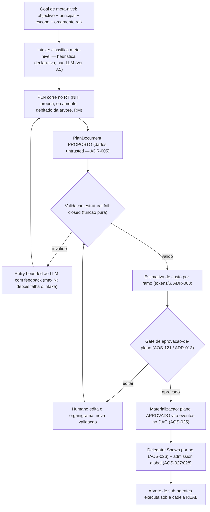

# Planeador de Objectivos e Meta-Orchestração — AOS

| Campo | Valor |
|---|---|
| Produto | AOS — Agentic OS de Referência |
| Documento | Documento técnico — Planeador de Objectivos e Meta-Orchestração |
| Versão | 0.2 (proposta de desenho — por ratificar; emendada pós-revisão adversarial) |
| Data | Julho de 2026 |
| Classificação | Documento de Referência — Aberto |
| Documento-fonte | `_FONTE_agentic-os-ideal.md` |
| Documentos relacionados | `tecnica/03_Orquestracao_Escalonamento.md`, `tecnica/05_Skill_Tool_Registry_Supply_Chain.md`, `tecnica/11_Convencoes_Engenharia_Evolucao.md`, `tecnica/15_Experiencia_HITL_UX.md`, `specs/EPIC-03_Orquestracao_Escalonamento.md` |

---

## 1. Introdução

### 1.1 Propósito

Este documento especifica o **Planeador (PLN)** — a graduação da função de decomposição do Orquestrador (ORQ) de *stub* estrutural para componente produtivo — e a **meta-orchestração**: a capacidade de um pedido de alto nível ("cria uma fábrica de software", "monta uma agência de marketing", "constrói o sistema de governação de X") ser decomposto num **organigrama executável de sub-agentes**, aprovado por um humano antes de consumir um único token de execução, e corrido sob a cadeia de governação já construída (EPIC-01..18 — com a autoridade de identidade, D4, entregue em código mas ainda "em provisionamento": o endurecimento é config de deployment). O eixo central é tratar o **plano proposto por um LLM como dados *untrusted*** (ADR-005): nunca é executado — é validado, orçamentado, aprovado e só então materializado no grafo de tarefas.

### 1.2 Âmbito

Cobre: o ciclo goal→plano (decomposição LLM, validação estrutural fail-closed, estimativa de custo por ramo); a materialização do plano aprovado no DAG (AOS-025) e no spawn delegado (AOS-026/028); re-planeamento de subgrafos; organizações **efémeras** de agentes (a árvore de delegação de um meta-run); e a marcação *(proposta)* do que excede a visão congelada (organizações persistentes, `org_blueprint` no registry). Fora de âmbito: o executor de skills (artefactos do REG interpretados dinamicamente — desenho separado, a especificar), a cablagem do Model Gateway real no nó (EPIC-06 entregue como pacote; o *wiring* no bootstrap é trabalho de integração), a meta-orchestração em topologia multi-host e a soberania por *tenant* (a v1 é *single-host*, ADR-018 — o distribuído é eixo do EPIC-10), e qualquer forma de marketplace/economia de agentes (horizonte, não desenhado).

**Estado de ratificação.** Este documento é uma **proposta de desenho** nos termos do `_BRIEF.md` (o que não está na fonte marca-se *(proposta)*, nunca contradizendo ADRs). Não altera a Carta: a secção 8 identifica explicitamente as partes que, a serem adoptadas, exigem **emenda** (`specs/00_AOS_Carta.md` §6). Até lá, tudo o aqui descrito se constrói dentro da forma do produto já congelada — o nó `aos` que hospeda *runs*.

### 1.3 Audiência

Arquitectos de plataforma, engenheiros de runtime e do plano de controlo, engenheiros de segurança (o planeador é uma nova fronteira de confiança), e responsáveis de produto (o planeador é a peça que transforma o runtime governado num sistema que monta equipas).

### 1.4 Definições e termos

- **Planeador (PLN):** a função de decomposição do ORQ realizada como componente produtivo; não é um componente canónico novo — é o ORQ a cumprir o seu contrato declarado (`tecnica/03` §3).
- **Documento de plano (PlanDocument):** artefacto declarativo (schema fechado) que descreve nós, papéis, dependências, ferramentas e estimativas — proposto pelo LLM, validado por função pura, aprovado por humano.
- **Meta-run:** um *run* cujo plano tem nós-papel que se expandem em sub-árvores; a "organização" é a árvore de delegação desse *run* — vive enquanto o *run* vive.
- **Organização efémera:** o conjunto de sub-agentes de um meta-run, com NHI própria na cadeia *on-behalf-of*, orçamento hierárquico e trajectória ligada — sem existência para além do *run*.
- **Re-planeamento (replan):** nova decomposição de um subgrafo após falha ou mudança de contexto, com orçamento residual e novo ciclo de aprovação conforme o nível L0–L5.
- **Organização persistente *(proposta)*:** entidade com identidade, orçamento e memória próprios que sobrevive a *runs*; fora da Carta v1 (secção 8).

---

## 2. Princípios e decisões aplicáveis (ADRs)

O ADR **central** deste documento é o **ADR-013 — Gates de risco SA-ROC + controlo bidireccional**: o gate de aprovação-de-plano deixa de ser uma conveniência de UX e passa a ser **fronteira de segurança** — é o único ponto onde um humano vê o organigrama antes do spawn. Aplicam-se ainda:

- **ADR-002 — Reference Monitor mandatório.** A materialização do plano (spawn de cada sub-agente) atravessa o RM; e o próprio planeador, sendo um agente (secção 3.2), tem as suas chamadas de modelo e de ferramenta mediadas como qualquer outro agente — o sistema come a própria comida.
- **ADR-003 — Identidade não-humana por agente.** Cada nó do organigrama recebe NHI filha na cadeia *on-behalf-of* até um humano; o planeador também. Uma "organização" é, em termos de autoridade, exactamente a sua árvore de delegação — nada mais.
- **ADR-005 — Separação control/data-plane + taint.** O PlanDocument proposto pelo LLM é **dados**: nunca é interpretado como instrução de execução. A validação é função pura sobre o documento; a materialização lê o documento *aprovado*, não a saída crua do modelo.
- **ADR-008 — Admission control global em tokens/$.** A decomposição debita do orçamento raiz da árvore; cada ramo do plano traz estimativa de custo que alimenta a reserva hierárquica (AOS-026) e o admit global (AOS-027/028).
- **ADR-009 — Layout de prompt cache-estável.** O prompt de decomposição é estático e versionado (artefacto comportamental SemVer, ADR-012); o objectivo do utilizador entra na zona volátil — nunca se reordena o prefixo por pedido.
- **ADR-012 — SemVer + eval-gate para auto-modificação.** Quando o planeador identifica uma *capability* inexistente e propõe criá-la, a skill candidata entra no pipeline staging → eval-gate → canary → ratificação assinada — o plano fica **bloqueado** nesse nó até à ratificação (ou o humano substitui o nó).
- **ADR-014 — Taxonomia L0–L5.** O planeador **nasce a L0**: todo o plano exige aprovação humana. A promoção acontece só por fiabilidade medida (secção 7.2), nunca por conveniência de lançamento.
- **ADR-018 — Fronteira nó↔ORQ/SCH.** Na v1 *single-host* a **autoridade** de decomposição é do ORQ (plano de controlo); a **execução** do planeador é a de um agente hospedado pelo *agent-runtime* (kernel), invocado pelo ORQ na direcção control-plane→kernel. É consumido **num colaborador dedicado**, fora do módulo de ciclo-de-vida concorrente cuja importação o guard-test `boundary_orq_sch_test.go` proíbe — a fronteira congelada não se atravessa em silêncio.

---

## 3. Do objectivo ao plano

### 3.1 O defeito que se fecha

O ORQ declara decompor objectivos em grafo de tarefas (`tecnica/03` §3), mas a implementação actual é um **stub**: o grafo tem sempre um único nó derivado directamente do `Goal`, sem planeamento real (`packages/control-plane/orchestrator/orchestrator.go` — "NÃO-PRODUTIVO (esqueleto AOS-012)"). Toda a maquinaria a jusante é real e testada — DAG com aciclicidade e deadlock (AOS-025), delegação com NHI e orçamento CAS (AOS-026), admission global (AOS-027/028), gate pré-spawn (AOS-121) — mas nada a alimenta. Um pedido "cria uma agência de marketing" produz hoje um *run* de 1 nó. O planeador é a peça em falta; este documento especifica-a.

### 3.2 O planeador é um agente governado

Decisão de desenho: o planeador **não é um caminho especial que chama o LLM fora do runtime** — é ele próprio um agente que corre no RT, com NHI própria (`agent:planner` na cadeia de delegação do *run*), orçamento debitado da árvore, mediação RM das suas chamadas e trajectória OTel ligada ao *run* (`traceparent`, AOS-077). A sua "skill" é a decomposição: recebe o objectivo e o contexto de *capabilities* disponíveis, e emite um PlanDocument. As alternativas — chamada directa ao GW pelo ORQ, ou planner como biblioteca pura invocada pelo SCH — foram rejeitadas por quebrarem a mediação total (ADR-002) ou por esconderem o custo do planeamento fora da contabilidade da árvore (ADR-008). O planeamento **custa tokens e pode ser atacado**; tratá-lo como um agente normal dá-lhe, de graça, orçamento, taint, observabilidade e replay. *Precisão de camada:* a autoridade da decomposição é do ORQ (ADR-018); o que "corre no RT" é o agente-decompositor que o ORQ hospeda e invoca — produz o PlanDocument, mas **não o materializa** (a materialização, §6.1, é do ORQ). O arranque do planeador é ele próprio admitido: uma **reserva de planeamento de primeira classe** para `agent:planner` (contexto × tabela de preços AOS-062 × factor de retry N) é debitada e admitida *antes* da decomposição, fail-closed, com evento de spawn próprio (§6.1). Toda a fase de planeamento é observável como *spans* OTel ligados ao *run* (AOS-077): cada uma das N tentativas de decomposição, o gate de aprovação e a materialização emitem *spans* filhos do `traceparent` do meta-run — o planeamento não é um ponto cego na trajectória.

### 3.3 O PlanDocument — schema fechado, versão própria

O contrato entre o LLM e o sistema é um documento declarativo com **schema fechado e `plan_version` SemVer** — à imagem dos contratos de porta (`tecnica/12`). Campos por nó: `node_id` (estável), `role` (papel declarativo livre, ex.: "engenheiro-backend", "gestor-de-conteúdo"), `objective` (subtarefa), `tools` (lista de ferramentas **por referência pinada ao REG** — nome + versão + digest), `depends_on` (arestas), `budget_estimate` (tokens/$), `risk_class` (SA-ROC: safe/gray/danger — campo *advisory* proposto pelo LLM que **só pode elevar** o piso derivado na validação, nunca baixá-lo, com justificação textual). Campos de topo: `objective` original, `budget_total` (soma dos ramos + margem de replan), `planner_meta` (modelo, versão do prompt de decomposição, hash do contexto de *capabilities*).

Regras de validação (função pura e determinística, **sem LLM**, executada sobre o documento e um *snapshot* de *capabilities* pinado no `propose` — `capabilities_hash` em `planner_meta` — logo sem I/O vivo):

1. **Schema** — campos desconhecidos rejeitados; tipos e cardinalidades verificados (à imagem do `DisallowUnknownFields` dos ficheiros de config do nó).
2. **Aciclicidade** — a mesma verificação incremental do DAG (AOS-025); uma proposta cíclica é lixo, não um caso especial.
3. **Resolução de ferramentas** — toda a referência `tools[]` resolve contra o **snapshot de REG pinado no `propose`** (versão pinada, digest, admissibilidade); uma ferramenta inexistente, deprecada ou fora da *allowlist* do papel **rejeita a proposta** — não há *trimming* silencioso. A resolução contra REG vivo é gate de *proposta*, não de *replay* (reconciliação revogação↔replay em `tecnica/05`) — o *snapshot* torna a validação reproduzível.
4. **Tectos estruturais** — profundidade ≤ `max_depth`, fan-out ≤ `max_fanout` e **cardinalidade total ≤ `max_nodes`**; são tectos **próprios do plano** (limitam o *tamanho* do organigrama), com derivação declarada e auditável — distintos do tecto de concorrência de spawn de AOS-028 (sub-agentes *activos* em simultâneo, que não limita a cardinalidade total). Nunca constantes mágicas.
5. **Orçamento** — `budget_total` ≤ orçamento raiz remanescente; o passo de custo **re-preça** cada ramo de forma determinística e independente (tabela versionada AOS-062), não ecoando o `budget_estimate` proposto — divergência acima de tolerância rejeita ou faz *clamp*. Cada nó tem **teto de custo duro** que dispara o breaker (AOS-029); um nó que exceda a reserva por-ramo bloqueia para re-aprovação, nunca *overrun* silencioso.
6. **Risco derivado** — a validação **deriva** o `risk_class` de cada nó a partir das ferramentas pinadas (efeito irreversível ou egress externo de dados sensíveis ⇒ `danger`, nunca auto-aprovável); o campo proposto pelo LLM só é aceite se ≥ ao piso derivado. Todo o nó `danger` tem *approval-card* por efeito concreto, com confirmação individual e *timeout* fail-closed (AOS-120), nunca agrupável em lote.

Uma proposta inválida não se "corrige por baixo da mesa": volta ao LLM com o diagnóstico (máx. N tentativas, N=3 por omissão) e esgota-se em falha de intake — fail-closed, sem plano fantasma.

### 3.4 Determinismo e replay

A proposta do LLM é, por natureza, não-determinística — e o AOS exige replay byte-a-byte (ADR-001/010). A resolução é a já praticada para não-determinismo no runtime (AOS-016): **o ponto de não-determinismo é capturado, não eliminado**. O PlanDocument **aprovado** (mais o contexto de *capabilities* e a versão do prompt) é persistido como evento append-only (`plan.proposed`, `plan.validated`, `plan.approved`, `plan.materialized`, com hash do documento) e o manifesto do *run* inclui o plano aprovado. O replay **nunca re-chama o LLM**: **reproduz os eventos de materialização e execução capturados** (`plan.materialized` e os turnos gravados) — o documento aprovado é o registo/input, não o gerador do replay; nunca re-resolve o REG nem re-atravessa o RM. O planeamento acontece uma vez, na história; a execução é replayable **enquanto a captura for admissível** (AOS-016; sujeita a TTL/erasure — AOS-079/093).

### 3.5 Classificação de intake: *routing*, não autoridade

O nó `INT` do fluxo (§3.2) decide se um `Goal` toma o caminho do planeador (meta-run: PlanDocument + gate) ou o caminho directo (tarefa simples, 1-nó). O desenho:

- **Determinística e sem LLM.** É função pura sobre os campos **declarativos** do `Goal` — nunca sobre a interpretação semântica do texto do `objective` (isso reintroduziria um LLM não-governado e uma superfície de *taint* logo no primeiro passo do fluxo). Sinais admissíveis: o `intake_mode` explícito do principal (canal de controlo autenticado), o orçamento raiz face a um limiar configurado por *tenant*, tectos estruturais pedidos explicitamente (`max_depth`/`max_fanout` acima do trivial) e a cardinalidade de papéis/capabilities do pedido estruturado. O resultado é reproduzível e entra em `plan.intake_classified` com a heurística aplicada (ADR-010).
- **Fail-safe na direcção da supervisão.** Em ambiguidade, classifica **meta** (mais escrutínio: planeamento + PlanCard), nunca simples. Sub-classificar um pedido grande como simples é falha de *produto* (o run sub-entrega), não de segurança — mas para não depender disso, vale a invariante seguinte.
- **A invariante de não-bypass.** A fronteira de segurança real é o gate por-spawn (ADR-013). Um run classificado "simples" é 1-nó por construção; **qualquer** tentativa de delegação desse nó (spawn de filho, AOS-026) reentra no mesmo gate ao nível L0–L5 do chamador — um "plano *just-in-time*" do subgrafo. O gate de plano do meta-run é apenas a forma *antecipada e de organigrama completo* do mesmo gate por-spawn. Logo, manipular o classificador para "simples" **não escapa** ao gate; e como o texto do `objective` não é input de classificação, injecção no objectivo não troca a rota.
- **Custo.** Rotear para meta debita o planeamento (§7.3); a preferência por simples em pedidos pequenos existe para não pagar decomposição onde um único nó chega — e é a invariante de não-bypass que torna essa optimização segura.

### 3.6 Evolução e migração do `plan_version`

O `plan_version` (§3.3) é a versão de *schema* do PlanDocument, distinta da `prompt_version` e do `capabilities_hash` (ambos em `planner_meta`) — os três pinados para reprodutibilidade. Regras:

- **SemVer do schema.** MAJOR = mudança que quebra (campo removido ou semântica alterada); MINOR = aditivo retrocompatível; PATCH = clarificação. As propostas novas saem sempre na versão **corrente**, validadas contra o schema corrente.
- **Planos aprovados são congelados.** Um plano materializa-se na versão em que foi aprovado — nunca migrado por baixo. Se o schema sobe entre a aprovação e a materialização, materializa-se na versão carimbada enquanto o *reader* existir; se essa versão já foi retirada, o plano é **invalidado** e volta a planeamento + nova aprovação (fail-closed, nunca auto-migração).
- **Janela de suporte de replay.** O materializador retém *readers* para uma janela declarada de MAJORs históricos. Um run cujo `plan_version` MAJOR caiu fora da janela é **inadmissível** — a mesma inadmissibilidade fail-closed de um payload perdido (§3.4). A garantia de §3.4 estende-se: replayable *enquanto a captura **e** o reader do `plan_version` forem admissíveis*.
- **Mudar o schema é mudança governada.** Um bump MAJOR passa pela disciplina ADR-012 (eval-gate, canary) como qualquer artefacto comportamental, e entrega-se com uma de duas: *reader* retido para a versão antiga, ou **deprecação documentada** do suporte de replay dessa versão — com as implicações de retenção/legal-hold (AOS-079/093: um run sob versão a retirar tem de ser sinalizado antes de perder admissibilidade).

---

## 4. Meta-runs e organizações efémeras

### 4.1 O organigrama é o DAG

Num meta-run, os nós do plano são **papéis** que se expandem em sub-árvores de trabalho. Não há entidade de organização persistente nova (o PlanDocument, §3.3, é — isso sim — um novo contrato de domínio versionado): a "organização" é exactamente a árvore de delegação (ADR-003) com orçamento hierárquico (ADR-008) e trajectória ligada (AOS-077) — vive enquanto o *run* vive e morre com ele, deixando como sobrevivência apenas os artefactos promovidos (secção 5) e a trajectória selada. Isto é deliberado: cobre o caso "cria uma fábrica de software e entrega-me o resultado" **sem tocar na Carta** — a forma do produto continua a ser "o nó hospeda *runs*".

O que um meta-run **não** dá (e é honesto declará-lo): identidade organizacional duradoura, memória da organização enquanto colectivo, orçamento que sobreviva ao *run*, e a possibilidade de "a agência" aceitar trabalho novo amanhã. Para isso, secção 8 — *(proposta)* e emenda.

### 4.2 Re-planeamento

A falha de um nó não derruba o organigrama: o ORQ pode pedir ao PLN o **replan do subgrafo** afectado, com o orçamento residual e o estado já produzido como contexto. Salvaguardas: (a) replans **limitados** por árvore (tecto declarado — um organigrama em replan permanente é um sintoma, não um modo de operação); (b) o replan debita do orçamento da árvore como qualquer trabalho; (c) o novo sub-plano atravessa o **mesmo** gate de aprovação conforme o nível L0–L5 do planeador naquele domínio — a autonomia de replan **nunca** excede a do plano original; (d) nós já concluídos são intocáveis (imutabilidade do histórico — o replan opera só sobre o futuro do grafo).

### 4.3 O gate como fronteira de segurança, não como UX

Com o stub, o gate de aprovação-de-plano (AOS-121) era ergonomia. Com o planeador real, torna-se **a** fronteira: **até L3** é o único ponto onde um humano vê o organigrama — papéis, ferramentas por papel, custo por ramo, classes de risco — antes de qualquer spawn (a L4/L5 a auto-aprovação opera dentro do envelope, mas `capability_gap` e nós `danger` forçam sempre revisão, §7.2). Daqui decorrem requisitos duros: o PlanCard (AOS-121) **já modela o organigrama completo** — a meta-orchestração acrescenta semântica de papéis e custo-por-ramo, e exige apresentação **triada por risco** (revisão item-a-item forçada, com *acknowledgement* explícito, dos nós ≥ gray e dos `capability_gap`; o resto colapsável), para que "completo" não vire vector de fadiga; a edição humana do plano é cidadã de primeira classe (editar → re-validar → aprovar, sem round-trip ao LLM); e o *override-rate* do gate alimenta a promoção L0–L5 do planeador (secção 7.2) — um planeador cujos planos são sistematicamente editados não sobe de nível, por muito "certo" que acerte.

### 4.4 O Scheduler (SCH): despacho sob admissão, a jusante do gate

Se o ORQ decompõe e materializa, o **SCH despacha**. Papéis:

- **Despacho de nós prontos.** Materializado o plano (`plan.materialized`), o SCH despacha os nós cujas `depends_on` estão satisfeitas — e só esses. Não decompõe nem planeia: está **a jusante** do gate, nunca a montante (ADR-018; o guard-test `boundary_orq_sch_test.go` proíbe o *import* cruzado do módulo de ciclo-de-vida).
- **Dois tectos distintos, dois donos.** Os tectos de *tamanho* do plano (`max_depth`/`max_fanout`/`max_nodes`, §3.3 regra 4) são **plan-time**, do ORQ. O tecto de *concorrência* — sub-agentes activos em simultâneo, `max_spawn = f(headroom)` (AOS-028) — é **run-time**, do SCH. Um plano pequeno e válido pode ser despachado devagar sob pressão de *headroom*; um plano grande simplesmente não passa validação.
- **Nada se despacha antes do gate.** Enquanto o plano está pendente de aprovação (§3.2, GATE antes de MAT), não há nós materializados e o SCH **não consome headroom** — a espera no gate não reserva capacidade. Nós em `waiting_on_capability` (§5) não são despacháveis até à ratificação; nós `danger` só despacham com o *approval-card* por-efeito resolvido (§3.3 regra 6). O SCH respeita — não reavalia — estas condições.
- **Re-verificação na fronteira TOCTOU.** Entre a validação de tectos (plan-time, *headroom* X) e o despacho (após aprovação, *headroom* Y ≤ X), o SCH re-verifica admissibilidade no spawn: sob pressão, **adia** o despacho (spawn diferido, degradação graciosa de AOS-028), nunca oversubscreve nem faz spawn parcial silencioso. Um plano aprovado que já não cabe fica em espera de *headroom*, com sinal próprio.
- **Replan.** No `plan.replan_requested`, o SCH suspende o despacho do subgrafo afectado e retoma em `plan.replan_applied`; nós concluídos são intocáveis (§4.2) — o SCH nunca re-despacha histórico.
- **Observabilidade.** O SCH não emite eventos do domínio `aos.planner.v1`; o seu despacho é observável pelo ciclo de vida dos nós de tarefa (traçado ligado, AOS-077).

---

## 5. Capabilities inexistentes — o sistema estende-se a si próprio *com rede*

O caso mais interessante é o plano que precisa de uma *capability* que o REG não tem ("publicar no canal X", "gerar contrato no formato Y"). O planeador **não improvisa** a ferramenta nem a executa inline: propõe-na como nó especial `capability_gap`, e a skill candidata é gerada (por um **agente-autor governado — NHI própria, orçamento debitado da árvore, *allowlist* restrita — que trata a especificação do `capability_gap` como *input* untrusted, com taint visível no eval-gate**) e entra no **pipeline ADR-012** — dry-run na authoring-surface (AOS-126, estruturalmente não-cometido), eval-gate com golden-set e trace-diffing (AOS-114/115/189), canary, ratificação humana assinada (AOS-096/206). O nó do plano fica **bloqueado** (`waiting_on_capability`) até à ratificação; o humano pode, em alternativa, substituir o nó por trabalho manual ou rejeitar o ramo. É a concretização do M4 da fonte — *auto-evolutivo seguro* — sem que nenhum artefacto auto-escrito chegue a produção unilateralmente (Princípio 7 do `_FONTE` — Evolução com rede).

> **Lacuna honesta (executor de skills).** Hoje uma skill ratificada é um artefacto governado **sem executor** — o RM despacha Go funcs registadas em-processo, e `ExecuteInProd` é só um gate. A meta-orchestração completa exige um interpretador declarativo de skills (grafos/sequências de tool calls com I/O tipado, a correr no sandbox, sempre via RM) — desenho separado, a especificar num documento próprio. Sem ele, os nós do plano executam sobre as ferramentas concretas já registadas, o que não invalida este desenho mas limita o repertório.

---

## 6. Contratos e eventos

### 6.1 Eventos append-only (domínio `aos.planner.v1`)

| Evento | Emissor | Conteúdo essencial |
|---|---|---|
| `plan.intake_classified` | ORQ | goal_id, classificação (meta-nível vs. tarefa simples), heurística aplicada |
| `plan.planner_admitted` | ORQ | reserva de planeamento admitida para `agent:planner` (contexto, tabela de preços, factor de retry) |
| `plan.proposed` | PLN | hash do PlanDocument, planner_meta (modelo, prompt_version, capabilities_hash) |
| `plan.validation_failed` | validador | regra violada, diagnóstico (sem eco de conteúdo sensível), tentativa n/N |
| `plan.validated` | validador | hash, nº de nós, budget_total, tectos aplicados |
| `plan.approved` / `plan.rejected` / `plan.edited` | gate AOS-121 | hash final, decisão assinada (hitl.Channel), diff estrutural da edição |
| `plan.materialized` | ORQ | hash; node_id → nó-folha `task.node.created` (AOS-025) ou papel-que-expande → `Delegator.Spawn` (AOS-026), com `tools[]` a vincular o `Authority[]` da NHI filha |
| `plan.capability_gap_opened` / `plan.capability_gap_resolved` | ORQ | node_id, skill candidata, RatificationID (AOS-096) |
| `plan.replan_requested` / `plan.replan_applied` | ORQ | subgrafo, orçamento residual, novo hash |

A sequência reconstrói-se por replay com ordem idêntica (ADR-010); o documento aprovado é o input do restante *run*, pelo que o replay é byte-a-byte sem LLM.

### 6.2 O prompt de decomposição é artefacto comportamental

O prompt de decomposição (estático, cache-estável — ADR-009) é um **artefacto comportamental SemVer**: mudanças ao prompt passam pelo pipeline ADR-012 como qualquer skill — eval-gate com **golden-sets de decomposição** (objectivo → plano esperado, curados) e trace-diffing contra a versão anterior. O planeador não se auto-afina em silêncio: afina-se como tudo o resto.

### 6.3 Golden-sets de decomposição: avaliar um gerador não-determinístico

§6.2 exige um eval-gate de decomposição, mas a decomposição é não-determinística — pelo que "objectivo X → plano Y exacto" é frágil e errado. O desenho:

- **Entradas são `(objectivo, contexto) → asserções`, não planos exactos.** Cada entrada carrega asserções estruturais e semânticas que o plano produzido deve satisfazer (ex.: "existe papel que cobre X"; "o papel R **não** recebe a ferramenta T"; "profundidade ≤ N"; "nenhum nó `danger` sem justificação"; "custo na banda esperada"). São verificáveis pelo validador puro (§3.3) mais uma camada de rubrica.
- **Dois níveis, contra o não-determinismo.** Amostra-se a decomposição **K vezes** por objectivo (política de sementes/temperatura fixa). As asserções de **segurança** (papel sobre-privilegiado, `danger` mal rotulado, egress indevido) exigem **100% de K**; as de **qualidade** (cobertura de papéis, custo na banda) exigem um **limiar ≥ M/K**. O não-determinismo vira uma *taxa de aprovação medida*, não um match quebradiço.
- **Trace-diffing = regressão distribucional.** A comparação com a versão anterior do prompt é sobre as **métricas** (taxas de aprovação, perfil de violações) sobre o mesmo golden-set — não sobre os planos crus. Um bump não pode regredir nenhuma taxa de asserção de segurança nem baixar a qualidade abaixo do limiar do gate.
- **Curadoria é artefacto governado.** O golden-set é versionado como o prompt, alimentado por: objectivos representativos (colhidos de produção, anonimizados), objectivos **adversariais** (sementes de red-team — injecção, isco de sobre-privilégio, formas de exaustão), e casos de **regressão** (falhas passadas viram entradas permanentes). Mutar o golden-set (sobretudo *remover* um caso difícil) é ele próprio *gated* — fecha o vector de envenenamento (liga a §5, agente-autor).
- **Custo e propriedade.** As K amostras × |golden-set| correm **offline no eval-gate** (pipeline ADR-012), nunca por-run nem em produção; o custo de manutenção é um encargo de propriedade de primeira classe (um dono do golden-set), não um artefacto grátis.
- **Ligação à promoção.** Esta é a substância do sinal que §7.2 exige como pré-condição de promoção do planeador ("eval-gate de decomposição"): a taxa de aprovação do golden-set é esse sinal, independente do humano.

---

## 7. Vista de qualidade

### 7.1 Segurança

A superfície de ataque nova é o **plano enquanto vector**: um objectivo adversarial (ou conteúdo untrusted que o influencie) pode tentar induzir um organigrama hostil — papéis com ferramentas excessivas, ramos com efeitos irreversíveis disfarçados de `safe`, fan-out de exaustão de orçamento. A defesa é em camadas e já construída: o PlanDocument é dados (ADR-005); a validação pura fecha schema, aciclicidade, ferramentas e tectos **e deriva as classes de risco das ferramentas pinadas (o rótulo do LLM só eleva)**; o gate humano vê o organigrama com classes de risco resolvidas (approval-card por efeito, AOS-120); e o spawn de cada nó é mediado, orçamentado e admitido individualmente (ADR-002/008). O planeador é ainda **taintado** como qualquer consumidor de untrusted: a sua saída não autoriza elevação — só propõe.

### 7.2 Autonomia e fiabilidade medida

O planeador nasce a **L0** (ADR-014): todo o plano aprovado por humano. A promoção por (planner, domínio) usa sinais concretos: **taxa de planos aprovados sem edição**, **taxa de replan** (planos que não sobrevivem à realidade), **calibração de custo** (estimado vs. real por ramo — alimenta também `confidence-calibration`, AOS-124) e **taxa de propostas inválidas**. Demoção automática em anomalia, como em qualquer par (agente, domínio). A promoção é por (planner, domínio) sobre janela sustentada — serve meta-runs de domínio **recorrente**; pedidos *ad-hoc* de domínio novo permanecem a L0 por desenho, e a granularidade de "domínio" é declarada. Exige ainda travão independente do humano: eval-gate de decomposição (§6.2) como pré-condição e amostragem *post-hoc* mesmo a L4/L5 — os sinais de aprovação sozinhos são gameáveis. A L4/L5, o gate auto-aprova planos dentro de envelope declarado (tectos de custo, ausência de nós danger **avaliada sobre o risco derivado, nunca o rótulo proposto**) — e mesmo aí, `capability_gap` e nós danger forçam revisão humana: há aprovações que não se delegam.

### 7.3 Custo do planeamento

O planeamento é trabalho e paga-se: a decomposição debita do orçamento raiz da árvore antes de qualquer spawn, e o seu custo é visível no burn-down (AOS-123; contabilidade AOS-062). Um meta-run típico deve gastar uma fracção pequena do orçamento em planeamento (alvo de desenho: ≤ 5% do orçamento da árvore, contabilizando o planeamento de replan e em função da forma da árvore/taxa de replan — não uma percentagem plana); um planeador que gasta mais a planear do que a executar é regressão de produto, medida por SLI próprio.

---

## 8. *(Proposta)* — Organizações persistentes e `org_blueprint` (exige emenda da Carta)

Tudo o que precede se constrói dentro da forma congelada. O passo seguinte — "a agência" como entidade que **persiste** entre *runs*, com identidade organizacional na cadeia NHI (um nó "org" entre o humano e os agentes), orçamento e memória próprios, e um blueprint versionado (`org_blueprint`, `agent_definition`) promovível no REG pelo pipeline ADR-012 e instanciável N vezes — **não está na visão congelada** (o `_FONTE` não contém o conceito; a Carta fixa a forma do produto como "nó que hospeda *runs*"). Regista-se aqui como *(proposta)*, nos termos do `_BRIEF.md`: a adopção exige **emenda datada da Carta** (§6) com sign-off de Arquitectura e Segurança, um EPIC novo (o backlog EPIC-01..18 não o cobre), e a extensão do pipeline ADR-012 a um novo tipo de artefacto. Até essa emenda, este documento não autoriza organizações persistentes — e os meta-runs da secção 4 cobrem o caminho sem desvio silencioso.

---

## 9. Riscos e mitigações

| Risco | Impacto | Mitigação |
|---|---|---|
| Plano adversarial (objectivo/untrusted induz organigrama hostil) | Spawn de ramos com efeitos indevidos | Plano como dados (ADR-005); validação pura; gate humano com risco resolvido (ADR-013); spawn mediado nó a nó (ADR-002) |
| Manipulação do classificador de intake (objectivo adversarial força/evita o caminho do planeador) | Bypass do PlanCard ou consumo indevido de planeamento | Classificação determinística sobre campos declarativos (nunca o texto do `objective`); ambiguidade→meta; invariante de não-bypass (qualquer delegação reentra no gate por-spawn, ADR-013) |
| Proposta inválida em ciclo (LLM não converge) | Custo sem progresso | Retry bounded (N=3) com feedback; esgotamento = falha de intake fail-closed |
| Fan-out de exaustão (plano gigante drena orçamento) | Árvore autodestrói-se em custo | Tectos estruturais derivados do headroom (AOS-028); orçamento por ramo com reserva CAS; circuit breaker (AOS-029) |
| Ferramenta alucinada (referência inexistente no REG) | Plano irrealizável | Resolução pin+hash na validação; rejeição da proposta — nunca trimming silencioso |
| Replan permanente (o plano nunca estabiliza) | Loop de planeamento sem entrega | Tecto de replans por árvore (quantificado; replans aninhados contam para o mesmo tecto; revisão humana forçada quando o custo acumulado excede fracção do orçamento); replan debita orçamento; autonomia do replan ≤ plano original |
| Fadiga de aprovação (operador aprova sem ler) | Gate vira rubber-stamp | Override-rate medido (AOS-095) + travão de runtime (dual-control acima de tecto, amostragem post-hoc); AOS-128 é a suite que exercita a métrica, não o controlo; promoção exige aprovações *sem* edição sustentadas |
| Custo de planeamento desproporcionado | Planeamento > execução | SLI de fracção de planeamento (alvo ≤ 5%); visível no burn-down (AOS-123; contabilidade AOS-062) |
| Deriva silenciosa do prompt de decomposição | Planos mudam sem governação | Prompt como artefacto SemVer + eval-gate de decomposição (golden-sets, trace-diffing) — ADR-012 |
| Auto-extensão como via de implantação (`capability_gap` → skill persistente; eval-gate evasion; envenenamento do golden-set; injecção no agente-autor) | Skill hostil ratificada sobrevive ao *run* | Agente-autor governado (NHI/orçamento/allowlist); spec do gap como *input* untrusted com taint no eval-gate; pipeline ADR-012 completo (golden-sets adversariais, canary alargado, sign-off assinado); tecto de gaps por plano |
| Evolução do schema quebra replay histórico | Runs antigos tornam-se irreproduzíveis em silêncio | Plano congelado na versão de aprovação (nunca auto-migrado); janela de suporte de MAJORs declarada; inadmissibilidade fail-closed + deprecação governada (ADR-012), não upgrade silencioso (§3.6) |
| Organização persistente "a ver se cola" | Desvio da Carta em silêncio | Secção 8: marcada *(proposta)*; exige emenda formal (Carta §6) antes de qualquer implementação |

---

## 10. Glossário

- **Planeador (PLN):** função de decomposição do ORQ realizada como agente governado; emite PlanDocuments a partir de objectivos.
- **PlanDocument:** artefacto declarativo (schema fechado, `plan_version` SemVer) com nós-papel, dependências, ferramentas pinadas, estimativas e classes de risco.
- **Meta-run:** *run* cujo plano se expande num organigrama de sub-agentes; a organização efémera é a sua árvore de delegação.
- **Capability gap:** nó do plano que exige uma skill inexistente; bloqueia até à sua ratificação via pipeline ADR-012.
- **Replan:** nova decomposição de um subgrafo após falha, com orçamento residual e ciclo de aprovação conforme L0–L5.
- **Organização persistente *(proposta)*:** entidade com identidade/orçamento/memória próprios sobrevivente a *runs*; fora da Carta v1.
- **Golden-set de decomposição:** conjunto curado de pares objectivo→plano usado no eval-gate do prompt de decomposição.

---

## 11. Tabela de aprovação

| Papel | Nome | Assinatura | Data |
|---|---|---|---|
| Arquitecto de Plataforma |  |  |  |
| Responsável de Segurança |  |  |  |
| Responsável de Produto |  |  |  |

---

## 12. Controlo de versões

| Versão | Data | Descrição | Autor |
|---|---|---|---|
| 0.1 | Julho 2026 | Proposta inicial de desenho (por ratificar). | Equipa AOS |
| 0.2 | Julho 2026 | Emendas pós-revisão adversarial multi-perspectiva: risco derivado (não auto-declarado), validação sobre snapshot pinado, replay orientado a eventos, tectos de cardinalidade próprios, arranque do planeador, agente-autor governado, correções de referência; novas §3.5 (classificação de intake: routing-não-autoridade), §4.4 (papel do SCH), §3.6 (evolução/migração do `plan_version`) e §6.3 (golden-sets de decomposição); multi-host/soberania declarados fora de âmbito (§1.2) e cobertura OTel do planeamento (§3.2). | Equipa AOS |
