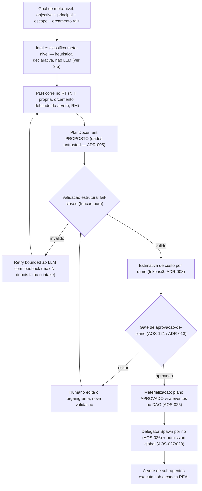

# Planeador de Objectivos e Meta-Orchestração — AOS

| Campo | Valor |
|---|---|
| Produto | AOS — Agentic OS de Referência |
| Documento | Documento técnico — Planeador de Objectivos e Meta-Orchestração |
| Versão | 1.0 (**Ratificado** — 2026-08-02) |
| Data | Julho de 2026 (ratificado Agosto de 2026) |
| Classificação | Documento de Referência — Aberto |
| Documento-fonte | `_FONTE_agentic-os-ideal.md` |
| Documentos relacionados | `tecnica/03_Orquestracao_Escalonamento.md`, `tecnica/05_Skill_Tool_Registry_Supply_Chain.md`, `tecnica/11_Convencoes_Engenharia_Evolucao.md`, `tecnica/15_Experiencia_HITL_UX.md`, `specs/EPIC-03_Orquestracao_Escalonamento.md` |

---

## 1. Introdução

### 1.1 Propósito

Este documento especifica o **Planeador (PLN)** — a graduação da função de decomposição do Orquestrador (ORQ) de *stub* estrutural para componente produtivo — e a **meta-orchestração**: a capacidade de um pedido de alto nível ("cria uma fábrica de software", "monta uma agência de marketing", "constrói o sistema de governação de X") ser decomposto num **organigrama executável de sub-agentes**, aprovado por um humano antes de consumir um único token de execução, e corrido sob a cadeia de governação já construída (EPIC-01..18 — com a autoridade de identidade, D4, entregue em código mas ainda "em provisionamento": o endurecimento é config de deployment). O eixo central é tratar o **plano proposto por um LLM como dados *untrusted*** (ADR-005): nunca é executado — é validado, orçamentado, aprovado e só então materializado no grafo de tarefas.

### 1.2 Âmbito

Cobre: o ciclo goal→plano (decomposição LLM, validação estrutural fail-closed, estimativa de custo por ramo); a materialização do plano aprovado no DAG (AOS-025) e no spawn delegado (AOS-026/028); re-planeamento de subgrafos; organizações **efémeras** de agentes (a árvore de delegação de um meta-run); e a marcação *(proposta)* do que excede a visão congelada (organizações persistentes, `org_blueprint` no registry). Fora de âmbito: o executor de skills (artefactos do REG interpretados dinamicamente — desenho separado, a especificar), a cablagem do Model Gateway real no nó (EPIC-06 entregue como pacote; o *wiring* no bootstrap é trabalho de integração), a meta-orchestração em topologia multi-host e a soberania por *tenant* (a v1 é *single-host*, ADR-018 — o distribuído é eixo do EPIC-10), e qualquer forma de marketplace/economia de agentes (horizonte, não desenhado).

**Estado de ratificação.** Este documento foi **ratificado a 2026-08-02** (v1.0), após revisão adversarial multi-perspectiva e emenda das condições (ver `docs/reports/revisao-tecnica18-planner-para-ratificacao.md`). Nasceu como proposta de desenho nos termos do `_BRIEF.md` (o que não está na fonte marca-se *(proposta)*, nunca contradizendo ADRs). **Não altera a Carta:** a secção 8 identifica explicitamente as partes que, a serem adoptadas, exigem **emenda** (`specs/00_AOS_Carta.md` §6) — e permanecem *(proposta)*, fora do que esta ratificação autoriza. Tudo o restante constrói-se dentro da forma do produto já congelada — o nó `aos` que hospeda *runs*.

### 1.3 Audiência

Arquitectos de plataforma, engenheiros de runtime e do plano de controlo, engenheiros de segurança (o planeador é uma nova fronteira de confiança), e responsáveis de produto (o planeador é a peça que transforma o runtime governado num sistema que monta equipas).

### 1.4 Definições e termos

- **Planeador (PLN):** a função de decomposição do ORQ realizada como componente produtivo; não é um componente canónico novo — é o ORQ a cumprir o seu contrato declarado (`tecnica/03` §3).
- **Documento de plano (PlanDocument):** artefacto declarativo (schema fechado) que descreve nós, papéis, dependências, ferramentas e estimativas — proposto pelo LLM, validado por função pura, aprovado por humano.
- **Meta-run:** um *run* cujo plano tem nós-papel que se expandem em sub-árvores; a "organização" é a árvore de delegação desse *run* — vive enquanto o *run* vive.
- **Organização efémera:** o conjunto de sub-agentes de um meta-run, com NHI própria na cadeia *on-behalf-of*, orçamento hierárquico e trajectória ligada — sem existência para além do *run*.
- **Re-planeamento (replan):** nova decomposição de um subgrafo após falha ou mudança de contexto, com orçamento residual e novo ciclo de aprovação conforme o nível L0–L5.
- **Organização persistente *(proposta)*:** entidade com identidade, orçamento e memória próprios que sobrevive a *runs*; fora da Carta v1 (secção 8).

---

## 2. Princípios e decisões aplicáveis (ADRs)

O ADR **central** deste documento é o **ADR-013 — Gates de risco SA-ROC + controlo bidireccional**: o gate de aprovação-de-plano deixa de ser uma conveniência de UX e passa a ser **fronteira de segurança** — é o único ponto onde um humano vê o organigrama antes do spawn. Aplicam-se ainda:

- **ADR-002 — Reference Monitor mandatório.** A materialização do plano (spawn de cada sub-agente) atravessa o RM; e o próprio planeador, sendo um agente (secção 3.2), tem as suas chamadas de modelo e de ferramenta mediadas como qualquer outro agente — o sistema come a própria comida.
- **ADR-003 — Identidade não-humana por agente.** Cada nó do organigrama recebe NHI filha na cadeia *on-behalf-of* até um humano; o planeador também. Uma "organização" é, em termos de autoridade, exactamente a sua árvore de delegação — nada mais.
- **ADR-005 — Separação control/data-plane + taint.** O PlanDocument proposto pelo LLM é **dados**: nunca é interpretado como instrução de execução. A validação é função pura sobre o documento; a materialização lê o documento *aprovado*, não a saída crua do modelo.
- **ADR-008 — Admission control global em tokens/$.** A decomposição debita do orçamento raiz da árvore; cada ramo do plano traz estimativa de custo que alimenta a reserva hierárquica (AOS-026) e o admit global (AOS-027/028).
- **ADR-009 — Layout de prompt cache-estável.** O prompt de decomposição é estático e versionado (artefacto comportamental SemVer, ADR-012); o objectivo do utilizador entra na zona volátil — nunca se reordena o prefixo por pedido.
- **ADR-012 — SemVer + eval-gate para auto-modificação.** Quando o planeador identifica uma *capability* inexistente e propõe criá-la, a skill candidata entra no pipeline staging → eval-gate → canary → ratificação assinada — o plano fica **bloqueado** nesse nó até à ratificação (ou o humano substitui o nó).
- **ADR-014 — Taxonomia L0–L5.** O planeador **nasce a L0**: todo o plano exige aprovação humana. A promoção acontece só por fiabilidade medida (secção 7.2), nunca por conveniência de lançamento.
- **ADR-018 — Fronteira nó↔ORQ/SCH.** Na v1 *single-host* a **autoridade** de decomposição é do ORQ (plano de controlo); a **execução** do planeador é a de um agente hospedado pelo *agent-runtime* (kernel), invocado pelo ORQ na direcção control-plane→kernel. É consumido **num colaborador dedicado**, fora do módulo de ciclo-de-vida concorrente cuja importação o guard-test `boundary_orq_sch_test.go` proíbe — a fronteira congelada não se atravessa em silêncio.

---

## 3. Do objectivo ao plano

### 3.1 O defeito que se fecha

O ORQ declara decompor objectivos em grafo de tarefas (`tecnica/03` §3), mas a implementação actual é um **stub**: o grafo tem sempre um único nó derivado directamente do `Goal`, sem planeamento real (`packages/control-plane/orchestrator/orchestrator.go` — "NÃO-PRODUTIVO (esqueleto AOS-012)"). Toda a maquinaria a jusante é real e testada — DAG com aciclicidade e deadlock (AOS-025), delegação com NHI e orçamento CAS (AOS-026), admission global (AOS-027/028), gate pré-spawn (AOS-121) — mas nada a alimenta. Um pedido "cria uma agência de marketing" produz hoje um *run* de 1 nó. O planeador é a peça em falta; este documento especifica-a.

### 3.2 O planeador é um agente governado

Decisão de desenho: o planeador **não é um caminho especial que chama o LLM fora do runtime** — é ele próprio um agente que corre no RT, com NHI própria (`agent:planner` na cadeia de delegação do *run*), orçamento debitado da árvore, mediação RM das suas chamadas e trajectória OTel ligada ao *run* (`traceparent`, AOS-077). A sua "skill" é a decomposição: recebe o objectivo e o contexto de *capabilities* disponíveis, e emite um PlanDocument. As alternativas — chamada directa ao GW pelo ORQ, ou planner como biblioteca pura invocada pelo SCH — foram rejeitadas por quebrarem a mediação total (ADR-002) ou por esconderem o custo do planeamento fora da contabilidade da árvore (ADR-008). O planeamento **custa tokens e pode ser atacado**; tratá-lo como um agente normal dá-lhe, de graça, orçamento, taint, observabilidade e replay. *Precisão de camada:* a autoridade da decomposição é do ORQ (ADR-018); o que "corre no RT" é o agente-decompositor que o ORQ hospeda e invoca — produz o PlanDocument, mas **não o materializa** (a materialização, §6.1, é do ORQ). O arranque do planeador é ele próprio admitido: uma **reserva de planeamento de primeira classe** para `agent:planner` (contexto × tabela de preços AOS-062 × factor de retry N) é debitada e admitida *antes* da decomposição, fail-closed, com evento de spawn próprio (§6.1). Toda a fase de planeamento é observável como *spans* OTel ligados ao *run* (AOS-077): cada uma das N tentativas de decomposição, o gate de aprovação e a materialização emitem *spans* filhos do `traceparent` do meta-run — o planeamento não é um ponto cego na trajectória.

### 3.3 O PlanDocument — schema fechado, versão própria

O contrato entre o LLM e o sistema é um documento declarativo com **schema fechado e `plan_version` SemVer** — à imagem dos contratos de porta (`tecnica/12`). Campos por nó: `node_id` (estável), `role` (papel declarativo livre, ex.: "engenheiro-backend", "gestor-de-conteúdo"), `objective` (subtarefa), `tools` (lista de ferramentas **por referência pinada ao REG** — nome + versão + digest), `depends_on` (arestas), `budget_estimate` (tokens/$), `risk_class` (SA-ROC: safe/gray/danger — campo *advisory* proposto pelo LLM que **só pode elevar** o piso derivado na validação, nunca baixá-lo, com justificação textual). Campos de topo: `objective` original, `budget_total` (soma dos ramos + margem de replan), `planner_meta` (modelo, versão do prompt de decomposição, hash do contexto de *capabilities*).

Regras de validação (função pura e determinística, **sem LLM**, executada sobre o documento e um *snapshot* de *capabilities* pinado no `propose` — `capabilities_hash` em `planner_meta` — logo sem I/O vivo):

1. **Schema** — campos desconhecidos rejeitados; tipos e cardinalidades verificados (à imagem do `DisallowUnknownFields` dos ficheiros de config do nó).
2. **Aciclicidade** — a mesma verificação incremental do DAG (AOS-025); uma proposta cíclica é lixo, não um caso especial.
3. **Resolução de ferramentas** — toda a referência `tools[]` resolve contra o **snapshot de REG pinado no `propose`** (versão pinada, digest, admissibilidade); uma ferramenta inexistente, deprecada ou fora da *allowlist* do papel **rejeita a proposta** — não há *trimming* silencioso. A resolução contra REG vivo é gate de *proposta*, não de *replay* (reconciliação revogação↔replay em `tecnica/05`) — o *snapshot* torna a validação reproduzível.
4. **Tectos estruturais** — profundidade ≤ `max_depth`, fan-out ≤ `max_fanout` e **cardinalidade total ≤ `max_nodes`**; são tectos **próprios do plano** (limitam o *tamanho* do organigrama), com derivação declarada e auditável — distintos do tecto de concorrência de spawn de AOS-028 (sub-agentes *activos* em simultâneo, que não limita a cardinalidade total). Nunca constantes mágicas.
5. **Orçamento** — `budget_total` ≤ orçamento raiz remanescente; o passo de custo **re-preça** cada ramo de forma determinística e independente (tabela versionada AOS-062), não ecoando o `budget_estimate` proposto — divergência acima de tolerância rejeita ou faz *clamp*. Cada nó tem **teto de custo duro** que dispara o breaker (AOS-029); um nó que exceda a reserva por-ramo bloqueia para re-aprovação, nunca *overrun* silencioso.
6. **Risco derivado** — a validação **deriva** o `risk_class` de cada nó a partir das ferramentas pinadas (efeito irreversível ou egress externo de dados sensíveis ⇒ `danger`, nunca auto-aprovável); o campo proposto pelo LLM só é aceite se ≥ ao piso derivado. Todo o nó `danger` tem *approval-card* por efeito concreto, com confirmação individual e *timeout* fail-closed (AOS-120), nunca agrupável em lote.

Uma proposta inválida não se "corrige por baixo da mesa": volta ao LLM com o diagnóstico (máx. N tentativas, N=3 por omissão) e esgota-se em falha de intake — fail-closed, sem plano fantasma.

#### 3.3.1 Arestas condicionais — a gramática do subconjunto fechado

ADR-022 §2.1 (ratificado 2026-08-13) decidiu **que** o `Node` admite arestas com condição — «expressão declarativa em subconjunto fechado do schema, sem código arbitrário, avaliada deterministicamente sobre o resultado registado do nó de origem» — e deixou a **gramática concreta** expressamente fora (§4). Esta secção fixa-a (AOS-270). É trabalho de implementação da decisão, não re-abertura dela.

**Forma.** Cada nó pode declarar `conditional_on[]`: arestas *origem → este nó* guardadas por uma condição. Tal como `depends_on`, a aresta é declarada no **destino** e aponta para trás — é isso que permite que a aciclicidade reutilize, sem uma linha nova de travessia, a verificação incremental de AOS-025 (regra 2). Um «ramo» escreve-se como duas arestas simétricas sobre a mesma origem (o nó do caminho feliz condiciona-se a `verdict eq pass`; o do caminho de reprovação a `verdict eq fail`).

**Gramática.** Cada aresta tem uma **conjunção plana** de 1..8 predicados; cada predicado é `(observável, operador, operando)`:

| Observável (`subject`) | Operandos admissíveis | Operadores |
|---|---|---|
| `terminal_state` | `complete` \| `failed` | `eq`, `ne` |
| `verdict` | `pass` \| `fail` | `eq`, `ne` |
| `metric` (com `metric`: nome de charset fechado) | inteiro (`number`) | `eq`, `ne`, `lt`, `lte`, `gt`, `gte` |

**Porque é fechado** (o argumento, não a afirmação): (i) *finitude* — três observáveis e seis operadores, ambos enums fechados; operandos ou de um enum fechado ou inteiros de máquina — **nunca vírgula flutuante**, que não é reproduzível byte-a-byte entre plataformas e partiria §3.4; (ii) *não-recursividade* — conjunção plana, sem aninhamento, parênteses, negação estrutural nem disjunção: não há profundidade a explorar e a aridade é limitada; (iii) *ausência de código* — não há chamadas, aritmética, indexação nem interpolação: um predicado **compara**, não **computa**; (iv) *totalidade* — todo o predicado bem-formado dá `true` ou `false`, e um observável **ausente** dá `false` (fail-closed na direcção de *não* despachar, a única sem efeito).

**Monotonia.** Todas as combinações são conjunções — entre predicados de uma aresta e entre arestas de um nó. Logo, acrescentar uma aresta condicional só torna um nó **menos** despachável, nunca mais: uma condição é um travão adicional, jamais um atalho a um `depends_on` ou ao gate. A disjunção fica deliberadamente de fora (declara-se um nó por ramo).

**Regras de validação** (as que já existem, atravessadas pelo campo novo — não uma regra 7):

- *regra 1* — a origem tem de existir no **mesmo plano** (é o que dá corpo a «declarados à priori»); e a mesma origem **não pode** aparecer em `depends_on` **e** em `conditional_on` do mesmo nó (semânticas de espera diferentes; a sobreposição esconde do revisor humano qual delas vale).
- *regra 2* — as arestas condicionais entram **no mesmo DAG de admissão**: é isto, e só isto, que impõe «uma aresta condicional nunca fecha ciclo». Um ramo que apontasse para a região já executada teria de apontar para um antecessor, e apontar para um antecessor **é** fechar um ciclo. O retorno a nós já executados continua a ser replan de subgrafo (§4.2).
- *regra 4* — os tectos estruturais contam a **união** dos dois canais de aresta; caso contrário o canal novo seria uma saída livre do `max_fanout`/`max_depth`.

**Avaliação e replay.** A condição é avaliada pelo despachante sem estado (§4.4) como **função pura do resultado registado** — nunca por um LLM em runtime, nunca sobre estado vivo. A decisão é apensa como facto (`plan.branch_decided`, §6.1) com o **digest canónico** da expressão; numa passagem posterior ou num replay a decisão é **lida**, e o avaliador nem chega a ser alcançado. Um digest divergente do documento significa plano editado — que não é um replay: volta ao gate (fail-closed). Avaliar **debita o orçamento da árvore** (ADR-008) uma vez por decisão; uma condição ainda indecisa não debita nada, para que re-invocações do escalonador durante a espera não drenem a árvore.

**Versão de schema.** `conditional_on` é **opcional e aditivo**: um documento sem ele decodifica e comporta-se como antes, pelo que a extensão **não** consome um MAJOR (§3.6) — carimba-se no MINOR `1.1.0` (§3.6.1, AOS-273).

#### 3.3.2 `role: verifier` — a semântica de sistema e o schema do veredicto

ADR-022 §2.2 (ratificado 2026-08-13) decidiu **que** o papel verificador deixa de ser rótulo e ganha quatro propriedades impostas pelo sistema, e deixou o **schema do veredicto** expressamente fora (§4). Esta secção fixa-o (AOS-271). É trabalho de implementação da decisão, não re-abertura dela.

**O papel reservado.** `role` continua texto livre; **um** literal — `verifier` — passa a ser reservado e *case-sensitive* (`Verifier` não é o papel: comparar sem distinção daria a um plano hostil um rótulo que **parece** verificador ao revisor humano do PlanCard e escapa ao clamp do sistema). Declarar `role: verifier` é declarar as quatro propriedades abaixo, não pedi-las.

**(1) Read-only por construção — e o critério de «tool de efeito».** O ADR enumera exemplos («escrita MEM, egress, spawn»), não um critério. Inventar uma lista de nomes de ferramentas seria uma *allowlist* mágica que qualquer tool nova contorna por não constar dela. O critério **deriva-se dos eixos de risco PINADOS** que a regra 6 (§3.3, risco derivado) já consome:

> Uma tool tem **efeito** se, pelos eixos pinados da sua capability, `egress ≠ none` **ou** `reversibility = irreversible`.

O mapeamento à enumeração do ADR é **quase** exacto, e a parte que falta está declarada em vez de assumida em silêncio. O *egress* é um eixo directo. O **spawn** NÃO é uma tool: no organigrama é materializar-se como papel-que-expande, com `identity.ChildRequest` própria e sub-árvore de delegação a jusante — pelo que se impõe **estruturalmente**, não por eixo de risco: nenhum nó pode declarar um verificador em `depends_on` (regra de admissão), e o materializador força `SpawnLeaf` para `IsVerifier()` independentemente do classificador injectado. A **escrita em MEM** apoia-se numa *invariante de classificação do REG* — toda a capability que muta estado é classificada `Irreversible` —, que é uma **suposição sobre o catálogo**, não algo que o código imponha: não há eixo de MUTAÇÃO nos eixos pinados, pelo que uma escrita local com *undo* classificada `EgressNone` + `Reversible` contaria como leitura. Tornar a invariante executável (quarto eixo, fail-closed) exige o construtor real do snapshot, que ainda não existe — registado com eixo em `docs/governance/REGISTO-Deferimentos.md` (**DEF-275**, eixo AOS-238). A **sensibilidade não entra**: ler material sensível é uma leitura, e um verificador que não pudesse observá-lo não conseguiria verificar o trabalho que interessa — o que a sensibilidade governa é o risco do nó e a fricção do gate, não a fronteira read-only. É **fail-closed pelo tipo**, sem uma linha para isso: os valores-zero de ambos os eixos são os perigosos, pelo que uma capability **por classificar** conta como de efeito. Três linhas de defesa, nesta ordem: o **validador rejeita** o plano (um verificador com tool de escrita nunca chega ao PlanCard, senão o cartão descreveria uma execução diferente da real); a **materialização clampa** a `Authority[]` da NHI (defesa-em-profundidade para documentos que cheguem por replan/migração/edição, com o que for retirado **visível** em `plan.materialized`); o **RiskGate do RM** (AOS-074) é a linha final, fail-closed.

**(2) Produtor ≠ verificador — a direcção, e porquê.** A frase do ADR admite, à letra, uma leitura **impossível de satisfazer**, e vale a pena registá-lo em vez de a escolher em silêncio. Se «sub-árvore de W» fosse «os descendentes de W no grafo», o organigrama canónico — `W` produz → `V` verifica (`depends_on W`) → `C` consome guardado por `verdict eq pass` — seria sempre rejeitado: um verificador tem obrigatoriamente de **ler** o trabalho, logo depende dele, logo é seu descendente. A regra recusaria todos os planos, incluindo os que o ADR desenha.

A leitura que resta é a que tem conteúdo de segurança: o que a verificação exige é **independência** entre quem julga e quem trabalha, e no organigrama a dependência só existe numa direcção. O verificador pode estar **a jusante** do trabalho (lê-o — é o que o torna um verificador); o que não pode é estar **a montante** dele, porque um nó de que o trabalho descende é o nó que **encabeça a sub-árvore que o produziu** (é a definição que a materialização já usa: «um nó de que outros dependem encabeça uma sub-árvore de trabalho a jusante e materializa-se como sub-agente delegado», §4.1). Em concreto, para cada aresta condicional `C ← V` com predicado sobre `verdict`: nenhum dos **outros** produtores de `C` pode ser alcançável a partir de `V`. A decisão é **alcançabilidade no mesmo DAG de admissão** de AOS-025 — o mesmo primitivo da aciclicidade, exposto e não duplicado; uma segunda travessia escrita à parte podia divergir desta em silêncio.

**(3) O veredicto é atribuído, não presumido.** Duas regras completam a atribuição: só um nó `role: verifier` pode ser a origem de um predicado sobre `verdict` (é isto que fecha a auto-certificação directa — sem esta regra, `conditional_on: [{from: A, when: [verdict eq pass]}]` com `A` = o próprio produtor era um plano admissível); e um verificador cujo veredicto seja consumido tem de ter **pelo menos uma aresta de entrada** — um verificador solto não observa nó nenhum, e o seu `pass` é uma constante com nome de veredicto (e a forma mais barata de lavar uma auto-certificação).

**(4) O schema do veredicto.** A saída de um verificador é um **objecto tipado**, apenso como facto `plan.verdict_recorded` (§6.1) — não uma conversa:

| Campo | Forma | Porquê |
|---|---|---|
| `node_id` | node_id do **verificador** emissor | É a chave da **atribuição**; sem ela um veredicto é uma opinião anónima e a regra (2) não tem a que se ancorar no log |
| `subjects[]` | 1..32 node_ids **examinados**, ordem declarada, **nunca** o emissor | É o **sujeito** do veredicto («este *pass* é sobre quê?»); a auto-verificação é recusada aqui como o é na admissão |
| `outcome` | `pass` \| `fail` | O **mesmo** alfabeto da partição de `verdict` em §3.3.1 — as constantes derivam dele, pelo que não há tabela de tradução entre emissor e consumidor que possa divergir |
| `reasons[]` | 0..16 **códigos** (charset fechado, minúsculas/dígitos/`_`/`.`, ≤64) | Uma razão é um **código, nunca uma frase**. O verificador olha para material *untrusted* (ADR-005): se a razão pudesse ser texto livre, o veredicto era o canal por onde o conteúdo do trabalho — excertos, segredos, injecção dirigida a quem lê o log — entrava no Event Store com a autoridade de um facto do sistema. Mesmo raciocínio que faz `plan.validation_failed` descartar o detalhe cru |
| `metrics[]` | 0..32 pares (nome de charset fechado, **inteiro**) | O material dos predicados `metric` de §3.3.1. Sem vírgula flutuante — não é reproduzível byte-a-byte e partiria §3.4. «87.4%» escreve-se `coverage_permille = 874` |

O facto é **único e imutável por verificador** (o `step_id` é por nó, pelo que a `idempotency_key` do Event Store impede que um segundo `pass` silencioso substitua um `fail`). O consumo fecha o circuito: `outcome` e `metrics[]` projectam-se no resultado registado que o despachante observa; as **razões não atravessam** — se um ramo pudesse condicionar sobre elas, a gramática fechada de §3.3.1 ganhava um quarto observável sem passar pelo schema. O estado terminal também não vem daqui: é do ciclo de vida do nó (AOS-017) — um verificador não declara o seu próprio estado terminal.

**Débito.** Verificar custa como qualquer nó: o verificador é admitido, orçamentado e re-preçado pelas regras 5–6, sem excepção (ADR-022 §2.2, quarta propriedade).

#### 3.3.3 Payload tipado por aresta — os tipos, a derivação do *taint* e o transporte por referência

ADR-022 §2.3 (ratificado 2026-08-13) decidiu **que** os nós declaram `outputs` e as arestas `consumes` — contratos «(nome, schema, classificação de *taint*)» validados estaticamente —, congelou a rejeição (c) (o transporte **não** é um *blackboard*: é «referência a registo no Event Store/MEM com proveniência»), e deixou os **tipos de payload** expressamente fora (§4). Esta secção fixa-os (AOS-272). É trabalho de implementação da decisão, não re-abertura dela.

**Onde vive o `consumes`.** Há dois canais de aresta (`depends_on`, uma lista de node_ids; `conditional_on`, §3.3.1) e o `consumes` teria de caber nos dois — mas `depends_on` é uma lista de strings, e alargá-la a objectos é uma **quebra de forma**, logo um MAJOR (que ninguém quis pagar: §3.6.1). A forma escolhida declara a aresta de dados **pelo seu extremo consumidor**: `consumes[]` nomeia a **origem**, o **output** e o **tipo esperado**. O par (origem → este nó) *é* a aresta, os dois canais ficam servidos por uma regra, e o campo é opcional e aditivo (sem MAJOR).

A contrapartida é a invariante que mantém o grafo de dados subordinado ao de execução: **a origem tem de ser uma aresta de entrada já declarada**. Consequências, ambas desejadas: não se consome o trabalho de quem não se espera (uma leitura sem precedência é uma corrida com o produtor, e o resultado passaria a depender do escalonador — adeus §3.4); e o grafo de payload é um **sub-grafo do DAG de admissão**, logo **acíclico por construção** — sem travessia nova e sem um detector que se possa esquecer de correr, exactamente como §3.3.1 fez com as arestas guardadas por condição.

**Os tipos.** Enum fechado e deliberadamente curto — abrir uma linguagem de tipos dentro do documento seria código arbitrário por outro nome, que é o que §3.3.1 já recusou para as condições:

| `type` | O que é | Forma fechada? |
|---|---|---|
| `summary` | o resumo em linguagem natural (o resumo filho→pai de «contexto ≠ registo») | não |
| `record` | registo estruturado produzido pelo nó (estruturado ≠ fechado: os valores vêm do trabalho) | não |
| `artifact` | referência a artefacto armazenado (ficheiro, blob) — conteúdo opaco | não |
| `metrics` | nomes de charset fechado + valores **inteiros** (a mesma forma dos predicados `metric`) | **sim** |
| `verdict` | o veredicto tipado de §3.3.2, validado na emissão | **sim** |

**A compatibilidade de tipo é identidade**, não subtipagem: o consumidor declara o que espera e tem de ser **igual** ao que o produtor declara. Sem coerção, promoção nem tipo universal — a mesma disciplina de «comparar, não computar». Uma relação de subtipagem obrigaria o validador a **raciocinar** sobre tipos, e um raciocínio é uma superfície onde uma incompatibilidade real se perde.

**O *taint* não é declarado — é derivado do tipo.** A classificação que o ADR pede **não** é uma taxonomia nova: são os dois rótulos do reticulado canónico de ADR-005 (`trusted ⊑ untrusted`). O que esta secção fixa é de **onde** o rótulo vem, e não vem da palavra do planeador — que é *untrusted* como todo o documento:

> Um payload cujo tipo é **fechado por construção** — só símbolos de enum, códigos de charset fechado e inteiros, **carregados INLINE no facto e validados pelo construtor da emissão** — não tem por onde veicular o conteúdo do trabalho. Um payload cujo tipo **admite conteúdo** carrega trabalho, e o trabalho de um nó é saída de modelo, que ADR-005 classifica *untrusted* por construção: **`untrusted`**.

**O tipo sozinho não chega, e a auditoria adversarial da wave provou-o.** `type` é um campo do documento *untrusted*: declarar `type: metrics` num output que na verdade carrega prosa entregava material untrusted a um consumidor privilegiado com rótulo `trusted`, porque nada — nem na admissão nem na emissão — verificava a **forma real** do que era publicado (o conteúdo vivia atrás de um *locator* opaco). O rótulo `trusted` exige por isso **duas** condições, e o piso é `untrusted` sempre que uma falhe:

1. **Autoridade** — o tipo é de forma fechada **e o produtor é um nó `role: verifier`**. O verificador é o ponto de desclassificação que §3.3.2 sanciona, e o que o **ganha** são as suas três propriedades impostas: independência do trabalho que julga, *read-only* por construção, e não produzir trabalho ele próprio (um verificador só pode declarar `outputs` de forma fechada). Qualquer outro nó publica `untrusted`, o que **subsume a propagação pelo reticulado**: um nó intermédio não pode lavar *untrusted*→*trusted* num salto, porque não pode publicar *trusted* de todo.
2. **Forma** — o facto `plan.payload_published` de um tipo fechado carrega o conteúdo **inline** (`outcome`/`reasons`/`metrics`, validados como o veredicto de §3.3.2) e **não tem locator**; o de um tipo aberto carrega **locator** e **nenhum conteúdo**. Não há a hipótese intermédia — uma referência opaca com rótulo `trusted` — que era o buraco.

O campo `taint` do documento é **advisory e só eleva** — a mesma regra já ratificada para o `risk_class` (regra 6). Declarar `untrusted` num output fechado é honrado; declarar `trusted` num resumo é **ignorado**. Não há caminho por onde o documento baixe um rótulo, que é precisamente a propriedade do reticulado de ADR-005 («não existe desclassificação»). É **fail-closed pelo tipo e pelo papel**: um tipo por classificar, ou um produtor que não seja verificador, tem piso `untrusted`.

**A autoridade do consumidor, e de onde se deriva.** O ADR remete para ADR-005, cuja invariante P0 é imposta em *runtime* pelo `TaintGate`: conteúdo *untrusted* não satisfaz uma capability **privilegiada**. O RM classifica «privilegiado» com uma allowlist de **nomes** fornecida pelo operador; o validador de planos não tem esse conjunto (nem devia — é política de ápice), mas tem o que os nomes representam: os **eixos de risco pinados**. O critério deriva-se daí e é **exactamente** o de «tool de efeito» de §3.3.2 (`egress ≠ none` **ou** `reversibility = irreversible`): uma definição, agora com duas perguntas — «um verificador pode pinar isto?» e «este consumidor detém autoridade privilegiada?». Uma segunda taxonomia daria duas respostas que envelheceriam em direcções diferentes.

Consequência prática, e é a desejada: **um nó que pina uma tool de egress não pode consumir um resumo produzido por outro nó**. Não é um efeito colateral — é a barreira P0 aplicada na **admissão**, antes de queimar um token, em vez de no RM depois do *spawn*. O caminho legítimo continua a existir e escreve-se no organigrama: um verificador (§3.3.2) ou um nó `danger` com *approval-card* (§4.3) entre o material *untrusted* e a acção privilegiada; um payload de forma **fechada** (métricas, veredicto) alimenta um consumidor privilegiado sem fricção nenhuma. O que deixa de existir é o caminho **silencioso**.

**Rejeições** (quatro sub-códigos, porque cada uma se corrige de maneira diferente): `consumes_unknown_edge`, `consumes_unknown_output`, `consumes_type_mismatch`, `consumes_taint_authority`.

**O transporte é referência, e porque isso não é um *blackboard*.** Um *blackboard* tem quatro propriedades; a forma escolhida nega as quatro **por construção**:

| Propriedade do *blackboard* | O que fica no lugar |
|---|---|
| qualquer nó lê qualquer coisa | um nó só obtém o que **declarou** consumir; não existe operação que devolva «tudo o que há» — o conjunto legível é o contrato, fixado na admissão. *(Esse contrato é agora **visível no `PlanCard`** do gate, em forma canónica `origem:output:tipo` — ver o fim desta secção.)* |
| o valor muda debaixo de quem o lê | a publicação é um facto append-only com `step_id` **por contrato** (`plan.payload_published`, §6.1) ⇒ facto único e imutável; o `digest` do conteúdo deixa quem resolve **verificar** o que leu |
| o conteúdo viaja | nas formas **abertas** (`summary`/`record`/`artifact`) o que atravessa é *locator* + *digest* + tipo + *taint* + proveniência, e **não há campo de conteúdo** — o material obtém-se indo ao registo, sob a governação desse registo (quarentena da MEM, TTL, *erasure*): «contexto ≠ registo». Nas formas **fechadas** (`metrics`/`verdict`) é o **inverso e de propósito**: o conteúdo — só símbolos, códigos e inteiros — viaja **inline** e validado pelo construtor, e **não há locator**; é isso que torna «fechado por construção» uma propriedade imposta em vez de uma palavra do documento |
| a proveniência dilui-se | cada referência carrega `derived_from[]` — os contratos de que deriva, pela ordem publicada, como as `origins` do `taint.Value` canónico |

**Versão de schema.** `outputs`/`consumes` são **opcionais e aditivos**: um documento sem eles decodifica e comporta-se como antes, pelo que a extensão **não** consome um MAJOR (§3.6) — carimba-se, com a reserva do literal `verifier` de §3.3.2, no MINOR `1.2.0` (§3.6.1, AOS-273).

**O gate VÊ as extensões — a porta e o cartão (DEF-274).** O invariante §2.4(5) do ADR-022 («o humano no gate vê o organigrama **com** as condições e os verificadores declarados») deixou de ser uma afirmação por cumprir. `planapproval.PlanNode` (`packages/control-plane/governance/plan-approval`) transporta agora `Role`, `ConditionalOn`, `Outputs` e `Consumes`, e o `PlanCard` projecta-os em `node_extensions[]` — por nó, na ordem topológica: o **papel** (`verifier` distingue quem julga de quem produz), as **condições** que governam a entrada do nó em forma canónica (`revisao{verdict=eq=fail,metric(fontes)=lt=3}`), e os contratos de dados (`nome:tipo:taint`, `origem:output:tipo`). `PlanCard.VerificationView()` dá a leitura directa **quem verifica quem, sob que condição**. Três propriedades sustentam-no:

- **Content-free por estrutura, não por convenção — nas DUAS portas.** A regra de ouro do cartão («sem segredos: o *preview* é o efeito resolvido, nunca o *input* da tool») é imposta: tudo o que atravessa a porta é um **símbolo** de charset ASCII fechado, um **inteiro** decimal canónico ou uma **referência** a um nó do próprio plano. Qualquer outra coisa — um valor de payload, um excerto de output, um *locator* — **recusa o plano** (`ErrNonCanonicalExtension`), em vez de degradar o cartão. E a imposição não é só do caminho de **construção**: o *wire* é o contrato que os adaptadores consomem e entra por `PlanCard.UnmarshalJSON`, pelo que a mesma gramática é **re-parseada** na desserialização (papel, `conditions[].canonical` contra `from{p1,p2}`, cada segmento de `outputs`/`consumes`) — sem isso existia uma porta por onde um cartão entrava sem passar pela porta que impõe a forma, e o material do *run* chegava ao aprovador por aí.
- **A ordem apresentada é a que vai correr — e o grafo apresentado também.** Uma aresta condicional é **também** precedência (a condição avalia-se sobre o resultado registado da origem), pelo que entra na ordenação topológica do cartão — e, com ela, na detecção de ciclo: o invariante 1 do ADR vale no cartão sem uma travessia nova. O cartão **serializa** essa aresta, em `conditional_edges[]`, distinta de `edges[]` (que continua a ser o canal declarado, porque é o que a edição humana devolve em `RevisedEdges`): sem o campo, o único campo do cartão com forma de grafo omitia precisamente a ligação guardada, e uma superfície que desenhasse o organigrama a partir de `edges` mostrava o nó guardado como **raiz sem entrada** — «corre incondicionalmente desde o início», a leitura oposta à verdade. A validação exige que toda a condição projectada tenha a sua aresta num dos dois campos, e a projecção por-nó é **posicionalmente alinhada** com a ordem (não apenas do mesmo comprimento).
- **O gate não é uma segunda autoridade de gramática.** Partições de operando, tectos de aridade, compatibilidade de tipo e autoridade de *taint* continuam a ser do validador puro (§3.3.1–§3.3.3, AOS-231); o gate impõe só a forma que precisa para não virar canal de conteúdo, e apresenta o resto tal-qual. O módulo mantém-se **desacoplado**: não importa o orquestrador — a forma canónica é declarada localmente e a isomorfia com `plan.CanonicalConditional`/`CanonicalOutput` é **pinada por literal** no teste (um módulo desacoplado não a pode cruzar de outra maneira; é o preço declarado do desacoplamento). Contrato do cartão: `aos.plan.card.v1` **1.1.0** (MINOR — adição retrocompatível).

**Limite que resta — o *wiring*.** O que está entregue é a **porta e o cartão**: um `Plan` que declare as extensões produz um cartão que as mostra, com prova falsificável. O **mapeamento** `PlanDocument → planapproval.Plan` (ler `plan.Node.Role`/`ConditionalOn`/`Outputs`/`Consumes` e o *taint* **efectivo** já derivado por `EffectiveOutputTaint`, e povoar a porta) vive a jusante e **não existe ainda em produção** — nenhum caminho compõe hoje o planeador com o gate; o `aos-demo` constrói o `Plan` à mão. Enquanto esse mapeador não existir, a visibilidade é uma **capacidade do contrato**, não um facto de fim-a-fim. Eixo: **AOS-238**; registado em `docs/governance/REGISTO-Deferimentos.md` (**DEF-274**).

### 3.4 Determinismo e replay

A proposta do LLM é, por natureza, não-determinística — e o AOS exige replay byte-a-byte (ADR-001/010). A resolução é a já praticada para não-determinismo no runtime (AOS-016): **o ponto de não-determinismo é capturado, não eliminado**. O PlanDocument **aprovado** (mais o contexto de *capabilities* e a versão do prompt) é persistido como evento append-only (`plan.proposed`, `plan.validated`, `plan.approved`, `plan.materialized`, com hash do documento) e o manifesto do *run* inclui o plano aprovado. O replay **nunca re-chama o LLM**: **reproduz os eventos de materialização e execução capturados** (`plan.materialized` e os turnos gravados) — o documento aprovado é o registo/input, não o gerador do replay; nunca re-resolve o REG nem re-atravessa o RM. O planeamento acontece uma vez, na história; a execução é replayable **enquanto a captura for admissível** (AOS-016; sujeita a TTL/erasure — AOS-079/093).

### 3.5 Classificação de intake: *routing*, não autoridade

O nó `INT` do fluxo (§3.2) decide se um `Goal` toma o caminho do planeador (meta-run: PlanDocument + gate) ou o caminho directo (tarefa simples, 1-nó). O desenho:

- **Determinística e sem LLM.** É função pura sobre os campos **declarativos** do `Goal` — nunca sobre a interpretação semântica do texto do `objective` (isso reintroduziria um LLM não-governado e uma superfície de *taint* logo no primeiro passo do fluxo). Sinais admissíveis: o `intake_mode` explícito do principal (canal de controlo autenticado), o orçamento raiz face a um limiar configurado por *tenant*, tectos estruturais pedidos explicitamente (`max_depth`/`max_fanout` acima do trivial) e a cardinalidade de papéis/capabilities do pedido estruturado. O resultado é reproduzível e entra em `plan.intake_classified` com a heurística aplicada (ADR-010).
- **Fail-safe na direcção da supervisão.** Em ambiguidade, classifica **meta** (mais escrutínio: planeamento + PlanCard), nunca simples. Sub-classificar um pedido grande como simples é falha de *produto* (o run sub-entrega), não de segurança — mas para não depender disso, vale a invariante seguinte.
- **A invariante de não-bypass.** A fronteira de segurança real é o gate por-spawn (ADR-013). Um run classificado "simples" é 1-nó por construção; **qualquer** tentativa de delegação desse nó (spawn de filho, AOS-026) reentra no mesmo gate ao nível L0–L5 do chamador — um "plano *just-in-time*" do subgrafo. O gate de plano do meta-run é apenas a forma *antecipada e de organigrama completo* do mesmo gate por-spawn. Logo, manipular o classificador para "simples" **não escapa** ao gate; e como o texto do `objective` não é input de classificação, injecção no objectivo não troca a rota.
- **Custo.** Rotear para meta debita o planeamento (§7.3); a preferência por simples em pedidos pequenos existe para não pagar decomposição onde um único nó chega — e é a invariante de não-bypass que torna essa optimização segura.

### 3.6 Evolução e migração do `plan_version`

O `plan_version` (§3.3) é a versão de *schema* do PlanDocument, distinta da `prompt_version` e do `capabilities_hash` (ambos em `planner_meta`) — os três pinados para reprodutibilidade. Regras:

- **SemVer do schema.** MAJOR = mudança que quebra (campo removido ou semântica alterada); MINOR = aditivo retrocompatível; PATCH = clarificação. As propostas novas saem sempre na versão **corrente**, validadas contra o schema corrente.
- **Planos aprovados são congelados.** Um plano materializa-se na versão em que foi aprovado — nunca migrado por baixo. Se o schema sobe entre a aprovação e a materialização, materializa-se na versão carimbada enquanto o *reader* existir; se essa versão já foi retirada, o plano é **invalidado** e volta a planeamento + nova aprovação (fail-closed, nunca auto-migração).
- **Janela de suporte de replay.** O materializador retém *readers* para uma janela declarada de MAJORs históricos. Um run cujo `plan_version` MAJOR caiu fora da janela é **inadmissível** — a mesma inadmissibilidade fail-closed de um payload perdido (§3.4). A garantia de §3.4 estende-se: replayable *enquanto a captura **e** o reader do `plan_version` forem admissíveis*.
- **Mudar o schema é mudança governada.** Um bump MAJOR passa pela disciplina ADR-012 (eval-gate, canary) como qualquer artefacto comportamental, e entrega-se com uma de duas: *reader* retido para a versão antiga, ou **deprecação documentada** do suporte de replay dessa versão — com as implicações de retenção/legal-hold (AOS-079/093: um run sob versão a retirar tem de ser sinalizado antes de perder admissibilidade).

#### 3.6.1 A linha corrente e a janela de suporte **declarada**

§3.6 fixa as *regras*; falta o que elas exigem que exista de facto — **o valor declarado**. Sem ele, «janela de suporte» é uma boa intenção: um operador que precise de saber se um run de 2026-07 ainda reproduz não tem onde ler a resposta, e a deprecação de uma versão acontece por omissão em vez de por decisão. Esta secção é esse valor (AOS-273).

**A linha 1.x, MINOR a MINOR.** Cada MINOR é aditivo e retrocompatível; um documento carimbado numa linha anterior continua admissível e materializa-se **na sua versão** (§3.6, «planos aprovados são congelados»).

| `plan_version` | O que a linha acrescentou | Ticket |
|---|---|---|
| `1.0.0` | a linha base do PlanDocument (schema fechado, §3.3) | AOS-230 |
| `1.1.0` | `conditional_on` — arestas guardadas por condição (§3.3.1) | AOS-270 |
| `1.2.0` | `outputs`/`consumes` (§3.3.3) **e** a reserva do literal `verifier` no campo `role`, com a semântica de sistema de §3.3.2 imposta na admissão | AOS-271, AOS-272 |

**A janela declarada: `MinMajor = 1`, `MaxMajor = 1`.** Só o MAJOR 1 tem *reader* retido. Um run cujo `plan_version` caia fora — hoje, qualquer MAJOR ≠ 1 — é **inadmissível** na leitura *e* na escrita (`planmigrate.ErrOutsideSupportWindow`), tratado como um payload perdido: não se adivinha, não se auto-migra. A janela é uma decisão de **operação** (que *readers* se retêm), não uma consequência automática do schema: o `planmigrate` nunca lê a versão corrente do módulo — lê a versão em que o plano foi **aprovado**. O valor tem **âncora em código** — `planmigrate.DeclaredWindow`, com esta secção citada no seu doc —, e não só nesta prosa: enquanto viveu apenas aqui e numa variável de teste, documento e código podiam divergir sem nada avermelhar. *Alcance honesto:* nenhuma composição de produção constrói hoje a `Policy` a partir dela (o wiring do ciclo-de-vida do run é **AOS-238**), pelo que os dois gates de MAJOR são **capacidade de contrato**, não facto de fim-a-fim.

**O carimbo tem de identificar o schema — o piso derivado das *features*.** A tabela acima só é uma coordenada útil se o carimbo **corresponder** ao que o documento usa, e o `plan_version` é um campo do PlanDocument — dados *untrusted* escritos pelo modelo. A verificação de compatibilidade da regra 1 é por MAJOR, e `plan.Decode` não olha para o campo: sem mais nada, um produtor podia carimbar `1.1.0` e emitir `outputs`/`consumes`, o plano era admitido, aprovado e **congelado** com esse carimbo — e um *reader* `1.1.0`, retido legitimamente porque a janela é por MAJOR, falhava o replay com «unknown field outputs», um erro que nenhuma política de `planmigrate` sabe atribuir (não é `ErrOutsideSupportWindow`, não é `ErrRetired`, não é `ErrReaderMismatch`). O bump de MINOR passou por isso a ser **imposto** e não confiado: a regra 1 de §3.3 deriva o **piso** de versão das *features* que o documento usa (`conditional_on` ⇒ ≥ `1.1.0`; `outputs`/`consumes`/`role: verifier` ⇒ ≥ `1.2.0`) e recusa um carimbo abaixo dele com sub-código próprio `plan_version_below_features`; simetricamente, um MINOR **acima** do que este leitor publica é recusado com `plan_version_ahead_of_reader`. A tabela *feature*→piso vive em `plan/semver.go`, ao lado da lista MINOR-a-MINOR, para que o próximo MINOR tenha um sítio óbvio onde entrar. O lado do produtor fecha-se por via governada: o `prompt_version` do prompt de decomposição subiu a `1.1.0` (ADR-012) para nomear a linha que o modelo tem de carimbar — mas a **imposição** continua a ser do validador, porque um prompt é um pedido e não uma garantia.

**Porque as três extensões de ADR-022 são MINOR, e não MAJOR.** MAJOR é «campo removido ou semântica alterada». Nenhuma das três remove um campo, muda o tipo de um campo existente, ou altera o significado de um documento que não use os campos novos: os três campos são omitidos quando vazios, e a reserva do literal `verifier` é aditiva em **significado** (um documento antigo que já usasse a palavra decodifica igual, e passa a ser lido por um validador que impõe **mais** regras — a direcção segura). A consequência honesta é que **a «migração da versão anterior» desta linha é a ausência de migração** — e uma ausência prova-se, não se declara. Forçar um MAJOR só para ter uma transformação de dados a exercitar seria quebrar compatibilidade de graça.

**O que fica provado, e nas duas direcções** (`planmigrate/schemaline_test.go`, sobre documentos de `1.0.0` e `1.1.0` congelados em `testdata/schemaline`):

- **(a) Admissibilidade e reprodução byte-a-byte.** Um documento de uma linha anterior, lido pelo binário da linha corrente, continua a decodificar, re-serializa-se **nos mesmos bytes** e produz o **mesmo** hash de *binding* (`plan.approved`) — comparados contra constantes **congeladas fora do binário**, não recalculadas no teste. O que se mantém idêntico é o **resultado da reconstrução**, não o texto do documento; e o manifesto do replay vem sempre na versão **aprovada**, nunca na corrente. Um `omitempty` esquecido num campo novo mudaria o hash e partiria o *binding* de todos os runs dessa linha — o teste avermelha antes de isso chegar a um run.
- **(b) Rejeição.** Um MAJOR fora da janela declarada é recusado em ambas as vias, e na escrita **antes** de tocar no REG ou no RM. A não-vacuidade é explícita: o mesmo documento carimbado dentro da janela é admitido, pelo que a rejeição é do **carimbo**, não do conteúdo. A montante, a admissão já recusa um plano de MAJOR incompatível com o do validador (`plan_version_incompatible`, regra 1 de §3.3) — dois gates distintos, um por proposta e outro por *reader*, e é deliberado que sejam dois.

**Como se deprecam readers.** Avançar o `MinMajor` é o acto que retira suporte, e é **explícito**: a partir daí os runs desse MAJOR falham com `ErrOutsideSupportWindow` em vez de degradarem em silêncio. Antes de avançar, vale a obrigação de §3.6 (AOS-079/093): os runs sob a versão a retirar têm de ser sinalizados **antes** de perderem admissibilidade. Reter é o inverso e não custa nada: manter o `MinMajor` baixo e o documento aprovado persistido.

---

## 4. Meta-runs e organizações efémeras

### 4.1 O organigrama é o DAG

Num meta-run, os nós do plano são **papéis** que se expandem em sub-árvores de trabalho. Não há entidade de organização persistente nova (o PlanDocument, §3.3, é — isso sim — um novo contrato de domínio versionado): a "organização" é exactamente a árvore de delegação (ADR-003) com orçamento hierárquico (ADR-008) e trajectória ligada (AOS-077) — vive enquanto o *run* vive e morre com ele, deixando como sobrevivência apenas os artefactos promovidos (secção 5) e a trajectória selada. Isto é deliberado: cobre o caso "cria uma fábrica de software e entrega-me o resultado" **sem tocar na Carta** — a forma do produto continua a ser "o nó hospeda *runs*".

O que um meta-run **não** dá (e é honesto declará-lo): identidade organizacional duradoura, memória da organização enquanto colectivo, orçamento que sobreviva ao *run*, e a possibilidade de "a agência" aceitar trabalho novo amanhã. Para isso, secção 8 — *(proposta)* e emenda.

### 4.2 Re-planeamento

A falha de um nó não derruba o organigrama: o ORQ pode pedir ao PLN o **replan do subgrafo** afectado, com o orçamento residual e o estado já produzido como contexto. Salvaguardas: (a) replans **limitados** por árvore (tecto declarado — um organigrama em replan permanente é um sintoma, não um modo de operação); (b) o replan debita do orçamento da árvore como qualquer trabalho; (c) o novo sub-plano atravessa o **mesmo** gate de aprovação conforme o nível L0–L5 do planeador naquele domínio — a autonomia de replan **nunca** excede a do plano original; (d) nós já concluídos são intocáveis (imutabilidade do histórico — o replan opera só sobre o futuro do grafo).

### 4.3 O gate como fronteira de segurança, não como UX

Com o stub, o gate de aprovação-de-plano (AOS-121) era ergonomia. Com o planeador real, torna-se **a** fronteira: **até L3** é o único ponto onde um humano vê o organigrama — papéis, ferramentas por papel, custo por ramo, classes de risco — antes de qualquer spawn (a L4/L5 a auto-aprovação opera dentro do envelope, mas `capability_gap` e nós `danger` forçam sempre revisão, §7.2). Daqui decorrem requisitos duros: o PlanCard (AOS-121) **já modela o organigrama completo** — a meta-orchestração acrescenta semântica de papéis e custo-por-ramo, e exige apresentação **triada por risco** (revisão item-a-item forçada, com *acknowledgement* explícito, dos nós ≥ gray e dos `capability_gap`; o resto colapsável), para que "completo" não vire vector de fadiga; a edição humana do plano é cidadã de primeira classe (editar → re-validar → aprovar, sem round-trip ao LLM); e o *override-rate* do gate alimenta a promoção L0–L5 do planeador (secção 7.2) — um planeador cujos planos são sistematicamente editados não sobe de nível, por muito "certo" que acerte.

### 4.4 O Scheduler (SCH): despacho sob admissão, a jusante do gate

Se o ORQ decompõe e materializa, o **SCH despacha**. Papéis:

- **Despacho de nós prontos.** Materializado o plano (`plan.materialized`), o SCH despacha os nós cujas `depends_on` estão satisfeitas — e só esses. Não decompõe nem planeia: está **a jusante** do gate, nunca a montante (ADR-018; o guard-test `boundary_orq_sch_test.go` proíbe o *import* cruzado do módulo de ciclo-de-vida).
- **Dois tectos distintos, dois donos.** Os tectos de *tamanho* do plano (`max_depth`/`max_fanout`/`max_nodes`, §3.3 regra 4) são **plan-time**, do ORQ. O tecto de *concorrência* — sub-agentes activos em simultâneo, `max_spawn = f(headroom)` (AOS-028) — é **run-time**, do SCH. Um plano pequeno e válido pode ser despachado devagar sob pressão de *headroom*; um plano grande simplesmente não passa validação.
- **Nada se despacha antes do gate.** Enquanto o plano está pendente de aprovação (§3.2, GATE antes de MAT), não há nós materializados e o SCH **não consome headroom** — a espera no gate não reserva capacidade. Nós em `waiting_on_capability` (§5) não são despacháveis até à ratificação; nós `danger` só despacham com o *approval-card* por-efeito resolvido (§3.3 regra 6). O SCH respeita — não reavalia — estas condições.
- **Re-verificação na fronteira TOCTOU.** Entre a validação de tectos (plan-time, *headroom* X) e o despacho (após aprovação, *headroom* Y ≤ X), o SCH re-verifica admissibilidade no spawn: sob pressão, **adia** o despacho (spawn diferido, degradação graciosa de AOS-028), nunca oversubscreve nem faz spawn parcial silencioso. Um plano aprovado que já não cabe fica em espera de *headroom*, com sinal próprio.
- **Replan.** No `plan.replan_requested`, o SCH suspende o despacho do subgrafo afectado e retoma em `plan.replan_applied`; nós concluídos são intocáveis (§4.2) — o SCH nunca re-despacha histórico.
- **Observabilidade.** O SCH não emite eventos do domínio `aos.planner.v1`; o seu despacho é observável pelo ciclo de vida dos nós de tarefa (traçado ligado, AOS-077).

---

## 5. Capabilities inexistentes — o sistema estende-se a si próprio *com rede*

O caso mais interessante é o plano que precisa de uma *capability* que o REG não tem ("publicar no canal X", "gerar contrato no formato Y"). O planeador **não improvisa** a ferramenta nem a executa inline: propõe-na como nó especial `capability_gap`, e a skill candidata é gerada (por um **agente-autor governado — NHI própria, orçamento debitado da árvore, *allowlist* restrita — que trata a especificação do `capability_gap` como *input* untrusted, com taint visível no eval-gate**) e entra no **pipeline ADR-012** — dry-run na authoring-surface (AOS-126, estruturalmente não-cometido), eval-gate com golden-set e trace-diffing (AOS-114/115/189), canary, ratificação humana assinada (AOS-096/206). O nó do plano fica **bloqueado** (`waiting_on_capability`) até à ratificação; o humano pode, em alternativa, substituir o nó por trabalho manual ou rejeitar o ramo. É a concretização do M4 da fonte — *auto-evolutivo seguro* — sem que nenhum artefacto auto-escrito chegue a produção unilateralmente (Princípio 7 do `_FONTE` — Evolução com rede).

> **Lacuna honesta (executor de skills).** Hoje uma skill ratificada é um artefacto governado **sem executor** — o RM despacha Go funcs registadas em-processo, e `ExecuteInProd` é só um gate. A meta-orchestração completa exige um interpretador declarativo de skills (grafos/sequências de tool calls com I/O tipado, a correr no sandbox, sempre via RM) — desenho separado, a especificar num documento próprio. Sem ele, os nós do plano executam sobre as ferramentas concretas já registadas, o que não invalida este desenho mas limita o repertório.

---

## 6. Contratos e eventos

### 6.1 Eventos append-only (domínio `aos.planner.v1`)

| Evento | Emissor | Conteúdo essencial |
|---|---|---|
| `plan.intake_classified` | ORQ | goal_id, classificação (meta-nível vs. tarefa simples), heurística aplicada |
| `plan.planner_admitted` | ORQ | reserva de planeamento admitida para `agent:planner` (contexto, tabela de preços, factor de retry) |
| `plan.proposed` | PLN | hash do PlanDocument, planner_meta (modelo, prompt_version, capabilities_hash) |
| `plan.validation_failed` | validador | regra violada, diagnóstico (sem eco de conteúdo sensível), tentativa n/N |
| `plan.validated` | validador | hash, nº de nós, budget_total, tectos aplicados |
| `plan.approved` / `plan.rejected` / `plan.edited` | gate AOS-121 | hash final, decisão assinada (hitl.Channel), diff estrutural da edição |
| `plan.materialized` | ORQ | hash; node_id → nó-folha `task.node.created` (AOS-025) ou papel-que-expande → `Delegator.Spawn` (AOS-026), com `tools[]` a vincular o `Authority[]` da NHI filha |
| `plan.verdict_recorded` | nó `role: verifier` | node_id do emissor, `subjects[]` examinados, `outcome` (`pass`\|`fail`), `reasons[]` (**códigos**, nunca prosa), `metrics[]` (nome + inteiro) — facto único por verificador (§3.3.2; ADR-022 §2.2) |
| `plan.payload_published` | nó produtor | node_id + `output` (o contrato cumprido), `type`, `taint` **efectivo**, digest do contrato, `record` (*store* `eventstore`\|`mem`, stream, seq, digest do conteúdo) e `derived_from[]` — a **referência**, com proveniência e **sem conteúdo**; facto único por contrato (§3.3.3; ADR-022 §2.3) |
| `plan.branch_decided` | SCH (despachante) | node_id, ramo tomado/não-tomado, digest canónico da condição, origens avaliadas (§3.3.1; ADR-022 §2.1) |
| `plan.capability_gap_opened` / `plan.capability_gap_resolved` | ORQ | node_id, skill candidata, RatificationID (AOS-096) |
| `plan.replan_requested` / `plan.replan_applied` | ORQ | subgrafo, orçamento residual, novo hash |

A sequência reconstrói-se por replay com ordem idêntica (ADR-010); o documento aprovado é o input do restante *run*, pelo que o replay é byte-a-byte sem LLM.

### 6.2 O prompt de decomposição é artefacto comportamental

O prompt de decomposição (estático, cache-estável — ADR-009) é um **artefacto comportamental SemVer**: mudanças ao prompt passam pelo pipeline ADR-012 como qualquer skill — eval-gate com **golden-sets de decomposição** (objectivo → plano esperado, curados) e trace-diffing contra a versão anterior. O planeador não se auto-afina em silêncio: afina-se como tudo o resto.

### 6.3 Golden-sets de decomposição: avaliar um gerador não-determinístico

§6.2 exige um eval-gate de decomposição, mas a decomposição é não-determinística — pelo que "objectivo X → plano Y exacto" é frágil e errado. O desenho:

- **Entradas são `(objectivo, contexto) → asserções`, não planos exactos.** Cada entrada carrega asserções estruturais e semânticas que o plano produzido deve satisfazer (ex.: "existe papel que cobre X"; "o papel R **não** recebe a ferramenta T"; "profundidade ≤ N"; "nenhum nó `danger` sem justificação"; "custo na banda esperada"). São verificáveis pelo validador puro (§3.3) mais uma camada de rubrica.
- **Dois níveis, contra o não-determinismo.** Amostra-se a decomposição **K vezes** por objectivo (política de sementes/temperatura fixa). As asserções de **segurança** (papel sobre-privilegiado, `danger` mal rotulado, egress indevido) exigem **100% de K**; as de **qualidade** (cobertura de papéis, custo na banda) exigem um **limiar ≥ M/K**. O não-determinismo vira uma *taxa de aprovação medida*, não um match quebradiço.
- **Trace-diffing = regressão distribucional.** A comparação com a versão anterior do prompt é sobre as **métricas** (taxas de aprovação, perfil de violações) sobre o mesmo golden-set — não sobre os planos crus. Um bump não pode regredir nenhuma taxa de asserção de segurança nem baixar a qualidade abaixo do limiar do gate.
- **Curadoria é artefacto governado.** O golden-set é versionado como o prompt, alimentado por: objectivos representativos (colhidos de produção, anonimizados), objectivos **adversariais** (sementes de red-team — injecção, isco de sobre-privilégio, formas de exaustão), e casos de **regressão** (falhas passadas viram entradas permanentes). Mutar o golden-set (sobretudo *remover* um caso difícil) é ele próprio *gated* — fecha o vector de envenenamento (liga a §5, agente-autor).
- **Custo e propriedade.** As K amostras × |golden-set| correm **offline no eval-gate** (pipeline ADR-012), nunca por-run nem em produção; o custo de manutenção é um encargo de propriedade de primeira classe (um dono do golden-set), não um artefacto grátis.
- **Ligação à promoção.** Esta é a substância do sinal que §7.2 exige como pré-condição de promoção do planeador ("eval-gate de decomposição"): a taxa de aprovação do golden-set é esse sinal, independente do humano.

---

## 7. Vista de qualidade

### 7.1 Segurança

A superfície de ataque nova é o **plano enquanto vector**: um objectivo adversarial (ou conteúdo untrusted que o influencie) pode tentar induzir um organigrama hostil — papéis com ferramentas excessivas, ramos com efeitos irreversíveis disfarçados de `safe`, fan-out de exaustão de orçamento. A defesa é em camadas e já construída: o PlanDocument é dados (ADR-005); a validação pura fecha schema, aciclicidade, ferramentas e tectos **e deriva as classes de risco das ferramentas pinadas (o rótulo do LLM só eleva)**; o gate humano vê o organigrama com classes de risco resolvidas (approval-card por efeito, AOS-120); e o spawn de cada nó é mediado, orçamentado e admitido individualmente (ADR-002/008). O planeador é ainda **taintado** como qualquer consumidor de untrusted: a sua saída não autoriza elevação — só propõe.

### 7.2 Autonomia e fiabilidade medida

O planeador nasce a **L0** (ADR-014): todo o plano aprovado por humano. A promoção por (planner, domínio) usa sinais concretos: **taxa de planos aprovados sem edição**, **taxa de replan** (planos que não sobrevivem à realidade), **calibração de custo** (estimado vs. real por ramo — alimenta também `confidence-calibration`, AOS-124) e **taxa de propostas inválidas**. Demoção automática em anomalia, como em qualquer par (agente, domínio). A promoção é por (planner, domínio) sobre janela sustentada — serve meta-runs de domínio **recorrente**; pedidos *ad-hoc* de domínio novo permanecem a L0 por desenho, e a granularidade de "domínio" é declarada. Exige ainda travão independente do humano: eval-gate de decomposição (§6.2) como pré-condição e amostragem *post-hoc* mesmo a L4/L5 — os sinais de aprovação sozinhos são gameáveis. A L4/L5, o gate auto-aprova planos dentro de envelope declarado (tectos de custo, ausência de nós danger **avaliada sobre o risco derivado, nunca o rótulo proposto**) — e mesmo aí, `capability_gap` e nós danger forçam revisão humana: há aprovações que não se delegam.

### 7.3 Custo do planeamento

O planeamento é trabalho e paga-se: a decomposição debita do orçamento raiz da árvore antes de qualquer spawn, e o seu custo é visível no burn-down (AOS-123; contabilidade AOS-062). Um meta-run típico deve gastar uma fracção pequena do orçamento em planeamento (alvo de desenho: ≤ 5% do orçamento da árvore, contabilizando o planeamento de replan e em função da forma da árvore/taxa de replan — não uma percentagem plana); um planeador que gasta mais a planear do que a executar é regressão de produto, medida por SLI próprio.

---

## 8. *(Proposta)* — Organizações persistentes e `org_blueprint` (exige emenda da Carta)

Tudo o que precede se constrói dentro da forma congelada. O passo seguinte — "a agência" como entidade que **persiste** entre *runs*, com identidade organizacional na cadeia NHI (um nó "org" entre o humano e os agentes), orçamento e memória próprios, e um blueprint versionado (`org_blueprint`, `agent_definition`) promovível no REG pelo pipeline ADR-012 e instanciável N vezes — **não está na visão congelada** (o `_FONTE` não contém o conceito; a Carta fixa a forma do produto como "nó que hospeda *runs*"). Regista-se aqui como *(proposta)*, nos termos do `_BRIEF.md`: a adopção exige **emenda datada da Carta** (§6) com sign-off de Arquitectura e Segurança, um EPIC novo (o backlog EPIC-01..18 não o cobre), e a extensão do pipeline ADR-012 a um novo tipo de artefacto. Até essa emenda, este documento não autoriza organizações persistentes — e os meta-runs da secção 4 cobrem o caminho sem desvio silencioso.

---

## 9. Riscos e mitigações

| Risco | Impacto | Mitigação |
|---|---|---|
| Plano adversarial (objectivo/untrusted induz organigrama hostil) | Spawn de ramos com efeitos indevidos | Plano como dados (ADR-005); validação pura; gate humano com risco resolvido (ADR-013); spawn mediado nó a nó (ADR-002) |
| Manipulação do classificador de intake (objectivo adversarial força/evita o caminho do planeador) | Bypass do PlanCard ou consumo indevido de planeamento | Classificação determinística sobre campos declarativos (nunca o texto do `objective`); ambiguidade→meta; invariante de não-bypass (qualquer delegação reentra no gate por-spawn, ADR-013) |
| Proposta inválida em ciclo (LLM não converge) | Custo sem progresso | Retry bounded (N=3) com feedback; esgotamento = falha de intake fail-closed |
| Fan-out de exaustão (plano gigante drena orçamento) | Árvore autodestrói-se em custo | Tectos estruturais derivados do headroom (AOS-028); orçamento por ramo com reserva CAS; circuit breaker (AOS-029) |
| Ferramenta alucinada (referência inexistente no REG) | Plano irrealizável | Resolução pin+hash na validação; rejeição da proposta — nunca trimming silencioso |
| Replan permanente (o plano nunca estabiliza) | Loop de planeamento sem entrega | Tecto de replans por árvore (quantificado; replans aninhados contam para o mesmo tecto; revisão humana forçada quando o custo acumulado excede fracção do orçamento); replan debita orçamento; autonomia do replan ≤ plano original |
| Fadiga de aprovação (operador aprova sem ler) | Gate vira rubber-stamp | Override-rate medido (AOS-095) + travão de runtime (dual-control acima de tecto, amostragem post-hoc); AOS-128 é a suite que exercita a métrica, não o controlo; promoção exige aprovações *sem* edição sustentadas |
| Custo de planeamento desproporcionado | Planeamento > execução | SLI de fracção de planeamento (alvo ≤ 5%); visível no burn-down (AOS-123; contabilidade AOS-062) |
| Deriva silenciosa do prompt de decomposição | Planos mudam sem governação | Prompt como artefacto SemVer + eval-gate de decomposição (golden-sets, trace-diffing) — ADR-012 |
| Auto-extensão como via de implantação (`capability_gap` → skill persistente; eval-gate evasion; envenenamento do golden-set; injecção no agente-autor) | Skill hostil ratificada sobrevive ao *run* | Agente-autor governado (NHI/orçamento/allowlist); spec do gap como *input* untrusted com taint no eval-gate; pipeline ADR-012 completo (golden-sets adversariais, canary alargado, sign-off assinado); tecto de gaps por plano |
| Evolução do schema quebra replay histórico | Runs antigos tornam-se irreproduzíveis em silêncio | Plano congelado na versão de aprovação (nunca auto-migrado); janela de suporte de MAJORs declarada; inadmissibilidade fail-closed + deprecação governada (ADR-012), não upgrade silencioso (§3.6) |
| Organização persistente "a ver se cola" | Desvio da Carta em silêncio | Secção 8: marcada *(proposta)*; exige emenda formal (Carta §6) antes de qualquer implementação |

---

## 10. Glossário

- **Planeador (PLN):** função de decomposição do ORQ realizada como agente governado; emite PlanDocuments a partir de objectivos.
- **PlanDocument:** artefacto declarativo (schema fechado, `plan_version` SemVer) com nós-papel, dependências, ferramentas pinadas, estimativas e classes de risco.
- **Meta-run:** *run* cujo plano se expande num organigrama de sub-agentes; a organização efémera é a sua árvore de delegação.
- **Capability gap:** nó do plano que exige uma skill inexistente; bloqueia até à sua ratificação via pipeline ADR-012.
- **Replan:** nova decomposição de um subgrafo após falha, com orçamento residual e ciclo de aprovação conforme L0–L5.
- **Organização persistente *(proposta)*:** entidade com identidade/orçamento/memória próprios sobrevivente a *runs*; fora da Carta v1.
- **Golden-set de decomposição:** conjunto curado de pares objectivo→plano usado no eval-gate do prompt de decomposição.

---

## 11. Tabela de aprovação

| Papel | Nome | Assinatura | Data |
|---|---|---|---|
| Arquitecto de Plataforma | Armando Albino | Ratificado (autoridade de dono) | 2026-08-02 |
| Responsável de Segurança | Armando Albino | Ratificado (autoridade de dono) | 2026-08-02 |
| Responsável de Produto | Armando Albino | Ratificado (autoridade de dono) | 2026-08-02 |

> **Nota de proveniência da ratificação.** As três linhas foram ratificadas pelo **dono do projecto sob autoridade consolidada** — não representam três *sign-offs* independentes de revisores distintos. A ratificação apoia-se na revisão adversarial multi-perspectiva (9 lentes, 52 achados, 0 refutados) documentada em `docs/reports/revisao-tecnica18-planner-para-ratificacao.md`, cujas condições foram emendadas na v0.2→v1.0. Caso a governação exija *sign-offs* independentes de Arquitectura e Segurança (Carta §6), estes substituem esta ratificação consolidada quando registados.

---

## 12. Controlo de versões

| Versão | Data | Descrição | Autor |
|---|---|---|---|
| 0.1 | Julho 2026 | Proposta inicial de desenho (por ratificar). | Equipa AOS |
| 0.2 | Julho 2026 | Emendas pós-revisão adversarial multi-perspectiva: risco derivado (não auto-declarado), validação sobre snapshot pinado, replay orientado a eventos, tectos de cardinalidade próprios, arranque do planeador, agente-autor governado, correções de referência; novas §3.5 (classificação de intake: routing-não-autoridade), §4.4 (papel do SCH), §3.6 (evolução/migração do `plan_version`) e §6.3 (golden-sets de decomposição); multi-host/soberania declarados fora de âmbito (§1.2) e cobertura OTel do planeamento (§3.2). | Equipa AOS |
| 1.0 | Agosto 2026 | **Ratificado** (2026-08-02) sob autoridade de dono, após revisão adversarial multi-perspectiva com condições emendadas. Sem alteração de conteúdo face à v0.2; muda o estado de *proposta* para *ratificado*. | Armando Albino (dono) |
| 1.1 | Agosto 2026 | **Aditivo, sem re-litígio.** Nova §3.3.1 (gramática das arestas condicionais) e linha `plan.branch_decided` em §6.1 — a materialização do que ADR-022 §2.1 (ratificado 2026-08-13) decidiu e deixou expressamente fora do ADR (§4: «a gramática concreta das condições … fica para o `tecnica/18` e para o(s) ticket(s) de implementação»). Nenhuma decisão da v1.0 é alterada; AOS-270. | Equipa AOS |
| 1.2 | Agosto 2026 | **Aditivo, sem re-litígio.** Nova §3.3.2 (`role: verifier`: papel reservado, critério de «tool de efeito» derivado dos eixos pinados, direcção de «produtor ≠ verificador» e **schema do veredicto tipado**) e linha `plan.verdict_recorded` em §6.1 — a materialização do que ADR-022 §2.2 decidiu e deixou expressamente fora do ADR (§4: «o schema do veredicto … fica para o `tecnica/18`»). Fecha o buraco que a §3.3.1 deixara aberto: um ramo sobre `verdict` deixa de poder consumir um veredicto auto-emitido. Nenhuma decisão da v1.0/1.1 é alterada; AOS-271. | Equipa AOS |
| 1.3 | Agosto 2026 | **Aditivo, sem re-litígio.** Nova §3.3.3 (payload tipado por aresta: os cinco **tipos de payload**, a compatibilidade por identidade, a derivação do *taint* a partir do tipo — advisory que só eleva —, o critério de «consumidor privilegiado» reutilizado de §3.3.2, e a tabela que mostra como o transporte por **referência** nega as quatro propriedades do *blackboard*) e linha `plan.payload_published` em §6.1 — a materialização do que ADR-022 §2.3 decidiu e deixou expressamente fora do ADR (§4: «os tipos de payload ficam para o `tecnica/18`»). Nenhuma decisão da v1.0/1.1/1.2 é alterada; AOS-272. | Equipa AOS |
| 1.4 | Agosto 2026 | **Aditivo, sem re-litígio.** Nova §3.6.1 (a **linha corrente** do `plan_version` MINOR a MINOR e a **janela de suporte declarada** — `MinMajor=1`, `MaxMajor=1` —, a justificação de as três extensões de ADR-022 serem MINOR e não MAJOR, o que fica provado nas **duas direcções** — reprodução byte-a-byte de documentos das linhas anteriores e rejeição de um MAJOR fora da janela — e como se depreca um *reader*). Torna executável a regra que a §3.6 já fixava mas cujo **valor** não existia em lado nenhum. Nenhuma decisão da v1.0..1.3 é alterada; AOS-273. | Equipa AOS |
| 1.5 | Agosto 2026 | **Aditivo, sem re-litígio.** Duas emendas que a remediação da wave exigiu, ambas de *limite retirado* e nenhuma a alterar decisão da v1.0..1.4. (a) §3.3.3 passa do **limite declarado** («o gate ainda não vê as extensões») para a **porta e o cartão entregues** — projecção `node_extensions[]`, forma canónica imposta nas **duas** portas (construção *e* wire), `conditional_edges[]` a tornar o grafo efectivo reconstruível a partir do cartão, e o residual de *wiring* nomeado com eixo AOS-238 (DEF-274). (b) §3.6.1 ganha o **piso de versão derivado das *features*** (`plan_version_below_features`/`plan_version_ahead_of_reader`), a **âncora em código** da janela declarada (`planmigrate.DeclaredWindow`) e o alcance honesto de não haver composição de produção da `Policy`; AOS-273. | Equipa AOS |
